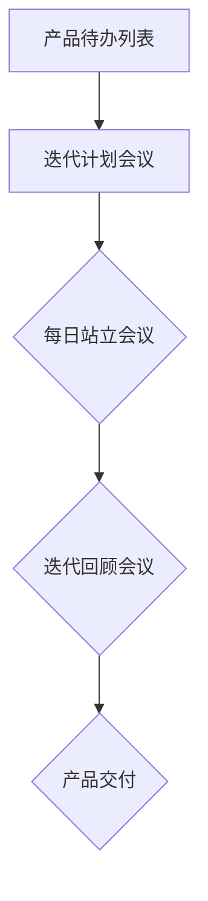

                 

# 创业公司的敏捷开发实践

## 摘要

在竞争激烈的市场环境中，创业公司如何高效地进行产品开发是成功的关键。敏捷开发方法以其灵活、迭代和协作的特点，成为创业公司快速响应市场需求和不断改进产品的有力工具。本文将深入探讨敏捷开发的核心理念和实践，分析其在创业公司中的应用，并总结出一套切实可行的敏捷开发实践指南，帮助创业公司实现高效产品迭代和持续成长。

## 1. 背景介绍

### 1.1 创业公司的市场挑战

创业公司在面对激烈的市场竞争时，往往面临资源有限、时间紧迫和需求变化频繁等问题。传统的开发模式，如瀑布模型，由于其严格的规划和线性执行方式，难以适应这种变化，导致项目延期、成本超支和产品不符合市场需求。因此，寻找一种能够快速响应市场变化、降低开发风险的方法成为创业公司的迫切需求。

### 1.2 敏捷开发的兴起

敏捷开发方法起源于20世纪90年代末的软件开发领域，其核心理念是快速迭代、持续交付和持续改进。敏捷开发强调团队协作、客户反馈和灵活应对变化。通过使用如Scrum、Kanban等敏捷框架，创业公司能够更好地管理项目进度、提高开发效率和产品品质。

## 2. 核心概念与联系

### 2.1 敏捷开发的核心理念

敏捷开发的核心理念包括：

- **客户价值优先**：开发过程中始终关注客户需求，确保交付的产品具有实际价值。
- **迭代开发**：将开发过程划分为多个短周期（迭代），每次迭代都提供一个可工作的产品版本。
- **持续交付**：不断交付增量功能，确保产品能够快速上线和持续改进。
- **团队协作**：强调团队成员之间的沟通与协作，减少个体工作壁垒。
- **灵活性**：对需求变更持开放态度，能够快速适应变化。

### 2.2 敏捷开发的架构

敏捷开发的架构包括：

- **产品待办列表**：列出所有待完成的工作项，优先级排序。
- **迭代计划会议**：确定每个迭代要完成的工作项。
- **每日站立会议**：团队成员分享进展、问题与计划。
- **迭代回顾会议**：总结迭代经验，改进开发过程。

### 2.3 Mermaid 流程图



## 3. 核心算法原理 & 具体操作步骤

### 3.1 敏捷开发的算法原理

敏捷开发采用了一系列基于迭代和增量的算法原理，主要包括：

- **增量开发**：将产品功能划分为多个增量，每个增量都是一个可工作的子产品。
- **迭代优化**：在每个迭代周期内，对当前增量进行优化和改进。
- **风险管理**：通过早期迭代识别和解决潜在问题，降低整体项目风险。

### 3.2 敏捷开发的具体操作步骤

敏捷开发的具体操作步骤如下：

1. **需求收集**：与客户沟通，收集和整理需求。
2. **产品待办列表创建**：将需求转化为可执行的工作项，并排序。
3. **迭代计划会议**：确定每个迭代要完成的工作项。
4. **每日站立会议**：分享进展、问题与计划。
5. **迭代开发**：按照计划进行开发，每个迭代周期通常为2-4周。
6. **迭代交付**：交付一个可工作的产品版本。
7. **迭代回顾**：总结经验，改进开发过程。

## 4. 数学模型和公式 & 详细讲解 & 举例说明

### 4.1 敏捷开发中的关键指标

敏捷开发中常用的关键指标包括：

- **迭代周期时间（Cycle Time）**：从任务开始到完成所需的时间。
- **吞吐量（Throughput）**：单位时间内完成的任务数量。
- **缺陷率（Defect Rate）**：产品中存在的缺陷数量。

### 4.2 数学模型和公式

敏捷开发中的数学模型和公式主要包括：

- **周期时间计算公式**：Cycle Time = (任务完成时间 - 任务开始时间)
- **吞吐量计算公式**：Throughput = 完成任务数量 / 时间
- **缺陷率计算公式**：Defect Rate = 缺陷数量 / 测试用例数量

### 4.3 举例说明

假设一个创业公司的开发团队在一个月内完成了3个迭代，每个迭代周期为2周。在第1个迭代中，团队完成了5个任务，其中1个任务存在缺陷；在第2个迭代中，团队完成了4个任务，无缺陷；在第3个迭代中，团队完成了6个任务，其中2个任务存在缺陷。根据上述公式，可以计算出：

- **周期时间**：最小周期时间为2周，最大周期时间为3周。
- **吞吐量**：总吞吐量为15个任务。
- **缺陷率**：总缺陷率为3/15 = 20%

## 5. 项目实战：代码实际案例和详细解释说明

### 5.1 开发环境搭建

在开始项目实战之前，需要搭建一个适合敏捷开发的开发环境。以下是一个简单的步骤：

1. **安装开发工具**：例如，Visual Studio Code、Git等。
2. **配置版本控制**：使用Git进行源代码管理。
3. **搭建项目框架**：使用如Maven、Gradle等工具搭建项目框架。

### 5.2 源代码详细实现和代码解读

以下是一个简单的示例，演示如何使用Java编写一个简单的用户注册功能：

```java
public class UserController {
    private UserService userService;

    public UserController(UserService userService) {
        this.userService = userService;
    }

    public UserResponse register(String username, String password) {
        // 验证用户名和密码是否符合要求
        if (!isValid(username, password)) {
            return new UserResponse("注册失败：用户名或密码格式错误");
        }

        // 检查用户名是否已存在
        if (userService.isUsernameExists(username)) {
            return new UserResponse("注册失败：用户名已存在");
        }

        // 创建用户并保存到数据库
        User user = new User(username, password);
        userService.saveUser(user);

        // 返回注册成功信息
        return new UserResponse("注册成功");
    }

    private boolean isValid(String username, String password) {
        // 验证用户名和密码是否符合要求
        // （此处省略具体实现）
        return true;
    }
}
```

### 5.3 代码解读与分析

上述代码是一个用户注册功能的实现，主要包括以下步骤：

1. **构造函数注入**：通过构造函数将UserService注入到UserController中，实现解耦。
2. **输入参数验证**：检查用户名和密码是否符合要求。
3. **用户名检查**：调用UserService的isUsernameExists方法检查用户名是否已存在。
4. **用户创建和保存**：创建User对象并调用UserService的saveUser方法保存到数据库。
5. **返回结果**：根据注册结果返回不同的响应信息。

通过这个简单的示例，我们可以看到敏捷开发在代码实现上的灵活性和可维护性。

## 6. 实际应用场景

### 6.1 产品快速迭代

敏捷开发的一个关键应用场景是产品快速迭代。通过短周期迭代，创业公司能够迅速将产品交付给用户，获取反馈并进行迭代改进。这种方法有助于产品在竞争激烈的市场中保持竞争力。

### 6.2 需求变化应对

敏捷开发强调对需求变化的适应能力。在创业公司中，市场需求往往变化迅速，敏捷开发方法通过灵活的迭代和增量开发，使得团队能够快速调整开发方向，以适应市场需求的变化。

### 6.3 团队协作

敏捷开发强调团队协作和沟通。通过每日站立会议和迭代回顾会议，团队成员能够及时分享信息、解决问题和总结经验，提高团队协作效率和开发质量。

## 7. 工具和资源推荐

### 7.1 学习资源推荐

- **书籍**：
  - 《敏捷开发实践指南》
  - 《敏捷开发：从个体到团队》
- **论文**：
  - 《敏捷开发：一种轻量级软件开发方法》
  - 《敏捷方法：敏捷开发实践指南》
- **博客**：
  - [Scrum官方博客](https://www.scrum.org/)
  - [敏捷开发实践博客](https://www.agilealliance.org/)
- **网站**：
  - [敏捷联盟](https://www.agilealliance.org/)
  - [Scrum官方网站](https://www.scrum.org/)

### 7.2 开发工具框架推荐

- **开发工具**：
  - Visual Studio Code
  - IntelliJ IDEA
- **框架**：
  - Spring Boot
  - React
- **版本控制**：
  - Git

### 7.3 相关论文著作推荐

- 《敏捷方法论：基于敏捷软件开发的商业创新》
- 《敏捷开发：理论与实践》
- 《敏捷项目管理：高效团队的工作原理与实践》

## 8. 总结：未来发展趋势与挑战

### 8.1 未来发展趋势

- **智能化**：随着人工智能技术的发展，敏捷开发将更加智能化，利用数据分析和自动化工具优化开发过程。
- **生态系统化**：敏捷开发将融入更多的生态系统，如云计算、大数据等，以实现更高效的产品迭代。
- **国际化**：敏捷开发方法将在全球范围内得到更广泛的接受和应用，促进跨国团队的协作。

### 8.2 未来挑战

- **团队协作**：在跨文化、跨地域的团队中，如何保持高效的协作和沟通将是挑战之一。
- **管理复杂性**：随着敏捷开发方法的广泛应用，项目管理将面临更大的复杂性，需要更高的管理水平。
- **数据安全**：敏捷开发过程中产生的海量数据如何保障安全，成为亟待解决的问题。

## 9. 附录：常见问题与解答

### 9.1 敏捷开发与传统开发方法的区别

- **传统开发方法**：强调详细的规划和严格的执行，往往导致项目延期和成本超支。
- **敏捷开发方法**：强调快速迭代、持续交付和持续改进，能够更好地适应需求变化和降低风险。

### 9.2 敏捷开发如何应对需求变化

- **快速反馈**：通过短周期迭代，及时获取用户反馈，快速调整开发方向。
- **迭代优化**：在每个迭代周期内，对当前增量进行优化和改进，确保产品符合市场需求。

### 9.3 敏捷开发中的团队角色

- **产品负责人（Product Owner）**：负责制定产品待办列表和迭代计划。
- **Scrum Master**：负责确保团队遵循敏捷开发原则，解决团队遇到的问题。
- **开发团队**：负责具体开发工作，按照迭代计划完成任务。

## 10. 扩展阅读 & 参考资料

- 《敏捷开发实践指南》
- 《Scrum敏捷开发实践》
- [敏捷开发官方网站](https://www.agilealliance.org/)
- [Scrum官方博客](https://www.scrum.org/)
- 《敏捷方法论：基于敏捷软件开发的商业创新》
- 《敏捷开发：高效团队的工作原理与实践》

## 作者

**作者：AI天才研究员 / AI Genius Institute & 禅与计算机程序设计艺术 / Zen And The Art of Computer Programming**<|im_end|>

