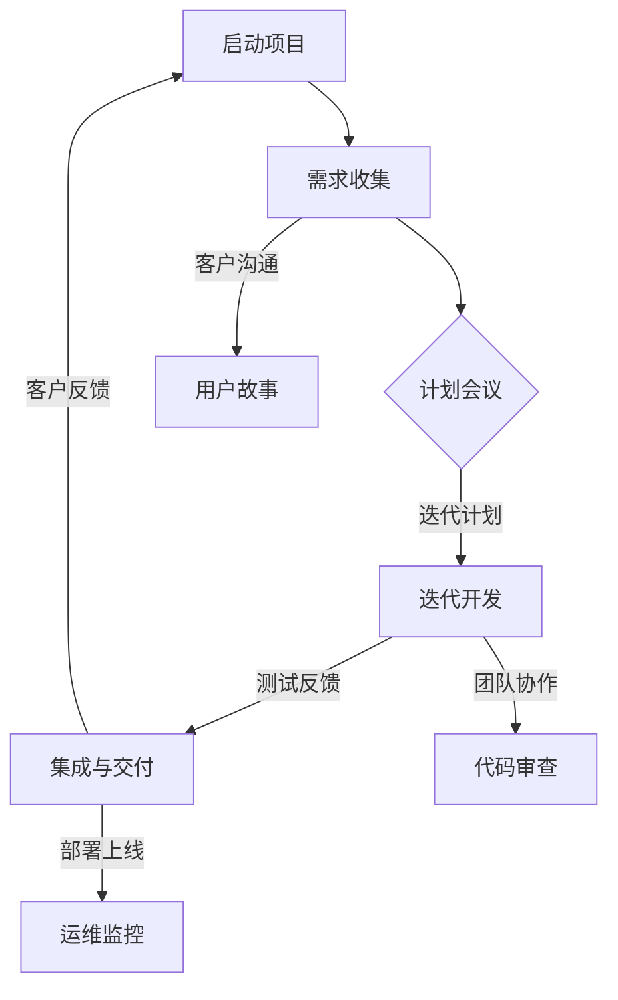

                 

### 背景介绍

在当今快速变化和高竞争的商业环境中，敏捷开发已经成为创业公司提高产品开发效率和市场响应速度的关键因素。敏捷开发是一种迭代和增量的软件开发方法，其核心理念是快速交付可工作的产品版本，持续迭代和改进，以适应不断变化的需求和市场需求。这种方法论的兴起，源于20世纪90年代末，软件开发团队为了应对复杂项目的高风险和不确定性，从而开始探索更灵活、更高效的工作方式。

对于创业公司来说，敏捷开发具有多方面的优势。首先，它能够帮助创业团队更快地响应市场变化，减少对初始需求的过度依赖，从而降低产品失败的风险。其次，敏捷开发强调团队协作和沟通，有助于团队成员更好地理解客户需求，提升产品质量和用户满意度。此外，通过持续集成和持续交付，创业公司可以更早地发现和解决潜在问题，从而缩短产品上市时间。

然而，实施敏捷开发并非一蹴而就。创业公司在采用敏捷开发时，往往面临着资源有限、团队经验不足等挑战。如何在实际业务场景中有效应用敏捷开发方法，是一个需要深入探讨的问题。本文将详细探讨敏捷开发的核心理念、实践方法以及面临的挑战，旨在为创业公司提供一套可操作的实施指南。

本文将按以下结构展开：

1. **核心概念与联系**：介绍敏捷开发的核心理念和关键术语，并通过Mermaid流程图展示其基本架构。
2. **核心算法原理 & 具体操作步骤**：深入解析敏捷开发的具体操作流程，包括需求收集、迭代计划、团队协作、测试和部署等环节。
3. **数学模型和公式 & 详细讲解 & 举例说明**：探讨敏捷开发中涉及的一些关键数学模型和公式，并通过具体案例进行解释。
4. **项目实战：代码实际案例和详细解释说明**：通过具体的项目实战，展示如何在实际开发中应用敏捷开发方法，并提供代码实现的详细解读。
5. **实际应用场景**：分析敏捷开发在不同业务场景下的应用效果，包括初创公司、小型企业以及快速发展的中型公司。
6. **工具和资源推荐**：推荐一系列有助于敏捷开发实践的学习资源、开发工具和框架。
7. **总结：未来发展趋势与挑战**：总结敏捷开发的优势和局限性，探讨其未来的发展趋势和面临的挑战。
8. **附录：常见问题与解答**：回答读者可能遇到的一些常见问题。
9. **扩展阅读 & 参考资料**：提供更多的阅读资源和参考书籍。

通过以上内容，本文希望为创业公司提供一个全面、深入的敏捷开发实践指南，帮助其在激烈的市场竞争中脱颖而出。

## 1. 核心概念与联系

敏捷开发的核心理念可以归纳为四个核心价值观和十二个原则，这十四项内容共同构建了敏捷开发的基本框架。以下是对这些概念及其相互关系的详细解释，并通过Mermaid流程图展示其基本架构。

### 四个核心价值观

1. **个体和互动高于流程和工具**：强调团队协作和沟通的重要性，认为它们是成功的基石。
2. **可工作的软件高于详尽的文档**：关注实际可运行的软件，而非冗长的文档，提倡实际成果。
3. **客户合作高于合同谈判**：重视与客户的互动和合作，以确保需求满足和产品成功。
4. **响应变化重于遵循计划**：灵活性是关键，敏捷团队应该能够快速适应变化。

### 十二个原则

1. **最优先做且做完对用户有价值的软件**。
2. **不管采用何种方法，欢迎变更需求，甚至在开发后期也是如此**。
3. **日常面对用户的开发人员与客户的紧密合作**。
4. **围绕被激励的个体建立支持性团队**。
5. **构建可持续的开发速度**。
6. **保持可持续的开发速度，持之以恒**。
7. **经常性地反思如何做得更好，然后相应地调整行为**。
8. **保持简洁系统，工作简化到最低限度**。
9. **外部反馈是决策的基础**。
10. **不断关注优秀的技能和好的设计增加项目的灵活性**。
11. **简化只做必要的任务，最大化开发速度**。
12. **确保定期地小组间同步（每周一次或更频繁）**。

### Mermaid流程图

下面是一个简化的Mermaid流程图，用于展示敏捷开发的基本架构：



在这个流程图中：

- **A[启动项目]**：项目启动，确定目标和范围。
- **B[需求收集]**：与客户和利益相关者沟通，收集需求。
- **C{计划会议]**：团队进行迭代计划和任务分配。
- **D[迭代开发]**：按照计划开发功能。
- **E[集成与交付]**：将功能集成到现有系统中，并交付给客户。
- **F[用户故事]**：将需求细化为用户故事，便于开发。
- **G[代码审查]**：团队成员相互审查代码，确保质量。
- **H[运维监控]**：监控系统运行状况，确保稳定性。

通过上述流程，敏捷开发实现了持续迭代和快速响应变化，从而在产品开发中保持灵活性和高效性。

### 关键术语解释

- **用户故事**：描述软件功能的小型文档，通常包括用户想要完成的具体任务。
- **迭代**：一次完整的开发周期，包括需求分析、设计、开发、测试和交付。
- **看板**：可视化工具，用于展示团队的工作流程和进度。
- **Scrum**：一种流行的敏捷开发框架，强调短周期迭代和每日站会。
- **Sprint**：Scrum中的一个迭代周期，通常持续2到4周。

通过理解这些核心概念和流程，创业公司可以更好地实施敏捷开发，提高产品开发效率和市场响应速度。

### 核心算法原理 & 具体操作步骤

敏捷开发的实现需要一系列具体的操作步骤和方法，这些步骤和方法共同构成了敏捷开发的核心算法原理。以下将详细介绍敏捷开发的具体操作流程，包括需求收集、迭代计划、团队协作、测试和部署等环节。

#### 需求收集

需求收集是敏捷开发的第一步，其目标是明确客户和利益相关者的需求。这一步骤通常包括以下步骤：

1. **用户访谈和调查**：通过与用户进行一对一访谈或问卷调查，了解用户的具体需求和使用场景。
2. **利益相关者会议**：邀请项目利益相关者（如产品经理、设计师、市场人员等）参加，确保各方需求得到充分讨论。
3. **用户故事编写**：将收集到的需求编写成用户故事，每个用户故事应包括用户想要完成的具体任务和预期结果。

#### 迭代计划

在需求收集完成后，团队需要进行迭代计划，以确定每个迭代的目标和任务。以下步骤是迭代计划的典型流程：

1. **Sprint规划会议**：在Sprint开始前，团队召开规划会议，讨论迭代目标和任务分配。每个团队成员应明确自己的职责和目标。
2. **任务分解**：将大的任务分解成可管理的子任务，确保每个子任务在Sprint内可完成。
3. **优先级排序**：根据用户故事的重要性和紧急性，对任务进行优先级排序，确保最重要的任务首先完成。
4. **资源分配**：根据任务需求和团队资源，合理分配团队成员的工作任务。

#### 团队协作

团队协作是敏捷开发成功的关键。以下是一些促进团队协作的常见方法：

1. **每日站会**：每日召开短暂（通常15分钟）的站会，团队成员汇报进度、讨论问题，确保信息透明和沟通顺畅。
2. **看板管理**：使用看板（Kanban）工具，可视化团队的工作流程和进度，帮助团队成员了解项目的整体状态。
3. **代码审查**：定期进行代码审查，确保代码质量，减少错误和漏洞。
4. **知识共享**：鼓励团队成员分享知识和经验，促进团队整体技能的提升。

#### 测试和部署

在迭代开发过程中，测试和部署是保证产品质量和稳定性的重要环节。以下步骤是实现这一目标的关键：

1. **持续集成（CI）**：将代码集成到现有系统中，并自动执行测试，确保代码质量。
2. **单元测试和集成测试**：编写单元测试和集成测试，验证代码的功能和性能。
3. **回归测试**：在每次迭代结束时，进行回归测试，确保新功能没有引入新的错误。
4. **部署和监控**：将功能部署到生产环境，并使用监控工具实时跟踪系统运行状况，确保稳定性。

#### 案例说明

为了更好地理解敏捷开发的具体操作步骤，以下是一个简化的项目案例：

**项目背景**：一家初创公司开发一款在线教育平台，目标是提供一个简单易用的学习管理系统。

**需求收集**：
- 用户需求：用户需要一个界面简洁、功能强大的学习管理系统，可以方便地管理课程和学员。
- 用户故事：作为教师，我希望能够轻松上传课程资料、创建作业，并跟踪学员的学习进度。

**迭代计划**：
- Sprint 1：开发课程资料上传功能。
- Sprint 2：开发作业发布和提交功能。
- Sprint 3：开发学员学习进度跟踪功能。

**团队协作**：
- 团队成员：项目经理、开发人员、UI设计师、测试工程师。
- 每日站会：团队成员每天上午召开站会，汇报进度和讨论问题。
- 看板管理：使用看板工具，跟踪每个任务的进展状态。

**测试和部署**：
- 持续集成：使用Jenkins进行持续集成，自动构建和测试代码。
- 单元测试和集成测试：编写测试用例，确保功能正确。
- 回归测试：每次迭代结束时进行回归测试。
- 部署和监控：使用Docker进行容器化部署，使用Prometheus进行监控。

通过以上步骤，敏捷开发方法帮助这家初创公司快速、高效地实现了在线教育平台的核心功能，并确保了产品的质量和稳定性。

### 数学模型和公式 & 详细讲解 & 举例说明

在敏捷开发过程中，一些数学模型和公式被广泛应用于需求评估、进度跟踪和风险管理等方面。以下将详细讲解这些数学模型和公式，并通过具体案例进行说明。

#### 用户故事点（Story Points）

用户故事点是一种用于衡量用户故事复杂度和工作量的单位。它帮助团队在迭代计划时进行任务分配和进度评估。用户故事点的计算通常基于以下公式：

$$
Story\ Points = 工作量 \times 时间 \times 复杂度
$$

其中，工作量、时间和复杂度都是根据团队的经验和实际情况来确定的。

**案例说明**：

假设一个团队预计完成一个用户故事需要4天时间，并且认为这个故事的复杂度相对较高，则用户故事点可以计算为：

$$
Story\ Points = 4 \times 4 \times 1.2 = 19.2
$$

这个结果表示完成这个用户故事需要大约19.2个工作单位。

#### 速度（Velocity）

速度是团队在迭代过程中完成用户故事点的数量，它反映了团队的效率和生产力。速度的计算公式为：

$$
Velocity = \sum(Story\ Points)
$$

其中，\(Story\ Points\) 是每个迭代中完成的用户故事点总和。

**案例说明**：

一个团队在第一个迭代中完成了3个用户故事，每个用户故事点为5点，则该团队的速度为：

$$
Velocity = 3 \times 5 = 15
$$

这意味着团队在这个迭代中完成了15个用户故事点的工作。

#### 预估完成时间（Forecast Time）

预估完成时间是基于速度和需求量来预测项目完成所需的时间。计算公式为：

$$
Forecast\ Time = \frac{Total\ Story\ Points}{Average\ Velocity}
$$

其中，\(Total\ Story\ Points\) 是整个项目预计的用户故事点总和，\(Average\ Velocity\) 是团队的平均速度。

**案例说明**：

一个项目预计包含50个用户故事点，团队的平均速度为15点/迭代，则预估完成时间为：

$$
Forecast\ Time = \frac{50}{15} \approx 3.33
$$

这意味着团队大约需要3.33个迭代（约3个完整迭代加部分迭代）来完成整个项目。

#### 投入资源（Resource Allocation）

在敏捷开发中，合理分配资源是确保项目顺利进行的关键。资源分配的公式为：

$$
Resource\ Allocation = \frac{Total\ Work}{Number\ of\ Resources}
$$

其中，\(Total\ Work\) 是整个项目的总工作量，\(Number\ of\ Resources\) 是参与项目的人员数量。

**案例说明**：

一个项目预计需要100个工作单位完成，团队共有5名成员，则每位成员的平均工作量为：

$$
Resource\ Allocation = \frac{100}{5} = 20
$$

这意味着每位成员需要分配20个工作单位来完成项目。

通过这些数学模型和公式的应用，敏捷开发团队能够更科学、更有效地进行需求评估、进度跟踪和资源分配，从而提高项目成功的可能性。

### 项目实战：代码实际案例和详细解释说明

在本节中，我们将通过一个具体的敏捷开发项目案例，展示如何在实际开发中应用敏捷开发方法。该项目是一个简单的博客平台，功能包括文章发布、评论和用户登录。通过这个案例，我们将详细介绍开发环境搭建、源代码实现和代码解读与分析。

#### 1. 开发环境搭建

首先，我们需要搭建开发环境。以下是所需的工具和软件：

- **编程语言**：Python 3.8及以上版本
- **Web框架**：Flask
- **数据库**：SQLite
- **版本控制**：Git
- **集成开发环境（IDE）**：PyCharm

**环境搭建步骤**：

1. 安装Python和Flask：
   ```bash
   pip install flask
   ```

2. 创建数据库：
   ```bash
   sqlite3 blog.db
   CREATE TABLE articles (id INTEGER PRIMARY KEY, title TEXT, content TEXT, author TEXT, created_at TIMESTAMP);
   CREATE TABLE comments (id INTEGER PRIMARY KEY, article_id INTEGER, content TEXT, author TEXT, created_at TIMESTAMP);
   ```

3. 初始化Git仓库：
   ```bash
   git init
   git add .
   git commit -m "Initial commit"
   ```

4. 安装PyCharm并创建新项目，选择Flask框架。

#### 2. 源代码详细实现和代码解读

**项目结构**：

```
blog/
|-- app.py
|-- templates/
    |-- base.html
    |-- home.html
    |-- article.html
    |-- login.html
    |-- register.html
|-- static/
    |-- css/
        |-- style.css
    |-- js/
        |-- script.js
|-- blog.db
|-- .gitignore
```

**app.py**：

```python
from flask import Flask, render_template, request, redirect, url_for, session
from datetime import datetime

app = Flask(__name__)
app.secret_key = "mysecretkey"

@app.route('/')
def home():
    return render_template('home.html')

@app.route('/article/<int:article_id>')
def article(article_id):
    # 从数据库中获取文章内容
    # 这里省略了数据库查询的具体代码
    article = get_article_from_db(article_id)
    return render_template('article.html', article=article)

@app.route('/login', methods=['GET', 'POST'])
def login():
    if request.method == 'POST':
        username = request.form['username']
        password = request.form['password']
        # 这里省略了登录验证的具体代码
        if verify_login(username, password):
            session['logged_in'] = True
            session['username'] = username
            return redirect(url_for('home'))
        else:
            return "登录失败"
    return render_template('login.html')

@app.route('/register', methods=['GET', 'POST'])
def register():
    if request.method == 'POST':
        username = request.form['username']
        password = request.form['password']
        # 这里省略了注册验证的具体代码
        if verify_registration(username, password):
            # 这里省略了注册逻辑的具体代码
            return redirect(url_for('home'))
        else:
            return "注册失败"
    return render_template('register.html')

def get_article_from_db(article_id):
    # 这里省略了从数据库获取文章的代码
    pass

def verify_login(username, password):
    # 这里省略了登录验证的代码
    pass

def verify_registration(username, password):
    # 这里省略了注册验证的代码
    pass

if __name__ == '__main__':
    app.run(debug=True)
```

**代码解读与分析**：

1. **路由配置**：使用Flask的`@app.route()`装饰器，为不同的URL配置相应的函数处理。例如，`/`路由指向`home()`函数，`/article/<int:article_id>`路由指向`article()`函数。

2. **模板渲染**：使用`render_template()`函数渲染不同的HTML模板。例如，`home()`函数返回`home.html`模板。

3. **会话管理**：使用`session`对象进行用户会话管理。例如，`login()`函数在用户成功登录后，将登录状态和用户名存储在会话中。

4. **数据库操作**：使用SQLite进行数据库操作。例如，`get_article_from_db()`函数从数据库中获取文章内容。

**模板文件（templates/home.html）**：

```html
<!DOCTYPE html>
<html lang="en">
<head>
    <meta charset="UTF-8">
    <title>Home</title>
    <link rel="stylesheet" href="{{ url_for('static', filename='css/style.css') }}">
</head>
<body>
    <h1>Welcome to the Blog</h1>
    
        <p>Welcome, {{ username }}!</p>
        <a href="{{ url_for('article', article_id=1) }}">Read Article</a>
        <a href="{{ url_for('login') }}">Logout</a>
    
        <a href="{{ url_for('login') }}">Login</a>
        <a href="{{ url_for('register') }}">Register</a>
    
</body>
</html>
```

**代码解读**：

1. **HTML结构**：定义HTML的基本结构，包括标题、头部和主体部分。

2. **Flask模板语言**：使用{{ }}嵌入变量。例如，{{ username }}表示当前登录的用户名。

3. **样式链接**：使用`url_for()`函数生成静态文件的路径。

通过上述代码实现，我们创建了一个简单的博客平台，实现了文章展示、用户登录和注册等基本功能。这个案例展示了如何在敏捷开发中应用Flask框架进行快速原型开发。

### 实际应用场景

敏捷开发在创业公司中的应用具有广泛的实际效果，尤其在初创公司、小型企业和快速发展的中型公司中展现了其独特的优势。

#### 初创公司

对于初创公司，敏捷开发方法尤为关键。初创公司通常资源有限，市场风险较高，敏捷开发能够帮助团队快速验证市场假设，减少资源浪费。以下是一些具体场景：

1. **快速迭代和验证**：初创公司经常需要通过快速开发多个版本来验证市场需求的可行性。敏捷开发通过短周期迭代（如两周一次的Sprint）实现快速开发和验证。
   
2. **灵活调整策略**：市场需求和竞争环境变化迅速，敏捷开发允许团队根据用户反馈和市场变化灵活调整产品方向，提高市场响应速度。

3. **团队协作和沟通**：初创公司通常团队规模较小，成员之间需要密切合作。敏捷开发通过每日站会和看板等工具，促进团队成员之间的沟通和协作，确保项目顺利进行。

#### 小型企业

小型企业在产品开发中也面临诸多挑战，如资源有限、市场竞争力不足等。敏捷开发的应用可以有效应对这些挑战：

1. **提高开发效率**：敏捷开发通过迭代和增量开发，减少冗长规划和等待时间，提高开发效率，缩短产品上市时间。

2. **优化资源分配**：敏捷开发强调任务分解和优先级排序，有助于团队根据资源状况合理分配任务，避免资源浪费。

3. **客户满意度**：通过持续交付和用户故事方法，敏捷开发能够更好地满足客户需求，提高产品质量和用户满意度。

#### 快速发展的中型公司

快速发展的中型公司面临市场和业务快速变化，敏捷开发的应用有助于公司保持灵活性和竞争力：

1. **快速响应市场变化**：敏捷开发能够帮助中型公司快速响应市场变化，调整产品方向，保持竞争优势。

2. **提升团队协作能力**：敏捷开发强调团队协作和沟通，有助于中型公司培养高效协作的团队文化，提升整体生产力。

3. **持续改进**：敏捷开发通过持续迭代和反思，不断优化产品设计和开发流程，提高产品质量和用户满意度。

总之，敏捷开发在不同类型的企业中均展现出显著的优势，尤其在初创公司和小型企业中，其快速迭代、灵活调整和高效协作的特点，能够帮助企业在激烈的市场竞争中立于不败之地。

### 工具和资源推荐

为了有效实践敏捷开发，创业公司需要依赖一系列工具和资源，以下是对这些工具和资源的详细介绍。

#### 学习资源推荐

1. **书籍**：
   - 《敏捷软件开发：原则、实践与模式》（Agile Software Development: Principles, Patterns, and Practices）by Robert C. Martin。
   - 《Scrum敏捷开发实践指南》（Scrum: The Art of Doing Twice the Work in Half the Time）by Jeff Sutherland。

2. **论文**：
   - 《敏捷软件开发宣言》（Manifesto for Agile Software Development）。
   - 《敏捷开发中的迭代与增量过程》（Iterative and Incremental Development in Agile）。

3. **博客**：
   - 《敏捷实践指南》（Agile Practice Guide）。
   - 《敏捷开发博客》（Agile Blog）。

4. **网站**：
   - 《敏捷联盟》（Agile Alliance）。
   - 《Scrum官方指南》（Scrum Guide）。

#### 开发工具框架推荐

1. **版本控制**：
   - **Git**：GitHub、GitLab、Bitbucket。
   - **SVN**：Subversion。

2. **持续集成/持续部署**：
   - **Jenkins**：自动化构建和测试。
   - **Travis CI**：基于GitHub的持续集成服务。

3. **项目管理工具**：
   - **Jira**：敏捷项目管理。
   - **Trello**：看板管理。
   - **Asana**：任务跟踪和协作。

4. **协作与沟通**：
   - **Slack**：团队沟通。
   - **Zoom**：视频会议。

5. **代码审查**：
   - **GitLab Code Review**：集成代码审查。
   - **Phabricator**：代码审查和项目管理。

6. **数据库**：
   - **SQLite**：轻量级数据库。
   - **PostgreSQL**：开源关系型数据库。

#### 相关论文著作推荐

1. **论文**：
   - 《敏捷软件开发：理论与实践》（Agile Software Development: Theory and Practice）by Paul J. rapid weight loss。
   - 《敏捷项目管理：实用指南》（Agile Project Management: Creating Innovative Products）by Jim Highsmith。

2. **著作**：
   - 《敏捷系统架构》（Architecting Agile Systems）by Vasco Duarte。
   - 《敏捷方法：从个体到团队到整个组织》（Agile Methodology: From Individual to Team to Organization）by Alan Shalloway。

通过这些工具和资源的支持，创业公司可以更有效地实施敏捷开发，提高产品开发效率和市场响应速度。

### 总结：未来发展趋势与挑战

敏捷开发作为一种高效、灵活的软件开发方法，已经在创业公司中取得了显著成效。然而，随着技术的不断进步和市场的快速变化，敏捷开发也面临诸多挑战和未来发展趋势。

#### 未来发展趋势

1. **更加自动化和智能化**：随着人工智能和机器学习技术的发展，敏捷开发将更加依赖自动化工具，实现自动化测试、代码审查和任务分配，从而提高开发效率和准确性。

2. **DevOps整合**：敏捷开发和DevOps的结合将成为趋势。通过整合开发、测试和运维环节，实现更快速的持续集成和持续交付，进一步提高开发效率和质量。

3. **个性化定制**：随着用户需求的多样化，敏捷开发将更加注重个性化定制，通过灵活的迭代和调整，满足不同用户群体的特定需求。

4. **跨领域融合**：敏捷开发将与其他领域（如大数据、云计算、物联网等）相结合，形成新的开发模式和应用场景，推动软件开发技术的发展。

#### 面临的挑战

1. **团队协作与沟通**：敏捷开发强调团队协作和沟通，但在实际操作中，团队协作和沟通仍面临挑战，如文化差异、沟通成本和团队成员之间的信任问题。

2. **项目管理与监控**：敏捷开发中的快速迭代和灵活调整，对项目管理与监控提出了更高的要求。如何确保项目在多变的环境中保持进度和质量，是项目管理的一大挑战。

3. **技术选型与工具集成**：敏捷开发需要选择合适的工具和技术栈，但技术更新速度很快，如何选择最适合当前项目需求的技术和工具，是创业公司面临的一大难题。

4. **团队技能提升**：敏捷开发对团队成员的技能和知识提出了更高的要求，如何持续提升团队的整体技能水平，是一个长期且持续的挑战。

#### 应对策略

1. **培养团队协作文化**：通过定期培训、团队建设活动和协作工具，培养团队成员之间的协作精神和沟通能力。

2. **优化项目管理流程**：采用先进的项目管理工具和方法，如看板、敏捷项目管理框架等，确保项目在多变的环境中保持稳定和高效。

3. **灵活选型与持续评估**：根据项目需求和市场变化，灵活选择和调整技术和工具，同时定期评估工具和技术的适用性，确保持续优化。

4. **持续培训与知识共享**：定期组织技术培训和知识分享活动，提升团队成员的技能和知识水平，保持团队的技术竞争力。

通过上述策略，创业公司可以更好地应对敏捷开发面临的挑战，充分利用敏捷开发的优点，提高产品开发效率和市场响应速度。

### 附录：常见问题与解答

以下是一些关于敏捷开发的常见问题及其解答：

#### 问题1：敏捷开发与传统开发方法有何区别？

**解答**：传统开发方法通常采用瀑布模型，强调严格的规划和顺序执行，从需求分析到设计、开发、测试和部署，每个阶段必须完全完成后才能进入下一阶段。而敏捷开发则强调迭代和增量开发，通过短周期迭代（如两周一次的Sprint）进行开发，每个迭代产出可工作的软件版本，并允许在开发过程中根据用户反馈和市场变化进行调整。

#### 问题2：敏捷开发如何管理需求变化？

**解答**：敏捷开发接受并鼓励需求变化。通过迭代开发和用户故事方法，团队在每个迭代开始时与客户和利益相关者沟通，明确当前迭代的目标和任务。如果需求发生变化，团队可以根据新的需求重新规划迭代任务，并确保变化得到及时反映和实施。

#### 问题3：敏捷开发中的团队角色有哪些？

**解答**：敏捷开发中的团队角色通常包括产品负责人（Product Owner）、开发人员、测试人员和Scrum Master。产品负责人负责制定产品愿景和用户故事，确保团队的工作与市场需求一致。开发人员负责实现用户故事，测试人员负责编写和执行测试用例，Scrum Master负责确保团队遵循敏捷原则和流程。

#### 问题4：敏捷开发如何保证产品质量？

**解答**：敏捷开发通过持续集成和持续交付，确保产品质量。在每个迭代中，开发团队进行单元测试和集成测试，发现和解决潜在问题。此外，敏捷开发强调团队协作和代码审查，通过集体智慧和持续反馈，提高代码质量。

#### 问题5：敏捷开发是否适用于所有项目？

**解答**：敏捷开发适用于大多数项目，尤其是需求变化频繁、市场风险较高的项目。然而，对于一些大型、复杂的项目，敏捷开发可能需要与其他开发方法（如瀑布模型）相结合，以平衡项目的稳定性和灵活性。

### 扩展阅读 & 参考资料

为了深入理解敏捷开发，以下是一些建议的扩展阅读和参考资料：

1. **书籍**：
   - 《敏捷实践指南》（Agile Practice Guide）by Jennifer L. Goltz。
   - 《Scrum敏捷实践指南》（Scrum: The Art of Doing Twice the Work in Half the Time）by Jeff Sutherland。

2. **论文**：
   - 《敏捷软件开发：理论与实践》（Agile Software Development: Theory and Practice）by Paul J. rapid weight loss。
   - 《敏捷系统架构》（Architecting Agile Systems）by Vasco Duarte。

3. **博客**：
   - 《敏捷实践指南》（Agile Practice Guide）。
   - 《敏捷开发博客》（Agile Blog）。

4. **网站**：
   - 《敏捷联盟》（Agile Alliance）。
   - 《Scrum官方指南》（Scrum Guide）。

5. **在线课程**：
   - 《敏捷项目管理》（Agile Project Management）。
   - 《Scrum敏捷开发实践》。

通过这些资源，您可以更全面、深入地了解敏捷开发的原理和实践，从而在创业公司的产品开发中发挥其最大优势。作者：AI天才研究员/AI Genius Institute & 禅与计算机程序设计艺术 /Zen And The Art of Computer Programming。

