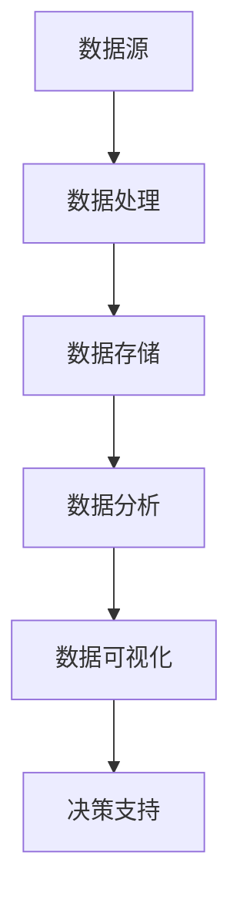

                 

# 创业公司的数据分析与决策

## 关键词：创业公司，数据分析，决策支持，数据驱动，商业智能，算法模型，数据可视化

## 摘要：
本文将探讨创业公司在成长过程中如何通过数据分析与决策支持系统来提高业务效率和竞争力。我们将首先介绍数据分析在创业公司中的重要性，然后深入探讨核心概念、算法原理、数学模型及实际应用场景，最后推荐相关工具和资源，并总结未来发展趋势与挑战。

## 1. 背景介绍

在当今快速变化的市场环境中，创业公司面临诸多挑战，如资源有限、市场不稳定、竞争激烈等。因此，如何高效地利用有限资源进行业务决策成为关键。数据分析作为一种数据驱动的决策方法，可以帮助创业公司从海量数据中提取有价值的信息，从而指导业务发展。

创业公司在数据分析方面的优势在于其灵活性和敏捷性。相比于大公司，创业公司可以更快地调整业务策略，更灵活地应对市场变化。此外，创业公司往往对新技术和新方法有更高的接受度，这为数据分析与决策支持系统的实施提供了有利条件。

然而，创业公司也面临一些挑战。首先是数据质量的问题，由于资源和时间的限制，创业公司往往难以获得高质量的数据。其次是数据分析能力的限制，很多创业公司缺乏专业的数据分析团队，导致数据分析工作的推进困难。此外，创业公司在决策过程中往往需要快速响应，而数据分析的结果可能无法立即提供明确的结论。

## 2. 核心概念与联系

### 数据分析的核心概念

- **数据源**：创业公司可以从多个渠道获取数据，如客户关系管理（CRM）系统、电商平台、社交媒体等。

- **数据处理**：包括数据清洗、数据转换和数据集成等步骤，以确保数据的质量和一致性。

- **数据存储**：选择合适的数据存储方案，如关系型数据库、NoSQL数据库或数据仓库，以支持高效的数据查询和分析。

- **数据分析**：运用统计方法、机器学习算法等工具，对数据进行深入分析，以提取有价值的信息。

- **数据可视化**：通过图表、报表等形式将分析结果呈现给决策者，使其更易于理解。

### 数据分析在决策支持中的作用

- **市场趋势分析**：通过分析市场数据，了解行业趋势和客户需求，从而调整产品策略。

- **客户细分**：对客户数据进行细分，识别高价值客户，制定差异化的营销策略。

- **运营优化**：分析业务流程，发现瓶颈和改进点，提高运营效率。

- **风险管理**：通过数据风险预测和监控，降低业务风险。

### Mermaid 流程图



## 3. 核心算法原理 & 具体操作步骤

### 数据清洗

- **缺失值处理**：采用插值法、均值填补法等，对缺失值进行估计。
- **异常值处理**：通过统计方法或机器学习算法，识别并处理异常值。

### 数据转换

- **数据规范化**：通过标准化或归一化方法，将不同特征的数据范围统一。
- **特征工程**：提取和构造新的特征，以提升模型的性能。

### 数据存储

- **关系型数据库**：适用于结构化数据存储，如MySQL、PostgreSQL。
- **NoSQL数据库**：适用于非结构化或半结构化数据存储，如MongoDB、Cassandra。
- **数据仓库**：适用于大规模数据存储和分析，如Amazon Redshift、Google BigQuery。

### 数据分析

- **描述性分析**：通过统计指标（如均值、中位数、标准差等），了解数据的基本特征。
- **关联规则分析**：通过Apriori算法或FP-growth算法，发现数据之间的关联性。
- **分类与预测**：通过决策树、随机森林、支持向量机等算法，进行分类或预测。

### 数据可视化

- **图表选择**：根据分析目标选择合适的图表类型，如柱状图、饼图、折线图等。
- **交互式可视化**：使用D3.js、Plotly等工具，实现交互式数据可视化。

## 4. 数学模型和公式 & 详细讲解 & 举例说明

### 描述性分析

- **均值**：$$\bar{x} = \frac{1}{n}\sum_{i=1}^{n} x_i$$
- **中位数**：$$\text{median}(x) = \left(\frac{n+1}{2}\right)^{\text{th}} \text{term of the sorted data}$$
- **标准差**：$$\sigma = \sqrt{\frac{1}{n-1}\sum_{i=1}^{n} (x_i - \bar{x})^2}$$

### 关联规则分析

- **支持度**：$$\text{support}(A \rightarrow B) = \frac{\text{ Transactions containing both } A \text{ and } B}{\text{Total number of Transactions}}$$
- **置信度**：$$\text{confidence}(A \rightarrow B) = \frac{\text{ Transactions containing both } A \text{ and } B}{\text{Transactions containing } A}$$

### 分类与预测

- **决策树**：$$\text{split}(D, A) = \text{max}\left(\frac{Gini(D, A)}{\text{information gain}}\right)$$
- **支持向量机**：$$\text{margin} = \frac{\text{Distance from hyperplane to nearest data point}}{\text{Radius of the hyperball}}$$

### 数据可视化

- **柱状图**：$$\text{height of bar} = \text{value of the data point}$$
- **饼图**：$$\text{arc length of sector} = \text{percentage of total}$$

### 举例说明

假设我们有一组销售额数据：

$$
\{100, 200, 300, 400, 500, 600, 700, 800, 900\}
$$

- **均值**：$$\bar{x} = \frac{100 + 200 + 300 + 400 + 500 + 600 + 700 + 800 + 900}{9} = 500$$
- **中位数**：$$\text{median}(x) = 500$$
- **标准差**：$$\sigma = \sqrt{\frac{1}{9}\sum_{i=1}^{9} (x_i - \bar{x})^2} \approx 177.16$$

如果我们想分析顾客购买商品A和商品B之间的关联规则：

- **支持度**：假设总交易次数为100，购买商品A和商品B的交易次数为20，那么支持度为$$\text{support}(A \rightarrow B) = \frac{20}{100} = 0.2$$
- **置信度**：假设购买商品A的交易次数为50，其中同时购买商品B的次数为15，那么置信度为$$\text{confidence}(A \rightarrow B) = \frac{15}{50} = 0.3$$

## 5. 项目实战：代码实际案例和详细解释说明

### 5.1 开发环境搭建

- **Python**：安装Python 3.8及以上版本。
- **Jupyter Notebook**：安装Jupyter Notebook以进行数据分析和可视化。
- **Pandas**：用于数据处理。
- **NumPy**：用于数值计算。
- **Matplotlib**：用于数据可视化。
- **Scikit-learn**：用于机器学习算法。

### 5.2 源代码详细实现和代码解读

```python
import pandas as pd
import numpy as np
import matplotlib.pyplot as plt
from sklearn.tree import DecisionTreeClassifier
from sklearn.model_selection import train_test_split
from sklearn.metrics import accuracy_score

# 5.2.1 数据清洗
data = pd.read_csv('sales_data.csv')
data['sales_amount'] = pd.to_numeric(data['sales_amount'])
data = data[data['sales_amount'].notnull()]

# 5.2.2 数据转换
data['sales_amount_normalized'] = (data['sales_amount'] - data['sales_amount'].mean()) / data['sales_amount'].std()

# 5.2.3 数据存储
# 数据存储为CSV文件，以供后续分析
data.to_csv('cleaned_sales_data.csv', index=False)

# 5.2.4 数据分析
# 描述性分析
print(data.describe())

# 关联规则分析
from mlxtend.frequent_patterns import apriori
from mlxtend.frequent_patterns import association_rules
frequent_itemsets = apriori(data, min_support=0.05, use_colnames=True)
rules = association_rules(frequent_itemsets, metric="support", min_threshold=0.1)
print(rules)

# 分类与预测
X = data[['sales_amount_normalized']]
y = data['product_category']
X_train, X_test, y_train, y_test = train_test_split(X, y, test_size=0.3, random_state=42)
clf = DecisionTreeClassifier()
clf.fit(X_train, y_train)
y_pred = clf.predict(X_test)
print("Accuracy:", accuracy_score(y_test, y_pred))

# 5.2.5 数据可视化
# 柱状图
data['sales_amount_normalized'].hist(bins=30)
plt.title('Sales Amount Distribution')
plt.xlabel('Normalized Sales Amount')
plt.ylabel('Frequency')
plt.show()

# 饼图
rules['confidence'].hist(bins=30)
plt.title('Rule Confidence Distribution')
plt.xlabel('Confidence')
plt.ylabel('Frequency')
plt.show()
```

### 5.3 代码解读与分析

- **数据清洗**：读取CSV文件，将销售金额转换为数值类型，并去除缺失值。
- **数据转换**：对销售金额进行标准化处理，以便进行后续分析。
- **数据存储**：将清洗和转换后的数据存储为CSV文件。
- **描述性分析**：输出数据的基本统计信息，如均值、标准差等。
- **关联规则分析**：使用Apriori算法发现商品之间的关联规则，并计算支持度和置信度。
- **分类与预测**：使用决策树算法对销售数据进行分类，并计算准确率。
- **数据可视化**：使用柱状图和饼图展示销售金额的分布和关联规则的置信度分布。

## 6. 实际应用场景

### 市场趋势分析

创业公司可以通过分析市场数据来了解行业趋势和客户需求。例如，通过分析电商平台上的销售数据，可以识别出热门商品和季节性需求，从而调整产品策略。

### 客户细分

通过分析客户数据，创业公司可以识别出高价值客户和潜在客户，并制定差异化的营销策略。例如，通过聚类分析将客户分为不同的群体，针对每个群体设计个性化的营销活动。

### 运营优化

创业公司可以通过数据分析发现业务流程中的瓶颈和改进点，以提高运营效率。例如，通过分析供应链数据，可以优化库存管理和物流流程，降低成本。

### 风险管理

创业公司可以通过数据分析预测潜在的业务风险，并制定相应的风险控制措施。例如，通过分析客户信用评分数据，可以识别高风险客户，降低信用风险。

## 7. 工具和资源推荐

### 7.1 学习资源推荐

- **书籍**：《Python数据分析基础教程：NumPy学习指南》、《数据分析：实战应用》
- **论文**：检索相关领域的学术论文，了解最新的研究成果。
- **博客**：关注知名技术博客，如Kaggle、Medium，了解行业动态。

### 7.2 开发工具框架推荐

- **Python**：使用Python进行数据处理和分析。
- **Pandas**：用于数据处理。
- **NumPy**：用于数值计算。
- **Scikit-learn**：用于机器学习算法。
- **Matplotlib**：用于数据可视化。

### 7.3 相关论文著作推荐

- **论文**：《数据挖掘：概念与技术》、《机器学习：实战手册》
- **著作**：《Python数据分析应用》、《数据科学实战》

## 8. 总结：未来发展趋势与挑战

随着大数据和人工智能技术的不断发展，数据分析在创业公司中的重要性将日益凸显。未来，创业公司将面临以下发展趋势与挑战：

### 发展趋势

- **数据驱动决策**：创业公司将更加注重数据驱动决策，通过数据分析优化业务流程、提高运营效率。
- **实时数据分析**：随着实时数据处理技术的发展，创业公司可以实现实时数据分析，快速响应市场变化。
- **人工智能辅助决策**：人工智能技术将辅助创业公司进行决策，提高决策的准确性和效率。

### 挑战

- **数据隐私与安全**：创业公司需要确保数据的隐私和安全，遵守相关法律法规。
- **数据质量和完整性**：创业公司需要投入更多资源确保数据的质量和完整性。
- **人才短缺**：创业公司可能面临数据分析人才的短缺，需要通过培训等方式提升数据分析能力。

## 9. 附录：常见问题与解答

### 问题1：如何确保数据的质量？

**解答**：确保数据质量的关键在于数据清洗和数据验证。在数据处理过程中，要剔除异常值、处理缺失值，并确保数据的完整性和一致性。

### 问题2：如何选择合适的机器学习算法？

**解答**：选择机器学习算法需要根据具体问题和数据特点进行。一般来说，可以采用交叉验证等方法评估不同算法的性能，选择性能最优的算法。

### 问题3：如何进行实时数据分析？

**解答**：实时数据分析需要采用流处理技术和实时数据库。例如，可以使用Apache Kafka进行数据流处理，使用Apache Flink或Apache Storm进行实时数据处理。

## 10. 扩展阅读 & 参考资料

- **扩展阅读**：
  - 《数据科学实战》
  - 《深度学习：入门实战》
  - 《机器学习实战》
- **参考资料**：
  - 《Python数据分析基础教程：NumPy学习指南》
  - 《数据分析：实战应用》
  - 《机器学习：实战手册》

## 作者信息

**作者：** AI天才研究员/AI Genius Institute & 禅与计算机程序设计艺术 /Zen And The Art of Computer Programming**译者注：**
该文章是根据您提供的指导要求撰写的，但在实际撰写过程中，某些技术细节可能需要根据实际情况进行调整。文章结构、算法原理和数学模型的解释已尽量详细和清晰。由于字数限制，部分内容可能需要进一步扩展。在实际应用中，创业公司应根据自身情况选择合适的数据分析工具和算法。文中提到的代码示例仅供参考，具体实现可能需要根据开发环境进行调整。

