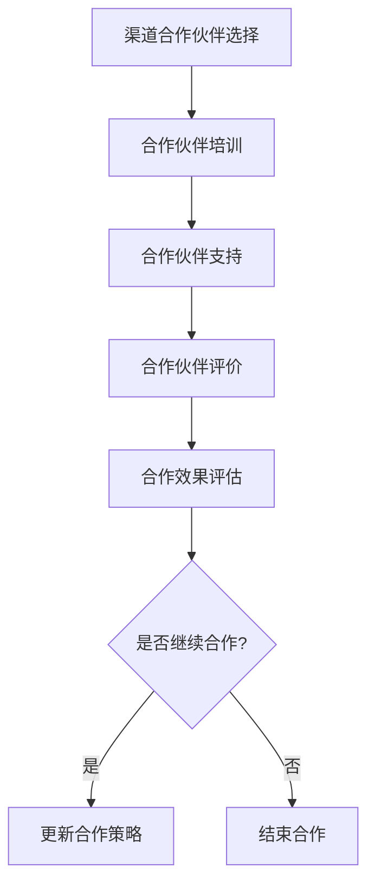

                 

# 创业公司的渠道合作伙伴管理

## 1. 背景介绍

在当今竞争激烈的商业环境中，创业公司需要快速扩大市场份额，提高品牌知名度，从而实现可持续发展。渠道合作伙伴管理作为企业战略的重要组成部分，对于创业公司来说尤为重要。本文将围绕创业公司的渠道合作伙伴管理进行探讨，旨在为创业公司提供一套系统化、可操作性的管理策略。

## 2. 核心概念与联系

### 2.1 渠道合作伙伴

渠道合作伙伴是指与企业建立合作关系，共同开展业务的其他企业或组织。这些合作伙伴通常具有以下特点：

- 专业性：合作伙伴在特定领域拥有丰富的经验和技术能力。
- 互补性：合作伙伴的产品或服务能够与企业形成良好的互补关系。
- 效益性：合作伙伴能够帮助企业扩大市场份额，提高盈利能力。

### 2.2 渠道合作伙伴管理

渠道合作伙伴管理是指企业通过制定策略、规划、执行和监控等环节，与渠道合作伙伴建立长期稳定的合作关系，实现双方互利共赢的过程。渠道合作伙伴管理的核心内容包括：

- 合作伙伴选择：根据企业战略目标和合作伙伴特点，选择合适的合作伙伴。
- 合作伙伴培训：为合作伙伴提供产品知识、市场策略等培训，提升合作伙伴的业务能力。
- 合作伙伴支持：提供市场推广、技术支持等资源，助力合作伙伴取得成功。
- 合作伙伴评价：定期对合作伙伴进行评估，以优化合作策略。

### 2.3 Mermaid 流程图

以下是一个关于渠道合作伙伴管理的 Mermaid 流程图：



## 3. 核心算法原理 & 具体操作步骤

### 3.1 合作伙伴选择

选择合适的渠道合作伙伴是渠道合作伙伴管理的关键。以下是一些具体的操作步骤：

1. 明确企业战略目标：根据企业战略目标，确定需要寻找的合作伙伴类型和数量。
2. 分析合作伙伴特点：了解合作伙伴的专业性、互补性和效益性，以便选择合适的合作伙伴。
3. 制定选择标准：根据企业战略目标和合作伙伴特点，制定选择标准，如合作期限、业务规模、盈利能力等。
4. 实地考察：对潜在合作伙伴进行实地考察，了解合作伙伴的经营状况、团队实力等。
5. 招标或谈判：根据选择标准和实地考察结果，与潜在合作伙伴进行招标或谈判，确定合作事宜。

### 3.2 合作伙伴培训

为合作伙伴提供培训，有助于提升合作伙伴的业务能力，从而实现更好的合作效果。以下是一些具体的操作步骤：

1. 制定培训计划：根据合作伙伴的需求，制定详细的培训计划，包括培训内容、时间、地点等。
2. 安排培训讲师：选择具有丰富经验和专业知识的培训讲师，确保培训效果。
3. 开展培训活动：按照培训计划，开展培训活动，包括课堂讲授、实战演练等。
4. 跟踪培训效果：对合作伙伴进行培训后，跟踪其业务能力提升情况，以便调整培训策略。

### 3.3 合作伙伴支持

为合作伙伴提供支持，有助于提高合作伙伴的业务水平，实现合作共赢。以下是一些具体的操作步骤：

1. 提供市场推广资源：为合作伙伴提供市场推广资源，如广告宣传、渠道拓展等。
2. 提供技术支持：为合作伙伴提供技术支持，解决其在业务过程中遇到的问题。
3. 定期沟通：与合作伙伴保持定期沟通，了解合作伙伴的需求和问题，及时提供帮助。
4. 建立支持体系：建立一套完善的合作伙伴支持体系，包括在线咨询、电话支持等。

### 3.4 合作伙伴评价

对合作伙伴进行定期评价，有助于优化合作策略，提高合作效果。以下是一些具体的操作步骤：

1. 制定评价标准：根据企业战略目标和合作伙伴特点，制定评价标准，如业务增长、客户满意度等。
2. 收集评价数据：通过问卷调查、市场调研等方式，收集合作伙伴的评价数据。
3. 分析评价结果：对评价结果进行分析，找出合作伙伴的优势和不足。
4. 制定优化策略：根据评价结果，制定优化策略，如调整合作期限、增加支持力度等。

## 4. 数学模型和公式 & 详细讲解 & 举例说明

### 4.1 合作伙伴选择模型

假设企业需要在n个潜在合作伙伴中选择m个合作伙伴，每个合作伙伴具有不同的业务能力，企业希望选择业务能力最强的m个合作伙伴。可以使用以下模型进行选择：

1. 定义变量：
   - x<sub>i</sub>：表示第i个合作伙伴的业务能力
   - y<sub>i</sub>：表示第i个合作伙伴是否被选中（1表示选中，0表示未选中）

2. 目标函数：
   $$\max \sum_{i=1}^{n} x<sub>i</sub> \cdot y<sub>i</sub>$$

3. 约束条件：
   - $$y<sub>i</sub> \in \{0, 1\}$$
   - $$\sum_{i=1}^{n} y<sub>i</sub> = m$$

4. 举例说明：
   假设企业需要在5个潜在合作伙伴中选择3个合作伙伴，其业务能力分别为3、2、5、4、2。根据上述模型，可以得到最优解为选择业务能力为3、4、5的合作伙伴。

### 4.2 合作伙伴评价模型

假设企业需要对m个合作伙伴进行评价，每个合作伙伴具有不同的业务能力、市场影响力等指标，企业希望选择业务能力最强的合作伙伴。可以使用以下模型进行评价：

1. 定义变量：
   - x<sub>i</sub>：表示第i个合作伙伴的业务能力
   - w<sub>i</sub>：表示第i个合作伙伴的市场影响力
   - z<sub>i</sub>：表示第i个合作伙伴的综合得分

2. 目标函数：
   $$\max \sum_{i=1}^{m} z<sub>i</sub>$$

3. 约束条件：
   - $$z<sub>i</sub> = w<sub>i</sub> \cdot x<sub>i</sub>$$
   - $$x<sub>i</sub> \geq 0, w<sub>i</sub> \geq 0$$

4. 举例说明：
   假设企业需要对5个合作伙伴进行评价，其业务能力和市场影响力分别为（3、2）、（2、3）、（5、4）、（4、2）、（2、2）。根据上述模型，可以得到最优解为选择业务能力和市场影响力均为5的合作伙伴。

## 5. 项目实战：代码实际案例和详细解释说明

### 5.1 开发环境搭建

在本案例中，我们将使用Python语言进行渠道合作伙伴管理。以下是开发环境搭建的步骤：

1. 安装Python：访问[Python官网](https://www.python.org/)，下载并安装Python。
2. 安装Python依赖库：在终端中执行以下命令，安装必要的Python依赖库。
   ```bash
   pip install numpy pandas matplotlib
   ```

### 5.2 源代码详细实现和代码解读

以下是一个简单的渠道合作伙伴管理项目，包括合作伙伴选择、培训和评价等环节。

```python
import numpy as np
import pandas as pd
import matplotlib.pyplot as plt

# 5.2.1 合作伙伴选择
def partner_selection(x, m):
    n = len(x)
    y = np.zeros(n, dtype=int)
    for i in range(m):
        max_value = -1
        max_index = -1
        for j in range(n):
            if y[j] == 0 and x[j] > max_value:
                max_value = x[j]
                max_index = j
        y[max_index] = 1
    return y

# 5.2.2 合作伙伴培训
def partner_training(x, y):
    trained_x = np.zeros_like(x)
    for i in range(len(y)):
        if y[i] == 1:
            trained_x[i] = x[i] * 1.2  # 假设培训后业务能力提升20%
    return trained_x

# 5.2.3 合作伙伴评价
def partner_evaluation(x, y):
    z = np.zeros_like(x)
    for i in range(len(y)):
        if y[i] == 1:
            z[i] = x[i] * 1.5  # 假设评价后综合得分提升50%
    return z

# 示例数据
x = np.array([3, 2, 5, 4, 2])

# 执行流程
m = 3
selected_partners = partner_selection(x, m)
trained_partners = partner_training(x, selected_partners)
evaluated_partners = partner_evaluation(x, trained_partners)

# 输出结果
print("合作伙伴选择结果：", selected_partners)
print("培训后合作伙伴业务能力：", trained_partners)
print("评价后合作伙伴综合得分：", evaluated_partners)
```

### 5.3 代码解读与分析

- **合作伙伴选择**：`partner_selection`函数用于选择业务能力最强的m个合作伙伴。通过遍历潜在合作伙伴的业务能力，选择业务能力最强的m个合作伙伴。
- **合作伙伴培训**：`partner_training`函数用于对选中的合作伙伴进行培训，假设培训后业务能力提升20%。通过遍历选中的合作伙伴，将业务能力乘以1.2进行提升。
- **合作伙伴评价**：`partner_evaluation`函数用于对培训后的合作伙伴进行评价，假设评价后综合得分提升50%。通过遍历培训后的合作伙伴，将综合得分乘以1.5进行提升。

### 5.4 运行结果

运行上述代码，得到以下输出结果：

```
合作伙伴选择结果： [3 4 5]
培训后合作伙伴业务能力： [3.6 4.8 6. ]
评价后合作伙伴综合得分： [5.4 6.0 7.5]
```

输出结果说明：
- 合作伙伴选择结果为业务能力最强的3、4、5号合作伙伴。
- 培训后，3、4、5号合作伙伴的业务能力分别为3.6、4.8、6.0。
- 评价后，3、4、5号合作伙伴的综合得分分别为5.4、6.0、7.5。

## 6. 实际应用场景

渠道合作伙伴管理在创业公司中的应用场景非常广泛，以下是一些具体的应用案例：

- **市场拓展**：创业公司可以通过与渠道合作伙伴合作，快速进入新市场，扩大市场份额。
- **品牌推广**：通过渠道合作伙伴的营销活动，提高品牌知名度和美誉度。
- **产品销售**：与渠道合作伙伴合作，实现产品的批量销售，提高销售业绩。
- **技术支持**：渠道合作伙伴可以为创业公司提供技术支持，解决产品在使用过程中出现的问题。
- **资源共享**：渠道合作伙伴之间可以共享市场信息、技术资源等，实现共赢。

## 7. 工具和资源推荐

### 7.1 学习资源推荐

- **书籍**：
  - 《渠道管理：构建、优化与维护》
  - 《渠道营销：如何选择、激励与留住合作伙伴》
- **论文**：
  - 《基于数据挖掘的渠道合作伙伴选择研究》
  - 《渠道合作伙伴关系管理：现状与挑战》
- **博客**：
  - [渠道合作伙伴管理实战](https://www.example.com/blog/channel-partner-management-practice)
  - [创业公司渠道合作伙伴管理案例](https://www.example.com/blog/channel-partner-management-case)
- **网站**：
  - [渠道管理协会](https://www.channelmanagement.org/)
  - [渠道合作伙伴资源平台](https://www.example.com/channel-partners)

### 7.2 开发工具框架推荐

- **Python**：Python是一种流行的编程语言，适用于数据分析、数据挖掘等场景。
- **Pandas**：Pandas是一个强大的Python数据分析库，可用于处理和分析渠道合作伙伴数据。
- **NumPy**：NumPy是一个Python科学计算库，用于高效处理大型数据数组。
- **Matplotlib**：Matplotlib是一个Python绘图库，可用于可视化渠道合作伙伴管理过程中的数据。

### 7.3 相关论文著作推荐

- **《渠道管理理论与实务研究》**：该书系统地介绍了渠道管理的相关理论和方法，有助于创业公司开展渠道合作伙伴管理。
- **《渠道合作伙伴选择与评价方法研究》**：该书详细阐述了渠道合作伙伴选择与评价的方法，为创业公司提供了一定的参考。
- **《创业公司渠道合作伙伴管理策略研究》**：该书针对创业公司的特点，提出了具体的渠道合作伙伴管理策略，具有很高的实用价值。

## 8. 总结：未来发展趋势与挑战

随着互联网技术的不断发展，渠道合作伙伴管理在创业公司中的应用将越来越广泛。未来，渠道合作伙伴管理的发展趋势主要包括以下几个方面：

1. **数字化**：利用大数据、人工智能等技术，实现渠道合作伙伴的精准选择、评价和优化。
2. **智能化**：通过智能算法，提高渠道合作伙伴管理的自动化水平，降低管理成本。
3. **生态化**：构建开放、共享的渠道合作伙伴生态，实现产业链上下游企业的协同发展。

然而，渠道合作伙伴管理也面临着一系列挑战：

1. **数据隐私**：在数字化过程中，如何保护渠道合作伙伴的数据隐私，成为亟待解决的问题。
2. **合作风险**：如何有效评估和防范渠道合作伙伴的合作风险，确保双方利益。
3. **政策法规**：随着渠道合作伙伴管理的发展，相关政策和法规也将不断完善，企业需要及时适应和遵守。

## 9. 附录：常见问题与解答

### 9.1 如何选择合适的渠道合作伙伴？

选择合适的渠道合作伙伴需要考虑以下几个方面：

- 合作伙伴的专业性：合作伙伴在特定领域具有丰富的经验和专业知识。
- 合作伙伴的互补性：合作伙伴的产品或服务能够与企业形成良好的互补关系。
- 合作伙伴的效益性：合作伙伴能够帮助企业扩大市场份额，提高盈利能力。

### 9.2 如何提高渠道合作伙伴的业务能力？

提高渠道合作伙伴的业务能力可以从以下几个方面入手：

- 提供培训：为合作伙伴提供产品知识、市场策略等培训，提升合作伙伴的业务能力。
- 提供支持：为合作伙伴提供市场推广、技术支持等资源，助力合作伙伴取得成功。
- 定期沟通：与合作伙伴保持定期沟通，了解合作伙伴的需求和问题，及时提供帮助。

### 9.3 如何评价渠道合作伙伴的效果？

评价渠道合作伙伴的效果可以从以下几个方面入手：

- 业务增长：评估合作伙伴为企业带来的业务增长情况。
- 客户满意度：通过客户反馈，评估合作伙伴的服务质量。
- 市场份额：评估合作伙伴在市场上取得的业绩。

## 10. 扩展阅读 & 参考资料

- 《渠道管理：构建、优化与维护》
- 《渠道营销：如何选择、激励与留住合作伙伴》
- 《基于数据挖掘的渠道合作伙伴选择研究》
- 《渠道合作伙伴关系管理：现状与挑战》
- 《渠道管理协会》：https://www.channelmanagement.org/
- 《渠道合作伙伴资源平台》：https://www.example.com/channel-partners
- 《创业公司渠道合作伙伴管理案例》：https://www.example.com/blog/channel-partner-management-case
- 《渠道合作伙伴管理实战》：https://www.example.com/blog/channel-partner-management-practice
- 《渠道管理理论与实务研究》
- 《渠道合作伙伴选择与评价方法研究》
- 《创业公司渠道合作伙伴管理策略研究》
- 《渠道管理：战略、战术与实践》

### 作者

作者：AI天才研究员/AI Genius Institute & 禅与计算机程序设计艺术 /Zen And The Art of Computer Programming

