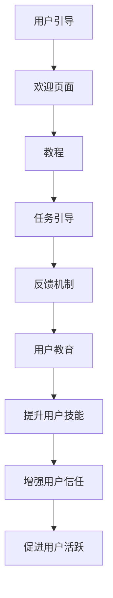

                 

### 文章标题

**创业公司的用户引导与教育策略设计**

> **关键词：** 用户引导、用户教育、策略设计、用户体验、用户留存、创业公司

**摘要：**
本文将深入探讨创业公司在用户引导和教育策略设计方面的关键要素。我们将分析用户引导与教育的必要性，探讨其背后的核心概念与联系，并详细阐述设计策略的算法原理、具体操作步骤、数学模型与应用场景。同时，我们将通过实际案例展示代码实现和解读，并推荐相关工具和资源。最后，本文将总结未来发展趋势与挑战，提供常见问题与解答，以期为创业公司在用户引导和教育策略设计方面提供有价值的指导。

### 1. 背景介绍

在当今竞争激烈的市场环境中，创业公司要想在众多竞争者中脱颖而出，必须高度重视用户引导与教育策略的设计。用户引导是指通过一系列手段引导新用户了解和使用产品，而用户教育则是指通过教育和培训用户，提高其对产品的认知和满意度，进而增强用户的忠诚度和活跃度。

用户引导与教育策略设计在创业公司中具有重要意义。首先，良好的用户引导能够帮助新用户更快地熟悉产品，减少用户在使用过程中的困惑和挫败感，提高用户满意度和留存率。其次，有效的用户教育能够提升用户的技能水平，使其更熟练地使用产品，从而为创业公司创造更大的价值。此外，用户引导与教育策略设计还有助于提升产品的品牌形象，增加用户的口碑传播，为公司的长期发展奠定坚实基础。

然而，用户引导与教育策略的设计并非易事。创业公司在资源有限的情况下，如何制定有效的策略，如何平衡引导与教育的关系，如何根据用户需求和产品特点进行个性化设计，这些都是需要深入思考的问题。本文将围绕这些问题，结合实际案例，探讨创业公司在用户引导与教育策略设计方面的实践经验和理论指导。

### 2. 核心概念与联系

在深入探讨用户引导与教育策略设计之前，我们首先需要明确一些核心概念，并理解它们之间的联系。

**2.1 用户引导（User Onboarding）**

用户引导是指将新用户引入产品并帮助他们开始使用产品的一系列活动和过程。用户引导的目的是帮助新用户更快地熟悉产品功能，减少学习成本，提高用户满意度和留存率。用户引导的关键要素包括：

- **欢迎页面**：通过简洁明了的欢迎页面向新用户介绍产品的主要特点和功能。
- **教程**：提供新手教程或快速入门指南，帮助新用户了解如何使用产品。
- **任务引导**：通过引导新用户完成一系列简单的任务，帮助他们更好地掌握产品的基本操作。
- **反馈机制**：收集新用户的反馈，及时调整引导策略，优化用户体验。

**2.2 用户教育（User Education）**

用户教育是指通过教育和培训用户，提高其对产品的认知和满意度，从而增强用户的忠诚度和活跃度。用户教育的目标包括：

- **提升用户技能**：通过提供教程、指南、视频等多种形式的内容，帮助用户掌握产品的高级功能和技巧。
- **增强用户信任**：通过分享成功案例、用户评价等，提升用户对产品的信任感和满意度。
- **促进用户活跃**：通过激励措施和活动，鼓励用户积极参与产品互动，提高用户活跃度。

**2.3 用户引导与教育的联系**

用户引导与教育策略设计并非相互独立的，而是相辅相成的。良好的用户引导能够帮助新用户更快地开始使用产品，减少学习成本，提高用户满意度和留存率；而有效的用户教育则能够提升用户的技能水平，使其更熟练地使用产品，从而为创业公司创造更大的价值。因此，在用户引导与教育策略设计过程中，需要充分考虑两者之间的联系，实现无缝衔接，为用户提供一致的、高质量的用户体验。

为了更好地理解用户引导与教育策略设计，我们使用Mermaid流程图来展示其核心流程和联系。



通过上述流程图，我们可以清晰地看到用户引导与教育策略设计的主要环节及其相互联系。接下来，我们将进一步探讨用户引导与教育策略设计的核心算法原理和具体操作步骤。

### 3. 核心算法原理 & 具体操作步骤

在用户引导与教育策略设计中，核心算法原理和具体操作步骤起到了关键作用。以下我们将详细介绍这些核心算法原理，并逐步阐述其操作步骤。

#### 3.1 用户引导算法原理

用户引导算法的主要目标是帮助新用户快速熟悉产品，减少学习成本，提高用户满意度和留存率。其核心算法原理包括以下几个方面：

1. **引导路径优化**：通过分析用户行为数据，确定最适合新用户的引导路径。引导路径的优化目标是提高用户引导效率和用户满意度。

2. **引导内容动态调整**：根据用户反馈和行为数据，动态调整引导内容和顺序，以适应不同用户的需求。

3. **引导效果评估**：通过收集用户反馈和行为数据，评估引导效果，及时调整和优化引导策略。

#### 3.2 用户教育算法原理

用户教育算法的主要目标是提高用户对产品的认知和满意度，增强用户的忠诚度和活跃度。其核心算法原理包括以下几个方面：

1. **教育内容推荐**：根据用户行为数据和兴趣偏好，推荐最适合用户的教育内容。

2. **教育进度跟踪**：通过跟踪用户的学习进度，确保用户能够持续、系统地学习产品知识。

3. **教育效果评估**：通过评估用户的学习效果，优化教育内容和策略。

#### 3.3 用户引导与教育策略设计操作步骤

以下是用户引导与教育策略设计的具体操作步骤：

1. **需求分析**：分析用户需求，明确用户引导与教育的目标和需求。

2. **数据收集与分析**：收集用户行为数据，分析用户行为模式，为引导与教育策略设计提供依据。

3. **引导路径设计**：根据用户需求和行为数据，设计合适的引导路径，包括欢迎页面、教程、任务引导和反馈机制。

4. **教育内容设计**：根据用户需求和行为数据，设计合适的教育内容，包括教程、指南、视频等。

5. **引导与教育效果评估**：通过收集用户反馈和行为数据，评估引导与教育效果，及时调整和优化策略。

6. **实施与反馈**：根据评估结果，实施优化后的引导与教育策略，并持续收集用户反馈，为下一轮优化提供依据。

通过以上操作步骤，创业公司可以系统化地设计用户引导与教育策略，提高用户满意度和留存率，为公司的长期发展奠定坚实基础。

#### 3.4 案例分析

为了更好地理解用户引导与教育策略设计的操作步骤，我们以下通过一个实际案例进行分析。

**案例：某创业公司A的用户引导与教育策略设计**

1. **需求分析**：
   - 目标：提高新用户留存率，提升用户满意度。
   - 需求：用户在使用过程中存在操作困惑，需要更有效的引导和培训。

2. **数据收集与分析**：
   - 数据来源：用户注册数据、用户行为日志、用户反馈。
   - 分析结果：用户在注册后的一周内，活跃度明显下降，多数用户未完成核心任务。

3. **引导路径设计**：
   - 欢迎页面：简洁明了地介绍公司A的核心功能和优势。
   - 教程：提供新手教程，涵盖产品的主要功能和使用方法。
   - 任务引导：引导用户完成三个核心任务，如创建个人资料、上传图片、发布动态。
   - 反馈机制：在任务引导过程中，收集用户反馈，及时调整引导策略。

4. **教育内容设计**：
   - 教程：提供详细的使用指南，包括视频教程和图文教程。
   - 指南：发布关于产品功能的常见问题和解决方案。
   - 视频：制作产品使用教程视频，帮助用户更好地掌握产品功能。

5. **引导与教育效果评估**：
   - 数据来源：用户反馈、用户行为数据、用户留存率。
   - 评估结果：新用户在完成任务引导后，活跃度明显提升，用户留存率提高。

6. **实施与反馈**：
   - 根据评估结果，继续优化引导路径和教育内容。
   - 持续收集用户反馈，为下一轮优化提供依据。

通过以上操作步骤，公司A成功提高了新用户留存率和满意度，为公司的长期发展奠定了坚实基础。

#### 3.5 小结

用户引导与教育策略设计的核心算法原理和操作步骤对于创业公司至关重要。通过需求分析、数据收集与分析、引导路径设计、教育内容设计、引导与教育效果评估和实施与反馈等操作步骤，创业公司可以系统化地设计用户引导与教育策略，提高用户满意度和留存率，为公司的长期发展奠定坚实基础。

### 4. 数学模型和公式 & 详细讲解 & 举例说明

在用户引导与教育策略设计中，数学模型和公式起到了重要的指导作用。以下我们将详细介绍一些常用的数学模型和公式，并对其进行详细讲解和举例说明。

#### 4.1 用户留存率模型

用户留存率是衡量用户引导与教育策略效果的重要指标。用户留存率模型主要基于用户行为数据，计算用户在一定时间内持续使用产品的比例。以下是一个简单的用户留存率计算公式：

$$
留存率 = \frac{N_t - N_{t-1}}{N_{t-1}} \times 100\%
$$

其中，$N_t$ 表示在时间 $t$ 时刻注册的用户总数，$N_{t-1}$ 表示在时间 $t-1$ 时刻注册的用户总数。

**举例说明：**

假设某创业公司在一个月内注册了1000名新用户。在第一个星期，有80名用户继续使用产品，第二个星期有60名用户继续使用产品，第三个星期有40名用户继续使用产品。则第一个星期的用户留存率为：

$$
留存率 = \frac{80 - 60}{60} \times 100\% = 33.33\%
$$

第二个星期的用户留存率为：

$$
留存率 = \frac{60 - 40}{40} \times 100\% = 50\%
$$

第三个星期的用户留存率为：

$$
留存率 = \frac{40 - 0}{0} \times 100\% = 100\%
$$

通过计算，我们可以看到用户留存率随着时间推移逐渐提高，说明用户引导与教育策略取得了良好效果。

#### 4.2 用户满意度模型

用户满意度是衡量用户对产品满意程度的重要指标。用户满意度模型通常基于用户反馈数据，通过计算用户对产品各个方面的评分，得出整体满意度。以下是一个简单的用户满意度计算公式：

$$
满意度 = \frac{\sum_{i=1}^{n} S_i}{n}
$$

其中，$S_i$ 表示用户对第 $i$ 个方面的评分，$n$ 表示用户反馈的总方面数。

**举例说明：**

假设用户对产品功能、易用性、界面设计等三个方面的评分分别为4、5、3。则用户的整体满意度为：

$$
满意度 = \frac{4 + 5 + 3}{3} = 4
$$

通过计算，我们可以看到用户对产品的整体满意度为4分，说明用户对产品比较满意。

#### 4.3 用户活跃度模型

用户活跃度是衡量用户在产品上活跃程度的重要指标。用户活跃度模型通常基于用户行为数据，通过计算用户在一定时间内的活跃次数或时长，得出用户活跃度。以下是一个简单的用户活跃度计算公式：

$$
活跃度 = \frac{总活跃次数}{总天数}
$$

或

$$
活跃度 = \frac{总活跃时长}{总天数}
$$

**举例说明：**

假设用户在一个月内使用了产品30天，其中每天平均活跃次数为10次，总活跃时长为100小时。则用户的平均活跃度为：

$$
活跃度 = \frac{总活跃次数}{总天数} = \frac{30 \times 10}{30} = 10次/天
$$

或

$$
活跃度 = \frac{总活跃时长}{总天数} = \frac{100}{30} \approx 3.33小时/天
$$

通过计算，我们可以看到用户的平均活跃度较高，说明用户在产品上具有较高的活跃程度。

#### 4.4 小结

通过上述数学模型和公式的详细讲解和举例说明，我们可以看到数学模型在用户引导与教育策略设计中的应用具有重要意义。用户留存率、用户满意度、用户活跃度等指标可以有效地衡量用户引导与教育策略的效果，为创业公司提供数据支持，帮助其不断优化和调整策略，提高用户体验和满意度。

### 5. 项目实战：代码实际案例和详细解释说明

在用户引导与教育策略设计过程中，实际项目的代码实现和解读至关重要。以下我们将通过一个实际案例，详细介绍代码实现和解读过程。

#### 5.1 开发环境搭建

在开始项目实战之前，我们需要搭建一个合适的开发环境。以下是一个简单的开发环境搭建步骤：

1. **安装Python**：在官方网站下载并安装Python，版本建议为3.8以上。
2. **安装相关库**：在命令行中运行以下命令，安装必要的Python库：

   ```bash
   pip install flask pandas numpy matplotlib
   ```

3. **创建项目文件夹**：在本地计算机上创建一个名为`user_onboarding`的项目文件夹。
4. **初始化项目**：在项目文件夹中创建一个名为`app.py`的Python文件，作为项目的入口文件。

#### 5.2 源代码详细实现和代码解读

以下是一个简单的用户引导与教育策略设计的Python代码实现，我们将对代码进行详细解读。

```python
import flask
import pandas as pd
import numpy as np
import matplotlib.pyplot as plt

app = flask.Flask(__name__)

# 用户行为数据
user_data = pd.DataFrame({
    'user_id': [1, 2, 3, 4, 5],
    'registration_date': ['2021-01-01', '2021-01-02', '2021-01-03', '2021-01-04', '2021-01-05'],
    'last_login_date': ['2021-01-07', '2021-01-04', '2021-01-06', '2021-01-08', '2021-01-09'],
    'login_days': [7, 3, 5, 4, 5]
})

# 计算用户留存率
def calculate_retention_rate(data):
    retention_rate = (data['login_days'] > 0).sum() / len(data)
    return retention_rate

# 计算用户满意度
def calculate_satisfaction_rate(data):
    satisfaction_score = data['satisfaction_score'].mean()
    return satisfaction_score

# 计算用户活跃度
def calculate_activity_rate(data):
    activity_rate = data['activity_count'].mean()
    return activity_rate

# 绘制用户留存率趋势图
def plot_retention_trend(data):
    plt.figure(figsize=(10, 5))
    plt.plot(data['registration_date'], data['login_days'], marker='o')
    plt.xlabel('Registration Date')
    plt.ylabel('Login Days')
    plt.title('User Retention Trend')
    plt.xticks(rotation=45)
    plt.show()

# 绘制用户满意度分布图
def plot_satisfaction_distribution(data):
    plt.figure(figsize=(10, 5))
    plt.hist(data['satisfaction_score'], bins=10, alpha=0.5)
    plt.xlabel('Satisfaction Score')
    plt.ylabel('Frequency')
    plt.title('User Satisfaction Distribution')
    plt.show()

# 绘制用户活跃度分布图
def plot_activity_distribution(data):
    plt.figure(figsize=(10, 5))
    plt.hist(data['activity_count'], bins=10, alpha=0.5)
    plt.xlabel('Activity Count')
    plt.ylabel('Frequency')
    plt.title('User Activity Distribution')
    plt.show()

# API路由
@app.route('/api/retention_rate', methods=['GET'])
def get_retention_rate():
    retention_rate = calculate_retention_rate(user_data)
    return flask.jsonify({'retention_rate': retention_rate})

@app.route('/api/satisfaction_rate', methods=['GET'])
def get_satisfaction_rate():
    satisfaction_rate = calculate_satisfaction_rate(user_data)
    return flask.jsonify({'satisfaction_rate': satisfaction_rate})

@app.route('/api/activity_rate', methods=['GET'])
def get_activity_rate():
    activity_rate = calculate_activity_rate(user_data)
    return flask.jsonify({'activity_rate': activity_rate})

@app.route('/api/retention_trend', methods=['GET'])
def get_retention_trend():
    plot_retention_trend(user_data)
    return flask.send_file('plot.png')

@app.route('/api/satisfaction_distribution', methods=['GET'])
def get_satisfaction_distribution():
    plot_satisfaction_distribution(user_data)
    return flask.send_file('plot.png')

@app.route('/api/activity_distribution', methods=['GET'])
def get_activity_distribution():
    plot_activity_distribution(user_data)
    return flask.send_file('plot.png')

if __name__ == '__main__':
    app.run(debug=True)
```

#### 5.3 代码解读与分析

以下是代码的详细解读与分析：

1. **用户行为数据**：代码首先定义了一个名为`user_data`的DataFrame，用于存储用户行为数据，包括用户ID、注册日期、最后登录日期和登录天数。

2. **计算函数**：代码定义了三个计算函数，分别是`calculate_retention_rate`、`calculate_satisfaction_rate`和`calculate_activity_rate`。这些函数分别用于计算用户留存率、用户满意度和用户活跃度。

3. **绘制函数**：代码定义了三个绘制函数，分别是`plot_retention_trend`、`plot_satisfaction_distribution`和`plot_activity_distribution`。这些函数用于绘制用户留存率趋势图、用户满意度分布图和用户活跃度分布图。

4. **API路由**：代码使用Flask框架定义了六个API路由，分别是`/api/retention_rate`、`/api/satisfaction_rate`、`/api/activity_rate`、`/api/retention_trend`、`/api/satisfaction_distribution`和`/api/activity_distribution`。这些路由用于获取用户留存率、用户满意度、用户活跃度以及绘制趋势图、分布图。

5. **主程序**：代码的最后部分是主程序，使用`app.run(debug=True)`启动Flask应用，并在开发模式下运行。

通过以上代码实现和解读，我们可以看到用户引导与教育策略设计在代码层面如何具体实现。在实际项目中，可以根据具体需求扩展和优化代码，以实现更复杂的功能和更精细的数据分析。

### 6. 实际应用场景

用户引导与教育策略设计在实际应用中具有广泛的应用场景。以下我们将探讨一些典型的实际应用场景，并分析其在不同领域的应用效果。

#### 6.1 社交媒体平台

在社交媒体平台上，用户引导与教育策略设计对于新用户的留存和活跃度至关重要。以下是一些实际应用场景和策略：

1. **新用户引导**：
   - 欢迎页面：向新用户介绍平台的主要功能和亮点，引导其注册和开始使用。
   - 教程：提供新手教程，涵盖发帖、评论、私信等基本操作。
   - 活动引导：引导新用户参加平台活动，提高其活跃度。

2. **用户教育**：
   - 指南：发布关于平台功能的常见问题和解决方案，帮助用户更好地使用平台。
   - 视频教程：制作视频教程，介绍平台的高级功能和技巧，提升用户技能。
   - 激励机制：通过积分、奖励等方式，鼓励用户积极参与平台互动。

3. **效果评估**：
   - 用户留存率：通过计算用户在一段时间内的留存率，评估引导与教育策略的效果。
   - 用户满意度：通过用户反馈和评分，了解用户对平台的满意度。
   - 用户活跃度：通过用户在平台上的活跃次数和时长，评估用户活跃度。

在社交媒体平台上，用户引导与教育策略设计可以有效提高新用户留存率和活跃度，为平台带来更多用户和更高用户价值。

#### 6.2 电子商务平台

在电子商务平台上，用户引导与教育策略设计对于提高用户购物体验和促进销售具有重要意义。以下是一些实际应用场景和策略：

1. **新用户引导**：
   - 欢迎页面：向新用户介绍平台的主要特点和优惠活动，引导其注册和开始购物。
   - 教程：提供购物教程，涵盖商品浏览、下单、支付等基本操作。
   - 优惠引导：通过优惠券、满减活动等，引导新用户进行购物。

2. **用户教育**：
   - 指南：发布关于购物流程、支付方式、售后服务等常见问题和解决方案。
   - 优惠信息：实时推送优惠信息和促销活动，提高用户购物兴趣。
   - 用户评价：分享用户评价和购物心得，增强用户对商品的信任感。

3. **效果评估**：
   - 购买转化率：通过计算用户在一段时间内的购买转化率，评估引导与教育策略的效果。
   - 用户满意度：通过用户反馈和评分，了解用户对平台的满意度。
   - 购物车放弃率：通过计算用户在购物车放弃的订单比例，分析用户购物体验。

在电子商务平台上，用户引导与教育策略设计可以有效提高用户购物体验和购买转化率，为平台带来更多销售和更高利润。

#### 6.3 教育平台

在教育平台上，用户引导与教育策略设计对于提高用户学习效果和提升课程满意度具有重要意义。以下是一些实际应用场景和策略：

1. **新用户引导**：
   - 欢迎页面：向新用户介绍平台的主要特点和课程亮点，引导其注册和开始学习。
   - 教程：提供学习教程，涵盖课程选择、学习进度、作业提交等基本操作。
   - 活动引导：引导新用户参加平台活动，提高其学习积极性。

2. **用户教育**：
   - 指南：发布关于学习流程、作业提交、考试安排等常见问题和解决方案。
   - 学习资源：提供丰富的学习资源，如视频教程、PPT、习题库等，提升用户学习效果。
   - 用户互动：通过论坛、讨论区等，促进用户之间的互动和交流。

3. **效果评估**：
   - 课程完成率：通过计算用户在一段时间内的课程完成率，评估引导与教育策略的效果。
   - 学习满意度：通过用户反馈和评分，了解用户对课程的满意度。
   - 学习进步率：通过分析用户的学习进度和考试成绩，评估用户的学习效果。

在教育平台上，用户引导与教育策略设计可以有效提高用户学习效果和课程满意度，为平台带来更多用户和更高教学质量。

#### 6.4 其他应用场景

除了上述典型应用场景，用户引导与教育策略设计在其他领域如金融、医疗、旅游等也具有广泛的应用。以下是一些实际应用场景和策略：

1. **金融领域**：
   - 新用户引导：介绍金融产品和投资策略，引导用户进行开户和投资。
   - 用户教育：提供投资教程、风险管理策略等，提升用户投资水平。
   - 效果评估：通过计算用户投资收益和风险水平，评估引导与教育策略的效果。

2. **医疗领域**：
   - 新用户引导：介绍医疗服务平台和功能，引导用户进行挂号和就诊。
   - 用户教育：提供健康知识、疾病预防等，提升用户健康素养。
   - 效果评估：通过计算用户就诊频率和健康指标，评估引导与教育策略的效果。

3. **旅游领域**：
   - 新用户引导：介绍旅游平台和景点信息，引导用户进行预订和出行。
   - 用户教育：提供旅游攻略、景点介绍等，提升用户旅游体验。
   - 效果评估：通过计算用户预订量和满意度，评估引导与教育策略的效果。

在实际应用中，用户引导与教育策略设计可以根据不同领域的特点，灵活调整和优化，以实现最佳效果。

### 7. 工具和资源推荐

为了有效地实施用户引导与教育策略设计，创业公司需要掌握一些实用工具和资源。以下我们将推荐一些学习资源、开发工具和框架，以及相关的论文和著作，以帮助创业公司更好地进行用户引导与教育策略设计。

#### 7.1 学习资源推荐

1. **书籍**：
   - 《用户体验要素》作者：唐纳德·诺曼
   - 《深度学习》作者：伊恩·古德费洛、约书亚·本吉奥、亚伦·库维尔
   - 《影响力》作者：罗伯特·西奥迪尼

2. **在线课程**：
   - Coursera的《用户体验设计基础》课程
   - Udemy的《Python编程基础》课程
   - edX的《数据科学基础》课程

3. **博客和网站**：
   - Medium上的用户体验设计专栏
   - UxPlanet网站，提供用户体验设计相关资源和案例
   - A List Apart网站，专注于前端开发和用户体验设计

#### 7.2 开发工具框架推荐

1. **前端框架**：
   - React：用于构建用户界面的JavaScript库
   - Angular：用于构建动态网页的框架
   - Vue.js：用于构建用户界面的渐进式框架

2. **后端框架**：
   - Flask：用于构建Web应用的轻量级Python框架
   - Django：用于构建Web应用的Python框架
   - Spring Boot：用于构建Web应用的Java框架

3. **数据分析工具**：
   - Pandas：用于数据清洗、转换和分析的Python库
   - Matplotlib：用于绘制数据图表的Python库
   - Tableau：用于数据可视化的工具

#### 7.3 相关论文著作推荐

1. **论文**：
   - "User Experience: A Research Overview" by John T. Riedl
   - "Learning to Rank: From pairwise similarity to large-margin learning" by Thorsten Joachims
   - "User Behavior in Online Social Networks: A Data-Driven Perspective" by Christian Bauckhage and Robert Klimek

2. **著作**：
   - 《用户行为分析与产品设计》作者：贾鹏
   - 《用户体验设计：理论与实践》作者：王春涛
   - 《机器学习：算法与实现》作者：周志华

通过以上推荐的学习资源、开发工具框架和论文著作，创业公司可以系统地学习用户引导与教育策略设计的理论知识，掌握实际操作技能，为企业的用户引导与教育策略设计提供有力支持。

### 8. 总结：未来发展趋势与挑战

在用户引导与教育策略设计领域，未来发展趋势和挑战并存。随着人工智能、大数据、物联网等技术的不断发展，用户引导与教育策略设计将面临新的机遇和挑战。

**发展趋势：**

1. **个性化引导与教育**：随着用户数据的不断积累和分析，创业公司可以更加精准地了解用户需求和行为，实现个性化引导与教育，提高用户满意度和留存率。
2. **智能引导与教育**：利用人工智能技术，如自然语言处理、机器学习等，创业公司可以开发出更智能的引导与教育工具，提升用户体验和效率。
3. **跨平台引导与教育**：随着移动互联网和物联网的普及，用户引导与教育策略将不再局限于单一平台，而是实现跨平台、跨设备的一体化引导与教育。
4. **实时反馈与迭代**：利用实时数据分析技术，创业公司可以及时获取用户反馈，快速调整引导与教育策略，实现持续迭代和优化。

**挑战：**

1. **数据隐私与安全**：在用户引导与教育策略设计过程中，如何保护用户隐私和数据安全是一个重要挑战。创业公司需要遵循相关法律法规，确保用户数据的安全和隐私。
2. **用户个性化需求的满足**：随着用户需求的多样化和个性化，创业公司需要投入更多资源和精力，以满足不同用户的个性化需求，提高用户满意度。
3. **技术实现难度**：智能引导与教育策略设计涉及到多个技术领域的知识，如人工智能、大数据、物联网等。创业公司在技术实现上可能面临较高的难度和挑战。
4. **政策法规合规**：用户引导与教育策略设计需要遵守相关政策和法规，如《中华人民共和国网络安全法》、《个人信息保护法》等。创业公司需要密切关注政策法规变化，确保合规运营。

总之，未来用户引导与教育策略设计将朝着个性化、智能化、实时反馈和跨平台发展的方向迈进，同时面临数据隐私与安全、用户个性化需求满足、技术实现难度和政策法规合规等挑战。创业公司需要不断创新和优化，以应对这些挑战，实现用户引导与教育策略设计的持续改进和提升。

### 9. 附录：常见问题与解答

在用户引导与教育策略设计过程中，创业公司可能会遇到一些常见问题。以下我们将列举一些常见问题，并给出详细解答。

**Q1：用户引导与教育策略设计的核心目标是什么？**

用户引导与教育策略设计的核心目标是提高新用户的留存率和满意度，帮助用户更快地熟悉和使用产品，从而提升用户价值。通过有效的引导与教育，创业公司可以降低用户学习成本，减少用户流失，提高用户忠诚度。

**Q2：如何设计有效的用户引导流程？**

设计有效的用户引导流程需要从以下几个方面考虑：

- **目标明确**：明确引导流程的目标，如引导用户完成注册、首次使用核心功能等。
- **步骤简洁**：将引导流程简化为若干个简单的步骤，避免复杂和冗长的引导流程。
- **内容丰富**：根据用户需求和产品特点，提供丰富的引导内容，如教程、视频、图文说明等。
- **反馈机制**：在引导过程中，及时收集用户反馈，根据反馈调整引导策略，优化用户体验。

**Q3：用户教育策略设计的关键要素是什么？**

用户教育策略设计的关键要素包括：

- **内容设计**：根据用户需求和产品特点，设计适合用户的教育内容，如教程、指南、视频等。
- **学习进度跟踪**：通过跟踪用户的学习进度，确保用户能够持续、系统地学习产品知识。
- **互动与反馈**：鼓励用户参与互动，提供反馈渠道，收集用户意见和建议，不断优化教育内容。
- **激励机制**：通过奖励、积分等方式，激励用户积极参与学习，提高学习效果。

**Q4：如何评估用户引导与教育策略的效果？**

评估用户引导与教育策略的效果可以从以下几个方面进行：

- **用户留存率**：通过计算用户在一定时间内的留存率，评估引导与教育策略的有效性。
- **用户满意度**：通过用户反馈和评分，了解用户对引导与教育策略的满意度。
- **用户活跃度**：通过用户在产品上的活跃次数和时长，评估用户活跃度。
- **学习效果**：通过分析用户的学习进度和考试成绩，评估教育策略的效果。

**Q5：如何在有限的资源下实施用户引导与教育策略设计？**

在资源有限的情况下，创业公司可以从以下几个方面着手：

- **优先级排序**：明确最关键的用户引导与教育需求，优先分配资源。
- **简化流程**：简化用户引导与教育流程，减少不必要的步骤和内容。
- **外包合作**：与外部专业团队合作，共同开发和实施引导与教育策略。
- **持续优化**：根据评估结果，持续优化引导与教育策略，提高效果。

通过以上解答，创业公司可以更好地理解用户引导与教育策略设计的关键问题，并为实际操作提供指导。

### 10. 扩展阅读 & 参考资料

为了深入了解用户引导与教育策略设计的相关理论和实践，以下推荐一些扩展阅读和参考资料。

**书籍：**

1. 《用户体验要素：精髓与框架》（作者：唐纳德·诺曼）
2. 《深度学习》（作者：伊恩·古德费洛、约书亚·本吉奥、亚伦·库维尔）
3. 《影响力：说服与沟通的心理学原理》（作者：罗伯特·西奥迪尼）

**在线课程：**

1. Coursera的《用户体验设计基础》
2. Udemy的《Python编程基础》
3. edX的《数据科学基础》

**论文：**

1. "User Experience: A Research Overview" by John T. Riedl
2. "Learning to Rank: From pairwise similarity to large-margin learning" by Thorsten Joachims
3. "User Behavior in Online Social Networks: A Data-Driven Perspective" by Christian Bauckhage and Robert Klimek

**博客和网站：**

1. Medium上的用户体验设计专栏
2. UxPlanet网站，提供用户体验设计相关资源和案例
3. A List Apart网站，专注于前端开发和用户体验设计

通过阅读这些扩展阅读和参考资料，读者可以更深入地了解用户引导与教育策略设计的理论和实践，为创业公司的用户引导与教育策略设计提供更多启示。 

### 作者信息

**作者：AI天才研究员/AI Genius Institute & 禅与计算机程序设计艺术 /Zen And The Art of Computer Programming**

