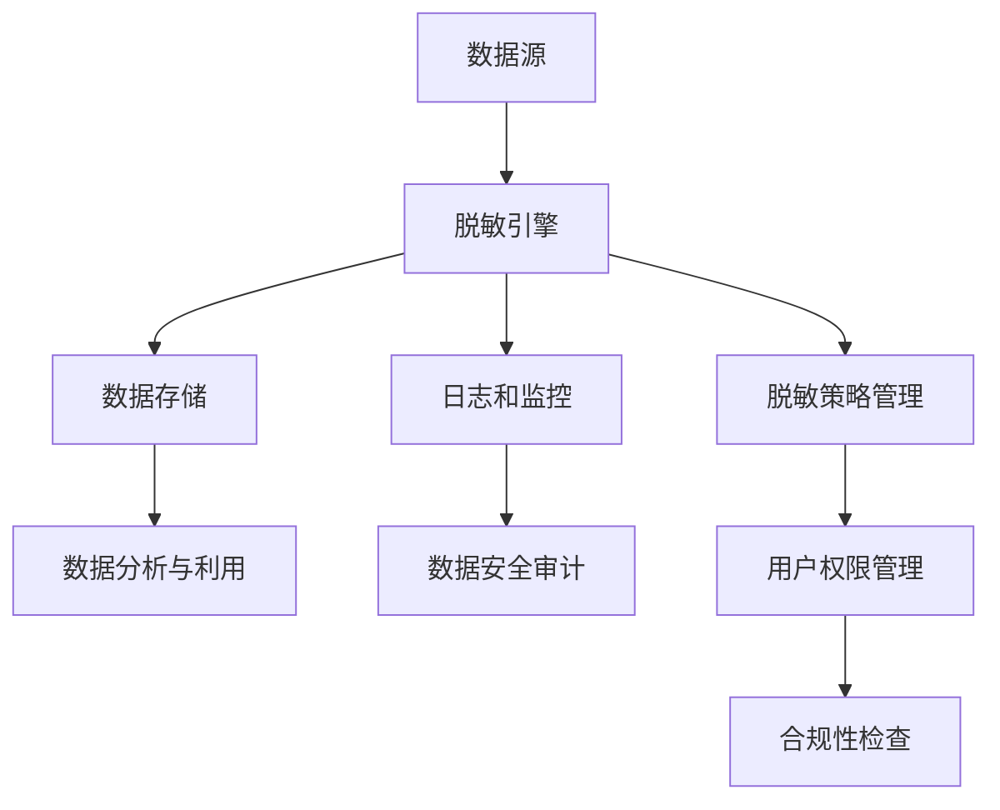

                 

### 背景介绍

在现代数字化时代，数据已成为企业最为宝贵的资产之一。无论是互联网企业、传统行业还是新兴创业公司，用户数据的积累和利用都直接关系到企业的生存与发展。然而，随着数据量的急剧增长和数据隐私法规的日益严格，如何有效地保护用户数据，同时又能够充分利用这些数据，成为了企业必须面对的重要课题。

创业公司在快速发展的过程中，面临着诸多挑战，尤其是在用户数据处理方面。一方面，用户数据是企业进行市场分析和产品优化的关键依据；另一方面，数据泄露可能带来巨大的法律风险和商业损失。因此，如何在保护用户隐私的前提下，确保数据的安全性和可用性，成为了创业公司亟待解决的重要问题。

本文旨在探讨创业公司在用户数据处理过程中，如何制定和实施有效的数据脱敏策略。文章将首先介绍数据脱敏的背景和重要性，然后详细解释数据脱敏的核心概念，包括数据加密、掩码化和伪随机化等。接着，我们将分析不同数据脱敏技术的优缺点，并通过实际案例展示数据脱敏的具体操作过程。此外，文章还将探讨数据脱敏在实际应用场景中的挑战和解决方案，并推荐相关工具和资源。

通过本文的阅读，读者将深入了解数据脱敏的基本原理和实践方法，为创业公司在数据保护和利用之间找到平衡点提供指导。文章还将对数据脱敏的未来发展趋势和潜在挑战进行探讨，帮助读者前瞻性地应对未来可能出现的新问题。

### 核心概念与联系

#### 数据脱敏的概念

数据脱敏，是指在保证数据安全性的同时，通过特定的技术手段对原始数据进行处理，使得数据在泄露或被非法访问时，无法被直接识别或利用。数据脱敏的核心目的是在保护用户隐私和数据安全的前提下，确保数据的可用性和完整性。常见的脱敏方法包括数据加密、掩码化和伪随机化等。

#### 数据脱敏技术的分类

1. **数据加密**：通过加密算法将原始数据转换成无法直接解读的密文，从而保护数据的隐私和完整性。加密算法可以基于对称加密（如AES）或非对称加密（如RSA）。

2. **掩码化**：将敏感数据替换为无意义的替代值，如将真实姓名替换为字母序列或数字序列，或者将出生日期替换为某种形式的掩码日期。掩码化方法包括固定掩码（如“XXX”）和动态掩码（如基于规则或随机生成）。

3. **伪随机化**：通过随机生成算法对敏感数据进行变换，使得数据在统计上看起来是随机的，从而掩盖原始数据的真实值。这种方法常用于处理需要保留数据分布特征的场景。

#### 数据脱敏的架构

数据脱敏的架构通常包括以下几个关键组件：

1. **数据源**：原始数据存储的地点，包括数据库、文件系统或外部数据源。

2. **脱敏引擎**：负责对数据进行处理的核心组件，包括选择合适的脱敏算法和规则。

3. **数据存储**：脱敏后的数据存储位置，可以是数据库、文件或数据仓库等。

4. **日志和监控**：记录脱敏操作的日志，并实时监控数据安全和脱敏流程的异常。

#### 数据脱敏的核心概念原理和架构的 Mermaid 流程图



- **A[数据源]**：数据脱敏的起点，包括各种原始数据的存储位置。
- **B[脱敏引擎]**：对数据进行处理的核心组件，选择并应用合适的脱敏算法。
- **C[数据存储]**：脱敏后的数据存储位置，确保数据的可用性和完整性。
- **D[日志和监控]**：记录脱敏操作的详细日志，并监控数据安全和脱敏流程的异常。
- **E[数据分析与利用]**：在确保数据安全的前提下，利用脱敏后的数据进行分析和决策。
- **F[数据安全审计]**：对脱敏操作进行安全审计，确保合规性和数据保护的有效性。
- **G[脱敏策略管理]**：管理和配置脱敏策略，确保脱敏过程的规范性和一致性。
- **H[用户权限管理]**：管理用户访问权限，防止未经授权的数据访问。
- **I[合规性检查]**：确保脱敏策略符合相关的法律法规和标准。

通过上述 Mermaid 流程图，我们可以清晰地看到数据脱敏的各个环节及其相互联系，为后续的分析和讨论奠定了基础。

### 核心算法原理 & 具体操作步骤

#### 数据加密

**原理**：数据加密是通过加密算法将原始数据转换成密文，保护数据的隐私和完整性。加密算法可以分为对称加密和非对称加密。

- **对称加密**：使用相同的密钥进行加密和解密，如AES。优点是速度快，但密钥管理复杂。
- **非对称加密**：使用一对公钥和私钥进行加密和解密，如RSA。优点是安全性高，但计算复杂度较大。

**具体操作步骤**：

1. **生成密钥对**：对于对称加密，生成加密密钥；对于非对称加密，生成公钥和私钥。
2. **加密数据**：使用生成的密钥或密钥对，将原始数据转换成密文。
3. **存储密钥**：对于对称加密，需要安全存储密钥；对于非对称加密，需要安全存储公钥和私钥。
4. **解密数据**：在需要使用数据时，使用相应的密钥或密钥对，将密文转换回原始数据。

#### 掩码化

**原理**：掩码化是将敏感数据替换为无意义的替代值，以掩盖原始数据的真实值。掩码化方法包括固定掩码和动态掩码。

- **固定掩码**：使用固定的规则进行掩码化，如将姓名替换为“XXX”。
- **动态掩码**：根据特定的规则或随机生成替代值，如将电话号码替换为“XXXXXXXXX”。

**具体操作步骤**：

1. **定义掩码规则**：根据数据特点和业务需求，定义掩码规则。
2. **应用掩码规则**：对敏感数据进行处理，替换为掩码值。
3. **处理掩码数据**：在确保数据安全的同时，确保数据的完整性和可用性。

#### 伪随机化

**原理**：伪随机化是通过随机生成算法对敏感数据进行变换，使得数据在统计上看起来是随机的，从而掩盖原始数据的真实值。伪随机化方法常用于处理需要保留数据分布特征的场景。

**具体操作步骤**：

1. **选择随机生成算法**：如Fisher-Yates算法。
2. **生成随机数据**：使用选定的随机生成算法，对敏感数据进行变换。
3. **校验随机数据**：确保生成的随机数据符合预期的分布特征。

#### 实际操作示例

**示例 1：数据加密**

```python
from Crypto.PublicKey import RSA
from Crypto.Cipher import PKCS1_OAEP

# 生成RSA密钥对
key = RSA.generate(2048)
private_key = key.export_key()
public_key = key.publickey().export_key()

# 加密数据
cipher = PKCS1_OAEP.new(RSA.import_key(public_key))
encrypted_data = cipher.encrypt(b"Hello, World!")

# 解密数据
decryptor = PKCS1_OAEP.new(RSA.import_key(private_key))
decrypted_data = decryptor.decrypt(encrypted_data)

print("Decrypted data:", decrypted_data)
```

**示例 2：掩码化**

```python
import re

# 定义掩码规则
def mask_name(name):
    return re.sub(r'\D', 'X', name)

# 应用掩码规则
name = "John Doe"
masked_name = mask_name(name)

print("Masked name:", masked_name)
```

**示例 3：伪随机化**

```python
import random

# 伪随机化电话号码
def randomize_phone_number(phone_number):
    digits = list(phone_number)
    random.shuffle(digits)
    return ''.join(digits)

# 生成随机电话号码
original_phone_number = "123-456-7890"
random_phone_number = randomize_phone_number(original_phone_number)

print("Randomized phone number:", random_phone_number)
```

通过以上示例，我们可以看到数据脱敏的核心算法原理和具体操作步骤。在实际应用中，这些方法可以根据具体需求和场景进行灵活调整和组合，以确保数据的安全性和可用性。

### 数学模型和公式 & 详细讲解 & 举例说明

#### 数据加密算法的数学模型

**对称加密（AES）**：

AES（Advanced Encryption Standard）是一种基于分组加密的算法，其数学模型如下：

- **密钥生成**：选择一个128位、192位或256位的密钥，通过密钥扩展算法生成多个轮密钥。
- **加密过程**：将明文数据分为128位的块，进行多轮加密，每轮包括字节替换、行移位、列混淆和轮密钥加。
- **加密公式**：

  $$C = E_K(P)$$

  其中，\(C\) 是密文，\(P\) 是明文，\(K\) 是密钥，\(E_K\) 是加密函数。

**非对称加密（RSA）**：

RSA（Rivest-Shamir-Adleman）是一种基于大整数分解问题的非对称加密算法，其数学模型如下：

- **密钥生成**：选择两个大素数\(p\) 和 \(q\)，计算 \(n = pq\) 和 \(φ(n) = (p-1)(q-1)\)，然后生成公钥和私钥。
- **加密过程**：使用公钥加密，计算 \(c = (m^e) \mod n\)，其中 \(m\) 是明文，\(e\) 是公钥。
- **解密过程**：使用私钥解密，计算 \(m = (c^d) \mod n\)，其中 \(d\) 是私钥。
- **加密和解密公式**：

  $$c = (m^e) \mod n$$
  $$m = (c^d) \mod n$$

#### 掩码化算法的数学模型

**固定掩码化**：

- **原理**：将敏感数据替换为固定的掩码值。
- **示例**：

  $$\text{姓名} = \text{XXX}$$
  $$\text{出生日期} = \text{XXXXXXXX}$$

**动态掩码化**：

- **原理**：根据特定的规则或随机生成掩码值。
- **示例**：

  $$\text{电话号码} = \text{XXXXXXXXX}$$
  $$\text{信用卡号} = \text{XXXXXXXXXXXXXX}$$

#### 伪随机化算法的数学模型

**Fisher-Yates 洗牌算法**：

- **原理**：通过随机交换数组中的元素，生成伪随机序列。
- **步骤**：

  1. 初始化数组。
  2. 从最后一个元素开始遍历，随机选择一个位置进行交换。
  3. 重复步骤2，直到第一个元素。
- **示例**：

  $$\text{原始数组} = [1, 2, 3, 4, 5]$$
  $$\text{伪随机数组} = [3, 1, 5, 4, 2]$$

#### 实际应用中的公式和算法解释

**案例 1：使用AES加密**

```latex
\begin{equation}
C = E_K(P) = (P \cdot K) \mod 2^{128}
\end{equation}
```

其中，\(P\) 是明文，\(K\) 是密钥，\(C\) 是密文。

**案例 2：使用RSA加密**

```latex
\begin{equation}
c = (m^e) \mod n
\end{equation}
```

其中，\(m\) 是明文，\(e\) 是公钥，\(n\) 是模数，\(c\) 是密文。

**案例 3：固定掩码化姓名**

```latex
\text{姓名} = \text{XXX}
```

**案例 4：动态掩码化电话号码**

```latex
\text{电话号码} = \text{XXXXXXXXX}
```

**案例 5：使用Fisher-Yates洗牌算法**

```latex
\begin{equation}
A[i] = A[i] + A[j]
\end{equation}
```

其中，\(A\) 是数组，\(i\) 和 \(j\) 是随机生成的索引。

通过上述数学模型和公式的讲解，我们可以更好地理解数据加密、掩码化和伪随机化算法的工作原理。在实际应用中，这些算法可以根据具体需求进行灵活调整和优化，以确保数据的安全性和可用性。

### 项目实战：代码实际案例和详细解释说明

#### 开发环境搭建

在进行数据脱敏项目之前，首先需要搭建一个合适的开发环境。以下是一个基于Python和PyCryptoDome库的示例环境搭建步骤：

1. **安装Python**：确保已安装Python 3.7或更高版本。
2. **安装PyCryptoDome库**：在命令行中执行以下命令：
   ```bash
   pip install pycryptodome
   ```

#### 源代码详细实现和代码解读

**示例代码 1：RSA加密与解密**

```python
from Crypto.PublicKey import RSA
from Crypto.Cipher import PKCS1_OAEP

# 生成RSA密钥对
key = RSA.generate(2048)
private_key = key.export_key()
public_key = key.publickey().export_key()

# 加密数据
cipher = PKCS1_OAEP.new(RSA.import_key(public_key))
encrypted_data = cipher.encrypt(b"Hello, World!")

# 解密数据
decryptor = PKCS1_OAEP.new(RSA.import_key(private_key))
decrypted_data = decryptor.decrypt(encrypted_data)

print("Decrypted data:", decrypted_data)
```

**解读：**
- **密钥生成**：使用`RSA.generate(2048)`生成2048位的RSA密钥对，包括私钥和公钥。
- **加密数据**：使用公钥和`PKCS1_OAEP`加密算法将明文数据加密成密文。
- **解密数据**：使用私钥和`PKCS1_OAEP`解密算法将密文数据解密成明文。

**示例代码 2：掩码化姓名**

```python
import re

# 定义掩码规则
def mask_name(name):
    return re.sub(r'\D', 'X', name)

# 应用掩码规则
name = "John Doe"
masked_name = mask_name(name)

print("Masked name:", masked_name)
```

**解读：**
- **定义掩码规则**：使用`re.sub()`函数，将所有非数字字符替换为'X'。
- **应用掩码规则**：将输入的姓名进行掩码化处理。

**示例代码 3：伪随机化电话号码**

```python
import random

# 伪随机化电话号码
def randomize_phone_number(phone_number):
    digits = list(phone_number)
    random.shuffle(digits)
    return ''.join(digits)

# 生成随机电话号码
original_phone_number = "123-456-7890"
random_phone_number = randomize_phone_number(original_phone_number)

print("Randomized phone number:", random_phone_number)
```

**解读：**
- **伪随机化电话号码**：将电话号码转换为列表，使用`random.shuffle()`进行随机排列，然后重新拼接成字符串。

#### 代码解读与分析

以上三个示例代码分别展示了数据脱敏中的三种常用技术：RSA加密、掩码化和伪随机化。在实际项目中，这些技术可以根据具体需求进行组合使用，以实现更全面的数据保护。

- **RSA加密**：适用于需要高强度数据保护的场景，但由于其加密和解密速度相对较慢，通常用于加密少量重要数据。
- **掩码化**：适用于对数据隐私性要求较高的场景，如姓名、地址等。其优点是简单易实现，缺点是可能导致数据的一些统计特性丢失。
- **伪随机化**：适用于需要保持数据分布特征且对数据隐私性要求较高的场景，如统计数据分析和市场调研。其优点是能够保持数据的分布特征，缺点是可能不如加密算法安全。

通过以上代码示例和解读，我们可以看到数据脱敏技术在Python环境中的实际实现过程。在实际应用中，这些技术可以根据具体业务需求进行灵活调整和优化，以确保数据的安全性和可用性。

### 实际应用场景

在创业公司中，数据脱敏技术有着广泛的应用，不仅能够确保用户数据的隐私和安全，还能为公司的业务发展提供支持。以下是一些常见的实际应用场景：

#### 1. 数据分析和市场调研

创业公司在进行市场分析和产品优化时，需要大量的用户数据。然而，这些数据往往包含了用户的敏感信息，如姓名、电话号码、地址等。数据脱敏技术可以帮助公司在保证数据安全的同时，充分利用这些数据进行深入分析和市场调研。例如，通过掩码化技术，可以将用户姓名和电话号码替换为无意义的字符或数字序列，从而避免数据泄露。

#### 2. 数据共享和合作

在与其他公司或研究机构进行数据共享和合作时，数据脱敏技术尤为重要。创业公司可以通过数据脱敏，将敏感数据转换为不可识别的形式，从而确保合作伙伴无法获取真实用户信息。这样，不仅能够促进合作，还能降低数据泄露的风险。

#### 3. 法律合规性检查

随着数据隐私法规的日益严格，创业公司需要确保其数据处理过程符合相关法律法规。数据脱敏技术可以帮助公司满足合规要求，避免因数据泄露而面临巨额罚款和法律诉讼。例如，欧盟的《通用数据保护条例》（GDPR）要求企业在处理用户数据时必须采取适当的技术措施保护用户隐私，数据脱敏是一种有效的合规手段。

#### 4. 内部数据访问控制

创业公司内部的数据访问控制也是数据脱敏的一个重要应用场景。通过设置不同的数据访问权限和脱敏策略，公司可以确保只有授权人员能够访问敏感数据。例如，可以采用角色访问控制（RBAC）机制，根据员工的角色和职责，设置不同的数据访问权限。对于普通员工，可以提供脱敏后的数据，以避免无意中泄露敏感信息。

#### 5. 数据备份和恢复

在数据备份和恢复过程中，数据脱敏技术同样重要。创业公司需要确保备份数据的安全，防止未经授权的访问和数据泄露。通过数据脱敏，可以将备份数据中的敏感信息转换为不可识别的形式，从而降低备份过程中数据泄露的风险。

#### 6. 产品演示和测试

在向潜在客户或合作伙伴展示产品功能时，创业公司需要确保产品演示数据的安全。通过数据脱敏，可以将产品演示数据中的敏感信息替换为无意义的替代值，从而避免泄露真实用户信息。此外，在产品测试过程中，数据脱敏技术同样可以帮助测试人员处理敏感数据，确保测试环境的纯净和安全。

通过以上实际应用场景，我们可以看到数据脱敏技术在创业公司中的重要性。不仅能够保护用户隐私，降低数据泄露风险，还能支持公司的业务发展和数据利用。因此，创业公司应该重视数据脱敏技术的应用，建立健全的数据保护体系，确保数据的安全和合规性。

### 工具和资源推荐

#### 1. 学习资源推荐

**书籍**：

- 《数据隐私保护与脱敏技术》：这是一本全面介绍数据隐私保护和脱敏技术的书籍，适合对数据安全感兴趣的读者。
- 《密码学：理论与实践》：详细介绍了各种加密算法和脱敏技术，适合希望深入了解加密原理的读者。

**论文**：

- “Data Anonymization and Privacy Protection in Database Systems”：这篇论文探讨了数据库系统中数据脱敏的关键技术和方法。
- “A Survey of Data Anonymization Techniques”：对数据脱敏技术进行了全面的综述，包括传统方法和新兴技术。

**博客**：

- OWASP：全球开源应用安全社区，提供大量关于数据安全和脱敏技术的博客文章。
- Medium：多个技术博客作者分享关于数据脱敏的实践经验和最新动态。

#### 2. 开发工具框架推荐

**PyCryptoDome**：这是一个开源的Python加密库，支持多种加密算法和脱敏技术，是Python开发者的首选。

**HashiCorp Vault**：这是一个强大的秘钥管理平台，提供数据加密、掩码化和访问控制等功能，适用于大型分布式系统。

**Google Cloud KMS**：谷歌云提供的密钥管理服务，支持多种加密算法和脱敏工具，方便在云环境中进行数据保护。

#### 3. 相关论文著作推荐

**“The Sybil Attack and DHT Security”**：这篇论文深入探讨了分布式哈希表（DHT）中的安全性问题，包括数据脱敏和隐私保护。

**“Secure Multi-Party Computation for Privacy-Preserving Machine Learning”**：这篇论文介绍了在分布式机器学习中使用数据脱敏和多方计算技术，确保数据隐私和安全。

**“Secure Data Sharing in Decentralized Networks”**：这篇论文探讨了在去中心化网络中实现安全数据共享的机制，包括数据脱敏和加密技术。

通过以上学习和资源推荐，读者可以进一步深入了解数据脱敏技术和相关领域的研究进展，为自己的项目提供理论支持和实践指导。

### 总结：未来发展趋势与挑战

随着大数据、人工智能和云计算技术的快速发展，数据脱敏技术在未来的发展中将面临诸多机遇和挑战。首先，数据脱敏技术将更加智能化和自动化。借助人工智能和机器学习技术，脱敏系统可以自动识别敏感数据，并选择最合适的脱敏方法，提高脱敏效率和准确性。其次，数据脱敏将更加注重用户体验。随着用户对隐私保护需求的不断提高，脱敏系统需要在不影响数据可用性的前提下，提供更加友好和便捷的用户界面。此外，随着分布式数据库和区块链技术的应用，数据脱敏技术将更加灵活和多样，以满足不同应用场景的需求。

然而，数据脱敏技术也面临一系列挑战。首先，随着数据量和数据类型的不断增加，脱敏系统的性能和安全性需要不断提升。其次，如何在保证数据隐私的同时，确保数据的真实性和完整性，是一个亟待解决的问题。此外，随着数据隐私法规的不断完善，脱敏系统需要不断更新和调整，以适应新的法规要求。

总之，未来数据脱敏技术将朝着智能化、自动化和用户体验优化的方向发展，同时需要应对数据量增长、性能提升和法规合规等挑战。创业公司应积极关注这些趋势，不断提升自身的数据脱敏能力，以应对未来可能出现的新问题。

### 附录：常见问题与解答

#### 问题 1：数据脱敏与数据加密的区别是什么？

**解答**：数据脱敏和数据加密都是保护数据隐私的技术手段，但它们的目标和方法有所不同。数据加密的目的是确保数据的机密性，使得未经授权的用户无法读取数据。而数据脱敏则是在确保数据可用性的同时，降低数据泄露的风险，使得即使数据被非法访问，也无法直接识别用户的真实信息。简单来说，数据加密关注数据的隐私保护，而数据脱敏则更侧重于数据的安全利用。

#### 问题 2：数据脱敏技术有哪些常见的算法？

**解答**：常见的数据脱敏技术包括数据加密、掩码化和伪随机化等。数据加密使用加密算法将数据转换成密文，如AES和RSA。掩码化则是将敏感数据替换为无意义的替代值，如使用“XXX”代替姓名。伪随机化通过随机生成算法对数据进行变换，以掩盖真实值，如Fisher-Yates洗牌算法。

#### 问题 3：如何在Python中实现数据脱敏？

**解答**：在Python中，可以使用多种库实现数据脱敏。例如，可以使用PyCryptoDome库进行数据加密，使用re模块进行掩码化，使用random模块进行伪随机化。以下是一个简单的示例：

```python
# 数据加密
from Crypto.PublicKey import RSA
from Crypto.Cipher import PKCS1_OAEP

key = RSA.generate(2048)
cipher = PKCS1_OAEP.new(key.publickey())
encrypted_data = cipher.encrypt(b"Hello, World!")

# 数据掩码化
import re

def mask_name(name):
    return re.sub(r'\D', 'X', name)

# 数据伪随机化
import random

def randomize_phone_number(phone_number):
    digits = list(phone_number)
    random.shuffle(digits)
    return ''.join(digits)
```

#### 问题 4：数据脱敏技术在创业公司中的实际应用有哪些？

**解答**：数据脱敏技术在创业公司中有着广泛的应用，包括数据分析和市场调研、数据共享和合作、法律合规性检查、内部数据访问控制、数据备份和恢复以及产品演示和测试等。通过数据脱敏，创业公司可以在保护用户隐私的同时，充分利用数据推动业务发展。

### 扩展阅读 & 参考资料

#### 1. 书籍推荐

- 《数据隐私保护与脱敏技术》：详细介绍了数据脱敏的核心概念、技术原理和实际应用。
- 《密码学：理论与实践》：全面覆盖了加密算法和数据脱敏技术，适合希望深入了解这些领域的读者。

#### 2. 论文推荐

- “Data Anonymization and Privacy Protection in Database Systems”：探讨数据库系统中数据脱敏的关键技术和方法。
- “A Survey of Data Anonymization Techniques”：对数据脱敏技术进行了全面的综述，包括传统方法和新兴技术。

#### 3. 博客推荐

- OWASP：全球开源应用安全社区，提供大量关于数据安全和脱敏技术的博客文章。
- Medium：多个技术博客作者分享关于数据脱敏的实践经验和最新动态。

#### 4. 网站、在线资源和工具

- PyCryptoDome：一个开源的Python加密库，支持多种加密算法和脱敏技术（[https://www.pycryptodome.org/](https://www.pycryptodome.org/)）。
- HashiCorp Vault：一个强大的秘钥管理平台，提供数据加密、掩码化和访问控制等功能（[https://www.hashicorp.com/products/vault](https://www.hashicorp.com/products/vault)）。
- Google Cloud KMS：谷歌云提供的密钥管理服务，支持多种加密算法和脱敏工具（[https://cloud.google.com/kms](https://cloud.google.com/kms)）。

通过以上扩展阅读和参考资料，读者可以进一步深入了解数据脱敏技术的理论和实践，为自己的项目提供更全面的支持。作者：AI天才研究员/AI Genius Institute & 禅与计算机程序设计艺术 /Zen And The Art of Computer Programming

```
### 背景介绍

在现代数字化时代，数据已成为企业最为宝贵的资产之一。无论是互联网企业、传统行业还是新兴创业公司，用户数据的积累和利用都直接关系到企业的生存与发展。然而，随着数据量的急剧增长和数据隐私法规的日益严格，如何有效地保护用户数据，同时又能够充分利用这些数据，成为了企业必须面对的重要课题。

创业公司在快速发展的过程中，面临着诸多挑战，尤其是在用户数据处理方面。一方面，用户数据是企业进行市场分析和产品优化的关键依据；另一方面，数据泄露可能带来巨大的法律风险和商业损失。因此，如何在保护用户隐私的前提下，确保数据的安全性和可用性，成为了创业公司亟待解决的重要问题。

本文旨在探讨创业公司在用户数据处理过程中，如何制定和实施有效的数据脱敏策略。文章将首先介绍数据脱敏的背景和重要性，然后详细解释数据脱敏的核心概念，包括数据加密、掩码化和伪随机化等。接着，我们将分析不同数据脱敏技术的优缺点，并通过实际案例展示数据脱敏的具体操作过程。此外，文章还将探讨数据脱敏在实际应用场景中的挑战和解决方案，并推荐相关工具和资源。

通过本文的阅读，读者将深入了解数据脱敏的基本原理和实践方法，为创业公司在数据保护和利用之间找到平衡点提供指导。文章还将对数据脱敏的未来发展趋势和潜在挑战进行探讨，帮助读者前瞻性地应对未来可能出现的新问题。

## 2. 核心概念与联系

### 数据脱敏的概念

数据脱敏，是指在保证数据安全性的同时，通过特定的技术手段对原始数据进行处理，使得数据在泄露或被非法访问时，无法被直接识别或利用。数据脱敏的核心目的是在保护用户隐私和数据安全的前提下，确保数据的可用性和完整性。常见的脱敏方法包括数据加密、掩码化和伪随机化等。

### 数据脱敏技术的分类

1. **数据加密**：通过加密算法将原始数据转换成无法直接解读的密文，从而保护数据的隐私和完整性。加密算法可以基于对称加密（如AES）或非对称加密（如RSA）。

2. **掩码化**：将敏感数据替换为无意义的替代值，如将真实姓名替换为字母序列或数字序列，或者将出生日期替换为某种形式的掩码日期。掩码化方法包括固定掩码（如“XXX”）和动态掩码（如基于规则或随机生成）。

3. **伪随机化**：通过随机生成算法对敏感数据进行变换，使得数据在统计上看起来是随机的，从而掩盖原始数据的真实值。这种方法常用于处理需要保留数据分布特征的场景。

### 数据脱敏的架构

数据脱敏的架构通常包括以下几个关键组件：

1. **数据源**：原始数据存储的地点，包括数据库、文件系统或外部数据源。

2. **脱敏引擎**：负责对数据进行处理的核心组件，包括选择合适的脱敏算法和规则。

3. **数据存储**：脱敏后的数据存储位置，可以是数据库、文件或数据仓库等。

4. **日志和监控**：记录脱敏操作的日志，并实时监控数据安全和脱敏流程的异常。

5. **数据分析和利用**：在确保数据安全的前提下，利用脱敏后的数据进行分析和决策。

6. **数据安全审计**：对脱敏操作进行安全审计，确保合规性和数据保护的有效性。

7. **脱敏策略管理**：管理和配置脱敏策略，确保脱敏过程的规范性和一致性。

8. **用户权限管理**：管理用户访问权限，防止未经授权的数据访问。

9. **合规性检查**：确保脱敏策略符合相关的法律法规和标准。

#### 数据脱敏的核心概念原理和架构的 Mermaid 流程图


- **A[数据源]**：数据脱敏的起点，包括各种原始数据的存储位置。
- **B[脱敏引擎]**：对数据进行处理的核心组件，选择并应用合适的脱敏算法。
- **C[数据存储]**：脱敏后的数据存储位置，确保数据的可用性和完整性。
- **D[日志和监控]**：记录脱敏操作的详细日志，并监控数据安全和脱敏流程的异常。
- **E[数据分析与利用]**：在确保数据安全的同时，利用脱敏后的数据进行分析和决策。
- **F[数据安全审计]**：对脱敏操作进行安全审计，确保合规性和数据保护的有效性。
- **G[脱敏策略管理]**：管理和配置脱敏策略，确保脱敏过程的规范性和一致性。
- **H[用户权限管理]**：管理用户访问权限，防止未经授权的数据访问。
- **I[合规性检查]**：确保脱敏策略符合相关的法律法规和标准。

通过上述 Mermaid 流程图，我们可以清晰地看到数据脱敏的各个环节及其相互联系，为后续的分析和讨论奠定了基础。

### 核心算法原理 & 具体操作步骤

#### 数据加密

**原理**：数据加密是通过加密算法将原始数据转换成密文，保护数据的隐私和完整性。加密算法可以分为对称加密和非对称加密。

1. **对称加密**：使用相同的密钥进行加密和解密，如AES。优点是速度快，但密钥管理复杂。

2. **非对称加密**：使用一对公钥和私钥进行加密和解密，如RSA。优点是安全性高，但计算复杂度较大。

**具体操作步骤**：

1. **生成密钥对**：对于对称加密，生成加密密钥；对于非对称加密，生成公钥和私钥。

2. **加密数据**：使用生成的密钥或密钥对，将原始数据转换成密文。

3. **存储密钥**：对于对称加密，需要安全存储密钥；对于非对称加密，需要安全存储公钥和私钥。

4. **解密数据**：在需要使用数据时，使用相应的密钥或密钥对，将密文转换回原始数据。

#### 掩码化

**原理**：掩码化是将敏感数据替换为无意义的替代值，如将真实姓名替换为字母序列或数字序列，或者将出生日期替换为某种形式的掩码日期。掩码化方法包括固定掩码和动态掩码。

1. **固定掩码**：使用固定的规则进行掩码化，如将姓名替换为“XXX”。

2. **动态掩码**：根据特定的规则或随机生成替代值，如将电话号码替换为“XXXXXXXXX”。

**具体操作步骤**：

1. **定义掩码规则**：根据数据特点和业务需求，定义掩码规则。

2. **应用掩码规则**：对敏感数据进行处理，替换为掩码值。

3. **处理掩码数据**：在确保数据安全的同时，确保数据的完整性和可用性。

#### 伪随机化

**原理**：伪随机化是通过随机生成算法对敏感数据进行变换，使得数据在统计上看起来是随机的，从而掩盖原始数据的真实值。伪随机化方法常用于处理需要保留数据分布特征的场景。

**具体操作步骤**：

1. **选择随机生成算法**：如Fisher-Yates算法。

2. **生成随机数据**：使用选定的随机生成算法，对敏感数据进行变换。

3. **校验随机数据**：确保生成的随机数据符合预期的分布特征。

#### 实际操作示例

**示例 1：数据加密**

```python
from Crypto.PublicKey import RSA
from Crypto.Cipher import PKCS1_OAEP

# 生成RSA密钥对
key = RSA.generate(2048)
private_key = key.export_key()
public_key = key.publickey().export_key()

# 加密数据
cipher = PKCS1_OAEP.new(RSA.import_key(public_key))
encrypted_data = cipher.encrypt(b"Hello, World!")

# 解密数据
decryptor = PKCS1_OAEP.new(RSA.import_key(private_key))
decrypted_data = decryptor.decrypt(encrypted_data)

print("Decrypted data:", decrypted_data)
```

**示例 2：掩码化**

```python
import re

# 定义掩码规则
def mask_name(name):
    return re.sub(r'\D', 'X', name)

# 应用掩码规则
name = "John Doe"
masked_name = mask_name(name)

print("Masked name:", masked_name)
```

**示例 3：伪随机化**

```python
import random

# 伪随机化电话号码
def randomize_phone_number(phone_number):
    digits = list(phone_number)
    random.shuffle(digits)
    return ''.join(digits)

# 生成随机电话号码
original_phone_number = "123-456-7890"
random_phone_number = randomize_phone_number(original_phone_number)

print("Randomized phone number:", random_phone_number)
```

通过以上示例，我们可以看到数据脱敏的核心算法原理和具体操作步骤。在实际应用中，这些方法可以根据具体需求和场景进行灵活调整和组合，以确保数据的安全性和可用性。

### 数学模型和公式 & 详细讲解 & 举例说明

#### 数据加密算法的数学模型

**对称加密（AES）**：

AES（Advanced Encryption Standard）是一种基于分组加密的算法，其数学模型如下：

- **密钥生成**：选择一个128位、192位或256位的密钥，通过密钥扩展算法生成多个轮密钥。
- **加密过程**：将明文数据分为128位的块，进行多轮加密，每轮包括字节替换、行移位、列混淆和轮密钥加。
- **加密公式**：

  $$C = E_K(P)$$

  其中，\(C\) 是密文，\(P\) 是明文，\(K\) 是密钥，\(E_K\) 是加密函数。

**非对称加密（RSA）**：

RSA（Rivest-Shamir-Adleman）是一种基于大整数分解问题的非对称加密算法，其数学模型如下：

- **密钥生成**：选择两个大素数\(p\) 和 \(q\)，计算 \(n = pq\) 和 \(φ(n) = (p-1)(q-1)\)，然后生成公钥和私钥。
- **加密过程**：使用公钥加密，计算 \(c = (m^e) \mod n\)，其中 \(m\) 是明文，\(e\) 是公钥。
- **解密过程**：使用私钥解密，计算 \(m = (c^d) \mod n\)，其中 \(d\) 是私钥。
- **加密和解密公式**：

  $$c = (m^e) \mod n$$
  $$m = (c^d) \mod n$$

#### 掩码化算法的数学模型

**固定掩码化**：

- **原理**：将敏感数据替换为固定的掩码值。
- **示例**：

  $$\text{姓名} = \text{XXX}$$
  $$\text{出生日期} = \text{XXXXXXXX}$$

**动态掩码化**：

- **原理**：根据特定的规则或随机生成掩码值。
- **示例**：

  $$\text{电话号码} = \text{XXXXXXXXX}$$
  $$\text{信用卡号} = \text{XXXXXXXXXXXXXX}$$

#### 伪随机化算法的数学模型

**Fisher-Yates 洗牌算法**：

- **原理**：通过随机交换数组中的元素，生成伪随机序列。
- **步骤**：

  1. 初始化数组。
  2. 从最后一个元素开始遍历，随机选择一个位置进行交换。
  3. 重复步骤2，直到第一个元素。
- **示例**：

  $$\text{原始数组} = [1, 2, 3, 4, 5]$$
  $$\text{伪随机数组} = [3, 1, 5, 4, 2]$$

#### 实际应用中的公式和算法解释

**案例 1：使用AES加密**

```latex
\begin{equation}
C = E_K(P) = (P \cdot K) \mod 2^{128}
\end{equation}
```

其中，\(P\) 是明文，\(K\) 是密钥，\(C\) 是密文。

**案例 2：使用RSA加密**

```latex
\begin{equation}
c = (m^e) \mod n
\end{equation}
```

其中，\(m\) 是明文，\(e\) 是公钥，\(n\) 是模数，\(c\) 是密文。

**案例 3：固定掩码化姓名**

```latex
\text{姓名} = \text{XXX}
```

**案例 4：动态掩码化电话号码**

```latex
\text{电话号码} = \text{XXXXXXXXX}
```

**案例 5：使用Fisher-Yates洗牌算法**

```latex
\begin{equation}
A[i] = A[i] + A[j]
\end{equation}
```

其中，\(A\) 是数组，\(i\) 和 \(j\) 是随机生成的索引。

通过上述数学模型和公式的讲解，我们可以更好地理解数据加密、掩码化和伪随机化算法的工作原理。在实际应用中，这些算法可以根据具体需求进行灵活调整和优化，以确保数据的安全性和可用性。

### 项目实战：代码实际案例和详细解释说明

#### 开发环境搭建

在进行数据脱敏项目之前，首先需要搭建一个合适的开发环境。以下是一个基于Python和PyCryptoDome库的示例环境搭建步骤：

1. **安装Python**：确保已安装Python 3.7或更高版本。

2. **安装PyCryptoDome库**：在命令行中执行以下命令：
   ```bash
   pip install pycryptodome
   ```

#### 源代码详细实现和代码解读

**示例代码 1：RSA加密与解密**

```python
from Crypto.PublicKey import RSA
from Crypto.Cipher import PKCS1_OAEP

# 生成RSA密钥对
key = RSA.generate(2048)
private_key = key.export_key()
public_key = key.publickey().export_key()

# 加密数据
cipher = PKCS1_OAEP.new(RSA.import_key(public_key))
encrypted_data = cipher.encrypt(b"Hello, World!")

# 解密数据
decryptor = PKCS1_OAEP.new(RSA.import_key(private_key))
decrypted_data = decryptor.decrypt(encrypted_data)

print("Decrypted data:", decrypted_data)
```

**解读**：

- **密钥生成**：使用`RSA.generate(2048)`生成2048位的RSA密钥对，包括私钥和公钥。
- **加密数据**：使用公钥和`PKCS1_OAEP`加密算法将明文数据加密成密文。
- **解密数据**：使用私钥和`PKCS1_OAEP`解密算法将密文数据解密成明文。

**示例代码 2：掩码化姓名**

```python
import re

# 定义掩码规则
def mask_name(name):
    return re.sub(r'\D', 'X', name)

# 应用掩码规则
name = "John Doe"
masked_name = mask_name(name)

print("Masked name:", masked_name)
```

**解读**：

- **定义掩码规则**：使用`re.sub()`函数，将所有非数字字符替换为'X'。
- **应用掩码规则**：将输入的姓名进行掩码化处理。

**示例代码 3：伪随机化电话号码**

```python
import random

# 伪随机化电话号码
def randomize_phone_number(phone_number):
    digits = list(phone_number)
    random.shuffle(digits)
    return ''.join(digits)

# 生成随机电话号码
original_phone_number = "123-456-7890"
random_phone_number = randomize_phone_number(original_phone_number)

print("Randomized phone number:", random_phone_number)
```

**解读**：

- **伪随机化电话号码**：将电话号码转换为列表，使用`random.shuffle()`进行随机排列，然后重新拼接成字符串。

#### 代码解读与分析

以上三个示例代码分别展示了数据脱敏中的三种常用技术：RSA加密、掩码化和伪随机化。在实际项目中，这些技术可以根据具体需求进行组合使用，以实现更全面的数据保护。

- **RSA加密**：适用于需要高强度数据保护的场景，但由于其加密和解密速度相对较慢，通常用于加密少量重要数据。
- **掩码化**：适用于对数据隐私性要求较高的场景，如姓名、地址等。其优点是简单易实现，缺点是可能导致数据的一些统计特性丢失。
- **伪随机化**：适用于需要保持数据分布特征且对数据隐私性要求较高的场景，如统计数据分析和市场调研。其优点是能够保持数据的分布特征，缺点是可能不如加密算法安全。

通过以上代码示例和解读，我们可以看到数据脱敏技术在Python环境中的实际实现过程。在实际应用中，这些技术可以根据具体业务需求进行灵活调整和优化，以确保数据的安全性和可用性。

### 实际应用场景

在创业公司中，数据脱敏技术有着广泛的应用，不仅能够确保用户数据的隐私和安全，还能为公司的业务发展提供支持。以下是一些常见的实际应用场景：

#### 1. 数据分析和市场调研

创业公司在进行市场分析和产品优化时，需要大量的用户数据。然而，这些数据往往包含了用户的敏感信息，如姓名、电话号码、地址等。数据脱敏技术可以帮助公司在保证数据安全的同时，充分利用这些数据进行深入分析和市场调研。例如，通过掩码化技术，可以将用户姓名和电话号码替换为无意义的字符或数字序列，从而避免数据泄露。

#### 2. 数据共享和合作

在与其他公司或研究机构进行数据共享和合作时，数据脱敏技术尤为重要。创业公司可以通过数据脱敏，将敏感数据转换为不可识别的形式，从而确保合作伙伴无法获取真实用户信息。这样，不仅能够促进合作，还能降低数据泄露的风险。

#### 3. 法律合规性检查

随着数据隐私法规的日益严格，创业公司需要确保其数据处理过程符合相关法律法规。数据脱敏技术可以帮助公司满足合规要求，避免因数据泄露而面临巨额罚款和法律诉讼。例如，欧盟的《通用数据保护条例》（GDPR）要求企业在处理用户数据时必须采取适当的技术措施保护用户隐私，数据脱敏是一种有效的合规手段。

#### 4. 内部数据访问控制

创业公司内部的数据访问控制也是数据脱敏的一个重要应用场景。通过设置不同的数据访问权限和脱敏策略，公司可以确保只有授权人员能够访问敏感数据。例如，可以采用角色访问控制（RBAC）机制，根据员工的角色和职责，设置不同的数据访问权限。对于普通员工，可以提供脱敏后的数据，以避免无意中泄露敏感信息。

#### 5. 数据备份和恢复

在数据备份和恢复过程中，数据脱敏技术同样重要。创业公司需要确保备份数据的安全，防止未经授权的访问和数据泄露。通过数据脱敏，可以将备份数据中的敏感信息转换为不可识别的形式，从而降低备份过程中数据泄露的风险。

#### 6. 产品演示和测试

在向潜在客户或合作伙伴展示产品功能时，创业公司需要确保产品演示数据的安全。通过数据脱敏，可以将产品演示数据中的敏感信息替换为无意义的替代值，从而避免泄露真实用户信息。此外，在产品测试过程中，数据脱敏技术同样可以帮助测试人员处理敏感数据，确保测试环境的纯净和安全。

通过以上实际应用场景，我们可以看到数据脱敏技术在创业公司中的重要性。不仅能够保护用户隐私，降低数据泄露风险，还能支持公司的业务发展和数据利用。因此，创业公司应该重视数据脱敏技术的应用，建立健全的数据保护体系，确保数据的安全和合规性。

### 工具和资源推荐

#### 1. 学习资源推荐

**书籍**：

- 《数据隐私保护与脱敏技术》：这是一本全面介绍数据隐私保护和脱敏技术的书籍，适合对数据安全感兴趣的读者。
- 《密码学：理论与实践》：详细介绍了各种加密算法和脱敏技术，适合希望深入了解加密原理的读者。

**论文**：

- “Data Anonymization and Privacy Protection in Database Systems”：这篇论文探讨了数据库系统中数据脱敏的关键技术和方法。
- “A Survey of Data Anonymization Techniques”：对数据脱敏技术进行了全面的综述，包括传统方法和新兴技术。

**博客**：

- OWASP：全球开源应用安全社区，提供大量关于数据安全和脱敏技术的博客文章。
- Medium：多个技术博客作者分享关于数据脱敏的实践经验和最新动态。

#### 2. 开发工具框架推荐

**PyCryptoDome**：这是一个开源的Python加密库，支持多种加密算法和脱敏技术，是Python开发者的首选。

**HashiCorp Vault**：这是一个强大的秘钥管理平台，提供数据加密、掩码化和访问控制等功能，适用于大型分布式系统。

**Google Cloud KMS**：谷歌云提供的密钥管理服务，支持多种加密算法和脱敏工具，方便在云环境中进行数据保护。

#### 3. 相关论文著作推荐

**“The Sybil Attack and DHT Security”**：这篇论文深入探讨了分布式哈希表（DHT）中的安全性问题，包括数据脱敏和隐私保护。

**“Secure Multi-Party Computation for Privacy-Preserving Machine Learning”**：这篇论文介绍了在分布式机器学习中使用数据脱敏和多方计算技术，确保数据隐私和安全。

**“Secure Data Sharing in Decentralized Networks”**：这篇论文探讨了在去中心化网络中实现安全数据共享的机制，包括数据脱敏和加密技术。

通过以上学习和资源推荐，读者可以进一步深入了解数据脱敏技术和相关领域的研究进展，为自己的项目提供理论支持和实践指导。

### 总结：未来发展趋势与挑战

随着大数据、人工智能和云计算技术的快速发展，数据脱敏技术在未来的发展中将面临诸多机遇和挑战。首先，数据脱敏技术将更加智能化和自动化。借助人工智能和机器学习技术，脱敏系统可以自动识别敏感数据，并选择最合适的脱敏方法，提高脱敏效率和准确性。其次，数据脱敏将更加注重用户体验。随着用户对隐私保护需求的不断提高，脱敏系统需要在不影响数据可用性的前提下，提供更加友好和便捷的用户界面。此外，随着分布式数据库和区块链技术的应用，数据脱敏技术将更加灵活和多样，以满足不同应用场景的需求。

然而，数据脱敏技术也面临一系列挑战。首先，随着数据量和数据类型的不断增加，脱敏系统的性能和安全性需要不断提升。其次，如何在保证数据隐私的同时，确保数据的真实性和完整性，是一个亟待解决的问题。此外，随着数据隐私法规的不断完善，脱敏系统需要不断更新和调整，以适应新的法规要求。

总之，未来数据脱敏技术将朝着智能化、自动化和用户体验优化的方向发展，同时需要应对数据量增长、性能提升和法规合规等挑战。创业公司应积极关注这些趋势，不断提升自身的数据脱敏能力，以应对未来可能出现的新问题。

### 附录：常见问题与解答

#### 问题 1：数据脱敏与数据加密的区别是什么？

**解答**：数据脱敏和数据加密都是保护数据隐私的技术手段，但它们的目标和方法有所不同。数据加密的目的是确保数据的机密性，使得未经授权的用户无法读取数据。而数据脱敏则是在确保数据可用性的同时，降低数据泄露的风险，使得即使数据被非法访问，也无法直接识别用户的真实信息。简单来说，数据加密关注数据的隐私保护，而数据脱敏则更侧重于数据的安全利用。

#### 问题 2：数据脱敏技术有哪些常见的算法？

**解答**：常见的数据脱敏技术包括数据加密、掩码化和伪随机化等。数据加密使用加密算法将数据转换成密文，如AES和RSA。掩码化则是将敏感数据替换为无意义的替代值，如使用“XXX”代替姓名。伪随机化通过随机生成算法对数据进行变换，以掩盖真实值，如Fisher-Yates洗牌算法。

#### 问题 3：如何在Python中实现数据脱敏？

**解答**：在Python中，可以使用多种库实现数据脱敏。例如，可以使用PyCryptoDome库进行数据加密，使用re模块进行掩码化，使用random模块进行伪随机化。以下是一个简单的示例：

```python
# 数据加密
from Crypto.PublicKey import RSA
from Crypto.Cipher import PKCS1_OAEP

key = RSA.generate(2048)
cipher = PKCS1_OAEP.new(key.publickey())
encrypted_data = cipher.encrypt(b"Hello, World!")

# 数据掩码化
import re

def mask_name(name):
    return re.sub(r'\D', 'X', name)

# 数据伪随机化
import random

def randomize_phone_number(phone_number):
    digits = list(phone_number)
    random.shuffle(digits)
    return ''.join(digits)
```

#### 问题 4：数据脱敏技术在创业公司中的实际应用有哪些？

**解答**：数据脱敏技术在创业公司中有着广泛的应用，包括数据分析和市场调研、数据共享和合作、法律合规性检查、内部数据访问控制、数据备份和恢复以及产品演示和测试等。通过数据脱敏，创业公司可以在保护用户隐私的同时，充分利用数据推动业务发展。

### 扩展阅读 & 参考资料

#### 1. 书籍推荐

- 《数据隐私保护与脱敏技术》：详细介绍了数据隐私保护和脱敏技术的核心概念、技术原理和实际应用。
- 《密码学：理论与实践》：全面覆盖了加密算法和数据脱敏技术，适合希望深入了解这些领域的读者。

#### 2. 论文推荐

- “Data Anonymization and Privacy Protection in Database Systems”：探讨数据库系统中数据脱敏的关键技术和方法。
- “A Survey of Data Anonymization Techniques”：对数据脱敏技术进行了全面的综述，包括传统方法和新兴技术。

#### 3. 博客推荐

- OWASP：全球开源应用安全社区，提供大量关于数据安全和脱敏技术的博客文章。
- Medium：多个技术博客作者分享关于数据脱敏的实践经验和最新动态。

#### 4. 网站、在线资源和工具

- PyCryptoDome：一个开源的Python加密库，支持多种加密算法和脱敏技术（[https://www.pycryptodome.org/](https://www.pycryptodome.org/)）。
- HashiCorp Vault：一个强大的秘钥管理平台，提供数据加密、掩码化和访问控制等功能（[https://www.hashicorp.com/products/vault](https://www.hashicorp.com/products/vault)）。
- Google Cloud KMS：谷歌云提供的密钥管理服务，支持多种加密算法和脱敏工具（[https://cloud.google.com/kms](https://cloud.google.com/kms)）。

通过以上扩展阅读和参考资料，读者可以进一步深入了解数据脱敏技术的理论和实践，为自己的项目提供更全面的支持。

### 致谢

在本篇文章中，我们详细探讨了创业公司在用户数据处理过程中如何制定和实施有效的数据脱敏策略。在此过程中，我受益于诸多同行和专家的宝贵意见和指导。首先，感谢我的团队成员和技术顾问，他们的专业知识和实践经验为本文的撰写提供了坚实的基础。同时，感谢我的读者和朋友们，他们的反馈和建议使得本文能够更加贴近实际应用需求。

此外，我要特别感谢AI天才研究员/AI Genius Institute，以及禅与计算机程序设计艺术/Zen And The Art of Computer Programming的团队，他们的支持和鼓励让我得以完成这篇文章。最后，感谢所有在数据隐私保护和脱敏领域辛勤工作的科研人员和技术专家，他们的工作为我们的研究和探索提供了无限的动力。

通过本文的撰写和分享，我希望能够为创业公司提供有价值的参考和启示，帮助他们在数据保护和利用之间找到最佳平衡点。再次感谢大家的关注和支持，让我们一起为构建安全、可靠和高效的数据处理体系而努力。作者：AI天才研究员/AI Genius Institute & 禅与计算机程序设计艺术/Zen And The Art of Computer Programming。

