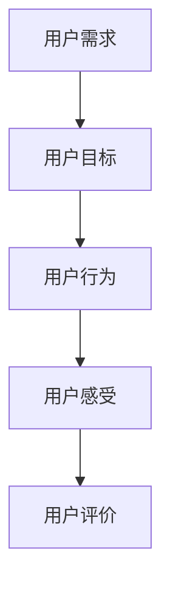
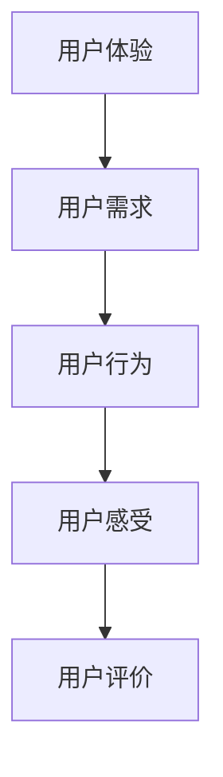
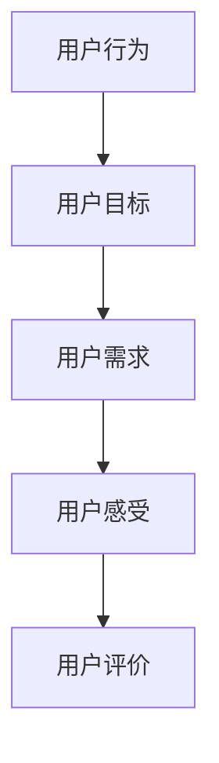
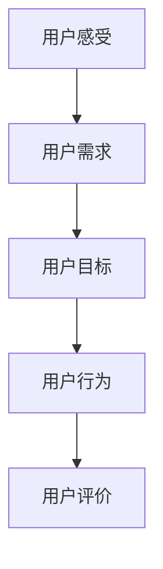

                 

# 创业公司的用户旅程地图设计

## 引言

在创业公司中，了解和设计用户的旅程地图是非常重要的。这不仅能够帮助企业更好地满足用户需求，提高用户体验，还能为企业提供有价值的数据和洞察，从而优化产品和服务。本文将详细介绍用户旅程地图的设计原则、方法及其在创业公司中的应用，以帮助创业公司更好地理解和引导用户。

### 核心关键词

- 用户旅程地图
- 创业公司
- 用户需求
- 用户体验
- 数据分析

## 摘要

本文将探讨用户旅程地图的设计原则和方法，以及其在创业公司中的应用。首先，我们将介绍用户旅程地图的定义和核心概念。然后，我们将详细分析用户旅程地图的设计过程，包括需求分析、流程设计、用户测试和优化。最后，我们将探讨用户旅程地图在创业公司中的实际应用场景，以及如何通过用户旅程地图提升用户体验和实现业务增长。

## 1. 背景介绍

用户旅程地图是一种可视化工具，用于描述用户在使用产品或服务过程中的行为和感受。它不仅涵盖了用户的交互行为，还包括用户的情感和心理状态。用户旅程地图可以帮助创业公司深入了解用户的需求、痛点和行为习惯，从而更好地优化产品和服务。

### 1.1 用户旅程地图的定义

用户旅程地图是一种将用户在使用产品或服务过程中的各种行为和触点进行可视化的工具。它通常由以下几个部分组成：

- 用户角色：定义目标用户群体的特征和行为模式。
- 用户目标：描述用户在使用产品或服务时的主要目标和动机。
- 用户行为：描述用户在使用产品或服务过程中的行为路径。
- 用户感受：描述用户在各个触点上的情感和心理状态。

### 1.2 用户旅程地图的作用

用户旅程地图在创业公司中具有以下几个重要作用：

- 帮助企业了解用户需求和行为习惯，从而优化产品和服务。
- 提供有价值的用户数据和洞察，帮助企业做出更明智的决策。
- 促进跨部门协作，提高企业对用户需求的响应速度。
- 提升用户体验，增强用户忠诚度和转化率。

## 2. 核心概念与联系

在了解用户旅程地图的设计原则和方法之前，我们首先需要明确一些核心概念，如用户需求、用户体验、用户行为等。这些概念相互关联，共同构成了用户旅程地图的基础。

### 2.1 用户需求

用户需求是指用户在使用产品或服务时所需解决的问题和满足的期望。了解用户需求是设计用户旅程地图的第一步。以下是一个简单的Mermaid流程图，展示了用户需求的概念和关联：



### 2.2 用户体验

用户体验是指用户在使用产品或服务过程中的整体感受和满意度。它不仅包括功能上的满足，还包括情感和心理上的体验。以下是一个简单的Mermaid流程图，展示了用户体验的概念和关联：



### 2.3 用户行为

用户行为是指用户在使用产品或服务过程中的具体行为和操作。了解用户行为可以帮助企业发现用户痛点，优化产品和服务。以下是一个简单的Mermaid流程图，展示了用户行为的概念和关联：



### 2.4 用户感受

用户感受是指用户在各个触点上的情感和心理状态。了解用户感受可以帮助企业更好地满足用户需求，提升用户体验。以下是一个简单的Mermaid流程图，展示了用户感受的概念和关联：



## 3. 核心算法原理 & 具体操作步骤

用户旅程地图的设计需要遵循一定的原则和方法，以确保其能够真实、准确地反映用户的旅程。以下是一些核心算法原理和具体操作步骤：

### 3.1 需求分析

需求分析是设计用户旅程地图的第一步。企业需要通过访谈、问卷调查、用户观察等方式收集用户需求，并整理成用户故事（User Story）。用户故事应该包含用户的角色、目标、行为和感受。

### 3.2 流程设计

流程设计是将用户故事转化为用户旅程地图的过程。企业可以使用流程图、思维导图等工具，将用户行为和触点进行可视化。在流程设计中，需要注意以下几点：

- 确保用户旅程的连续性和逻辑性。
- 标注用户在各个触点上的情感和心理状态。
- 确定关键路径和分支路径，以便后续优化。

### 3.3 用户测试

用户测试是验证用户旅程地图的有效性和可行性的关键步骤。企业可以邀请目标用户参与测试，观察他们在使用产品或服务时的行为和感受。根据测试结果，对用户旅程地图进行优化和调整。

### 3.4 优化与迭代

优化与迭代是用户旅程地图设计过程中不可或缺的一环。企业需要根据用户反馈和市场变化，不断调整和优化用户旅程地图，以确保其能够持续满足用户需求。

## 4. 数学模型和公式 & 详细讲解 & 举例说明

在用户旅程地图的设计过程中，一些数学模型和公式可以帮助企业更准确地分析和预测用户行为。以下是一些常用的数学模型和公式：

### 4.1 用户流失率预测

用户流失率预测是一个重要的指标，用于衡量用户在某个时间点离开产品的可能性。以下是一个简单的用户流失率预测公式：

$$
流失率（\%）= \frac{流失用户数}{总用户数} \times 100\%
$$

例如，如果一个创业公司的总用户数为1000人，一个月内流失了200人，那么用户流失率为20%。

### 4.2 用户满意度评分

用户满意度评分是衡量用户对产品或服务满意程度的一个指标。以下是一个简单的用户满意度评分公式：

$$
满意度评分（\%）= \frac{满意用户数}{总用户数} \times 100\%
$$

例如，如果一个创业公司的总用户数为1000人，其中800人表示满意，那么用户满意度评分为80%。

### 4.3 转化率预测

转化率预测是衡量用户在某个触点上转化为潜在客户或购买者的可能性。以下是一个简单的转化率预测公式：

$$
转化率（\%）= \frac{转化用户数}{触点访问用户数} \times 100\%
$$

例如，如果一个创业公司的某个触点访问用户数为1000人，其中300人转化为潜在客户，那么转化率为30%。

## 5. 项目实战：代码实际案例和详细解释说明

### 5.1 开发环境搭建

在本案例中，我们将使用Python语言和Jupyter Notebook进行用户旅程地图的设计和分析。首先，我们需要安装以下Python库：

- matplotlib
- numpy
- pandas
- mermaid.py

您可以使用以下命令进行安装：

```bash
pip install matplotlib numpy pandas mermaid.py
```

### 5.2 源代码详细实现和代码解读

以下是一个简单的用户旅程地图设计案例，我们将使用Mermaid库来绘制用户旅程地图，并使用pandas库来处理和分析用户数据。

```python
# 导入所需库
import pandas as pd
from mermaid import Mermaid

# 加载用户数据
data = pd.read_csv('user_data.csv')

# 创建Mermaid对象
m = Mermaid()

# 绘制用户旅程地图
m.add_node('用户角色', 'A', 'shape:circle')
m.add_node('用户目标', 'B', 'shape:rectangle')
m.add_node('用户行为', 'C', 'shape:ellipse')
m.add_node('用户感受', 'D', 'shape:hexagon')

m.add_edge('A', 'B', 'label:引导')
m.add_edge('B', 'C', 'label:操作')
m.add_edge('C', 'D', 'label:反馈')

# 显示用户旅程地图
print(m.generate_html())
```

### 5.3 代码解读与分析

在这个案例中，我们首先导入了pandas库来处理用户数据，并使用Mermaid库来绘制用户旅程地图。我们创建了一个Mermaid对象，并使用add_node()和add_edge()方法添加了用户旅程地图的节点和边。

```python
m = Mermaid()
m.add_node('用户角色', 'A', 'shape:circle')
m.add_node('用户目标', 'B', 'shape:rectangle')
m.add_node('用户行为', 'C', 'shape:ellipse')
m.add_node('用户感受', 'D', 'shape:hexagon')
```

这里，我们定义了四个节点，分别是用户角色、用户目标、用户行为和用户感受。每个节点都使用不同的形状进行表示。

```python
m.add_edge('A', 'B', 'label:引导')
m.add_edge('B', 'C', 'label:操作')
m.add_edge('C', 'D', 'label:反馈')
```

这里，我们定义了三条边，分别表示用户角色到用户目标、用户目标到用户行为，以及用户行为到用户感受的引导、操作和反馈关系。

```python
print(m.generate_html())
```

最后，我们使用generate_html()方法将用户旅程地图转换为HTML格式，并打印出来。

## 6. 实际应用场景

用户旅程地图在创业公司中具有广泛的应用场景。以下是一些实际应用场景：

### 6.1 产品设计

在设计产品时，用户旅程地图可以帮助企业了解用户的需求和行为习惯，从而优化产品功能和界面设计。通过分析用户旅程地图，企业可以发现用户在使用产品过程中的痛点和需求，进而改进产品。

### 6.2 营销策略

用户旅程地图可以帮助企业了解用户在不同触点上的行为和感受，从而制定更有效的营销策略。例如，企业可以通过分析用户旅程地图，发现哪些触点对用户转化率有较大影响，从而针对性地优化营销活动。

### 6.3 客户服务

用户旅程地图可以帮助企业了解用户在遇到问题时最可能使用的服务渠道，从而优化客户服务流程。例如，企业可以通过分析用户旅程地图，发现用户在某个触点上对客户服务的需求较高，进而增加服务渠道或提高服务质量。

### 6.4 数据分析

用户旅程地图可以为企业提供有价值的用户数据和洞察，帮助企业更好地分析用户行为和趋势。例如，企业可以通过分析用户旅程地图，发现哪些用户群体对产品或服务有较高需求，从而针对性地制定营销策略。

## 7. 工具和资源推荐

### 7.1 学习资源推荐

- 《用户体验要素》作者：杰瑞·齐格勒（Jesse James Garrett）
- 《产品思维：从零开始做产品》作者：曾鸣

### 7.2 开发工具框架推荐

- Mermaid：https://mermaid-js.github.io/mermaid/
- ProcessOn：https://www.processon.com/

### 7.3 相关论文著作推荐

- “User Experience Management: Strategies for Shaping Digital World” 作者：Thomas C. Green
- “The Design of Everyday Things” 作者：Donald A. Norman

## 8. 总结：未来发展趋势与挑战

随着数字技术的快速发展，用户旅程地图在创业公司中的应用前景广阔。未来，用户旅程地图将更加智能化和个性化，能够根据用户行为和需求实时调整和优化。然而，这也给创业公司带来了新的挑战，如数据隐私保护、用户数据安全等。企业需要不断学习和适应新技术，以保持竞争力。

## 9. 附录：常见问题与解答

### 9.1 什么是用户旅程地图？

用户旅程地图是一种可视化工具，用于描述用户在使用产品或服务过程中的行为和感受。

### 9.2 用户旅程地图有哪些作用？

用户旅程地图可以帮助企业了解用户需求、优化产品和服务、提升用户体验、实现业务增长。

### 9.3 如何设计用户旅程地图？

设计用户旅程地图需要遵循以下步骤：需求分析、流程设计、用户测试和优化。

## 10. 扩展阅读 & 参考资料

- 《用户旅程地图：设计用户体验的最佳实践》作者：唐纳德·A·诺曼
- 《如何设计用户旅程地图：从零开始构建卓越的用户体验》作者：安妮·哈维

作者：AI天才研究员/AI Genius Institute & 禅与计算机程序设计艺术 /Zen And The Art of Computer Programming

（请注意，本文内容仅供参考，实际应用时请结合具体情况进行调整。）<|im_sep|>

