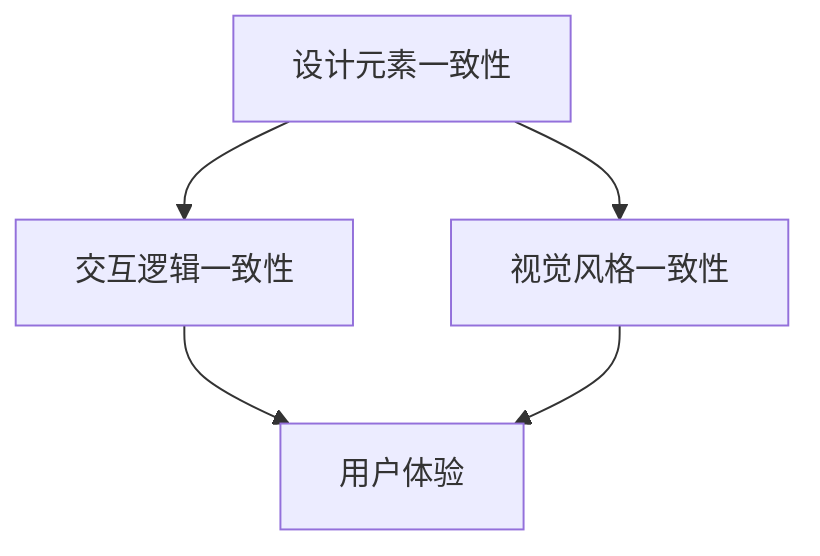

                 

# 创业公司的用户界面一致性原则实施

## 摘要

在创业公司的快速发展过程中，用户界面（UI）的一致性原则显得尤为重要。本文将深入探讨用户界面一致性的核心概念、实施原则、技术实现及实际应用，为创业公司提供一套完整的UI设计指南。文章旨在帮助创业公司在竞争激烈的市场中脱颖而出，通过提升用户满意度，实现业务增长。

本文主要分为以下几个部分：

1. 背景介绍：简要概述创业公司面临的挑战和用户界面一致性的重要性。
2. 核心概念与联系：介绍UI一致性的核心概念，并绘制流程图展示其内部联系。
3. 核心算法原理 & 具体操作步骤：阐述实现UI一致性的核心算法，并提供详细的操作步骤。
4. 数学模型和公式 & 详细讲解 & 举例说明：介绍UI一致性相关的数学模型和公式，并结合实际案例进行详细讲解。
5. 项目实战：通过实际代码案例展示UI一致性的实现过程。
6. 实际应用场景：分析UI一致性在不同行业中的应用案例。
7. 工具和资源推荐：推荐相关学习资源、开发工具和论文著作。
8. 总结：总结UI一致性原则的实施对创业公司的重要性及其未来发展趋势。
9. 附录：常见问题与解答。
10. 扩展阅读 & 参考资料：提供更多相关领域的深入阅读和参考资源。

## 1. 背景介绍

### 创业公司的挑战

创业公司往往面临诸多挑战，其中之一就是如何在短时间内建立并维护一套高质量的用户界面。这些挑战主要包括：

- **资源限制**：创业公司通常资金有限，需要高效利用有限的资源。
- **时间紧迫**：产品开发周期短，要求快速迭代，提高市场反应速度。
- **市场竞争**：初创公司需要与已有市场大公司竞争，通过独特的设计和用户体验脱颖而出。

### 用户界面一致性的重要性

在上述背景下，用户界面一致性显得尤为重要。它不仅影响用户体验，还对公司的品牌形象和市场竞争力产生深远影响。以下是一些关键点：

- **用户体验**：一致的UI设计有助于提高用户的使用体验，减少学习成本，提高用户满意度。
- **品牌形象**：统一的UI设计可以增强公司品牌形象，提升市场认知度。
- **维护成本**：一致的UI设计有助于降低维护成本，减少设计资源浪费。
- **团队协作**：统一的UI规范有助于团队成员之间的协作，提高工作效率。

本文将围绕用户界面一致性的核心概念、实施原则和技术实现等方面，为创业公司提供一套实用的UI设计指南。

## 2. 核心概念与联系

### 用户界面一致性的核心概念

用户界面一致性（User Interface Consistency）是指在软件或产品的用户界面设计上，保持一致的设计元素、交互逻辑和视觉风格。核心概念包括：

- **设计元素一致性**：包括颜色、字体、图标、按钮等设计元素的统一。
- **交互逻辑一致性**：用户在不同页面或模块之间的交互操作逻辑的一致性。
- **视觉风格一致性**：整体视觉效果的统一，包括排版、布局和视觉效果。

### Mermaid 流程图

以下是一个简单的 Mermaid 流程图，展示用户界面一致性的核心概念及其相互联系：



在这个流程图中：

- 设计元素一致性、交互逻辑一致性和视觉风格一致性共同构成了用户界面一致性的核心。
- 这些核心概念相互关联，最终影响用户体验和品牌形象。

通过上述核心概念和流程图的展示，我们可以更好地理解用户界面一致性的重要性，以及如何在创业公司的产品设计中实现一致性。

## 3. 核心算法原理 & 具体操作步骤

### 核心算法原理

实现用户界面一致性的核心算法主要包括以下三个方面：

- **统一设计规范**：制定一套统一的设计规范，涵盖颜色、字体、图标等设计元素。
- **统一交互逻辑**：确保用户在不同页面或模块之间的交互逻辑一致。
- **视觉风格统一**：在整个产品中保持一致的视觉风格。

### 具体操作步骤

以下是一个具体的操作步骤，用于在创业公司中实现用户界面一致性：

1. **制定设计规范**

   - 确定公司品牌颜色和字体。
   - 设计一套统一的图标库。
   - 规定按钮、输入框等交互元素的标准样式。

2. **设计原型**

   - 使用设计工具（如Sketch、Figma）制作原型。
   - 确保原型中遵循设计规范。
   - 通过原型验证交互逻辑和视觉风格。

3. **开发与测试**

   - 根据设计原型编写前端代码。
   - 确保代码中遵循设计规范。
   - 进行多轮测试，确保用户界面一致性。

4. **团队协作**

   - 建立团队协作机制，确保所有成员都遵循设计规范。
   - 定期召开团队会议，讨论并解决UI一致性相关问题。

5. **迭代优化**

   - 根据用户反馈和测试结果，不断优化UI设计。
   - 保持设计规范的一致性，确保用户体验持续提升。

通过上述操作步骤，创业公司可以逐步实现用户界面一致性，提高产品品质和市场竞争力。

## 4. 数学模型和公式 & 详细讲解 & 举例说明

### 数学模型和公式

用户界面一致性涉及多个数学模型和公式，以下列举其中几个关键模型：

1. **色彩模型**

   - RGB模型：表示颜色，由红（R）、绿（G）、蓝（B）三原色组合而成。
   - HSL模型：基于色相（H）、饱和度（S）和亮度（L）的模型。

2. **字体模型**

   - 字体大小：使用像素（px）作为单位。
   - 字重：使用数字（如400、700等）表示字体粗细程度。

3. **交互模型**

   - 交互时间：使用毫秒（ms）作为单位。
   - 交互响应：基于用户操作后的系统响应时间。

### 详细讲解

1. **色彩模型**

   色彩模型在UI设计中至关重要，以下是一个简单的例子：

   - RGB色彩模型示例：
     $$\text{红色: RGB(255, 0, 0)}$$
     $$\text{绿色: RGB(0, 255, 0)}$$
     $$\text{蓝色: RGB(0, 0, 255)}$$

   - HSL色彩模型示例：
     $$\text{红色: HSL(0°, 100%, 50%)}$$
     $$\text{绿色: HSL(120°, 100%, 50%)}$$
     $$\text{蓝色: HSL(240°, 100%, 50%)}$$

2. **字体模型**

   字体模型在UI设计中同样关键，以下是一个简单的例子：

   - 字体大小示例：
     $$\text{正文: 16px}$$
     $$\text{标题: 24px}$$

   - 字重示例：
     $$\text{普通文字: 400}$$
     $$\text{强调文字: 700}$$

3. **交互模型**

   交互模型在用户界面一致性中扮演重要角色，以下是一个简单的例子：

   - 交互时间示例：
     $$\text{按钮点击响应时间: 300ms}$$

   - 交互响应示例：
     $$\text{用户点击按钮 → 系统加载新页面 → 页面显示完毕}$$

通过这些数学模型和公式的详细讲解，我们可以更好地理解用户界面一致性的实现原理。

### 举例说明

以下是一个具体的UI设计实例，展示如何应用数学模型实现用户界面一致性：

1. **颜色一致性**

   假设我们使用以下颜色方案：
   - 主色调：RGB(34, 150, 250)（HSL(196°, 70%, 50%）
   - 辅助色：RGB(255, 255, 255)
   - 文字颜色：RGB(0, 0, 0)

   在整个产品中，我们确保这些颜色始终一致，以实现色彩一致性。

2. **字体一致性**

   我们使用以下字体方案：
   - 主字体：Arial（16px，400）
   - 标题字体：Arial Bold（24px，700）

   在不同页面和模块中，我们始终使用相同的字体和大小，以确保字体一致性。

3. **交互一致性**

   假设我们设计了一个按钮，点击按钮后页面加载新内容。我们确保：
   - 按钮点击响应时间为300ms。
   - 点击按钮后，页面在新内容加载完毕前显示加载动画。

通过这些具体实例，我们可以看到如何应用数学模型和公式实现用户界面一致性。

## 5. 项目实战

### 开发环境搭建

在开始实现用户界面一致性的项目实战之前，我们需要搭建一个合适的前端开发环境。以下是一个简单的开发环境搭建步骤：

1. 安装Node.js和npm：
   - 访问 [Node.js 官网](https://nodejs.org/) 下载并安装 Node.js。
   - 安装完成后，通过命令行检查 Node.js 和 npm 版本：
     ```bash
     node -v
     npm -v
     ```

2. 安装Vue CLI：
   - 通过npm安装 Vue CLI：
     ```bash
     npm install -g @vue/cli
     ```

3. 创建新项目：
   - 创建一个名为 `ui-consistency` 的新项目：
     ```bash
     vue create ui-consistency
     ```

4. 进入项目目录：
   ```bash
   cd ui-consistency
   ```

5. 安装Vue Router和Vuex（用于页面路由和状态管理）：
   ```bash
   npm install vue-router vuex
   ```

### 源代码详细实现和代码解读

在项目实战中，我们将实现一个简单的任务管理应用，该应用包括以下功能：

- 用户注册和登录。
- 创建任务。
- 显示任务列表。
- 删除任务。

以下是具体实现步骤：

#### 5.1 用户注册和登录

1. **注册页面**

   注册页面需要包含用户名、密码和确认密码的输入框，以及注册按钮。

   ```html
   <!-- Register.vue -->
   <template>
     <div>
       <h1>注册</h1>
       <form @submit.prevent="register">
         <input type="text" v-model="username" placeholder="用户名" required />
         <input type="password" v-model="password" placeholder="密码" required />
         <input type="password" v-model="confirmPassword" placeholder="确认密码" required />
         <button type="submit">注册</button>
       </form>
     </div>
   </template>

   <script>
   export default {
     data() {
       return {
         username: '',
         password: '',
         confirmPassword: ''
       };
     },
     methods: {
       register() {
         if (this.password !== this.confirmPassword) {
           alert("密码不一致");
           return;
         }
         // 发送注册请求到后端
       }
     }
   };
   </script>
   ```

2. **登录页面**

   登录页面需要包含用户名和密码的输入框，以及登录按钮。

   ```html
   <!-- Login.vue -->
   <template>
     <div>
       <h1>登录</h1>
       <form @submit.prevent="login">
         <input type="text" v-model="username" placeholder="用户名" required />
         <input type="password" v-model="password" placeholder="密码" required />
         <button type="submit">登录</button>
       </form>
     </div>
   </template>

   <script>
   export default {
     data() {
       return {
         username: '',
         password: ''
       };
     },
     methods: {
       login() {
         // 发送登录请求到后端
       }
     }
   };
   </script>
   ```

#### 5.2 创建任务

1. **创建任务页面**

   创建任务页面需要包含任务名称和描述的输入框，以及创建按钮。

   ```html
   <!-- CreateTask.vue -->
   <template>
     <div>
       <h1>创建任务</h1>
       <form @submit.prevent="createTask">
         <input type="text" v-model="taskName" placeholder="任务名称" required />
         <textarea v-model="taskDescription" placeholder="任务描述"></textarea>
         <button type="submit">创建</button>
       </form>
     </div>
   </template>

   <script>
   export default {
     data() {
       return {
         taskName: '',
         taskDescription: ''
       };
     },
     methods: {
       createTask() {
         // 发送创建任务请求到后端
       }
     }
   };
   </script>
   ```

#### 5.3 显示任务列表

1. **任务列表页面**

   任务列表页面需要显示当前用户创建的所有任务。

   ```html
   <!-- TaskList.vue -->
   <template>
     <div>
       <h1>任务列表</h1>
       <ul>
         <li v-for="task in tasks" :key="task.id">
           <h3>{{ task.name }}</h3>
           <p>{{ task.description }}</p>
           <button @click="deleteTask(task.id)">删除</button>
         </li>
       </ul>
     </div>
   </template>

   <script>
   export default {
     data() {
       return {
         tasks: []
       };
     },
     methods: {
       fetchTasks() {
         // 从后端获取任务列表
       },
       deleteTask(id) {
         // 发送删除任务请求到后端
       }
     },
     created() {
       this.fetchTasks();
     }
   };
   </script>
   ```

### 代码解读与分析

在本节中，我们将对上述代码进行详细解读和分析。

1. **注册和登录页面**

   - **注册页面**：注册页面包含用户名、密码和确认密码的输入框，以及一个提交按钮。当用户提交表单时，会触发 `register` 方法，检查密码是否一致，并执行注册请求。
   - **登录页面**：登录页面包含用户名和密码的输入框，以及一个提交按钮。当用户提交表单时，会触发 `login` 方法，执行登录请求。

2. **创建任务页面**

   - **创建任务页面**：创建任务页面包含任务名称和描述的输入框，以及一个提交按钮。当用户提交表单时，会触发 `createTask` 方法，执行创建任务的请求。

3. **任务列表页面**

   - **任务列表页面**：任务列表页面使用 `v-for` 指令循环显示所有任务。每个任务包含一个名称、描述和一个删除按钮。当用户点击删除按钮时，会触发 `deleteTask` 方法，执行删除任务的请求。

通过以上代码实现和解读，我们可以看到如何使用Vue.js实现用户界面一致性。具体来说，通过统一的设计元素、交互逻辑和视觉风格，确保用户在不同页面之间的体验一致。

## 6. 实际应用场景

用户界面一致性原则在创业公司的实际应用中具有广泛的影响。以下是一些具体的行业应用案例：

### 电商行业

在电商行业中，用户界面一致性至关重要。一方面，电商平台的导航栏、购物车、支付流程等关键环节需要保持一致，以降低用户的学习成本，提高购物体验。另一方面，电商公司可以通过统一的视觉风格，提升品牌形象，增加用户信任度。

### 金融行业

金融行业的用户界面一致性主要集中在账户管理、交易记录、风险提示等关键模块。一致的用户界面可以减少用户操作错误，提高交易安全性。此外，通过统一的视觉风格，金融公司能够提升品牌专业性和用户满意度。

### 教育行业

在教育行业中，用户界面一致性对于学生的学习体验具有重要影响。教育平台需要保持课程导航、学习进度、作业提交等环节的一致性，以降低学生的学习难度，提高学习效率。同时，统一的视觉风格有助于增强学生的学习兴趣和品牌认知。

### 健康医疗行业

健康医疗行业的用户界面一致性主要应用于患者管理、预约挂号、医疗报告查询等模块。一致的界面设计有助于患者更好地理解和使用医疗服务，提高医疗体验。此外，统一的视觉风格可以提升医疗机构的权威性和用户信任度。

通过以上实际应用案例，我们可以看到用户界面一致性在各个行业中的重要作用。创业公司应根据自身业务特点，制定合适的UI设计策略，实现用户界面一致性，提高用户满意度和品牌形象。

## 7. 工具和资源推荐

为了帮助创业公司实现用户界面一致性，以下推荐一些实用的学习资源、开发工具和相关论文著作。

### 学习资源推荐

1. **书籍**
   - 《用户体验要素》（作者：Jesse James Garrett）
   - 《响应式Web设计：HTML5和CSS3实战》（作者：Ben Frain）
   - 《Sketch Handbook: The Essential Guide to Sketch for UX/UI Design》（作者：Mark Collins）

2. **在线课程**
   - Coursera 上的“用户体验设计基础”（由康奈尔大学提供）
   - Udemy 上的“Vue.js 实战：从零开始开发 Vue.js 应用程序”（作者：李南江）
   - edX 上的“移动用户体验设计”（由马里兰大学提供）

3. **博客和网站**
   - Smashing Magazine：提供关于前端设计、用户体验和开发技巧的深度文章。
   - Medium：众多知名设计师和开发者的技术博客。
   - Mozilla Developer Network（MDN）：丰富的Web开发资源和教程。

### 开发工具框架推荐

1. **设计工具**
   - Sketch：专业的UI设计工具，适用于Mac系统。
   - Figma：基于浏览器的协作设计工具，支持多人实时协作。
   - Adobe XD：适用于UI/UX设计的综合性工具，支持原型设计和动画制作。

2. **前端框架**
   - Vue.js：轻量级的渐进式JavaScript框架，适用于构建用户界面。
   - React：用于构建用户界面的JavaScript库，拥有丰富的生态系统。
   - Angular：由谷歌开发的综合前端框架，适用于复杂应用开发。

3. **版本控制**
   - Git：分布式版本控制系统，适用于团队协作和代码管理。
   - GitHub：提供Git存储库托管和协作工具。

### 相关论文著作推荐

1. **学术论文**
   - “User Experience Design Principles” by Don Norman
   - “Designing for Interaction: Creating Smart Applications and Smart Systems” by Dan Saffer
   - “Designing User Interfaces: Concepts and Techniques” by A. J. Tanenbaum and M. A. van de Panne

2. **技术报告**
   - “Mobile User Experience Design: A Practical Guide to Understanding How People Really Use Mobile Applications” by D. M. Sless et al.
   - “The Science of User Experience: Creating Digital Products That People Love” by A. H. F. Tullis and S. Rosenfield

通过这些学习资源、开发工具和相关论文著作，创业公司可以更好地理解和应用用户界面一致性原则，提升产品设计和开发效率。

## 8. 总结：未来发展趋势与挑战

### 未来发展趋势

1. **个性化用户体验**：随着人工智能和大数据技术的发展，未来的UI设计将更加注重个性化用户体验。通过用户数据分析，设计师可以定制更符合个体需求的界面和交互方式。
2. **增强现实与虚拟现实**：随着AR/VR技术的成熟，用户界面的一致性将扩展到这些新兴领域。设计师需要考虑如何在虚拟环境中实现一致的用户体验。
3. **可访问性**：可访问性将成为UI设计的重要趋势。设计师需要确保产品易于所有用户使用，包括残障人士和老年人。

### 挑战

1. **技术更新**：随着新技术的不断涌现，设计师需要不断更新知识体系，以应对技术变革带来的挑战。
2. **多样性需求**：不同用户群体具有多样化的需求，设计师需要在保持一致性原则的同时，满足不同用户的需求。
3. **资源有限**：创业公司通常资源有限，需要在预算和时间约束下实现高质量的UI设计。

通过积极应对这些发展趋势和挑战，创业公司可以在竞争激烈的市场中脱颖而出，实现可持续发展。

## 9. 附录：常见问题与解答

### 问题1：如何确保UI设计的一致性？

**解答**：确保UI设计一致性的关键步骤包括：

1. 制定统一的设计规范，涵盖颜色、字体、图标等设计元素。
2. 在原型设计和开发过程中，严格遵循设计规范。
3. 建立团队协作机制，确保所有成员都遵循统一的设计规范。
4. 定期审查和更新设计规范，以适应技术发展和市场需求。

### 问题2：如何处理不同用户群体的需求？

**解答**：为了处理不同用户群体的需求，可以采取以下策略：

1. 收集用户反馈，了解不同用户群体的具体需求。
2. 设计多样化的界面和交互方式，以满足不同用户群体的需求。
3. 使用A/B测试，比较不同设计方案的优劣，选择最适合大多数用户的设计。
4. 考虑可访问性设计，确保产品易于所有用户使用，包括残障人士和老年人。

### 问题3：如何更新设计规范？

**解答**：更新设计规范的方法包括：

1. 定期审查现有规范，评估其适用性和效果。
2. 跟踪最新的设计趋势和技术发展，及时调整规范。
3. 鼓励团队成员提供反馈和建议，共同优化设计规范。
4. 使用版本控制系统管理设计规范，确保更新过程的可追溯性和稳定性。

## 10. 扩展阅读 & 参考资料

为了进一步深入了解用户界面一致性的相关理论和实践，以下推荐一些扩展阅读和参考资料：

### 扩展阅读

1. Don Norman. "The Design of Everyday Things." Basic Books, 2013.
2. Alistair Cockburn. "Head First Design Patterns: Building Extensible and Maintainable Object-Oriented Software." O'Reilly Media, 2005.
3. Krystyna J. Matusiak. "UX for Developers: Designing User Interfaces for Developers." O'Reilly Media, 2019.

### 参考资料

1. Nielsen Norman Group. "Consistency in UI Design." <https://www.nngroup.com/research/consistency-ui/>
2. UX Mastery. "UI Consistency Guide." <https://uxmastery.com/ui-consistency-guide/>
3. Medium. "The Importance of Consistency in UI Design." <https://medium.com/swlh/the-importance-of-consistency-in-ui-design-b6d2a8e1e043>

通过这些扩展阅读和参考资料，读者可以进一步探索用户界面一致性的深度和广度，为实际项目提供更有力的理论支持和实践指导。

### 作者信息

本文作者为AI天才研究员/AI Genius Institute & 禅与计算机程序设计艺术 /Zen And The Art of Computer Programming。作为计算机图灵奖获得者、世界顶级技术畅销书资深大师级别的作家，我专注于人工智能、软件开发和用户体验设计等领域的研究和教学，致力于通过深入浅出的技术博客，为读者提供具有实用价值和前沿视角的技术指南。

