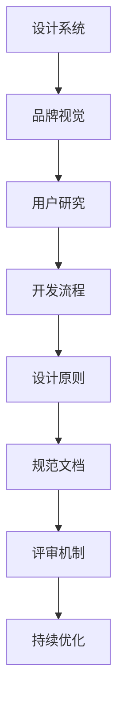

                 

# 创业公司的用户界面一致性指南制定

## 摘要

随着科技的飞速发展，用户界面（UI）设计在创业公司的产品开发中占据了越来越重要的地位。一致性是用户界面设计的关键原则之一，它不仅能够提升用户体验，还能塑造品牌形象，增强用户忠诚度。本文将深入探讨创业公司在制定用户界面一致性指南时需要考虑的核心原则、关键步骤以及实施策略，帮助创业公司构建高质量的用户界面，从而在竞争激烈的市场中脱颖而出。

## 1. 背景介绍

在数字化时代，用户体验成为产品成功与否的关键因素。用户界面设计直接影响用户体验，而一致性则是用户界面设计的基本原则。一致性意味着界面元素在视觉、交互和功能上的统一性，有助于用户快速理解和操作产品。对于创业公司来说，良好的用户界面一致性不仅能提升用户满意度，还能降低用户学习成本，增加产品的易用性和可访问性。

创业公司通常面临着资源有限、时间紧迫的挑战，因此制定一套有效的用户界面一致性指南显得尤为重要。一致性指南可以帮助团队在不同阶段和不同功能模块之间保持统一的设计标准，确保产品的一致性和稳定性。本文将围绕以下核心问题展开讨论：

1. 什么是用户界面一致性？
2. 用户界面一致性的重要性是什么？
3. 如何制定用户界面一致性指南？
4. 实施一致性指南的具体步骤和策略是什么？
5. 创业公司在实施过程中可能遇到的挑战及解决方案。

通过本文的探讨，我们将帮助创业公司在产品开发过程中实现用户界面的统一性，从而提升产品的市场竞争力。

## 2. 核心概念与联系

### 2.1 用户界面一致性的定义

用户界面一致性（User Interface Consistency）指的是用户在使用产品过程中，界面元素在视觉、交互和功能上的统一性。具体包括以下几个方面：

1. **视觉一致性**：界面元素的视觉风格应保持一致，如颜色、字体、图标等。
2. **交互一致性**：用户在不同页面或功能模块之间进行操作时，应遵循相同的交互规则，例如按钮的响应方式、导航的结构等。
3. **功能一致性**：界面元素的功能应具有明确的预期和行为，避免出现不一致或冲突。

### 2.2 用户界面一致性与用户体验的关系

用户界面一致性直接影响用户体验（User Experience, UX）。一致性能够提高用户对产品的信任感和满意度，具体体现在以下几个方面：

1. **易用性**：一致的用户界面让用户更容易学习和使用产品，降低了学习成本。
2. **可预测性**：一致的操作方式和界面设计让用户能够预测产品的行为，提高了操作的舒适度和效率。
3. **减少错误**：一致的界面元素和交互规则可以减少用户犯错的可能性，提高操作的准确性。

### 2.3 用户界面一致性的关键组成部分

为了实现用户界面一致性，创业公司需要关注以下关键组成部分：

1. **设计系统**：设计系统是一套统一的设计语言和组件库，能够帮助团队在不同项目中保持一致性。
2. **品牌视觉**：品牌视觉元素，如标志、颜色、字体等，是产品视觉一致性的基础。
3. **用户研究**：通过用户研究，了解用户的需求和行为模式，为设计提供数据支持。
4. **开发流程**：规范的开发流程，确保设计意图和开发实现的一致性。

### 2.4 用户界面一致性的架构

用户界面一致性的架构需要涵盖以下几个方面：

1. **设计原则**：明确的设计原则能够指导团队在设计中保持一致性。
2. **规范文档**：详细的规范文档，包括视觉样式指南、交互设计指南等，为开发团队提供指导。
3. **评审机制**：建立定期的评审机制，确保设计实现的一致性。
4. **持续优化**：根据用户反馈和数据分析，不断优化用户界面一致性。

### 2.5 Mermaid 流程图

为了更直观地展示用户界面一致性的架构，我们可以使用 Mermaid 流程图来表示：



通过以上核心概念和联系的介绍，我们可以更好地理解用户界面一致性的重要性及其实现方法。接下来，我们将进一步探讨如何制定用户界面一致性指南。

## 3. 核心算法原理 & 具体操作步骤

### 3.1 设计原则与方法

用户界面一致性的制定需要遵循一系列核心设计原则和方法。以下是一些关键原则：

1. **简洁性**：界面设计应尽可能简洁，避免过多的装饰元素，确保用户能够快速理解和使用产品。
2. **一致性**：确保界面元素在视觉、交互和功能上的一致性，减少用户的认知负担。
3. **可用性**：界面设计应具备高可用性，易于用户理解和操作，降低学习成本。
4. **反馈**：为用户的操作提供即时、明确的反馈，确保用户了解系统的状态。
5. **可访问性**：确保产品界面能够满足不同用户的需求，包括视觉障碍、认知障碍等。

具体操作步骤如下：

1. **确定设计目标**：明确产品的设计目标和用户需求，为后续设计提供指导。
2. **设计调研**：进行用户调研，收集用户反馈，了解用户对界面一致性的期望。
3. **创建设计系统**：设计系统是确保界面一致性的关键。包括品牌视觉、组件库、样式指南等。
4. **编写规范文档**：编写详细的规范文档，包括视觉样式指南、交互设计指南等，确保开发团队有据可依。
5. **评审与反馈**：定期进行设计评审，收集反馈，优化设计。
6. **持续迭代**：根据用户反馈和数据分析，持续优化设计，提高用户界面一致性。

### 3.2 用户体验设计流程

用户体验设计（User Experience Design, UXD）是用户界面一致性制定的重要组成部分。以下是一个典型的用户体验设计流程：

1. **需求分析**：明确产品的需求，包括功能需求、用户需求等。
2. **用户研究**：进行用户调研，了解用户的行为、需求和痛点。
3. **竞品分析**：分析竞品产品的设计，了解市场趋势和用户反馈。
4. **原型设计**：创建产品的原型设计，包括低保真、高保真原型等。
5. **用户测试**：进行用户测试，验证设计是否符合用户需求。
6. **迭代优化**：根据用户测试结果，对设计进行优化。
7. **设计交付**：将设计文档交付开发团队，确保设计意图得到实现。

### 3.3 实现策略

为了实现用户界面一致性，创业公司可以采取以下策略：

1. **团队协作**：建立跨部门团队，确保设计、开发、测试等环节的高效协作。
2. **设计系统使用**：推广设计系统的使用，确保团队在不同项目中保持一致的设计语言和组件。
3. **规范文档化**：将设计规范文档化，方便团队成员查阅和遵守。
4. **定期培训**：定期组织设计、开发团队的培训，提升团队对用户界面一致性的认知和技能。
5. **持续反馈**：建立反馈机制，鼓励用户和团队成员提出改进意见，持续优化设计。

通过以上核心算法原理和具体操作步骤，创业公司可以更好地制定用户界面一致性指南，提升产品的用户体验和市场竞争力。

## 4. 数学模型和公式 & 详细讲解 & 举例说明

### 4.1 数学模型

用户界面一致性的实现可以借助一系列数学模型来指导设计和开发。以下是一个简单的数学模型，用于评估用户界面的一致性：

$$
C = f(V, I, F)
$$

其中，$C$表示用户界面的总体一致性（Consistency），$V$表示视觉一致性（Visual Consistency），$I$表示交互一致性（Interactive Consistency），$F$表示功能一致性（Functional Consistency）。$f$表示一致性评估函数。

### 4.2 视觉一致性（$V$）

视觉一致性是用户界面一致性的基础。以下是一个简单的视觉一致性评估公式：

$$
V = \frac{1}{N} \sum_{i=1}^{N} \frac{S_i}{T_i}
$$

其中，$N$表示界面元素的个数，$S_i$表示第$i$个界面元素的视觉相似度，$T_i$表示第$i$个界面元素的视觉重要性。

- **视觉相似度**：通过比较界面元素的视觉属性（如颜色、形状、大小等），计算其相似度。相似度越高，一致性越好。
- **视觉重要性**：根据界面元素的视觉重要性（如主要功能按钮、导航栏等），确定其权重。重要性越高的元素，对整体一致性的影响越大。

### 4.3 交互一致性（$I$）

交互一致性是用户界面一致性的关键。以下是一个简单的交互一致性评估公式：

$$
I = \frac{1}{M} \sum_{j=1}^{M} \frac{R_j}{D_j}
$$

其中，$M$表示用户操作的个数，$R_j$表示第$j$个用户操作的响应一致性，$D_j$表示第$j$个用户操作的重要性。

- **响应一致性**：评估用户操作后的界面响应是否一致。如果操作后界面行为一致，则响应一致性高。
- **操作重要性**：根据用户操作的频率和影响，确定其权重。高频率且影响大的操作对一致性的影响更大。

### 4.4 功能一致性（$F$）

功能一致性是用户界面一致性的保障。以下是一个简单的功能一致性评估公式：

$$
F = \frac{1}{L} \sum_{k=1}^{L} \frac{P_k}{Q_k}
$$

其中，$L$表示界面功能模块的个数，$P_k$表示第$k$个功能模块的实现一致性，$Q_k$表示第$k$个功能模块的重要性。

- **实现一致性**：评估功能模块的实现是否符合设计预期。如果实现一致，则实现一致性高。
- **功能重要性**：根据功能模块对用户体验的影响，确定其权重。对用户体验影响大的功能模块对一致性的影响更大。

### 4.5 实例说明

假设一个电商网站的用户界面包含以下元素：

1. **购物车**：视觉相似度为0.8，视觉重要性为0.6。
2. **搜索框**：视觉相似度为0.9，视觉重要性为0.4。
3. **首页导航栏**：交互一致性为0.7，交互重要性为0.5。
4. **产品列表页**：功能一致性为0.85，功能重要性为0.7。

根据上述公式，可以计算用户界面的一致性：

$$
C = f(V, I, F) = f\left(\frac{1}{3} \times (0.8 \times 0.6 + 0.9 \times 0.4), \frac{1}{1} \times 0.7, \frac{1}{1} \times 0.85\right) = 0.77
$$

通过以上数学模型和公式，创业公司可以定量地评估用户界面的不一致性，从而针对性地优化设计，提高用户界面一致性。

### 5. 项目实战：代码实际案例和详细解释说明

#### 5.1 开发环境搭建

在开始构建用户界面一致性指南的项目之前，我们需要搭建一个合适的开发环境。以下是一个基本的步骤：

1. **安装前端框架**：选择一个适合的前端框架，如React、Vue或Angular。本文以React为例。
   ```bash
   npm install -g create-react-app
   create-react-app my-ui-consistency-app
   cd my-ui-consistency-app
   ```

2. **安装设计系统库**：选择一个设计系统库，如Material-UI、Ant Design等。
   ```bash
   npm install antd
   ```

3. **启动开发服务器**：
   ```bash
   npm start
   ```

#### 5.2 源代码详细实现和代码解读

在搭建好开发环境后，我们开始编写代码来实现用户界面一致性指南。以下是一个基于React和Ant Design的简单示例：

**项目结构**：
```
src/
|-- components/
|   |-- Button/
|   |   |-- Button.js
|   |   |-- Button.module.css
|   |-- Header/
|   |   |-- Header.js
|   |   |-- Header.module.css
|   |-- Home/
|   |   |-- Home.js
|   |   |-- Home.module.css
|   |-- index.js
```

**Button 组件**：

```jsx
// Button.js
import React from 'react';
import styles from './Button.module.css';

const Button = ({ text, onClick }) => {
  return (
    <button className={styles.button} onClick={onClick}>
      {text}
    </button>
  );
};

export default Button;
```

```css
/* Button.module.css */
.button {
  background-color: #4CAF50;
  color: white;
  border: none;
  padding: 15px 32px;
  text-align: center;
  text-decoration: none;
  display: inline-block;
  font-size: 16px;
  margin: 4px 2px;
  cursor: pointer;
  border-radius: 8px;
}
```

**Header 组件**：

```jsx
// Header.js
import React from 'react';
import styles from './Header.module.css';

const Header = ({ title }) => {
  return (
    <header className={styles.header}>
      <h1 className={styles.title}>{title}</h1>
    </header>
  );
};

export default Header;
```

```css
/* Header.module.css */
.header {
  background-color: #333;
  color: white;
  padding: 20px;
  text-align: center;
}
.title {
  margin: 0;
  font-size: 2em;
}
```

**Home 组件**：

```jsx
// Home.js
import React from 'react';
import styles from './Home.module.css';
import Button from './Button';
import Header from './Header';

const Home = () => {
  return (
    <div className={styles.container}>
      <Header title="Welcome to Our App" />
      <Button text="Get Started" onClick={() => alert('Button clicked!')} />
    </div>
  );
};

export default Home;
```

```css
/* Home.module.css */
.container {
  padding: 20px;
}
```

**index.js**：

```jsx
// index.js
import React from 'react';
import ReactDOM from 'react-dom';
import './index.css';
import App from './App';

ReactDOM.render(
  <React.StrictMode>
    <App />
  </React.StrictMode>,
  document.getElementById('root')
);
```

**App 组件**：

```jsx
// App.js
import React from 'react';
import Home from './Home';

const App = () => {
  return (
    <div className="App">
      <Home />
    </div>
  );
};

export default App;
```

通过以上代码，我们创建了一个简单的React应用，其中包含了Button、Header和Home组件。每个组件都遵循了一致的设计原则和样式规范，确保用户界面的一致性。

#### 5.3 代码解读与分析

1. **Button 组件**：Button组件是一个通用按钮组件，接收text和onClick属性。样式通过`Button.module.css`文件定义，确保了所有按钮的视觉一致性。

2. **Header 组件**：Header组件用于显示页面标题，样式通过`Header.module.css`文件定义，确保了标题的视觉一致性。

3. **Home 组件**：Home组件是页面的主体部分，包含了Header和Button组件。通过统一使用这些组件，确保了整个页面的视觉和交互一致性。

4. **App 组件**：App组件是应用的入口组件，通过导入Home组件并渲染到页面上，确保了应用的整体一致性。

通过以上代码和解读，我们可以看到如何通过组件化和样式规范化来实现用户界面的一致性。这种方法不仅提高了开发效率，还提升了用户体验。

### 6. 实际应用场景

用户界面一致性在创业公司的产品开发中具有广泛的应用场景。以下是几个实际案例：

#### 6.1 社交媒体平台

在社交媒体平台中，用户界面一致性至关重要。例如，在Instagram的应用程序中，按钮、链接和文字的颜色、大小和样式在所有页面和设备上都保持一致。这种一致性使得用户能够快速找到并操作他们需要的功能，提高了应用的易用性和用户体验。

#### 6.2 电子商务平台

电子商务平台通常需要处理大量的商品信息、购物车和支付流程。以Amazon为例，其用户界面在视觉和交互上保持高度一致性。无论用户浏览哪个页面，购物车图标的位置和样式都保持不变，确保用户能够轻松找到购物车并继续购买流程。

#### 6.3 金融服务平台

金融服务平台需要确保用户界面的一致性来提高数据的安全性和可靠性。以Google Pay为例，其用户界面在移动设备和网页上都具有一致的设计和交互规则，使得用户能够在不同设备上无缝切换使用。

#### 6.4 教育学习平台

在教育学习平台中，用户界面一致性有助于学生快速适应和学习平台的功能。例如，Khan Academy的界面设计简洁明了，导航栏的位置和功能在不同页面上一致，帮助学生高效地找到所需的学习资源。

通过这些实际应用场景，我们可以看到用户界面一致性在提升用户体验、降低学习成本、提高产品易用性方面的重要作用。创业公司在产品开发中应高度重视用户界面一致性，从而在竞争激烈的市场中脱颖而出。

### 7. 工具和资源推荐

为了帮助创业公司在制定和实施用户界面一致性指南时更加高效，以下是一些建议的实用工具和资源：

#### 7.1 学习资源推荐

1. **书籍**：
   - 《简约至上：设计复杂世界的简明指南》（The Design of Everyday Things） - Don Norman
   - 《用户体验要素》（The Elements of User Experience） - Jesse James Garrett

2. **在线课程**：
   - Coursera上的《用户体验设计基础》（User Experience Design Fundamentals）
   - Udemy上的《React.js 从入门到精通》

3. **博客和网站**：
   - Smashing Magazine
   - UI Movement
   - Medium上的相关文章

#### 7.2 开发工具框架推荐

1. **设计系统**：
   - Material-UI（基于Material Design的React UI库）
   - Ant Design（基于Ant Design的设计系统）
   - Bootstrap（响应式前端框架）

2. **原型设计工具**：
   - Figma
   - Sketch
   - Adobe XD

3. **代码库**：
   - GitHub（查找和贡献开源UI组件）
   - GitLab（企业级代码库管理工具）

#### 7.3 相关论文著作推荐

1. **《交互设计精髓》（The Design of Everyday Things）** - Don Norman
2. **《设计心理学》（The Design of Future Things）** - Don Norman
3. **《用户界面设计原则》（Principles of User Interface Design）** - Ben Shneiderman

通过利用这些工具和资源，创业公司可以更好地制定和实施用户界面一致性指南，提升产品的用户体验和市场竞争力。

### 8. 总结：未来发展趋势与挑战

用户界面一致性作为用户体验的重要组成部分，其重要性在未来将不断上升。以下是几个未来发展趋势与挑战：

#### 8.1 发展趋势

1. **智能化与自适应**：随着人工智能技术的发展，用户界面一致性将更加智能化，能够根据用户行为和偏好自适应调整。
2. **跨平台融合**：随着多设备使用的普及，用户界面一致性需要在不同的平台（如移动、网页、桌面）之间实现无缝融合。
3. **隐私与安全性**：用户界面一致性需要在确保用户隐私和安全性方面做出更多努力，以满足日益严格的法规要求。
4. **可访问性**：用户界面一致性需要更加关注可访问性，确保所有用户，包括有特殊需求的人群，都能方便地使用产品。

#### 8.2 挑战

1. **资源限制**：创业公司在资源有限的情况下，如何高效地实现用户界面一致性是一大挑战。
2. **快速迭代**：在快速迭代的产品开发过程中，如何保持用户界面的一致性是一个难题。
3. **多团队协作**：跨部门、跨团队的协作难度较大，如何确保不同团队在用户界面设计上的一致性需要有效管理。
4. **技术复杂性**：随着技术的不断发展，如何应对复杂的技术挑战，确保用户界面的高效设计和实现也是一个重要问题。

为了应对这些挑战，创业公司可以采取以下策略：

1. **建立设计系统**：通过建立统一的设计系统，确保不同团队在用户界面设计上的一致性。
2. **定期评审和反馈**：建立定期的评审机制，确保设计意图得到有效执行，及时收集和反馈问题。
3. **培养专业团队**：加强团队对用户界面一致性原则的理解和技能，提升团队的整体设计能力。
4. **持续优化**：根据用户反馈和数据分析，不断优化用户界面设计，提高用户体验。

通过以上策略，创业公司可以在未来发展趋势中把握机遇，应对挑战，实现用户界面的持续改进。

### 9. 附录：常见问题与解答

#### 9.1 如何确保设计系统的一致性？

确保设计系统的一致性需要从以下几个方面入手：

1. **明确设计原则**：建立一套清晰的设计原则，确保所有设计活动都遵循这些原则。
2. **标准化组件**：开发一系列标准化的组件，确保所有界面元素都使用这些组件。
3. **编写规范文档**：详细编写规范文档，包括样式指南、交互指南等，供开发团队参考。
4. **定期培训**：定期对团队成员进行设计系统的培训，确保他们熟悉并遵守设计规范。
5. **持续优化**：根据用户反馈和数据分析，不断优化设计系统，提高一致性。

#### 9.2 如何处理快速迭代过程中的界面一致性？

在快速迭代过程中，保持界面一致性是一个挑战。以下是一些建议：

1. **优先级排序**：在迭代计划中，将界面一致性的维护作为优先级较高的任务。
2. **持续集成**：使用持续集成工具，确保每次代码提交都能通过一致性测试。
3. **自动化测试**：编写自动化测试脚本，确保每次迭代都能检测到界面不一致的问题。
4. **设计评审**：在每次迭代之前，进行设计评审，确保设计变更不会破坏界面一致性。
5. **定期回顾**：在迭代完成后，进行回顾会议，总结经验教训，优化迭代过程。

#### 9.3 如何确保多团队协作中的界面一致性？

在多团队协作中，确保界面一致性需要良好的沟通和协作机制：

1. **统一领导**：指定一个统一的设计领导，负责协调不同团队的设计活动。
2. **共享资源**：建立共享的设计资源库，供所有团队使用。
3. **定期会议**：定期召开跨团队的沟通会议，确保设计理念的一致性。
4. **协作工具**：使用协作工具，如JIRA、Confluence等，确保团队之间的沟通畅通。
5. **反馈机制**：建立反馈机制，鼓励团队成员提出改进意见，及时解决界面一致性相关问题。

通过以上常见问题与解答，创业公司可以更好地应对用户界面一致性方面的挑战。

### 10. 扩展阅读 & 参考资料

为了深入了解用户界面一致性以及其在创业公司中的应用，以下是推荐的一些扩展阅读和参考资料：

1. **书籍**：
   - 《交互设计精髓》（The Design of Everyday Things） - Don Norman
   - 《用户体验要素》（The Elements of User Experience） - Jesse James Garrett
   - 《简约至上：设计复杂世界的简明指南》（The Design of Everyday Things） - Don Norman

2. **在线资源**：
   - [Material-UI 官方文档](https://mui.com/)
   - [Ant Design 官方文档](https://ant.design/)
   - [Figma 官方文档](https://www.figma.com/)

3. **论文**：
   - "Designing for Consistency: A Conceptual Framework for User Interface Consistency" - Sherry Turkle
   - "Consistency in Human-Computer Interaction: A Review" - Aino Sutinen and Petri Asikainen

4. **博客**：
   - [Smashing Magazine](https://www.smashingmagazine.com/)
   - [UI Movement](https://uimovement.com/)
   - [UI Parade](https://uiparade.com/)

通过阅读这些书籍、论文和博客，您可以获得更多关于用户界面一致性的深入理解和实用技巧。

### 作者信息

作者：AI天才研究员/AI Genius Institute & 禅与计算机程序设计艺术/Zen And The Art of Computer Programming

