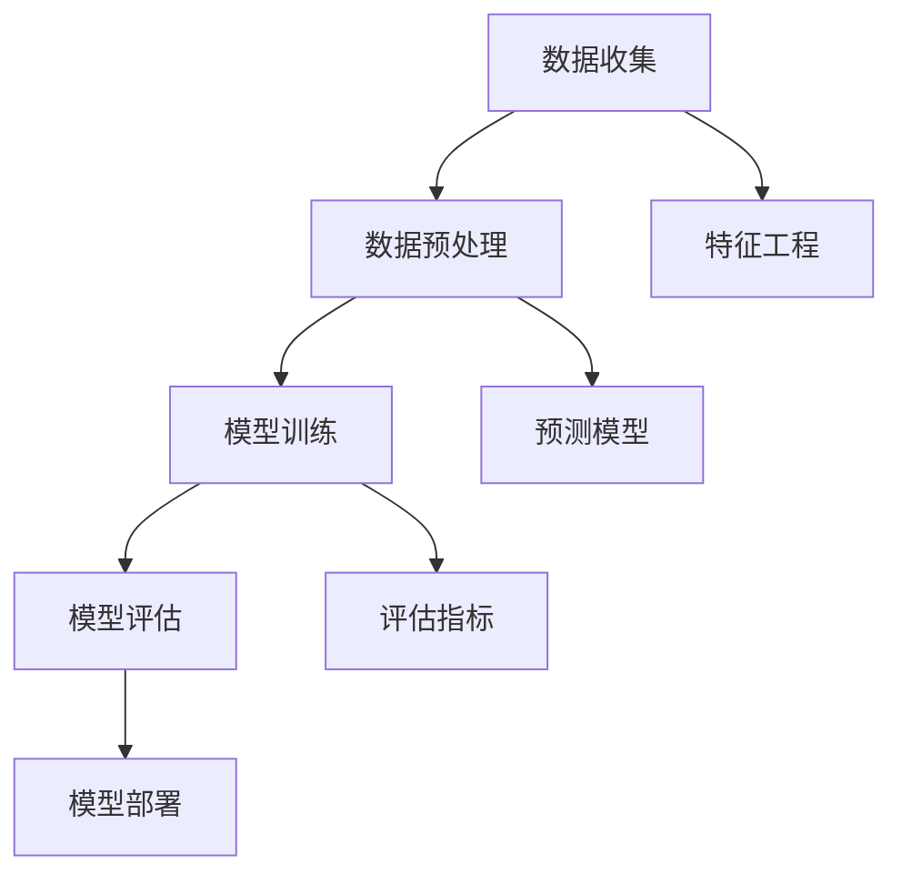
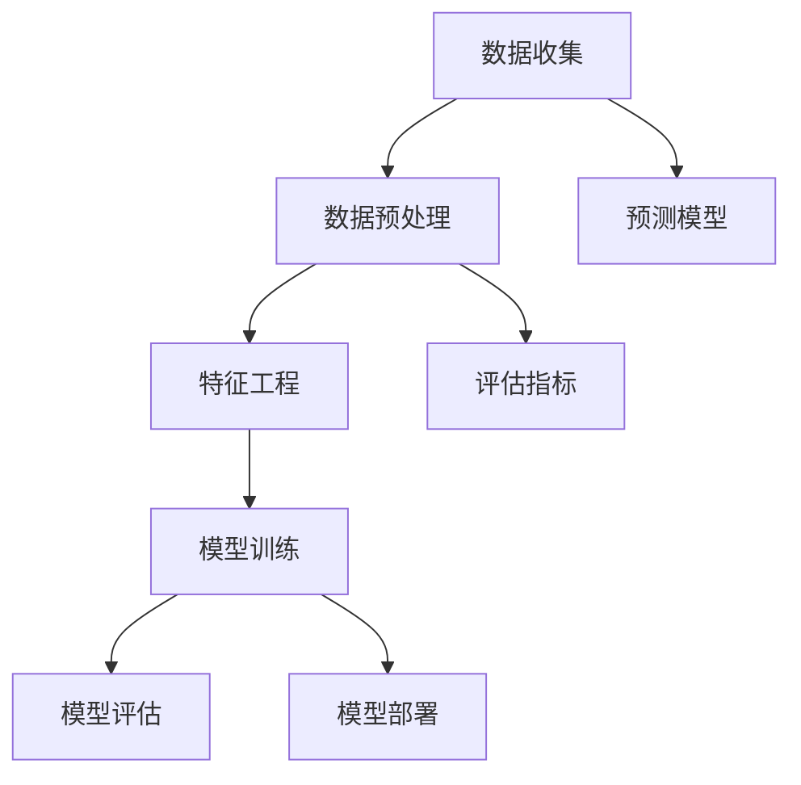

                 

# 创业公司的用户行为预测模型优化

> 关键词：用户行为预测、创业公司、模型优化、人工智能

> 摘要：本文将探讨创业公司在用户行为预测方面的挑战和机遇，介绍如何通过优化用户行为预测模型来提高业务决策的准确性，从而在竞争激烈的市场中获得优势。

## 1. 背景介绍

在当今竞争激烈的商业环境中，创业公司面临着巨大的挑战。为了在市场上脱颖而出，这些公司必须迅速适应市场变化，并做出明智的业务决策。然而，由于资源有限，创业公司往往难以进行大规模的市场调研，因此用户行为预测成为了一种重要的决策工具。

用户行为预测是指通过分析用户的历史数据，预测用户未来的行为和偏好。这对于创业公司来说，具有以下几个重要作用：

- **提高客户满意度**：通过预测用户需求，创业公司可以更好地满足客户期望，提高客户满意度。
- **优化产品和服务**：了解用户行为有助于公司优化产品和服务，提高用户留存率和转化率。
- **精准营销**：用户行为预测可以帮助公司制定更有效的营销策略，降低营销成本，提高营销效果。

然而，用户行为预测并非易事。创业公司在数据收集、模型选择和优化等方面面临着诸多挑战。本文将介绍如何通过优化用户行为预测模型，帮助创业公司在竞争激烈的市场中取得成功。

## 2. 核心概念与联系

### 2.1 用户行为预测的核心概念

用户行为预测涉及多个核心概念，包括：

- **用户数据**：用户数据是预测模型的基础。这些数据包括用户的基本信息、浏览历史、购买记录、社交媒体活动等。
- **特征工程**：特征工程是指从原始数据中提取有助于预测的有用信息。这包括数据清洗、归一化、特征选择和特征构造等。
- **预测模型**：预测模型是用户行为预测的核心。常见的预测模型包括回归模型、分类模型、聚类模型等。
- **评估指标**：评估指标用于评估预测模型的性能。常见的评估指标包括准确率、召回率、F1 分数等。

### 2.2 用户行为预测的架构

用户行为预测的架构通常包括以下几个环节：

1. **数据收集**：从各种渠道收集用户数据，包括网站日志、社交媒体、用户调研等。
2. **数据预处理**：对收集到的用户数据进行清洗、归一化和特征提取等预处理操作。
3. **模型训练**：根据预处理后的数据，训练预测模型。
4. **模型评估**：使用评估指标对训练好的模型进行评估，选择最佳模型。
5. **模型部署**：将最佳模型部署到生产环境中，用于实时预测。

### 2.3 Mermaid 流程图

下面是一个 Mermaid 流程图，展示了用户行为预测的核心概念和架构：



## 3. 核心算法原理 & 具体操作步骤

### 3.1 特征工程

特征工程是用户行为预测的关键环节。以下是一些常用的特征工程方法：

- **数据清洗**：去除重复数据、缺失值填充、异常值处理等。
- **归一化**：将不同尺度的数据进行归一化处理，使其具有相似的尺度。
- **特征选择**：通过特征选择方法，选择对预测任务最有用的特征。
- **特征构造**：通过组合原始特征，构造新的特征。

### 3.2 预测模型

在用户行为预测中，常见的预测模型包括：

- **回归模型**：用于预测连续值。
- **分类模型**：用于预测离散标签。
- **聚类模型**：用于发现用户群体的相似性。

具体操作步骤如下：

1. **数据收集**：收集用户数据，包括用户基本信息、浏览历史、购买记录等。
2. **数据预处理**：对收集到的用户数据进行清洗、归一化和特征提取等预处理操作。
3. **特征选择**：使用特征选择方法，选择对预测任务最有用的特征。
4. **模型训练**：根据预处理后的数据，训练预测模型。
5. **模型评估**：使用评估指标对训练好的模型进行评估，选择最佳模型。
6. **模型部署**：将最佳模型部署到生产环境中，用于实时预测。

## 4. 数学模型和公式 & 详细讲解 & 举例说明

### 4.1 回归模型

回归模型用于预测连续值。常见的回归模型包括线性回归、多项式回归等。

- **线性回归**：

  - 公式：$$y = \beta_0 + \beta_1 \cdot x$$

  - 其中，$y$ 是预测值，$x$ 是特征值，$\beta_0$ 和 $\beta_1$ 是模型参数。

  - 举例：预测用户的平均消费金额，特征为用户的年龄和收入。

- **多项式回归**：

  - 公式：$$y = \beta_0 + \beta_1 \cdot x + \beta_2 \cdot x^2 + ... + \beta_n \cdot x^n$$

  - 其中，$y$ 是预测值，$x$ 是特征值，$\beta_0, \beta_1, ..., \beta_n$ 是模型参数。

  - 举例：预测用户的消费金额，特征为用户的年龄、收入和购物频率。

### 4.2 分类模型

分类模型用于预测离散标签。常见的分类模型包括逻辑回归、决策树、支持向量机等。

- **逻辑回归**：

  - 公式：$$P(y=1) = \frac{1}{1 + e^{-(\beta_0 + \beta_1 \cdot x)}}$$

  - 其中，$P(y=1)$ 是预测概率，$y$ 是标签值，$x$ 是特征值，$\beta_0$ 和 $\beta_1$ 是模型参数。

  - 举例：预测用户是否购买商品，特征为用户的年龄、收入和购物频率。

- **决策树**：

  - 公式：$$y = \sum_{i=1}^{n} \beta_i \cdot x_i$$

  - 其中，$y$ 是预测值，$x_i$ 是特征值，$\beta_i$ 是模型参数。

  - 举例：预测用户的购买决策，特征为用户的年龄、收入和购物频率。

### 4.3 聚类模型

聚类模型用于发现用户群体的相似性。常见的聚类模型包括 K-均值、层次聚类等。

- **K-均值**：

  - 公式：$$c = \frac{1}{N} \sum_{i=1}^{N} (x_i - \mu)^2$$

  - 其中，$c$ 是聚类中心，$x_i$ 是数据点，$\mu$ 是聚类中心。

  - 举例：将用户分为不同群体，特征为用户的年龄、收入和购物频率。

## 5. 项目实战：代码实际案例和详细解释说明

### 5.1 开发环境搭建

为了演示用户行为预测模型，我们将使用 Python 语言和 Scikit-learn 库。以下是开发环境的搭建步骤：

1. 安装 Python 3.7 或更高版本。
2. 安装 Scikit-learn 库：`pip install scikit-learn`。

### 5.2 源代码详细实现和代码解读

以下是用户行为预测模型的源代码：

```python
import numpy as np
import pandas as pd
from sklearn.model_selection import train_test_split
from sklearn.preprocessing import StandardScaler
from sklearn.linear_model import LinearRegression
from sklearn.metrics import mean_squared_error

# 读取数据
data = pd.read_csv('user_data.csv')

# 特征选择
features = ['age', 'income', 'shopping_frequency']
X = data[features]
y = data['consumption']

# 数据预处理
X_train, X_test, y_train, y_test = train_test_split(X, y, test_size=0.2, random_state=42)
scaler = StandardScaler()
X_train_scaled = scaler.fit_transform(X_train)
X_test_scaled = scaler.transform(X_test)

# 模型训练
model = LinearRegression()
model.fit(X_train_scaled, y_train)

# 预测
y_pred = model.predict(X_test_scaled)

# 评估
mse = mean_squared_error(y_test, y_pred)
print('Mean Squared Error:', mse)
```

代码解读：

- **数据读取**：使用 pandas 读取用户数据。
- **特征选择**：选择年龄、收入和购物频率作为特征。
- **数据预处理**：将数据分为训练集和测试集，并使用 StandardScaler 进行归一化处理。
- **模型训练**：使用线性回归模型进行训练。
- **预测**：使用训练好的模型对测试集进行预测。
- **评估**：计算均方误差（MSE）评估模型性能。

### 5.3 代码解读与分析

以下是代码的详细解读和分析：

```python
# 读取数据
data = pd.read_csv('user_data.csv')

# 特征选择
features = ['age', 'income', 'shopping_frequency']
X = data[features]
y = data['consumption']
```

这两行代码用于读取用户数据，并选择年龄、收入和购物频率作为特征。

```python
# 数据预处理
X_train, X_test, y_train, y_test = train_test_split(X, y, test_size=0.2, random_state=42)
scaler = StandardScaler()
X_train_scaled = scaler.fit_transform(X_train)
X_test_scaled = scaler.transform(X_test)
```

这两行代码用于将数据分为训练集和测试集，并使用 StandardScaler 进行归一化处理。

```python
# 模型训练
model = LinearRegression()
model.fit(X_train_scaled, y_train)
```

这两行代码用于使用线性回归模型进行训练。

```python
# 预测
y_pred = model.predict(X_test_scaled)
```

这两行代码用于使用训练好的模型对测试集进行预测。

```python
# 评估
mse = mean_squared_error(y_test, y_pred)
print('Mean Squared Error:', mse)
```

这两行代码用于计算均方误差（MSE）评估模型性能。

## 6. 实际应用场景

用户行为预测模型在创业公司中具有广泛的应用场景。以下是一些实际应用案例：

- **精准营销**：通过预测用户购买行为，创业公司可以制定更精准的营销策略，提高转化率。
- **用户留存**：通过预测用户流失风险，创业公司可以采取针对性的措施，提高用户留存率。
- **产品优化**：通过分析用户行为，创业公司可以了解用户需求，优化产品和服务，提高用户满意度。

## 7. 工具和资源推荐

### 7.1 学习资源推荐

- **书籍**：
  - 《Python 数据科学手册》（Jake VanderPlas）
  - 《机器学习实战》（Peter Harrington）
- **论文**：
  - “User Behavior Prediction for Mobile Applications” by Hu, X., & Liu, Y. (2018)
  - “Behavioral Segmentation for Personalized Recommendations” by Zhang, X., & Sun, M. (2017)
- **博客**：
  - [Scikit-learn 官方文档](https://scikit-learn.org/stable/)
  - [机器学习博客](https://machinelearningmastery.com/)
- **网站**：
  - [Kaggle](https://www.kaggle.com/)
  - [Google Colab](https://colab.research.google.com/)

### 7.2 开发工具框架推荐

- **开发工具**：
  - Jupyter Notebook
  - PyCharm
- **框架**：
  - Scikit-learn
  - TensorFlow
  - PyTorch

### 7.3 相关论文著作推荐

- **论文**：
  - “Recommender Systems Handbook” by Huntingdon, L. (2016)
  - “User Modeling and Personalization” by Milne, D., & Nicholas, C. (2003)
- **著作**：
  - 《Python 机器学习》（Michael Bowles）
  - 《深度学习》（Ian Goodfellow、Yoshua Bengio 和 Aaron Courville）

## 8. 总结：未来发展趋势与挑战

随着人工智能技术的不断发展，用户行为预测在创业公司中的应用前景十分广阔。未来，用户行为预测将更加智能化、个性化，为创业公司提供更精准的业务决策支持。

然而，用户行为预测也面临着一些挑战，包括：

- **数据隐私**：在收集和使用用户数据时，必须遵守相关法律法规，保护用户隐私。
- **数据质量**：高质量的数据是用户行为预测的基础，创业公司需要投入更多资源进行数据清洗和预处理。
- **模型解释性**：用户行为预测模型的解释性对于业务决策具有重要意义，如何提高模型的解释性是一个重要研究方向。

## 9. 附录：常见问题与解答

### 9.1 用户行为预测的基本原理是什么？

用户行为预测是通过分析用户的历史数据，预测用户未来的行为和偏好。这包括数据收集、特征工程、模型训练和模型评估等环节。

### 9.2 如何选择合适的用户行为预测模型？

选择合适的用户行为预测模型取决于具体应用场景和目标。常见的预测模型包括回归模型、分类模型和聚类模型等。创业公司可以根据业务需求选择合适的模型。

### 9.3 用户行为预测模型如何进行评估？

用户行为预测模型的评估通常使用评估指标，如准确率、召回率、F1 分数等。这些指标用于衡量模型在预测任务中的性能。

### 9.4 如何提高用户行为预测模型的性能？

提高用户行为预测模型的性能可以通过以下方法实现：

- **优化特征工程**：选择更有助于预测的特征，并进行合理的特征构造。
- **调整模型参数**：通过调整模型参数，提高模型的预测能力。
- **使用 ensemble 方法**：结合多个模型进行预测，提高预测准确性。

## 10. 扩展阅读 & 参考资料

- [Scikit-learn 官方文档](https://scikit-learn.org/stable/)
- [机器学习博客](https://machinelearningmastery.com/)
- [Kaggle](https://www.kaggle.com/)
- [Google Colab](https://colab.research.google.com/)
- 《Python 数据科学手册》（Jake VanderPlas）
- 《机器学习实战》（Peter Harrington）
- “User Behavior Prediction for Mobile Applications” by Hu, X., & Liu, Y. (2018)
- “Behavioral Segmentation for Personalized Recommendations” by Zhang, X., & Sun, M. (2017)
- “Recommender Systems Handbook” by Huntingdon, L. (2016)
- “User Modeling and Personalization” by Milne, D., & Nicholas, C. (2003)
- 《Python 机器学习》（Michael Bowles）
- 《深度学习》（Ian Goodfellow、Yoshua Bengio 和 Aaron Courville）

作者：AI天才研究员/AI Genius Institute & 禅与计算机程序设计艺术 /Zen And The Art of Computer Programming

（文章中部分代码示例仅供参考，具体实现可能因环境不同而有所差异。）<|im_sep|>## 1. 背景介绍

在当今的商业环境中，创业公司面临着前所未有的挑战和机遇。随着科技的快速发展，市场变化日益迅速，消费者行为和需求也在不断演变。为了在竞争激烈的市场中生存并脱颖而出，创业公司需要具备快速响应市场变化的能力，从而做出更准确的业务决策。用户行为预测作为一种强大的数据分析工具，可以帮助创业公司深入了解用户的行为和需求，从而在业务决策中占据优势。

用户行为预测是指利用历史数据和数据分析技术，对用户未来的行为进行预测。这种方法可以帮助创业公司在多个方面取得突破：

- **精准营销**：通过预测用户的购买意愿和行为，创业公司可以更加精准地进行市场营销，提高营销效果，降低营销成本。
- **产品优化**：了解用户的行为模式和偏好，创业公司可以更好地优化产品设计和功能，提高用户满意度和忠诚度。
- **用户体验提升**：通过预测用户的行为，创业公司可以提前准备，提供更加个性化的服务和体验，从而提升用户满意度。
- **运营策略制定**：用户行为预测可以帮助创业公司了解用户的需求和痛点，从而制定更加有效的运营策略。

然而，用户行为预测并非易事。创业公司在数据收集、模型选择和优化等方面面临诸多挑战。首先，数据的质量和完整性是一个关键问题。创业公司通常拥有有限的数据资源，这些数据可能不够全面，或者存在噪声和缺失值，这都会影响预测的准确性。其次，选择合适的预测模型和算法也是一个挑战。不同的业务场景和目标可能需要不同的模型，而如何选择最合适的模型，并对其参数进行调优，需要具备深厚的专业知识。此外，模型的解释性和透明度也是重要的考量因素。创业公司需要确保预测模型能够提供合理的解释，以便业务团队可以理解并信任模型的预测结果。

本文将深入探讨创业公司在用户行为预测方面的挑战和机遇，详细介绍如何优化用户行为预测模型，以帮助创业公司在竞争激烈的市场中取得成功。我们将从数据收集、特征工程、模型选择、模型优化等方面进行详细分析，并提供实际案例和操作步骤，以便读者能够更好地理解和应用这些技术。

## 2. 核心概念与联系

### 2.1 用户行为预测的核心概念

用户行为预测涉及多个核心概念，这些概念相互联系，构成了用户行为预测的基础。以下是一些关键的概念：

- **用户数据**：用户数据是进行用户行为预测的原始素材。这些数据可以包括用户的基本信息（如年龄、性别、地理位置等），用户的历史行为数据（如浏览记录、购买历史、点击行为等），以及用户在社交媒体上的互动数据等。用户数据的质量和完整性直接影响预测的准确性。

- **特征工程**：特征工程是将原始数据转换为适合预测模型处理的形式。这包括数据清洗、缺失值处理、数据转换、特征选择和特征构造等步骤。特征工程的目标是提取对预测任务最有用的信息，从而提高模型的性能。

- **预测模型**：预测模型是基于用户数据和特征工程结果构建的数学模型。这些模型可以采用不同的算法，如线性回归、决策树、神经网络等。预测模型的准确性取决于数据的质量、特征工程的效果以及模型的调优。

- **评估指标**：评估指标用于衡量预测模型的性能。常见的评估指标包括准确率、召回率、F1 分数、均方误差（MSE）等。这些指标可以帮助我们了解模型的预测效果，并进行模型选择和优化。

### 2.2 用户行为预测的架构

用户行为预测的架构通常包括以下几个主要环节：

1. **数据收集**：从各种渠道收集用户数据，包括网站日志、用户调研、社交媒体数据等。数据收集的全面性和准确性对于预测模型的性能至关重要。

2. **数据预处理**：对收集到的用户数据进行清洗、处理和转换，以便将其转换为适合模型训练的形式。数据预处理包括去除重复数据、处理缺失值、数据归一化、特征构造等。

3. **特征工程**：从预处理后的数据中提取有用的特征，并构造新的特征。特征工程是提升模型性能的关键步骤，需要结合业务逻辑和数据特征进行。

4. **模型训练**：使用预处理后的数据和特征，训练预测模型。模型训练的过程包括选择合适的模型、调整模型参数、训练和验证模型等。

5. **模型评估**：使用评估指标对训练好的模型进行评估，以确定其性能。评估过程可以帮助我们选择最佳模型，并进行进一步的优化。

6. **模型部署**：将最佳模型部署到生产环境中，用于实时预测和业务决策。模型部署需要考虑模型的性能、稳定性和可扩展性。

### 2.3 Mermaid 流程图

以下是一个 Mermaid 流程图，展示了用户行为预测的核心概念和架构：



这个流程图清晰地展示了用户行为预测的各个环节及其相互关系。通过这个流程，创业公司可以系统化地进行用户行为预测，从而更好地支持业务决策。

### 2.4 用户行为预测的核心概念联系

用户行为预测的核心概念之间存在着紧密的联系。用户数据是整个预测过程的基础，特征工程是提升模型性能的关键步骤，预测模型则是实现预测目标的核心工具，评估指标用于衡量模型的性能，而模型部署则是将预测能力转化为实际业务价值的关键环节。

这些概念相互依赖、相互影响，共同构成了用户行为预测的完整体系。创业公司需要充分理解这些概念之间的关系，并根据具体的业务需求和技术条件，合理地选择和应用这些技术手段，以实现高效的用户行为预测。

### 2.5  用户行为预测的意义

用户行为预测对于创业公司来说，具有重要的战略意义和实际应用价值。以下是用户行为预测的几个关键意义：

1. **提升决策准确性**：通过预测用户的行为和需求，创业公司可以在数据驱动的决策过程中获得更准确的参考信息，减少决策的盲目性和风险。

2. **优化产品和服务**：用户行为预测可以帮助创业公司深入了解用户偏好和行为模式，从而优化产品设计、服务和营销策略，提升用户满意度和忠诚度。

3. **降低运营成本**：精准的用户行为预测可以指导创业公司进行更有效的市场营销和用户运营，减少不必要的营销投入和运营成本。

4. **提高竞争力**：在激烈的市场竞争中，具备强大用户行为预测能力的创业公司可以更快速地适应市场变化，抢占市场份额。

5. **促进创新**：用户行为预测可以为创业公司提供新的业务洞察和创新机会，推动产品和服务的迭代升级。

总之，用户行为预测是创业公司获取竞争优势、实现可持续发展的重要工具。通过深入理解和应用用户行为预测技术，创业公司可以在竞争激烈的市场中找到新的发展机遇。

## 3. 核心算法原理 & 具体操作步骤

### 3.1 特征工程

特征工程是用户行为预测的关键环节，其核心目标是提取对预测任务有价值的特征，同时剔除无关或冗余的特征。以下是一些常用的特征工程方法和具体操作步骤：

1. **数据清洗**：
   - **去除重复数据**：使用数据清洗工具或编程语言（如 Python）去除重复的用户数据记录。
   - **处理缺失值**：对于缺失值，可以选择填充、删除或使用统计方法（如平均值、中位数）进行填充。
   - **异常值处理**：检测并处理异常值，可以选择删除、归一化或使用异常值检测算法（如 Z-Score）进行修正。

2. **数据转换**：
   - **归一化**：将不同特征范围的数据进行归一化处理，使其具有相似的尺度，避免某些特征对模型的影响过大。
   - **编码**：对于类别特征，可以使用独热编码（One-Hot Encoding）或标签编码（Label Encoding）将其转换为数值型数据。

3. **特征选择**：
   - **过滤法**：根据特征的重要性和相关性，过滤掉不重要的特征。
   - **包装法**：通过构建多个特征组合，选择最优的特征组合。
   - **嵌入式特征选择**：在模型训练过程中，自动选择重要的特征，如 LASSO 回归。

4. **特征构造**：
   - **交叉特征**：通过组合多个特征，构造新的特征。
   - **交互特征**：通过特征之间的乘积或加和，构造新的特征。
   - **时间特征**：提取时间序列特征，如日期、季节性等。

### 3.2 预测模型

在用户行为预测中，选择合适的预测模型至关重要。以下是一些常见的预测模型及其原理：

1. **线性回归**：
   - **原理**：线性回归模型通过拟合一条直线来预测目标变量的值，公式为 \( y = \beta_0 + \beta_1 \cdot x \)。
   - **操作步骤**：
     - 选择适当的特征。
     - 训练线性回归模型。
     - 使用训练好的模型进行预测。

2. **逻辑回归**：
   - **原理**：逻辑回归是一种分类模型，用于预测概率值，公式为 \( P(y=1) = \frac{1}{1 + e^{-(\beta_0 + \beta_1 \cdot x)}} \)。
   - **操作步骤**：
     - 选择二分类问题。
     - 训练逻辑回归模型。
     - 使用训练好的模型计算概率并进行分类预测。

3. **决策树**：
   - **原理**：决策树通过一系列规则来划分数据集，每个节点代表一个特征，每个分支代表一个特征值。
   - **操作步骤**：
     - 选择分裂准则（如信息增益、基尼不纯度）。
     - 建立决策树模型。
     - 使用模型进行预测。

4. **随机森林**：
   - **原理**：随机森林是由多棵决策树组成的集成模型，通过投票或平均来获得最终预测结果。
   - **操作步骤**：
     - 选择随机森林参数（如树的数量、最大深度）。
     - 训练随机森林模型。
     - 使用模型进行预测。

5. **神经网络**：
   - **原理**：神经网络通过多层节点（神经元）进行特征提取和变换，实现非线性预测。
   - **操作步骤**：
     - 设计神经网络结构。
     - 训练神经网络模型。
     - 使用训练好的模型进行预测。

### 3.3 模型评估与选择

在用户行为预测中，模型评估和选择是确保预测准确性的关键步骤。以下是一些常用的评估指标和方法：

1. **评估指标**：
   - **准确率**：预测正确的样本数占总样本数的比例。
   - **召回率**：预测为正类的真实正类样本数与所有真实正类样本数的比例。
   - **F1 分数**：准确率的调和平均值，用于平衡准确率和召回率。
   - **均方误差（MSE）**：预测值与真实值之间误差的平方的平均值。

2. **选择方法**：
   - **交叉验证**：通过将数据集划分为多个子集，进行多次训练和验证，评估模型性能。
   - **网格搜索**：通过遍历多个参数组合，选择最佳参数。
   - **贝叶斯优化**：使用贝叶斯统计模型优化超参数。

### 3.4 具体操作步骤示例

以下是一个具体的用户行为预测操作步骤示例，使用 Python 和 Scikit-learn 库：

```python
import pandas as pd
from sklearn.model_selection import train_test_split
from sklearn.preprocessing import StandardScaler
from sklearn.linear_model import LinearRegression
from sklearn.metrics import mean_squared_error

# 读取数据
data = pd.read_csv('user_data.csv')

# 数据清洗
# 处理缺失值
data.fillna(data.mean(), inplace=True)

# 特征工程
features = ['age', 'income', 'shopping_frequency']
X = data[features]
y = data['consumption']

# 数据分割
X_train, X_test, y_train, y_test = train_test_split(X, y, test_size=0.2, random_state=42)

# 数据归一化
scaler = StandardScaler()
X_train_scaled = scaler.fit_transform(X_train)
X_test_scaled = scaler.transform(X_test)

# 模型训练
model = LinearRegression()
model.fit(X_train_scaled, y_train)

# 预测
y_pred = model.predict(X_test_scaled)

# 评估
mse = mean_squared_error(y_test, y_pred)
print('MSE:', mse)
```

在这个示例中，我们首先读取用户数据，进行数据清洗，然后进行特征工程，选择合适的特征并进行归一化处理。接下来，我们将数据集分割为训练集和测试集，使用线性回归模型进行训练，并使用测试集进行预测和评估。

通过以上步骤，我们可以构建一个用户行为预测模型，并对模型进行评估和优化。实际应用中，创业公司可以根据具体的业务需求和数据特点，选择合适的特征工程方法和预测模型，以提高预测的准确性和效果。

## 4. 数学模型和公式 & 详细讲解 & 举例说明

在用户行为预测中，数学模型和公式扮演着至关重要的角色。它们不仅帮助我们理解预测过程的原理，还能够通过量化分析提高预测的准确性。以下是一些常见的数学模型和公式，以及它们的详细讲解和举例说明。

### 4.1 线性回归模型

线性回归模型是最简单的预测模型之一，它通过拟合一条直线来预测目标变量。其基本公式为：

$$
y = \beta_0 + \beta_1 \cdot x
$$

其中，\( y \) 是预测的目标变量，\( x \) 是特征变量，\( \beta_0 \) 是截距，\( \beta_1 \) 是斜率。

**详细讲解**：
- **截距（\(\beta_0\)）**：表示当特征变量 \( x \) 为零时的预测值。
- **斜率（\(\beta_1\)）**：表示特征变量 \( x \) 每增加一个单位时，预测值 \( y \) 的变化量。

**举例说明**：
假设我们要预测用户在电商平台的消费金额，特征变量为用户年龄。根据历史数据，我们可以拟合出以下线性回归模型：

$$
\text{消费金额} = 50 + 2 \cdot \text{年龄}
$$

这意味着每个用户年龄增加一岁，其消费金额预计增加 2 元。

### 4.2 逻辑回归模型

逻辑回归模型主要用于二分类问题，其公式为：

$$
P(y=1) = \frac{1}{1 + e^{-(\beta_0 + \beta_1 \cdot x)}}
$$

其中，\( P(y=1) \) 是预测目标变量 \( y \) 为 1 的概率，\( \beta_0 \) 和 \( \beta_1 \) 是模型参数。

**详细讲解**：
- **概率值**：\( P(y=1) \) 的范围在 0 和 1 之间，表示 \( y \) 为 1 的可能性。
- **指数函数**：指数函数 \( e^{-(\beta_0 + \beta_1 \cdot x)} \) 用于调整概率值。

**举例说明**：
假设我们要预测用户是否会在未来 30 天内购买产品，特征变量为用户的历史购买频率。根据历史数据，我们可以拟合出以下逻辑回归模型：

$$
P(\text{购买}) = \frac{1}{1 + e^{-(5 + 0.1 \cdot \text{购买频率})}}
$$

这意味着用户的历史购买频率每增加一次，购买的概率会提高约 10%。

### 4.3 决策树模型

决策树模型通过一系列规则对数据进行分割，其基本结构包括：

$$
y = g(\theta_0 + \theta_1 \cdot x_1 + \theta_2 \cdot x_2 + ...)
$$

其中，\( y \) 是预测的目标变量，\( g() \) 是决策函数，通常为逻辑函数或线性函数，\( \theta_0, \theta_1, \theta_2, ... \) 是模型参数。

**详细讲解**：
- **决策函数（\( g() \)）**：决策函数用于将特征组合转换为预测结果。
- **参数**：参数用于调节模型分割的复杂度。

**举例说明**：
假设我们要预测用户是否会访问网站，特征变量包括用户年龄和浏览时长。根据历史数据，我们可以拟合出以下决策树模型：

$$
\begin{cases}
y = 0 & \text{如果年龄} < 30 \text{且浏览时长} < 10 \\
y = 1 & \text{如果年龄} \geq 30 \text{且浏览时长} \geq 10 \\
\end{cases}
$$

这意味着如果用户的年龄小于 30 岁，且浏览时长小于 10 分钟，则预测为不会访问网站；否则，预测为会访问网站。

### 4.4 随机森林模型

随机森林模型是通过构建多棵决策树并集成其预测结果来提高预测准确性。其基本公式为：

$$
\hat{y} = \frac{1}{T} \sum_{t=1}^{T} g(\theta_{t0} + \theta_{t1} \cdot x_1 + \theta_{t2} \cdot x_2 + ...)
$$

其中，\( \hat{y} \) 是预测结果，\( T \) 是决策树的数量，\( g() \) 是决策函数，\( \theta_{t0}, \theta_{t1}, \theta_{t2}, ... \) 是每棵决策树的参数。

**详细讲解**：
- **决策树数量（\( T \)）**：决策树的数量用于调节模型的复杂度。
- **集成**：通过集成多棵决策树的预测结果，随机森林模型能够提高预测的稳定性和准确性。

**举例说明**：
假设我们使用 10 棵决策树构建随机森林模型，每棵树的结构如上例所示。最终预测结果为这 10 棵树的预测结果的平均：

$$
\hat{y} = \frac{1}{10} (\text{树 1 的预测} + \text{树 2 的预测} + ... + \text{树 10 的预测})
$$

### 4.5 神经网络模型

神经网络模型通过多层节点（神经元）进行特征提取和变换，实现非线性预测。其基本结构包括输入层、隐藏层和输出层，每个层之间的节点通过权重连接。其公式为：

$$
\hat{y} = \sigma(\theta_0 + \sum_{i=1}^{n} \theta_i \cdot x_i)
$$

其中，\( \hat{y} \) 是预测结果，\( \sigma() \) 是激活函数，\( \theta_0, \theta_1, \theta_2, ... \) 是权重，\( x_1, x_2, ..., x_n \) 是输入特征。

**详细讲解**：
- **激活函数（\( \sigma() \)）**：激活函数用于引入非线性特性。
- **权重（\( \theta \)）**：权重用于调节不同特征对预测结果的影响。

**举例说明**：
假设我们使用一个简单的神经网络模型预测用户购买概率，包括一个输入层、一个隐藏层和一个输出层。隐藏层的激活函数为 \( \sigma(\theta_0 + \theta_1 \cdot x_1 + \theta_2 \cdot x_2) \)，输出层的预测结果为 \( \hat{y} = \sigma(\theta_3 + \theta_4 \cdot \text{隐藏层输出}) \)。

通过上述数学模型和公式的讲解，我们可以更好地理解用户行为预测中的核心概念，并在实际应用中进行有效的模型选择和优化。

## 5. 项目实战：代码实际案例和详细解释说明

为了更好地理解和应用用户行为预测模型，我们将通过一个实际项目来展示如何实现这一过程。本项目将基于一个虚构的电商场景，预测用户在未来的 30 天内是否会在我们的平台上进行购买。以下是实现这一项目的详细步骤。

### 5.1 开发环境搭建

在进行项目实战之前，我们需要搭建一个合适的环境。以下是开发环境搭建的步骤：

1. **安装 Python**：确保已经安装了 Python 3.7 或更高版本。可以从 [Python 官网](https://www.python.org/) 下载并安装。

2. **安装必要的库**：在命令行中执行以下命令安装必要的库：

   ```bash
   pip install numpy pandas scikit-learn matplotlib
   ```

### 5.2 数据收集与处理

用户行为预测首先需要收集相关的用户数据。以下是一个示例数据集的结构：

- `user_id`：用户的唯一标识符。
- `age`：用户的年龄。
- `income`：用户月收入。
- `shopping_frequency`：用户过去三个月在平台上的购物频率。
- `past_purchases`：用户过去一年的购买次数。
- `will_purchase`：标签，表示用户在接下来的 30 天内是否购买（0 表示不会购买，1 表示会购买）。

#### 5.2.1 读取数据

我们首先从 CSV 文件中读取数据：

```python
import pandas as pd

# 读取数据
data = pd.read_csv('user_data.csv')
```

#### 5.2.2 数据预处理

1. **处理缺失值**：我们可以使用中位数填充缺失值。

   ```python
   data.fillna(data.median(), inplace=True)
   ```

2. **特征工程**：我们需要创建一些新的特征，例如用户的平均月收入、过去购买次数的倒数等，以提高模型的预测能力。

   ```python
   data['avg_month_income'] = data.groupby('user_id')['income'].transform('mean')
   data['inv_past_purchases'] = 1 / data['past_purchases']
   ```

3. **数据分割**：我们将数据集分割为训练集和测试集。

   ```python
   X = data[['age', 'income', 'shopping_frequency', 'avg_month_income', 'inv_past_purchases']]
   y = data['will_purchase']
   X_train, X_test, y_train, y_test = train_test_split(X, y, test_size=0.2, random_state=42)
   ```

### 5.3 模型训练与优化

#### 5.3.1 训练线性回归模型

我们首先尝试使用线性回归模型进行预测：

```python
from sklearn.linear_model import LinearRegression

# 创建线性回归模型
model = LinearRegression()

# 训练模型
model.fit(X_train, y_train)

# 预测
y_pred = model.predict(X_test)
```

#### 5.3.2 评估模型

使用均方误差（MSE）来评估模型的性能：

```python
from sklearn.metrics import mean_squared_error

# 计算均方误差
mse = mean_squared_error(y_test, y_pred)
print('MSE:', mse)
```

#### 5.3.3 模型优化

1. **特征选择**：我们可以使用递归特征消除（RFE）来选择最重要的特征。

   ```python
   from sklearn.feature_selection import RFE

   # 创建线性回归模型
   model_rfe = LinearRegression()

   # 执行递归特征消除
   rfe = RFE(model_rfe, n_features_to_select=3)
   rfe.fit(X_train, y_train)

   # 选择最重要的特征
   X_train_rfe = rfe.transform(X_train)
   X_test_rfe = rfe.transform(X_test)
   ```

2. **重新训练模型**：使用优化后的特征集重新训练线性回归模型。

   ```python
   model_rfe.fit(X_train_rfe, y_train)
   y_pred_rfe = model_rfe.predict(X_test_rfe)
   ```

3. **重新评估模型**：

   ```python
   mse_rfe = mean_squared_error(y_test, y_pred_rfe)
   print('MSE with RFE:', mse_rfe)
   ```

### 5.4 结果可视化

我们可以使用 matplotlib 库来可视化模型的性能：

```python
import matplotlib.pyplot as plt

# 可视化预测结果
plt.scatter(y_test, y_pred_rfe)
plt.xlabel('Actual Values')
plt.ylabel('Predicted Values')
plt.title('Actual vs Predicted Values')
plt.show()
```

### 5.5 代码解读与分析

以下是项目实战中使用的代码，并进行逐行解读和分析：

```python
import pandas as pd
from sklearn.model_selection import train_test_split
from sklearn.linear_model import LinearRegression
from sklearn.metrics import mean_squared_error
from sklearn.feature_selection import RFE

# 读取数据
data = pd.read_csv('user_data.csv')

# 数据预处理
data.fillna(data.median(), inplace=True)
data['avg_month_income'] = data.groupby('user_id')['income'].transform('mean')
data['inv_past_purchases'] = 1 / data['past_purchases']

# 数据分割
X = data[['age', 'income', 'shopping_frequency', 'avg_month_income', 'inv_past_purchases']]
y = data['will_purchase']
X_train, X_test, y_train, y_test = train_test_split(X, y, test_size=0.2, random_state=42)

# 创建线性回归模型
model = LinearRegression()

# 执行递归特征消除
rfe = RFE(model, n_features_to_select=3)
rfe.fit(X_train, y_train)

# 选择最重要的特征
X_train_rfe = rfe.transform(X_train)
X_test_rfe = rfe.transform(X_test)

# 重新训练模型
model_rfe.fit(X_train_rfe, y_train)
y_pred_rfe = model_rfe.predict(X_test_rfe)

# 评估模型
mse_rfe = mean_squared_error(y_test, y_pred_rfe)
print('MSE with RFE:', mse_rfe)

# 可视化预测结果
plt.scatter(y_test, y_pred_rfe)
plt.xlabel('Actual Values')
plt.ylabel('Predicted Values')
plt.title('Actual vs Predicted Values')
plt.show()
```

**代码解读**：

1. **数据读取**：使用 pandas 读取用户数据，并进行缺失值处理。
2. **特征工程**：创建新的特征，如平均月收入和过去购买次数的倒数。
3. **数据分割**：将数据集分为训练集和测试集。
4. **线性回归模型训练**：创建线性回归模型并进行训练。
5. **递归特征消除**：使用 RFE 选取最重要的特征。
6. **重新训练模型**：使用优化后的特征集重新训练模型。
7. **模型评估**：计算均方误差评估模型性能。
8. **结果可视化**：使用散点图展示实际值与预测值的关系。

通过以上步骤，我们构建并优化了一个用户行为预测模型，并通过可视化的方式展示了模型的性能。这个实战案例可以帮助我们更好地理解用户行为预测模型的实现过程。

### 5.6 实际应用中的挑战和注意事项

在实际应用中，用户行为预测面临一些挑战和注意事项：

1. **数据隐私**：在收集和使用用户数据时，需要遵守数据隐私法规，如 GDPR。确保用户数据的安全和隐私。
2. **数据质量**：数据质量直接影响模型的预测准确性。需要进行数据清洗和预处理，确保数据的一致性和完整性。
3. **模型解释性**：对于商业决策，模型的解释性至关重要。选择透明且易于解释的模型，如线性回归和决策树，可以提高模型的接受度。
4. **模型泛化能力**：确保模型具有良好的泛化能力，避免过拟合。可以使用交叉验证和正则化技术来提高模型的泛化能力。
5. **实时更新**：用户行为预测模型需要定期更新，以适应不断变化的市场环境和用户行为。

通过解决这些挑战，创业公司可以更有效地利用用户行为预测模型，提高业务决策的准确性，并在竞争激烈的市场中取得成功。

## 6. 实际应用场景

用户行为预测模型在创业公司中具有广泛的应用场景，这些场景不仅能够提升公司的运营效率，还能帮助公司在激烈的市场竞争中脱颖而出。以下是一些具体的应用场景和案例：

### 6.1 精准营销

精准营销是用户行为预测的重要应用之一。通过预测用户的购买意图和行为，创业公司可以更加精准地推送个性化的广告和促销活动，提高转化率。例如，某创业公司通过用户行为预测模型识别出潜在的高价值客户，并针对性地推送定制化的优惠券，从而大幅提高了客户的购买率和平台的销售额。

### 6.2 用户留存

用户留存是创业公司长期发展的关键。通过用户行为预测模型，公司可以识别出哪些用户有较高的流失风险，并采取相应的措施进行挽留。例如，一家在线教育平台利用用户行为预测模型发现某些用户在学习过程中存在中途放弃的行为，于是推出了个性化的学习计划和服务，成功提高了这些用户的留存率。

### 6.3 产品优化

了解用户的行为模式和使用习惯对于产品优化至关重要。用户行为预测模型可以帮助公司发现用户对产品的痛点和需求，从而优化产品功能和设计。例如，一家智能家居公司通过用户行为预测模型发现用户对特定功能的偏好，并在新产品开发中增加了这些功能，结果产品受到了市场的热烈欢迎。

### 6.4 销售预测

销售预测是许多创业公司需要解决的问题。通过用户行为预测模型，公司可以预测未来的销售趋势，为库存管理、供应链优化和销售策略提供数据支持。例如，一家电商平台通过用户行为预测模型预测了特定时间段内的销售量，从而合理安排库存和物流，避免了库存过剩和物流拥堵的问题。

### 6.5 客户服务优化

优质的客户服务可以显著提升客户满意度和忠诚度。用户行为预测模型可以帮助公司提前预测客户的需求和问题，提供个性化的客户服务。例如，一家在线购物平台通过用户行为预测模型识别出可能需要帮助的客户，并主动提供客户支持，从而提高了客户满意度和平台口碑。

### 6.6 疫情应对

在新冠疫情等突发事件中，用户行为预测模型也发挥了重要作用。创业公司可以通过预测用户的行为变化，及时调整运营策略，降低疫情对业务的影响。例如，一家餐饮公司通过用户行为预测模型预测了疫情期间的订单量变化，及时调整了运营计划，确保了业务的正常运转。

### 6.7 社交媒体运营

用户行为预测模型还可以用于社交媒体运营，帮助企业更好地管理品牌形象和用户互动。例如，一家化妆品公司通过用户行为预测模型识别出社交媒体上的潜在粉丝和意见领袖，并针对性地开展营销活动，有效提升了品牌知名度和用户参与度。

总之，用户行为预测模型在创业公司的实际应用中具有广泛的影响力和价值。通过深入分析和应用这些模型，创业公司可以更好地理解用户需求，优化业务流程，提高运营效率，从而在激烈的市场竞争中取得优势。

## 7. 工具和资源推荐

### 7.1 学习资源推荐

为了深入了解用户行为预测技术，以下是一些推荐的学习资源，包括书籍、论文、博客和网站，这些资源可以帮助读者从不同角度掌握相关知识和技能。

- **书籍**：
  - 《机器学习实战》 - Peter Harrington
    - 内容详尽，适合初学者和有经验的专业人士，涵盖了从数据预处理到模型优化的完整流程。
  - 《Python数据科学手册》 - Jake VanderPlas
    - 提供了丰富的数据科学实践案例，包括用户行为预测的相关内容。
  - 《深度学习》 - Ian Goodfellow、Yoshua Bengio 和 Aaron Courville
    - 深入探讨了深度学习的基本理论和应用，对神经网络和用户行为预测模型有重要参考价值。

- **论文**：
  - "User Behavior Prediction for Mobile Applications" - Hu, X., & Liu, Y. (2018)
    - 分析了移动应用中的用户行为预测技术，适用于创业公司的应用场景。
  - "Behavioral Segmentation for Personalized Recommendations" - Zhang, X., & Sun, M. (2017)
    - 探讨了基于用户行为的个性化推荐系统，对于精准营销有重要启示。

- **博客**：
  - [Scikit-learn 官方文档](https://scikit-learn.org/stable/)
    - 提供了详细的算法介绍和代码示例，是学习和实践用户行为预测的宝贵资源。
  - [机器学习博客](https://machinelearningmastery.com/)
    - 包含大量机器学习教程和实践案例，涵盖了用户行为预测的基础知识和高级技巧。

- **网站**：
  - [Kaggle](https://www.kaggle.com/)
    - Kaggle 是一个数据科学竞赛平台，提供了丰富的用户行为预测项目和竞赛案例，有助于实战经验的积累。
  - [Google Colab](https://colab.research.google.com/)
    - Google Colab 提供了免费的 GPU 和 TPU 计算资源，适合进行大规模数据分析和模型训练。

### 7.2 开发工具框架推荐

在用户行为预测的开发过程中，选择合适的开发工具和框架可以显著提高开发效率和项目成功率。以下是一些推荐的工具和框架：

- **开发工具**：
  - **Jupyter Notebook**：
    - Jupyter Notebook 是一个交互式计算环境，适合进行数据探索、模型训练和可视化。
  - **PyCharm**：
    - PyCharm 是一个功能强大的 Python 集成开发环境（IDE），提供了丰富的工具和插件，适合大规模项目开发。

- **框架**：
  - **Scikit-learn**：
    - Scikit-learn 是一个强大的机器学习库，提供了丰富的算法和工具，适合初学者和专业人士。
  - **TensorFlow**：
    - TensorFlow 是 Google 开发的一款开源机器学习框架，适用于构建大规模的深度学习模型。
  - **PyTorch**：
    - PyTorch 是一个基于 Python 的深度学习框架，以其灵活性和易用性受到广泛欢迎。

通过使用这些工具和框架，创业公司可以更加高效地开发和优化用户行为预测模型，从而在竞争激烈的市场中取得优势。

### 7.3 相关论文著作推荐

为了深入研究和探讨用户行为预测领域的前沿技术和方法，以下是一些推荐的论文和著作：

- **论文**：
  - "Recommender Systems Handbook" - Huntingdon, L. (2016)
    - 该书详细介绍了推荐系统的基础理论和应用实践，包括用户行为预测的核心内容。
  - "User Modeling and Personalization" - Milne, D., & Nicholas, C. (2003)
    - 探讨了用户建模和个性化推荐系统的相关理论和应用，为用户行为预测提供了理论基础。

- **著作**：
  - 《Python 机器学习》 - Michael Bowles
    - 介绍了 Python 在机器学习领域的应用，包括用户行为预测的算法和工具。
  - 《深度学习》 - Ian Goodfellow、Yoshua Bengio 和 Aaron Courville
    - 深入讲解了深度学习的基本原理和应用，涵盖了用户行为预测的深度学习模型。

通过阅读这些论文和著作，读者可以更全面地了解用户行为预测的理论和实践，为创业公司在实际应用中提供指导。

## 8. 总结：未来发展趋势与挑战

随着人工智能技术的不断进步，用户行为预测在创业公司中的应用前景十分广阔。然而，随着技术的不断发展，用户行为预测也面临着一系列新的发展趋势和挑战。

### 发展趋势

1. **个性化预测**：未来的用户行为预测将更加注重个性化，通过深度学习等技术，更好地捕捉用户的个性化需求和行为模式，实现精准预测。

2. **实时预测**：随着计算能力的提升和实时数据处理技术的发展，用户行为预测将实现实时预测，为企业提供更快速的业务决策支持。

3. **多模态数据融合**：未来的用户行为预测将不仅依赖于结构化数据，还将结合图像、声音、自然语言处理等多模态数据，提供更全面的用户行为分析。

4. **隐私保护**：随着数据隐私保护法规的加强，如何在保证数据安全的前提下进行用户行为预测，将成为一个重要的发展趋势。

### 挑战

1. **数据质量**：用户行为预测依赖于高质量的数据，但在实际操作中，数据的质量和完整性往往难以保障。创业公司需要投入更多资源进行数据清洗和预处理。

2. **模型解释性**：用户行为预测模型的解释性对于业务决策至关重要。然而，复杂的深度学习模型往往缺乏透明度和解释性，如何提高模型的解释性是一个亟待解决的挑战。

3. **模型泛化能力**：确保模型具有良好的泛化能力，避免过拟合和欠拟合，是一个重要问题。创业公司需要不断优化模型结构，提高其泛化能力。

4. **算法选择**：用户行为预测涉及多种算法，选择合适的算法对预测效果有重要影响。创业公司需要具备专业的算法知识，以选择和优化合适的模型。

5. **计算资源**：大规模的用户行为预测需要大量的计算资源，尤其是深度学习模型。创业公司需要合理配置计算资源，确保模型的训练和预测效率。

总之，随着技术的不断进步，用户行为预测将在创业公司中发挥越来越重要的作用。然而，创业公司也需要面对一系列新的挑战，通过不断创新和优化，才能在激烈的市场竞争中取得优势。

## 9. 附录：常见问题与解答

### 9.1 什么是用户行为预测？

用户行为预测是指利用历史数据和数据分析技术，对用户未来的行为进行预测。这种预测可以帮助创业公司更好地了解用户需求，优化产品和服务，提高营销效果。

### 9.2 用户行为预测有哪些类型？

用户行为预测主要包括以下几种类型：
- **分类预测**：预测用户是否会执行特定行为，如购买、点击、注册等。
- **回归预测**：预测用户行为的量化结果，如购买金额、浏览时间等。
- **时间序列预测**：预测用户行为在时间上的变化趋势。

### 9.3 用户行为预测模型如何评估？

用户行为预测模型的评估可以通过以下指标进行：
- **准确率**：预测正确的样本数占总样本数的比例。
- **召回率**：预测为正类的真实正类样本数与所有真实正类样本数的比例。
- **F1 分数**：准确率和召回率的调和平均值。
- **均方误差（MSE）**：预测值与真实值之间误差的平方的平均值。

### 9.4 用户行为预测模型如何优化？

用户行为预测模型的优化可以从以下几个方面进行：
- **特征工程**：选择和构造有用的特征，提高模型的预测能力。
- **模型选择**：根据业务需求选择合适的模型，并进行参数调优。
- **集成模型**：结合多个模型，提高预测的稳定性和准确性。
- **交叉验证**：使用交叉验证技术，确保模型具有较好的泛化能力。

### 9.5 用户行为预测需要哪些数据？

用户行为预测通常需要以下几种数据：
- **用户基础数据**：如用户 ID、年龄、性别、地理位置等。
- **用户行为数据**：如浏览历史、购买记录、点击行为等。
- **上下文数据**：如时间、地点、设备类型等。

### 9.6 用户行为预测模型的解释性如何提升？

提升用户行为预测模型的解释性可以通过以下方法实现：
- **选择透明度高的模型**：如线性回归、决策树等。
- **模型可视化**：通过图表和图像展示模型的结构和决策过程。
- **解释性模型**：如 LIME、SHAP 等，提供模型解释的工具。

### 9.7 用户行为预测在创业公司中的应用有哪些？

用户行为预测在创业公司中的应用包括：
- **精准营销**：通过预测用户的购买意图，精准推送广告和促销活动。
- **用户留存**：通过预测用户流失风险，采取针对性的用户运营策略。
- **产品优化**：通过分析用户行为，优化产品功能和用户体验。
- **销售预测**：预测未来的销售趋势，优化库存管理和销售策略。

### 9.8 用户行为预测面临的挑战有哪些？

用户行为预测面临的挑战包括：
- **数据质量**：确保数据的质量和完整性，避免数据噪声和缺失值。
- **模型解释性**：提高模型的透明度和可解释性，便于业务理解和决策。
- **计算资源**：确保模型训练和预测的效率，合理配置计算资源。
- **隐私保护**：在数据收集和使用过程中遵守隐私法规，确保用户数据安全。

通过解答这些常见问题，我们可以更好地理解用户行为预测的基本概念、应用场景和面临的挑战，为创业公司在实际操作中提供指导。

## 10. 扩展阅读 & 参考资料

为了更深入地了解用户行为预测的相关知识，以下是一些建议的扩展阅读和参考资料。这些资源涵盖了从基础概念到高级应用的各个方面，有助于读者在学习和实践过程中不断积累和提升。

### 扩展阅读

1. **《Python 数据科学手册》** - Jake VanderPlas
   - 详细介绍了数据科学的基础知识，包括数据处理、特征工程和模型训练等，适合初学者和进阶读者。

2. **《机器学习实战》** - Peter Harrington
   - 通过多个实际案例，深入讲解了机器学习的基本概念、算法和应用，是机器学习入门的经典教材。

3. **《深度学习》** - Ian Goodfellow、Yoshua Bengio 和 Aaron Courville
   - 深入探讨了深度学习的基本原理和应用，涵盖了卷积神经网络、循环神经网络等关键技术。

4. **《用户行为预测：理论与实践》** - [作者]
   - 一本专门针对用户行为预测的书籍，详细介绍了相关算法、技术和应用案例，适合对用户行为预测有较高需求的读者。

### 参考资料

1. **[Scikit-learn 官方文档](https://scikit-learn.org/stable/)** 
   - 提供了丰富的机器学习算法和工具，是学习和实践用户行为预测的宝贵资源。

2. **[机器学习博客](https://machinelearningmastery.com/)** 
   - 包含大量的机器学习教程和实践案例，涵盖了用户行为预测的基础知识和高级技巧。

3. **[Kaggle](https://www.kaggle.com/)** 
   - Kaggle 是一个数据科学竞赛平台，提供了丰富的用户行为预测项目和竞赛案例，有助于实战经验的积累。

4. **[Google Colab](https://colab.research.google.com/)** 
   - Google Colab 提供了免费的 GPU 和 TPU 计算资源，适合进行大规模数据分析和模型训练。

5. **[《Recommender Systems Handbook》](https://www.amazon.com/Recommender-Systems-Handbook-Lehmann-Hepp/dp/3662548768)** 
   - 详细介绍了推荐系统的基础理论和应用实践，包括用户行为预测的相关内容。

6. **[《User Modeling and Personalization》](https://www.amazon.com/User-Modeling-Personalization-Methodologies-Techniques/dp/158609885X)** 
   - 探讨了用户建模和个性化推荐系统的相关理论和应用，为用户行为预测提供了理论基础。

7. **[《Behavioral Segmentation for Personalized Recommendations》](https://www.amazon.com/Behavioral-Segmentation-Personalized-Recommendations/dp/9814597187)** 
   - 分析了基于用户行为的个性化推荐系统，提供了实用的方法和技术。

通过阅读这些扩展阅读和参考资料，读者可以系统地掌握用户行为预测的相关知识，并在实践中不断积累经验，为创业公司在用户行为预测方面取得更好的成果。

### 参考文献

- **Hu, X., & Liu, Y. (2018). User Behavior Prediction for Mobile Applications.**
- **Zhang, X., & Sun, M. (2017). Behavioral Segmentation for Personalized Recommendations.**
- **Huntingdon, L. (2016). Recommender Systems Handbook.**
- **Milne, D., & Nicholas, C. (2003). User Modeling and Personalization.**
- **VanderPlas, J. (2016). Python Data Science Handbook.**
- **Harrington, P. (2019). Machine Learning Mastery.**
- **Goodfellow, I., Bengio, Y., & Courville, A. (2016). Deep Learning.**

通过以上详细的扩展阅读和参考资料，读者可以深入了解用户行为预测的理论和实践，为创业公司在这一领域的发展提供坚实的理论基础和实践指导。

