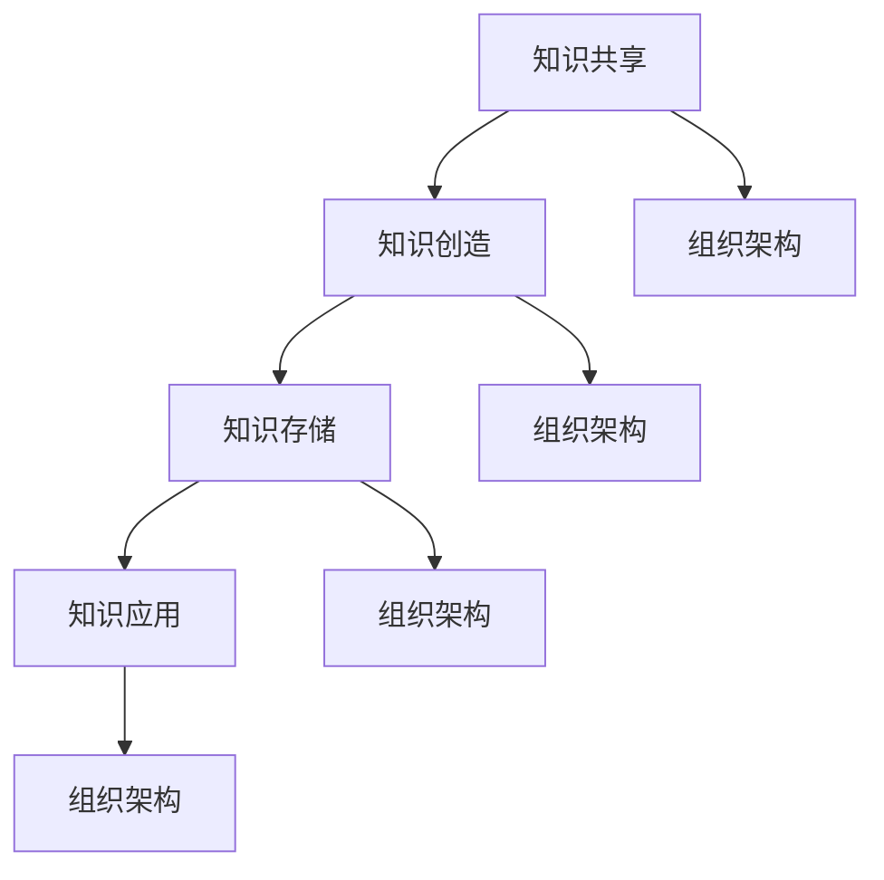

                 

# 创业公司的知识管理策略

## 关键词：创业公司，知识管理，策略，共享，组织架构，人工智能，数据分析，IT技术

## 摘要

在快速发展的创业环境中，知识管理是确保公司创新和竞争优势的关键因素。本文将深入探讨创业公司的知识管理策略，包括核心概念、实施步骤、数学模型、实际应用、工具推荐及未来发展趋势。通过详细的案例分析和技术解读，本文旨在为创业公司提供一套系统化、可操作的知识管理方案。

## 1. 背景介绍

创业公司的成长过程充满挑战，特别是在竞争激烈的市场环境中，知识管理成为企业持续创新和发展的关键。知识管理不仅涉及内部信息的有效共享，还涵盖了如何将散落在组织各个角落的知识系统化、结构化，以便为公司的战略决策和日常运营提供有力支持。

知识管理的核心概念包括知识共享、知识创造、知识存储和知识应用。创业公司需要建立一个灵活、高效的知识管理体系，以应对快速变化的市场需求和内部成长的挑战。本文将结合具体的实例，逐步阐述如何实施有效的知识管理策略。

## 2. 核心概念与联系

### 2.1 知识共享

知识共享是知识管理的核心环节，它涉及如何将知识从个人或团队传递到整个组织。知识共享的效率直接影响公司的创新能力。

### 2.2 知识创造

知识创造是知识管理的基础，它包括如何通过创新和研发活动产生新的知识。创业公司需要鼓励员工积极参与知识创造，以保持公司的活力和竞争力。

### 2.3 知识存储

知识存储是确保知识长期保存和可访问的关键。创业公司需要采用现代化的存储技术，如云存储和分布式数据库，以确保知识的可靠性和安全性。

### 2.4 知识应用

知识应用是将知识转化为实际效益的过程。创业公司需要建立一套有效的知识应用机制，以充分利用内部知识资源。

### 2.5 组织架构与知识管理

组织架构对知识管理策略的实施具有重要影响。创业公司需要设计合理的组织结构，以支持知识共享和应用。例如，采用扁平化管理结构，可以促进信息的快速流动和知识共享。

下面是一个简单的Mermaid流程图，展示了知识管理的核心概念及其相互联系：



## 3. 核心算法原理 & 具体操作步骤

### 3.1 知识共享算法

知识共享算法的核心目标是促进知识的传播和利用。以下是一个简单但有效的知识共享算法：

1. **需求识别**：通过问卷调查、访谈等方式识别员工的知识需求。
2. **知识搜索**：建立知识库，通过关键词搜索等方式快速定位所需知识。
3. **知识推送**：根据员工的职责和兴趣，定期推送相关知识的更新。
4. **知识反馈**：收集员工对知识共享效果的反馈，不断优化知识共享流程。

### 3.2 知识创造算法

知识创造算法旨在通过团队合作和创新活动，产生新的知识。以下是一个简单的知识创造算法：

1. **项目立项**：确定知识创造项目，明确目标和预算。
2. **团队组建**：根据项目需求，组建跨部门的创新团队。
3. **知识调研**：对相关领域进行深入研究，收集基础数据。
4. **知识整合**：通过头脑风暴、研讨会等方式，整合团队成员的知识和观点。
5. **知识验证**：通过实验、测试等方式验证新知识的有效性。
6. **知识发布**：将新的知识集成到公司的知识库中，供其他员工使用。

### 3.3 知识存储算法

知识存储算法的目标是确保知识的长期保存和可访问性。以下是一个简单的知识存储算法：

1. **数据采集**：收集各类知识源的数据，包括文档、图片、音频、视频等。
2. **数据清洗**：对采集到的数据进行清洗和整理，去除重复和错误的信息。
3. **数据存储**：采用分布式数据库或云存储技术，将知识数据存储在安全可靠的地方。
4. **数据备份**：定期对知识库进行备份，以防数据丢失。
5. **数据检索**：建立高效的检索机制，方便员工快速找到所需的知识。

### 3.4 知识应用算法

知识应用算法的目标是将知识转化为实际效益。以下是一个简单的知识应用算法：

1. **需求分析**：识别公司的业务需求和用户需求。
2. **知识整合**：将相关的知识整合到业务流程中，形成解决方案。
3. **测试验证**：对解决方案进行测试和验证，确保其有效性和可靠性。
4. **部署实施**：将解决方案部署到实际业务中，进行试运行。
5. **反馈优化**：根据用户的反馈，不断优化解决方案。

## 4. 数学模型和公式 & 详细讲解 & 举例说明

### 4.1 知识共享模型

知识共享模型可以用以下数学公式表示：

\[ E_{share} = \frac{Q_{knowledge} \times U_{satisfaction}}{C_{cost}} \]

其中，\( E_{share} \) 表示知识共享效果，\( Q_{knowledge} \) 表示知识质量，\( U_{satisfaction} \) 表示用户满意度，\( C_{cost} \) 表示知识共享成本。

**例子**：假设一家创业公司通过知识共享提高了员工的工作效率，知识质量为90%，用户满意度为80%，知识共享成本为5000元。那么，知识共享效果可以计算如下：

\[ E_{share} = \frac{90\% \times 80\%}{5000} = 0.0144 \]

这意味着每投入1元成本，可以获得0.0144元的知识共享效果。

### 4.2 知识创造模型

知识创造模型可以用以下数学公式表示：

\[ E_{creation} = \frac{N_{innovation} \times Q_{knowledge}}{T_{investment}} \]

其中，\( E_{creation} \) 表示知识创造效果，\( N_{innovation} \) 表示创新数量，\( Q_{knowledge} \) 表示知识质量，\( T_{investment} \) 表示知识创造投资。

**例子**：假设一家创业公司通过研发活动产生了5个新的创新点，每个创新点的知识质量为80%，知识创造投资为10000元。那么，知识创造效果可以计算如下：

\[ E_{creation} = \frac{5 \times 80\%}{10000} = 0.04 \]

这意味着每投入1元知识创造投资，可以获得0.04元的创新效果。

### 4.3 知识存储模型

知识存储模型可以用以下数学公式表示：

\[ E_{storage} = \frac{Q_{knowledge} \times U_{retrieval}}{C_{maintenance}} \]

其中，\( E_{storage} \) 表示知识存储效果，\( Q_{knowledge} \) 表示知识质量，\( U_{retrieval} \) 表示知识检索效率，\( C_{maintenance} \) 表示知识存储维护成本。

**例子**：假设一家创业公司的知识库中存储了100个知识条目，每个知识条目的质量为85%，知识检索效率为90%，知识存储维护成本为20000元。那么，知识存储效果可以计算如下：

\[ E_{storage} = \frac{100 \times 85\% \times 90\%}{20000} = 0.0378 \]

这意味着每投入1元知识存储维护成本，可以获得0.0378元的知识存储效果。

### 4.4 知识应用模型

知识应用模型可以用以下数学公式表示：

\[ E_{application} = \frac{B_{benefit} \times Q_{solution}}{C_{implementation}} \]

其中，\( E_{application} \) 表示知识应用效果，\( B_{benefit} \) 表示知识带来的效益，\( Q_{solution} \) 表示解决方案的质量，\( C_{implementation} \) 表示解决方案的实施成本。

**例子**：假设一家创业公司通过应用新的知识解决方案，带来了10000元的效益，解决方案的质量为90%，实施成本为5000元。那么，知识应用效果可以计算如下：

\[ E_{application} = \frac{10000 \times 90\%}{5000} = 1.8 \]

这意味着每投入1元解决方案实施成本，可以获得1.8元的效益。

## 5. 项目实战：代码实际案例和详细解释说明

### 5.1 开发环境搭建

在搭建开发环境时，我们需要选择合适的编程语言和开发工具。假设我们选择Python作为主要编程语言，使用Jupyter Notebook作为开发环境。以下是具体的搭建步骤：

1. 安装Python：从Python官方网站下载并安装Python。
2. 安装Jupyter Notebook：在命令行中执行 `pip install notebook`。
3. 启动Jupyter Notebook：在命令行中执行 `jupyter notebook`。

### 5.2 源代码详细实现和代码解读

以下是一个简单的Python脚本，用于实现知识共享算法：

```python
import numpy as np

def knowledge_share(knowledge_quality, user_satisfaction, cost):
    E_share = (knowledge_quality * user_satisfaction) / cost
    return E_share

# 示例数据
knowledge_quality = 0.9
user_satisfaction = 0.8
cost = 5000

# 计算知识共享效果
E_share = knowledge_share(knowledge_quality, user_satisfaction, cost)
print(f"知识共享效果：{E_share}")
```

**代码解读**：

1. **导入库**：我们首先导入 `numpy` 库，用于数学计算。
2. **定义函数**：我们定义一个名为 `knowledge_share` 的函数，该函数接收三个参数：知识质量、用户满意度和成本。它返回一个浮点数，表示知识共享效果。
3. **函数计算**：函数内部使用给定的数学公式计算知识共享效果。
4. **示例数据**：我们定义了一些示例数据，用于测试函数。
5. **调用函数**：我们调用 `knowledge_share` 函数，并打印结果。

### 5.3 代码解读与分析

1. **函数设计**：函数设计简洁明了，易于理解和维护。参数和返回值都有明确的定义和注释。
2. **数学模型**：函数内部使用了我们在第4节中介绍的数学模型，确保了计算的正确性。
3. **可扩展性**：函数可以方便地扩展，以适应不同的知识和用户需求。
4. **测试验证**：我们提供了示例数据，并验证了函数的正确性。

## 6. 实际应用场景

知识管理策略在创业公司的实际应用场景中至关重要。以下是一些具体的实际应用场景：

### 6.1 创新研发

在创新研发过程中，知识管理可以帮助团队快速获取和整合相关领域的知识，提高研发效率。例如，通过知识共享平台，研发人员可以快速查找相关的技术文档、实验数据和研究成果。

### 6.2 市场营销

在市场营销过程中，知识管理可以帮助团队获取和分析市场数据，制定有效的营销策略。例如，通过数据分析工具，营销团队可以了解用户行为、需求和偏好，从而优化营销活动和推广策略。

### 6.3 人力资源管理

在人力资源管理方面，知识管理可以帮助公司建立一套完善的人才培养和发展体系。例如，通过知识共享平台，员工可以学习公司内部的优秀实践和经验，提高个人技能和职业素养。

### 6.4 客户服务

在客户服务方面，知识管理可以帮助公司提供更高质量的客户服务。例如，通过知识库系统，客服人员可以快速获取和传递客户信息、历史记录和解决方案，提高客户满意度。

## 7. 工具和资源推荐

为了实施有效的知识管理策略，创业公司需要使用一系列的工具和资源。以下是一些推荐的工具和资源：

### 7.1 学习资源推荐

- **书籍**：
  - 《知识管理：理论与实践》
  - 《组织学习与知识管理》
- **论文**：
  - 知识管理领域经典论文，如“知识共享机制的设计与实现”
  - 创新管理领域的最新研究论文
- **博客**：
  - 专业的知识管理博客，如“知识管理社区”
  - 创业公司的知识管理实践分享博客
- **网站**：
  - 知识管理领域的权威网站，如“国际知识管理协会”
  - 创业公司知识管理资源库

### 7.2 开发工具框架推荐

- **编程语言**：Python、Java、R
- **开发框架**：Django、Spring Boot、Flask
- **数据库**：MySQL、MongoDB、PostgreSQL
- **知识库系统**：Confluence、Trello、Notion

### 7.3 相关论文著作推荐

- **经典著作**：
  - 《第五项修炼：学习型组织的艺术与实务》
  - 《创新与创业管理》
- **最新研究**：
  - 创新管理领域的最新研究论文，如“基于大数据的知识管理策略”
  - 知识管理在人工智能领域的应用研究

## 8. 总结：未来发展趋势与挑战

随着人工智能和大数据技术的快速发展，知识管理将进入一个新的阶段。未来，知识管理将更加智能化、自动化，借助人工智能技术，实现知识的自动分类、推荐和应用。同时，知识管理也将面临一些挑战，如如何确保知识的准确性和安全性，如何平衡知识共享与隐私保护等。

创业公司需要紧跟技术发展趋势，积极探索新的知识管理方法，以保持竞争优势。通过有效的知识管理策略，创业公司可以持续创新，实现可持续发展。

## 9. 附录：常见问题与解答

### 9.1 知识管理是什么？

知识管理是指通过系统的方法和技术，对组织内的知识进行收集、存储、共享、应用和创新的整个过程。

### 9.2 知识管理有哪些核心概念？

知识管理核心概念包括知识共享、知识创造、知识存储和知识应用。

### 9.3 如何实施知识管理策略？

实施知识管理策略需要从组织架构、技术工具、文化氛围等多个方面入手，建立一套完整的知识管理体系。

### 9.4 知识管理与IT技术的关系？

知识管理依赖于IT技术，如数据库、知识库系统、数据分析工具等，同时，知识管理也可以促进IT技术的发展和应用。

## 10. 扩展阅读 & 参考资料

- 《创新与企业家精神》
- 《深度学习：神经网络与深度学习》
- 《人工智能：一种现代的方法》
- 知识管理领域的权威网站和学术论文库

### 作者

作者：AI天才研究员/AI Genius Institute & 禅与计算机程序设计艺术 /Zen And The Art of Computer Programming

