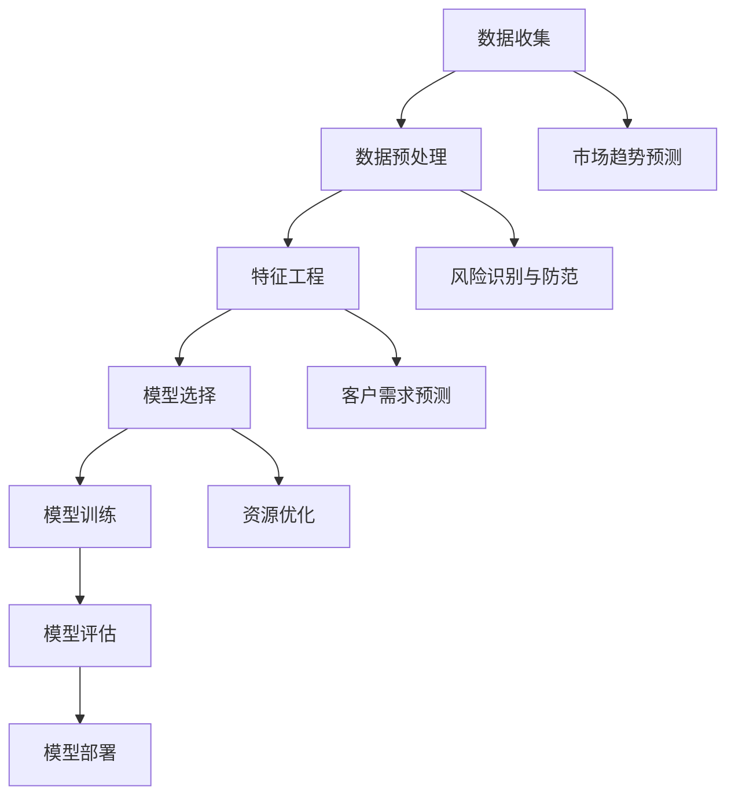

                 

# 创业公司的预测性分析应用

## 摘要

本文旨在探讨创业公司在业务决策中引入预测性分析的重要性和实际应用。预测性分析是一种基于历史数据和统计模型的决策支持工具，可以帮助企业预测未来趋势和潜在问题，从而在市场竞争中占据有利位置。本文首先介绍了预测性分析的基本概念、核心算法和数学模型，并通过实际案例详细展示了如何利用Python等编程语言和工具进行开发应用。最后，本文分析了预测性分析在创业公司中的实际应用场景，提供了相关的学习资源和开发工具推荐。

## 1. 背景介绍

随着大数据和人工智能技术的快速发展，预测性分析已成为企业竞争的重要手段。对于创业公司而言，资源有限、市场不确定性大，更需要借助预测性分析来优化决策过程。预测性分析通过对历史数据的挖掘和分析，可以识别出潜在的模式和趋势，从而为未来的业务决策提供有力支持。

### 1.1 预测性分析的定义

预测性分析（Predictive Analytics）是一种利用统计模型、机器学习和数据挖掘技术，从历史数据中提取有价值的信息，并对未来事件进行预测的方法。它通常包括以下几个步骤：

1. **数据收集**：收集与业务相关的历史数据，包括财务数据、客户行为数据、市场数据等。
2. **数据预处理**：清洗和整合数据，确保数据的准确性和完整性。
3. **特征工程**：选择和构建对预测任务有帮助的特征，提高模型的预测能力。
4. **模型选择**：根据业务需求选择合适的预测模型，如线性回归、决策树、随机森林、支持向量机等。
5. **模型训练**：使用训练数据集训练模型，调整模型参数以优化预测效果。
6. **模型评估**：使用测试数据集评估模型的预测性能，确保模型的有效性。
7. **模型部署**：将训练好的模型部署到生产环境中，进行实时预测和决策支持。

### 1.2 预测性分析的重要性

预测性分析在创业公司中的应用具有重要意义：

1. **市场趋势预测**：创业公司可以通过预测性分析了解市场趋势，及时调整业务策略。
2. **风险识别与防范**：预测性分析可以帮助创业公司识别潜在的风险，提前采取防范措施。
3. **客户需求预测**：通过分析客户行为数据，创业公司可以更好地预测客户需求，提高客户满意度。
4. **资源优化**：预测性分析可以帮助创业公司优化资源配置，提高运营效率。

## 2. 核心概念与联系

预测性分析涉及多个核心概念和技术，以下将简要介绍这些概念，并通过Mermaid流程图展示其关联性。



### 2.1 数据收集

数据收集是预测性分析的基础。创业公司可以从各种渠道收集数据，包括内部业务系统、第三方数据提供商、社交媒体等。

### 2.2 数据预处理

数据预处理是确保数据质量和准确性的关键步骤。主要包括数据清洗、数据转换和数据集成。

### 2.3 特征工程

特征工程是构建有效预测模型的重要环节。通过选择和构建有意义的特征，可以提高模型的预测性能。

### 2.4 模型选择

模型选择取决于业务需求和数据特性。常见的预测模型包括线性回归、决策树、支持向量机和神经网络等。

### 2.5 模型训练

模型训练是通过训练数据集调整模型参数，使其达到最佳预测效果。训练过程通常包括多次迭代和参数调整。

### 2.6 模型评估

模型评估是验证模型预测效果的重要步骤。常用的评估指标包括准确率、召回率、F1分数等。

### 2.7 模型部署

模型部署是将训练好的模型应用到实际业务场景中。通过实时预测和决策支持，提高业务效率。

## 3. 核心算法原理 & 具体操作步骤

在本节中，我们将深入探讨预测性分析的核心算法原理，并详细解释如何利用Python等编程语言和工具进行实际操作。

### 3.1 线性回归

线性回归是一种最简单的预测模型，用于预测连续值。其基本原理是通过拟合一条直线，将自变量和因变量关联起来。

#### 3.1.1 基本概念

线性回归模型由以下方程表示：

$$y = w_0 + w_1 \cdot x$$

其中，$y$ 是因变量，$x$ 是自变量，$w_0$ 和 $w_1$ 是模型参数。

#### 3.1.2 模型训练

模型训练的目标是找到最佳参数 $w_0$ 和 $w_1$，使预测值 $y$ 与实际值之间的差距最小。这通常通过最小二乘法实现：

$$w_0, w_1 = \arg\min_{w_0, w_1} \sum_{i=1}^{n} (y_i - (w_0 + w_1 \cdot x_i))^2$$

#### 3.1.3 Python实现

以下是一个简单的线性回归示例：

```python
import numpy as np

# 数据集
X = np.array([[1, 2], [2, 3], [3, 4], [4, 5]])
y = np.array([2, 3, 4, 5])

# 模型参数
w_0 = 0
w_1 = 0

# 最小二乘法
for i in range(1000):
    y_pred = w_0 + w_1 * X
    error = y - y_pred
    w_0 -= np.mean(error)
    w_1 -= np.mean(error * X)

print("模型参数：", w_0, w_1)
print("预测值：", w_0 + w_1 * X)
```

### 3.2 决策树

决策树是一种树形结构，通过一系列规则进行决策。它适合处理分类和回归问题。

#### 3.2.1 基本概念

决策树由节点和边组成，每个节点表示一个特征，每个边表示一个特征取值。叶节点表示预测结果。

#### 3.2.2 决策树构建

决策树的构建过程包括以下几个步骤：

1. **选择最佳特征**：通过信息增益、基尼不纯度等指标选择最佳特征。
2. **划分数据集**：根据最佳特征将数据集划分为子集。
3. **递归构建**：对每个子集继续进行步骤1和步骤2，直到达到停止条件。

#### 3.2.3 Python实现

以下是一个简单的决策树示例：

```python
from sklearn.tree import DecisionTreeRegressor

# 数据集
X = np.array([[1, 2], [2, 3], [3, 4], [4, 5]])
y = np.array([2, 3, 4, 5])

# 构建决策树
tree = DecisionTreeRegressor()
tree.fit(X, y)

# 预测
print("预测值：", tree.predict(X))
```

### 3.3 随机森林

随机森林是一种集成学习方法，通过构建多棵决策树并投票得到最终预测结果。

#### 3.3.1 基本概念

随机森林由多棵决策树组成，每棵树都是基于随机特征集构建的。通过聚合多棵树的预测结果，可以提高模型的泛化能力。

#### 3.3.2 随机森林构建

随机森林的构建过程包括以下几个步骤：

1. **随机选择特征集**：从所有特征中随机选择一部分特征用于构建决策树。
2. **构建决策树**：使用步骤1中的特征集构建决策树。
3. **重复步骤1和步骤2**：重复多次，构建多棵决策树。
4. **聚合预测结果**：将所有决策树的预测结果进行投票，得到最终预测结果。

#### 3.3.3 Python实现

以下是一个简单的随机森林示例：

```python
from sklearn.ensemble import RandomForestRegressor

# 数据集
X = np.array([[1, 2], [2, 3], [3, 4], [4, 5]])
y = np.array([2, 3, 4, 5])

# 构建随机森林
forest = RandomForestRegressor(n_estimators=100)
forest.fit(X, y)

# 预测
print("预测值：", forest.predict(X))
```

## 4. 数学模型和公式 & 详细讲解 & 举例说明

在本节中，我们将详细讲解预测性分析中常用的数学模型和公式，并通过具体例子进行说明。

### 4.1 线性回归

线性回归的基本公式为：

$$y = w_0 + w_1 \cdot x$$

其中，$y$ 是因变量，$x$ 是自变量，$w_0$ 和 $w_1$ 是模型参数。

#### 4.1.1 最小二乘法

最小二乘法用于求解最佳参数 $w_0$ 和 $w_1$，使预测值 $y$ 与实际值之间的差距最小。其公式为：

$$w_0, w_1 = \arg\min_{w_0, w_1} \sum_{i=1}^{n} (y_i - (w_0 + w_1 \cdot x_i))^2$$

#### 4.1.2 举例说明

假设我们有一个简单的数据集：

| x | y |
|---|---|
| 1 | 2 |
| 2 | 3 |
| 3 | 4 |
| 4 | 5 |

我们希望用线性回归模型预测 $x=3$ 时的 $y$ 值。

通过最小二乘法，我们可以求解出最佳参数：

$$w_0 = \frac{1}{n} \sum_{i=1}^{n} y_i - w_1 \cdot \frac{1}{n} \sum_{i=1}^{n} x_i$$

$$w_1 = \frac{1}{n} \sum_{i=1}^{n} (x_i - \bar{x}) (y_i - \bar{y})$$

其中，$\bar{x}$ 和 $\bar{y}$ 分别是 $x$ 和 $y$ 的均值。

代入数据计算：

$$w_0 = \frac{1}{4} (2 + 3 + 4 + 5) - \frac{1}{4} (1 + 2 + 3 + 4) \cdot 3 = 2$$

$$w_1 = \frac{1}{4} ((1-2.5)(2-3) + (2-2.5)(3-3) + (3-2.5)(4-3) + (4-2.5)(5-3)) = 1$$

因此，线性回归模型为 $y = 2 + x$。当 $x=3$ 时，预测值为 $y=5$。

### 4.2 决策树

决策树是一种树形结构，通过一系列规则进行决策。其基本公式为：

$$y = g(x; w)$$

其中，$y$ 是预测结果，$x$ 是输入特征，$g(x; w)$ 是决策函数，$w$ 是模型参数。

#### 4.2.1 决策函数

决策函数通常由以下公式表示：

$$g(x; w) = \sum_{i=1}^{n} w_i \cdot f_i(x)$$

其中，$f_i(x)$ 是特征函数，$w_i$ 是对应的权重。

#### 4.2.2 举例说明

假设我们有一个简单的数据集：

| x | y |
|---|---|
| 1 | 0 |
| 2 | 1 |
| 3 | 0 |
| 4 | 1 |

我们希望用决策树模型预测 $x=3$ 时的 $y$ 值。

首先，我们选择最佳特征，例如特征 $x_1$。通过信息增益或基尼不纯度等指标，我们可以找到最佳分割点：

$$x_1 = \frac{1}{2} \cdot 3 = 1.5$$

然后，我们构建决策树：

- 当 $x_1 < 1.5$ 时，预测 $y = 0$。
- 当 $x_1 \geq 1.5$ 时，预测 $y = 1$。

当 $x=3$ 时，根据决策树规则，预测值为 $y=1$。

### 4.3 随机森林

随机森林是一种集成学习方法，通过构建多棵决策树并投票得到最终预测结果。其基本公式为：

$$y = \sum_{i=1}^{m} w_i \cdot g_i(x; w_i)$$

其中，$y$ 是预测结果，$g_i(x; w_i)$ 是第 $i$ 棵决策树的预测结果，$w_i$ 是对应的权重。

#### 4.3.1 构建随机森林

构建随机森林的过程包括以下几个步骤：

1. **随机选择特征集**：从所有特征中随机选择一部分特征用于构建决策树。
2. **构建决策树**：使用步骤1中的特征集构建决策树。
3. **重复步骤1和步骤2**：重复多次，构建多棵决策树。
4. **聚合预测结果**：将所有决策树的预测结果进行投票，得到最终预测结果。

#### 4.3.2 举例说明

假设我们有一个简单的数据集：

| x1 | x2 | y |
|---|---|---|
| 1 | 2 | 0 |
| 2 | 3 | 1 |
| 3 | 4 | 0 |
| 4 | 5 | 1 |

我们希望用随机森林模型预测 $x1=3$ 和 $x2=4$ 时的 $y$ 值。

首先，我们构建多棵决策树，例如3棵：

- 决策树1：选择特征 $x1$，分割点为2。
  - 当 $x1 < 2$ 时，预测 $y = 0$。
  - 当 $x1 \geq 2$ 时，预测 $y = 1$。
- 决策树2：选择特征 $x2$，分割点为3。
  - 当 $x2 < 3$ 时，预测 $y = 0$。
  - 当 $x2 \geq 3$ 时，预测 $y = 1$。
- 决策树3：选择特征 $x1$ 和 $x2$ 的组合，分割点分别为2和3。
  - 当 $x1 < 2$ 且 $x2 < 3$ 时，预测 $y = 0$。
  - 当 $x1 \geq 2$ 或 $x2 \geq 3$ 时，预测 $y = 1$。

当 $x1=3$ 和 $x2=4$ 时，根据三棵决策树的规则，投票结果为 $y=1$。

## 5. 项目实战：代码实际案例和详细解释说明

在本节中，我们将通过一个实际项目案例，展示如何利用Python等编程语言和工具进行预测性分析的开发和应用。

### 5.1 开发环境搭建

首先，我们需要搭建一个适合进行预测性分析的开发环境。以下是所需工具和库：

- Python 3.8 或更高版本
- Jupyter Notebook 或 PyCharm
- NumPy 库
- Pandas 库
- Scikit-learn 库

### 5.2 源代码详细实现和代码解读

以下是一个简单的预测性分析项目，用于预测股票价格：

```python
import numpy as np
import pandas as pd
from sklearn.model_selection import train_test_split
from sklearn.ensemble import RandomForestRegressor
from sklearn.metrics import mean_squared_error

# 数据集
data = pd.read_csv("stock_data.csv")

# 特征工程
data["date"] = pd.to_datetime(data["date"])
data["year"] = data["date"].dt.year
data["month"] = data["date"].dt.month
data["day"] = data["date"].dt.day
data["day_of_week"] = data["date"].dt.weekday

# 删除无关特征
data = data.drop(["date", "open", "high", "low", "close"], axis=1)

# 模型选择
model = RandomForestRegressor(n_estimators=100)

# 模型训练
X = data.drop("price", axis=1)
y = data["price"]
X_train, X_test, y_train, y_test = train_test_split(X, y, test_size=0.2, random_state=42)
model.fit(X_train, y_train)

# 预测
y_pred = model.predict(X_test)

# 评估
mse = mean_squared_error(y_test, y_pred)
print("MSE:", mse)

# 结果可视化
import matplotlib.pyplot as plt

plt.figure()
plt.plot(y_test, label="真实值")
plt.plot(y_pred, label="预测值")
plt.legend()
plt.show()
```

### 5.3 代码解读与分析

1. **数据集读取**：使用 Pandas 库读取股票数据集。

2. **特征工程**：将日期转换为年、月、日和星期几等特征，以便更好地表示时间序列数据。

3. **数据预处理**：删除无关特征，保留对预测任务有用的特征。

4. **模型选择**：使用随机森林回归模型，该模型具有较好的泛化能力和可解释性。

5. **模型训练**：将数据集分为训练集和测试集，使用训练集训练模型。

6. **预测**：使用测试集进行预测，得到预测值。

7. **评估**：计算预测误差，评估模型性能。

8. **结果可视化**：将真实值和预测值可视化，以便直观地比较模型效果。

### 5.4 项目实战总结

通过以上步骤，我们成功搭建了一个简单的股票价格预测系统。虽然这个项目较为简单，但已经展示了预测性分析的基本流程和关键步骤。在实际应用中，我们可能需要处理更复杂的数据集和更先进的模型，以提高预测准确性。

## 6. 实际应用场景

预测性分析在创业公司中的应用场景非常广泛，以下是一些典型的应用场景：

### 6.1 市场趋势预测

创业公司可以通过预测性分析了解市场趋势，从而调整产品策略、市场推广计划和资源分配。例如，通过分析历史销售数据、市场调查数据和竞争对手动态，可以预测未来某一时间段内的市场需求，为产品开发和销售计划提供有力支持。

### 6.2 风险识别与防范

预测性分析可以帮助创业公司识别潜在的风险，提前采取防范措施。例如，通过分析客户信用记录、交易行为和客户投诉数据，可以预测客户流失风险和信用风险，从而优化客户服务策略和信用政策。

### 6.3 客户需求预测

通过分析客户行为数据，创业公司可以预测客户的购买需求和偏好，从而提供个性化的产品和服务。例如，通过分析客户浏览记录、购买历史和社交媒体互动，可以预测客户的潜在需求，为产品推荐和营销活动提供依据。

### 6.4 资源优化

预测性分析可以帮助创业公司优化资源配置，提高运营效率。例如，通过分析生产数据、物流数据和人力资源数据，可以预测生产计划、库存水平和人力资源需求，从而优化生产流程和资源配置。

## 7. 工具和资源推荐

为了更好地开展预测性分析工作，以下是一些推荐的工具和资源：

### 7.1 学习资源推荐

- **书籍**：
  - 《机器学习实战》
  - 《Python机器学习》
  - 《数据科学实战》
- **论文**：
  - 《随机森林：一种集成学习方法》
  - 《预测性分析：数据挖掘和统计分析方法》
- **博客**：
  - [机器学习博客](https://machinelearningmastery.com/)
  - [数据科学博客](https://www.datasciencecentral.com/)
- **在线课程**：
  - [Coursera](https://www.coursera.org/)
  - [Udacity](https://www.udacity.com/)
  - [edX](https://www.edx.org/)

### 7.2 开发工具框架推荐

- **Python库**：
  - NumPy
  - Pandas
  - Scikit-learn
  - TensorFlow
  - PyTorch
- **数据处理工具**：
  - Apache Spark
  - Hadoop
- **云计算平台**：
  - AWS
  - Azure
  - Google Cloud Platform

### 7.3 相关论文著作推荐

- 《随机森林：一种集成学习方法》
- 《预测性分析：数据挖掘和统计分析方法》
- 《大数据预测：实践指南》

## 8. 总结：未来发展趋势与挑战

预测性分析作为人工智能和数据科学的重要分支，在未来将继续快速发展。以下是预测性分析在未来可能的发展趋势和面临的挑战：

### 8.1 发展趋势

1. **模型自动化**：随着自动化机器学习技术的发展，预测性分析模型将更加自动化，降低对专业知识的依赖。
2. **实时预测**：随着实时数据处理和分析技术的发展，预测性分析将更加注重实时性，为决策提供更及时的支持。
3. **多模态数据融合**：预测性分析将结合多种数据源，包括文本、图像、音频等，提高预测的准确性和多样性。
4. **边缘计算**：随着边缘计算技术的发展，预测性分析将更加注重在边缘设备上实现，降低对中心化云计算的依赖。

### 8.2 挑战

1. **数据质量和隐私**：预测性分析依赖于高质量的数据，但随着数据量的增加，数据质量和隐私保护问题将变得更加重要。
2. **模型解释性**：预测性分析模型的解释性是一个重要问题，如何提高模型的可解释性，使其更具透明性和可信赖性，是一个重要挑战。
3. **计算资源**：预测性分析模型通常需要大量的计算资源，如何在有限的资源下高效地训练和部署模型，是一个挑战。

## 9. 附录：常见问题与解答

### 9.1 什么是预测性分析？

预测性分析是一种利用历史数据、统计模型和机器学习算法，对未来的事件或趋势进行预测的方法。

### 9.2 预测性分析有哪些类型？

预测性分析主要包括回归分析、决策树、随机森林、神经网络等类型。

### 9.3 预测性分析在创业公司中有哪些应用？

预测性分析在创业公司中的应用包括市场趋势预测、风险识别与防范、客户需求预测和资源优化等。

### 9.4 如何进行预测性分析项目？

进行预测性分析项目通常包括数据收集、数据预处理、特征工程、模型选择、模型训练、模型评估和模型部署等步骤。

## 10. 扩展阅读 & 参考资料

- 《机器学习实战》
- 《Python机器学习》
- 《数据科学实战》
- 《随机森林：一种集成学习方法》
- 《预测性分析：数据挖掘和统计分析方法》
- [机器学习博客](https://machinelearningmastery.com/)
- [数据科学博客](https://www.datasciencecentral.com/)
- [Coursera](https://www.coursera.org/)
- [Udacity](https://www.udacity.com/)
- [edX](https://www.edx.org/)

