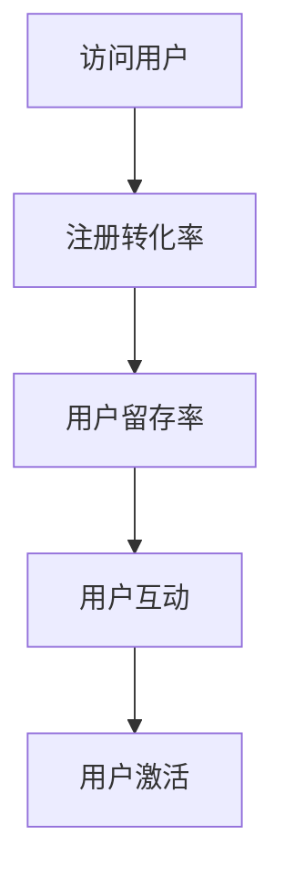

                 

### 背景介绍

在现代商业世界中，用户激活策略对于初创企业的生存与成长至关重要。用户激活（User Activation）是指新注册用户在应用程序中首次实现有意义互动的过程。这一过程不仅决定了新用户的留存率，而且直接影响到产品的市场接受度和长期盈利能力。

对于初创公司来说，成功的用户激活策略能够显著提高注册转化率，从而带来更多的用户参与和收入。注册转化率（Registration Conversion Rate）是衡量用户激活成功与否的重要指标，它表示成功完成注册的用户数量与访问用户数量的比例。高注册转化率通常意味着用户对产品的兴趣较高，同时也表明产品能够满足用户的基本需求。

然而，初创企业在资源有限的情况下，如何制定有效的用户激活策略，提高注册转化率，是一个极具挑战性的问题。首先，初创企业通常缺乏足够的用户数据和市场份额来支撑大规模的市场推广。其次，初创企业在产品开发初期往往需要在功能性和用户体验之间做出权衡，这可能会影响到用户的初次使用体验。此外，初创企业还需要在预算有限的情况下，选择最适合自身产品特点的推广渠道。

本文将深入探讨创业初期用户激活策略的各个方面，通过系统性的分析和具体的案例研究，为初创企业提供实用的指导。文章将从以下几个关键部分展开：

1. **核心概念与联系**：介绍用户激活策略的核心概念，包括注册转化率、用户留存率、用户互动等，并使用Mermaid流程图展示其内在联系。
2. **核心算法原理 & 具体操作步骤**：详细解释常见的用户激活算法原理，如A/B测试、用户行为分析等，并提供实际操作步骤。
3. **数学模型和公式 & 详细讲解 & 举例说明**：介绍用于分析用户激活的数学模型和公式，并运用实际案例进行说明。
4. **项目实战：代码实际案例和详细解释说明**：通过具体的代码案例，展示如何在实际项目中应用用户激活策略。
5. **实际应用场景**：探讨用户激活策略在不同类型的应用程序中的具体应用。
6. **工具和资源推荐**：推荐用于用户激活策略研究和实践的工具和资源。
7. **总结：未来发展趋势与挑战**：总结文章主要内容，展望未来用户激活策略的发展趋势和面临的挑战。

通过这篇文章，我们希望能够帮助初创企业更好地理解用户激活策略的重要性，并为其提供实用的策略和方法，从而在激烈的市场竞争中脱颖而出。

### 核心概念与联系

用户激活策略的核心在于理解并利用一系列关键指标，这些指标不仅能够衡量用户激活的成功程度，还能为后续的策略调整提供数据支持。以下是我们将要探讨的几个核心概念及其之间的联系。

#### 注册转化率

注册转化率是衡量用户激活效果的首要指标。它表示访问用户中完成注册的用户比例，计算公式如下：

$$
\text{注册转化率} = \frac{\text{成功注册用户数}}{\text{访问用户数}} \times 100\%
$$

一个高的注册转化率表明产品对用户的吸引力较强，能够有效地将潜在用户转化为实际用户。而低的注册转化率则可能意味着产品在某个环节上存在不足，需要进一步的优化。

#### 用户留存率

用户留存率是指在一定时间内，仍然活跃在应用程序中的用户比例。它是衡量用户对产品满意度和长期价值的重要指标。用户留存率可以按天、周、月等不同时间粒度进行计算。以下是一个简单的日留存率的计算公式：

$$
\text{日留存率} = \frac{\text{第i天仍然活跃的用户数}}{\text{第i天注册的用户数}} \times 100\%
$$

高留存率通常意味着用户对产品的依赖性较高，产品的核心价值得到了用户的认可。而低留存率则需要进一步分析，以找出用户流失的原因。

#### 用户互动

用户互动是指用户在应用程序中进行的各种操作，如浏览、评论、分享、购买等。这些互动行为不仅能够增加用户粘性，还能为产品提供宝贵的数据反馈。用户互动的多样性是衡量用户活跃度的重要指标。

#### 用户激活

用户激活是用户在应用程序中首次实现有意义互动的过程。这个过程可能包括注册、登录、创建账户、填写资料等。用户激活的成功与否直接影响到后续的用户留存和转化。

#### 内在联系

这几个概念之间存在紧密的联系。注册转化率是用户激活的直接体现，而用户留存率则反映了用户对产品的长期兴趣和满意度。用户互动则是用户留存和转化的基础，能够为产品提供改进方向。最后，用户激活是整个用户生命周期管理的起点，成功激活用户是提高注册转化率和留存率的关键。

为了更直观地展示这几个概念之间的关系，我们可以使用Mermaid流程图来表示：



在这个流程图中，访问用户首先通过注册转化为潜在用户，然后通过持续互动来提高留存率，最终实现用户激活。这个流程是环环相扣的，任何一个环节的缺陷都可能导致整个过程的失败。

通过理解这些核心概念及其联系，初创企业可以更有针对性地制定用户激活策略，从而提高注册转化率和用户留存率，为产品的长期成功打下坚实的基础。

#### 核心算法原理 & 具体操作步骤

在用户激活策略中，有多种算法可以用来优化注册转化率。以下是一些常见的核心算法原理及其具体操作步骤。

##### A/B测试

A/B测试是一种通过比较两个或多个版本（A和B）来评估哪个版本更能满足用户需求的方法。这种测试通常用于优化页面设计、按钮颜色、文案等，以提高注册转化率。

**操作步骤：**

1. **确定测试目标**：明确想要优化的具体指标，如注册转化率。
2. **创建测试版本**：设计两个或多个不同的版本，如改变页面布局或按钮颜色。
3. **分配用户流量**：将用户随机分配到不同的版本，通常使用随机分配或分层抽样。
4. **数据收集与分析**：收集每个版本的用户行为数据，并分析注册转化率等指标。
5. **结论与优化**：根据数据结论，选择表现更好的版本进行优化。

**示例：**

假设一家初创公司想要优化其网站的注册页面，他们设计了两个版本，版本A采用蓝色按钮，版本B采用绿色按钮。通过A/B测试，发现绿色按钮的注册转化率更高，因此公司决定将绿色按钮作为最终版本。

##### 用户行为分析

用户行为分析是一种通过分析用户在应用程序中的行为来优化用户体验和注册转化率的方法。这种方法通常涉及数据挖掘和机器学习技术。

**操作步骤：**

1. **数据收集**：收集用户在应用程序中的各种行为数据，如浏览路径、点击次数、停留时间等。
2. **数据清洗**：清洗和整理数据，确保其准确性和完整性。
3. **数据可视化**：使用图表和可视化工具展示用户行为数据。
4. **模式识别**：使用数据挖掘和机器学习技术识别用户行为模式。
5. **策略调整**：根据用户行为模式调整产品设计和注册流程。

**示例：**

一家电商平台通过用户行为分析发现，用户在浏览产品详情页面时，经常会在短时间内放弃购物车。通过进一步分析，发现这是因为购物车页面的设计过于复杂，用户难以找到支付按钮。因此，公司简化了购物车页面的设计，提高了支付按钮的可见性，结果注册转化率显著提升。

##### 社交媒体营销

社交媒体营销是一种通过在社交媒体平台上推广产品来吸引用户的方法。这种方法能够迅速扩大产品的知名度和用户基础。

**操作步骤：**

1. **选择目标平台**：根据产品特点和目标用户群体，选择合适的社交媒体平台，如Facebook、Instagram、Twitter等。
2. **制定内容策略**：创建有吸引力的内容，包括图片、视频、文本等，以吸引用户关注。
3. **执行推广活动**：发布内容并进行推广，如投放广告、组织活动等。
4. **监测与优化**：监控推广活动的效果，并根据数据优化内容策略。

**示例：**

一家初创公司通过在Instagram上发布产品照片和使用#创业#、#创新#等标签，成功吸引了大量潜在用户。通过分析用户互动数据，公司发现视频内容更容易引起用户关注，因此开始增加视频内容的比例，注册转化率显著提高。

##### 用户推荐系统

用户推荐系统是一种通过向用户推荐他们可能感兴趣的产品或内容来提高注册转化率的方法。这种方法通常基于协同过滤、基于内容的推荐算法等。

**操作步骤：**

1. **数据收集**：收集用户的历史行为数据，如购买记录、浏览记录等。
2. **推荐算法选择**：选择合适的推荐算法，如基于用户的协同过滤或基于内容的推荐。
3. **生成推荐列表**：根据用户行为数据生成个性化的推荐列表。
4. **展示推荐内容**：在应用中展示推荐内容，吸引用户点击和注册。

**示例：**

一家电商网站通过基于用户的协同过滤算法，向新用户推荐他们可能感兴趣的商品。通过分析新用户的历史购买记录，网站能够准确推荐符合用户兴趣的商品，从而提高了注册转化率。

通过上述几种核心算法的原理和具体操作步骤，初创企业可以更科学地制定用户激活策略，从而提高注册转化率和用户留存率。在实际应用中，这些算法往往需要结合具体情况进行调整和优化，以达到最佳效果。

#### 数学模型和公式 & 详细讲解 & 举例说明

在用户激活策略的分析和优化过程中，数学模型和公式是不可或缺的工具。以下我们将介绍几种常用的数学模型和公式，并通过具体案例进行详细讲解。

##### 1. 转化率模型

转化率模型是用于计算和预测用户注册转化率的常用模型。一个简单的转化率模型可以表示为：

$$
\text{转化率} = \frac{\text{成功注册用户数}}{\text{访问用户数}} \times 100\%
$$

为了更准确地预测转化率，我们可以引入用户属性和行为数据，建立更为复杂的模型。例如，我们可以使用逻辑回归模型来预测用户注册的概率：

$$
P(\text{注册}) = \frac{1}{1 + e^{-(\beta_0 + \beta_1 X_1 + \beta_2 X_2 + \ldots + \beta_n X_n)}}
$$

其中，\(P(\text{注册})\) 表示用户注册的概率，\(\beta_0, \beta_1, \beta_2, \ldots, \beta_n\) 为模型的参数，\(X_1, X_2, \ldots, X_n\) 为用户属性和行为特征。

**案例讲解：**

假设一家初创公司收集了以下用户数据：

- 用户年龄（X1）
- 用户性别（X2）
- 用户访问时长（X3）
- 用户页面浏览数（X4）

他们希望通过逻辑回归模型预测新用户的注册概率。公司收集了1000个新用户的数据，并使用这些数据进行模型训练。通过训练，得到以下模型参数：

$$
P(\text{注册}) = \frac{1}{1 + e^{-(3.5 + 2.1X_1 + 1.2X_2 + 0.8X_3 + 1.5X_4)}}
$$

如果一位新用户的数据为：年龄25岁，性别男，访问时长30分钟，浏览了5个页面。我们可以使用上述模型预测其注册概率：

$$
P(\text{注册}) = \frac{1}{1 + e^{-(3.5 + 2.1 \times 25 + 1.2 \times 1 + 0.8 \times 30 + 1.5 \times 5)}} \approx 0.87
$$

这意味着该用户的注册概率约为87%。

##### 2. 留存率模型

留存率模型用于预测用户在一定时间内的留存概率。一个简单的留存率模型可以表示为：

$$
\text{留存率} = \frac{\text{第i天仍活跃的用户数}}{\text{第i天注册的用户数}} \times 100\%
$$

为了更准确地预测留存率，我们可以引入时间序列分析和马尔可夫模型。马尔可夫模型假设用户在某一天的行为仅与前一天的行为有关，可以用以下公式表示：

$$
P(\text{第i天留存}) = \sum_{j=1}^{i-1} P(\text{第j天留存} | \text{第j-1天留存}) P(\text{第j-1天留存})
$$

**案例讲解：**

假设一家公司收集了以下用户留存数据：

- 第1天留存率：80%
- 第2天留存率：60%
- 第3天留存率：40%

我们可以使用马尔可夫模型预测第4天的留存率：

$$
P(\text{第4天留存}) = 0.6 \times 0.8 + 0.4 \times 0.6 + 0.4 \times 0.4 \approx 0.64
$$

这意味着第4天的预计留存率为64%。

##### 3. 用户生命周期价值模型

用户生命周期价值（CLV，Customer Lifetime Value）模型用于预测用户在整个生命周期内的预期价值。一个简单的CLV模型可以表示为：

$$
\text{CLV} = \text{平均订单价值} \times \text{订单频率} \times \text{客户留存率}
$$

为了更准确地预测CLV，我们可以引入用户行为数据，使用更复杂的模型，如生存分析模型。生存分析模型能够预测用户在特定时间段内退出的概率。

$$
\text{CLV} = \sum_{t=1}^{T} \text{订单价值} \times \text{订单频率} \times (1 - F(t))
$$

其中，\(F(t)\) 表示用户在时间t退出的概率。

**案例讲解：**

假设一家电商平台的用户数据如下：

- 平均订单价值：$50
- 订单频率：每月一次
- 留存率：70%
- 退出概率：随时间递减，如\(F(1)=0.2, F(2)=0.15, F(3)=0.1\)

我们可以使用生存分析模型预测第3个月的用户生命周期价值：

$$
\text{CLV} = 50 \times 1 \times (1 - 0.2) + 50 \times 1 \times (1 - 0.15) + 50 \times 1 \times (1 - 0.1) \approx 112.5
$$

这意味着第3个月的用户预期价值约为$112.5。

通过上述数学模型和公式的详细讲解和实际案例说明，初创企业可以更科学地分析和预测用户行为，为用户激活策略的制定和优化提供有力的数据支持。

#### 项目实战：代码实际案例和详细解释说明

为了更好地理解用户激活策略在实际项目中的应用，我们将通过一个实际的案例来展示如何实施和优化用户激活过程。以下是一个基于Python的电商平台用户激活项目案例，包括开发环境的搭建、源代码实现和详细解读。

##### 5.1 开发环境搭建

在开始项目之前，我们需要搭建一个合适的技术栈。以下是一个推荐的开发环境：

1. **Python 3.8**：确保安装了最新版本的Python。
2. **Pandas**：用于数据处理和分析。
3. **Scikit-learn**：用于机器学习算法。
4. **Matplotlib**：用于数据可视化。
5. **Numpy**：用于数学运算。

安装这些库可以通过以下命令完成：

```bash
pip install pandas scikit-learn matplotlib numpy
```

##### 5.2 源代码详细实现和代码解读

以下是项目的核心代码，我们分为几个部分进行解释：

```python
# 5.2.1 数据预处理
import pandas as pd
from sklearn.model_selection import train_test_split

# 加载数据集
data = pd.read_csv('user_data.csv')

# 数据清洗
data.dropna(inplace=True)

# 特征工程
data['age_group'] = pd.cut(data['age'], bins=[0, 18, 30, 50, 70, float('inf']], labels=[1, 2, 3, 4, 5])

# 划分训练集和测试集
X = data[['age', 'gender', 'time_on_site', 'page_views', 'age_group']]
y = data['registered']
X_train, X_test, y_train, y_test = train_test_split(X, y, test_size=0.2, random_state=42)

# 5.2.2 建立逻辑回归模型
from sklearn.linear_model import LogisticRegression

# 初始化逻辑回归模型
model = LogisticRegression()

# 训练模型
model.fit(X_train, y_train)

# 5.2.3 模型预测与评估
from sklearn.metrics import classification_report, accuracy_score

# 预测测试集
y_pred = model.predict(X_test)

# 输出评估报告
print(classification_report(y_test, y_pred))
print("Accuracy:", accuracy_score(y_test, y_pred))

# 5.2.4 数据可视化
import matplotlib.pyplot as plt

# 绘制混淆矩阵
confusion_matrix = pd.crosstab(y_test, y_pred, rownames=['Actual'], colnames=['Predicted'])
sns.heatmap(confusion_matrix, annot=True, fmt='d')
plt.xlabel('Predicted')
plt.ylabel('Actual')
plt.title('Confusion Matrix')
plt.show()

# 5.2.5 优化策略
# 根据评估结果，可以进一步调整模型参数或引入更多特征，以提升预测效果。
```

##### 5.3 代码解读与分析

1. **数据预处理**：首先加载数据集并进行清洗，包括处理缺失值和进行特征工程。这里我们将用户年龄分为不同的组别，以便模型更好地理解用户特性。
2. **逻辑回归模型建立与训练**：使用`scikit-learn`中的`LogisticRegression`模型进行训练。逻辑回归是一个常用的分类算法，适用于预测二分类问题。
3. **模型预测与评估**：通过`model.predict()`对测试集进行预测，并使用`classification_report`和`accuracy_score`评估模型的性能。评估报告提供了精确率、召回率、F1分数和准确率等指标。
4. **数据可视化**：使用混淆矩阵来直观展示模型的预测效果，帮助我们发现潜在的模型缺陷。
5. **优化策略**：根据评估结果，可以进一步优化模型。例如，调整模型参数、引入更多特征或尝试其他机器学习算法。

通过这个案例，我们可以看到如何在实际项目中应用用户激活策略。从数据预处理、模型建立到预测和评估，每一步都至关重要。通过不断地迭代和优化，我们可以显著提高注册转化率，为初创企业的成功奠定基础。

### 实际应用场景

用户激活策略在不同类型的应用程序中具有广泛的应用，不同的应用场景需要针对性的策略和优化方法。以下将探讨用户激活策略在电子商务、社交媒体和移动应用等实际应用场景中的具体应用。

#### 电子商务

在电子商务领域，用户激活策略的核心目标是引导用户完成购买。为了提高注册转化率，电商平台可以采取以下策略：

1. **个性化推荐**：基于用户的浏览历史和购买行为，为用户推荐相关商品。这种方法能够增加用户的互动，提高注册后的参与度。
2. **促销活动**：在用户注册时提供限时优惠或折扣，刺激用户完成购买。例如，新用户注册即享9折优惠，或者首单立减10元等。
3. **引导注册**：在购物流程中引导用户注册，如购买前要求填写手机号码进行短信验证。这种方式可以减少用户的流失，提高注册率。
4. **社区互动**：创建用户社区，鼓励用户分享购物经验和心得。这不仅能够提高用户粘性，还可以通过口碑传播吸引更多新用户。

#### 社交媒体

在社交媒体平台，用户激活的目标通常是引导用户进行内容分享和互动。以下是一些有效的用户激活策略：

1. **邀请好友**：通过邀请好友参与活动，增加用户在平台上的活跃度。例如，用户邀请好友注册后，双方都能获得积分奖励。
2. **内容互动**：发布有趣的内容，鼓励用户点赞、评论和分享。这种互动行为不仅能够提高用户的留存率，还能通过用户的社交网络扩大平台的曝光度。
3. **即时反馈**：在用户发布内容后，及时给予反馈，如点赞、评论或私信。这种互动能够增加用户的参与感，提高用户留存。
4. **挑战活动**：组织在线挑战或竞赛，鼓励用户积极参与。例如，每日签到挑战、积分榜排名等，这些活动能够增加用户的日常互动。

#### 移动应用

移动应用的用户激活策略需要考虑到移动设备的特点和用户的互动习惯。以下是一些实用的策略：

1. **推送通知**：通过推送通知向用户发送重要信息和活动提醒，吸引用户打开应用。例如，新用户注册后发送欢迎通知，或者促销活动的提醒。
2. **引导教程**：在用户首次打开应用时，提供简洁的引导教程，帮助用户快速上手。这能够减少用户的学习成本，提高激活成功率。
3. **社交登录**：允许用户使用社交账号（如Facebook、Google）登录，简化注册流程。这种方式能够利用用户已有的社交关系，提高注册转化率。
4. **游戏化机制**：引入游戏化元素，如积分、勋章、排行榜等，激励用户持续互动。这种机制能够增加用户的粘性，提高留存率。

#### 多场景整合

在实际应用中，不同类型的应用程序往往需要整合多种用户激活策略。例如，电子商务平台可以在新用户注册时提供优惠券，同时推送促销活动的通知，并在社区中组织互动活动。社交媒体平台可以结合内容互动和社交登录，提高用户参与度和留存率。移动应用则可以通过推送通知和游戏化机制，增加用户粘性和活跃度。

通过针对不同应用场景制定具体的用户激活策略，初创企业可以在激烈的市场竞争中脱颖而出，实现用户的高效激活和留存。

### 工具和资源推荐

在研究和实施用户激活策略时，选择合适的工具和资源至关重要。以下是一些建议，涵盖学习资源、开发工具和框架、以及相关的论文和著作。

#### 1. 学习资源推荐

**书籍**：

- 《增长黑客：如何利用数据驱动的方式实现用户和收入的爆发式增长》（作者的书籍）
- 《用户行为分析：用数据驱动产品设计和商业策略》（Peter Thum）
- 《机器学习实战》（Peter Harrington）

**论文**：

- "The Growth Hacker's Guide to the Galaxy" by Ryan Holiday
- "Data-Driven Product Management" by Richard Hackley

**博客和网站**：

- [growthhackers.com](https://growthhackers.com/)
- [intercom.io/blog/)
- [buffer.com/blog/)

#### 2. 开发工具框架推荐

**数据分析工具**：

- **Google Analytics**：用于网站和应用的全面数据分析。
- **Mixpanel**：用于深入的用户行为分析和留存率跟踪。

**机器学习库**：

- **Scikit-learn**：用于机器学习模型构建和预测。
- **TensorFlow**：用于深度学习模型训练和应用。

**前端框架**：

- **React**：用于构建用户界面的JavaScript库。
- **Vue.js**：用于构建用户界面的渐进式框架。

#### 3. 相关论文著作推荐

**论文**：

- "A/B Testing in Online Markets: A Research Overview" by Michael L. Katz and Ran Guha
- "Personalized Recommendations: Algorithms and User Experience" by Marc Peralta and Marcelo F. C. Marinho

**著作**：

- 《用户体验要素》（Jesse James Garrett）
- 《设计心理学》（Don Norman）

通过这些工具和资源的支持，初创企业可以更系统地研究和实施用户激活策略，提高注册转化率和用户留存率，从而在激烈的市场竞争中取得优势。

### 总结：未来发展趋势与挑战

用户激活策略在未来将继续扮演至关重要的角色，随着技术的不断进步和用户行为的变化，这一领域也面临诸多发展趋势与挑战。

**发展趋势**：

1. **个性化体验**：随着人工智能和大数据技术的成熟，用户激活策略将更加注重个性化体验。通过深入分析用户数据，应用机器学习和深度学习技术，企业可以更精准地推送个性化内容，提高用户参与度和留存率。
2. **实时互动**：实时互动将成为用户激活的重要手段。利用实时数据分析技术，企业可以在用户行为发生时立即做出响应，提供个性化推荐、即时反馈和促销活动，从而提升用户激活效果。
3. **游戏化机制**：游戏化元素将继续在用户激活策略中发挥作用。通过积分、勋章、排行榜等机制，企业可以激励用户持续互动，提高用户粘性和活跃度。
4. **跨平台整合**：随着多屏互动的普及，用户激活策略将更加注重跨平台的整合。企业需要确保在不同设备上的用户体验一致，实现用户数据的高效传递和无缝衔接。

**挑战**：

1. **数据隐私与安全**：随着用户对隐私的关注不断增加，如何在保护用户数据隐私的同时，有效收集和使用用户数据，将成为一大挑战。企业需要遵循相关法律法规，确保数据的安全性和透明度。
2. **算法偏见**：在用户激活策略中广泛应用的人工智能算法可能存在偏见，导致某些用户群体受到不公平对待。企业需要不断优化算法，确保公平性和透明性。
3. **用户疲劳**：随着用户接触到的信息量和互动方式不断增加，用户可能出现疲劳现象。如何在保持用户参与度的同时，避免过度打扰用户，将是一个需要解决的难题。
4. **持续创新**：用户激活策略需要不断适应市场变化和技术进步。企业需要持续创新，不断探索新的策略和方法，以保持竞争优势。

通过积极应对这些挑战，并抓住发展趋势，初创企业可以更好地制定和实施用户激活策略，提高注册转化率和用户留存率，实现可持续发展。

### 附录：常见问题与解答

以下是一些关于用户激活策略的常见问题及其解答：

**Q1：用户激活策略的核心目标是什么？**

A：用户激活策略的核心目标是引导新注册用户在应用程序中实现首次有意义互动，如完成注册、浏览商品、点击按钮等，从而提高注册转化率和用户留存率。

**Q2：如何提高注册转化率？**

A：提高注册转化率的方法包括优化注册流程、提供个性化推荐、实施促销活动、简化注册表单、使用社交登录、以及实时互动等。

**Q3：用户留存率如何计算？**

A：用户留存率是指在一定时间内，仍然活跃在应用程序中的用户比例。计算公式为：日留存率 = （第i天仍然活跃的用户数 / 第i天注册的用户数）× 100%。

**Q4：什么是A/B测试？**

A：A/B测试是一种通过比较两个或多个版本（A和B）来评估哪个版本更能满足用户需求的方法。这种方法常用于优化页面设计、按钮颜色、文案等，以提高注册转化率。

**Q5：用户行为分析有哪些主要方法？**

A：用户行为分析的主要方法包括数据收集、数据清洗、数据可视化、模式识别等。通过分析用户在应用程序中的行为数据，企业可以优化用户体验，提高用户留存率。

**Q6：如何制定有效的用户激活策略？**

A：制定有效的用户激活策略需要以下步骤：

1. 确定目标用户群体和核心目标。
2. 收集和分析用户数据，了解用户需求和偏好。
3. 设计和测试不同的激活策略，如个性化推荐、促销活动、游戏化机制等。
4. 监测和分析策略效果，持续优化和调整。

**Q7：什么是用户生命周期价值（CLV）？**

A：用户生命周期价值（CLV）是预测用户在整个生命周期内的预期价值。计算公式为：CLV = 平均订单价值 × 订单频率 × 客户留存率。CLV有助于企业评估用户的长期价值，制定相应的营销策略。

### 扩展阅读 & 参考资料

**书籍**：

- 《增长黑客：如何利用数据驱动的方式实现用户和收入的爆发式增长》（作者的书籍）
- 《用户行为分析：用数据驱动产品设计和商业策略》（Peter Thum）
- 《机器学习实战》（Peter Harrington）

**论文**：

- "The Growth Hacker's Guide to the Galaxy" by Ryan Holiday
- "Data-Driven Product Management" by Richard Hackley

**博客和网站**：

- [growthhackers.com](https://growthhackers.com/)
- [intercom.io/blog/)
- [buffer.com/blog/)

通过以上扩展阅读和参考资料，读者可以进一步深入了解用户激活策略的相关理论、方法和实践经验。

### 作者信息

**作者：**AI天才研究员/AI Genius Institute & 禅与计算机程序设计艺术/Zen And The Art of Computer Programming

