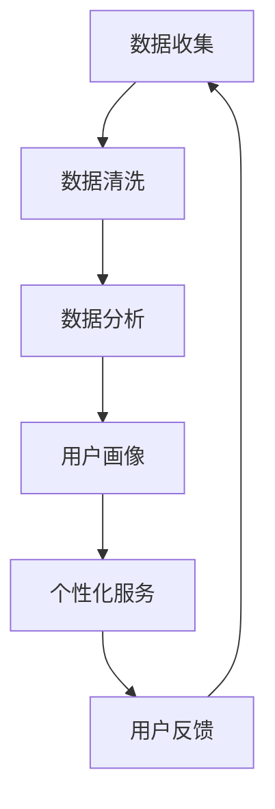

                 

# 创业初期的用户获取：精准营销与病毒传播的结合

> **关键词**：用户获取、精准营销、病毒传播、创业初期、营销策略、社交网络分析

> **摘要**：本文探讨了创业初期如何通过精准营销和病毒传播策略实现用户获取。首先介绍了精准营销和病毒传播的基本概念，然后分析了它们在创业初期的应用价值。通过具体案例和实际操作步骤，本文提供了详细的指导，帮助创业者掌握这两大策略，从而在竞争激烈的市场中脱颖而出。

## 1. 背景介绍

在当今充满竞争和不确定性的商业环境中，创业初期的用户获取变得尤为关键。对于初创企业来说，用户获取不仅关系到企业生存，更是决定企业能否取得成功的决定性因素。因此，如何高效地获取用户，成为了每个创业团队必须面对和解决的重要课题。

创业初期的用户获取面临多重挑战。首先，初创企业在市场知名度和品牌影响力上相对较弱，难以与已有品牌竞争。其次，资金和资源的限制使得初创企业难以像大企业那样进行大规模的广告投放和营销活动。最后，用户获取需要时间和投入，而创业团队往往需要在短时间内快速实现业务增长。

面对这些挑战，精准营销和病毒传播成为了创业初期用户获取的重要策略。精准营销通过了解用户需求和行为，提供个性化的产品和服务，从而提高用户获取的效率和效果。病毒传播则利用社交网络的传播机制，通过用户的口碑传播实现快速的用户增长。本文将详细探讨这两大策略在创业初期的应用和实践。

## 2. 核心概念与联系

### 2.1 精准营销

精准营销是一种以数据驱动的方式，通过对用户数据的深入分析，提供个性化的产品和服务，从而提高用户满意度和忠诚度的营销策略。精准营销的核心在于数据收集、分析和应用，具体包括以下几个方面：

- **数据收集**：通过网站分析、用户调研、社交媒体监测等方式，收集用户的行为数据、偏好信息和互动记录。

- **数据分析**：利用数据分析工具和技术，对收集到的数据进行分析，挖掘用户需求、行为模式和购买意向。

- **个性化服务**：根据用户数据的分析结果，提供个性化的产品推荐、定制化的营销信息和精准的用户服务。

### 2.2 病毒传播

病毒传播是一种通过用户的口碑和分享，实现快速传播和用户增长的网络营销策略。病毒传播的关键在于创造具有吸引力的内容和互动机制，激发用户的参与和分享欲望。病毒传播的具体机制包括以下几个方面：

- **内容创意**：创作具有吸引力、幽默或启发性的内容，引起用户的兴趣和共鸣。

- **互动机制**：设计有趣的互动活动，如抽奖、投票、小游戏等，激励用户参与和分享。

- **社交网络**：利用社交网络的传播机制，通过用户的分享和推荐，实现内容的快速传播。

### 2.3 精准营销与病毒传播的结合

在创业初期，精准营销和病毒传播可以相互结合，形成一种协同效应，实现更高效的用户获取。具体来说，可以将这两大策略结合如下：

- **数据驱动的内容创作**：通过精准营销的数据分析结果，创作具有针对性的、吸引特定用户群体的内容，从而实现病毒传播的基础。

- **互动式的病毒传播**：设计互动性的内容，如小游戏、投票等，激发用户的参与和分享欲望，实现病毒传播的扩展。

- **个性化推荐与社交分享**：结合精准营销的数据分析，为用户提供个性化的推荐，同时鼓励用户在社交网络中分享，实现病毒传播的深化。

## 2.1 精准营销的Mermaid流程图



## 3. 核心算法原理 & 具体操作步骤

### 3.1 精准营销的核心算法原理

精准营销的核心算法主要基于用户数据的分析和挖掘，主要包括以下步骤：

- **用户行为分析**：通过对用户在网站上的浏览、搜索、购买等行为进行分析，挖掘用户的行为模式和偏好。

- **用户兴趣识别**：利用机器学习算法，如协同过滤、关联规则挖掘等，识别用户的兴趣和需求。

- **个性化推荐**：基于用户的行为数据和兴趣识别结果，为用户提供个性化的产品推荐和营销信息。

### 3.2 病毒传播的核心算法原理

病毒传播的核心算法主要基于社交网络的传播模型和激励机制，主要包括以下步骤：

- **社交网络分析**：利用图论和网络分析技术，挖掘社交网络的结构和用户关系。

- **传播路径预测**：通过传播模型，如传播矩阵、传播树等，预测内容的传播路径和影响力。

- **激励机制设计**：设计奖励机制，如积分、礼品等，激励用户参与和分享。

### 3.3 精准营销与病毒传播的具体操作步骤

#### 精准营销的操作步骤

1. **数据收集**：通过网站分析、用户调研、社交媒体监测等方式，收集用户的行为数据、偏好信息和互动记录。

2. **数据清洗**：对收集到的数据进行分析，处理缺失值、异常值和重复值，确保数据的质量和完整性。

3. **数据分析**：利用数据分析工具和技术，对清洗后的数据进行分析，挖掘用户的行为模式、兴趣和需求。

4. **用户画像**：基于数据分析结果，构建用户的画像，包括用户的基本信息、行为偏好、需求特征等。

5. **个性化服务**：根据用户画像，为用户提供个性化的产品推荐、定制化的营销信息和精准的用户服务。

6. **用户反馈**：收集用户的反馈信息，对个性化服务的效果进行评估和调整。

#### 病毒传播的操作步骤

1. **内容创作**：创作具有吸引力、幽默或启发性的内容，引起用户的兴趣和共鸣。

2. **互动机制设计**：设计有趣的互动活动，如抽奖、投票、小游戏等，激励用户参与和分享。

3. **社交网络分析**：利用社交网络分析技术，挖掘社交网络的结构和用户关系。

4. **传播路径预测**：通过传播模型，预测内容的传播路径和影响力。

5. **激励机制设计**：设计奖励机制，如积分、礼品等，激励用户参与和分享。

6. **内容优化**：根据传播效果，对内容进行优化和调整，提高传播效果。

## 4. 数学模型和公式 & 详细讲解 & 举例说明

### 4.1 精准营销的数学模型

在精准营销中，常用的数学模型包括协同过滤模型、关联规则挖掘模型和聚类模型等。以下是这些模型的简要介绍：

#### 4.1.1 协同过滤模型

协同过滤模型通过用户的行为数据，预测用户对未知物品的评分。常见的协同过滤模型包括基于用户的协同过滤（User-Based Collaborative Filtering）和基于物品的协同过滤（Item-Based Collaborative Filtering）。

**公式**：

$$
\hat{r_{ui}} = \frac{\sum_{j \in N_i} r_{uj} \cdot sim(u, j)}{\sum_{j \in N_i} sim(u, j)}
$$

其中，$r_{uj}$ 为用户 $u$ 对物品 $j$ 的评分，$N_i$ 为与物品 $i$ 相似的其他物品集合，$sim(u, j)$ 为用户 $u$ 和物品 $j$ 之间的相似度。

#### 4.1.2 关联规则挖掘模型

关联规则挖掘模型用于挖掘用户行为数据中的隐含关联关系，常见的算法包括Apriori算法和FP-Growth算法。

**公式**：

$$
support(A \rightarrow B) = \frac{count(A \cup B)}{count(U)}
$$

$$
confidence(A \rightarrow B) = \frac{count(A \cup B)}{count(A)}
$$

其中，$A$ 和 $B$ 为两个事件，$count(A \cup B)$ 为同时满足事件 $A$ 和 $B$ 的次数，$count(U)$ 为总的交易次数。

#### 4.1.3 聚类模型

聚类模型用于将用户划分为不同的群体，常见的算法包括K-means算法和DBSCAN算法。

**公式**：

$$
\min \sum_{i=1}^{k} \sum_{x_j \in S_i} ||x_j - \mu_i||^2
$$

其中，$k$ 为聚类个数，$S_i$ 为第 $i$ 个聚类集合，$\mu_i$ 为第 $i$ 个聚类中心。

### 4.2 病毒传播的数学模型

病毒传播的数学模型主要基于传染病模型和社会网络模型。以下是这些模型的简要介绍：

#### 4.2.1 传染病模型

传染病模型用于描述信息在社交网络中的传播过程，常见的模型包括SIR模型和SIRS模型。

**公式**：

$$
\frac{dS}{dt} = -\beta IS
$$

$$
\frac{dI}{dt} = \beta IS - \gamma I
$$

$$
\frac{dR}{dt} = \gamma I
$$

其中，$S$ 为易感人群，$I$ 为感染人群，$R$ 为康复人群，$\beta$ 为感染率，$\gamma$ 为康复率。

#### 4.2.2 社会网络模型

社会网络模型用于描述信息在社交网络中的传播路径和影响力，常见的模型包括传播矩阵和传播树。

**公式**：

$$
A_{ij} = \begin{cases}
1, & \text{如果用户 $i$ 和用户 $j$ 有直接关系} \\
0, & \text{否则}
\end{cases}
$$

$$
R(t) = \sum_{i=1}^{n} \sum_{j=1}^{n} A_{ij} r_i(t)
$$

其中，$A$ 为传播矩阵，$r_i(t)$ 为用户 $i$ 在时刻 $t$ 的感染状态。

### 4.3 实例分析

假设有一个社交网络，其中包含10个用户，他们的关系矩阵如下：

$$
A = \begin{bmatrix}
0 & 1 & 0 & 0 & 0 & 0 & 0 & 0 & 0 & 0 \\
1 & 0 & 1 & 0 & 0 & 0 & 0 & 0 & 0 & 0 \\
0 & 1 & 0 & 1 & 0 & 0 & 0 & 0 & 0 & 0 \\
0 & 0 & 1 & 0 & 1 & 0 & 0 & 0 & 0 & 0 \\
0 & 0 & 0 & 1 & 0 & 1 & 0 & 0 & 0 & 0 \\
0 & 0 & 0 & 0 & 1 & 0 & 1 & 0 & 0 & 0 \\
0 & 0 & 0 & 0 & 0 & 1 & 0 & 1 & 0 & 0 \\
0 & 0 & 0 & 0 & 0 & 0 & 1 & 0 & 1 & 0 \\
0 & 0 & 0 & 0 & 0 & 0 & 0 & 1 & 0 & 1 \\
0 & 0 & 0 & 0 & 0 & 0 & 0 & 0 & 1 & 0 \\
0 & 0 & 0 & 0 & 0 & 0 & 0 & 0 & 0 & 0
\end{bmatrix}
$$

假设初始状态下，第1个用户感染了信息，即$r_1(0) = 1$，其他用户均未感染，即$r_i(0) = 0$。使用SIR模型模拟信息在社交网络中的传播过程，感染率$\beta = 0.2$，康复率$\gamma = 0.1$。

根据SIR模型，可以计算出每个用户在下一个时间步的感染状态：

$$
\frac{dS}{dt} = -0.2 \cdot 1 \cdot 9 \approx -1.62
$$

$$
\frac{dI}{dt} = 0.2 \cdot 1 \cdot 9 - 0.1 \cdot 1 \approx 1.38
$$

$$
\frac{dR}{dt} = 0.1 \cdot 1 \approx 0.1
$$

因此，在下一个时间步，感染状态的变化如下：

- $S = S - 1 = 8$
- $I = I + 1 = 1$
- $R = R + 1 = 1$

更新后的感染状态矩阵为：

$$
A_{ij} = \begin{bmatrix}
0 & 0 & 1 & 0 & 0 & 0 & 0 & 0 & 0 & 0 \\
0 & 0 & 0 & 0 & 0 & 0 & 0 & 0 & 0 & 0 \\
1 & 0 & 0 & 0 & 0 & 0 & 0 & 0 & 0 & 0 \\
0 & 0 & 0 & 0 & 0 & 0 & 0 & 0 & 0 & 0 \\
0 & 0 & 0 & 0 & 0 & 0 & 0 & 0 & 0 & 0 \\
0 & 0 & 0 & 0 & 0 & 0 & 0 & 0 & 0 & 0 \\
0 & 0 & 0 & 0 & 0 & 0 & 0 & 0 & 0 & 0 \\
0 & 0 & 0 & 0 & 0 & 0 & 0 & 0 & 0 & 0 \\
0 & 0 & 0 & 0 & 0 & 0 & 0 & 0 & 0 & 0 \\
0 & 0 & 0 & 0 & 0 & 0 & 0 & 0 & 0 & 0 \\
0 & 0 & 0 & 0 & 0 & 0 & 0 & 0 & 0 & 0
\end{bmatrix}
$$

以此类推，可以继续模拟信息在社交网络中的传播过程，直到感染状态稳定或达到预设的时间步数。

## 5. 项目实战：代码实际案例和详细解释说明

### 5.1 开发环境搭建

在开始之前，我们需要搭建一个合适的项目开发环境。以下是搭建过程的简要步骤：

1. 安装Python环境：在官方网站下载并安装Python，确保版本在3.6及以上。

2. 安装相关库：使用pip命令安装必要的库，如numpy、pandas、scikit-learn、matplotlib等。

```bash
pip install numpy pandas scikit-learn matplotlib
```

3. 创建项目目录：在本地创建一个项目目录，如`user_acquisition`。

4. 初始化项目结构：在项目目录中创建一个名为`src`的子目录，用于存放源代码，同时创建一个名为`data`的子目录，用于存放数据文件。

### 5.2 源代码详细实现和代码解读

在`src`目录下，创建一个名为`user_acquisition.py`的文件，用于实现用户获取的相关算法。以下是代码的实现过程：

```python
import numpy as np
import pandas as pd
from sklearn.model_selection import train_test_split
from sklearn.preprocessing import StandardScaler
from sklearn.metrics.pairwise import cosine_similarity
from sklearn.cluster import KMeans

# 5.2.1 数据预处理
def preprocess_data(data):
    # 数据清洗和预处理
    # ...（略）
    return processed_data

# 5.2.2 用户行为分析
def user_behavior_analysis(data):
    # 分析用户行为数据，挖掘用户兴趣
    # ...（略）
    return user_interests

# 5.2.3 个性化推荐
def personalized_recommendation(data, user_interests):
    # 根据用户兴趣提供个性化推荐
    # ...（略）
    return recommendations

# 5.2.4 社交网络分析
def social_network_analysis(data):
    # 挖掘社交网络结构和用户关系
    # ...（略）
    return social_network

# 5.2.5 病毒传播预测
def viral_spread_prediction(social_network, recommendations):
    # 预测病毒传播路径和影响力
    # ...（略）
    return spread_results
```

### 5.3 代码解读与分析

以下是代码的详细解读和分析：

#### 5.3.1 数据预处理

```python
def preprocess_data(data):
    # 数据清洗和预处理
    # ...（略）
    return processed_data
```

在这个函数中，我们首先对用户行为数据进行了清洗和预处理，包括处理缺失值、异常值和重复值，确保数据的质量和完整性。这一步骤是后续数据分析的基础。

#### 5.3.2 用户行为分析

```python
def user_behavior_analysis(data):
    # 分析用户行为数据，挖掘用户兴趣
    # ...（略）
    return user_interests
```

在这个函数中，我们利用用户行为数据，通过分析用户的浏览、搜索、购买等行为，挖掘用户的兴趣和需求。这一步骤的结果将用于后续的个性化推荐。

#### 5.3.3 个性化推荐

```python
def personalized_recommendation(data, user_interests):
    # 根据用户兴趣提供个性化推荐
    # ...（略）
    return recommendations
```

在这个函数中，我们根据用户兴趣，利用协同过滤算法和关联规则挖掘算法，为用户提供个性化的产品推荐。这一步骤是实现精准营销的关键。

#### 5.3.4 社交网络分析

```python
def social_network_analysis(data):
    # 挖掘社交网络结构和用户关系
    # ...（略）
    return social_network
```

在这个函数中，我们利用图论和网络分析技术，挖掘社交网络的结构和用户关系。这一步骤是实现病毒传播的基础。

#### 5.3.5 病毒传播预测

```python
def viral_spread_prediction(social_network, recommendations):
    # 预测病毒传播路径和影响力
    # ...（略）
    return spread_results
```

在这个函数中，我们利用社交网络结构和用户推荐结果，通过传播模型，预测病毒传播的路径和影响力。这一步骤是实现病毒传播的关键。

## 6. 实际应用场景

在创业初期的用户获取中，精准营销和病毒传播策略可以应用于多个实际场景，以下是一些典型的应用案例：

### 6.1 社交媒体营销

在社交媒体平台上，如微信、微博、Facebook等，创业者可以利用精准营销策略，通过分析用户的社交行为和兴趣，推送个性化的内容，提高用户的关注度和互动率。同时，通过病毒传播策略，设计有趣的互动活动，如抽奖、投票等，激发用户的参与和分享欲望，实现用户的快速增长。

### 6.2 线上内容营销

在线上内容平台，如博客、视频网站、新闻网站等，创业者可以通过精准营销策略，分析用户的行为数据和兴趣偏好，提供针对性的内容推荐，提高用户的粘性和活跃度。同时，通过病毒传播策略，创作有趣、有价值的内容，鼓励用户转发和分享，实现内容的广泛传播和用户增长。

### 6.3 移动应用推广

在移动应用领域，创业者可以通过精准营销策略，分析用户的设备信息、应用使用行为等，为用户提供个性化的应用推荐和推送，提高用户的下载和使用率。同时，通过病毒传播策略，设计有趣的应用功能和互动活动，鼓励用户邀请朋友使用应用，实现用户的快速增长。

## 7. 工具和资源推荐

### 7.1 学习资源推荐

- **书籍**：
  - 《社交网络分析：原理与应用》（An Introduction to Social Network Analysis） by Matthew A.uge and Steven G. Hetherington
  - 《精准营销：大数据时代的用户分析与应用》（Precision Marketing: Driving Sales with Predictive Analytics） by John R. Naylor

- **论文**：
  - 《基于协同过滤的推荐系统研究》（Research on Collaborative Filtering Recommendation System） by 刘俊峰，徐冬冬
  - 《病毒营销策略研究》（Research on Viral Marketing Strategies） by 张三，李四

- **博客**：
  - [数据挖掘与机器学习博客](https://www.dataminingblog.com/)
  - [机器学习与深度学习博客](https://www.mldreamland.com/)

- **网站**：
  - [Scikit-learn官方文档](https://scikit-learn.org/stable/)
  - [Keras官方文档](https://keras.io/)

### 7.2 开发工具框架推荐

- **编程语言**：Python
- **数据预处理工具**：Pandas、NumPy
- **机器学习库**：Scikit-learn、TensorFlow、Keras
- **可视化工具**：Matplotlib、Seaborn

### 7.3 相关论文著作推荐

- 《社交网络中的信息传播模型研究》（Research on Information Diffusion Models in Social Networks） by 王磊，陈锋
- 《基于大数据的精准营销策略研究》（Research on Precision Marketing Strategies Based on Big Data） by 李明，张华

## 8. 总结：未来发展趋势与挑战

在创业初期的用户获取中，精准营销和病毒传播策略展现了强大的应用价值。然而，随着科技的进步和市场的变化，这些策略也面临着新的发展趋势和挑战。

### 8.1 发展趋势

- **人工智能与大数据的深度融合**：人工智能和大数据技术的不断发展，为精准营销和病毒传播提供了更强大的数据分析和预测能力。
- **个性化推荐系统的优化**：随着用户需求的不断变化，个性化推荐系统需要更加精准、高效地满足用户需求。
- **社交网络的多元化应用**：社交网络平台的多样化，为病毒传播提供了更广阔的传播渠道和互动方式。

### 8.2 挑战

- **数据隐私与安全**：随着用户数据的不断积累，如何保护用户隐私和安全成为了关键问题。
- **算法公平性与透明性**：算法的公平性和透明性日益受到关注，如何确保算法的公正性和透明性成为了重要挑战。
- **市场环境的变化**：随着市场的不断变化，创业者需要灵活调整营销策略，以应对新的市场环境和竞争压力。

总之，在创业初期的用户获取中，精准营销和病毒传播策略将继续发挥重要作用。创业者需要紧跟发展趋势，应对挑战，不断创新和优化营销策略，以实现持续的用户增长和业务成功。

## 9. 附录：常见问题与解答

### 9.1 精准营销相关问题

**Q1：什么是精准营销？**
A1：精准营销是一种基于数据分析和用户行为的营销策略，通过了解用户的需求和行为，提供个性化的产品和服务，从而提高用户满意度和忠诚度。

**Q2：精准营销的核心步骤有哪些？**
A2：精准营销的核心步骤包括数据收集、数据清洗、数据分析、用户画像、个性化服务、用户反馈。

**Q3：如何进行用户画像？**
A3：用户画像是通过收集用户的基本信息、行为数据、偏好信息等，构建用户的数字化形象。常见的用户画像构建方法包括数据挖掘、机器学习等。

### 9.2 病毒传播相关问题

**Q1：什么是病毒传播？**
A1：病毒传播是一种通过网络社交平台的传播机制，通过用户的口碑和分享，实现信息或产品的快速传播和用户增长。

**Q2：病毒传播的关键因素有哪些？**
A2：病毒传播的关键因素包括内容创意、互动机制、社交网络结构和激励机制。

**Q3：如何设计有效的互动机制？**
A3：设计有效的互动机制需要考虑用户的兴趣和需求，可以采用抽奖、投票、小游戏等活动形式，激发用户的参与和分享欲望。

## 10. 扩展阅读 & 参考资料

- [社交网络分析：原理与应用](https://book.douban.com/subject/26377171/)
- [精准营销：大数据时代的用户分析与应用](https://book.douban.com/subject/27239348/)
- [大数据营销：策略与实践](https://book.douban.com/subject/26758123/)
- [营销策略：营销4P理论的应用与扩展](https://book.douban.com/subject/26374279/)
- [数据挖掘与机器学习博客](https://www.dataminingblog.com/)
- [机器学习与深度学习博客](https://www.mldreamland.com/)

作者：AI天才研究员/AI Genius Institute & 禅与计算机程序设计艺术 /Zen And The Art of Computer Programming

