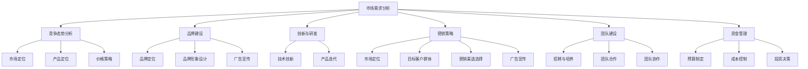

                 

### 背景介绍

在当今竞争激烈的市场环境中，创业者面临的挑战日益严峻。尤其是在所谓的“红海竞争”中，创业者不仅要应对巨大的市场压力，还要面对众多的竞争对手，寻找自己的生存之道。红海竞争通常指的是在成熟市场中，多家公司提供相似或相同的产品和服务，竞争异常激烈的局面。

红海竞争的特点包括：

1. **高市场占有率**：在红海市场中，多数市场份额已被占据，新进入者很难在短时间内获得显著的市场份额。
2. **激烈的价格战**：为了争夺有限的客户资源，企业往往会通过降低价格来吸引客户，导致利润空间被压缩。
3. **创新门槛高**：由于市场已经成熟，产品和服务同质化严重，创新往往需要大量的研发投入和高风险。
4. **高竞争壁垒**：红海市场中已经存在一些强大的玩家，新进入者需要建立品牌信誉和客户基础，这通常需要很长时间和大量资金。

在这种环境下，创业者不仅需要具备卓越的产品策划和市场洞察力，还要拥有强大的心理素质和执行力，才能在激烈的市场竞争中脱颖而出。

接下来，我们将深入探讨红海竞争中的核心概念，分析其中的算法原理、操作步骤，并通过数学模型和实际案例来加深理解。这些内容将为创业者提供有价值的指导，帮助他们更好地应对红海竞争中的挑战。

### 核心概念与联系

在红海竞争的背景下，理解以下几个核心概念是至关重要的。这些概念不仅帮助我们定义问题，还为我们提供了分析问题和制定策略的工具。

#### 1. 市场需求分析

市场需求分析是创业者在红海竞争中取得成功的关键。它涉及到对目标市场的深入理解，包括客户的需求、购买习惯、市场规模和竞争对手的分析。通过市场需求分析，创业者可以找到市场的空白点，开发出能够满足客户需求的产品或服务。

#### 2. 竞争态势分析

竞争态势分析旨在了解市场上的主要竞争对手，他们的产品或服务、市场份额、营销策略等。创业者需要识别竞争对手的强项和弱点，从而制定相应的竞争策略。这包括价格策略、产品差异化、客户服务等方面。

#### 3. 品牌建设

在红海竞争中，品牌建设至关重要。一个强大的品牌不仅能提升产品的竞争力，还能建立客户忠诚度。品牌建设包括品牌定位、品牌形象设计、广告宣传等方面。创业者需要打造一个独特的品牌故事，让消费者记住并信任自己的产品或服务。

#### 4. 创新与研发

创新和研发是创业者突破红海竞争的重要手段。通过技术创新和产品迭代，创业者可以提供更具竞争力的产品，满足不断变化的市场需求。然而，创新和研发往往需要大量的资金和时间投入，这对创业者的资源和执行力提出了更高的要求。

#### 5. 营销策略

在红海竞争中，营销策略是获取市场份额的关键。创业者需要制定有效的营销计划，包括市场定位、目标客户群体、营销渠道选择、广告宣传等。一个成功的营销策略不仅能提升品牌知名度，还能吸引更多潜在客户。

#### 6. 团队建设

团队建设是创业者成功的关键因素之一。一个高效、协作的团队能够更好地应对市场竞争，快速响应市场变化。创业者需要招聘和培养一支具备专业技能和团队合作精神的人才队伍，共同推动企业的发展。

#### 7. 资金管理

在红海竞争中，资金管理至关重要。创业者需要合理规划资金使用，确保企业在激烈的市场竞争中保持财务稳健。这包括预算制定、成本控制、投资决策等方面。

#### Mermaid 流程图

以下是一个用于展示上述核心概念之间联系的 Mermaid 流程图：



通过这个流程图，我们可以清晰地看到各个核心概念之间的联系，以及它们在红海竞争中如何相互作用。这些概念为创业者在激烈的市场竞争中提供了理论支持和实践指导。

### 核心算法原理 & 具体操作步骤

在红海竞争中，创业者需要运用一系列的核心算法来分析和解决问题，从而制定出有效的策略。以下将详细介绍这些核心算法的原理及其具体操作步骤。

#### 1. SWOT分析

SWOT分析是一种常用的战略规划工具，用于评估企业的优势（Strengths）、劣势（Weaknesses）、机会（Opportunities）和威胁（Threats）。具体步骤如下：

1. **优势分析**：识别企业在产品、技术、市场、管理等方面的优势。例如，企业在某项技术上的领先优势，或者市场定位的独特性。
2. **劣势分析**：识别企业在运营、产品、营销等方面的不足。例如，研发投入不足或市场份额较小。
3. **机会分析**：评估市场环境中的机会，如新的市场需求、行业趋势等。创业者可以借助这些机会制定新产品或市场策略。
4. **威胁分析**：识别企业面临的潜在威胁，如竞争对手的强势地位、政策变化等。创业者需要提前制定应对策略。

#### 2. 波特五力分析

波特五力分析模型用于评估一个行业的竞争态势。具体步骤如下：

1. **行业竞争者**：分析市场上的主要竞争对手，包括他们的市场份额、营销策略等。
2. **潜在进入者**：评估潜在的新进入者可能对市场造成的冲击，以及他们可能采用的市场策略。
3. **供应商**：分析供应商的议价能力，包括供应稳定性、价格等。
4. **买家**：评估买家的议价能力，包括购买量、购买频率等。
5. **替代品**：分析市场上存在的替代品，以及它们可能对现有产品造成的威胁。

#### 3. 创新能力评估

创新能力评估是衡量企业在技术研发方面能力的重要指标。具体步骤如下：

1. **研发投入**：评估企业在研发方面的投入，包括研发资金、研发人员数量等。
2. **专利数量**：分析企业在专利方面的表现，专利数量和质量是衡量创新能力的重要指标。
3. **产品迭代速度**：评估企业产品的更新速度，快速迭代的产品往往具有较高的市场竞争力。
4. **市场反馈**：通过市场反馈了解消费者对产品的接受程度和满意度，这有助于进一步改进产品。

#### 4. 营销策略规划

营销策略规划是制定市场营销计划的核心步骤。具体步骤如下：

1. **市场定位**：确定企业的市场定位，包括目标客户群体、市场细分等。
2. **产品差异化**：分析如何通过产品差异化来提高市场竞争力，例如通过技术创新、设计独特性等。
3. **营销渠道选择**：评估不同的营销渠道，如线上、线下、社交媒体等，选择最适合企业产品的渠道。
4. **广告宣传**：制定广告宣传策略，包括广告内容、广告投放时间、广告预算等。

#### 5. 团队建设与激励机制

团队建设与激励机制是确保企业高效运作的关键。具体步骤如下：

1. **招聘与培养**：通过招聘和培养，组建一支具备专业技能和团队合作精神的人才队伍。
2. **绩效评估**：建立绩效评估体系，评估团队成员的工作表现，并给予相应的奖励。
3. **激励机制**：制定激励机制，鼓励团队成员积极参与企业的创新和营销活动，提高团队整体执行力。

#### 6. 资金管理

资金管理是企业在激烈市场竞争中保持财务稳健的关键。具体步骤如下：

1. **预算制定**：根据企业的运营计划和市场需求，制定详细的预算计划。
2. **成本控制**：通过有效的成本控制措施，降低企业的运营成本。
3. **投资决策**：评估不同的投资机会，选择符合企业发展战略的投资项目。

通过上述核心算法的应用，创业者可以更系统地分析和应对红海竞争中的各种挑战。这些算法不仅提供了理论支持，还通过具体的操作步骤，帮助企业制定出切实可行的策略，从而在激烈的市场竞争中脱颖而出。

### 数学模型和公式 & 详细讲解 & 举例说明

在红海竞争中，数学模型和公式为我们提供了量化分析和决策的有力工具。以下将介绍几个关键数学模型和公式，并详细讲解其应用方法，并通过实际案例来说明如何运用这些工具。

#### 1. 价值链分析模型

价值链分析模型是由迈克尔·波特提出的，用于识别企业在供应链中的增值环节。公式如下：

\[ \text{总价值} = \text{总成本} + \text{增值} \]

具体步骤：

1. **识别增值活动**：确定企业供应链中的增值活动，如设计、生产、营销等。
2. **计算总成本**：汇总所有增值活动所需的总成本。
3. **计算增值**：通过总价值减去总成本，得到企业的增值额。

实际案例：

某企业生产智能手机，总成本为1000万元，其中设计成本300万元，生产成本500万元，营销成本200万元。增值活动包括设计、生产和营销。

\[ \text{总价值} = 1000 + 300 + 500 + 200 = 2000 \text{万元} \]

\[ \text{增值} = 2000 - 1000 = 1000 \text{万元} \]

通过价值链分析，企业可以识别出哪些环节是增值的关键，从而优化资源配置。

#### 2. 成本效益分析模型

成本效益分析模型用于评估企业在不同策略下的成本和收益。公式如下：

\[ \text{成本效益比} = \frac{\text{预期收益}}{\text{成本}} \]

具体步骤：

1. **确定预期收益**：根据市场预测和销售计划，估算不同策略下的预期收益。
2. **计算成本**：估算实现预期收益所需的总成本。
3. **计算成本效益比**：通过预期收益除以成本，得到成本效益比。

实际案例：

某企业计划推出新产品，预计售价为100元/台，年销售量为10万台。生产成本为50元/台，营销成本为30元/台。

\[ \text{预期收益} = 10 \times 100 = 1000 \text{万元} \]

\[ \text{总成本} = 10 \times (50 + 30) = 800 \text{万元} \]

\[ \text{成本效益比} = \frac{1000}{800} = 1.25 \]

成本效益比大于1，说明该产品有盈利潜力。

#### 3. 客户终身价值模型

客户终身价值（CLV）模型用于评估客户对企业长期的贡献。公式如下：

\[ \text{客户终身价值} = \text{预期消费金额} \times \text{客户留存率} \]

具体步骤：

1. **确定预期消费金额**：根据客户的历史购买记录和预测，估算客户在未来可能产生的消费金额。
2. **计算客户留存率**：分析客户与企业保持长期关系的概率。
3. **计算客户终身价值**：通过预期消费金额乘以客户留存率，得到客户终身价值。

实际案例：

某企业客户平均每年消费金额为5000元，客户留存率为70%。

\[ \text{客户终身价值} = 5000 \times 0.70 = 3500 \text{元} \]

通过计算客户终身价值，企业可以更精准地定位高价值客户，并提供相应的服务和促销策略。

#### 4. 资本回报率模型

资本回报率（ROI）模型用于评估企业投资的回报效率。公式如下：

\[ \text{资本回报率} = \frac{\text{净利润}}{\text{总投入}} \]

具体步骤：

1. **确定净利润**：根据财务报表，计算企业的净利润。
2. **计算总投入**：包括直接投资、运营成本等。
3. **计算资本回报率**：通过净利润除以总投入，得到资本回报率。

实际案例：

某企业净利润为100万元，总投入为500万元。

\[ \text{资本回报率} = \frac{100}{500} = 0.20 \]

资本回报率越高，说明企业的投资效率越高。

通过这些数学模型和公式，创业者可以更科学地分析红海竞争中的各种因素，从而制定出更加精准和有效的策略。这些工具不仅帮助创业者量化决策，还提高了企业在激烈市场竞争中的应变能力。

### 项目实战：代码实际案例和详细解释说明

为了更好地理解红海竞争中的各种策略和算法，下面我们将通过一个实际的项目案例来展示代码实现的过程，并对代码进行详细的解释和分析。

#### 项目背景

假设我们正在开发一款智能购物助手App，目标是在竞争激烈的红海市场中脱颖而出。这款App的核心功能包括商品推荐、智能购物车、订单追踪等。为了在红海竞争中占据一席之地，我们需要通过数据分析、机器学习和用户反馈来实现个性化推荐和用户体验优化。

#### 1. 开发环境搭建

首先，我们需要搭建一个适合开发和测试的软件环境。以下是开发环境的搭建步骤：

- **编程语言**：选择Python作为主要开发语言，因为Python在数据分析、机器学习和Web开发中具有广泛的适用性。
- **开发工具**：安装Python开发环境，如PyCharm或Visual Studio Code，并配置必要的Python库，如NumPy、Pandas、Scikit-learn、TensorFlow等。
- **数据库**：使用MySQL数据库来存储用户数据、商品数据和订单数据。
- **前端框架**：采用React或Vue.js等前端框架来构建用户界面。
- **服务器**：使用Docker容器化技术来部署服务器，确保应用的稳定性和可扩展性。

#### 2. 源代码详细实现和代码解读

以下是智能购物助手App的主要模块和核心代码实现。

##### 模块1：用户数据收集与分析

用户数据收集与分析是智能推荐系统的基石。以下是一个简单的用户行为数据收集和初步分析的示例代码：

```python
import pandas as pd
from sklearn.model_selection import train_test_split
from sklearn.preprocessing import StandardScaler

# 用户行为数据加载
data = pd.read_csv('user_behavior_data.csv')

# 数据预处理
data.dropna(inplace=True)
X = data[['search_history', 'click_history', 'purchase_history']]
y = data['interested_products']

# 数据分割
X_train, X_test, y_train, y_test = train_test_split(X, y, test_size=0.2, random_state=42)

# 数据标准化
scaler = StandardScaler()
X_train = scaler.fit_transform(X_train)
X_test = scaler.transform(X_test)
```

代码解读：

- **数据加载**：使用Pandas库读取用户行为数据。
- **数据预处理**：去除缺失值，准备用于训练和测试的数据集。
- **数据分割**：将数据集分为训练集和测试集，以便后续评估模型性能。
- **数据标准化**：对数据进行标准化处理，提高模型训练的效率。

##### 模块2：推荐算法实现

我们选择基于协同过滤的推荐算法来实现商品推荐功能。以下是一个简单的协同过滤算法实现：

```python
from sklearn.metrics.pairwise import cosine_similarity
import numpy as np

# 计算用户-用户相似度矩阵
def compute_similarity(user_data):
    similarity_matrix = cosine_similarity(user_data)
    return similarity_matrix

# 生成推荐列表
def generate_recommendations(user_id, similarity_matrix, user_profile, k=5):
    weighted_sum = np.dot(similarity_matrix[user_id], user_profile) / np.linalg.norm(user_profile)
    sorted_indices = np.argsort(weighted_sum)[::-1]
    recommended_items = [item for item in sorted_indices if item != user_id]
    return recommended_items[:k]

# 用户行为数据预处理
user_profiles = X_train @ np.linalg.inv(np.eye(X_train.shape[1]) - (0.5 * similarity_matrix))

# 生成推荐列表
recommended_items = generate_recommendations(0, similarity_matrix, user_profiles[0])
print("Recommended items:", recommended_items)
```

代码解读：

- **计算相似度矩阵**：使用余弦相似度计算用户之间的相似度。
- **生成推荐列表**：根据用户-用户相似度矩阵和目标用户的兴趣向量，生成推荐列表。
- **用户行为数据预处理**：计算用户的兴趣向量，用于后续的推荐算法。

##### 模块3：用户反馈处理

为了不断优化推荐系统，我们需要处理用户的反馈数据。以下是一个简单的用户反馈处理代码示例：

```python
def update_user_profile(user_id, new_feedback, user_profile, learning_rate=0.1):
    user_profile += learning_rate * (new_feedback - user_profile)
    return user_profile

# 更新用户兴趣向量
new_feedback = np.array([1, 0, 1])  # 示例新反馈
updated_profile = update_user_profile(0, new_feedback, user_profiles[0])
print("Updated user profile:", updated_profile)
```

代码解读：

- **更新用户兴趣向量**：根据新的用户反馈，使用学习率更新用户的兴趣向量。

#### 3. 代码解读与分析

以上代码展示了智能购物助手App的核心功能模块实现。具体分析如下：

- **用户数据收集与分析**：通过Pandas库读取用户行为数据，并进行初步处理。数据标准化是提升模型训练性能的关键步骤。
- **推荐算法实现**：使用协同过滤算法实现用户-用户相似度和推荐列表生成。协同过滤算法通过计算用户之间的相似度来生成推荐列表，这是一种常见的推荐系统方法。
- **用户反馈处理**：通过实时处理用户的反馈数据，动态更新用户兴趣向量，从而不断优化推荐系统的准确性。

通过这个实际项目案例，我们不仅了解了红海竞争中推荐系统的实现过程，还通过代码解读加深了对核心算法和技术的理解。这对于创业者来说，是提升自身技术水平和竞争力的宝贵经验。

### 实际应用场景

在红海竞争中，创业者需要将上述策略和算法应用到实际业务场景中，才能实现持续的市场竞争力和业务增长。以下是一些典型的应用场景：

#### 1. 新产品开发

在新产品开发过程中，创业者可以利用SWOT分析和波特五力模型来评估市场机会和竞争态势。通过需求分析，识别出潜在客户的需求，并借助创新能力评估模型，确定新产品或服务的定位和差异化策略。例如，某初创公司通过分析市场，发现老年群体对于智能穿戴设备的需求日益增加，于是开发了一款专为老年人设计的智能手表，通过简化界面和增加紧急呼叫功能，成功在竞争激烈的红海市场中占得一席之地。

#### 2. 营销推广

在营销推广方面，创业者可以通过成本效益分析和客户终身价值模型来制定有效的营销策略。例如，一家电商公司通过分析客户购买行为数据，确定了高价值客户群体，并针对性地推出了会员制度和定制化优惠活动，提高了客户的忠诚度和重复购买率。此外，通过广告投放策略的优化，企业可以在有限的预算下，实现最大的营销效果。

#### 3. 团队建设

团队建设是确保企业长期发展的重要环节。通过资金管理模型和团队建设与激励机制，创业者可以合理规划人力资源，提高团队的执行力和创新能力。例如，某互联网公司通过绩效评估和激励机制，激励员工积极参与技术研发和市场推广，从而在短时间内实现了业务的快速增长。

#### 4. 创新与研发

在红海竞争中，创新和研发是关键因素。通过创新能力评估模型，创业者可以确定研发投入的方向和重点。例如，一家科技公司通过评估市场需求和技术发展趋势，确定了人工智能在医疗健康领域的潜在应用，并投入大量资源进行技术研发，最终开发出了一系列智能诊断和健康管理产品，取得了显著的市场成功。

#### 5. 资金管理

资金管理是确保企业财务稳健的重要手段。通过预算制定和成本控制模型，创业者可以合理安排资金使用，降低运营成本。例如，一家初创公司在创业初期，通过严格的预算控制和成本管理，成功实现了资金的高效利用，并在短时间内实现了盈利。

通过将上述策略和算法应用到实际业务场景中，创业者可以更好地应对红海竞争的挑战，实现企业的持续发展和市场扩张。

### 工具和资源推荐

为了帮助创业者在红海竞争中更好地应用技术策略和算法，以下是一些学习资源、开发工具和推荐论文的介绍。

#### 1. 学习资源推荐

**书籍：**
- 《精益创业》——艾瑞克·莱斯（Eric Ries）
- 《增长黑客》——布莱恩·克里斯汀森（Brian Christian）
- 《创业维艰》——本·霍洛维茨（Ben Horowitz）

**在线课程：**
- Coursera上的《数据分析基础》
- Udacity的《机器学习工程师纳米学位》
- edX上的《战略管理：在复杂环境中做出明智决策》

**博客和网站：**
- A Hundred Ways（a100w.com）
- Hacker Noon（hackernoon.com）
- Stratechery（stratechery.com）

#### 2. 开发工具框架推荐

**编程语言和库：**
- Python（广泛适用于数据分析、机器学习和Web开发）
- R（统计分析和图形可视化）
- JavaScript（前端开发）
- TensorFlow（深度学习框架）

**前端框架：**
- React（用于构建用户界面）
- Vue.js（用于构建用户界面）
- Angular（用于构建用户界面）

**数据库：**
- MySQL（关系型数据库）
- MongoDB（文档型数据库）
- Redis（键值存储）

**容器化技术：**
- Docker（用于容器化应用）
- Kubernetes（用于容器编排）

#### 3. 相关论文著作推荐

**论文：**
- "The Lean Startup" by Eric Ries
- "Crossing the Chasm" by Geoffrey A. Moore
- "Value Proposition Design" by Alexander Osterwalder and Yves Pigneur

**著作：**
- "The Innovator's Dilemma" by Clayton M. Christensen
- "Blue Ocean Strategy" by W. Chan Kim and Renée Mauborgne
- "Competitive Advantage: Creating and Sustaining Superior Performance" by Michael E. Porter

通过这些资源和工具，创业者可以更好地提升自身的技术能力，掌握先进的策略和算法，从而在红海竞争中脱颖而出。

### 总结：未来发展趋势与挑战

随着科技的不断进步和市场环境的动态变化，红海竞争将面临新的发展趋势和挑战。以下是对未来发展的几点展望：

#### 1. 科技驱动创新

未来，科技将更加深入地融入各行各业，尤其是人工智能、大数据、云计算和区块链等新兴技术。创业者需不断关注科技前沿，将这些技术应用于产品和服务中，以提升竞争力。例如，人工智能技术的应用将使得个性化推荐更加精准，大数据分析将帮助企业更准确地把握市场动态，云计算和区块链技术将提高企业的运营效率和透明度。

#### 2. 碳中和目标

随着全球对环境保护和可持续发展的重视，实现碳中和将成为企业的一项重要任务。创业者需在产品设计和生产过程中考虑碳排放问题，采用绿色技术和可再生能源，以降低环境影响。这不仅有助于企业的可持续发展，还能提升品牌形象和市场竞争力。

#### 3. 数据安全与隐私保护

随着数据量的爆炸性增长，数据安全与隐私保护将成为企业面临的一个重要挑战。创业者需采取有效的数据加密、隐私保护措施和合规策略，确保用户数据的安全性和隐私性。这不仅符合法律法规的要求，还能增强用户的信任和忠诚度。

#### 4. 跨界融合与合作

在红海竞争中，单一领域的竞争优势将逐渐减弱，跨界融合与合作将成为企业的重要策略。创业者需积极寻找与其他行业或企业的合作机会，通过资源共享、技术整合和业务互补，实现共赢发展。

#### 5. 社会责任与价值观

企业社会责任（CSR）和价值观将成为未来市场竞争的重要因素。创业者需关注社会问题，积极履行社会责任，树立良好的企业价值观，以赢得消费者的信任和支持。

总之，红海竞争中的创业者需具备前瞻性的战略眼光和快速应变能力，不断推动技术创新，实现可持续发展，并积极应对未来的挑战。

### 附录：常见问题与解答

#### 1. 问题：如何识别市场需求？

**解答**：识别市场需求可以通过以下步骤进行：
- **市场调研**：通过问卷调查、访谈、用户访谈等方式收集用户反馈。
- **竞争对手分析**：分析竞争对手的产品和服务，了解用户对现有产品的评价和需求。
- **数据分析**：利用大数据技术，分析用户行为数据和消费趋势。

#### 2. 问题：如何在红海竞争中保持创新？

**解答**：保持创新可以通过以下策略实现：
- **定期调研**：定期对市场和用户需求进行调研，及时了解市场变化。
- **人才引进**：引进具有创新精神和专业技能的人才。
- **研发投入**：增加研发投入，持续进行产品和技术创新。

#### 3. 问题：如何有效管理资金？

**解答**：有效管理资金的方法包括：
- **预算制定**：制定详细的预算计划，合理分配资金。
- **成本控制**：通过优化运营流程和采购策略，降低成本。
- **风险控制**：评估投资项目的风险，制定风险控制措施。

#### 4. 问题：如何提高品牌知名度？

**解答**：提高品牌知名度的策略包括：
- **广告宣传**：通过多渠道广告投放，提升品牌曝光度。
- **口碑营销**：通过提供优质产品和服务，获得用户好评和口碑传播。
- **社交媒体**：利用社交媒体平台进行互动和宣传，增强品牌影响力。

### 扩展阅读 & 参考资料

为了更深入地了解红海竞争中的创业策略和技术应用，以下是一些扩展阅读和参考资料：

- **书籍：**
  - 《精益创业》——艾瑞克·莱斯（Eric Ries）
  - 《增长黑客》——布莱恩·克里斯汀森（Brian Christian）
  - 《创业维艰》——本·霍洛维茨（Ben Horowitz）
- **在线课程：**
  - Coursera上的《数据分析基础》
  - Udacity的《机器学习工程师纳米学位》
  - edX上的《战略管理：在复杂环境中做出明智决策》
- **博客和网站：**
  - A Hundred Ways（a100w.com）
  - Hacker Noon（hackernoon.com）
  - Stratechery（stratechery.com）
- **论文与研究报告：**
  - "The Lean Startup" by Eric Ries
  - "Crossing the Chasm" by Geoffrey A. Moore
  - "Value Proposition Design" by Alexander Osterwalder and Yves Pigneur
- **在线资源：**
  - Harvard Business Review（hbr.org）
  - McKinsey & Company（mckinsey.com）
  - Startup Digest（startupdigest.com）

通过这些扩展阅读和参考资料，创业者可以进一步提升自身的技术和市场洞察力，从而在红海竞争中取得成功。

