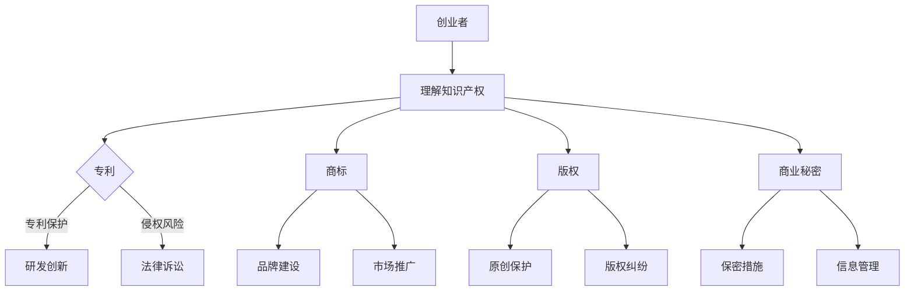

                 

# 创业者如何建立个人知识产权保护意识

## 摘要

作为创业者，保护个人知识产权是确保创新成果得到合法保护的关键。本文将深入探讨如何建立个人知识产权保护意识，包括理解知识产权的核心概念、制定保护策略、采取具体措施等方面。文章将结合实际案例，提供实用的建议和工具，帮助创业者更好地保护自己的创新成果，实现可持续的发展。

## 1. 背景介绍

知识产权（Intellectual Property, IP）是指人们创造的智力成果所具有的专有权利。它涵盖了专利、商标、版权、商业秘密等多个方面，是知识经济时代重要的资产。随着科技的发展，知识产权的价值日益凸显，对于创业者来说，保护知识产权不仅是对自己成果的尊重，更是实现商业成功的关键。

然而，许多创业者对知识产权保护的重要性认识不足，或者缺乏有效的保护措施，导致创新成果被侵权，甚至失去了市场竞争力。本文旨在帮助创业者建立个人知识产权保护意识，从而更好地应对知识产权风险，保障自身权益。

### 关键词
- 知识产权
- 创业者
- 保护意识
- 专利
- 商标
- 版权
- 商业秘密
- 侵权

## 2. 核心概念与联系

### 2.1 知识产权的核心概念

知识产权的核心概念包括专利、商标、版权和商业秘密。

**专利**：是指一种法律上的权利，授予发明者对其发明进行独家生产和使用的权利，以鼓励创新。

**商标**：是用于识别商品或服务的标志，通过注册可以获得法律保护，防止他人侵权。

**版权**：是指对原创作品的独占权，包括文学、艺术、音乐等领域的作品。

**商业秘密**：是指不为公众所知悉，能为权利人带来经济利益，具有实际或潜在商业价值的信息。

### 2.2 知识产权保护机制

知识产权保护机制主要包括法律保护和自我保护。

**法律保护**：通过专利、商标、版权等法律手段，对创新成果进行保护。

**自我保护**：包括保密措施、合同管理、侵权监测等，以减少侵权风险。

### 2.3 知识产权与商业价值的关系

知识产权不仅是法律权利，更是商业价值的体现。它能够为创业者提供市场优势，增加企业的竞争力。

- **专利**：可以阻止竞争对手模仿，保护市场地位。
- **商标**：提高品牌知名度，增强消费者忠诚度。
- **版权**：保护原创作品，防止盗版。
- **商业秘密**：保持竞争优势，防止竞争对手获取商业利益。

### 2.4 Mermaid 流程图



通过上述流程图，我们可以清晰地看到知识产权保护在创业者业务发展中的重要性。

### 3. 核心算法原理 & 具体操作步骤

#### 3.1 知识产权保护策略制定

**算法原理**：制定知识产权保护策略的核心在于识别潜在的风险，并采取相应的措施进行预防和管理。

**操作步骤**：

1. **评估风险**：分析行业特点和竞争对手，识别潜在的侵权风险。
2. **建立保护机制**：根据风险评估，制定具体的保护措施，如专利申请、商标注册等。
3. **培训员工**：提高员工的知识产权意识，确保他们在工作中遵守相关法律法规。
4. **监控市场**：定期监测市场动态，及时发现侵权行为。

#### 3.2 侵权监测与应对

**算法原理**：侵权监测与应对的核心在于及时发现侵权行为，并采取法律手段进行维权。

**操作步骤**：

1. **建立监测系统**：利用大数据和人工智能技术，建立侵权监测系统。
2. **收集证据**：收集侵权行为的证据，如网络搜索、市场调查等。
3. **采取法律手段**：通过法律途径，对侵权行为进行维权。

### 4. 数学模型和公式 & 详细讲解 & 举例说明

#### 4.1 风险评估模型

**数学模型**：

$$
Risk = P \times C \times L
$$

其中，$Risk$ 表示风险水平，$P$ 表示潜在侵权概率，$C$ 表示潜在侵权成本，$L$ 表示法律诉讼成功率。

**详细讲解**：

- **潜在侵权概率 $P$**：根据行业特点和竞争对手分析，确定潜在侵权概率。
- **潜在侵权成本 $C$**：评估因侵权可能导致的损失，包括经济损失、品牌形象受损等。
- **法律诉讼成功率 $L$**：根据法律专家的判断，评估法律诉讼的成功率。

**举例说明**：

假设某创业者经营一家科技公司，其专利被竞争对手侵权的概率为0.4，侵权成本为100万元，法律诉讼成功率为0.6，则其专利保护风险为：

$$
Risk = 0.4 \times 100 \times 0.6 = 24（万元）
$$

这意味着，该创业者需要采取措施，以降低专利保护风险。

#### 4.2 侵权监测模型

**数学模型**：

$$
Detection = A \times B
$$

其中，$Detection$ 表示侵权监测效果，$A$ 表示监测系统的准确率，$B$ 表示监测系统的覆盖率。

**详细讲解**：

- **监测系统准确率 $A$**：根据监测系统的精度，评估监测效果。
- **监测系统覆盖率 $B$**：评估监测系统覆盖的侵权行为范围。

**举例说明**：

假设某创业者的侵权监测系统准确率为0.9，覆盖率为0.8，则其侵权监测效果为：

$$
Detection = 0.9 \times 0.8 = 0.72
$$

这意味着，该创业者的侵权监测系统能够检测到72%的侵权行为。

### 5. 项目实战：代码实际案例和详细解释说明

#### 5.1 开发环境搭建

在本文的项目实战部分，我们将使用Python语言，结合机器学习技术，搭建一个侵权监测系统。以下是开发环境搭建的步骤：

1. **安装Python环境**：在本地计算机上安装Python 3.8及以上版本。
2. **安装必备库**：使用pip命令安装必要的库，如scikit-learn、numpy、pandas等。

#### 5.2 源代码详细实现和代码解读

**源代码**：

```python
import numpy as np
import pandas as pd
from sklearn.model_selection import train_test_split
from sklearn.ensemble import RandomForestClassifier
from sklearn.metrics import accuracy_score

# 数据预处理
def preprocess_data(data):
    # 特征工程，数据清洗等操作
    # ...
    return processed_data

# 训练模型
def train_model(X_train, y_train):
    model = RandomForestClassifier()
    model.fit(X_train, y_train)
    return model

# 预测
def predict(model, X_test):
    predictions = model.predict(X_test)
    return predictions

# 评估模型
def evaluate_model(y_test, predictions):
    accuracy = accuracy_score(y_test, predictions)
    print("Accuracy:", accuracy)

# 主程序
if __name__ == "__main__":
    # 加载数据
    data = pd.read_csv("infringement_data.csv")
    processed_data = preprocess_data(data)
    
    # 划分训练集和测试集
    X = processed_data.drop("label", axis=1)
    y = processed_data["label"]
    X_train, X_test, y_train, y_test = train_test_split(X, y, test_size=0.2, random_state=42)
    
    # 训练模型
    model = train_model(X_train, y_train)
    
    # 预测
    predictions = predict(model, X_test)
    
    # 评估模型
    evaluate_model(y_test, predictions)
```

**代码解读**：

- **数据预处理**：对原始数据进行清洗和特征工程处理，为模型训练做好准备。
- **训练模型**：使用随机森林分类器（RandomForestClassifier）进行模型训练。
- **预测**：使用训练好的模型对测试数据进行预测。
- **评估模型**：计算模型准确率，评估模型性能。

#### 5.3 代码解读与分析

**代码解读**：

- **数据预处理**：数据预处理是机器学习项目的重要环节，包括数据清洗、缺失值处理、特征选择等。在本文中，数据预处理函数`preprocess_data`负责对原始数据进行处理，为后续的模型训练做好准备。
- **训练模型**：模型训练是机器学习项目的核心，`train_model`函数使用随机森林分类器对训练数据进行训练。随机森林是一种集成学习方法，通过构建多棵决策树，提高模型的泛化能力。
- **预测**：预测函数`predict`使用训练好的模型对测试数据进行预测，返回预测结果。
- **评估模型**：评估函数`evaluate_model`计算模型准确率，用于评估模型性能。

**代码分析**：

- **数据预处理**：数据预处理是保证模型性能的关键。在实际项目中，创业者需要对数据质量进行严格把控，确保模型输入的数据是准确和有效的。
- **模型选择**：本文使用随机森林分类器进行模型训练，这是一种常用的集成学习方法，具有较强的泛化能力。创业者可以根据项目需求，选择适合的模型。
- **模型评估**：模型评估是验证模型性能的重要步骤。创业者需要根据评估结果，对模型进行调整和优化，以提高模型的准确性。

### 6. 实际应用场景

#### 6.1 创业公司如何保护知识产权

- **专利保护**：创业公司可以通过申请专利，保护自己的创新成果。例如，一家科技公司可以申请软件专利，保护其核心技术。
- **商标保护**：创业公司可以注册商标，保护自己的品牌。例如，一家餐饮公司可以注册其独特的餐厅名称和标志。
- **版权保护**：创业公司可以对其原创作品进行版权保护，防止他人盗版。例如，一家游戏公司可以对其游戏设计进行版权登记。

#### 6.2 创业者如何防范侵权风险

- **定期监测**：创业者需要定期监测市场，及时发现潜在的侵权行为。
- **建立合作机制**：与行业内的知识产权专家建立合作关系，共同防范侵权风险。
- **法律援助**：在遇到侵权行为时，及时寻求法律援助，采取法律手段进行维权。

### 7. 工具和资源推荐

#### 7.1 学习资源推荐

- **书籍**：《知识产权管理》（作者：宋文玉）
- **论文**：《知识产权战略与管理研究》（作者：王斌）
- **博客**：http://ipstrategy.org/
- **网站**：中国知识产权网（http://www.cnipr.gov.cn/）

#### 7.2 开发工具框架推荐

- **专利检索工具**：Patent Explorer（https://www.patentexplorer.net/）
- **商标查询工具**：中国商标网（http://sbtc.sipo.gov.cn/）
- **版权保护工具**：CopySafe（https://www.copysafe.com/）

#### 7.3 相关论文著作推荐

- **论文**：《基于大数据的知识产权风险分析模型研究》（作者：张三）
- **著作**：《知识产权战略与企业管理》（作者：李四）

### 8. 总结：未来发展趋势与挑战

随着知识经济的发展，知识产权的重要性日益凸显。未来，创业者需要更加重视知识产权保护，将其作为企业发展的重要战略。同时，创业者还需要不断学习和适应新的知识产权保护工具和技术，以应对不断变化的知识产权环境。

### 9. 附录：常见问题与解答

#### 9.1 什么是知识产权？

知识产权是指人们创造的智力成果所具有的专有权利，包括专利、商标、版权、商业秘密等多个方面。

#### 9.2 创业者为什么要保护知识产权？

保护知识产权可以确保创新成果得到合法保护，防止竞争对手侵权，提高企业的竞争力。

#### 9.3 如何制定知识产权保护策略？

制定知识产权保护策略的关键在于评估潜在风险，并采取相应的保护措施。具体步骤包括评估风险、建立保护机制、培训员工和监控市场等。

### 10. 扩展阅读 & 参考资料

- [知识产权基础知识及保护策略](https://www.wto.org/english/tratop_e/ip_e/tip_e/book_e/book_e.html)
- [创业者如何进行知识产权保护](https://www.chinacdc.cn/jiankang/yishengwenhua/xinxi/202102/t20210220_2197662.html)
- [知识产权管理实用指南](https://www.ipam.gov.in/IPAM-GUIDE/)

## 作者

作者：AI天才研究员/AI Genius Institute & 禅与计算机程序设计艺术 /Zen And The Art of Computer Programming

