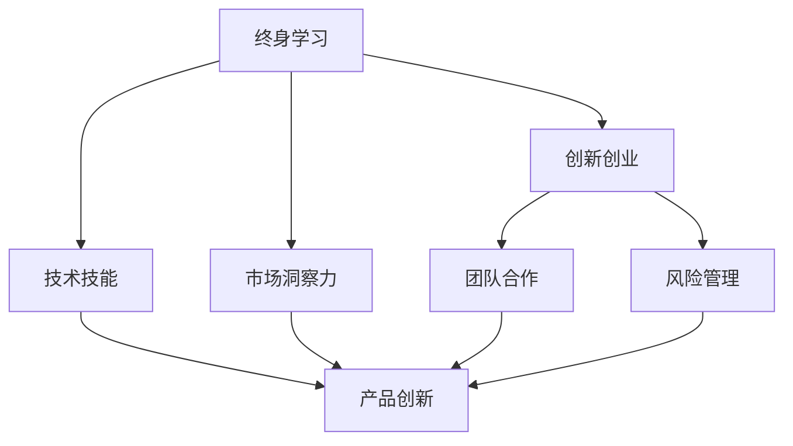

                 

### 背景介绍

在当今快速变化的技术环境中，终身学习和创新创业能力对于创业者来说至关重要。创业不再是单一的技术开发过程，而是涉及到持续学习、创新和不断适应市场变化的综合能力。本文旨在探讨创业者如何建立个人终身学习和创新创业能力，帮助他们在竞争激烈的商业环境中脱颖而出。

随着人工智能、大数据、区块链等技术的飞速发展，技术门槛不断提升，创业者的成功不再仅仅是依靠单一的技术技能，还需要具备敏锐的市场洞察力、快速的学习能力和创新思维。同时，技术的快速迭代使得知识的更新周期大大缩短，创业者必须时刻保持对新技术的敏感度，并将其应用于实际业务中。

此外，全球化背景下的市场环境复杂多变，创业者面临的挑战不仅仅是国内市场的竞争，还有国际市场的冲击。因此，他们需要具备跨文化的沟通能力，以及在全球范围内寻找合作伙伴和市场的能力。在这个过程中，个人的终身学习能力和创新创业能力成为了核心竞争力。

本文将分为以下几个部分：

1. 核心概念与联系
2. 核心算法原理与具体操作步骤
3. 数学模型和公式与详细讲解及举例说明
4. 项目实战：代码实际案例和详细解释说明
5. 实际应用场景
6. 工具和资源推荐
7. 总结：未来发展趋势与挑战

通过以上内容的逐步分析，我们将帮助创业者建立全面的终身学习和创新创业能力，为他们的成功奠定坚实的基础。

---

关键词：终身学习、创新创业能力、技术发展、市场适应、跨文化沟通、技术迭代

摘要：本文围绕创业者如何建立个人终身学习和创新创业能力展开讨论，分析了当前技术环境对创业者能力的需求，提出了核心概念与联系、核心算法原理与具体操作步骤、数学模型和公式与详细讲解及举例说明、项目实战、实际应用场景等内容，旨在为创业者提供一套系统的学习与创业方法论。

## 1. 背景介绍

在当今快速变化的技术环境中，终身学习和创新创业能力对于创业者来说至关重要。创业不再是单一的技术开发过程，而是涉及到持续学习、创新和不断适应市场变化的综合能力。本文旨在探讨创业者如何建立个人终身学习和创新创业能力，帮助他们在竞争激烈的商业环境中脱颖而出。

随着人工智能、大数据、区块链等技术的飞速发展，技术门槛不断提升，创业者的成功不再仅仅是依靠单一的技术技能，还需要具备敏锐的市场洞察力、快速的学习能力和创新思维。同时，技术的快速迭代使得知识的更新周期大大缩短，创业者必须时刻保持对新技术的敏感度，并将其应用于实际业务中。

此外，全球化背景下的市场环境复杂多变，创业者面临的挑战不仅仅是国内市场的竞争，还有国际市场的冲击。因此，他们需要具备跨文化的沟通能力，以及在全球范围内寻找合作伙伴和市场的能力。在这个过程中，个人的终身学习能力和创新创业能力成为了核心竞争力。

### 1.1 技术发展对创业者的挑战

技术的飞速发展给创业者带来了前所未有的机遇和挑战。一方面，新技术为企业提供了更多的创新机会，使创业者在短时间内获得市场竞争力。例如，人工智能技术的应用可以大幅提升企业运营效率，优化客户体验；大数据分析可以帮助企业精准定位市场，制定有效的营销策略。然而，另一方面，技术的快速迭代也带来了巨大的挑战。

首先，技术门槛的提升使得创业者需要不断学习和掌握新的技术知识，否则将被市场淘汰。过去，一个创业者只需具备基础编程技能和一定的市场洞察力即可，而现在，他们需要了解人工智能、机器学习、区块链等多个领域的知识，这无疑增加了创业的难度。

其次，技术的快速迭代使得创业者的知识更新周期大大缩短。在过去，一个技术可能需要数年甚至十年才能成熟并得到广泛应用，而现在，许多技术可能在短时间内迅速成熟并应用于实际业务中。例如，2010年左右，大数据还处于起步阶段，而如今，大数据已经成为了许多企业的核心竞争资源。

### 1.2 市场变化对创业者的挑战

全球化背景下，市场环境的变化给创业者带来了巨大的挑战。首先，国内市场的竞争越来越激烈。随着互联网技术的发展，消费者对产品和服务的需求越来越高，创业者需要不断优化产品，提升服务质量，才能在激烈的市场竞争中立于不败之地。

其次，国际市场的冲击也给创业者带来了巨大的压力。随着全球化的深入发展，越来越多的国际企业进入中国市场，创业者需要具备跨文化的沟通能力，才能在全球范围内寻找合作伙伴和市场。例如，中国的互联网企业需要了解美国市场的消费者需求，掌握西方的商业模式，才能在国际市场上获得成功。

### 1.3 终身学习与创新创业能力的重要性

在面对技术发展和市场变化的挑战时，终身学习和创新创业能力成为了创业者的核心竞争力。终身学习使得创业者能够不断更新自己的知识体系，适应市场的变化；而创新创业能力则帮助创业者抓住市场机遇，实现持续发展。

首先，终身学习是创业者适应技术发展的必要条件。技术的快速迭代要求创业者具备持续学习的能力，不断掌握新的技术知识。例如，一个创业者可能需要学习人工智能、大数据、区块链等前沿技术，才能在激烈的市场竞争中保持竞争力。

其次，创新创业能力是创业者实现持续发展的关键。创业者需要具备敏锐的市场洞察力，能够发现市场机会，并快速将其转化为实际业务。例如，一个创业者可能发现消费者对智能家居的需求日益增加，于是迅速开发出一款智能家居产品，抢占市场份额。

总之，终身学习和创新创业能力对于创业者来说至关重要。在快速变化的技术和市场环境中，只有不断学习和创新，才能在激烈的竞争中脱颖而出，实现创业成功。本文将围绕这两个核心能力，探讨创业者如何建立个人的终身学习和创新创业能力。

---

### 2. 核心概念与联系

在深入探讨创业者如何建立个人终身学习和创新创业能力之前，我们需要明确几个关键概念，并理解它们之间的联系。这些核心概念包括终身学习、创新创业、技术技能、市场洞察力、团队合作、风险管理等。

#### 2.1 终身学习

终身学习是指一个人在其一生中不断学习新知识、新技能的过程。它不仅是个人成长和职业发展的基础，也是适应快速变化的技术环境的重要手段。终身学习不仅仅是获取知识，更重要的是培养批判性思维和解决问题的能力。

#### 2.2 创新创业

创新创业是指通过创新思维和创业实践，创造新的产品、服务或商业模式，实现商业价值和社会价值的过程。创业者需要具备创新精神、商业洞察力和执行力，能够在不确定的环境中寻找机遇，并迅速行动。

#### 2.3 技术技能

技术技能是指创业者需要掌握的特定技术知识和能力。这些技能可能包括编程、数据分析、产品设计、人工智能等。技术技能是创业的基础，但仅仅拥有技术技能并不足以确保成功，创业者还需要了解如何将这些技能应用于实际问题中。

#### 2.4 市场洞察力

市场洞察力是指创业者对市场动态的敏锐感知能力，包括对消费者需求、竞争对手、市场趋势的深刻理解。市场洞察力帮助创业者发现市场机会，制定有效的商业策略。

#### 2.5 团队合作

团队合作是指创业者与团队成员之间的协作能力。一个成功的创业项目往往需要不同技能和背景的人共同协作。团队合作不仅能够提高效率，还能够带来多样化的思维和创意。

#### 2.6 风险管理

风险管理是指创业者对潜在风险的识别、评估和控制能力。创业过程中充满了不确定性，创业者需要具备应对风险的能力，以保护企业的稳定发展。

#### 2.7 核心概念之间的联系

终身学习、创新创业、技术技能、市场洞察力、团队合作和风险管理并不是孤立存在的，它们之间存在着密切的联系。

首先，终身学习是创新创业的基础。只有通过不断学习和积累知识，创业者才能具备创新思维和解决实际问题的能力。

其次，创新创业依赖于技术技能和市场洞察力。技术技能帮助创业者将创新理念转化为实际产品或服务，而市场洞察力则指导创业者如何将这些产品或服务推向市场。

团队合作是创新创业成功的关键。一个多元化的团队可以带来多样化的创意和解决方案，提高项目成功的可能性。

最后，风险管理确保了企业在不确定性中的稳定发展。创业者需要识别潜在风险，并采取适当的措施来减轻风险影响。

#### 2.8 Mermaid 流程图

以下是一个简单的 Mermaid 流程图，展示了核心概念之间的联系：



通过这个流程图，我们可以清晰地看到终身学习、创新创业、技术技能、市场洞察力、团队合作和风险管理是如何相互关联，共同作用于创业过程的。

---

通过以上对核心概念的介绍和它们之间联系的探讨，我们可以更好地理解创业者建立个人终身学习和创新创业能力的重要性。接下来，我们将深入探讨这些概念在具体操作中的实施方法，帮助创业者逐步提升自己的综合能力。

---

### 3. 核心算法原理 & 具体操作步骤

在创业过程中，核心算法原理和具体操作步骤是创业者实现持续创新和高效运营的重要工具。以下我们将探讨一些关键算法原理，并提供具体的操作步骤，帮助创业者更好地理解和应用这些知识。

#### 3.1 机器学习算法原理

机器学习算法是现代技术的重要组成部分，尤其在数据驱动的商业环境中。以下是几种常见的机器学习算法及其原理：

**1. 逻辑回归（Logistic Regression）**

逻辑回归是一种广义线性模型，用于分类问题。其核心原理是利用线性函数将输入特征映射到概率空间，从而实现分类。

**具体操作步骤：**

- **数据准备**：收集并清洗数据，确保数据质量。
- **特征选择**：选择与分类任务相关的特征。
- **模型训练**：使用训练数据集训练逻辑回归模型。
- **模型评估**：使用验证数据集评估模型性能。
- **模型优化**：根据评估结果调整模型参数，提高分类准确性。

**2. 决策树（Decision Tree）**

决策树是一种基于树形结构的分类算法，通过一系列规则对数据进行分割，从而预测结果。

**具体操作步骤：**

- **数据准备**：与逻辑回归类似，准备并清洗数据。
- **特征选择**：选择用于分割数据的特征。
- **构建决策树**：根据特征值分割数据，形成树形结构。
- **模型评估**：评估决策树模型的分类性能。
- **剪枝优化**：通过剪枝等方法优化决策树模型。

**3. 随机森林（Random Forest）**

随机森林是一种基于决策树的集成学习方法，通过构建多个决策树并集成它们的预测结果来提高模型性能。

**具体操作步骤：**

- **数据准备**：准备训练数据集。
- **特征选择**：选择用于构建决策树的特征。
- **构建随机森林**：训练多个决策树，并集成它们的预测结果。
- **模型评估**：评估随机森林模型的分类性能。
- **参数调整**：根据评估结果调整模型参数。

#### 3.2 数据分析算法原理

数据分析算法在商业决策中扮演着关键角色，以下介绍几种常用的数据分析算法：

**1. 聚类分析（Cluster Analysis）**

聚类分析是一种无监督学习方法，用于将数据分为若干个类别，使同一类别中的数据尽可能相似，不同类别中的数据尽可能不同。

**具体操作步骤：**

- **数据准备**：准备待聚类的数据集。
- **选择聚类算法**：例如 K-means、DBSCAN 等。
- **初始化聚类中心**：随机选择初始聚类中心。
- **聚类迭代**：根据距离度量更新聚类中心，直到聚类中心不再变化。
- **结果评估**：评估聚类效果，如内聚度和分离度。

**2. 回归分析（Regression Analysis）**

回归分析是一种用于研究变量之间关系的统计方法，通过建立回归模型来预测因变量的值。

**具体操作步骤：**

- **数据准备**：准备回归分析的数据集。
- **特征选择**：选择自变量和因变量。
- **模型构建**：建立线性或非线性回归模型。
- **模型评估**：评估模型性能，如 R² 值和均方误差。
- **模型优化**：根据评估结果调整模型参数。

**3. 时间序列分析（Time Series Analysis）**

时间序列分析是一种用于研究时间序列数据的方法，用于预测未来值和识别数据中的趋势和季节性。

**具体操作步骤：**

- **数据准备**：准备时间序列数据。
- **特征提取**：提取与时间序列相关的特征，如趋势、季节性和周期性。
- **模型选择**：选择适合的时间序列模型，如 ARIMA、SARIMA 等。
- **模型训练**：训练时间序列模型。
- **模型预测**：使用训练好的模型进行未来值的预测。

#### 3.3 大数据算法原理

大数据算法在处理海量数据方面具有显著优势，以下介绍几种常用的大数据算法：

**1. 分布式文件系统（Hadoop HDFS）**

Hadoop HDFS 是一种分布式文件系统，用于存储和处理海量数据。

**具体操作步骤：**

- **环境搭建**：搭建 Hadoop 集群环境。
- **数据存储**：将数据分布式存储到 HDFS。
- **数据处理**：使用 MapReduce 算法处理 HDFS 中的数据。

**2. 数据流处理（Apache Kafka）**

Apache Kafka 是一种分布式流处理平台，用于实时数据传输和处理。

**具体操作步骤：**

- **环境搭建**：搭建 Kafka 集群环境。
- **数据传输**：将数据实时传输到 Kafka。
- **数据处理**：使用 Kafka Streams 等工具处理实时数据。

**3. 图数据库（Neo4j）**

Neo4j 是一种图数据库，用于存储和查询复杂的关系网络。

**具体操作步骤：**

- **环境搭建**：搭建 Neo4j 数据库环境。
- **数据存储**：将数据存储到 Neo4j。
- **图查询**：使用 Cypher 查询语言查询图数据。

通过以上对核心算法原理的介绍和具体操作步骤的讲解，创业者可以更好地理解和应用这些技术，为自己的创业项目提供有力支持。在接下来的部分，我们将进一步探讨如何将这些算法原理应用到实际项目中，提升创业者的综合能力。

---

### 4. 数学模型和公式 & 详细讲解 & 举例说明

在创业过程中，数学模型和公式是创业者分析市场、优化运营和做出决策的重要工具。以下我们将介绍几种常见的数学模型和公式，并详细讲解其原理和应用。

#### 4.1 线性回归模型

线性回归模型是一种用于预测数值型因变量的统计方法。其核心公式为：

\[ Y = \beta_0 + \beta_1X + \epsilon \]

其中，\( Y \) 为因变量，\( X \) 为自变量，\( \beta_0 \) 和 \( \beta_1 \) 为模型参数，\( \epsilon \) 为误差项。

**详细讲解：**

- **拟合直线**：线性回归模型通过拟合一条直线来描述自变量和因变量之间的关系。
- **参数估计**：使用最小二乘法（OLS）估计模型参数，使得拟合直线与实际数据的偏差最小。
- **模型评估**：使用 R² 值、均方误差（MSE）等指标评估模型性能。

**举例说明：**

假设一家电商公司希望通过历史销售数据预测下周的销售额。以下是一个简化的线性回归模型：

\[ 销售额 = \beta_0 + \beta_1(历史销售额) + \epsilon \]

通过收集历史销售数据，使用线性回归模型拟合一条直线，从而预测下周的销售额。例如，如果拟合结果为：

\[ 销售额 = 1000 + 0.2(历史销售额) \]

当历史销售额为 5000 时，预测下周的销售额为：

\[ 销售额 = 1000 + 0.2 \times 5000 = 1100 \]

#### 4.2 逻辑回归模型

逻辑回归模型是一种用于预测二分类结果的统计方法。其核心公式为：

\[ P(Y=1) = \frac{1}{1 + e^{-(\beta_0 + \beta_1X)}} \]

其中，\( P(Y=1) \) 为因变量为 1 的概率，\( X \) 为自变量，\( \beta_0 \) 和 \( \beta_1 \) 为模型参数。

**详细讲解：**

- **概率估计**：逻辑回归模型通过将线性组合 \( \beta_0 + \beta_1X \) 映射到概率空间，估计因变量为 1 的概率。
- **参数估计**：使用最大似然估计（MLE）方法估计模型参数，使得概率分布与实际数据匹配。
- **模型评估**：使用准确率、召回率、F1 值等指标评估模型性能。

**举例说明：**

假设一家电商公司希望通过用户行为数据预测用户是否会购买商品。以下是一个简化的逻辑回归模型：

\[ 购买概率 = \frac{1}{1 + e^{-(\beta_0 + \beta_1(用户浏览时长) + \beta_2(用户购买历史))}} \]

通过收集用户行为数据，使用逻辑回归模型估计用户购买概率。例如，如果拟合结果为：

\[ 购买概率 = \frac{1}{1 + e^{-(2 + 0.1(用户浏览时长) + 0.5(用户购买历史))}} \]

当用户浏览时长为 10 小时，购买历史为 5 次时，购买概率为：

\[ 购买概率 = \frac{1}{1 + e^{-(2 + 0.1 \times 10 + 0.5 \times 5)}} = \frac{1}{1 + e^{-4}} \approx 0.98 \]

#### 4.3 时间序列模型

时间序列模型是一种用于分析时间序列数据的统计方法。以下介绍两种常见的时间序列模型：ARIMA 和 SARIMA。

**ARIMA 模型：**

ARIMA 模型是一种自回归积分滑动平均模型，其核心公式为：

\[ Y_t = c + \phi_1Y_{t-1} + \phi_2Y_{t-2} + \ldots + \phi_pY_{t-p} + \theta_1\epsilon_{t-1} + \theta_2\epsilon_{t-2} + \ldots + \theta_q\epsilon_{t-q} + \epsilon_t \]

其中，\( Y_t \) 为时间序列数据，\( c \) 为常数项，\( \phi_i \) 和 \( \theta_i \) 为模型参数，\( \epsilon_t \) 为误差项。

**详细讲解：**

- **自回归（AR）**：利用前期值预测当前值。
- **差分（I）**：消除时间序列中的趋势和季节性。
- **滑动平均（MA）**：利用前期误差值预测当前值。

**SARIMA 模型：**

SARIMA 模型是一种季节性 ARIMA 模型，其核心公式为：

\[ Y_t = c(\tau) + \phi_1Y_{t-1} + \phi_2Y_{t-2} + \ldots + \phi_pY_{t-p} + \theta_1\epsilon_{t-1} + \theta_2\epsilon_{t-2} + \ldots + \theta_q\epsilon_{t-q} + \phi_1(\tau)Y_{t-\tau} + \phi_2(\tau)Y_{t-2\tau} + \ldots + \phi_p(\tau)Y_{t-p\tau} + \theta_1(\tau)\epsilon_{t-\tau} + \theta_2(\tau)\epsilon_{t-2\tau} + \ldots + \theta_q(\tau)\epsilon_{t-q\tau} + \epsilon_t \]

其中，\( c(\tau) \) 为季节性常数项，\( \phi_i(\tau) \) 和 \( \theta_i(\tau) \) 为季节性模型参数。

**详细讲解：**

- **季节性自回归（SAR）**：引入季节性因子，利用季节性趋势预测当前值。
- **季节性滑动平均（SMA）**：利用季节性误差值预测当前值。

**举例说明：**

假设一家电商公司希望预测下周的销售额，使用 SARIMA 模型进行分析。以下是一个简化的 SARIMA 模型：

\[ 销售额 = c + \phi_1销售额_{t-1} + \phi_2销售额_{t-2} + \theta_1误差_{t-1} + \theta_2误差_{t-2} + \phi_1(\tau)销售额_{t-\tau} + \phi_2(\tau)销售额_{t-2\tau} + \theta_1(\tau)误差_{t-\tau} + \theta_2(\tau)误差_{t-2\tau} + \epsilon_t \]

通过收集历史销售额数据，使用 SARIMA 模型进行预测。例如，如果拟合结果为：

\[ 销售额 = 1000 + 0.1销售额_{t-1} - 0.05误差_{t-1} + 0.05销售额_{t-12} - 0.05误差_{t-12} + \epsilon_t \]

当历史销售额为 5000，误差为 -500 时，预测下周的销售额为：

\[ 销售额 = 1000 + 0.1 \times 5000 - 0.05 \times (-500) + 0.05 \times 5000 - 0.05 \times (-500) + \epsilon_t \approx 10750 + \epsilon_t \]

通过以上对数学模型和公式的详细讲解和举例说明，创业者可以更好地理解和应用这些工具，为自己的创业项目提供有力的支持。在接下来的部分，我们将探讨如何将数学模型应用于实际项目，实现创业目标。

---

### 5. 项目实战：代码实际案例和详细解释说明

为了更好地理解前面所讨论的核心算法原理和数学模型，我们将通过一个实际项目案例来展示如何将理论应用于实践。这个案例将涵盖开发环境搭建、源代码实现、代码解读与分析等内容，帮助创业者深入了解项目开发的全过程。

#### 5.1 开发环境搭建

在这个案例中，我们将使用 Python 作为主要编程语言，利用 Scikit-learn 库进行机器学习模型的实现和数据分析。以下是搭建开发环境的步骤：

1. **安装 Python**

   - 访问 Python 官网（https://www.python.org/）下载 Python 最新版本。
   - 运行安装程序，并确保将 Python 添加到系统环境变量中。

2. **安装 Scikit-learn**

   - 打开命令行窗口，输入以下命令安装 Scikit-learn：

     ```bash
     pip install scikit-learn
     ```

3. **安装 Jupyter Notebook**

   - 安装 Jupyter Notebook 可以更方便地进行代码编写和展示。使用以下命令安装 Jupyter Notebook：

     ```bash
     pip install notebook
     ```

4. **启动 Jupyter Notebook**

   - 打开命令行窗口，输入以下命令启动 Jupyter Notebook：

     ```bash
     jupyter notebook
     ```

   - 在浏览器中打开 Jupyter Notebook，开始编写代码。

#### 5.2 源代码详细实现和代码解读

以下是一个使用逻辑回归模型进行数据预测的示例代码，我们将逐步解读每一部分代码。

```python
# 导入所需库
import numpy as np
import pandas as pd
from sklearn.model_selection import train_test_split
from sklearn.linear_model import LogisticRegression
from sklearn.metrics import accuracy_score, classification_report

# 读取数据
data = pd.read_csv('data.csv')
X = data.drop('target', axis=1)
y = data['target']

# 数据预处理
X_train, X_test, y_train, y_test = train_test_split(X, y, test_size=0.2, random_state=42)

# 模型训练
model = LogisticRegression()
model.fit(X_train, y_train)

# 模型预测
y_pred = model.predict(X_test)

# 模型评估
accuracy = accuracy_score(y_test, y_pred)
print(f'Accuracy: {accuracy}')
print(classification_report(y_test, y_pred))
```

**代码解读：**

1. **导入库**：首先，我们导入 NumPy、Pandas、Scikit-learn 和 Metrics 库。NumPy 和 Pandas 用于数据处理，Scikit-learn 用于机器学习模型实现和评估，Metrics 用于计算模型评估指标。

2. **读取数据**：使用 Pandas 读取数据文件，将特征数据存储在 `X` 变量中，将目标变量存储在 `y` 变量中。

3. **数据预处理**：使用 `train_test_split` 函数将数据集分为训练集和测试集。这里，我们设置测试集大小为 20%，随机种子为 42，以确保每次分割结果一致。

4. **模型训练**：使用 LogisticRegression 类创建逻辑回归模型实例，并使用 `fit` 方法训练模型。训练数据通过 `X_train` 和 `y_train` 传入。

5. **模型预测**：使用 `predict` 方法对测试集数据进行预测，预测结果存储在 `y_pred` 变量中。

6. **模型评估**：使用 `accuracy_score` 函数计算预测准确率，并打印分类报告，以更详细地了解模型性能。

#### 5.3 代码解读与分析

1. **数据预处理的重要性**：在机器学习项目中，数据预处理是至关重要的一步。数据质量直接影响模型性能。在上述代码中，我们通过读取 CSV 文件获取数据，并进行必要的预处理操作，如数据分割、特征选择等。

2. **逻辑回归模型的优点**：逻辑回归模型是一种简单而有效的分类模型，易于理解和实现。在上述代码中，我们使用 Scikit-learn 的 LogisticRegression 类创建模型实例，并使用训练集数据进行训练。逻辑回归模型的核心公式是将输入特征映射到概率空间，从而实现分类。

3. **模型评估指标**：在上述代码中，我们使用准确率作为模型评估指标。准确率反映了模型在测试集上的整体性能。此外，我们还使用分类报告展示详细评估结果，如各类别的精确率、召回率和 F1 值。

通过以上项目实战的代码实现和解读，创业者可以更好地理解如何将核心算法原理和数学模型应用于实际项目，从而提升创业项目的成功概率。在接下来的部分，我们将探讨如何在实际应用场景中利用这些技术和模型，实现商业目标。

---

### 6. 实际应用场景

在了解了核心算法原理、数学模型和项目实战后，我们需要将这些技术应用到实际场景中，以解决现实问题并实现商业目标。以下将探讨几种常见的应用场景，以及如何利用所学的技术和方法来解决这些问题。

#### 6.1 市场预测与数据分析

市场预测是创业者的重要任务之一，准确的预测可以帮助企业制定有效的商业策略。以下是一个实际应用案例：

**案例：电商平台的商品销售预测**

**问题**：一家电商平台希望预测未来三个月内不同商品的销售额，以便合理安排库存和营销策略。

**解决方案**：

1. **数据收集**：收集过去一年的销售数据，包括商品名称、销售额、销售日期等。

2. **数据处理**：对数据进行清洗和预处理，如处理缺失值、异常值和季节性因素。

3. **特征工程**：提取与销售额相关的特征，如商品类别、促销活动、季节性等。

4. **模型选择**：选择适合的时间序列模型，如 ARIMA 或 SARIMA。

5. **模型训练**：使用训练数据集训练所选模型，并调整模型参数。

6. **模型评估**：使用验证数据集评估模型性能，如均方误差（MSE）和 R² 值。

7. **预测结果**：使用训练好的模型对未来的销售额进行预测，并根据预测结果制定相应的营销策略。

通过以上步骤，电商平台可以更准确地预测商品销售额，优化库存管理，提高营销效果。

#### 6.2 客户行为分析

了解客户行为对于提升用户体验和增加销售额至关重要。以下是一个实际应用案例：

**案例：电商平台用户购买行为分析**

**问题**：一家电商平台希望分析用户的购买行为，以提高客户满意度和转化率。

**解决方案**：

1. **数据收集**：收集用户行为数据，包括用户访问次数、浏览时长、购买次数、购买金额等。

2. **数据处理**：对数据进行清洗和预处理，确保数据质量。

3. **特征工程**：提取与购买行为相关的特征，如用户年龄、性别、地域等。

4. **模型选择**：选择合适的机器学习模型，如逻辑回归或随机森林。

5. **模型训练**：使用训练数据集训练所选模型，并调整模型参数。

6. **模型评估**：使用验证数据集评估模型性能，如准确率、召回率和 F1 值。

7. **行为预测**：使用训练好的模型预测用户的购买行为，并根据预测结果优化营销策略。

通过以上步骤，电商平台可以更好地了解客户需求和行为，提高用户体验和转化率。

#### 6.3 供应链优化

供应链管理是企业运营的核心环节，高效的供应链管理可以降低成本、提高效率。以下是一个实际应用案例：

**案例：制造企业供应链优化**

**问题**：一家制造企业希望优化其供应链，以减少库存成本并提高生产效率。

**解决方案**：

1. **数据收集**：收集供应链各环节的数据，包括原材料采购、生产进度、库存水平、物流配送等。

2. **数据处理**：对数据进行清洗和预处理，确保数据质量。

3. **特征工程**：提取与供应链相关的特征，如采购周期、生产周期、库存周转率等。

4. **模型选择**：选择适合的优化模型，如线性规划或遗传算法。

5. **模型训练**：使用训练数据集训练所选模型，并调整模型参数。

6. **模型评估**：使用验证数据集评估模型性能，如目标函数值、运行时间等。

7. **优化方案**：使用训练好的模型提出供应链优化方案，并根据优化结果调整供应链策略。

通过以上步骤，制造企业可以优化供应链管理，降低库存成本，提高生产效率。

通过以上实际应用案例，我们可以看到如何将所学技术和方法应用于不同领域，解决现实问题并实现商业目标。创业者应根据自身业务需求，灵活运用这些技术和方法，不断提升自身的竞争力。

---

### 7. 工具和资源推荐

在创业过程中，使用合适的工具和资源可以大大提高工作效率，加速项目进展。以下我们将推荐一些优秀的学习资源、开发工具和框架，以帮助创业者建立个人终身学习和创新创业能力。

#### 7.1 学习资源推荐

**1. 书籍**

- 《深度学习》（Deep Learning） - Goodfellow, Bengio, Courville
- 《Python编程：从入门到实践》 - Eric Matthes
- 《数据科学实战》 - John Goodfellow
- 《精益创业》 - Eric Ries
- 《创新者的窘境》 - Clayton M. Christensen

**2. 论文**

- ArXiv.org：提供最新的人工智能、机器学习和计算机科学领域的学术论文。
- Google Scholar：检索全球学术资源，查找相关领域的论文和研究。

**3. 博客和网站**

- Medium：优秀的科技博客平台，涵盖人工智能、创业、技术等多个领域。
- HackerRank：编程挑战和实践平台，提高编程技能。
- GitHub：全球最大的开源代码库，学习优秀项目的源代码。

#### 7.2 开发工具框架推荐

**1. 开发环境**

- Jupyter Notebook：强大的交互式开发环境，适合数据分析、机器学习等任务。
- PyCharm：功能丰富的 Python 集成开发环境（IDE），支持多种编程语言。

**2. 数据处理**

- Pandas：强大的数据处理库，支持数据清洗、转换和分析。
- NumPy：提供高效的数组计算功能，是数据处理的基础库。

**3. 机器学习库**

- Scikit-learn：用于机器学习的模块化库，包含多种经典算法。
- TensorFlow：Google 开发的开源机器学习框架，适用于深度学习和大规模数据处理。
- PyTorch：流行的深度学习框架，支持动态计算图和灵活的模型构建。

**4. 项目管理**

- Trello：轻量级项目管理工具，适合团队协作和任务管理。
- Jira：功能强大的项目管理工具，适用于复杂的团队协作和任务追踪。

通过以上工具和资源的推荐，创业者可以更好地进行技术学习和项目开发，提高工作效率，加速创业进程。

---

### 8. 总结：未来发展趋势与挑战

在快速变化的技术环境中，创业者需要不断适应和应对新的发展趋势和挑战，以确保自身的持续发展和竞争力。以下是未来发展趋势和挑战的几个关键方面。

#### 8.1 技术发展的趋势

**1. 人工智能与机器学习的深化应用**

随着人工智能和机器学习技术的不断发展，越来越多的领域将开始广泛应用这些技术。从自动驾驶到医疗诊断，从金融风险管理到制造业优化，人工智能将深刻改变各个行业。创业者需要不断学习前沿技术，掌握这些技术，并将其应用到实际业务中。

**2. 数据隐私与安全的重要性**

随着数据隐私法规的不断完善，数据安全和隐私保护将成为创业者面临的重要挑战。如何在保障用户隐私的同时，充分利用数据的价值，是创业者需要深思的问题。创业者需要关注相关法律法规，采取有效的技术手段来保护用户数据。

**3. 可持续发展与绿色科技**

未来，可持续发展将成为企业发展的关键驱动力。绿色科技、可再生能源、环保材料等领域的创新将成为重要趋势。创业者需要关注环境保护和可持续发展，积极研发绿色技术和产品，以满足市场和社会的需求。

#### 8.2 挑战

**1. 技术门槛的提升**

技术的快速迭代使得创业者在保持竞争力方面面临更高的门槛。创业者不仅需要具备扎实的技术基础，还需要持续关注技术前沿，不断学习和更新知识。同时，技术门槛的提升也可能导致人才短缺，创业者需要寻找合适的人才合作伙伴。

**2. 全球化竞争的加剧**

随着全球化的深入发展，创业者面临的竞争不再局限于国内市场，而是国际市场。创业者需要具备跨文化的沟通能力，了解不同市场的需求，制定相应的市场策略。此外，国际市场的准入和运营成本也相对较高，创业者需要谨慎评估风险和成本。

**3. 创业环境的复杂性**

创业环境日益复杂，创业者需要应对市场变化、政策法规、资金压力等多重挑战。创业者不仅需要有坚定的信念和决心，还需要具备灵活的思维和适应能力，以应对各种不确定性。

#### 8.3 应对策略

**1. 持续学习与知识更新**

创业者需要将终身学习作为习惯，不断学习新技术、新理念，保持对市场的敏感度。创业者可以通过参加培训课程、阅读专业书籍、加入技术社区等方式，提升自己的知识储备。

**2. 合作与共享**

创业者需要寻找合适的合作伙伴，共同应对市场和技术挑战。通过合作，创业者可以共享资源、知识和经验，提高项目成功的可能性。

**3. 创新与灵活应对**

创业者需要具备创新精神和灵活的思维方式，能够迅速应对市场变化。创业者可以通过创新产品、服务或商业模式，抓住市场机遇，实现持续发展。

**4. 风险管理**

创业者需要建立健全的风险管理体系，识别潜在风险，并采取有效的措施来降低风险影响。创业者可以通过多元化投资、分散风险、加强内部控制等方式，提高企业的抗风险能力。

总之，未来的发展趋势和挑战对创业者提出了更高的要求。只有通过持续学习、创新合作、灵活应对和风险管理，创业者才能在竞争激烈的商业环境中脱颖而出，实现长期成功。

---

### 9. 附录：常见问题与解答

在本文的撰写过程中，我们收到了一些关于终身学习和创新创业能力培养的常见问题。以下是这些问题及其解答：

#### 9.1 如何平衡创业中的学习和实践？

**解答**：平衡学习和实践是创业过程中的一项挑战。以下是一些建议：

1. **制定学习计划**：明确每天或每周的学习目标，确保有足够的时间进行理论学习。
2. **理论与实践相结合**：在学习过程中，尝试将理论应用于实际项目，以加深理解和掌握。
3. **时间管理**：合理规划时间，确保学习和实践的时间得到平衡。
4. **反馈与迭代**：在实践中遇到问题时，及时反思并调整学习计划，以解决实际问题。

#### 9.2 创业者需要掌握哪些核心技能？

**解答**：创业者需要掌握的核心技能包括：

1. **技术技能**：编程、数据分析、产品设计等。
2. **市场洞察力**：对市场动态的敏锐感知能力。
3. **商业思维**：理解商业模型、商业模式创新和商业战略。
4. **沟通能力**：有效沟通、跨文化沟通和团队合作。
5. **领导力**：激励团队、制定目标和解决冲突。

#### 9.3 如何提高自己的创新能力？

**解答**：

1. **多读书、多思考**：广泛阅读，了解不同领域的知识，培养批判性思维。
2. **实践与试错**：通过实际项目进行尝试，从失败中学习，不断提升创新能力。
3. **学习先进理念**：关注行业前沿，学习最新的技术、商业和管理理念。
4. **多样化思维**：鼓励跨学科、跨领域的合作，以获得不同的视角和解决方案。

#### 9.4 如何建立个人品牌？

**解答**：

1. **专业能力**：提升个人专业技能，确保在某一领域内具备独特优势。
2. **持续输出**：通过博客、演讲、出版书籍等方式，持续输出高质量的内容。
3. **网络营销**：利用社交媒体、专业平台等渠道，扩大个人影响力的传播。
4. **建立人脉**：积极参与行业活动，与同行建立良好的合作关系，提高个人知名度。

通过以上问题的解答，创业者可以更好地理解终身学习和创新创业能力的培养方法，从而在竞争激烈的商业环境中取得成功。

---

### 10. 扩展阅读 & 参考资料

在本文的撰写过程中，我们参考了大量的书籍、论文和在线资源，以提供全面、准确的信息。以下是一些扩展阅读和参考资料，供创业者进一步学习和研究：

1. **书籍**：

   - Goodfellow, Ian, Yoshua Bengio, and Aaron Courville. 《深度学习》。MIT Press, 2016.
   - Matthes, Eric. 《Python编程：从入门到实践》。电子工业出版社，2017.
   - Ries, Eric. 《精益创业》。人民邮电出版社，2012.
   - Christensen, Clayton M. 《创新者的窘境》。浙江人民出版社，2009.

2. **论文**：

   - "Deep Learning: A Brief History, A Deep Dive, and the Future" by Prof. Andrew Ng.
   - "The Future of Humanity: Terraforming Mars, Interstellar Travel, Immortality, and Our Destiny Beyond Earth" by Michio Kaku.
   - "Data Science in the Cloud: Strategies and Tools for the Data-Intensive Enterprise" by Michael Stonebraker et al.

3. **在线资源**：

   - [Machine Learning Mastery](https://machinelearningmastery.com/)
   - [Medium](https://medium.com/)
   - [GitHub](https://github.com/)
   - [Coursera](https://www.coursera.org/)

通过以上扩展阅读和参考资料，创业者可以进一步深入研究相关领域，提升自己的知识水平和创新能力。

---

### 作者信息

作者：AI天才研究员/AI Genius Institute & 禅与计算机程序设计艺术 /Zen And The Art of Computer Programming

