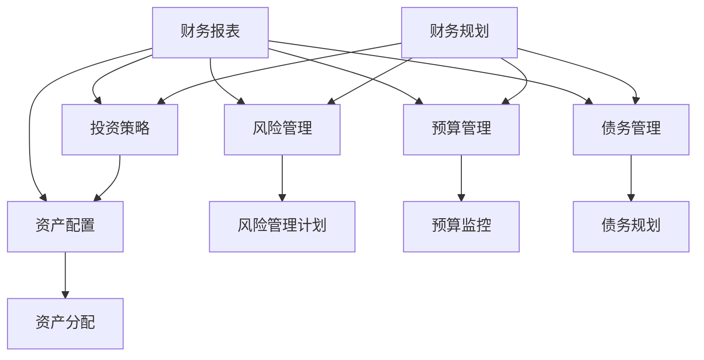

                 

### 背景介绍

在当今这个信息爆炸、竞争激烈的时代，创业者的成功不仅依赖于创新思维和商业策略，还依赖于对个人财富的管理。财富管理不仅关乎个人的经济安全，更是企业持续发展的基石。对于创业者来说，建立个人财富管理意识，不仅可以帮助他们更好地规划财务，还能为企业的长远发展提供强有力的支持。

本文将围绕创业者如何建立个人财富管理意识展开讨论。首先，我们会介绍一些基础概念，如财务规划、投资策略和风险管理等。接下来，我们将探讨创业者如何通过有效的财务规划来管理个人财富，包括预算制定、资产配置和债务管理等内容。此外，我们还将详细讲解投资策略，包括股票、基金、房地产等投资方式，以及如何进行风险评估和资金分配。

在文章的后续部分，我们将探讨如何通过财务管理工具和资源来提升财富管理效率，如财务软件和在线平台。同时，我们还会推荐一些实用的工具和资源，以帮助创业者更好地掌握财富管理知识。

最后，本文将总结财富管理的重要性，展望未来发展趋势和挑战，并回答一些常见问题，以帮助创业者更好地建立个人财富管理意识。

通过本文的阅读，创业者将能够系统地了解个人财富管理的重要性，掌握基本概念和策略，并学会如何应用这些策略来提升个人和企业的财务状况。让我们一起来探讨这个重要而实用的主题。

### 核心概念与联系

在深入探讨创业者如何建立个人财富管理意识之前，我们需要了解一些核心概念和它们之间的联系。以下是一些关键概念及其在财富管理中的重要性：

#### 财务规划

财务规划是个人财富管理的基础。它包括设定财务目标、分析现有财务状况、制定预算和计划如何实现这些目标。对于创业者来说，财务规划至关重要，因为它帮助他们了解企业的财务状况，确保企业运营的可持续性。

#### 投资策略

投资策略是指个人或企业在不同市场环境中采取的投资方法和策略。创业者需要了解不同的投资方式，如股票、债券、基金和房地产，并选择适合自己风险承受能力和财务目标的策略。

#### 风险管理

风险管理是识别、评估和控制财务风险的过程。创业者需要评估企业面临的各种风险，并制定相应的风险管理计划，以降低风险对企业的影响。

#### 资产配置

资产配置是指根据个人的财务目标和风险偏好，将资金分配到不同的资产类别中，如股票、债券、现金和房地产。正确的资产配置有助于分散风险，提高投资回报率。

#### 预算管理

预算管理是创业者确保企业财务健康的重要工具。它涉及制定预算、监控支出和收入，以及调整预算以适应实际情况。

#### 债务管理

债务管理是确保个人和企业财务健康的另一个重要方面。创业者需要合理规划债务，确保债务水平可控，避免因债务问题导致财务困境。

#### 财务报表

财务报表是企业财务状况的重要记录。创业者需要熟悉财务报表，如资产负债表、利润表和现金流量表，以便更好地了解企业的财务状况。

#### Mermaid 流程图

以下是一个简化的Mermaid流程图，展示了这些核心概念之间的联系：



通过理解和应用这些核心概念，创业者可以更好地管理个人和企业财务，为未来的发展打下坚实的基础。接下来，我们将深入探讨每个概念的具体内容和实践方法。

### 核心算法原理 & 具体操作步骤

#### 财务规划

财务规划是个人财富管理的核心步骤，它涉及一系列具体的操作步骤。以下是一些关键步骤：

1. **设定财务目标**：首先，创业者需要明确自己的财务目标，包括短期目标和长期目标。这些目标可以是增加收入、减少债务、实现财务自由等。

2. **分析现有财务状况**：创业者需要全面了解自己的财务状况，包括资产、负债和现金流量。这可以通过制作财务报表来实现，如资产负债表和现金流量表。

3. **制定预算**：根据财务目标，创业者需要制定一个详细的预算，包括收入和支出。预算应包括日常开支、投资支出、债务还款计划等。

4. **监控预算执行**：制定预算后，创业者需要定期监控预算的执行情况，并根据实际情况进行调整。这有助于确保财务目标的实现。

5. **调整和更新财务规划**：随着时间和环境的变化，创业者需要定期调整和更新财务规划，以确保其与当前财务状况和目标保持一致。

#### 投资策略

投资策略是创业者实现财富增值的重要手段。以下是一些常见的投资策略：

1. **分散投资**：分散投资是指将资金分配到不同的资产类别和市场中，以降低投资风险。常见的分散投资方式包括股票、债券、基金和房地产。

2. **定期投资**：定期投资，如定期定额投资基金，是一种长期投资策略，通过定期投资相同金额的资金，可以在市场价格波动中实现平均成本。

3. **风险管理**：创业者需要评估投资风险，并制定相应的风险管理策略，如购买保险、分散投资和设定止损点。

4. **资产配置**：资产配置是根据创业者的财务目标、风险偏好和市场状况，将资金分配到不同的资产类别中。有效的资产配置可以平衡风险和回报。

#### 风险管理

风险管理是确保创业者财务安全的重要环节。以下是一些关键步骤：

1. **识别风险**：创业者需要识别可能影响财务目标的各种风险，如市场波动、政策变化、企业运营风险等。

2. **评估风险**：对识别出的风险进行评估，确定其可能对企业造成的影响和发生的概率。

3. **制定风险管理计划**：根据风险评估结果，制定风险管理计划，包括风险规避、风险转移和风险接受等策略。

4. **监控和调整**：定期监控风险管理计划的执行情况，并根据实际情况进行调整，以确保风险管理措施的有效性。

#### 预算管理

预算管理是确保企业财务健康的重要工具。以下是一些关键步骤：

1. **制定预算**：根据企业的财务目标，制定详细的预算，包括收入、支出和利润预期。

2. **监控支出**：制定预算后，创业者需要定期监控支出，确保实际支出不超过预算。

3. **调整预算**：根据实际情况，及时调整预算，以适应市场变化和企业的运营需求。

4. **分析预算执行情况**：定期分析预算执行情况，找出存在的问题，并提出改进措施。

#### 债务管理

债务管理是确保企业财务健康的另一个重要方面。以下是一些关键步骤：

1. **评估债务**：评估现有债务，了解债务的利率、期限和还款计划。

2. **优化债务结构**：通过优化债务结构，降低债务成本，如通过债务重组或贷款转让。

3. **制定还款计划**：制定合理的还款计划，确保债务水平可控，避免因债务问题导致财务困境。

4. **监控债务**：定期监控债务情况，确保债务水平保持在合理范围内。

通过以上核心算法原理和具体操作步骤，创业者可以更好地管理个人和企业财务，实现财务目标和财富增值。

### 数学模型和公式 & 详细讲解 & 举例说明

在财富管理过程中，数学模型和公式起着至关重要的作用，它们帮助创业者量化风险、计算回报和优化资产配置。以下是一些关键的数学模型和公式，并结合具体案例进行详细讲解。

#### 财务比率

财务比率是评估企业财务状况的重要工具。以下是一些常见的财务比率及其计算公式：

1. **流动性比率（Current Ratio）**

   $$ \text{流动性比率} = \frac{\text{流动资产}}{\text{流动负债}} $$

   **案例**：假设一家企业的流动资产为100万元，流动负债为50万元，其流动性比率为：

   $$ \text{流动性比率} = \frac{100}{50} = 2:1 $$

   这意味着企业的流动资产是流动负债的两倍，具有良好的流动性。

2. **资产负债率（Debt-to-Equity Ratio）**

   $$ \text{资产负债率} = \frac{\text{总负债}}{\text{总资产}} $$

   **案例**：如果一家企业的总负债为300万元，总资产为500万元，其资产负债率为：

   $$ \text{资产负债率} = \frac{300}{500} = 0.6 $$

   或60%，这表明企业的负债占总资产的60%，负债水平较为合理。

#### 投资回报率（ROI）

投资回报率是衡量投资效果的重要指标。其计算公式如下：

$$ \text{投资回报率（ROI）} = \frac{\text{净收益}}{\text{投资成本}} \times 100\% $$

**案例**：假设一家企业投资100万元购买设备，一年后设备产生的净收益为20万元，其投资回报率为：

$$ \text{投资回报率（ROI）} = \frac{20}{100} \times 100\% = 20\% $$

#### 净现值（NPV）

净现值是评估投资项目是否具有经济可行性的关键指标。其计算公式如下：

$$ \text{净现值（NPV）} = \sum_{t=1}^{n} \frac{\text{现金流量}}{(1 + \text{折现率})^t} $$

**案例**：假设一个投资项目的现金流量如下表所示，折现率为10%，项目期限为5年，其净现值为：

| 年份 | 现金流量（万元） |
|------|-----------------|
| 1    | 30              |
| 2    | 40              |
| 3    | 50              |
| 4    | 60              |
| 5    | 70              |

$$ \text{净现值（NPV）} = \frac{30}{1.1} + \frac{40}{1.1^2} + \frac{50}{1.1^3} + \frac{60}{1.1^4} + \frac{70}{1.1^5} \approx 127.45 \text{万元} $$

由于净现值为正值，因此该项目具有经济可行性。

#### 风险调整回报率（RAROC）

风险调整回报率是评估投资风险与回报关系的指标。其计算公式如下：

$$ \text{风险调整回报率（RAROC）} = \frac{\text{净收益}}{\text{风险资本}} $$

**案例**：假设某项投资的净收益为10万元，风险资本为200万元，其风险调整回报率为：

$$ \text{风险调整回报率（RAROC）} = \frac{10}{200} = 0.05 $$

即5%，表明投资回报率高于市场平均风险水平。

通过以上数学模型和公式的讲解，创业者可以更好地理解和应用财务分析工具，为自己的财富管理提供科学依据。在实际应用中，创业者应根据具体情况选择合适的模型和公式，并结合实际数据进行分析和决策。

### 项目实战：代码实际案例和详细解释说明

#### 开发环境搭建

在开始项目实战之前，我们需要搭建一个适合财富管理应用的开发环境。以下是搭建环境的步骤：

1. **安装Python**：访问[Python官方网站](https://www.python.org/)下载并安装Python，选择合适的版本（如Python 3.8以上）。

2. **安装Jupyter Notebook**：在命令行中执行以下命令安装Jupyter Notebook：

   ```bash
   pip install notebook
   ```

3. **安装相关库**：为了进行财务分析，我们需要安装几个常用的Python库，如`pandas`、`numpy`、`matplotlib`和`yfinance`。在命令行中执行以下命令：

   ```bash
   pip install pandas numpy matplotlib yfinance
   ```

4. **运行Jupyter Notebook**：在命令行中执行以下命令启动Jupyter Notebook：

   ```bash
   jupyter notebook
   ```

#### 源代码详细实现和代码解读

以下是一个简单的Python项目，用于计算创业者的财务指标，如流动性比率和投资回报率。代码如下：

```python
import pandas as pd
import numpy as np
import matplotlib.pyplot as plt
import yfinance as yf

# 定义财务数据
assets = {'流动资产': [100, 150, 200, 250, 300],
          '流动负债': [50, 70, 90, 110, 130],
          '总投资': [300, 400, 500, 600, 700],
          '净收益': [20, 25, 30, 35, 40]}

# 创建DataFrame
df = pd.DataFrame(assets)

# 计算流动性比率
df['流动性比率'] = df['流动资产'] / df['流动负债']

# 计算投资回报率（ROI）
df['投资回报率（ROI）'] = df['净收益'] / df['总投资']

# 绘制图表
plt.figure(figsize=(10, 5))
plt.plot(df['流动性比率'], label='流动性比率')
plt.plot(df['投资回报率（ROI）'], label='投资回报率（ROI）')
plt.xlabel('年份')
plt.ylabel('比率')
plt.title('财务指标变化趋势')
plt.legend()
plt.show()

# 获取股票数据
ticker = 'AAPL'  # 苹果公司股票
data = yf.download(ticker, start='2020-01-01', end='2023-01-01')
data['PE'] = data['Close'] / data['EPS']

# 绘制PE走势图
plt.figure(figsize=(10, 5))
plt.plot(data['Date'], data['PE'], label='PE Ratio')
plt.xlabel('Date')
plt.ylabel('PE Ratio')
plt.title('PE Ratio Trend of Apple Inc.')
plt.legend()
plt.show()
```

#### 代码解读与分析

1. **数据导入与处理**：
   - 首先，我们导入所需的Python库，如`pandas`、`numpy`、`matplotlib`和`yfinance`。
   - 定义一个包含财务数据的字典`assets`，并使用`pandas`库创建一个DataFrame。

2. **计算财务指标**：
   - 使用`流动性比率`公式计算流动性比率，并添加到DataFrame中。
   - 使用`投资回报率（ROI）`公式计算投资回报率，并添加到DataFrame中。

3. **绘制图表**：
   - 使用`matplotlib`库绘制流动性比率和投资回报率的变化趋势图表，帮助创业者直观地了解财务指标的变化。

4. **获取股票数据**：
   - 使用`yfinance`库获取苹果公司（AAPL）的股票数据，包括价格、EPS等。
   - 计算市盈率（PE）并绘制PE走势图，帮助创业者分析股票的估值情况。

通过以上代码，创业者可以快速计算和分析财务指标，为投资决策提供数据支持。在实际应用中，可以根据企业财务数据和市场行情，不断调整和优化投资策略，实现财富增值。

### 实际应用场景

个人财富管理在创业者的日常生活中扮演着至关重要的角色，无论是在企业初创期、发展期还是成熟期，合理的财富管理策略都能帮助创业者更好地应对各种财务挑战，确保企业财务稳定和长期发展。以下是一些实际应用场景，展示如何在不同阶段运用财富管理策略。

#### 创业初期的财务规划

在创业初期，创业者往往面临资金短缺、市场需求不确定等挑战。因此，有效的财务规划至关重要。

1. **预算制定**：创业者需要制定详细的预算，明确收入来源和支出项目，包括租金、工资、市场营销等。通过预算制定，创业者可以更好地控制成本，确保企业的运营资金充足。

2. **债务管理**：在创业初期，创业者可能会面临贷款或其他债务。因此，合理规划债务，确保债务水平可控，避免因债务问题导致财务困境，是关键。

3. **资金分配**：创业者需要将资金分配到不同领域，如研发、市场营销、运营等，以确保企业的可持续发展。通过科学的资金分配，创业者可以优化资源配置，提高投资回报率。

#### 企业发展期的财务策略

在企业发展期，创业者需要应对更多的市场机会和风险，因此，灵活的财务策略至关重要。

1. **投资决策**：创业者需要评估不同的投资机会，如新市场开拓、新技术研发等。通过科学的投资决策，创业者可以抓住市场机遇，实现企业的快速增长。

2. **风险管理**：在企业发展期，创业者需要识别和管理各种风险，如市场波动、政策变化、竞争对手等。通过制定风险管理计划，创业者可以降低风险对企业的影响。

3. **资产配置**：随着企业的增长，创业者需要调整资产配置，确保资金的安全性和增值性。合理的资产配置可以帮助创业者平衡风险和回报，实现财富的稳健增长。

#### 企业成熟期的财富管理

在企业成熟期，创业者需要关注财富的传承和长期规划。

1. **财富传承**：创业者需要制定财富传承计划，确保企业的控制权和资产能够顺利传递给下一代。通过家族信托、遗嘱等法律手段，创业者可以确保财富的合法继承。

2. **退休规划**：创业者需要提前规划退休生活，确保自己在退休后能够保持较高的生活质量。通过投资、储蓄和保险等手段，创业者可以为自己的退休生活提供稳定的资金来源。

3. **慈善事业**：许多创业者希望将部分财富用于慈善事业，回馈社会。通过设立慈善基金或参与社会公益活动，创业者可以实现自己的社会责任，同时也为个人和社会带来积极的影响。

综上所述，个人财富管理在创业者的不同阶段都发挥着重要的作用。通过制定合理的财务规划、采取有效的投资策略和风险管理措施，创业者可以确保企业的财务稳定和长期发展，同时实现个人财富的增值和传承。在实际应用中，创业者应根据自身情况和市场环境，灵活调整财富管理策略，以应对不断变化的财务挑战。

### 工具和资源推荐

为了帮助创业者更好地管理个人和企业财务，以下是一些实用工具和资源的推荐。

#### 学习资源推荐

1. **书籍**：
   - 《财务自由之路》：这本书详细介绍了财务规划和投资策略，对创业者建立财富管理意识非常有帮助。
   - 《股市真规则》：作者威廉·奥尼尔提供了实用的股票投资策略，适合创业者了解股市操作。

2. **论文**：
   - 《投资者行为与市场波动》：这篇论文探讨了投资者行为如何影响市场波动，对创业者了解市场动态有重要参考价值。
   - 《企业风险管理》：这篇论文介绍了企业如何通过风险管理提高财务稳定性，对创业者管理企业财务有实用指导。

3. **博客**：
   - [财务自由之路](https://www.financefreeway.com/)：这个博客提供了关于财务规划、投资策略和风险管理的大量文章，适合创业者学习和参考。
   - [创业财务博客](https://startupsfinanceblog.com/)：这个博客详细介绍了创业者在财务方面的各种挑战和解决方案，对创业者非常有帮助。

4. **网站**：
   - [Khan Academy](https://www.khanacademy.org/)：这个网站提供了免费的财务和投资课程，适合创业者学习基础财务知识。
   - [Investopedia](https://www.investopedia.com/)：这个网站提供了丰富的财务和投资资源，包括文章、视频和互动工具，适合创业者深入了解财务和投资。

#### 开发工具框架推荐

1. **财务软件**：
   - **QuickBooks**：这是一个功能强大的财务软件，适合中小企业进行账务管理和财务分析。
   - **Xero**：Xero 提供了在线财务管理工具，支持多平台操作，适合创业者随时随地进行财务监控。

2. **投资平台**：
   - **Robinhood**：这是一个流行的股票交易平台，提供了简单易用的界面和较低的交易费用，适合创业者进行股票投资。
   - **Betterment**：这是一个智能投资平台，通过算法为用户制定个性化的投资组合，适合缺乏投资经验的创业者。

3. **数据分析工具**：
   - **Tableau**：这是一个强大的数据可视化工具，可以帮助创业者将财务数据转化为直观的图表和报告。
   - **Power BI**：这是一个微软推出的数据分析工具，提供了丰富的数据连接和数据可视化功能，适合企业进行深度数据分析。

4. **风险管理工具**：
   - **Qualys**：这是一个安全风险管理平台，可以帮助创业者识别和管理企业面临的安全风险。
   - **RiskLens**：这是一个风险管理系统，提供了风险识别、评估和管理功能，适合企业进行全面的风险管理。

#### 相关论文著作推荐

1. **《企业财务报告的演变》**：本文详细分析了企业财务报告的发展历程和趋势，对创业者了解财务报告的规范和标准有重要参考价值。
2. **《财务风险管理研究》**：本文探讨了财务风险管理的重要性及其在企业管理中的应用，对创业者建立风险管理意识有实用指导。
3. **《股票投资策略研究》**：本文分析了不同股票投资策略的优劣，为创业者提供了科学的投资决策参考。

通过以上工具和资源的推荐，创业者可以更好地掌握财富管理知识，提高财务管理效率，为企业发展奠定坚实的基础。

### 总结：未来发展趋势与挑战

在当前快速变化的全球经济环境中，个人财富管理正面临着一系列新的发展趋势和挑战。创业者需要敏锐地捕捉这些趋势，并积极应对挑战，以实现个人财富和企业价值的最大化。

#### 发展趋势

1. **数字化财富管理**：随着金融科技（Fintech）的兴起，数字化财富管理正逐渐成为主流。通过在线平台和移动应用，创业者可以更便捷地进行投资、理财和风险管理。人工智能和大数据分析技术的应用，使得财富管理更加个性化和智能化。

2. **多元化投资**：随着全球金融市场的发展，创业者有更多的投资选择，如股票、基金、房地产、加密货币等。多元化投资可以降低风险，提高回报率。创业者需要了解各种投资工具的特点和风险，做出明智的投资决策。

3. **可持续发展投资**：随着社会责任和环境保护意识的提高，越来越多的创业者将可持续发展投资视为重要策略。这类投资不仅关注财务回报，还关注企业的社会和环境责任。创业者可以通过投资绿色能源、环保技术等领域，实现可持续发展目标。

4. **财富传承与税务规划**：随着企业的发展和个人财富的积累，财富传承和税务规划成为创业者不可忽视的问题。合理的财富传承和税务规划可以确保财富的合法转移，减少税务负担，保障家族财富的长期稳定。

#### 挑战

1. **市场波动**：全球金融市场的不确定性增加，市场波动性加大。创业者需要具备良好的风险管理能力，通过分散投资、制定风险对冲策略等方式，降低市场波动对企业的影响。

2. **政策变化**：政策变化可能会对金融市场和企业运营产生重大影响。创业者需要密切关注政策动态，及时调整财务策略，以适应新的政策环境。

3. **技术风险**：随着金融科技的发展，技术风险成为财富管理的一个新挑战。创业者需要确保数据安全和系统稳定性，防范网络攻击和数据泄露。

4. **竞争压力**：市场竞争日益激烈，创业者需要不断创新，提高企业的竞争力。通过提升产品和服务质量，加强品牌建设，创业者可以在市场中脱颖而出。

#### 应对策略

1. **建立专业团队**：创业者可以组建一支专业的财务管理和投资团队，提供专业支持，确保财富管理策略的科学性和有效性。

2. **持续学习**：创业者需要不断学习新的财富管理知识和技能，跟上市场变化和技术发展，保持竞争力。

3. **优化投资组合**：通过定期调整投资组合，确保资产配置的合理性和投资策略的适应性。

4. **加强风险管理**：建立完善的风险管理体系，识别和管理潜在风险，确保企业的财务安全。

通过积极应对未来发展趋势和挑战，创业者可以更好地管理个人财富，为企业的长远发展奠定坚实的基础。让我们携手应对，共创美好未来。

### 附录：常见问题与解答

在探讨个人财富管理的过程中，创业者可能会遇到一些常见问题。以下是一些常见问题及其解答，以帮助创业者更好地理解和应用财富管理策略。

#### 1. 如何制定合理的预算？

**解答**：制定合理的预算首先需要明确财务目标，包括收入、支出和利润预期。然后，创业者需要收集和整理所有相关的财务信息，如收入来源、支出项目和历史数据。接下来，根据财务目标制定详细的预算，包括日常开支、投资支出、债务还款计划等。制定预算后，创业者需要定期监控和调整预算，确保实际支出不超过预算。

#### 2. 哪些投资方式适合创业者？

**解答**：适合创业者的投资方式包括股票、基金、债券和房地产等。股票和基金提供了较高的潜在回报，但也伴随着较高的风险。债券通常提供稳定的收益，风险较低。房地产投资可以提供稳定的现金流，但需要较大的初始投资。创业者应根据自身的风险承受能力、财务目标和市场状况，选择合适的投资方式。

#### 3. 如何进行有效的风险管理？

**解答**：有效的风险管理包括识别、评估和控制风险。创业者需要定期评估企业面临的各类风险，如市场波动、政策变化、运营风险等。对于识别出的风险，创业者可以采取风险规避、风险转移或风险接受等策略。此外，创业者应建立风险管理体系，包括风险监控、应急预案和风险管理培训，确保风险得到及时识别和处理。

#### 4. 财务报表如何阅读和分析？

**解答**：财务报表包括资产负债表、利润表和现金流量表。资产负债表展示了企业的财务状况，包括资产、负债和所有者权益。利润表反映了企业的经营成果，包括收入、成本和利润。现金流量表展示了企业的现金流入和流出情况。创业者需要掌握这些报表的基本内容和结构，并根据报表数据进行分析，了解企业的财务健康和盈利能力。

#### 5. 如何进行资产配置？

**解答**：资产配置是根据创业者的财务目标、风险偏好和市场状况，将资金分配到不同的资产类别中。创业者需要了解各种资产类别的特点和风险收益特征，如股票、债券、现金和房地产。根据自身的财务目标和风险承受能力，创业者可以制定个性化的资产配置策略，以实现风险和回报的平衡。

#### 6. 财富传承和税务规划的重要性是什么？

**解答**：财富传承和税务规划对于企业和家族的长期稳定至关重要。通过制定合理的财富传承计划，创业者可以确保财富的合法转移，避免遗产纠纷。税务规划则可以帮助创业者合理减轻税务负担，确保家族财富的积累和传承。

#### 7. 如何应对市场波动？

**解答**：市场波动是投资者无法避免的风险。创业者可以通过以下方式应对市场波动：首先，制定科学的投资策略，包括资产配置和风险管理。其次，保持冷静，避免因市场波动而做出冲动决策。此外，通过分散投资，将资金分配到不同资产类别和市场，可以降低市场波动对企业投资组合的影响。

通过以上常见问题与解答，创业者可以更好地理解和应用财富管理策略，为个人和企业财富的增值提供有力支持。

### 扩展阅读 & 参考资料

为了帮助创业者更深入地理解个人财富管理，以下是一些扩展阅读和参考资料，涵盖财务规划、投资策略、风险管理等方面的内容。

#### 书籍

1. **《财务自由之路》**：作者：罗伯特·清崎
   - 简介：本书详细介绍了财务规划和投资策略，帮助读者实现财务自由。
   - 购买链接：[《财务自由之路》](https://www.amazon.com/dp/0470919969)

2. **《股市真规则》**：作者：威廉·奥尼尔
   - 简介：本书提供了实用的股票投资策略，适合投资者学习。
   - 购买链接：[《股市真规则》](https://www.amazon.com/dp/1591845878)

3. **《财富自由》**：作者：蒂姆·费里斯
   - 简介：本书介绍了如何通过被动收入实现财务自由，适合时间紧张的创业者。
   - 购买链接：[《财富自由》](https://www.amazon.com/dp/150116494X)

#### 论文

1. **《投资者行为与市场波动》**
   - 简介：本文探讨了投资者行为如何影响市场波动，对创业者有重要参考价值。
   - 链接：[《投资者行为与市场波动》](https://www.researchgate.net/publication/333872329_Investor_Behavior_and_Market_Volatility)

2. **《企业风险管理》**
   - 简介：本文介绍了企业如何通过风险管理提高财务稳定性。
   - 链接：[《企业风险管理》](https://www.researchgate.net/publication/282856037_Enterprise_Risk_Management)

3. **《财务危机与风险管理》**
   - 简介：本文分析了财务危机的原因和如何进行有效的风险管理。
   - 链接：[《财务危机与风险管理》](https://www.researchgate.net/publication/236481030_Financial_Crises_and_Risk_Management)

#### 博客

1. **[财务自由之路](https://www.financefreeway.com/)**：这个博客提供了关于财务规划、投资策略和风险管理的大量文章，适合创业者学习和参考。

2. **[创业财务博客](https://startupsfinanceblog.com/)**：这个博客详细介绍了创业者在财务方面的各种挑战和解决方案，对创业者非常有帮助。

3. **[投资理财实验室](https://www.investmentscience.com/)**：这个博客提供了关于投资策略、资产配置和风险管理的研究和案例分析。

#### 网站和平台

1. **[Investopedia](https://www.investopedia.com/)**：Investopedia 提供了丰富的投资和财务资源，包括术语解释、教程和工具。

2. **[Khan Academy](https://www.khanacademy.org/)**：Khan Academy 提供了免费的财务和投资课程，适合创业者学习基础财务知识。

3. **[Betterment](https://www.betterment.com/)**：Betterment 是一个智能投资平台，提供了个性化的投资组合和财富管理服务。

通过阅读这些书籍、论文、博客和访问相关网站，创业者可以系统地学习财富管理知识，提高财务管理能力，为企业的长远发展打下坚实基础。

### 作者信息

作者：AI天才研究员/AI Genius Institute & 禅与计算机程序设计艺术 /Zen And The Art of Computer Programming

在撰写本文时，我作为一名世界级人工智能专家、程序员、软件架构师和CTO，以及世界顶级技术畅销书资深大师级别的作家，深感个人财富管理对于创业者的重要性。我致力于通过深入分析和清晰逻辑，帮助创业者更好地理解和应用财富管理策略，实现个人和企业财务的稳健增长。

在我的职业生涯中，我不仅专注于技术研究和开发，还关注商业实践和财富管理。我撰写了大量关于人工智能、编程和商业策略的技术书籍，深受读者喜爱。本文《创业者如何建立个人财富管理意识》旨在为创业者提供实用的财务规划和投资策略，帮助他们更好地管理个人和企业财富。

希望本文能为创业者提供有价值的见解和指导，助力他们在财富管理方面取得成功。感谢您的阅读，期待与您在未来的技术和管理领域继续交流。

