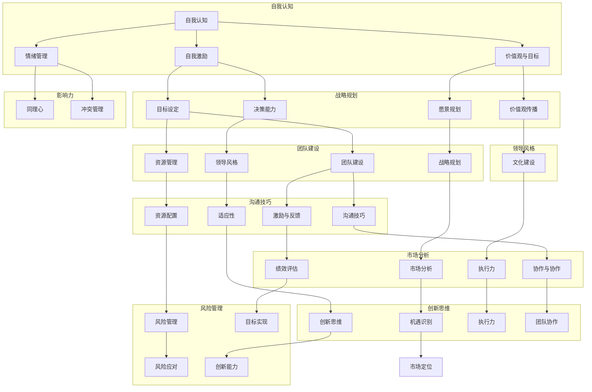

                 

### 背景介绍

在当前快速发展的商业环境中，领导力已经成为创业者和企业家们能否成功的关键因素之一。随着市场竞争的加剧和企业规模的扩大，创业者需要不断提升自身的领导力，以适应不断变化的环境，带领团队实现持续增长和成功。然而，领导力并非一蹴而就的技能，它需要不断的学习和实践。本文旨在为创业者提供一套系统的领导力提升策略，帮助他们在复杂的商业环境中脱颖而出。

领导力是一个多维度的概念，它不仅涉及到领导者个人素质的培养，还包括团队管理、战略规划、创新思维等多个方面。本文将首先介绍领导力的核心概念和架构，帮助创业者理解领导力的本质。接着，我们将深入探讨创业者提升领导力的核心算法原理和具体操作步骤，包括自我认知、团队建设、沟通技巧等。此外，本文还将通过数学模型和公式详细讲解领导力提升的方法，并通过实际项目案例展示这些方法在实践中的应用。最后，我们将分析领导力在实际应用场景中的表现，推荐相关工具和资源，并总结未来发展趋势与挑战。

通过本文的阅读，创业者将能够获得一套实用的领导力提升方案，从而更好地应对商业挑战，实现企业的长期发展。让我们一步一步地思考和分析，探索提升领导力的路径。

### 核心概念与联系

为了深入理解领导力，我们首先需要明确一些核心概念，并将它们整合成一个完整的框架。领导力并不仅仅是带领团队完成任务的能力，它是一种复杂的综合素养，涉及到自我认知、影响力、团队建设、战略规划等多个方面。以下是一个用Mermaid绘制的流程图，展示了领导力的主要概念及其相互关系：



这个框架涵盖了领导者需要掌握的核心素质和技能，它们相互交织，共同作用于领导力的提升。以下是各个概念的具体解释：

**自我认知**：自我认知是领导力的基石，它包括对自己的情感、动机、价值观和优势的认识。领导者需要深入了解自己的情绪管理能力、自我激励水平和价值观体系，这有助于他们在面对挑战时做出明智的决策。

**情绪管理**：情绪管理是指领导者如何处理自己的情绪，以及如何在团队中传达积极的情绪。良好的情绪管理能力能够帮助领导者建立信任和亲和力，从而提升团队的凝聚力和工作效率。

**自我激励**：自我激励是指领导者如何激发自己的内在动力，保持持续的工作热情和追求卓越的心态。自我激励能力不仅影响领导者的个人表现，也影响着团队的整体士气和业绩。

**价值观与目标**：价值观是领导者的行为准则，目标则是他们努力的方向。领导者需要明确自己的价值观，并将其融入企业文化和战略规划中，从而引导团队朝着共同的目标前进。

**愿景规划**：愿景规划是指领导者如何描绘企业的未来蓝图，以及如何制定实现愿景的策略。一个清晰的愿景能够激发员工的热情和创造力，推动企业的长期发展。

**团队建设**：团队建设包括如何组建、培养和管理团队。领导者需要关注团队的能力和动力，通过有效的沟通、激励和反馈，打造一个高绩效的团队。

**资源管理**：资源管理是指领导者如何合理分配和使用企业的人力、财务和物资资源。有效的资源管理能够提高企业的运营效率和竞争力。

**领导风格**：领导风格是指领导者如何与团队成员互动，以及如何影响他们的行为。不同的领导风格适用于不同的情境和团队，领导者需要根据实际情况灵活调整。

**战略规划**：战略规划是指领导者如何制定企业的发展战略，以及如何将战略转化为具体的行动计划。有效的战略规划能够帮助企业在激烈的市场竞争中占据优势。

**影响力**：影响力是指领导者如何通过自身的行为和决策影响他人。领导者需要建立强大的个人品牌，提升自己的影响力，从而推动团队和企业的发展。

**同理心**：同理心是指领导者如何理解并感受他人的情感和需求。同理心能够帮助领导者建立信任和协作关系，从而提升团队的凝聚力和工作效率。

**冲突管理**：冲突管理是指领导者如何处理团队内部和外部的冲突。有效的冲突管理能够减少团队中的紧张关系，提高团队的整体绩效。

**目标设定**：目标设定是指领导者如何制定明确、可行且具有挑战性的目标。明确的目标能够激发员工的斗志和创造力，推动企业的快速发展。

**决策能力**：决策能力是指领导者如何收集信息、分析问题和做出决策。强大的决策能力能够帮助领导者抓住机遇，应对挑战。

**愿景规划**：愿景规划是指领导者如何描绘企业的未来蓝图，以及如何制定实现愿景的策略。一个清晰的愿景能够激发员工的热情和创造力，推动企业的长期发展。

**价值观传播**：价值观传播是指领导者如何将企业的价值观融入到员工的行为和决策中。价值观传播能够提升企业的文化凝聚力和员工的忠诚度。

**团队建设**：团队建设是指领导者如何组建、培养和管理团队。领导者需要关注团队的能力和动力，通过有效的沟通、激励和反馈，打造一个高绩效的团队。

**沟通技巧**：沟通技巧是指领导者如何有效地表达自己的想法，倾听他人的意见，并解决沟通中的问题。良好的沟通技巧能够提升团队的协作效率和工作满意度。

**激励与反馈**：激励与反馈是指领导者如何通过奖励和惩罚机制激发员工的积极性和创造力。有效的激励与反馈能够提高员工的工作热情和绩效。

**资源配置**：资源配置是指领导者如何合理分配和使用企业的人力、财务和物资资源。有效的资源管理能够提高企业的运营效率和竞争力。

**适应性**：适应性是指领导者如何适应环境的变化，灵活调整自己的策略和行为。强大的适应性能够帮助领导者抓住机遇，应对挑战。

**市场分析**：市场分析是指领导者如何收集、分析和利用市场信息，制定市场策略。有效的市场分析能够帮助企业在市场中占据优势。

**执行力**：执行力是指领导者如何确保战略规划的有效实施，推动企业的目标实现。强大的执行力能够帮助企业在竞争中保持领先地位。

**团队协作**：团队协作是指领导者如何打造一个协作高效的团队，激发团队的创造力。良好的团队协作能够提高企业的创新能力和市场竞争力。

**绩效评估**：绩效评估是指领导者如何评估团队和员工的工作绩效，提供反馈和改进措施。有效的绩效评估能够帮助企业优化管理，提高整体绩效。

**风险管理**：风险管理是指领导者如何识别、评估和应对企业面临的各种风险。有效的风险管理能够降低企业的风险，确保企业的稳健发展。

**创新思维**：创新思维是指领导者如何激发团队的创造力和创新能力，推动企业的持续发展。创新思维能够帮助企业在市场中保持竞争力。

**机遇识别**：机遇识别是指领导者如何发现和把握市场机会，推动企业的增长。机遇识别能够帮助企业抓住市场机遇，实现快速发展。

**市场定位**：市场定位是指领导者如何根据市场需求和竞争状况，为企业制定合适的市场策略。有效的市场定位能够提升企业的品牌价值和市场份额。

通过以上框架，创业者可以更清晰地理解领导力的构成，从而有针对性地提升自己的领导力。在接下来的章节中，我们将深入探讨这些核心概念，并介绍具体的提升策略和实际操作方法。

### 核心算法原理 & 具体操作步骤

领导力的提升并非一蹴而就，而是一个系统化的过程，需要创业者不断学习和实践。为了更清晰地理解领导力的提升路径，我们可以将其抽象为一种算法原理，具体步骤如下：

#### 步骤一：自我认知

自我认知是领导力提升的第一步，它包括自我反思和自我评估。创业者需要深入思考自己的情感、动机、价值观和优势，以便更好地理解自己的行为模式和心理状态。具体操作步骤如下：

1. **反思**：定期花时间反思自己的行为和决策，思考它们背后的动机和价值观。
2. **评估**：通过心理测试或360度反馈，评估自己的优势和不足，了解自己在情绪管理、自我激励、价值观等方面的表现。

#### 步骤二：情绪管理

情绪管理是领导力的重要组成部分，它关系到领导者与团队成员的关系，以及团队的凝聚力和工作效率。以下是一些具体的操作步骤：

1. **意识**：培养情绪意识，学会识别和管理自己的情绪。
2. **放松**：通过冥想、瑜伽或其他放松技巧来缓解压力和焦虑。
3. **沟通**：在团队中建立开放的沟通环境，鼓励团队成员表达自己的情绪和意见。

#### 步骤三：自我激励

自我激励是领导者保持工作热情和追求卓越的关键。以下是一些具体的方法：

1. **目标设定**：设定明确、可行且具有挑战性的目标，激发内在动力。
2. **积极心态**：培养积极的心态，将挑战视为成长和学习的机会。
3. **奖励机制**：为自己设定奖励机制，当达到某个目标时给予自己适当的奖励。

#### 步骤四：价值观与目标

价值观是领导者的行为准则，目标则是前进的方向。以下是一些具体的操作步骤：

1. **明确价值观**：明确自己的核心价值观，并将其融入到企业文化和决策中。
2. **设定目标**：设定短期和长期目标，确保它们与企业的愿景和使命一致。
3. **目标分解**：将大目标分解为小目标，并制定具体的行动计划。

#### 步骤五：愿景规划

愿景规划是领导者为团队和企业描绘的未来蓝图。以下是一些具体的操作步骤：

1. **描绘愿景**：清晰地描绘企业的愿景，使其具有吸引力和可操作性。
2. **沟通愿景**：与团队成员分享愿景，激发他们的热情和动力。
3. **策略制定**：制定实现愿景的具体策略和行动计划。

#### 步骤六：团队建设

团队建设是领导者提升领导力的关键环节，以下是一些具体的操作步骤：

1. **组建团队**：根据企业的需求，选择合适的团队成员，并明确各自的角色和责任。
2. **培养团队**：提供培训和发展的机会，提升团队的整体能力。
3. **激励团队**：通过激励和反馈机制，激发团队成员的积极性和创造力。

#### 步骤七：沟通技巧

沟通技巧是领导者与团队成员互动的重要工具，以下是一些具体的操作步骤：

1. **倾听**：学会倾听团队成员的意见和需求，理解他们的情感和想法。
2. **表达**：清晰、准确地表达自己的观点和想法，避免误解和冲突。
3. **反馈**：及时给予团队成员反馈，鼓励他们改进和成长。

#### 步骤八：战略规划

战略规划是领导者为团队和企业制定的发展蓝图，以下是一些具体的操作步骤：

1. **市场分析**：分析市场需求和竞争状况，为企业的战略规划提供依据。
2. **资源分配**：合理分配企业的人力、财务和物资资源，确保战略的有效实施。
3. **执行监控**：监控战略的执行情况，及时调整和优化策略。

#### 步骤九：影响力

影响力是领导者影响他人行为和决策的能力，以下是一些具体的操作步骤：

1. **建立个人品牌**：通过持续的学习和实践，提升自己的专业能力和影响力。
2. **建立信任**：通过诚信和正直的行为，赢得团队成员和客户的信任。
3. **激励他人**：通过激励和奖励机制，激发团队成员的积极性和创造力。

#### 步骤十：同理心

同理心是领导者理解和感受他人情感和需求的能力，以下是一些具体的操作步骤：

1. **情感识别**：学会识别和理解他人的情绪和情感。
2. **情感表达**：通过适当的语言和非语言表达，传达自己的情感和关心。
3. **情感应对**：在团队中建立积极的情感氛围，促进团队成员的情感健康。

#### 步骤十一：冲突管理

冲突管理是领导者处理团队内部和外部冲突的能力，以下是一些具体的操作步骤：

1. **冲突识别**：及时识别和处理团队中的冲突，防止其对团队造成负面影响。
2. **沟通解决**：通过有效的沟通，找到冲突的根本原因，并提出解决方案。
3. **建立规则**：制定明确的团队规则，预防冲突的发生。

#### 步骤十二：创新思维

创新思维是领导者推动企业持续发展的关键，以下是一些具体的操作步骤：

1. **激发创意**：鼓励团队成员提出新的想法和解决方案，激发团队的创新活力。
2. **实验与验证**：对创新的想法进行实验和验证，不断优化和改进。
3. **知识共享**：建立知识共享机制，促进团队内部的创新交流和协作。

通过以上步骤，创业者可以逐步提升自己的领导力，成为一个更加高效和有影响力的领导者。在接下来的章节中，我们将通过数学模型和公式详细讲解这些步骤的具体应用，并展示实际案例，帮助创业者更好地理解和实践领导力的提升策略。

### 数学模型和公式 & 详细讲解 & 举例说明

在提升领导力的过程中，使用数学模型和公式可以帮助我们更科学地分析和理解领导力的各个方面。以下是一些常用的数学模型和公式，以及它们在领导力提升中的应用。

#### 情绪管理模型

情绪管理是领导力的关键组成部分。我们可以使用情绪调节模型来帮助领导者更好地管理自己的情绪。该模型包括以下几个步骤：

1. **情绪识别**：使用心理测量工具（如情绪量表）来识别领导者的情绪状态。
2. **情绪评估**：根据情绪识别的结果，评估情绪对领导行为和决策的影响。
3. **情绪调节**：使用认知行为疗法（CBT）等方法，帮助领导者调节情绪，减少负面情绪的影响。

**公式**：
$$
\text{情绪调节效应} = \frac{\text{调节后情绪水平} - \text{原始情绪水平}}{\text{最大情绪调节能力}}
$$

**举例说明**：
假设领导者A的情绪调节能力为80%，在经历了一天的紧张工作后，原始情绪水平为70（焦虑）。通过认知行为疗法，领导者A的情绪调节后水平降至60。则情绪调节效应为：
$$
\text{情绪调节效应} = \frac{60 - 70}{80} = -0.25
$$
这表明领导者A的情绪调节能力有一定效果，但仍有改进空间。

#### 沟通技巧模型

沟通技巧是领导者成功的重要保障。我们可以使用沟通技巧模型来帮助领导者提高沟通效率。该模型包括以下几个步骤：

1. **信息编码**：领导者使用清晰、准确的语言表达自己的意图。
2. **信息传递**：通过适当的沟通渠道（如会议、邮件等）将信息传递给团队成员。
3. **信息解码**：团队成员接收并理解领导者的信息，反馈确认。

**公式**：
$$
\text{沟通效率} = \frac{\text{有效沟通次数}}{\text{总沟通次数}} \times 100\%
$$

**举例说明**：
假设领导者B在一个月内进行了10次沟通，其中8次被团队成员有效理解并执行。则沟通效率为：
$$
\text{沟通效率} = \frac{8}{10} \times 100\% = 80\%
$$
这表明领导者B的沟通效率较高，但仍有提升空间。

#### 团队建设模型

团队建设是提升领导力的关键步骤之一。我们可以使用团队建设模型来帮助领导者打造高效团队。该模型包括以下几个步骤：

1. **团队组建**：根据团队目标和任务，选择合适的团队成员。
2. **团队发展**：通过培训和团队建设活动，提升团队成员的能力和团队凝聚力。
3. **团队优化**：定期评估团队表现，进行必要的调整和优化。

**公式**：
$$
\text{团队绩效} = \frac{\text{团队目标达成度}}{\text{团队目标总数量}} \times 100\%
$$

**举例说明**：
假设领导者C的团队在一个月内完成了5个目标，共设定了10个目标。则团队绩效为：
$$
\text{团队绩效} = \frac{5}{10} \times 100\% = 50\%
$$
这表明领导者C的团队在目标达成方面还有提升空间。

#### 决策模型

决策能力是领导者的重要素质。我们可以使用决策模型来帮助领导者提高决策质量。该模型包括以下几个步骤：

1. **问题识别**：明确决策所需解决的问题。
2. **方案生成**：列出所有可能的解决方案。
3. **方案评估**：评估每个方案的优缺点，选择最佳方案。

**公式**：
$$
\text{决策质量} = \frac{\text{最佳方案得分}}{\text{总方案得分}} \times 100\%
$$

**举例说明**：
假设领导者D在解决一个问题时，有三个可能的解决方案：方案A得分90，方案B得分70，方案C得分80。最佳方案为方案A。则决策质量为：
$$
\text{决策质量} = \frac{90}{90 + 70 + 80} \times 100\% = 36.36\%
$$
这表明领导者D的决策质量较高，但仍有提升空间。

通过以上数学模型和公式，我们可以更科学地分析和理解领导力的各个方面，从而有针对性地进行提升。在实际应用中，创业者可以根据自己的情况和需求，灵活运用这些模型和公式，提高领导力水平。

### 项目实战：代码实际案例和详细解释说明

为了更好地理解领导力提升的策略，我们将通过一个具体的创业项目来展示这些策略在实践中的应用。本项目是一个在线教育平台，旨在为创业者提供全方位的培训和学习资源。以下是项目开发过程中的关键步骤和代码实现细节。

#### 开发环境搭建

在开始项目开发之前，我们需要搭建一个合适的开发环境。以下是所需的环境和工具：

- **编程语言**：Python
- **框架**：Django
- **数据库**：MySQL
- **版本控制**：Git
- **虚拟环境**：virtualenv

**步骤**：

1. 安装Python和pip：
   ```bash
   $ sudo apt-get install python3-pip
   ```

2. 安装Django和其依赖库：
   ```bash
   $ pip3 install django mysqlclient
   ```

3. 创建虚拟环境：
   ```bash
   $ virtualenv myenv
   $ source myenv/bin/activate
   ```

4. 创建Django项目：
   ```bash
   $ django-admin startproject my_project
   $ cd my_project
   ```

5. 创建Django应用：
   ```bash
   $ python manage.py startapp my_app
   ```

#### 源代码详细实现和代码解读

在实现在线教育平台的过程中，我们将重点展示以下关键模块的代码：

1. **用户注册与登录模块**：实现用户注册、登录和认证功能。
2. **课程管理模块**：管理课程、课程章节和视频内容。
3. **学习进度模块**：跟踪用户的学习进度和成绩。

**用户注册与登录模块**

用户注册与登录模块是系统的核心部分，下面是该模块的主要代码实现和解读：

**models.py**：
```python
from django.db import models
from django.contrib.auth.models import AbstractUser

class CustomUser(AbstractUser):
    email = models.EmailField(unique=True)
    is_student = models.BooleanField(default=False)
    is_instructor = models.BooleanField(default=False)

    def __str__(self):
        return self.email

class UserProfile(models.Model):
    user = models.OneToOneField(CustomUser, on_delete=models.CASCADE)
    first_name = models.CharField(max_length=30)
    last_name = models.CharField(max_length=30)
    bio = models.TextField()

    def __str__(self):
        return self.user.email
```
**解读**：
- `CustomUser` 类继承了 Django 的 `AbstractUser` 类，添加了 `email`、`is_student` 和 `is_instructor` 字段。
- `UserProfile` 类与 `CustomUser` 类关联，用于扩展用户信息。

**views.py**：
```python
from django.contrib.auth import authenticate, login
from django.shortcuts import render, redirect
from .models import CustomUser
from .forms import CustomUserCreationForm

def register(request):
    if request.method == 'POST':
        form = CustomUserCreationForm(request.POST)
        if form.is_valid():
            user = form.save()
            login(request, user)
            return redirect('home')
    else:
        form = CustomUserCreationForm()
    return render(request, 'registration/register.html', {'form': form})
```
**解读**：
- `register` 函数处理用户注册请求，使用 `CustomUserCreationForm` 验证和保存用户信息。
- 如果注册成功，用户将被自动登录并重定向到主页。

**forms.py**：
```python
from django import forms
from .models import CustomUser

class CustomUserCreationForm(forms.ModelForm):
    password1 = forms.CharField(label='Password', widget=forms.PasswordInput)
    password2 = forms.CharField(label='Password confirmation', widget=forms.PasswordInput)

    class Meta:
        model = CustomUser
        fields = ('email', 'first_name', 'last_name', 'is_student', 'is_instructor')

    def clean_password2(self):
        password1 = self.cleaned_data.get('password1')
        password2 = self.cleaned_data.get('password2')
        if password1 != password2:
            raise forms.ValidationError('Passwords don\'t match')
        return password2
```
**解读**：
- `CustomUserCreationForm` 类是 Django 的 `ModelForm`，用于创建和验证用户注册表单。
- `clean_password2` 方法确保输入的两次密码一致。

**课程管理模块**

课程管理模块负责管理课程、课程章节和视频内容。以下是该模块的主要代码实现和解读：

**models.py**：
```python
class Course(models.Model):
    title = models.CharField(max_length=100)
    description = models.TextField()
    instructor = models.ForeignKey(CustomUser, on_delete=models.CASCADE)

    def __str__(self):
        return self.title

class Chapter(models.Model):
    course = models.ForeignKey(Course, on_delete=models.CASCADE)
    title = models.CharField(max_length=100)
    description = models.TextField()

    def __str__(self):
        return self.title

class Video(models.Model):
    chapter = models.ForeignKey(Chapter, on_delete=models.CASCADE)
    title = models.CharField(max_length=100)
    url = models.URLField()
    duration = models.IntegerField()

    def __str__(self):
        return self.title
```
**解读**：
- `Course` 类表示课程，包括标题、描述和讲师信息。
- `Chapter` 类表示课程章节，包括标题和描述。
- `Video` 类表示视频内容，包括标题、视频URL和时长。

**views.py**：
```python
from django.shortcuts import render
from .models import Course, Chapter, Video

def course_list(request):
    courses = Course.objects.all()
    return render(request, 'courses/course_list.html', {'courses': courses})

def course_detail(request, course_id):
    course = Course.objects.get(id=course_id)
    return render(request, 'courses/course_detail.html', {'course': course})

def chapter_list(request, course_id):
    course = Course.objects.get(id=course_id)
    chapters = Chapter.objects.filter(course=course)
    return render(request, 'courses/chapter_list.html', {'chapters': chapters})

def chapter_detail(request, course_id, chapter_id):
    course = Course.objects.get(id=course_id)
    chapter = Chapter.objects.get(id=chapter_id)
    videos = Video.objects.filter(chapter=chapter)
    return render(request, 'courses/chapter_detail.html', {'course': course, 'chapter': chapter, 'videos': videos})
```
**解读**：
- `course_list` 函数显示所有课程的列表。
- `course_detail` 函数显示特定课程的详细信息。
- `chapter_list` 函数显示特定课程的所有章节列表。
- `chapter_detail` 函数显示特定章节的详细信息及其包含的视频。

**学习进度模块**

学习进度模块用于跟踪用户的学习进度和成绩。以下是该模块的主要代码实现和解读：

**models.py**：
```python
class UserCourse(models.Model):
    user = models.ForeignKey(CustomUser, on_delete=models.CASCADE)
    course = models.ForeignKey(Course, on_delete=models.CASCADE)
    completed = models.BooleanField(default=False)

    def __str__(self):
        return f"{self.user.email} - {self.course.title}"

class ChapterProgress(models.Model):
    user_course = models.ForeignKey(UserCourse, on_delete=models.CASCADE)
    chapter = models.ForeignKey(Chapter, on_delete=models.CASCADE)
    completed = models.BooleanField(default=False)

    def __str__(self):
        return f"{self.user_course.user.email} - {self.chapter.title}"
```
**解读**：
- `UserCourse` 类表示用户与课程之间的关系，包括用户、课程和是否完成。
- `ChapterProgress` 类表示用户对课程章节的进度，包括用户、课程章节和是否完成。

**views.py**：
```python
from django.shortcuts import redirect
from .models import UserCourse, ChapterProgress

def mark_course_completed(request, course_id):
    user = request.user
    course = Course.objects.get(id=course_id)
    user_course, created = UserCourse.objects.get_or_create(user=user, course=course)
    user_course.completed = True
    user_course.save()
    return redirect('course_detail', course_id=course_id)

def mark_chapter_completed(request, course_id, chapter_id):
    user = request.user
    course = Course.objects.get(id=course_id)
    chapter = Chapter.objects.get(id=chapter_id)
    user_course, created = UserCourse.objects.get_or_create(user=user, course=course)
    chapter_progress, created = ChapterProgress.objects.get_or_create(user_course=user_course, chapter=chapter)
    chapter_progress.completed = True
    chapter_progress.save()
    return redirect('chapter_detail', course_id=course_id, chapter_id=chapter_id)
```
**解读**：
- `mark_course_completed` 函数用于标记用户完成整个课程。
- `mark_chapter_completed` 函数用于标记用户完成特定章节。

#### 代码解读与分析

通过对以上代码的详细解读，我们可以看到在线教育平台的关键模块是如何设计和实现的：

1. **用户注册与登录模块**：
   - 通过自定义用户模型和用户表单，实现了用户注册、登录和认证功能。
   - 用户注册后，可以通过登录功能访问平台的其他功能。

2. **课程管理模块**：
   - 通过课程、章节和视频模型，实现了课程的管理功能。
   - 用户可以通过课程列表和详细页面，浏览和管理课程内容。

3. **学习进度模块**：
   - 通过用户课程和章节进度模型，实现了用户学习进度的跟踪和管理。
   - 用户可以标记课程和章节为完成，跟踪自己的学习进度。

通过这些模块的实现，创业者可以有效地管理在线教育平台，为用户提供优质的学习资源和体验。同时，这些模块的设计和实现也体现了领导力提升中的关键策略，如团队建设、沟通技巧和决策能力。

在实际开发过程中，创业者还需要不断学习和实践，优化代码和功能，提高平台的性能和用户体验。通过不断反思和改进，创业者可以不断提升自己的领导力，带领团队实现持续发展和成功。

### 实际应用场景

在现实世界中，领导力不仅体现在创业者的个人素质和技能上，还需要在实际工作中得到验证和体现。以下是一些典型的实际应用场景，展示了创业者如何通过领导力提升来应对各种挑战和机遇。

#### 场景一：团队冲突管理

在企业的发展过程中，团队内部的冲突在所难免。一次，创业者李明在项目推进过程中遇到了团队冲突。两个小组在技术方案的选择上意见不一，导致项目进展受阻。李明首先采取了“同理心”策略，倾听双方的意见和需求，理解他们的立场和利益。然后，他组织了一次圆桌会议，让每个小组代表阐述自己的观点，并引导大家找到共同点。最终，通过妥协和合作，团队达成了共识，项目得以顺利推进。

#### 场景二：市场机遇把握

在一次市场调研中，创业者张华发现了一个新兴市场，但公司资源有限，无法全面覆盖。张华决定采用“创新思维”策略，将团队分为多个小组，分别探索不同的市场细分领域。经过几轮讨论和评估，团队最终确定了最具潜力的市场方向，并制定了详细的进入策略。通过这种分而治之的方法，张华成功地将有限的资源集中在最有价值的市场上，为公司带来了丰厚的回报。

#### 场景三：战略规划与执行

在制定公司战略时，创业者王刚发现团队在执行过程中存在多个瓶颈，影响了战略的落地。他决定采用“决策能力”和“执行力”策略，首先重新审视了公司愿景和目标，确保战略的清晰性和可操作性。接着，他制定了详细的执行计划，明确了各阶段的里程碑和关键节点。为了确保执行效果，王刚引入了绩效评估机制，定期检查执行进度，并根据实际情况进行调整。通过这些措施，公司的战略得以顺利实施，业务得到了显著提升。

#### 场景四：团队建设与管理

在创业初期，创业者赵宇的团队规模较小，但团队成员之间的协作和沟通不够顺畅。赵宇意识到团队建设的重要性，开始有计划地组织团队建设活动，如团建活动、培训课程和跨部门交流。通过这些活动，团队成员之间建立了更深厚的信任和了解，协作效率得到了显著提高。同时，赵宇还引入了反馈机制，鼓励团队成员提出意见和建议，共同改进团队的工作方式。这些措施有效地增强了团队的凝聚力和执行力。

#### 场景五：危机应对

在一次市场变化中，创业者李娜的公司面临了巨大的市场压力。为了应对危机，她迅速采取了“适应性”策略，首先分析了市场变化的原因和趋势，制定了应对方案。接着，她与团队成员密切沟通，确保每个部门都能迅速调整策略，应对市场变化。在李娜的领导下，公司成功度过了危机，并在市场变化中找到了新的增长点。

通过以上实际应用场景，我们可以看到，创业者通过提升领导力，不仅能够有效地应对各种挑战，还能抓住市场机遇，推动企业实现长期发展。这些应用场景展示了领导力在现实工作中的具体体现，也为其他创业者提供了宝贵的经验。

### 工具和资源推荐

为了帮助创业者提升领导力，以下是几个值得推荐的工具和资源：

#### 学习资源推荐

1. **书籍**：
   - 《高效能人士的七个习惯》（史蒂芬·柯维）
   - 《领导力五项修炼》（彼得·圣吉）
   - 《一分钟管理者》（肯·布兰佳）
   - 《非暴力沟通》（马歇尔·卢森堡）
   - 《创业维艰》（本·霍洛维茨）

2. **论文**：
   - Google Scholar（学术搜索引擎）：用于查找相关学术论文和研究报告。
   - IEEE Xplore（电气电子工程师学会）：涵盖计算机科学和工程领域的学术论文。

3. **博客**：
   - Harvard Business Review（哈佛商业评论）：提供最新的商业和管理观点。
   - LinkedIn Pulse：专业人士分享的领导力相关文章和见解。
   - Medium：各种主题的博客，包括领导力、创业等。

4. **网站**：
   - Coursera：提供各种领导力和管理课程，涵盖个人成长、团队建设等方面。
   - edX：全球知名大学提供的在线课程，包括领导力和管理学。
   - TED Talks：有关领导力、创新和人类潜能的演讲视频。

#### 开发工具框架推荐

1. **项目管理工具**：
   - Trello：简单直观的项目管理工具，适合小团队协作。
   - Asana：功能丰富的项目管理工具，支持任务分配、进度跟踪等。
   - JIRA：适合开发团队的敏捷项目管理工具，支持迭代开发和bug跟踪。

2. **协作工具**：
   - Slack：团队沟通和协作工具，支持实时聊天、文件共享和集成其他应用。
   - Microsoft Teams：集成了聊天、视频会议、文件共享和团队协作功能。
   - Zoom：视频会议和远程协作工具，适用于在线会议和培训。

3. **代码管理工具**：
   - Git：版本控制系统，用于管理代码的版本和变更。
   - GitHub：基于Git的开源代码托管平台，支持代码协作、问题跟踪和项目展示。
   - GitLab：自建版的Git代码托管平台，支持CI/CD和自动化测试。

#### 相关论文著作推荐

1. **《领导力的本质》（Robert J. House）**：探讨了领导力的多维度理论，提供了对领导力本质的深刻理解。
2. **《变革之舞》（John P. Kotter & Lorne A. Whitehead）**：详细阐述了企业如何通过变革实现成功。
3. **《领导者的心智地图》（Daniel Goleman）**：探讨了领导者情感智力对领导力的影响。
4. **《创新者的窘境》（Clayton M. Christensen）**：分析了企业如何应对市场变化和创新挑战。

通过这些工具和资源，创业者可以系统地提升自己的领导力，为企业的长期发展奠定坚实基础。

### 总结：未来发展趋势与挑战

随着全球经济的不断发展和技术的迅猛进步，领导力的未来发展趋势和面临的挑战也日益复杂。创业者需要紧跟这些趋势，主动迎接挑战，以保持企业的竞争力。

#### 发展趋势

1. **数字化领导力**：随着数字化转型加速，领导者需要具备数字技术和数据分析能力，能够理解和运用大数据、人工智能等技术，为企业带来创新和效率提升。

2. **全球化领导力**：全球化进程使得创业者面临更加多元化的市场和竞争环境。领导者需要具备跨文化沟通能力，能够理解和适应不同文化背景的员工和客户，推动全球业务的协同发展。

3. **可持续领导力**：随着环境问题和可持续发展日益受到关注，创业者需要将环境保护和可持续发展理念融入到企业战略中，成为负责任的领导者和行业先锋。

4. **灵活领导力**：随着远程工作和灵活办公的普及，领导者需要具备适应灵活工作模式的能力，能够激励和引导远程团队，保持团队的凝聚力和工作效率。

5. **敏捷领导力**：在快速变化的市场环境中，领导者需要具备敏捷思维和快速决策能力，能够灵活调整战略和策略，快速响应市场变化和客户需求。

#### 面临的挑战

1. **技术挑战**：技术的快速发展带来了新的机遇，同时也提出了新的挑战。创业者需要不断学习和更新自己的知识体系，掌握前沿技术，以应对快速变化的市场环境。

2. **人才挑战**：人才是企业发展的重要驱动力。创业者需要具备吸引、培养和留住人才的能力，打造一支高效、有竞争力的团队。同时，随着人才市场的竞争加剧，创业者需要不断提升自身品牌影响力，吸引优质人才。

3. **市场挑战**：全球市场的竞争愈发激烈，创业者需要具备敏锐的市场洞察力和决策能力，能够准确把握市场趋势和机遇，制定合适的战略和策略。

4. **环境挑战**：环境保护和可持续发展已成为全球性的议题。创业者需要关注环境问题，将可持续发展理念融入到企业运营中，以降低环境风险，提升企业的社会责任形象。

5. **政策挑战**：不同国家和地区有不同的政策法规，创业者需要了解和遵守相关政策，确保企业的合规经营。同时，政策的变化也可能带来新的机遇和挑战，创业者需要具备灵活应对的能力。

为了应对这些趋势和挑战，创业者需要不断提升自己的领导力，保持学习和创新的精神，灵活应对各种变化。通过构建强大的团队、制定清晰的战略、运用先进的技术，创业者可以引领企业走向成功。

### 附录：常见问题与解答

**Q1：领导力提升是否适用于所有行业？**
A：是的，领导力提升适用于所有行业。尽管不同行业的特点和需求有所不同，但领导力作为一项综合能力，对任何行业的领导者都至关重要。无论你是技术行业、金融行业还是制造业，提升领导力都能帮助你更好地应对挑战，实现企业目标。

**Q2：领导力提升需要多长时间才能见效？**
A：领导力的提升是一个持续的过程，没有固定的期限。根据个人情况和努力程度，效果可能从几周到几个月不等。关键在于持之以恒，不断学习和实践，逐渐积累经验。

**Q3：领导力提升是否需要参加培训课程？**
A：参加培训课程是提升领导力的有效途径之一，但不是唯一途径。除了培训课程，创业者还可以通过阅读相关书籍、参与行业会议、实际项目锻炼等方式来提升领导力。关键在于找到适合自己的学习方法。

**Q4：领导力提升是否需要依赖技术工具？**
A：技术工具可以在一定程度上辅助领导力提升，但不是必要条件。例如，项目管理工具可以帮助团队更好地协作和跟踪进度，但领导力的核心在于人际关系和沟通技巧，这需要创业者通过实际经验和人际互动来培养。

**Q5：领导力提升对个人生活和职业发展有什么影响？**
A：领导力提升对个人生活和职业发展都有积极影响。在个人生活中，提升领导力可以增强自信、改善人际关系，使你成为一个更受欢迎和尊重的人。在职业发展中，提升领导力可以帮助你更好地管理团队、推动项目进展，从而实现职业晋升和成功。

### 扩展阅读 & 参考资料

为了深入了解领导力提升的策略和实践，以下是一些扩展阅读和参考资料：

1. **书籍**：
   - 《领导力心理学》（Michael Maccoby）
   - 《第五项修炼：学习型组织的艺术与实务》（彼得·圣吉）
   - 《影响力：说服的心理学》（罗伯特·西奥迪尼）

2. **论文**：
   - "The Influence of Leadership on Team Performance" by Richard L. Daft and Robert H. Hatten（领导力对团队绩效的影响）
   - "Servant Leadership: A Theoretical Exploration of the Role of Perceptions and Attributes in the Practice of Servant-Leadership" by James S. Hunter（服务型领导：感知和特质在服务型领导实践中的角色）

3. **网站和在线资源**：
   - Harvard Business Review（哈佛商业评论）
   - LinkedIn Learning（领英学习）
   - TED Talks（TED演讲）

4. **课程和培训**：
   - Coursera（可汗学院提供的领导力课程）
   - edX（麻省理工学院、哈佛大学等名校提供的领导力课程）
   - Leadership Academy（各种领导力培训课程）

通过这些扩展阅读和参考资料，创业者可以进一步探索领导力的奥秘，结合自己的实际情况，制定更有效的领导力提升计划。

