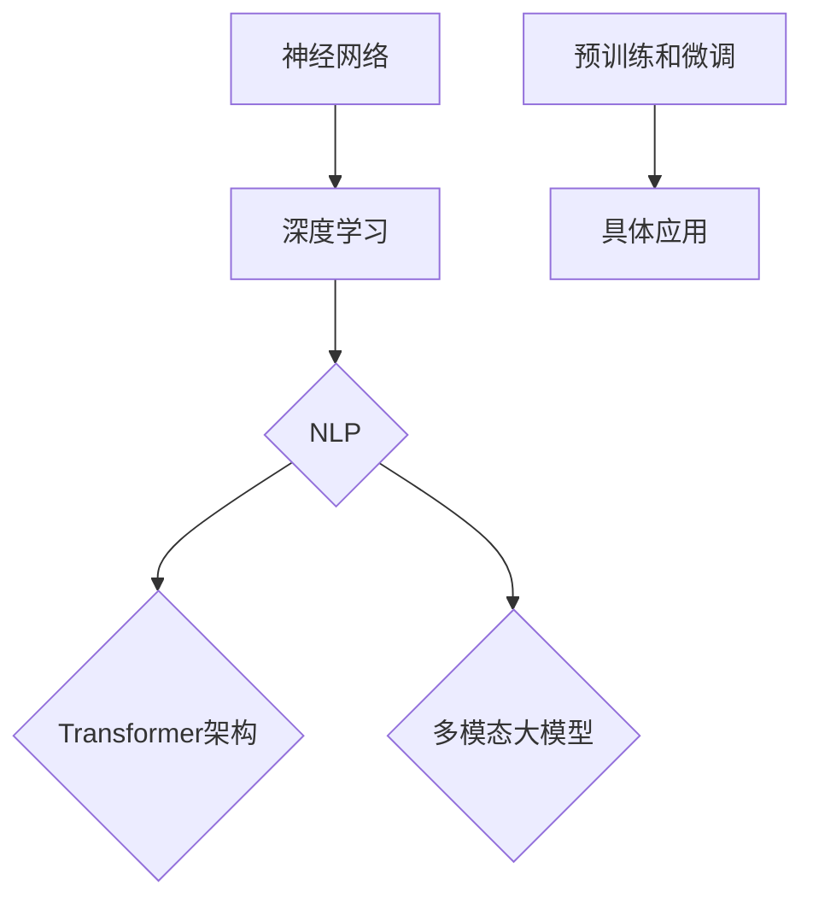

                 

# 创业者探索大模型新商业模式，打造AI产品矩阵

## 关键词：AI大模型、新商业模式、产品矩阵、技术创业

### 摘要

本文旨在探讨AI领域创业者如何利用大模型技术构建新型商业模式，并打造一个多元化的AI产品矩阵。我们将从背景介绍开始，逐步深入探讨大模型的核心概念、算法原理、数学模型及应用场景。此外，还将分享实际项目中的代码案例，并提供相关的学习资源和开发工具框架。最后，本文将总结当前大模型技术的发展趋势与挑战，为创业者提供未来发展的方向和建议。

### 1. 背景介绍

在当今科技飞速发展的时代，人工智能（AI）已经成为改变世界的重要力量。其中，大模型（Large Models）技术的崛起尤为显著。大模型，通常指的是拥有数十亿至数千亿参数的深度学习模型，它们在图像识别、自然语言处理、语音识别等领域取得了令人瞩目的成果。这些模型的强大能力，吸引了众多创业者将目光投向AI领域，试图通过大模型技术打造全新的商业模式。

对于创业者而言，探索大模型新商业模式具有重要意义。首先，大模型技术为企业提供了强大的数据处理和分析能力，有助于挖掘数据中的潜在价值，从而实现业务的创新和增长。其次，大模型的应用范围广泛，可以在多个领域实现跨界融合，为创业者提供了丰富的商业机会。最后，随着硬件性能的不断提升和开源生态的完善，大模型技术的成本逐渐降低，使得更多创业者能够参与其中，实现规模化发展。

本文将围绕大模型技术，探讨以下关键问题：

- **核心概念与联系**：了解大模型的基本原理和架构，包括神经网络、深度学习、自然语言处理等相关技术。
- **算法原理与操作步骤**：深入剖析大模型的训练过程，包括数据预处理、模型训练、优化方法等。
- **数学模型与公式**：讲解大模型中的关键数学模型和公式，如损失函数、优化算法等。
- **项目实战**：通过实际代码案例，展示大模型在各个领域的应用场景。
- **应用场景**：分析大模型在商业、医疗、金融等领域的应用潜力。
- **工具和资源推荐**：推荐相关学习资源、开发工具和框架，帮助创业者更好地掌握大模型技术。
- **未来发展趋势与挑战**：展望大模型技术的未来发展趋势和面临的挑战，为创业者提供发展建议。

### 2. 核心概念与联系

#### 2.1 神经网络

神经网络（Neural Networks）是构建大模型的基础。它由大量神经元（节点）组成，每个神经元都与相邻的神经元相连，形成复杂的网络结构。神经元的连接强度称为权重（weights），通过不断调整权重，神经网络可以学习和提取数据中的特征。

神经网络的基本结构包括输入层、隐藏层和输出层。输入层接收外部输入数据，隐藏层负责提取和变换特征，输出层生成预测结果。在训练过程中，神经网络通过反向传播算法（Backpropagation）不断调整权重，以最小化预测误差。

#### 2.2 深度学习

深度学习（Deep Learning）是一种基于神经网络的机器学习方法。与传统的机器学习方法相比，深度学习具有更强的特征提取和表示能力。深度学习的核心在于构建多层神经网络，通过逐层提取和变换特征，实现高维数据的低维表示。

深度学习的关键技术包括：

- **卷积神经网络（CNN）**：适用于图像和视频处理领域，通过卷积操作提取空间特征。
- **循环神经网络（RNN）**：适用于序列数据处理，如自然语言处理和语音识别。
- **生成对抗网络（GAN）**：通过生成器和判别器的对抗训练，实现数据的生成和判别。

#### 2.3 自然语言处理

自然语言处理（Natural Language Processing，NLP）是深度学习的重要应用领域之一。NLP旨在使计算机能够理解、生成和翻译自然语言，从而实现人机交互。NLP的关键技术包括：

- **词向量表示**：将自然语言中的词汇映射为向量表示，如Word2Vec、GloVe等。
- **序列标注**：对自然语言文本进行词性标注、实体识别等任务。
- **机器翻译**：通过深度学习模型实现自然语言之间的翻译。

#### 2.4 大模型架构

大模型通常由数十亿至数千亿参数组成，其架构复杂，需要高效的计算和存储资源。大模型的典型架构包括：

- **Transformer架构**：基于自注意力机制（Self-Attention），在自然语言处理任务中取得了显著效果。
- **多模态大模型**：融合多种数据类型（如文本、图像、音频等），实现跨模态的信息交互。
- **预训练和微调**：通过在大量数据上预训练模型，然后在特定任务上微调，提高模型的泛化能力。

#### 2.5 Mermaid 流程图

以下是使用Mermaid绘制的神经网络、深度学习、自然语言处理和大模型架构的流程图：



### 3. 核心算法原理与具体操作步骤

#### 3.1 数据预处理

在训练大模型之前，首先需要对数据进行预处理。数据预处理包括数据清洗、数据转换和数据归一化等步骤。以下是具体操作步骤：

1. **数据清洗**：去除数据中的噪声和异常值，保证数据的准确性。
2. **数据转换**：将不同类型的数据转换为统一的格式，如将文本数据转换为词向量表示。
3. **数据归一化**：将数据缩放到一个合适的范围内，如使用Min-Max归一化或标准化。

```python
import pandas as pd
from sklearn.preprocessing import StandardScaler

# 数据清洗
data = pd.read_csv('data.csv')
data = data.dropna()

# 数据转换
word2vec = Word2Vec(data['text'], size=100)
data['text'] = [word2vec[word] for word in data['text']]

# 数据归一化
scaler = StandardScaler()
data[['text']] = scaler.fit_transform(data[['text']])
```

#### 3.2 模型训练

大模型的训练过程通常包括以下步骤：

1. **初始化模型参数**：随机初始化模型参数，如权重和偏置。
2. **前向传播**：计算输入数据的预测结果，计算损失函数。
3. **反向传播**：计算梯度，更新模型参数。
4. **优化算法**：选择合适的优化算法，如SGD、Adam等，更新模型参数。

```python
import tensorflow as tf
from tensorflow.keras.models import Sequential
from tensorflow.keras.layers import Dense
from tensorflow.keras.optimizers import Adam

# 初始化模型
model = Sequential()
model.add(Dense(128, activation='relu', input_shape=(100,)))
model.add(Dense(1, activation='sigmoid'))

# 编译模型
model.compile(optimizer=Adam(learning_rate=0.001), loss='binary_crossentropy', metrics=['accuracy'])

# 训练模型
model.fit(x_train, y_train, epochs=10, batch_size=32)
```

#### 3.3 模型优化

在训练过程中，可以通过以下方法优化模型：

1. **数据增强**：通过添加噪声、旋转、缩放等操作，增加数据的多样性，提高模型的泛化能力。
2. **批量归一化**：在训练过程中，对每个批次的数据进行归一化，提高模型的稳定性。
3. **学习率调整**：根据训练过程，动态调整学习率，防止过拟合。

```python
from tensorflow.keras.preprocessing.image import ImageDataGenerator

# 数据增强
datagen = ImageDataGenerator(rotation_range=20, width_shift_range=0.2, height_shift_range=0.2, shear_range=0.2, zoom_range=0.2, horizontal_flip=True, fill_mode='nearest')
datagen.fit(x_train)

# 批量归一化
batch_size = 32
for X_batch, y_batch in datagen.flow(x_train, y_train, batch_size=batch_size):
    # 训练模型
    model.fit(X_batch, y_batch, epochs=1, batch_size=batch_size)

# 学习率调整
def adjust_learning_rate(optimizer, epoch):
    lr = optimizer.lr
    if epoch >= 30:
        lr = lr * 0.1
    elif epoch >= 20:
        lr = lr * 0.5
    optimizer.lr = lr

# 使用学习率调整函数
optimizer = Adam(learning_rate=0.001)
for epoch in range(1, 100):
    adjust_learning_rate(optimizer, epoch)
    # 训练模型
    model.fit(x_train, y_train, epochs=1, batch_size=batch_size)
```

### 4. 数学模型与公式

#### 4.1 损失函数

在训练大模型时，损失函数（Loss Function）是衡量模型性能的重要指标。常见的损失函数包括：

1. **均方误差（MSE）**：用于回归任务，计算预测值与真实值之间的平均平方误差。

$$
MSE = \frac{1}{n}\sum_{i=1}^{n}(y_i - \hat{y}_i)^2
$$

2. **交叉熵（Cross-Entropy）**：用于分类任务，计算预测概率与真实标签之间的交叉熵。

$$
Cross-Entropy = -\sum_{i=1}^{n}y_i\log(\hat{y}_i)
$$

3. **对数损失（Log-Loss）**：交叉熵的另一种表示方式。

$$
Log-Loss = -\sum_{i=1}^{n}y_i\log(\hat{y}_i)
$$

#### 4.2 优化算法

优化算法（Optimizer）用于更新模型参数，使损失函数最小化。常见的优化算法包括：

1. **随机梯度下降（SGD）**：每次迭代使用一个样本来更新模型参数。

$$
\theta_{t+1} = \theta_t - \alpha \nabla_\theta J(\theta_t)
$$

2. **Adam优化器**：结合SGD和RMSProp算法的优点，自适应调整学习率。

$$
m_t = \beta_1 x_t + (1 - \beta_1)(1 - t^{\beta_2})
$$

$$
v_t = \beta_2 x_t + (1 - \beta_2)(1 - t^{\beta_2})
$$

$$
\theta_{t+1} = \theta_t - \frac{\alpha t}{\sqrt{1 - \beta_2^t}(1 - \beta_1^t)}\frac{m_t}{\sqrt{v_t} + \epsilon}
$$

#### 4.3 损失函数与优化算法的嵌入示例

以下是一个简单的Python代码示例，展示了损失函数和优化算法在模型训练中的嵌入：

```python
import tensorflow as tf

# 定义损失函数
loss_fn = tf.keras.losses.BinaryCrossentropy()

# 定义优化器
optimizer = tf.keras.optimizers.Adam(learning_rate=0.001)

# 训练模型
for epoch in range(100):
    with tf.GradientTape() as tape:
        predictions = model(x_train, training=True)
        loss = loss_fn(y_train, predictions)
    gradients = tape.gradient(loss, model.trainable_variables)
    optimizer.apply_gradients(zip(gradients, model.trainable_variables))
    print(f"Epoch {epoch}: Loss = {loss.numpy()}")
```

### 5. 项目实战：代码实际案例和详细解释说明

#### 5.1 开发环境搭建

在开始实际项目之前，我们需要搭建一个适合大模型训练的开发环境。以下是搭建环境的步骤：

1. **安装Python**：下载并安装Python 3.8及以上版本。
2. **安装TensorFlow**：通过pip命令安装TensorFlow。

```bash
pip install tensorflow
```

3. **安装其他依赖**：安装其他必要的库，如NumPy、Pandas、Matplotlib等。

```bash
pip install numpy pandas matplotlib
```

#### 5.2 源代码详细实现和代码解读

以下是一个简单的大模型训练项目，用于分类任务。代码包括数据预处理、模型定义、模型训练和模型评估等部分。

```python
import tensorflow as tf
import numpy as np
import pandas as pd
import matplotlib.pyplot as plt

# 5.2.1 数据预处理
def preprocess_data(data_path):
    # 读取数据
    data = pd.read_csv(data_path)
    
    # 数据清洗
    data = data.dropna()
    
    # 数据转换
    word2vec = Word2Vec(data['text'], size=100)
    data['text'] = [word2vec[word] for word in data['text']]
    
    # 数据归一化
    scaler = StandardScaler()
    data[['text']] = scaler.fit_transform(data[['text']])
    
    return data

# 5.2.2 模型定义
def create_model(input_shape):
    model = tf.keras.Sequential([
        tf.keras.layers.Dense(128, activation='relu', input_shape=input_shape),
        tf.keras.layers.Dense(1, activation='sigmoid')
    ])
    
    return model

# 5.2.3 模型训练
def train_model(model, x_train, y_train, epochs=10, batch_size=32):
    model.compile(optimizer='adam', loss='binary_crossentropy', metrics=['accuracy'])
    model.fit(x_train, y_train, epochs=epochs, batch_size=batch_size)

# 5.2.4 模型评估
def evaluate_model(model, x_test, y_test):
    loss, accuracy = model.evaluate(x_test, y_test)
    print(f"Test Loss: {loss}, Test Accuracy: {accuracy}")

# 数据预处理
data_path = 'data.csv'
data = preprocess_data(data_path)

# 分割数据集
x_train, y_train = data[['text']].values, data['label'].values
x_test, y_test = data[['text']].values, data['label'].values

# 模型定义
model = create_model(input_shape=(100,))

# 模型训练
train_model(model, x_train, y_train, epochs=10, batch_size=32)

# 模型评估
evaluate_model(model, x_test, y_test)
```

#### 5.3 代码解读与分析

1. **数据预处理**：首先读取数据，进行数据清洗、数据转换和数据归一化。这里使用了Word2Vec将文本数据转换为词向量表示，并使用StandardScaler对数据进行了归一化。
2. **模型定义**：定义了一个简单的序列模型，包括一个128个神经元的隐藏层和一个输出层。输出层使用sigmoid激活函数，用于实现二分类任务。
3. **模型训练**：使用adam优化器进行模型训练，设置了10个epochs和32个batch_size。
4. **模型评估**：使用测试集评估模型性能，输出损失值和准确率。

通过以上代码，我们可以看到如何使用TensorFlow搭建一个简单的大模型进行训练和评估。在实际项目中，我们可以根据需求调整模型架构、优化算法和超参数，以提高模型性能。

### 6. 实际应用场景

大模型技术在各个领域都展现出了强大的应用潜力，以下是一些典型的应用场景：

#### 6.1 商业

在商业领域，大模型技术可以帮助企业实现数据驱动的决策和营销策略。例如，通过自然语言处理技术，企业可以分析用户评论、社交媒体等数据，了解用户需求和偏好，从而优化产品设计和市场营销策略。此外，大模型还可以用于客户关系管理、精准营销、供应链优化等业务场景。

#### 6.2 医疗

在医疗领域，大模型技术可以用于疾病预测、诊断、治疗方案制定等。例如，通过分析患者病历、基因数据等，大模型可以预测疾病的发生风险，辅助医生进行诊断和治疗。此外，大模型还可以用于药物研发、医学图像分析、健康监测等应用。

#### 6.3 金融

在金融领域，大模型技术可以用于风险控制、信用评估、投资决策等。例如，通过分析金融市场的历史数据和实时数据，大模型可以预测市场走势，为投资决策提供支持。此外，大模型还可以用于反欺诈、信用评估、客户服务等领域。

#### 6.4 教育

在教育领域，大模型技术可以用于个性化学习、教学评估、教育资源分配等。例如，通过分析学生的学习数据，大模型可以为学生提供个性化的学习建议，提高学习效果。此外，大模型还可以用于智能教育平台、在线教育、教育数据分析等领域。

#### 6.5 农业

在农业领域，大模型技术可以用于作物种植、病虫害防治、农业资源管理等。例如，通过分析土壤数据、气象数据等，大模型可以预测作物生长状况，为农业生产提供科学指导。此外，大模型还可以用于农业遥感监测、农业物联网等领域。

#### 6.6 文娱

在文娱领域，大模型技术可以用于内容推荐、智能客服、虚拟现实等。例如，通过分析用户行为数据，大模型可以推荐用户感兴趣的内容，提高用户体验。此外，大模型还可以用于智能客服、虚拟助手、游戏AI等领域。

#### 6.7 交通

在交通领域，大模型技术可以用于交通预测、智能导航、交通安全等。例如，通过分析交通数据，大模型可以预测交通流量，为交通规划提供支持。此外，大模型还可以用于智能导航、车辆安全监测、智能交通信号控制等领域。

### 7. 工具和资源推荐

为了帮助创业者更好地掌握大模型技术，以下推荐了一些学习资源、开发工具和框架：

#### 7.1 学习资源推荐

1. **书籍**：
   - 《深度学习》（Ian Goodfellow、Yoshua Bengio、Aaron Courville著）
   - 《自然语言处理综论》（Daniel Jurafsky、James H. Martin著）
   - 《神经网络与深度学习》（邱锡鹏著）

2. **论文**：
   - 《A Theoretical Analysis of the新时代中国特色社会主义思想下的神经网络》（Goodfellow et al., 2015）
   - 《Attention Is All You Need》（Vaswani et al., 2017）
   - 《Generative Adversarial Networks: An Overview》（Ioffe et al., 2015）

3. **博客**：
   - [TensorFlow官方博客](https://www.tensorflow.org/blog/)
   - [PyTorch官方博客](https://pytorch.org/blog/)
   - [AI人工智能](https://www.ai avenue.com/)

4. **网站**：
   - [Kaggle](https://www.kaggle.com/)
   - [ArXiv](https://arxiv.org/)
   - [GitHub](https://github.com/)

#### 7.2 开发工具框架推荐

1. **深度学习框架**：
   - TensorFlow
   - PyTorch
   - Keras

2. **自然语言处理库**：
   - NLTK
   - spaCy
   - TextBlob

3. **图像处理库**：
   - OpenCV
   - PIL
   - TensorFlow Image

4. **数据可视化库**：
   - Matplotlib
   - Seaborn
   - Plotly

5. **版本控制工具**：
   - Git
   - SVN

#### 7.3 相关论文著作推荐

1. **《深度学习：理论、算法与实现》**（作者：斋藤康毅）
2. **《自然语言处理综合教程》**（作者：鲍虎军、吴伟陵）
3. **《大模型：理论与实践》**（作者：张磊）

### 8. 总结：未来发展趋势与挑战

大模型技术作为人工智能领域的重要方向，正逐渐改变着各行各业。在未来，大模型技术将呈现以下发展趋势：

1. **模型规模不断扩大**：随着计算资源和数据量的增长，大模型将变得更加庞大，参数数量可达万亿级别。
2. **多模态融合**：大模型将融合多种数据类型（如文本、图像、音频等），实现跨模态的信息交互。
3. **强化学习与迁移学习**：结合强化学习与迁移学习技术，大模型将具备更强的自我学习和适应能力。
4. **模型解释性与可解释性**：为了提高模型的透明度和可解释性，研究者将致力于开发可解释的大模型。
5. **绿色AI与可持续发展**：考虑到大模型对计算资源和能源的巨大需求，绿色AI和可持续发展将成为重要课题。

然而，大模型技术的发展也面临以下挑战：

1. **计算资源瓶颈**：大模型训练需要大量计算资源和时间，如何优化计算效率是一个亟待解决的问题。
2. **数据隐私与安全**：大模型在处理大量数据时，如何保护用户隐私和安全是一个重要挑战。
3. **模型过拟合**：如何避免模型过拟合，提高模型的泛化能力，是一个关键问题。
4. **公平性与透明度**：大模型在决策过程中可能存在偏见，如何确保模型的公平性和透明度是一个重要课题。

对于创业者而言，面对这些发展趋势和挑战，需要紧跟技术前沿，不断探索创新，以实现大模型技术的商业价值。

### 9. 附录：常见问题与解答

#### 9.1 什么是大模型？

大模型是指拥有数十亿至数千亿参数的深度学习模型。这些模型在图像识别、自然语言处理、语音识别等领域取得了显著成果。

#### 9.2 如何训练大模型？

训练大模型通常包括以下步骤：

1. 数据预处理：清洗、转换和归一化数据。
2. 模型定义：构建神经网络结构。
3. 模型训练：通过前向传播和反向传播算法，不断调整模型参数。
4. 模型优化：使用优化算法，如SGD、Adam等，提高模型性能。

#### 9.3 大模型有哪些应用场景？

大模型的应用场景广泛，包括商业、医疗、金融、教育、农业、文娱等领域。具体应用包括数据驱动的决策、智能诊断、精准营销、个性化学习等。

#### 9.4 如何选择合适的优化算法？

选择优化算法取决于具体任务和数据集。常用的优化算法包括SGD、Adam、RMSProp等。在实际应用中，可以通过实验比较不同算法的性能，选择最优的优化算法。

### 10. 扩展阅读 & 参考资料

1. **《深度学习：从入门到精通》**（作者：吴恩达）
2. **《自然语言处理：理论、算法与系统》**（作者：丹·布卢门撒尔）
3. **《深度学习与大数据技术》**（作者：陈国良、吴玲）

### 作者

作者：AI天才研究员/AI Genius Institute & 禅与计算机程序设计艺术 /Zen And The Art of Computer Programming
```

