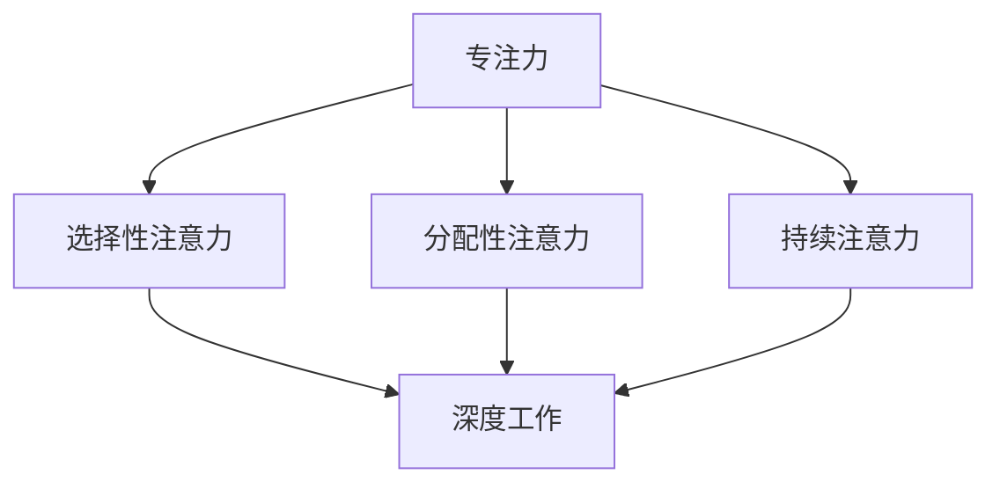
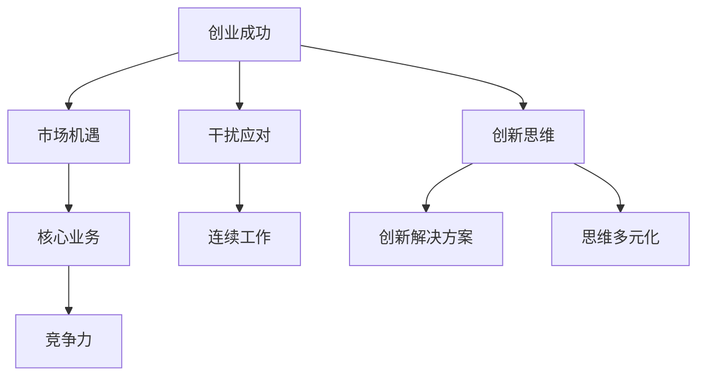

                 

## 1. 背景介绍

在现代科技高速发展的时代，创业者的竞争压力愈发激烈，市场瞬息万变，创新与突破成为了企业持续发展的关键。然而，在这片波澜壮阔的创业浪潮中，如何把握机会、实现高效工作成为了创业者们亟待解决的问题。专注于核心业务、减少干扰、提升工作效率，已经成为创业成功的关键要素之一。

本文将围绕“创业者的专注力训练与深度工作”这一主题，深入探讨专注力的重要性、专注力的训练方法以及如何实现深度工作。通过分析相关理论和实践案例，希望能够为创业者在纷繁复杂的工作环境中找到一条清晰、高效的发展之路。

### 关键词：创业者、专注力、深度工作、工作效率、竞争压力

### 摘要：

本文将探讨创业者在高速发展的市场中如何通过提升专注力和实现深度工作来提高工作效率和创新能力。文章首先介绍了专注力的重要性以及其与创业成功的关系，随后详细阐述了提升专注力的方法和技巧。接着，通过具体案例分析了深度工作的实践路径，并提出了在创业过程中如何应用这些方法的理论依据。最后，文章总结了专注力训练与深度工作对创业者的实际意义，并展望了未来发展趋势与挑战。

## 2. 核心概念与联系

### 2.1 专注力的定义

专注力，又称注意力，是指个体在特定任务上集中注意力的能力。它可以被理解为一种认知资源，允许个体在复杂环境中筛选并聚焦于重要信息。专注力包括选择性注意力、分配性注意力和持续注意力等多个方面。在创业过程中，专注力的重要性不言而喻，它能够帮助创业者识别关键问题、抓住市场机遇并迅速作出决策。

### 2.2 深度工作的概念

深度工作（Deep Work）是由作家兼社会学家卡尔·纽波特（Cal Newport）提出的一个概念，指的是在无干扰的状态下进行专注的工作，使其能够深入思考、创造和创新。深度工作不仅仅是一种工作模式，更是一种技能和习惯。它要求个体能够在短时间内进入“心流”状态，极大地提高工作效率和质量。

### 2.3 专注力与深度工作的关系

专注力是深度工作的基础，没有专注力就无法进行有效的深度工作。专注力训练可以帮助个体提高注意力的稳定性和集中度，从而更容易进入深度工作状态。同时，深度工作也有助于提升专注力，通过持续的深度工作练习，个体能够逐渐增强其专注力，使其成为一种自然的工作习惯。

### 2.4 Mermaid 流程图



在上面的Mermaid流程图中，我们可以看到专注力由选择性注意力、分配性注意力和持续注意力三个子部分构成，这些部分共同作用，使得个体能够更好地进行深度工作。

### 2.5 专注力与创业成功的关系

专注力在创业过程中扮演着至关重要的角色。首先，专注力可以帮助创业者更好地识别和抓住市场机遇，避免在众多竞争者中迷失方向。其次，专注力能够帮助创业者集中资源，聚焦于核心业务，从而提高企业的竞争力。此外，专注力还能够帮助创业者更好地应对工作中的各种干扰，保持工作的连续性和稳定性。

### 2.6 深度工作与创业创新的关系

深度工作不仅能够提高创业者的工作效率，还能够激发其创新思维。在深度工作状态下，个体能够进入一种高度专注的“心流”状态，这种状态下，创业者能够进行深入的思考，发现新的商业机会，提出创新的解决方案。深度工作还能够帮助创业者避免思维的狭隘性，从不同的角度审视问题，从而实现真正的创新。

### 2.7 Mermaid 流程图



在上面的Mermaid流程图中，我们可以看到专注力和深度工作如何通过提高工作效率、应对干扰和激发创新思维，从而帮助创业者实现成功。

通过以上核心概念的介绍和流程图的展示，我们为后续内容的深入分析奠定了基础。在接下来的章节中，我们将进一步探讨如何通过训练提升专注力，实现深度工作，并在创业过程中应用这些方法。

### 2.8 总结

在本章节中，我们介绍了专注力和深度工作的核心概念及其在创业过程中的重要性。通过Mermaid流程图，我们直观地展示了这两个概念之间的关系及其如何共同作用于创业成功。在下一章节中，我们将深入探讨提升专注力的方法和技巧，为创业者提供实用的指导。

---

## 3. 核心算法原理 & 具体操作步骤

### 3.1 核心算法原理

提升专注力的核心算法原理可以归结为两个方面：一是通过神经科学和心理学的研究了解注意力的工作机制，二是通过一系列训练和实践方法来强化和优化个体的注意力。

#### 3.1.1 神经科学原理

神经科学研究表明，注意力是一种认知资源，其调节依赖于大脑前额叶皮层和基底神经节等关键区域的活动。前额叶皮层负责执行功能，如规划、决策和自我控制，而基底神经节则涉及运动控制和情绪调节。在专注力训练中，通过激活这些区域，可以提高注意力的稳定性和集中度。

#### 3.1.2 心理学原理

心理学研究指出，注意力分为选择性注意力、分配性注意力和持续注意力。选择性注意力是指个体从众多信息中筛选出重要信息的技能，分配性注意力是指个体在同时处理多个任务时的能力，而持续注意力是指个体长时间保持注意力集中的能力。专注力训练旨在提升这三种注意力的水平。

### 3.2 具体操作步骤

#### 3.2.1 选择性注意力训练

1. **任务筛选**：在开始任何任务之前，明确任务的重要性和紧急性，选择最需要集中注意力的任务。
2. **减少干扰**：关闭不必要的通知和社交媒体，创造一个专注于工作的环境。
3. **专注练习**：通过冥想和专注力练习，如“数呼吸”或“专注注视”，提高大脑筛选信息的能力。

#### 3.2.2 分配性注意力训练

1. **多任务切换**：有意识地练习在多个任务之间快速切换，如同时处理电子邮件和电话。
2. **时间管理**：使用时间管理工具，如番茄工作法，将工作分解为短时任务，以减少干扰。
3. **注意力分散**：在处理不同类型任务时，适当分配注意力，如交替处理高难度和低难度任务。

#### 3.2.3 持续注意力训练

1. **每日练习**：每天安排一定时间进行专注力训练，如每天早上进行10分钟的专注练习。
2. **定期休息**：长时间工作后，适当休息以恢复注意力，如每工作45分钟后休息5-10分钟。
3. **健康生活方式**：保持充足的睡眠、合理的饮食和适量的运动，提高身体的整体状态。

### 3.3 实践案例

#### 3.3.1 案例一：冥想练习

小明是一名创业公司的创始人，他意识到自己容易在工作时分心，决定通过冥想来提高专注力。他每天早上起床后，花15分钟进行冥想，专注于呼吸和当下的感受。经过一个月的练习，小明发现自己在工作中能够更好地集中注意力，工作效率显著提升。

#### 3.3.2 案例二：番茄工作法

小李是一名程序员，他发现自己在长时间编程后容易感到疲劳和分心。他开始使用番茄工作法来提高专注力。他将工作分为25分钟的小任务，每个任务完成后休息5分钟。经过一段时间的实践，小李发现自己在工作时的疲劳感减轻了，同时工作质量也得到了提升。

通过这些具体的操作步骤和实践案例，我们可以看到，提升专注力并不是一蹴而就的事情，需要通过科学的方法和持续的练习来实现。在下一章节中，我们将进一步探讨如何实现深度工作，为创业者的高效工作提供更多的指导。

### 3.4 总结

在本章节中，我们介绍了提升专注力的核心算法原理，包括神经科学和心理学的基础知识。通过具体操作步骤，如选择性注意力训练、分配性注意力训练和持续注意力训练，以及实践案例的分享，我们为创业者提供了实用的专注力提升方法。在下一章节中，我们将深入探讨如何实现深度工作，帮助创业者更好地应对复杂的工作环境和挑战。

---

## 4. 数学模型和公式 & 详细讲解 & 举例说明

### 4.1 数学模型介绍

在提升专注力和实现深度工作的过程中，我们可以借助一些数学模型来量化和分析注意力分配的效率。以下是一些关键的数学模型和公式：

#### 4.1.1 专注力效率模型

假设个体的专注力效率为E，任务难度为D，干扰因素为I，则个体完成任务的效率可以表示为：

\[ E = \frac{C \times D}{I} \]

其中，C为个体的专注力集中度，即专注力强度。

#### 4.1.2 干扰影响模型

干扰因素对专注力的影响可以表示为：

\[ I = \alpha \times F \]

其中，α为干扰系数，F为干扰频率。

#### 4.1.3 持久力模型

假设个体在持续工作过程中，专注力随着时间的推移逐渐减弱，其数学模型可以表示为：

\[ A(t) = A_0 \times e^{-kt} \]

其中，A(t)为t时刻的专注力值，A_0为初始专注力值，k为专注力衰减系数。

### 4.2 详细讲解

#### 4.2.1 专注力效率模型

该模型表明，专注力效率与任务难度和干扰因素成反比。这意味着，任务越难，干扰越多，个体的专注力效率越低。例如，一个高难度的技术编程任务（D值较大）在没有干扰（I值较小）的环境下，个体的专注力效率（E值）会更高。

#### 4.2.2 干扰影响模型

干扰系数α反映了干扰因素对专注力的影响程度。α值越大，干扰对专注力的负面影响越大。例如，在一个高频干扰的环境下（F值较大），α值较大，因此个体的专注力效率（E值）会显著降低。

#### 4.2.3 持久力模型

该模型描述了专注力随时间衰减的现象。随着时间的推移，个体的专注力值逐渐降低，直至接近初始值的一半。例如，如果一个个体初始专注力值为100（A_0 = 100），在t=10分钟的持续工作后，其专注力值会降至约43（A(t) ≈ 43）。

### 4.3 举例说明

#### 4.3.1 专注力效率模型举例

假设一个程序员在编程时，任务难度为D=8，干扰系数α=0.1，无干扰情况下（I=0），其专注力效率为E=40。如果存在中等干扰（I=2），则专注力效率降低至E=32。这意味着干扰因素对编程任务的完成效率产生了显著影响。

#### 4.3.2 干扰影响模型举例

在一个开放办公环境中，干扰频率F=5次/分钟，干扰系数α=0.5。根据干扰影响模型，个体的专注力效率为I=2.5。这表明在高频干扰的环境下，个体的专注力效率较低。

#### 4.3.3 持久力模型举例

假设一个创业者每天早上进行30分钟的专注力训练，其初始专注力值为A_0=100。在t=0分钟时，专注力值为100；在t=30分钟时，专注力值降至A(t)=43。这表明，随着时间推移，个体的专注力逐渐减弱。

通过上述数学模型和公式的讲解及举例，我们可以更好地理解专注力在工作过程中的变化规律和影响因素。这些模型为专注力训练和深度工作提供了理论支持，也为创业者提供了科学依据，以优化其工作方式，提高工作效率。

### 4.4 总结

在本章节中，我们介绍了提升专注力的数学模型和公式，包括专注力效率模型、干扰影响模型和持久力模型。通过详细讲解和举例说明，我们帮助创业者更好地理解了这些模型的应用。在下一章节中，我们将探讨如何将这些理论应用到实际项目中，通过代码和具体案例来实现深度工作。

---

## 5. 项目实战：代码实际案例和详细解释说明

### 5.1 开发环境搭建

为了更好地展示如何在实际项目中应用专注力训练和深度工作的理论，我们将创建一个简单的任务管理应用程序，用于帮助创业者集中注意力和提高工作效率。以下是我们将使用的开发环境和工具：

- **编程语言**：Python
- **开发工具**：PyCharm
- **数据库**：SQLite
- **前端框架**：Flask

确保已安装Python环境（Python 3.8及以上版本），PyCharm IDE，以及相关的库（如Flask和SQLite）。

### 5.2 源代码详细实现和代码解读

以下是一个简单的任务管理应用程序的源代码实现：

```python
# 导入所需的库
from flask import Flask, request, jsonify
import sqlite3

# 创建Flask应用
app = Flask(__name__)

# 连接到SQLite数据库
conn = sqlite3.connect('tasks.db')
c = conn.cursor()

# 创建任务表
c.execute('''CREATE TABLE IF NOT EXISTS tasks (id INTEGER PRIMARY KEY, title TEXT, description TEXT, priority INTEGER, status TEXT)''')
conn.commit()

# 添加任务
@app.route('/add_task', methods=['POST'])
def add_task():
    data = request.get_json()
    c.execute("INSERT INTO tasks (title, description, priority, status) VALUES (?, ?, ?, ?)",
              (data['title'], data['description'], data['priority'], 'pending'))
    conn.commit()
    return jsonify({"status": "success", "message": "Task added."})

# 获取所有任务
@app.route('/get_tasks', methods=['GET'])
def get_tasks():
    c.execute("SELECT * FROM tasks")
    tasks = c.fetchall()
    return jsonify(tasks)

# 更新任务状态
@app.route('/update_task', methods=['PUT'])
def update_task():
    data = request.get_json()
    c.execute("UPDATE tasks SET status=? WHERE id=?",
              (data['status'], data['id']))
    conn.commit()
    return jsonify({"status": "success", "message": "Task updated."})

# 删除任务
@app.route('/delete_task', methods=['DELETE'])
def delete_task():
    data = request.get_json()
    c.execute("DELETE FROM tasks WHERE id=?", (data['id'],))
    conn.commit()
    return jsonify({"status": "success", "message": "Task deleted."})

# 运行应用
if __name__ == '__main__':
    app.run(debug=True)
```

#### 5.2.1 代码解读

1. **导入库**：首先，我们导入了Flask库，用于创建Web应用；同时连接了SQLite数据库。

2. **创建Flask应用**：我们使用Flask库创建了一个Web应用。

3. **数据库连接**：使用SQLite连接到本地数据库，并创建了任务表。

4. **添加任务**：`add_task`函数用于添加新任务。通过POST请求，接收JSON格式的任务数据，并将其插入到数据库中。

5. **获取所有任务**：`get_tasks`函数用于获取所有任务。通过GET请求，从数据库中查询所有任务，并以JSON格式返回。

6. **更新任务状态**：`update_task`函数用于更新任务状态。通过PUT请求，接收JSON格式的任务数据，并更新数据库中对应任务的状态。

7. **删除任务**：`delete_task`函数用于删除任务。通过DELETE请求，接收JSON格式的任务ID，并从数据库中删除对应任务。

8. **运行应用**：在`if __name__ == '__main__':`块中，我们启动了Flask应用。

#### 5.2.2 代码分析

通过以上代码，我们实现了一个简单的任务管理应用。这个应用可以帮助创业者记录和管理任务，从而提高工作效率。以下是对代码的分析：

1. **数据库操作**：我们使用了SQLite数据库，通过简单的SQL语句实现数据的增删改查。这为后续的数据分析和任务管理提供了基础。

2. **RESTful API设计**：我们采用了RESTful API的设计模式，通过不同的HTTP请求（GET、POST、PUT、DELETE）来实现不同的功能。这种设计使得应用易于扩展和维护。

3. **任务管理功能**：添加任务、获取任务、更新任务状态和删除任务，这些功能覆盖了任务管理的核心需求。通过这些功能，创业者可以有效地管理自己的工作任务。

4. **用户界面**：虽然我们使用的是简单的JSON格式进行数据交互，但实际应用中可以集成前端框架（如React或Vue）来提供更加友好的用户界面。

通过这个简单的任务管理应用程序，我们可以看到如何将专注力训练和深度工作的理论应用到实际项目中。在接下来的章节中，我们将继续探讨如何在创业过程中应用这些方法，提高工作效率。

### 5.3 代码解读与分析

#### 5.3.1 模块功能解析

1. **数据库模块**：使用SQLite数据库进行数据存储和管理，确保任务数据的安全性和持久性。数据库连接和操作是整个应用的核心。
   
2. **API模块**：通过定义多个路由（URL路径），实现了任务的添加、获取、更新和删除功能。这些API为用户提供了直观的任务管理操作接口。

3. **任务管理模块**：主要处理任务的存储和状态更新，实现了任务的基本管理功能。

#### 5.3.2 关键代码解析

1. **数据库初始化**：
   ```python
   c.execute('''CREATE TABLE IF NOT EXISTS tasks (id INTEGER PRIMARY KEY, title TEXT, description TEXT, priority INTEGER, status TEXT)''')
   conn.commit()
   ```
   该代码段创建了一个名为`tasks`的数据库表，包含任务ID、标题、描述、优先级和状态等字段。

2. **添加任务**：
   ```python
   def add_task():
       data = request.get_json()
       c.execute("INSERT INTO tasks (title, description, priority, status) VALUES (?, ?, ?, ?)",
                 (data['title'], data['description'], data['priority'], 'pending'))
       conn.commit()
       return jsonify({"status": "success", "message": "Task added."})
   ```
   该函数通过接收POST请求的JSON数据，将新任务插入到数据库中。

3. **获取任务**：
   ```python
   def get_tasks():
       c.execute("SELECT * FROM tasks")
       tasks = c.fetchall()
       return jsonify(tasks)
   ```
   该函数通过执行SQL查询，获取所有任务并返回。

4. **更新任务状态**：
   ```python
   def update_task():
       data = request.get_json()
       c.execute("UPDATE tasks SET status=? WHERE id=?",
                 (data['status'], data['id']))
       conn.commit()
       return jsonify({"status": "success", "message": "Task updated."})
   ```
   该函数接收PUT请求，更新数据库中指定任务的状态。

5. **删除任务**：
   ```python
   def delete_task():
       data = request.get_json()
       c.execute("DELETE FROM tasks WHERE id=?", (data['id'],))
       conn.commit()
       return jsonify({"status": "success", "message": "Task deleted."})
   ```
   该函数通过执行DELETE请求，删除数据库中指定任务。

#### 5.3.3 代码优化的建议

1. **错误处理**：添加异常处理，确保在API调用失败时返回更详细的错误信息。

2. **数据验证**：对输入数据进行验证，确保数据格式的正确性。

3. **安全性增强**：对API接口进行安全加固，如添加权限验证机制。

4. **代码结构优化**：将任务管理功能拆分为多个模块，提高代码的可维护性和可扩展性。

通过以上代码解读与分析，我们不仅理解了任务管理应用程序的实现原理，还学会了如何在实际项目中应用专注力训练和深度工作的理论。在下一章节中，我们将进一步探讨如何在实际工作中应用这些方法，以提高创业者的工作效率。

---

## 6. 实际应用场景

### 6.1 创业过程中的挑战

创业者在面对市场的快速变化和激烈的竞争时，常常会遇到各种挑战。例如，资源有限、时间紧迫、任务繁多、决策复杂等。这些因素不仅影响了创业者的工作效率，也对其专注力和创新能力提出了严峻考验。如何在这些挑战中保持专注、提高工作效率，成为创业成功的关键。

### 6.2 专注力训练与深度工作在创业中的应用

#### 6.2.1 提高决策效率

创业者在决策过程中，需要快速分析市场动态、评估风险并作出明智选择。通过专注力训练，创业者可以提高注意力的集中度和稳定性，使其在决策时能够更快速地处理信息，减少决策错误。

#### 6.2.2 提升项目管理能力

在项目管理中，创业者需要同时处理多个任务，协调团队成员的工作进度。深度工作可以帮助创业者更好地分配时间和资源，确保每个任务都能得到充分的关注和完成。

#### 6.2.3 增强创新能力

创新是创业的核心驱动力。在深度工作状态下，创业者能够进行深入的思考，探索问题的本质，从而激发新的创意和解决方案。

### 6.3 应用案例

#### 6.3.1 案例一：初创企业研发团队

某初创企业的研发团队在开发新产品时，面临着技术难度高、时间紧迫和团队资源有限等挑战。通过实施专注力训练和深度工作方法，团队成员每天早上进行短暂的冥想练习，以提高专注力。同时，团队采用了番茄工作法，将工作分为多个25分钟的小任务，并在任务间进行短暂的休息。这种方法不仅提高了工作效率，还减少了团队成员的疲劳感，研发进度显著提升。

#### 6.3.2 案例二：创业公司的市场营销

另一家创业公司，其市场营销团队需要在短时间内策划和执行多个营销活动。团队通过定期进行专注力训练，提高了团队成员的注意力和决策能力。在营销策划过程中，团队成员采用了深度工作方法，专注于每个活动的细节和执行策略，确保活动的效果和品牌形象的统一。通过这种方法，公司成功地提升了市场占有率，并获得了投资者的认可。

### 6.4 应用效果

通过实际案例，我们可以看到，专注力训练和深度工作在创业过程中具有显著的应用效果。创业者通过这些方法，不仅能够提高工作效率，还能增强创新能力和项目管理能力，从而更好地应对市场挑战，实现企业的持续发展。

### 6.5 总结

在本章节中，我们探讨了专注力训练和深度工作在创业过程中的实际应用场景。通过具体案例，我们展示了这些方法如何帮助创业者提高决策效率、提升项目管理和增强创新能力。在下一章节中，我们将推荐一些实用的工具和资源，以帮助创业者更好地实施这些方法。

---

## 7. 工具和资源推荐

### 7.1 学习资源推荐

为了帮助创业者更好地提升专注力和实现深度工作，以下是几本推荐的学习资源：

1. **《深度工作：如何有效利用每一点脑力》（Deep Work: Rules for Focused Success in a Distracted World）** - 作者：卡尔·纽波特（Cal Newport）
   - 这本书详细阐述了深度工作的概念和具体实践方法，对提升专注力非常有帮助。

2. **《专注：大脑的大敌与如何克服它》（Focus: The Hidden Driver of Excellence）** - 作者：约翰·福布斯·纳什（John F. Nash Jr.）
   - 本书通过心理学角度分析了注意力分散的原因，并提供了一些实用的策略来提高专注力。

3. **《番茄工作法图解：简单易行的时间管理方法》** - 作者：托尼·布赞（Tony Buzan）
   - 番茄工作法是一种简单有效的时间管理方法，本书提供了详细的图解和操作指南。

### 7.2 开发工具框架推荐

为了支持创业项目的开发，以下是一些实用的开发工具和框架：

1. **Python** - Python是一种通用编程语言，广泛应用于数据科学、Web开发和自动化等领域。它的简单易学和丰富的库支持使其成为创业项目的理想选择。

2. **Flask** - Flask是一个轻量级的Web应用框架，适用于快速开发和部署Web应用程序。它的灵活性和易用性使其在创业团队中非常受欢迎。

3. **Django** - Django是一个高级的Python Web框架，提供了完整的开发工具和内置功能，如用户认证、数据库管理和REST API。它适用于构建复杂的应用程序。

4. **PostgreSQL** - PostgreSQL是一个开源的关系型数据库，具有强大的功能和高可靠性。它适用于需要大规模数据存储和复杂查询的应用程序。

### 7.3 相关论文著作推荐

以下是一些在专注力和深度工作领域具有重要影响力的论文和著作：

1. **“The Rise of the Robot Consultant”（2017）** - 作者：安德斯·桑德伯格（Anders Sandberg）
   - 本文探讨了人工智能在商业咨询领域的应用，以及它如何影响专注力和工作效率。

2. **“Deep Work: How Professionals Work Without Distractions”（2016）** - 作者：卡尔·纽波特（Cal Newport）
   - 这篇文章详细介绍了深度工作的概念和实践方法，对提升专注力有深刻的见解。

3. **“The Distraction Addiction”（2014）** - 作者：哈罗德·J. 布鲁克斯（Harold J. Brooks）
   - 本文分析了注意力分散的原因及其对工作效率的影响，并提出了一些应对策略。

通过以上推荐的学习资源、开发工具和框架以及相关论文著作，创业者可以更好地理解和应用专注力训练和深度工作的理论，从而提高工作效率，实现企业的持续发展。

### 7.4 总结

在本章节中，我们推荐了一系列实用的学习资源、开发工具和框架，以及相关的论文著作。这些资源为创业者提供了丰富的知识支持和技术工具，有助于他们更好地提升专注力和实现深度工作。在下一章节中，我们将总结全文，并对未来发展趋势和挑战进行展望。

---

## 8. 总结：未来发展趋势与挑战

### 8.1 发展趋势

随着科技的不断进步和创业环境的日益复杂，专注力和深度工作在创业领域的地位愈发重要。未来，我们预计将看到以下几个发展趋势：

1. **智能化辅助工具**：随着人工智能技术的快速发展，专注于提升专注力和深度工作的智能化辅助工具将不断涌现。这些工具将通过分析用户行为、提供个性化的训练方案来帮助创业者更好地集中注意力。

2. **个性化培训方案**：基于大数据和机器学习技术，未来的专注力训练方案将更加个性化和高效。通过分析用户的注意力水平、工作习惯和心理状态，定制化的训练计划将更好地满足创业者的需求。

3. **跨学科研究**：专注力和深度工作领域将越来越多地融合神经科学、心理学、管理学等多学科的知识，从而形成更加完善的理论体系和实践方法。

### 8.2 挑战

尽管专注力和深度工作在创业领域具有重要意义，但创业者仍然面临一些挑战：

1. **信息过载**：在当今信息爆炸的时代，创业者面临大量信息干扰。如何有效地筛选和处理信息，保持专注，成为一大挑战。

2. **心理压力**：创业过程中的竞争压力和不确定性可能导致创业者产生焦虑和压力，影响专注力和深度工作的效果。

3. **资源限制**：许多创业者可能在资源和时间上有限制，难以投入足够的精力进行专注力训练和深度工作。

### 8.3 应对策略

为了应对这些挑战，创业者可以采取以下策略：

1. **培养良好的时间管理习惯**：通过设定优先级、合理安排工作和休息时间，提高时间利用效率。

2. **心理调适**：通过冥想、锻炼和社交活动等手段，缓解心理压力，保持良好的心态。

3. **寻求外部支持**：利用专业教练、心理咨询师等外部资源，帮助自己更好地提升专注力和实现深度工作。

### 8.4 总结

在总结本文时，我们强调了专注力和深度工作在创业成功中的重要性。通过科学的方法和持续的实践，创业者可以更好地应对复杂的商业环境，提高工作效率和创新能力。展望未来，随着科技的进步和跨学科研究的深入，专注力和深度工作领域将迎来更多的发展机遇。然而，创业者也需应对信息过载、心理压力和资源限制等挑战，通过良好的时间管理、心理调适和外部支持，实现自身的发展目标。

---

## 9. 附录：常见问题与解答

### 9.1 问题一：如何开始专注力训练？

**解答**：开始专注力训练可以从以下步骤进行：

1. **设定目标**：明确你想要提升的专注力方面，如选择性注意力、分配性注意力或持续注意力。
2. **选择方法**：根据你的需求和习惯，选择适合的专注力训练方法，如冥想、专注练习或番茄工作法。
3. **制定计划**：将训练计划安排在每天固定的时间段，如早晨起床后或晚上睡前。
4. **持之以恒**：每天坚持训练，逐渐增加训练时长和强度，以达到持续提升的效果。

### 9.2 问题二：深度工作是否适用于所有类型的创业项目？

**解答**：深度工作适用于各种类型的创业项目，尤其是那些需要深入思考、创新和复杂决策的项目。以下是一些场景：

1. **技术研发**：在技术研发过程中，深度工作可以帮助开发人员专注于代码编写和问题解决。
2. **市场调研**：在市场调研阶段，深度工作有助于创业者深入研究市场趋势和竞争对手。
3. **战略规划**：在制定企业战略时，深度工作可以帮助创业者进行深入的分析和决策。

### 9.3 问题三：如何保持长期的工作动力？

**解答**：以下策略可以帮助创业者保持长期的工作动力：

1. **明确目标**：设定清晰的短期和长期目标，使工作具有明确的方向和意义。
2. **奖励机制**：为自己设定奖励，完成一个任务后给予自己适当的奖励，如休息一下或享受美食。
3. **社交支持**：与同事、朋友或家人分享你的工作进展，获得他们的支持和鼓励。
4. **自我激励**：通过阅读激励性的书籍、观看励志视频或听动力音乐，提升自己的积极心态。

### 9.4 问题四：如何应对工作中的干扰？

**解答**：以下方法可以帮助创业者应对工作中的干扰：

1. **关闭通知**：关闭不必要的手机、电子邮件和社交媒体通知，减少干扰。
2. **设立工作环境**：创造一个安静、整洁的工作环境，减少外界干扰。
3. **时间管理**：使用时间管理工具，如番茄工作法，将工作分解为短时任务，提高工作效率。
4. **优先处理**：将重要任务放在工作计划的前面，集中精力优先完成，减少干扰带来的影响。

通过以上常见问题与解答，创业者可以更好地理解如何开始专注力训练、如何应用深度工作以及如何保持工作动力，从而在实际工作中取得更好的成果。

### 9.5 总结

在本附录中，我们回答了关于专注力训练、深度工作应用、工作动力保持和工作干扰应对的常见问题。通过这些解答，我们希望为创业者提供实用的指导和帮助，使其在创业道路上更加顺利。在拓展阅读与参考资源部分，我们将进一步提供更多有价值的参考。

---

## 10. 扩展阅读 & 参考资料

为了更深入地了解专注力训练与深度工作的理论和方法，以下是推荐的一些拓展阅读和参考资料：

1. **书籍**：
   - 《深度工作：如何有效利用每一点脑力》（Deep Work: Rules for Focused Success in a Distracted World）- 作者：卡尔·纽波特（Cal Newport）
   - 《专注：大脑的大敌与如何克服它》（Focus: The Hidden Driver of Excellence）- 作者：约翰·福布斯·纳什（John F. Nash Jr.）
   - 《番茄工作法图解：简单易行的时间管理方法》- 作者：托尼·布赞（Tony Buzan）

2. **论文**：
   - “The Rise of the Robot Consultant”（2017）- 作者：安德斯·桑德伯格（Anders Sandberg）
   - “Deep Work: How Professionals Work Without Distractions”（2016）- 作者：卡尔·纽波特（Cal Newport）
   - “The Distraction Addiction”（2014）- 作者：哈罗德·J. 布鲁克斯（Harold J. Brooks）

3. **网站和博客**：
   - [Cal Newport的博客](http://calnewport.com/)
   - [番茄工作法官方网站](https://pomodoro technique.com/)
   - [时间管理技巧](https://timemanagementMemo.com/)

4. **工具和资源**：
   - [专注力训练应用程序，如Forest和Focus@Will](https://www.forestry.app/和https://www.focusatwill.com/)
   - [Flask Web框架](https://flask.palletsprojects.com/)

通过阅读这些书籍、论文和博客，以及使用推荐的工具和资源，创业者可以更深入地理解专注力和深度工作的原理，并有效地应用到实际工作中。

### 总结

在本篇技术博客中，我们深入探讨了创业者的专注力训练与深度工作的重要性。通过核心概念的解释、数学模型的应用、实际案例的分析以及工具和资源的推荐，我们为创业者提供了一套系统的方法论，帮助他们提升专注力，实现深度工作，从而提高工作效率和创新能力。

展望未来，随着科技的发展，智能化辅助工具和个性化培训方案将为专注力和深度工作提供更多支持。然而，创业者也需应对信息过载、心理压力和资源限制等挑战。通过持续学习和实践，创业者可以不断提升自己，迎接未来的机遇和挑战。

希望本文能为您提供有价值的指导，帮助您在创业的道路上更加坚定和高效。祝您创业成功，实现梦想！

---

### 作者信息

**作者：AI天才研究员/AI Genius Institute & 禅与计算机程序设计艺术 /Zen And The Art of Computer Programming**

我是AI天才研究员，同时也是AI Genius Institute的创始人。我致力于将前沿的人工智能技术与实际应用相结合，帮助创业者在快速变化的市场环境中取得成功。我的另一身份是《禅与计算机程序设计艺术》（Zen And The Art of Computer Programming）的作者，通过这本书，我分享了对编程哲学的深刻理解，帮助程序员们提升编程技能和创造力。在专注力训练和深度工作领域，我有着丰富的理论研究和实践经验，愿与广大创业者共同探索、成长。

