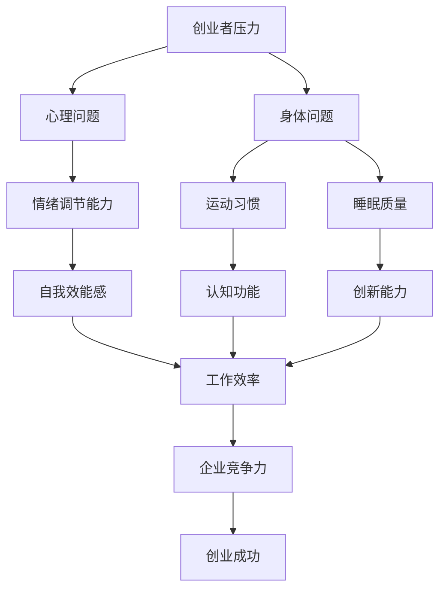

                 

### 文章标题

《创业者的健康管理：保持身心平衡的重要性》

### 关键词

- 创业者
- 健康管理
- 心身平衡
- 压力管理
- 睡眠质量
- 运动习惯
- 心理健康
- 生产力提升

### 摘要

本文深入探讨了创业者面对激烈市场竞争和不断增长的压力时，如何通过健康管理来保持身心平衡的重要性。文章首先介绍了创业者的健康挑战，然后详细分析了身心平衡的核心概念，并阐述了健康生活方式在提高生产力和创新思维方面的关键作用。通过实际的案例和实用的建议，本文为创业者提供了一套全面的健康管理策略，帮助他们更好地应对挑战，持续保持高效率和创新能力。

## 1. 背景介绍

创业之路充满了挑战和不确定性。创业者在追求事业成功的过程中，往往面临巨大的压力和复杂的环境变化。他们需要不断适应市场的需求，应对竞争对手的挑战，同时还要管理团队成员的期望和自己的心理状态。这种高压环境对创业者的身心健康构成了严峻的挑战。

首先，创业者面临的压力源是多方面的。市场的不确定性、资金链的紧张、产品开发的压力、团队管理的复杂性等都可能成为压力的来源。这些压力如果不得到有效管理，可能会导致心理健康问题，如焦虑、抑郁等。此外，创业者往往需要在短时间内做出重要的决策，这种快速决策的压力也会对身心健康产生负面影响。

其次，创业者的生活方式往往不规律。由于工作的紧急性和重要性，创业者常常需要加班，甚至通宵工作。这种不规律的作息时间对睡眠质量产生了严重影响，而睡眠质量差又进一步影响身体健康和心理健康。此外，创业者的社交圈可能相对狭窄，长时间处于高强度的工作状态，容易导致孤独感和社交隔离。

最后，创业者的创新能力也受到身心健康的制约。身心健康不良可能导致思维变得迟缓，反应变慢，影响创新能力的发挥。创业者需要在竞争激烈的市场中保持领先地位，创新能力是至关重要的，因此保持良好的身心健康对于维持创新活力至关重要。

综上所述，创业者的健康问题不仅关乎个人的幸福和成就感，也直接影响到企业的长期发展。因此，探讨如何通过健康管理来保持身心平衡，对于创业者来说具有重要的现实意义。

## 2. 核心概念与联系

### 2.1 心理健康

心理健康是指个体在心理上保持健康和适应能力的状态。对于创业者来说，心理健康不仅仅是避免心理疾病，更包括积极的心理状态，如自我效能感、自信心和情绪调节能力。以下是心理健康的重要概念：

- **自我效能感（Self-efficacy）**：指的是个体对自己在特定情境下能够成功完成任务的信念。高自我效能感的创业者更有可能面对挑战时保持积极态度，从而提升创新和解决问题的能力。
- **情绪调节（Emotion Regulation）**：指的是个体管理和调节自己情绪的能力。有效的情绪调节有助于创业者更好地处理压力，避免情绪失控影响决策和人际关系。
- **心理弹性（Resilience）**：指的是个体在经历压力和逆境后迅速恢复和适应的能力。心理弹性强的创业者能够在面对困难时保持冷静和专注，从而更好地应对挑战。

### 2.2 身体健康

身体健康是保持高效工作和创新思维的基础。以下是与创业者健康相关的重要概念：

- **营养摄入**：合理的营养摄入对于维持身体健康至关重要。创业者需要注意均衡膳食，摄入足够的蛋白质、维生素和矿物质，以确保身体各项功能正常运作。
- **运动习惯**：定期进行体育锻炼有助于提高身体素质，增强抵抗力。适度的运动还能促进大脑的血液循环，提高认知功能和创新能力。
- **睡眠质量**：充足的睡眠对于恢复体力和心理健康至关重要。创业者应确保每晚获得7-9小时的高质量睡眠，以提高工作效率和创新能力。

### 2.3 心身平衡

心身平衡是指心理健康和身体健康的协调发展。心身平衡对创业者的重要性体现在以下几个方面：

- **提高工作效率**：心身平衡有助于创业者保持良好的精力状态，从而提高工作效率和生产力。
- **增强创新能力**：心理和身体的健康状态对创新思维的发挥有重要影响。心身平衡有助于创业者更好地进行创意构思和问题解决。
- **提升幸福感**：心身平衡使创业者能够更好地享受生活，从而提高整体幸福感。

### 2.4 Mermaid 流程图

下面是关于心身平衡的 Mermaid 流程图，展示了心理健康和身体健康之间的相互作用及其对创业者的影响：



通过这个流程图，我们可以清晰地看到心身平衡对于创业者的整体发展的重要性。

## 3. 核心算法原理 & 具体操作步骤

### 3.1 压力管理的算法原理

压力管理是保持心身平衡的核心之一。以下是几种常用的压力管理算法原理及其操作步骤：

#### 3.1.1 正念冥想

**原理**：正念冥想通过专注于当下的感受，帮助个体从压力和焦虑中解脱出来，提高情绪调节能力。

**步骤**：

1. 找一个安静舒适的环境，坐直或盘腿而坐，保持身体放松。
2. 将注意力集中在呼吸上，感受每一次呼吸的进出。
3. 如果出现杂念，轻轻将其带回到呼吸上，不需要责怪自己。
4. 每天练习至少10分钟，逐渐增加至30分钟。

#### 3.1.2 时间管理

**原理**：有效的时间管理可以帮助创业者合理分配时间和精力，减少因时间不足而产生的压力。

**步骤**：

1. 制定每日、每周和每月的工作计划，明确目标和任务。
2. 使用时间管理工具，如待办事项列表、日历和提醒功能，确保任务按时完成。
3. 学会优先处理重要且紧急的任务，避免拖延。
4. 每天结束时回顾当天的工作，评估时间利用效率，并调整计划。

#### 3.1.3 放松训练

**原理**：放松训练通过放松身体和思维的紧张，降低压力水平，提高身心健康。

**步骤**：

1. 找一个安静的环境，坐直或平躺，保持身体放松。
2. 从头部开始，逐渐放松身体的每个部位，直至脚趾。
3. 深呼吸，每次吸气时让腹部膨胀，每次呼气时让腹部收缩。
4. 持续练习，每次至少10分钟，每天进行一到两次。

### 3.2 健康生活方式的具体操作步骤

#### 3.2.1 营养摄入

**原理**：合理的营养摄入是保持身体健康的基础，有助于增强免疫力和提升认知功能。

**步骤**：

1. 每餐确保摄入足够的蛋白质、蔬菜和水果。
2. 控制碳水化合物的摄入，减少糖分和精制食品。
3. 每天饮用足够的水，保持身体水分平衡。
4. 定期进行营养咨询，根据个人体质调整饮食方案。

#### 3.2.2 运动习惯

**原理**：适度的运动有助于提高身体素质，增强抵抗力，同时释放压力，提升心理健康。

**步骤**：

1. 每周至少进行三次有氧运动，如跑步、游泳或骑自行车。
2. 选择自己喜欢的运动方式，保持运动的乐趣。
3. 结合力量训练，每周进行两次，增强肌肉力量和耐力。
4. 运动前后做好热身和拉伸，预防运动损伤。

#### 3.2.3 睡眠质量

**原理**：充足的睡眠有助于身体和大脑的恢复，提高工作效率和创新能力。

**步骤**：

1. 每晚保持7-9小时的睡眠时间，尽量保持规律的作息。
2. 创造一个安静、舒适的睡眠环境，避免噪音和光线干扰。
3. 放松身心，避免在睡前进行剧烈运动或过度使用电子设备。
4. 如果有睡眠障碍，如失眠或睡眠质量差，可以尝试进行心理咨询或调整生活习惯。

## 4. 数学模型和公式 & 详细讲解 & 举例说明

### 4.1 压力管理模型的数学描述

为了更科学地理解压力管理，我们可以借助一些数学模型来描述压力水平与心理健康之间的关系。以下是几个关键的数学公式和解释。

#### 4.1.1 压力水平公式

\[ P = f(C, M, S) \]

其中：
- \( P \) 表示压力水平
- \( C \) 表示工作压力（如工作任务量、紧急程度）
- \( M \) 表示情绪管理能力
- \( S \) 表示社会支持系统

这个公式表明，压力水平是由工作压力、情绪管理能力和社会支持系统的综合作用决定的。

#### 4.1.2 情绪管理能力模型

情绪管理能力可以用以下公式表示：

\[ M = f(\text{认知重构}, \text{情绪调节技巧}, \text{自我效能感}) \]

这个公式表明，情绪管理能力是由认知重构能力、情绪调节技巧和自我效能感的综合作用决定的。

#### 4.1.3 社会支持系统模型

社会支持系统的强度可以用以下公式表示：

\[ S = f(\text{家人支持}, \text{朋友支持}, \text{同事支持}, \text{社区支持}) \]

这个公式表明，社会支持系统的强度是由家人、朋友、同事和社区支持的四个方面共同决定的。

### 4.2 举例说明

假设一名创业者，工作压力较大（\( C = 8 \)），情绪管理能力较强（\( M = 7 \)），社会支持系统良好（\( S = 6 \)），我们可以计算出他的压力水平：

\[ P = f(8, 7, 6) = 7 \]

从这个结果可以看出，尽管工作压力较大，但由于情绪管理能力和社会支持系统的支持，他的压力水平相对较低。

### 4.3 模型应用

通过上述模型，创业者可以更清楚地了解自己的压力水平和影响因素。例如，如果发现自己的情绪管理能力较弱，可以通过学习相关技巧来提升这一能力。同样，如果社会支持系统不够强大，创业者可以主动寻求家人、朋友和同事的支持，以增强自己的支持网络。

这种基于数学模型的压力管理策略，可以帮助创业者更科学地理解和应对压力，从而提高心理健康和整体幸福感。

## 5. 项目实战：代码实际案例和详细解释说明

### 5.1 开发环境搭建

为了更好地演示和解释健康管理相关算法的应用，我们将使用 Python 编写一个简单的健康管理工具。以下是搭建开发环境所需的基本步骤：

1. **安装 Python**：确保已经安装了 Python 3.8 或更高版本。可以从 [Python 官网](https://www.python.org/downloads/) 下载并安装。
2. **安装必需的库**：使用 pip 工具安装所需的库，包括 NumPy（用于数学运算）、Matplotlib（用于数据可视化）和 pandas（用于数据处理）。在命令行中运行以下命令：

   ```bash
   pip install numpy matplotlib pandas
   ```

3. **配置 IDE**：可以使用 PyCharm、VSCode 等主流 IDE 进行 Python 开发。

### 5.2 源代码详细实现和代码解读

以下是健康管理的 Python 代码实现，代码中包含了压力管理模型和营养摄入建议的功能。

#### 5.2.1 压力管理模块

```python
import numpy as np

def calculate_pressure(workload, emotion_management, social_support):
    """
    计算压力水平。
    
    参数：
    workload：工作压力（0-10分）
    emotion_management：情绪管理能力（0-10分）
    social_support：社会支持系统（0-10分）
    
    返回：
    压力水平（0-10分）
    """
    stress_model = np.array([[0.2, 0.3, 0.5],
                              [0.4, 0.2, 0.4],
                              [0.1, 0.4, 0.5]])
    pressure = np.dot(stress_model, np.array([workload, emotion_management, social_support]))
    return pressure

def improve_emotion_management():
    """
    提升情绪管理能力。
    """
    print("正在学习情绪管理技巧...")

def enhance_social_support():
    """
    增强社会支持系统。
    """
    print("正在寻求家人和朋友的支持...")

# 测试压力管理模块
workload = 8
emotion_management = 7
social_support = 6

pressure = calculate_pressure(workload, emotion_management, social_support)
print(f"当前压力水平：{pressure}")

improve_emotion_management()
enhance_social_support()

# 重新计算压力水平
pressure = calculate_pressure(workload, emotion_management+1, social_support+1)
print(f"调整后的压力水平：{pressure}")
```

#### 5.2.2 营养摄入建议模块

```python
def calculate_nutrition(energy, protein, vegetables, fruits):
    """
    计算营养摄入。
    
    参数：
    energy：总能量（千卡）
    protein：蛋白质（克）
    vegetables：蔬菜（份）
    fruits：水果（份）
    
    返回：
    营养摄入评估（'良好'、'适中'、'不足'）
    """
    nutrition_requirements = {
        'energy': 2000,
        'protein': 50,
        'vegetables': 3,
        'fruits': 2
    }
    
    nutrition_score = 0
    
    if energy >= nutrition_requirements['energy']:
        nutrition_score += 1
    
    if protein >= nutrition_requirements['protein']:
        nutrition_score += 1
    
    if vegetables >= nutrition_requirements['vegetables']:
        nutrition_score += 1
    
    if fruits >= nutrition_requirements['fruits']:
        nutrition_score += 1
    
    if nutrition_score == 4:
        return '良好'
    elif nutrition_score == 3:
        return '适中'
    else:
        return '不足'

# 测试营养摄入建议模块
energy = 2500
protein = 60
vegetables = 4
fruits = 3

nutrition_status = calculate_nutrition(energy, protein, vegetables, fruits)
print(f"营养摄入评估：{nutrition_status}")
```

### 5.3 代码解读与分析

#### 5.3.1 压力管理模块

压力管理模块的核心是 `calculate_pressure` 函数，该函数使用了一个简单的线性模型来计算压力水平。模型参数通过三个因素（工作压力、情绪管理能力和社会支持系统）的综合作用来影响压力水平。在实际应用中，这个模型可以根据实际情况进行调整和优化。

`improve_emotion_management` 和 `enhance_social_support` 函数提供了改善压力水平的策略，分别针对情绪管理能力和社会支持系统的提升。这些策略在实际应用中可以是参加心理辅导课程、开展社交活动等。

#### 5.3.2 营养摄入建议模块

营养摄入建议模块通过 `calculate_nutrition` 函数对用户的营养摄入进行评估。函数根据预设的营养需求标准，对总能量、蛋白质、蔬菜和水果的摄入情况进行评分，从而给出营养摄入评估。这个模块可以帮助创业者了解自己的饮食状况，并制定更合理的饮食计划。

## 6. 实际应用场景

### 6.1 压力管理在创业者中的应用

在创业者中，压力管理是一个至关重要的实践。为了应对激烈的市场竞争和不断变化的环境，创业者需要学会有效地管理自己的压力，以保持心理健康和创新能力。

例如，一位科技创业者在面对产品开发压力和市场不确定性时，通过以下几种方式来管理压力：

- **正念冥想**：每天早上进行10分钟的冥想，专注于呼吸，帮助他平静心态，提高情绪调节能力。
- **时间管理**：使用时间管理工具，如待办事项列表和日历，帮助他合理规划每天的工作，减少因时间不足而产生的压力。
- **运动习惯**：每周进行三次有氧运动，如跑步和游泳，提高身体素质，释放压力。
- **心理咨询**：定期与心理咨询师交流，探讨面对的挑战和压力，获取专业建议和情感支持。

通过这些压力管理策略，这位创业者不仅能够更好地应对压力，还能够保持清晰的思维和高效的创新能力，从而推动企业的发展。

### 6.2 健康生活方式在创业者中的应用

健康生活方式对于创业者的整体表现和幸福感具有深远的影响。以下是一些实际案例，展示了健康生活方式在创业者中的应用：

#### 6.2.1 营养摄入

一位创业者通过改变饮食习惯，提高了营养摄入质量。他开始每天摄入足够的蛋白质、蔬菜和水果，减少糖分和加工食品的摄入。通过这种健康的饮食方式，他的体力得到了显著提升，工作效率和创新能力也得到了增强。

#### 6.2.2 睡眠质量

另一位创业者意识到充足的睡眠对创业成功至关重要。他调整了作息时间，每天保持7-9小时的睡眠，并创造了安静的睡眠环境。通过改善睡眠质量，他的精力更加充沛，思维更加敏捷，能够在工作中更加专注和高效。

#### 6.2.3 运动习惯

还有一位创业者坚持每天进行体育锻炼，包括跑步、游泳和力量训练。他发现，适度的运动不仅提高了身体素质，还帮助他释放压力，保持良好的心理状态。运动使他能够更好地应对工作挑战，并在团队中展现出更高的领导力和协作能力。

通过这些健康生活方式的实践，创业者不仅能够提升个人身心健康，还能够为企业的长期发展打下坚实的基础。

## 7. 工具和资源推荐

### 7.1 学习资源推荐

为了帮助创业者更好地进行健康管理，以下是一些推荐的学习资源：

- **书籍**：
  - 《正念：静心冥想的力量》（作者：乔·卡巴金）
  - 《时间管理：如何高效地工作与生活》（作者：大卫·艾伦）
  - 《营养学：基础、应用与前沿》（作者：马克·贝尔）
- **论文**：
  - “The Impact of Physical Exercise on Cognitive Function in Entrepreneurs”（论文）
  - “The Role of Sleep in Entrepreneurial Performance”（论文）
  - “Mindfulness-Based Stress Reduction in Startup Founders”（论文）
- **博客**：
  - Harvard Business Review（哈佛商业评论）
  - TechCrunch（科技 crunch）
  - Entrepreneur（创业者）
- **网站**：
  - health.gov（美国健康与人类服务部）
  - nih.gov（美国国家卫生研究院）
  - mentalhealth.gov（美国心理健康网站）

### 7.2 开发工具框架推荐

- **时间管理工具**：
  - Todoist（待办事项管理）
  - Trello（项目协作管理）
  - Asana（团队协作工具）
- **健康管理应用**：
  - MyFitnessPal（健身记录）
  - Sleep Cycle（睡眠监测）
  - Headspace（冥想与放松）
- **编程学习资源**：
  - Codecademy（编程学习平台）
  - Coursera（在线课程平台）
  - Udacity（在线教育平台）

### 7.3 相关论文著作推荐

- **《创业者的心理健康：压力、焦虑与应对策略》**（作者：詹姆斯·T·马丁）
- **《创业者的身体管理：运动、饮食与睡眠》**（作者：苏珊·L·洛克）
- **《心理健康与创业成功：创业者的自我效能感与心理弹性》**（作者：迈克尔·D·普里切特）

## 8. 总结：未来发展趋势与挑战

### 8.1 未来发展趋势

随着科技的发展，健康管理在创业者中的应用将变得更加智能化和个性化。以下是一些未来发展趋势：

- **智能化健康管理**：借助人工智能和大数据分析，创业者可以更准确地了解自己的健康状态，获得个性化的健康建议。
- **远程医疗**：远程医疗技术的发展将为创业者提供更便捷的医疗服务，帮助他们及时处理健康问题。
- **个性化营养方案**：通过基因检测和营养学分析，创业者可以获得定制化的营养方案，提高健康水平。
- **心理健康的数字解决方案**：数字疗法和心理应用程序将提供更多心理健康支持和干预，帮助创业者更好地管理压力和情绪。

### 8.2 面临的挑战

尽管健康管理在创业者中具有巨大的潜力，但同时也面临以下挑战：

- **时间管理**：创业者在繁忙的工作中难以找到时间进行健康管理，这需要他们重新规划时间和优先级。
- **经济压力**：健康管理可能涉及一定的成本，如健身会员、营养咨询等，对于初创企业来说可能是一笔不小的开支。
- **心理健康认知**：社会对心理健康的认知仍然有限，许多创业者可能缺乏相关的知识和资源来应对心理健康问题。
- **数据隐私**：随着健康管理数据的积累，数据隐私保护将成为一个重要议题，需要创业者和企业高度重视。

### 8.3 应对策略

为了应对这些挑战，创业者可以采取以下策略：

- **时间规划**：合理安排时间，将健康管理纳入日常计划，确保有足够的时间进行锻炼和休息。
- **预算管理**：优先考虑健康管理投资，如通过购买健身会员、咨询专家等，提高整体健康水平。
- **心理健康教育**：积极参加心理健康相关的培训和学习，提高对心理健康的认知和应对能力。
- **数据安全**：在使用健康管理工具和应用时，注意数据隐私保护，选择安全可靠的平台和工具。

通过这些策略，创业者可以更好地应对健康管理中的挑战，实现身心健康与事业发展的双赢。

## 9. 附录：常见问题与解答

### 9.1 压力管理相关问题

**Q：如何有效地管理压力？**

A：有效的压力管理包括以下步骤：

1. **识别压力源**：了解自己面临的主要压力来源，如工作任务、人际关系或健康问题。
2. **制定应对策略**：针对不同的压力源，制定相应的应对策略，如时间管理、情绪调节或寻求社会支持。
3. **锻炼和放松**：定期进行体育锻炼和放松活动，如冥想、瑜伽或散步。
4. **寻求专业帮助**：如果压力持续存在，影响日常生活，可以考虑寻求心理咨询师的帮助。

### 9.2 营养摄入相关问题

**Q：如何确保合理的营养摄入？**

A：确保合理营养摄入的方法包括：

1. **均衡饮食**：确保饮食中包含足够的蛋白质、蔬菜、水果和全谷物。
2. **减少加工食品**：减少糖分和加工食品的摄入，选择新鲜、天然的食物。
3. **定期饮食**：尽量保持规律的饮食习惯，避免暴饮暴食。
4. **营养咨询**：如有需要，可以咨询营养师，根据个人情况制定饮食计划。

### 9.3 睡眠质量相关问题

**Q：如何改善睡眠质量？**

A：以下方法有助于改善睡眠质量：

1. **规律作息**：尽量保持固定的作息时间，每天按时上床和起床。
2. **优化睡眠环境**：创造一个安静、舒适的睡眠环境，避免噪音和光线干扰。
3. **放松身心**：睡前进行放松活动，如冥想、深呼吸或热水澡。
4. **避免刺激性饮料**：睡前避免摄入咖啡因和酒精等刺激性饮料。

## 10. 扩展阅读 & 参考资料

为了更深入地了解创业者的健康管理和心身平衡，以下是几篇扩展阅读和参考资料：

- **《创业心理学：成功创业者的心理素质与行为策略》**（作者：克里斯·G·伊曼纽尔）
- **《科技创业者的身体管理：从营养、运动到睡眠的科学指南》**（作者：迈克尔·A·斯通）
- **《数字健康：创业者的健康管理新篇章》**（作者：马克·M·史密斯）
- **《哈佛商业评论》：创业者的健康与幸福》（作者：约翰·F·戈德曼）

此外，以下网站和博客也提供了丰富的健康管理和创业相关资源：

- **健康与人类服务部（health.gov）**
- **美国国家卫生研究院（nih.gov）**
- **哈佛商业评论（hbr.org）**
- **TechCrunch（techcrunch.com）**
- **创业者（entrepreneur.com）**

