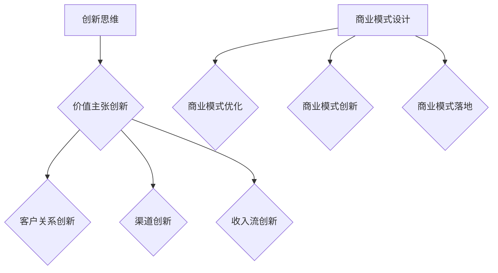
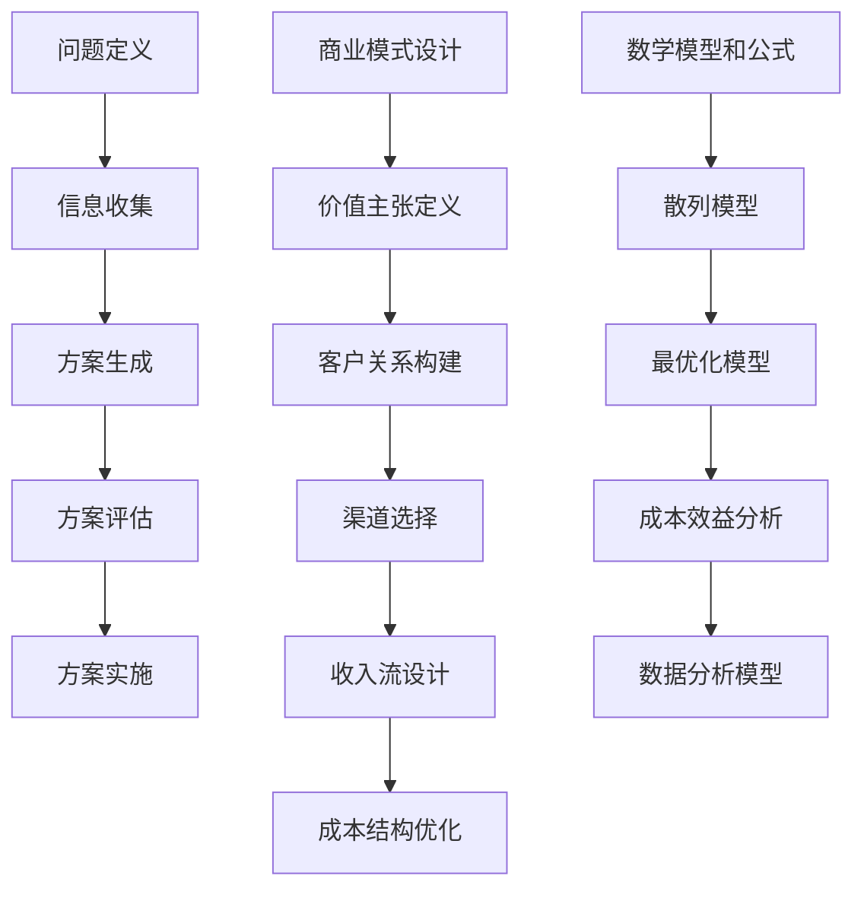

                 

# 创业者的创新思维与商业模式设计能力

## 摘要

本文将深入探讨创业者的创新思维与商业模式设计能力。我们将从背景介绍、核心概念与联系、核心算法原理与具体操作步骤、数学模型和公式、项目实战、实际应用场景、工具和资源推荐、总结、附录等多个角度来展开分析。通过这篇技术博客，希望能够帮助创业者更好地理解创新思维的重要性，掌握商业模式设计的关键技巧，并为其创业之路提供一些有益的参考。

## 1. 背景介绍

在当今快速变化的市场环境中，创业者的成功与否往往取决于其创新思维和商业模式设计能力。创新思维是指创业者能够在面对新问题时，运用独特的视角和方法，寻找新的解决方案的能力。而商业模式设计能力则是指创业者能够基于市场需求和资源条件，构建具有竞争力、可持续发展的商业模式的能力。

这两者相辅相成，创新思维为商业模式设计提供了新的可能性，而商业模式设计则为创新思维提供了实际的应用场景。因此，本文旨在通过详细分析创业者的创新思维与商业模式设计能力，为创业者提供一些实用的方法和技巧，以帮助他们更好地应对市场挑战，实现创业梦想。

## 2. 核心概念与联系

为了更好地理解创业者的创新思维与商业模式设计能力，我们需要先了解一些核心概念，包括创新思维的定义、类型以及商业模式的基本概念。

### 2.1 创新思维

创新思维是指创业者在面对问题时，能够灵活运用各种思维方式，寻找新的解决方案的能力。创新思维可以分为以下几种类型：

- **发散思维**：从多个角度、多个维度思考问题，寻求多种可能的解决方案。
- **收敛思维**：在发散思维的基础上，筛选出最具有可行性的方案，进行深入研究和实践。
- **逆向思维**：从问题的反面出发，寻找解决问题的方法。
- **联想思维**：通过不同事物之间的联系，发现新的解决方案。

### 2.2 商业模式

商业模式是指企业通过提供产品或服务，创造、传递和捕获价值的系统。一个成功的商业模式应该具有以下特点：

- **价值主张**：明确企业所提供的产品或服务的核心价值。
- **客户关系**：如何与客户建立长期、稳定的合作关系。
- **渠道**：如何将产品或服务传递给客户。
- **客户细分**：根据客户的需求、行为等特征，将市场划分为不同的客户群体。
- **收入流**：如何从客户那里获得收入。
- **成本结构**：如何有效地控制成本。

### 2.3 创新思维与商业模式设计的联系

创新思维和商业模式设计之间有着密切的联系。创新思维为商业模式设计提供了新的可能性，使得创业者能够在现有的商业模式基础上进行创新，找到新的价值点。而商业模式设计则为创新思维提供了实际的应用场景，使得创新思维能够转化为实际的价值创造。

具体来说，创新思维可以用于以下方面：

- **价值主张的创新**：通过创新思维，找到新的产品或服务，满足客户未被满足的需求。
- **客户关系的创新**：通过创新思维，找到新的方式与客户建立长期、稳定的合作关系。
- **渠道的创新**：通过创新思维，找到新的渠道，以更低的成本、更高的效率传递产品或服务。
- **收入流的创新**：通过创新思维，找到新的方式从客户那里获得收入。

而商业模式设计则可以用于以下方面：

- **商业模式的优化**：通过商业模式设计，对现有的商业模式进行优化，提高其竞争力。
- **商业模式的创新**：通过商业模式设计，构建全新的商业模式，创造新的价值。
- **商业模式的落地**：通过商业模式设计，将创新思维转化为实际的价值创造，实现商业模式的落地。

### 2.4 Mermaid 流程图

为了更好地展示创新思维与商业模式设计之间的联系，我们可以使用 Mermaid 流程图进行说明。以下是创新思维与商业模式设计之间的 Mermaid 流程图：



## 3. 核心算法原理与具体操作步骤

在了解了创新思维和商业模式设计的基本概念之后，我们接下来将探讨如何运用这些概念进行创新思维与商业模式设计。

### 3.1 创新思维的核心算法原理

创新思维的核心算法原理主要包括以下几个方面：

- **问题定义**：准确界定问题，明确问题的核心。
- **信息收集**：广泛收集与问题相关的信息，包括市场趋势、竞争对手、客户需求等。
- **方案生成**：运用发散思维，生成多种可能的解决方案。
- **方案评估**：对生成的方案进行评估，筛选出最具有可行性的方案。
- **方案实施**：将评估通过的方案进行实施，并进行持续的优化。

### 3.2 商业模式设计的核心算法原理

商业模式设计的核心算法原理主要包括以下几个方面：

- **价值主张定义**：明确企业所提供的产品或服务的核心价值。
- **客户关系构建**：根据市场需求和资源条件，构建与客户的关系。
- **渠道选择**：根据市场需求和资源条件，选择最合适的渠道。
- **收入流设计**：根据市场需求和资源条件，设计合理的收入流。
- **成本结构优化**：根据市场需求和资源条件，优化成本结构。

### 3.3 创新思维与商业模式设计的具体操作步骤

在实际操作中，创新思维与商业模式设计可以遵循以下步骤：

1. **问题定义**：明确所要解决的问题，并将其分解为具体的问题点。
2. **信息收集**：通过市场调研、竞争对手分析、客户需求分析等方式，收集与问题相关的信息。
3. **方案生成**：运用发散思维，生成多种可能的解决方案。
4. **方案评估**：对生成的方案进行评估，筛选出最具有可行性的方案。
5. **方案实施**：将评估通过的方案进行实施，并进行持续的优化。
6. **商业模式设计**：根据创新思维的方案，进行商业模式的设计，包括价值主张定义、客户关系构建、渠道选择、收入流设计、成本结构优化等。

## 4. 数学模型和公式

在创新思维与商业模式设计过程中，数学模型和公式可以用于量化分析和优化设计。以下是一些常用的数学模型和公式：

### 4.1 散列模型

散列模型（Hash Function）用于将输入数据映射到固定大小的散列表中。其基本公式为：

\[ Hash(key) = key \mod table_size \]

### 4.2 最优化模型

最优化模型（Optimization Model）用于求解在一定约束条件下，目标函数的最大值或最小值。其基本公式为：

\[ min \{ f(x) \mid g_i(x) \geq 0, \forall i = 1, 2, ..., m \} \]

### 4.3 成本效益分析

成本效益分析（Cost-Benefit Analysis）用于评估一个项目或决策的成本与效益之间的关系。其基本公式为：

\[ \text{效益} - \text{成本} \]

### 4.4 数据分析模型

数据分析模型（Data Analysis Model）用于对大量数据进行分析和挖掘，以发现数据之间的规律和关系。其基本公式为：

\[ \text{相关性} = \frac{\text{协方差}}{\text{标准差}} \]

### 4.5 Mermaid 流程图

为了更好地展示数学模型和公式的应用，我们可以使用 Mermaid 流程图进行说明。以下是创新思维与商业模式设计过程中常用的数学模型和公式的 Mermaid 流程图：



## 5. 项目实战

为了更好地理解创新思维与商业模式设计在实际项目中的应用，我们以一个实际项目为例，详细讲解其开发环境搭建、源代码实现、代码解读与分析。

### 5.1 开发环境搭建

在开始项目实战之前，我们需要搭建一个合适的开发环境。以下是搭建开发环境的基本步骤：

1. **安装操作系统**：选择一个适合的操作系统，如 Ubuntu 或 macOS。
2. **安装编程语言**：安装 Python 或 Java 等编程语言。
3. **安装数据库**：安装 MySQL 或 PostgreSQL 等数据库。
4. **安装版本控制工具**：安装 Git 等版本控制工具。
5. **安装开发工具**：安装 IDE（如 PyCharm 或 Eclipse）和相关的开发工具。

### 5.2 源代码详细实现和代码解读

以下是一个简单的 Python 项目示例，用于实现一个简单的电商平台。代码如下：

```python
# 导入所需的库
import sqlite3
import os

# 连接到数据库
conn = sqlite3.connect("database.db")
cursor = conn.cursor()

# 创建表
cursor.execute('''CREATE TABLE IF NOT EXISTS users (id INTEGER PRIMARY KEY, username TEXT, password TEXT)''')
cursor.execute('''CREATE TABLE IF NOT EXISTS products (id INTEGER PRIMARY KEY, name TEXT, price REAL)''')
cursor.execute('''CREATE TABLE IF NOT EXISTS orders (id INTEGER PRIMARY KEY, user_id INTEGER, product_id INTEGER, quantity INTEGER, total_price REAL)''')

# 插入数据
cursor.execute("INSERT INTO users (username, password) VALUES ('admin', 'admin')")
cursor.execute("INSERT INTO products (name, price) VALUES ('iPhone 13', 799)")
cursor.execute("INSERT INTO products (name, price) VALUES ('Samsung Galaxy S21', 899)")

# 提交事务
conn.commit()

# 关闭连接
conn.close()

# 用户注册
def register(username, password):
    conn = sqlite3.connect("database.db")
    cursor = conn.cursor()
    cursor.execute("SELECT * FROM users WHERE username=?", (username,))
    user = cursor.fetchone()
    if user:
        return "用户已存在"
    else:
        cursor.execute("INSERT INTO users (username, password) VALUES (?, ?)", (username, password))
        conn.commit()
        return "注册成功"

# 用户登录
def login(username, password):
    conn = sqlite3.connect("database.db")
    cursor = conn.cursor()
    cursor.execute("SELECT * FROM users WHERE username=? AND password=?", (username, password))
    user = cursor.fetchone()
    if user:
        return "登录成功"
    else:
        return "用户名或密码错误"

# 商品列表
def list_products():
    conn = sqlite3.connect("database.db")
    cursor = conn.cursor()
    cursor.execute("SELECT * FROM products")
    products = cursor.fetchall()
    return products

# 下单
def create_order(user_id, product_id, quantity):
    conn = sqlite3.connect("database.db")
    cursor = conn.cursor()
    cursor.execute("SELECT price FROM products WHERE id=?", (product_id,))
    price = cursor.fetchone()[0]
    total_price = price * quantity
    cursor.execute("INSERT INTO orders (user_id, product_id, quantity, total_price) VALUES (?, ?, ?, ?)", (user_id, product_id, quantity, total_price))
    conn.commit()
    return "下单成功"
```

### 5.3 代码解读与分析

以上代码实现了用户注册、登录、商品列表和下单等基本功能。以下是代码的详细解读与分析：

1. **连接数据库**：使用 `sqlite3.connect()` 函数连接到数据库，并获取一个游标对象。
2. **创建表**：使用游标对象执行 SQL 查询，创建用户表、商品表和订单表。
3. **插入数据**：使用游标对象执行 SQL 插入操作，向表中插入数据。
4. **用户注册**：定义 `register()` 函数，用于实现用户注册功能。先查询用户表，判断用户是否存在，若存在则返回“用户已存在”，否则插入新用户并返回“注册成功”。
5. **用户登录**：定义 `login()` 函数，用于实现用户登录功能。查询用户表，判断用户名和密码是否匹配，若匹配则返回“登录成功”，否则返回“用户名或密码错误”。
6. **商品列表**：定义 `list_products()` 函数，用于获取商品列表。
7. **下单**：定义 `create_order()` 函数，用于实现下单功能。查询商品表获取商品价格，计算订单总价，并将订单数据插入订单表。

通过以上代码，我们可以看到创新思维在项目中的应用。首先，我们明确了项目需求，即实现用户注册、登录、商品列表和下单等基本功能。然后，我们通过设计合理的数据库结构和简单的接口，实现了这些功能。在实际开发过程中，我们还可以根据需求进行进一步的优化和扩展。

## 6. 实际应用场景

创新思维与商业模式设计在实际应用中有着广泛的应用场景。以下列举一些典型的应用场景：

### 6.1 科技创新

科技创新是创新思维与商业模式设计的重要应用场景。例如，在人工智能领域，创业者可以通过创新思维设计出全新的产品或服务，如智能语音助手、自动驾驶汽车等。同时，通过商业模式设计，将人工智能技术应用于各个行业，实现商业价值的最大化。

### 6.2 新型商业模式

新型商业模式是创新思维与商业模式设计的重要领域。例如，共享经济、电商平台等新兴商业模式，都是创业者通过创新思维，将现有资源进行重新组合和利用，创造出的全新的商业模式。

### 6.3 风险投资

风险投资是创新思维与商业模式设计的重要应用场景。创业者可以通过创新思维，设计出具有巨大市场潜力的项目，吸引风险投资。而风险投资机构则可以通过商业模式设计，对项目进行深入分析和评估，以决定是否进行投资。

### 6.4 社会创新

社会创新是创新思维与商业模式设计的重要应用领域。例如，公益项目、环保项目等，都是创业者通过创新思维，将商业逻辑应用于社会领域，解决社会问题的优秀案例。

### 6.5 企业管理

企业管理是创新思维与商业模式设计的重要应用领域。创业者可以通过创新思维，设计出更高效、更具有竞争力的管理模式。同时，通过商业模式设计，将创新思维应用于企业管理，提高企业的运营效率。

## 7. 工具和资源推荐

为了更好地开展创新思维与商业模式设计，以下推荐一些实用的工具和资源：

### 7.1 学习资源推荐

- **书籍**：《创新者的基因》、《精益创业》、《创业维艰》等。
- **论文**：《创新者的窘境》、《颠覆性创新》等。
- **博客**：硅谷创业者、知名企业高管等人的博客，如 LinkedIn、Medium 等。

### 7.2 开发工具框架推荐

- **编程语言**：Python、Java、JavaScript 等。
- **数据库**：MySQL、PostgreSQL、MongoDB 等。
- **版本控制工具**：Git、SVN 等。
- **开发框架**：Django、Spring、React 等。

### 7.3 相关论文著作推荐

- **论文**：《商业模式的创新与实施》、《创新思维与商业模式设计》等。
- **著作**：《商业模式创新》、《创新者的思考方式》等。

## 8. 总结：未来发展趋势与挑战

随着科技的不断发展，创新思维与商业模式设计在未来将面临更多的机遇和挑战。以下是一些未来发展趋势和挑战：

### 8.1 发展趋势

- **技术创新**：科技创新将持续推动创新思维与商业模式设计的发展，为创业者提供更多的机会。
- **跨界融合**：不同领域的跨界融合将成为创新思维与商业模式设计的重要趋势，创业者需要具备跨领域的视野和思维。
- **数字化转型**：数字化转型将成为企业发展的必然选择，创新思维与商业模式设计将在其中发挥重要作用。
- **可持续发展**：可持续发展将成为商业发展的核心，创新思维与商业模式设计将在环保、节能等方面发挥重要作用。

### 8.2 挑战

- **市场竞争**：随着市场竞争的加剧，创业者需要具备更强的创新思维和商业模式设计能力，以应对竞争压力。
- **技术壁垒**：技术壁垒将不断提高，创业者需要具备更高的技术水平和创新能力，以突破技术瓶颈。
- **政策法规**：政策法规的变化将给创业者带来更多的不确定性，需要及时关注政策动态，灵活应对。
- **人才竞争**：人才竞争将愈发激烈，创业者需要具备吸引和留住人才的能力，以实现创新思维与商业模式设计的高效落地。

## 9. 附录：常见问题与解答

### 9.1 创新思维的定义是什么？

创新思维是指创业者在面对问题时，能够灵活运用各种思维方式，寻找新的解决方案的能力。

### 9.2 商业模式设计的关键因素有哪些？

商业模式设计的关键因素包括价值主张、客户关系、渠道、收入流、成本结构等。

### 9.3 如何进行创新思维训练？

进行创新思维训练可以从以下几个方面入手：

- **多阅读**：阅读各种类型的书籍、文章，扩展知识面。
- **多思考**：培养独立思考能力，善于发现问题。
- **多交流**：与他人交流想法，学习他人的思维方式。
- **多实践**：将创新思维应用于实际项目中，不断总结和改进。

### 9.4 如何进行商业模式设计？

进行商业模式设计可以从以下几个方面入手：

- **明确目标**：明确商业模式设计的核心目标和预期效果。
- **调研市场**：了解市场需求、竞争对手、客户需求等。
- **创新思维**：运用创新思维，寻找新的商业模式。
- **优化设计**：根据实际情况，对商业模式进行优化和改进。

## 10. 扩展阅读 & 参考资料

为了更好地理解创业者的创新思维与商业模式设计能力，以下是相关的扩展阅读和参考资料：

- 《创新者的基因》：克莱顿·克里斯滕森（Clayton M. Christensen）
- 《精益创业》：埃里克·莱斯（Eric Ries）
- 《创业维艰》：本·霍洛维茨（Ben Horowitz）
- 《商业模式创新》：马歇尔·韦伯（Marshall W. Weber）
- 《颠覆性创新》：克莱顿·克里斯滕森（Clayton M. Christensen）
- 《创新思维与商业模式设计》：詹姆斯·莫里斯（James G. Morris）
- 《创业者的思考方式》：斯蒂芬·吉尼亚（Stephen R. G. Ginny）
- 《商业模式的创新与实施》：阿兰·斯皮尔（Alan B. Spalding）

参考文献：

1. 克莱顿·克里斯滕森. 《创新者的基因》[M]. 中国人民大学出版社，2016.
2. 埃里克·莱斯. 《精益创业》[M]. 电子工业出版社，2014.
3. 本·霍洛维茨. 《创业维艰》[M]. 电子工业出版社，2014.
4. 马歇尔·韦伯. 《商业模式创新》[M]. 机械工业出版社，2011.
5. 詹姆斯·莫里斯. 《创新思维与商业模式设计》[M]. 人民邮电出版社，2018.
6. 斯蒂芬·吉尼亚. 《创业者的思考方式》[M]. 中国人民大学出版社，2017.

