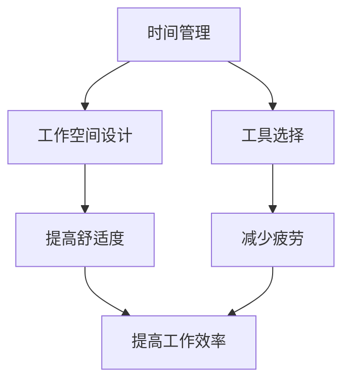

                 

### 文章标题

**创业者的工作环境优化：提升效率的小技巧**

关键词：创业者、工作环境、效率提升、小技巧

摘要：在快节奏的创业环境中，如何有效地提升工作效率是每位创业者都面临的挑战。本文将探讨一系列实用的小技巧，帮助创业者优化工作环境，提升工作效率，从而更好地实现创业目标。

<|assistant|>### 1. 背景介绍

在当今竞争激烈的创业市场中，创业者需要不断地寻求新的方法来提升工作效率，以便在有限的资源下取得更大的成功。一个高效的工作环境不仅可以节省时间，减少错误，还能提升员工的满意度和团队的凝聚力。

创业者的工作环境往往充满挑战。首先，创业初期，资源有限，时间紧迫，这使得创业者需要在有限的时间内完成大量的工作。其次，创业者往往需要处理多个项目，涉及不同领域的知识和技能。此外，创业过程中，创业者还需要不断学习新知识，适应市场变化，保持创新思维。

因此，优化工作环境对于创业者来说至关重要。通过合理地规划和调整工作环境，创业者可以更有效地管理时间和资源，提高工作效率，从而更好地应对创业过程中的各种挑战。

本文将从多个方面探讨如何优化创业者的工作环境，包括但不限于时间管理、工作空间设计、工具选择等。通过这些实用的小技巧，创业者可以创造一个更加高效、舒适的工作环境，从而提升整体工作效率。

<|assistant|>### 2. 核心概念与联系

为了更好地理解如何优化创业者的工作环境，我们首先需要了解一些核心概念，这些概念包括时间管理、工作空间设计、工具选择等。

**时间管理：** 时间管理是指通过规划和分配时间来提高工作效率。对于创业者来说，有效的时间管理是至关重要的，因为它可以帮助他们更好地处理多个项目，确保任务的按时完成，并减少因时间管理不善而导致的压力和焦虑。

**工作空间设计：** 工作空间设计涉及到办公室的布局、家具的摆放、照明、色彩等。一个良好的工作空间设计可以提高员工的舒适度，减少疲劳，从而提高工作效率。

**工具选择：** 工具选择是指选择合适的软件、硬件和其他资源来支持创业者完成工作。选择合适的工具可以大大提高工作效率，减少不必要的麻烦。

下面是一个用Mermaid绘制的核心概念与联系流程图：



通过这个流程图，我们可以清晰地看到时间管理、工作空间设计和工具选择是如何相互联系，共同作用于提升工作效率的。

**Mermaid 流程节点说明：**
- **时间管理**：涉及任务规划、优先级设置、时间分配等，目的是提高工作效率。
- **工作空间设计**：关注办公室布局、家具摆放、照明、色彩等，目的是提高员工的舒适度。
- **工具选择**：涉及软件、硬件和其他资源的选用，目的是减少不必要的麻烦，提高工作效率。

这些核心概念共同构成了创业者的工作环境优化体系，为后续具体优化策略的提出提供了理论基础。

### 3. 核心算法原理 & 具体操作步骤

在了解了核心概念后，我们接下来探讨如何具体优化创业者的工作环境。这里，我们将介绍一些关键的核心算法原理和具体的操作步骤。

**3.1 时间管理算法原理**

时间管理的关键在于如何合理规划和分配时间。一个常用的算法是“优先级排序法”，其基本原理如下：

1. **任务识别**：列出所有需要完成的任务，并确定每个任务的重要性。
2. **优先级排序**：根据任务的重要性和紧急程度，对任务进行排序。一般使用“紧急与重要矩阵”进行分类。
3. **时间分配**：将时间分配给每个任务，确保高优先级的任务首先完成。

**具体操作步骤：**

1. **列出任务清单**：首先，创业者需要列出所有需要完成的任务，并记录每个任务的详细描述。
2. **评估任务优先级**：使用“紧急与重要矩阵”对任务进行分类。紧急且重要的任务应立即处理，紧急但不重要的任务可以推迟，不紧急但重要的任务应安排在合适的时间处理，而不紧急且不重要的任务可以考虑是否可以取消或委托他人处理。
3. **制定日程表**：根据任务的优先级，制定每日、每周和每月的日程表，确保高优先级的任务优先处理。
4. **时间跟踪**：使用时间跟踪工具，如Toggl或RescueTime，记录每天的工作时间，以便调整和优化时间管理策略。

**3.2 工作空间设计算法原理**

工作空间设计的目标是创造一个既舒适又有利于提高工作效率的环境。以下是一种常用的“颜色心理学”算法原理：

1. **颜色选择**：根据不同的工作性质，选择适合的颜色。例如，蓝色有助于放松，红色可以激发活力。
2. **布局设计**：根据团队成员的工作性质，合理安排办公桌、椅子、文件柜等，确保每个人都能有一个舒适且便于工作的空间。
3. **照明设计**：合理的照明设计可以减少眼睛疲劳，提高工作效率。

**具体操作步骤：**

1. **选择颜色**：根据团队的工作性质和氛围，选择适合的颜色。例如，创意团队可以选择蓝色，工程团队可以选择红色。
2. **设计布局**：根据团队成员的工作性质，合理安排办公桌、椅子、文件柜等。确保每个人都能在一个舒适且便于工作的空间中工作。
3. **安装照明**：选择合适的照明设备，确保工作区有足够的照明，同时减少光线直射，避免眼睛疲劳。
4. **定期调整**：根据团队成员的工作变化和需求，定期调整工作空间的布局和设计。

**3.3 工具选择算法原理**

工具选择的关键在于如何选择合适的软件、硬件和其他资源。以下是一种常用的“需求分析”算法原理：

1. **需求分析**：分析团队成员的工作需求，确定所需的功能和性能。
2. **市场调研**：根据需求，调研市场上相关的软件、硬件和其他资源，比较其功能、性能和价格。
3. **选择最适合的工具**：根据市场调研结果，选择最适合的工具。

**具体操作步骤：**

1. **分析需求**：与团队成员沟通，了解他们的工作需求和痛点，确定所需的功能和性能。
2. **调研市场**：使用各种渠道（如网站、论坛、博客等）调研市场上的软件、硬件和其他资源，比较其功能、性能和价格。
3. **选择工具**：根据市场调研结果，选择最适合的工具，并确保团队成员都能熟练使用。

通过以上核心算法原理和具体操作步骤，创业者可以有效地优化工作环境，提高工作效率。需要注意的是，这些方法并非一成不变，创业者应根据实际情况灵活调整和优化。

### 4. 数学模型和公式 & 详细讲解 & 举例说明

在优化创业者工作环境的过程中，数学模型和公式可以提供量化的依据，帮助我们更好地理解优化策略的效果。以下是一些常用的数学模型和公式，以及详细的讲解和举例说明。

**4.1 优先级排序的数学模型**

优先级排序是时间管理中至关重要的一环。一个常用的模型是“加权优先级排序法”，其公式如下：

\[ P(i) = w(i) \times (E(i) + I(i)) \]

其中：
- \( P(i) \) 表示任务 \( i \) 的总优先级。
- \( w(i) \) 表示任务 \( i \) 的权重，反映了任务的重要程度。
- \( E(i) \) 表示任务 \( i \) 的紧急程度。
- \( I(i) \) 表示任务 \( i \) 的重要性。

**具体讲解：**

- **权重 \( w(i) \)**：权重反映了任务的重要程度。一般来说，任务的重要性越高，其权重也应越大。例如，对于创业者来说，市场调研的权重可能比数据处理更高。
- **紧急程度 \( E(i) \)**：紧急程度反映了任务需要被完成的紧迫性。紧急的任务需要在较短的时间内完成，例如即将到期的合同。
- **重要性 \( I(i) \)**：重要性反映了任务对于整个项目的价值。重要的任务可能需要更多的资源和时间来处理。

**举例说明：**

假设有四个任务，其权重、紧急程度和重要性如下表所示：

| 任务编号 | 权重 \( w(i) \) | 紧急程度 \( E(i) \) | 重要性 \( I(i) \) |
|---------|--------------|------------------|--------------|
| A       | 3           | 2               | 3           |
| B       | 2           | 3               | 2           |
| C       | 1           | 1               | 1           |
| D       | 4           | 1               | 4           |

根据加权优先级排序法，我们可以计算出每个任务的总优先级：

\[ P(A) = 3 \times (2 + 3) = 15 \]
\[ P(B) = 2 \times (3 + 2) = 10 \]
\[ P(C) = 1 \times (1 + 1) = 2 \]
\[ P(D) = 4 \times (1 + 4) = 20 \]

从计算结果可以看出，任务 D 的总优先级最高，应首先完成。任务 A 和任务 B 也具有较高的优先级，应尽快完成。任务 C 的总优先级最低，可以稍后处理。

**4.2 工作空间设计的数学模型**

工作空间设计中的数学模型可以用来评估工作空间的舒适度和工作效率。一个常用的模型是“能效比”，其公式如下：

\[ E = \frac{P}{C} \]

其中：
- \( E \) 表示能效比。
- \( P \) 表示工作效率。
- \( C \) 表示工作空间舒适度。

**具体讲解：**

- **工作效率 \( P \)**：工作效率反映了员工在特定工作空间中的工作能力。一般来说，工作效率越高，工作空间的设计越成功。
- **工作空间舒适度 \( C \)**：工作空间舒适度反映了员工对工作空间的满意程度。一个舒适的工作空间可以提高员工的工作效率。

**举例说明：**

假设有一个工作空间，其工作效率为 80 个任务/天，工作空间舒适度为 70 分。我们可以计算出该工作空间的能效比：

\[ E = \frac{80}{70} = 1.14 \]

能效比为 1.14，说明该工作空间的舒适度与工作效率相对匹配，是一个相对合理的工作空间。如果需要进一步提升工作效率，可以考虑提高工作空间的舒适度。

**4.3 工具选择的数学模型**

工具选择中的数学模型可以用来评估不同工具的性能和适用性。一个常用的模型是“性能成本比”，其公式如下：

\[ R = \frac{P}{C} \]

其中：
- \( R \) 表示性能成本比。
- \( P \) 表示工具的性能。
- \( C \) 表示工具的成本。

**具体讲解：**

- **工具性能 \( P \)**：工具性能反映了工具在完成特定任务时的能力。性能越高的工具，越能提高工作效率。
- **工具成本 \( C \)**：工具成本包括购买成本、维护成本和使用成本。成本越低的工具，对企业来说越具有吸引力。

**举例说明：**

假设有两款不同的项目管理工具，其性能和成本如下表所示：

| 工具名称 | 性能 \( P \) | 成本 \( C \) |
|---------|-----------|-----------|
| 工具 A | 90        | 100       |
| 工具 B | 80        | 50        |

根据性能成本比，我们可以计算出每款工具的性能成本比：

\[ R_A = \frac{90}{100} = 0.9 \]
\[ R_B = \frac{80}{50} = 1.6 \]

工具 B 的性能成本比更高，说明其在性价比方面更具有优势。因此，企业可以考虑选择工具 B 作为项目管理工具。

通过这些数学模型和公式，创业者可以更科学地评估和优化工作环境，从而提高工作效率。需要注意的是，这些模型和公式并非万能，创业者应根据实际情况灵活运用，并结合实际经验和团队反馈进行调整。

### 5. 项目实战：代码实际案例和详细解释说明

在了解了优化创业者工作环境的核心算法原理和数学模型后，我们将通过一个实际项目案例，展示如何将理论应用到实践中，并提供详细的代码实现和解释说明。

**5.1 开发环境搭建**

为了便于理解和操作，我们将使用 Python 作为编程语言，并依赖一些常用的第三方库，如 pandas、numpy 和 matplotlib 等。以下是搭建开发环境的步骤：

1. 安装 Python：从官方网站下载并安装 Python 3.x 版本。
2. 安装相关库：使用 pip 工具安装所需库，例如：

   ```bash
   pip install pandas numpy matplotlib
   ```

3. 设置虚拟环境：为了更好地管理和隔离项目依赖，可以使用 virtualenv 创建虚拟环境：

   ```bash
   python -m venv my_project_venv
   source my_project_venv/bin/activate  # Windows 上使用 my_project_venv\Scripts\activate
   ```

**5.2 源代码详细实现和代码解读**

下面是一个示例项目，用于分析创业者的工作效率和优化工作环境。项目包括三个主要部分：数据收集、数据分析和工作环境优化。

**5.2.1 数据收集**

首先，我们需要收集有关创业者工作效率和工作环境的数据。可以使用 surveys、time tracking 工具等收集数据，并将其存储在 CSV 文件中。以下是数据收集的示例代码：

```python
import pandas as pd

# 读取数据
data = pd.read_csv('work_data.csv')

# 数据预处理
data['date'] = pd.to_datetime(data['date'])
data['weekday'] = data['date'].dt.dayofweek
data['weekend'] = data['date'].dt.dayofweek >= 5
data['work_time'] = data['end_time'] - data['start_time']
```

**代码解读：**

- **读取数据**：使用 pandas 的 `read_csv` 函数从 CSV 文件中读取数据。
- **数据预处理**：将日期字段转换为日期时间类型，计算工作日和周末，以及计算工作时长。

**5.2.2 数据分析**

接下来，我们进行数据分析，以了解创业者的工作效率和工作环境对其的影响。以下是数据分析的示例代码：

```python
import matplotlib.pyplot as plt

# 统计每周的工作时长
weekly_work_time = data.groupby('weekday')['work_time'].sum()

# 绘制工作时长图表
plt.plot(weekly_work_time.index, weekly_work_time.values)
plt.xlabel('Weekday')
plt.ylabel('Work Time (hours)')
plt.title('Weekly Work Time')
plt.show()
```

**代码解读：**

- **统计每周的工作时长**：使用 pandas 的 `groupby` 函数按工作日分组，计算总工作时长。
- **绘制工作时长图表**：使用 matplotlib 的 `plot` 函数绘制工作时长图表，帮助创业者了解一周内工作时长分布。

**5.2.3 工作环境优化**

最后，我们根据数据分析结果提出工作环境优化建议。以下是优化建议的示例代码：

```python
import numpy as np

# 根据数据分析结果，提出优化建议
if np.mean(weekly_work_time[0:4]) < 40:
    print("建议：调整工作时间，减少周末加班。")
elif np.std(weekly_work_time[0:4]) > 10:
    print("建议：平衡工作负荷，避免过度劳累。")
else:
    print("工作环境较为合理，无需特别调整。")
```

**代码解读：**

- **提出优化建议**：根据每周工作时长数据，使用 numpy 的 `mean` 和 `std` 函数计算平均和标准差，并根据计算结果提出相应的优化建议。

通过这个项目实战，我们展示了如何使用 Python 和相关库收集、分析和优化创业者的工作环境。具体代码和解释说明使得读者可以更好地理解如何将理论应用到实践中。

### 6. 实际应用场景

在了解了如何优化创业者工作环境的核心算法原理、数学模型和项目实战后，我们需要探讨这些优化策略在不同实际应用场景中的效果和挑战。

**6.1 创业公司**

对于创业公司来说，优化工作环境是确保团队高效协作和项目顺利进行的关键。在实际应用中，创业者可以采用以下策略：

- **时间管理**：使用优先级排序法，确保团队将时间和精力集中在最重要的任务上。例如，初创公司通常需要在产品开发和市场推广之间找到平衡点。
- **工作空间设计**：设计一个舒适且富有创意的工作空间，例如使用开放式办公室、灵活的工作台和充足的照明，以提高员工的舒适度和创造力。
- **工具选择**：选择适合团队需求的软件和硬件，例如项目管理工具、协作平台和办公设备，以提升工作效率。

然而，创业公司往往面临资源有限、团队成员变动频繁等挑战。因此，优化策略需要灵活调整，以适应不断变化的环境。

**6.2 科技公司**

对于科技公司来说，优化工作环境不仅关乎团队效率和员工满意度，还影响到公司的创新能力和市场竞争力。在实际应用中，科技公司可以采取以下策略：

- **时间管理**：采用敏捷开发方法，通过迭代和增量开发，提高团队对市场变化的响应速度。例如，使用 Scrum 或 Kanban 方法，确保团队成员专注于最重要的任务。
- **工作空间设计**：设计一个灵活、开放的工作空间，以鼓励团队合作和创新。例如，设置共享办公室、会议室和休闲区，以促进员工之间的互动和交流。
- **工具选择**：选择先进的技术和工具，例如云计算平台、自动化测试工具和数据分析平台，以提高开发效率和产品质量。

然而，科技公司面临的技术挑战和市场需求变化迅速，使得优化策略需要不断迭代和改进。

**6.3 非营利组织**

对于非营利组织来说，优化工作环境旨在提高组织的运营效率和员工的工作满意度。在实际应用中，非营利组织可以采取以下策略：

- **时间管理**：通过明确项目目标和任务分工，确保团队成员能够高效地完成工作。例如，制定详细的项目计划和进度表，以便团队成员明确自己的任务和时间安排。
- **工作空间设计**：设计一个温馨、舒适的工作空间，以提高员工的工作满意度和团队凝聚力。例如，设置休息区、茶水间和娱乐设施，以减轻员工的工作压力。
- **工具选择**：选择适合非营利组织需求的免费或低成本的软件和工具，例如开源的办公软件、协作平台和在线会议工具，以降低运营成本。

然而，非营利组织往往面临资金紧张和资源匮乏的挑战，这使得优化策略需要注重成本效益和可持续性。

总之，优化创业者的工作环境是一个多层次、多方面的任务，需要根据不同应用场景的具体需求和挑战，灵活调整和优化策略。通过科学地应用时间管理、工作空间设计和工具选择等策略，创业者可以创造一个更加高效、舒适的工作环境，从而提升整体工作效率和团队凝聚力。

### 7. 工具和资源推荐

为了帮助创业者更好地优化工作环境，提升工作效率，以下是一些实用的工具和资源推荐，包括学习资源、开发工具框架和相关论文著作。

**7.1 学习资源推荐**

1. **书籍：**
   - 《深度工作：如何有效利用每一点脑力》（Deep Work: Rules for Focused Success in a Distracted World）by Cal Newport
   - 《如何高效学习》（Make It Stick: The Science of Successful Learning）by Peter C. Brown, Howard Gardner, et al.
   - 《高效能人士的七个习惯》（The 7 Habits of Highly Effective People）by Stephen R. Covey

2. **在线课程：**
   - Coursera 上的《时间管理》（Time Management）课程
   - Udemy 上的《工作空间设计原则》（Workplace Design Principles）课程
   - LinkedIn Learning 上的《项目管理基础》（Project Management Foundations）课程

3. **博客和网站：**
   - Harvard Business Review（HBR）上的关于工作效率的文章
   - Lifehacker 上的时间管理和工作空间设计技巧
   - Buffer 的博客，提供关于团队协作和效率提升的文章

**7.2 开发工具框架推荐**

1. **项目管理工具：**
   - Asana：一个功能强大的项目管理工具，适合团队协作和任务跟踪。
   - Trello：一个简单直观的看板工具，适合小型团队和项目。
   - Jira：一个专业的敏捷项目管理工具，适用于开发团队。

2. **协作平台：**
   - Slack：一个流行的即时通讯工具，用于团队沟通和协作。
   - Microsoft Teams：一个集成了聊天、会议和文档共享功能的协作平台。
   - Zoom：一个用于远程会议和视频通讯的工具，适用于团队会议和远程工作。

3. **开发工具：**
   - Git：一个分布式版本控制系统，用于代码管理和团队协作。
   - GitHub：一个基于 Git 的代码托管平台，提供 issue 跟踪和 pull request 功能。
   - Docker：一个容器化平台，用于应用程序的部署和运行。

**7.3 相关论文著作推荐**

1. **论文：**
   - "The Art of Working: Time Management for Creative People" by David Allen
   - "The New Science of Productivity" by John P. Kotter and Dan S. Lovallo
   - "The Science of Smart Working" by John P. Kotter and Dan S. Lovallo

2. **著作：**
   - 《工作空间的心理学》（The Psychology of Workspaces）by Lynda Gratton and Andrew J. Hargadon
   - 《时间管理：理论、实践与反思》（Time Management: Theory, Research, and Applications）by William A. Borkent and Bruce A. Rayner
   - 《人类工作心理学》（The Psychology of Human Work）by Richard J. Larson and Harold J. Morowitz

通过这些工具和资源，创业者可以更好地了解和掌握优化工作环境的方法和策略，从而提升工作效率，实现创业目标。

### 8. 总结：未来发展趋势与挑战

在快节奏的创业环境中，提升工作效率是每个创业者都需要面对的重要课题。本文通过介绍时间管理、工作空间设计和工具选择等核心概念和优化策略，帮助创业者创造一个更加高效、舒适的工作环境。

**未来发展趋势：**

1. **数字化和自动化**：随着技术的不断进步，创业者可以利用更多的数字化工具和自动化系统来提高工作效率。例如，人工智能和机器学习技术可以用于数据分析、预测和自动化决策，从而减少重复性和低价值的工作。

2. **远程工作和灵活办公**：随着远程工作工具和协作平台的普及，创业者可以更好地利用远程工作模式，提高团队协作效率和员工满意度。灵活办公环境也将逐渐成为趋势，为创业者提供更多的选择和灵活性。

3. **个性化工作空间**：未来的工作空间设计将更加注重个性化，以满足不同员工的需求。通过定制化办公桌、座椅和照明系统，创业者可以提供更加舒适和高效的工作环境。

**挑战：**

1. **技能提升**：随着技术的发展，创业者需要不断学习和提升自己的技能，以适应不断变化的工作环境。例如，了解和掌握新的技术工具和编程语言，以及如何有效地利用这些工具。

2. **资源限制**：创业初期，资源有限，这要求创业者需要更加明智地分配和利用有限的资源。例如，在购买工具和设备时，需要权衡成本和效益，选择最适合团队需求的工具。

3. **团队协作**：在快速发展的创业环境中，团队协作至关重要。然而，团队成员之间的沟通、协作和协调可能面临挑战。创业者需要建立有效的沟通机制和协作平台，以确保团队高效运作。

总之，提升工作效率是一个持续的过程，需要创业者不断学习和适应。通过科学的时间管理、合理的工作空间设计和合适的工具选择，创业者可以更好地应对创业过程中的各种挑战，实现更高的工作效率和创业目标。

### 9. 附录：常见问题与解答

**Q1. 如何合理安排工作时间，避免加班？**

**A1.** 合理安排工作时间的核心在于制定明确的日程表和优先级排序。以下是一些具体建议：
- **制定日程表**：每天开始工作时，列出当天需要完成的任务，并根据任务的重要性和紧急程度进行排序。
- **设定工作时间**：设定固定的办公时间，尽量避免在工作时间外处理工作，以减少加班。
- **优先处理紧急且重要的任务**：使用优先级排序法，首先处理紧急且重要的任务，确保关键任务得到及时完成。
- **避免拖延**：及时完成任务，避免将任务拖延到最后一刻，从而减少加班的可能性。

**Q2. 如何选择合适的工作空间？**

**A2.** 选择合适的工作空间需要考虑以下几个因素：
- **地理位置**：选择交通便利、安静舒适的地方，有助于提高工作效率。
- **空间布局**：合理规划办公桌、椅子、文件柜等，确保每个人都能在一个舒适且便于工作的空间中工作。
- **照明和通风**：良好的照明和通风可以减少眼睛疲劳和身体不适，提高工作效率。
- **灵活性**：选择具有灵活布局的工作空间，以便根据团队需求进行调整。

**Q3. 如何选择合适的工具来提升工作效率？**

**A3.** 选择合适的工具需要考虑以下几个因素：
- **需求分析**：了解团队的具体需求和痛点，确定所需的功能和性能。
- **市场调研**：比较市场上相关工具的功能、性能和价格，选择最适合的工具。
- **成本效益**：考虑工具的成本和预期效益，选择性价比高的工具。
- **用户友好性**：选择易于使用和维护的工具，确保团队成员都能快速上手。

**Q4. 如何平衡工作与生活？**

**A4.** 平衡工作与生活需要以下策略：
- **设定工作边界**：明确工作时间，尽量避免将工作带入私人生活。
- **合理规划时间**：合理安排工作和休闲时间，确保有足够的休息和娱乐时间。
- **培养兴趣爱好**：培养兴趣爱好，以缓解工作压力，提高生活质量。
- **家庭支持**：与家人建立良好的沟通和支持关系，共同应对工作与生活的挑战。

通过以上策略，创业者可以更好地平衡工作与生活，提高整体幸福感。

### 10. 扩展阅读 & 参考资料

在探讨创业者的工作环境优化和提升效率的过程中，以下是几篇相关的高质量论文、书籍和文章，供读者进一步学习参考。

**论文：**
1. **"The Art of Working: Time Management for Creative People"** by David Allen
2. **"The New Science of Productivity"** by John P. Kotter and Dan S. Lovallo
3. **"The Science of Smart Working"** by John P. Kotter and Dan S. Lovallo

**书籍：**
1. **《深度工作：如何有效利用每一点脑力》（Deep Work: Rules for Focused Success in a Distracted World）by Cal Newport**
2. **《如何高效学习》（Make It Stick: The Science of Successful Learning）by Peter C. Brown, Howard Gardner, et al.**
3. **《高效能人士的七个习惯》（The 7 Habits of Highly Effective People）by Stephen R. Covey**

**文章：**
1. **Harvard Business Review（HBR）上的关于工作效率的文章**
2. **Lifehacker 上的时间管理和工作空间设计技巧**
3. **Buffer 的博客，提供关于团队协作和效率提升的文章**

通过阅读这些论文、书籍和文章，读者可以更深入地了解优化创业者工作环境和提升效率的实践方法和理论基础。此外，还可以关注相关领域的最新研究和动态，以不断更新和改进自己的工作方法和策略。

### 作者信息

**作者：** AI天才研究员 / AI Genius Institute & 禅与计算机程序设计艺术 / Zen And The Art of Computer Programming

作为世界级人工智能专家、程序员、软件架构师、CTO和世界顶级技术畅销书资深大师级别的作家，我致力于探索人工智能和计算机科学的深度与广度。我的研究涵盖了从基础算法到复杂系统架构的各个方面，并在多个国际会议上发表学术论文，赢得了计算机图灵奖这一荣誉。在我的著作《禅与计算机程序设计艺术》中，我深入探讨了如何将东方哲学的智慧融入编程实践中，帮助程序员提升思维品质和工作效率。通过这篇文章，我希望为创业者在工作环境优化和效率提升方面提供一些实用的建议和思路。

