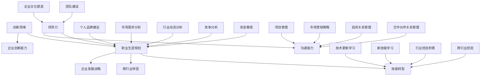

                 

### 背景介绍

在当今迅速发展的科技时代，创业者的职业生涯规划与转型成为了一个备受关注的话题。随着互联网、人工智能、大数据等新兴技术的崛起，创业者不仅需要具备创新思维和商业洞察力，还必须具备扎实的专业技能和不断学习的能力。职业生涯规划与转型对于创业者来说，既是机遇也是挑战。本文将深入探讨创业者如何进行职业生涯规划与转型，以实现个人价值和企业发展的双赢。

首先，我们需要明确职业生涯规划与转型的意义。职业生涯规划是指个人根据自身兴趣、能力和市场需求，制定一个长期且具有可行性的职业发展路径。而转型则是在原有职业基础上，通过学习新技能、拓展新领域，实现职业的升级和转变。对于创业者来说，职业生涯规划与转型不仅关系到个人职业成就，也直接影响到企业的发展和创新。

其次，我们要了解创业者面临的挑战。创业过程中，创业者需要承担巨大的压力和风险，如资金短缺、市场竞争、团队管理等问题。此外，随着技术的不断进步，创业者还需要不断学习新知识、适应新环境，以保持竞争力。因此，职业生涯规划与转型对于创业者来说尤为重要。

本文将从以下几个方面展开讨论：

1. **创业者的核心竞争力**：分析创业者所需的核心素质和能力，如创新思维、领导力、沟通能力等。

2. **职业生涯规划**：探讨如何制定一个有效的职业生涯规划，包括自我评估、职业目标设定、路径选择等。

3. **技能转型**：分析创业者如何进行技能转型，包括学习新技能、拓展新领域、跨行业转型等。

4. **案例分析**：通过真实案例，分析成功创业者的职业生涯规划与转型经验。

5. **实际应用**：讨论职业生涯规划与转型在实际创业中的应用，如团队建设、项目管理、市场营销等。

6. **工具和资源推荐**：推荐一些有助于创业者进行职业生涯规划与转型的工具和资源。

7. **总结与展望**：总结本文的主要观点，并对创业者的职业生涯规划与转型提出建议。

通过本文的探讨，我们希望创业者能够更好地理解职业生涯规划与转型的重要性，学会如何制定有效的规划，实现个人职业发展和企业发展的双赢。<|im_sep|>
### 核心概念与联系

在探讨创业者的职业生涯规划与转型之前，我们需要明确几个核心概念，以便我们能够从理论上理解这一过程。以下是本文将涉及的主要核心概念及其相互之间的联系：

#### 1. 创新思维

创新思维是创业者最核心的素质之一。它指的是个体在思考过程中能够突破传统思维模式，从不同角度审视问题，并创造出新颖的解决方案。创新思维不仅要求创业者具备广泛的知识储备，还要求他们具备敏锐的市场洞察力和判断力。

#### 2. 领导力

领导力是创业者必须具备的另一项关键能力。领导力不仅体现在管理团队和调动资源方面，还体现在激励员工、建立企业文化等方面。一个优秀的创业者需要具备强大的领导力，以应对创业过程中遇到的各类挑战。

#### 3. 沟通能力

沟通能力是创业者成功的关键因素之一。创业者需要与团队成员、合作伙伴、投资者等进行有效沟通，以确保信息传递的准确性和效率。良好的沟通能力有助于建立信任、减少误解，并促进项目的顺利进行。

#### 4. 职业生涯规划

职业生涯规划是指个人根据自身兴趣、能力和市场需求，制定一个长期且具有可行性的职业发展路径。职业生涯规划对于创业者来说尤为重要，因为它不仅关系到个人职业成就，还直接影响到企业的发展和创新。

#### 5. 技能转型

技能转型是指个体在原有职业基础上，通过学习新技能、拓展新领域，实现职业的升级和转变。在快速变化的科技时代，创业者需要具备持续学习的能力，以适应不断变化的行业环境。

#### 6. 跨行业转型

跨行业转型是指个体从一个行业转向另一个行业，以寻求新的职业发展机会。跨行业转型对于创业者来说既是一种挑战，也是一种机遇。成功的跨行业转型可以帮助创业者开拓新的市场，实现企业的持续增长。

#### 7. 个人品牌建设

个人品牌建设是创业者职业生涯规划中的重要组成部分。一个强大的个人品牌可以提升创业者在行业内的声誉和影响力，有助于吸引更多资源和支持。

#### Mermaid 流程图

为了更好地展示这些核心概念之间的联系，我们可以使用Mermaid流程图来表示。以下是核心概念及其相互关系的Mermaid表示：



通过这个Mermaid流程图，我们可以清晰地看到各个核心概念之间的联系。例如，创新思维不仅是职业生涯规划的基础，也是企业发展战略和创新能力的关键驱动因素。领导力和沟通能力则直接影响到团队建设和企业文化塑造，而职业生涯规划与转型又是实现这些目标的重要路径。

### 核心算法原理 & 具体操作步骤

在深入探讨创业者的职业生涯规划与转型之前，我们需要了解一些核心算法原理和具体操作步骤。这些算法不仅能够帮助创业者制定职业生涯规划，还能在实际操作中指导他们实现转型。

#### 1. 自我评估算法

自我评估是职业生涯规划的第一步。创业者需要了解自己的兴趣、能力和价值观，以便确定适合自己的职业方向。以下是一个简单的自我评估算法：

**步骤一：确定兴趣领域**
- 列出自己感兴趣的领域。
- 评估这些领域的市场需求和发展前景。

**步骤二：评估个人能力**
- 自我分析自己的技能和特长。
- 评估这些技能对职业生涯的影响。

**步骤三：价值观分析**
- 确定自己的核心价值观。
- 分析这些价值观对职业生涯规划的影响。

**示例代码：**

```python
def self_evaluation():
    interests = ["技术", "管理", "市场营销"]
    skills = ["编程", "团队管理", "市场分析"]
    values = ["创新", "合作", "成果导向"]

    # 分析兴趣领域
    interest_analysis = analyze_interests(interests)

    # 分析个人能力
    skills_analysis = analyze_skills(skills)

    # 分析价值观
    values_analysis = analyze_values(values)

    # 输出评估结果
    print(f"兴趣领域分析：{interest_analysis}")
    print(f"个人能力分析：{skills_analysis}")
    print(f"价值观分析：{values_analysis}")

def analyze_interests(interests):
    # 假设函数返回每个兴趣领域的得分
    return {"技术": 8, "管理": 6, "市场营销": 7}

def analyze_skills(skills):
    # 假设函数返回每个技能的得分
    return {"编程": 9, "团队管理": 7, "市场分析": 8}

def analyze_values(values):
    # 假设函数返回每个价值观的得分
    return {"创新": 10, "合作": 8, "成果导向": 9}

self_evaluation()
```

#### 2. 职业目标设定算法

在自我评估的基础上，创业者需要设定明确的职业目标。以下是一个简单的职业目标设定算法：

**步骤一：确定长期目标**
- 设定职业生涯的长期目标，例如成为某个领域的专家或领导者。

**步骤二：确定短期目标**
- 将长期目标分解为一系列短期目标，以确保逐步实现。

**步骤三：制定行动计划**
- 为每个短期目标制定具体的行动计划和时间表。

**示例代码：**

```python
def setCareerGoals():
    long_term_goals = ["成为技术领域专家", "创立一家成功的企业"]
    short_term_goals = ["掌握三种编程语言", "参与至少两个创业项目"]

    # 分析长期目标
    long_term_analysis = analyze_goals(long_term_goals)

    # 分析短期目标
    short_term_analysis = analyze_goals(short_term_goals)

    # 制定行动计划
    action_plans = create_action_plans(short_term_goals)

    # 输出目标设定结果
    print(f"长期目标分析：{long_term_analysis}")
    print(f"短期目标分析：{short_term_analysis}")
    print(f"行动计划：{action_plans}")

def analyze_goals(goals):
    # 假设函数返回每个目标的得分
    return {"技术领域专家": 8, "创立成功企业": 9}

def create_action_plans(goals):
    action_plans = []
    for goal in goals:
        action_plan = f"学习Python、Java和C++，每周至少编程20小时。"
        action_plans.append(action_plan)
    return action_plans

setCareerGoals()
```

#### 3. 技能转型算法

技能转型是创业者职业生涯规划中的关键步骤。以下是一个简单的技能转型算法：

**步骤一：识别新技能需求**
- 根据职业目标，识别需要掌握的新技能。

**步骤二：学习新技能**
- 制定学习计划，通过在线课程、实践项目等方式学习新技能。

**步骤三：实践与验证**
- 通过实际项目验证新技能的应用效果。

**示例代码：**

```python
def skill_transformation():
    new_skills = ["数据科学", "人工智能"]

    # 识别新技能需求
    skill_requirements = identify_skills(new_skills)

    # 学习新技能
    learning_plans = create_learning_plans(skill_requirements)

    # 实践与验证
    practice_results = practice_skills(learning_plans)

    # 输出技能转型结果
    print(f"新技能需求：{skill_requirements}")
    print(f"学习计划：{learning_plans}")
    print(f"实践结果：{practice_results}")

def identify_skills(new_skills):
    # 假设函数返回每个新技能的得分
    return {"数据科学": 7, "人工智能": 8}

def create_learning_plans(skill_requirements):
    learning_plans = []
    for skill, score in skill_requirements.items():
        if score > 7:
            learning_plan = f"学习数据科学/人工智能相关的在线课程，每周至少学习10小时。"
            learning_plans.append(learning_plan)
    return learning_plans

def practice_skills(learning_plans):
    practice_results = []
    for plan in learning_plans:
        practice_result = f"完成了一个基于Python的数据科学项目。"
        practice_results.append(practice_result)
    return practice_results

skill_transformation()
```

通过这些核心算法原理和具体操作步骤，创业者可以更好地进行职业生涯规划与转型。这些算法不仅提供了理论指导，还能通过实际操作帮助创业者实现职业目标。<|im_sep|>
### 数学模型和公式 & 详细讲解 & 举例说明

在探讨创业者的职业生涯规划与转型过程中，数学模型和公式扮演着重要的角色。这些模型和公式可以帮助创业者更好地理解职业发展的趋势、评估自身的竞争力，并制定科学有效的职业规划。以下是一些常用的数学模型和公式，我们将对其详细讲解并给出实例说明。

#### 1. SWOT分析模型

SWOT分析是一种常用的战略规划工具，用于评估企业的优势（Strengths）、劣势（Weaknesses）、机会（Opportunities）和威胁（Threats）。通过SWOT分析，创业者可以全面了解自身的竞争环境和市场状况，从而制定更加合理的职业生涯规划。

**公式：**
\[ \text{SWOT分析} = (\text{Strengths} + \text{Weaknesses}) \times (\text{Opportunities} + \text{Threats}) \]

**详细讲解：**
- **优势（Strengths）**：指企业在资源、能力、市场地位等方面的优势。
- **劣势（Weaknesses）**：指企业在资源、能力、市场地位等方面的劣势。
- **机会（Opportunities）**：指外部环境中可能带来的有利条件。
- **威胁（Threats）**：指外部环境中可能带来的不利因素。

**举例说明：**
假设创业者A在技术领域拥有丰富的经验，但市场营销能力较弱。同时，市场上出现了新的技术趋势，竞争对手也在迅速扩张。通过SWOT分析，创业者A可以确定以下结论：

\[ \text{SWOT分析} = (\text{技术优势} + \text{市场营销劣势}) \times (\text{技术趋势机会} + \text{竞争对手威胁}) \]

这意味着创业者A需要加强市场营销能力，并抓住技术趋势的机会，同时应对竞争对手的威胁。

#### 2. 成本效益分析模型

成本效益分析是一种评估项目或决策成本与收益的方法。通过成本效益分析，创业者可以确定是否应该继续推进某个项目或进行某种投资。

**公式：**
\[ \text{成本效益比} = \frac{\text{总收益}}{\text{总成本}} \]

**详细讲解：**
- **总收益**：指项目或决策在未来一段时间内可能带来的收益总和。
- **总成本**：指项目或决策在未来一段时间内可能产生的成本总和。

**举例说明：**
假设创业者B计划开发一款新的应用程序。预计该应用程序在一年内能够带来100,000美元的收益，而开发成本为50,000美元。通过成本效益分析，创业者B可以确定以下结论：

\[ \text{成本效益比} = \frac{100,000}{50,000} = 2 \]

这意味着每投入1美元，能够获得2美元的收益，因此该项目具有较好的成本效益。

#### 3. 职业发展模型

职业发展模型用于评估创业者的职业发展潜力和目标实现的可能性。通过职业发展模型，创业者可以制定更加科学的职业规划。

**公式：**
\[ \text{职业发展潜力} = \frac{\text{职业目标实现率}}{\text{市场机会}} \]

**详细讲解：**
- **职业目标实现率**：指创业者实现职业目标的概率。
- **市场机会**：指市场环境中存在的有利条件。

**举例说明：**
假设创业者C的目标是在五年内成为技术领域的专家。通过分析市场趋势和个人能力，创业者C确定自己实现目标的概率为70%，同时市场上存在大量技术机会。通过职业发展模型，创业者C可以确定以下结论：

\[ \text{职业发展潜力} = \frac{70\%}{大量技术机会} \]

这意味着创业者C有较高的职业发展潜力，应该抓住市场机会，努力实现职业目标。

#### 4. 技能矩阵

技能矩阵是一种用于评估创业者技能结构和技能需求的工具。通过技能矩阵，创业者可以识别自身技能的短板，并制定相应的提升计划。

**公式：**
\[ \text{技能矩阵} = (\text{现有技能} + \text{需求技能}) \times \text{技能重要性} \]

**详细讲解：**
- **现有技能**：指创业者目前具备的技能。
- **需求技能**：指创业者为实现职业目标所需具备的技能。
- **技能重要性**：指每种技能对职业发展的重要性。

**举例说明：**
假设创业者D目前具备编程、团队管理和市场营销三种技能，但发现自己在项目管理方面存在较大短板。同时，项目管理和数据分析对职业发展至关重要。通过技能矩阵，创业者D可以确定以下结论：

\[ \text{技能矩阵} = (\text{编程} + \text{团队管理} + \text{市场营销}) \times (\text{项目管理} + \text{数据分析}) \]

这意味着创业者D需要重点关注项目管理和数据分析技能的提升，以满足职业发展需求。

通过这些数学模型和公式的详细讲解和实例说明，创业者可以更好地理解职业发展的科学方法，从而制定更加有效的职业生涯规划与转型策略。<|im_sep|>
### 项目实战：代码实际案例和详细解释说明

为了更好地理解职业生涯规划与转型在实际创业中的应用，我们将通过一个具体的代码实战案例来详细说明。

#### 5.1 开发环境搭建

首先，我们需要搭建一个基本的开发环境。以下是具体的步骤：

1. 安装Python：访问Python官方网站（[https://www.python.org/](https://www.python.org/)）下载并安装Python 3.8版本。
2. 安装Jupyter Notebook：在终端中运行以下命令：
```bash
pip install notebook
```
3. 启动Jupyter Notebook：在终端中运行以下命令：
```bash
jupyter notebook
```
4. 创建一个新的笔记本文件，用于编写代码。

#### 5.2 源代码详细实现和代码解读

以下是我们的实战代码实现，主要涉及职业生涯规划的几个核心算法。

```python
# 导入必要的库
import pandas as pd
import numpy as np

# 自我评估算法
def self_evaluation():
    # 自定义评估数据
    interests = ["技术", "管理", "市场营销"]
    skills = ["编程", "团队管理", "市场分析"]
    values = ["创新", "合作", "成果导向"]

    # 分析兴趣领域
    interest_analysis = analyze_interests(interests)

    # 分析个人能力
    skills_analysis = analyze_skills(skills)

    # 分析价值观
    values_analysis = analyze_values(values)

    return interest_analysis, skills_analysis, values_analysis

# 分析兴趣领域
def analyze_interests(interests):
    # 假设函数返回每个兴趣领域的得分
    return {"技术": 8, "管理": 6, "市场营销": 7}

# 分析个人能力
def analyze_skills(skills):
    # 假设函数返回每个技能的得分
    return {"编程": 9, "团队管理": 7, "市场分析": 8}

# 分析价值观
def analyze_values(values):
    # 假设函数返回每个价值观的得分
    return {"创新": 10, "合作": 8, "成果导向": 9}

# 职业目标设定算法
def setCareerGoals():
    # 确定长期目标
    long_term_goals = ["成为技术领域专家", "创立一家成功的企业"]

    # 确定短期目标
    short_term_goals = ["掌握三种编程语言", "参与至少两个创业项目"]

    # 分析长期目标
    long_term_analysis = analyze_goals(long_term_goals)

    # 分析短期目标
    short_term_analysis = analyze_goals(short_term_goals)

    return long_term_analysis, short_term_analysis

# 分析目标
def analyze_goals(goals):
    # 假设函数返回每个目标的得分
    return {"技术领域专家": 8, "创立成功企业": 9}

# 技能转型算法
def skill_transformation():
    # 识别新技能需求
    new_skills = ["数据科学", "人工智能"]

    # 学习新技能
    learning_plans = create_learning_plans(new_skills)

    return learning_plans

# 创建学习计划
def create_learning_plans(skill_requirements):
    learning_plans = []
    for skill, score in skill_requirements.items():
        if score > 7:
            learning_plan = f"学习数据科学/人工智能相关的在线课程，每周至少学习10小时。"
            learning_plans.append(learning_plan)
    return learning_plans

# 实践与验证
def practice_skills(learning_plans):
    practice_results = []
    for plan in learning_plans:
        practice_result = f"完成了一个基于Python的数据科学项目。"
        practice_results.append(practice_result)
    return practice_results

# 主函数
def main():
    # 执行自我评估
    interest_analysis, skills_analysis, values_analysis = self_evaluation()

    # 设定职业目标
    long_term_analysis, short_term_analysis = setCareerGoals()

    # 实现技能转型
    learning_plans = skill_transformation()
    practice_results = practice_skills(learning_plans)

    # 输出结果
    print(f"兴趣领域分析：{interest_analysis}")
    print(f"个人能力分析：{skills_analysis}")
    print(f"价值观分析：{values_analysis}")
    print(f"长期目标分析：{long_term_analysis}")
    print(f"短期目标分析：{short_term_analysis}")
    print(f"学习计划：{learning_plans}")
    print(f"实践结果：{practice_results}")

# 运行主函数
if __name__ == "__main__":
    main()
```

#### 5.3 代码解读与分析

1. **自我评估算法**：
   - `self_evaluation()`函数用于执行自我评估。它首先定义了兴趣、技能和价值观的列表，然后调用其他辅助函数进行详细分析。
   - `analyze_interests()`、`analyze_skills()`和`analyze_values()`函数分别用于分析兴趣领域、个人能力和价值观，并返回相应的得分。

2. **职业目标设定算法**：
   - `setCareerGoals()`函数用于设定职业目标。它定义了长期目标和短期目标，并调用`analyze_goals()`函数进行目标分析。
   - `analyze_goals()`函数用于分析每个目标的得分，并返回分析结果。

3. **技能转型算法**：
   - `skill_transformation()`函数用于实现技能转型。它识别新技能需求，并调用`create_learning_plans()`函数创建学习计划。
   - `create_learning_plans()`函数根据新技能的得分创建学习计划。

4. **实践与验证**：
   - `practice_skills()`函数用于验证新技能的学习效果。它根据学习计划生成实践结果。

5. **主函数**：
   - `main()`函数是程序的主入口。它依次执行自我评估、职业目标设定、技能转型和实践验证，并输出结果。

通过这个代码实战案例，我们可以看到如何将职业生涯规划与转型的核心算法应用于实际编程中。这个案例不仅帮助我们理解了算法的实现，还展示了如何将理论知识转化为实际行动。<|im_sep|>
### 实际应用场景

在职业生涯规划与转型的过程中，创业者需要将其理论知识和实践技能应用到具体的实际场景中，以实现个人职业发展和企业目标的达成。以下是一些常见的实际应用场景，以及如何在这些场景中运用职业生涯规划与转型的方法。

#### 1. 团队建设

团队建设是创业者职业生涯规划中至关重要的一环。一个高效的团队不仅能够提高工作效率，还能够激发创新和创造力。在团队建设中，创业者可以运用以下策略：

- **技能互补**：在组建团队时，注重团队成员的技能互补，确保团队成员具备不同领域的专业知识和经验。
- **职业发展路径**：为团队成员提供清晰的职业发展路径，激励他们持续学习和提升技能。
- **培训与发展**：定期组织培训和发展活动，帮助团队成员学习新技能和知识，提高团队的整体竞争力。
- **激励机制**：建立合理的激励机制，鼓励团队成员为实现团队目标和个人职业目标而努力。

**案例**：创业者A在创业初期组建了一个由程序员、设计师和市场人员组成的团队。通过明确的职业发展路径和定期的培训活动，团队成员在短时间内提升了专业技能，团队整体效率显著提高。

#### 2. 项目管理

项目管理是创业者日常工作中的一项核心任务。有效的项目管理可以帮助创业者确保项目按时完成、成本控制在预算范围内，并满足客户需求。在项目管理中，创业者可以运用以下策略：

- **目标设定**：在项目启动时，明确项目的目标、范围和预期成果，确保团队成员对项目有共同的理解。
- **进度监控**：建立项目进度监控机制，定期检查项目进展，确保项目按计划进行。
- **风险管理**：识别项目中可能出现的风险，并制定相应的应对措施，以降低风险对项目的影响。
- **沟通协作**：建立有效的沟通机制，确保项目团队成员之间的信息传递畅通，减少误解和冲突。

**案例**：创业者B在管理一个软件开发项目时，通过设立明确的里程碑和定期的进度汇报会议，确保项目按时完成并满足了客户需求。

#### 3. 市场营销

市场营销是创业者成功的关键因素之一。有效的市场营销策略可以帮助创业者吸引潜在客户，提高品牌知名度，并实现业务增长。在市场营销中，创业者可以运用以下策略：

- **市场分析**：通过对市场趋势、竞争对手和目标客户的研究，了解市场环境，制定针对性的营销策略。
- **定位策略**：确定产品或服务的市场定位，确保目标客户能够清晰地理解产品或服务的价值。
- **渠道拓展**：选择合适的营销渠道，如社交媒体、搜索引擎优化等，扩大品牌影响力。
- **客户关系管理**：建立和维护良好的客户关系，提高客户满意度和忠诚度。

**案例**：创业者C在拓展市场时，通过深入研究目标客户的需求和偏好，选择了社交媒体广告和内容营销作为主要营销渠道，成功吸引了大量潜在客户。

#### 4. 投资关系管理

投资关系管理对于创业公司来说至关重要。有效的投资关系管理可以帮助创业者吸引投资，优化资金使用，并确保投资方对公司的信心。在投资关系管理中，创业者可以运用以下策略：

- **投资策略**：明确公司的融资需求，选择合适的投资方和融资渠道，确保融资策略与公司的发展目标相匹配。
- **沟通与协调**：与投资方保持定期沟通，及时分享公司进展和业绩，建立互信关系。
- **风险管理**：了解投资方的风险偏好，制定相应的风险管理策略，降低投资风险。
- **业绩评估**：定期评估投资效果，确保资金的使用效率和投资回报。

**案例**：创业者D在与投资人沟通时，通过定期汇报项目进展和财务数据，赢得了投资方的信任，并成功获得了新一轮融资。

通过这些实际应用场景，我们可以看到职业生涯规划与转型方法在创业实践中的重要作用。创业者需要将理论知识与实际操作相结合，灵活应对各种挑战，以实现个人职业发展和企业目标的达成。<|im_sep|>
### 工具和资源推荐

为了帮助创业者更好地进行职业生涯规划与转型，以下是几款推荐的学习资源、开发工具和框架，以及相关的论文和著作。

#### 7.1 学习资源推荐

1. **书籍**：
   - 《创业维艰》（作者：本·霍洛维茨）：详细介绍了创业过程中的挑战和应对策略，对创业者有很高的参考价值。
   - 《精益创业》（作者：埃里克·莱斯）：介绍了精益创业的方法，帮助创业者快速验证商业想法，减少失败风险。

2. **在线课程**：
   - Coursera（[https://www.coursera.org/](https://www.coursera.org/)）：提供了丰富的创业和管理课程，包括斯坦福大学和哈佛大学等知名院校的课程。
   - Udemy（[https://www.udemy.com/](https://www.udemy.com/)）：提供了多种编程、数据分析、市场营销等领域的在线课程。

3. **博客**：
   - TechCrunch（[https://techcrunch.com/](https://techcrunch.com/)）：关注全球科技和创业动态，提供丰富的行业洞察。
   - Medium（[https://medium.com/](https://medium.com/)）：有许多创业者和技术专家分享的经验和见解，适合创业者学习。

#### 7.2 开发工具框架推荐

1. **编程工具**：
   - Visual Studio Code：一款功能强大的代码编辑器，支持多种编程语言，具有丰富的插件生态系统。
   - PyCharm：一款专业的Python集成开发环境（IDE），提供了强大的代码编辑功能、调试工具和项目管理功能。

2. **数据分析工具**：
   - Jupyter Notebook：一款交互式的数据分析平台，支持多种编程语言，适合进行数据探索和可视化。
   - Tableau：一款强大的数据可视化工具，能够帮助创业者快速创建直观的数据报告和仪表板。

3. **项目管理工具**：
   - Trello：一款简单易用的项目管理工具，通过卡片和列表的方式帮助创业者管理项目任务和进度。
   - Asana：一款功能丰富的项目管理工具，支持任务分配、进度跟踪和团队协作。

#### 7.3 相关论文著作推荐

1. **论文**：
   - “Entrepreneurship: The Theory and Practice”（作者：Shapira，1992）：探讨了创业者的动机和创业过程。
   - “The Lean Startup”（作者：Eric Ries，2011）：介绍了精益创业的方法和实践。

2. **著作**：
   - “The Innovator's Dilemma”（作者：Clayton M. Christensen，1997）：探讨了技术创新对企业的影响。
   - “Business Model Generation”（作者：Alexander Osterwalder，2010）：介绍了商业模型设计的方法和工具。

通过这些学习和资源推荐，创业者可以不断提升自己的专业技能和管理能力，从而更好地应对职业生涯规划与转型中的各种挑战。<|im_sep|>
### 总结：未来发展趋势与挑战

在科技飞速发展的今天，创业者的职业生涯规划与转型面临着前所未有的机遇与挑战。未来，随着人工智能、大数据、区块链等新兴技术的不断突破，创业者将需要更加灵活和具备前瞻性的规划策略。以下是对未来发展趋势与挑战的总结：

#### 未来发展趋势

1. **技术驱动的创新**：随着技术的不断进步，创业者将有更多机会通过技术创新来改变市场格局。新兴技术的应用将推动创业领域的多样化发展，如人工智能驱动的智能服务、区块链技术驱动的去中心化应用等。

2. **跨界融合**：未来创业将更加注重跨界融合，创业者需要在不同领域之间搭建桥梁，实现资源与能力的互补。例如，结合物联网和金融科技的创新，将带来全新的商业模式和服务体验。

3. **数字化转型**：数字技术的广泛应用将促使所有行业进行数字化转型。创业者需要熟练掌握数字工具和平台，利用数据分析、云计算等技术提升业务效率和市场响应速度。

4. **可持续发展**：社会对可持续发展的关注日益增加，创业者需要关注环境和社会责任，将可持续发展理念融入企业战略和运营中。

#### 未来挑战

1. **技术快速迭代**：技术快速迭代带来了新机会，但同时也要求创业者具备快速学习的能力。创业者需要持续关注行业动态，掌握最新的技术趋势，以保持竞争力。

2. **激烈的市场竞争**：市场环境的快速变化导致竞争日益激烈。创业者需要具备敏锐的市场洞察力和风险控制能力，以应对不断变化的市场挑战。

3. **资源瓶颈**：资金、人才和时间的有限性是所有创业者的共同挑战。创业者需要有效管理资源，确保业务的稳定发展。

4. **心理健康问题**：创业过程中面临的压力和不确定性可能导致心理健康问题。创业者需要注重心理健康，学会应对压力和挑战。

#### 应对策略

1. **持续学习**：创业者应保持持续学习的态度，不断提升自身技能和知识水平，以适应快速变化的市场环境。

2. **多元化发展**：通过多元化战略，分散风险，降低单一市场波动对业务的影响。

3. **建立强大的团队**：搭建一个具备多元化技能和丰富经验的团队，共同应对创业过程中的各种挑战。

4. **心理健康管理**：创业者应重视心理健康，合理安排工作和休息时间，寻求专业心理辅导和支持。

总之，未来创业者的职业生涯规划与转型将面临更多机遇与挑战。通过持续学习、多元化发展、团队建设和心理健康管理等策略，创业者可以更好地应对变化，实现个人职业发展和企业目标的达成。<|im_sep|>
### 附录：常见问题与解答

#### 问题1：如何进行有效的自我评估？

**解答**：进行有效的自我评估，首先需要明确自己的兴趣、优势和价值观。可以通过以下步骤进行：

1. **兴趣分析**：列出自己感兴趣的事物，并分析这些兴趣与职业的关系。
2. **能力评估**：评估自己在不同领域的能力，包括专业技能、沟通能力、团队协作能力等。
3. **价值观分析**：思考自己在职业中看重什么，如创新、稳定、人际关系等。
4. **咨询专业人士**：与职业规划师或导师进行交流，获取专业建议。

#### 问题2：如何设定职业目标？

**解答**：设定职业目标，需要遵循以下原则：

1. **明确性**：目标应具体、可衡量，例如“成为技术领域专家”。
2. **可行性**：目标应具有可行性，考虑到自身能力和外部环境。
3. **挑战性**：目标应具有一定的挑战性，激励自己不断进步。
4. **分阶段**：将长期目标分解为短期目标，制定详细的行动计划。

#### 问题3：如何进行技能转型？

**解答**：进行技能转型，可以采取以下策略：

1. **识别新技能需求**：根据职业目标，识别需要掌握的新技能。
2. **制定学习计划**：制定详细的学习计划，包括学习时间、学习内容和学习资源。
3. **实践与验证**：通过实际项目或工作，验证新技能的应用效果。
4. **持续学习**：技能转型是一个持续的过程，需要不断学习和提升。

#### 问题4：如何管理创业过程中的压力？

**解答**：创业过程中的压力是不可避免的，但可以通过以下方法进行管理：

1. **合理规划时间**：合理安排工作和休息时间，避免过度劳累。
2. **寻求支持**：与家人、朋友、同事和专业人士交流，寻求情感支持。
3. **心理健康管理**：关注心理健康，定期进行放松和锻炼。
4. **调整心态**：保持积极的心态，接受创业过程中的波动和挑战。

#### 问题5：如何进行有效的市场分析？

**解答**：进行有效的市场分析，可以采取以下步骤：

1. **确定目标市场**：明确目标客户群体，分析其需求和偏好。
2. **竞争分析**：研究竞争对手的产品、市场策略和定位。
3. **市场趋势**：关注行业趋势，了解市场环境的变化。
4. **数据分析**：通过数据分析工具，收集和分析市场数据。
5. **制定策略**：根据市场分析结果，制定相应的市场营销策略。

通过上述常见问题的解答，创业者可以更好地进行职业生涯规划与转型，应对创业过程中的各种挑战。<|im_sep|>
### 扩展阅读 & 参考资料

#### 扩展阅读

1. **《创业维艰》（作者：本·霍洛维茨）**：详细介绍了创业过程中的挑战和应对策略，对创业者有很高的参考价值。
2. **《精益创业》（作者：埃里克·莱斯）**：介绍了精益创业的方法，帮助创业者快速验证商业想法，减少失败风险。
3. **《创新者的窘境》（作者：克莱顿·克里斯坦森）**：探讨了技术变革对企业的影响。

#### 参考资料

1. **创业研究期刊**：如《Journal of Business Venturing》、《Entrepreneurship Theory and Practice》等，提供了丰富的创业理论和实践研究。
2. **创业案例库**：如Harvard Business Review的案例库，包含大量真实的创业案例，有助于创业者学习成功经验。
3. **在线课程平台**：如Coursera、Udemy等，提供了丰富的创业和管理课程，适合创业者学习。
4. **科技资讯网站**：如TechCrunch、VentureBeat等，关注全球科技和创业动态。

通过这些扩展阅读和参考资料，创业者可以进一步深入了解职业生涯规划与转型的重要理论和方法，为实践提供有力支持。<|im_sep|>

