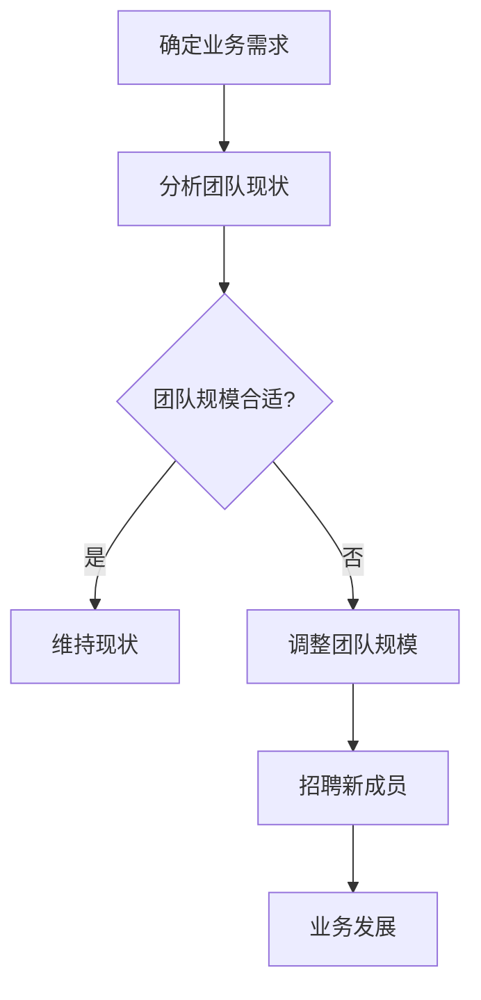
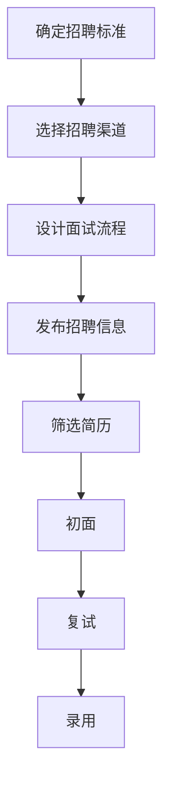
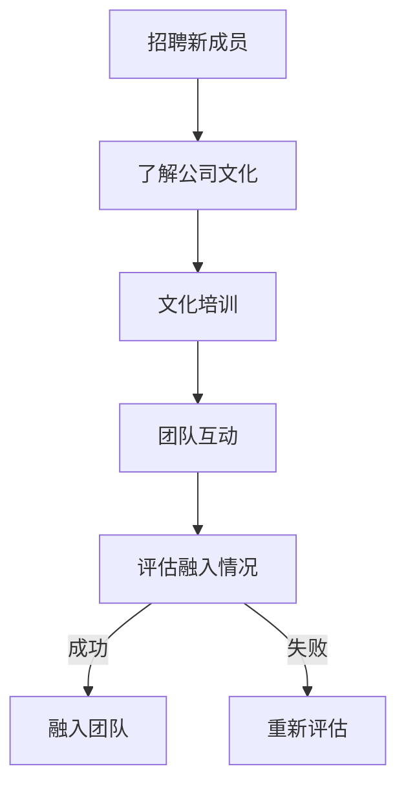

                 

# 创业路上的团队扩张：何时及如何招聘

## 摘要

本文将探讨创业公司在团队扩张过程中面临的关键问题，包括何时开始招聘以及如何进行招聘。我们将从多个角度分析这一过程，从团队规模的确定到招聘策略的制定，再到招聘流程的执行。通过这篇文章，创业者可以了解到如何在合适的时机以高效的方式扩展团队，确保团队能够持续高效地推动公司的发展。

## 1. 背景介绍

创业之路充满了挑战与机遇，团队是公司成功的关键因素。随着公司的发展，业务的扩展，产品线的丰富，对人才的需求也在不断增加。然而，招聘是一个复杂且耗时的工作，它不仅涉及到如何找到合适的人才，还包括如何确保这些人才能够融入公司文化，并为公司带来价值。

创业公司在团队扩张时需要面对以下几个关键问题：

1. **招聘时机**：何时是开始招聘的最佳时机？
2. **招聘策略**：如何制定有效的招聘策略？
3. **招聘流程**：如何优化招聘流程，确保高效招聘？
4. **团队文化**：如何确保新成员能够融入公司文化？

这些问题对于创业公司来说至关重要，因为团队的质量和效率直接影响到公司的成功与否。

## 2. 核心概念与联系

### 团队规模与业务需求

首先，我们需要明确团队规模与业务需求之间的关系。一个初创公司通常从核心团队开始，随着业务的发展，逐渐扩大团队规模。团队规模的增长应该与业务需求相匹配，不能盲目扩张。这可以通过以下Mermaid流程图来展示：



### 招聘策略

制定招聘策略是团队扩张的关键步骤。招聘策略包括确定招聘标准、选择招聘渠道、设计面试流程等。以下是招聘策略的Mermaid流程图：



### 招聘流程

招聘流程的优化是提高招聘效率的关键。以下是一个简化的招聘流程：

1. **职位发布**：在合适的渠道发布职位信息，确保信息精准传达。
2. **简历筛选**：通过关键词筛选和初步筛选，排除不符合条件的简历。
3. **初面**：通过电话或视频面试，进一步筛选候选人。
4. **复试**：进行深度面试，评估候选人的技能和潜力。
5. **录用**：决定是否录用，并发送录用通知。

### 团队文化与融合

招聘不仅仅是找到合适的人才，还需要确保新成员能够融入公司文化。以下是团队文化融入的Mermaid流程图：



## 3. 核心算法原理 & 具体操作步骤

### 团队规模与业务需求匹配算法

为了确定何时开始招聘，我们可以使用一个简单的算法来匹配团队规模与业务需求。该算法基于以下几个步骤：

1. **业务需求分析**：分析当前业务需求，确定需要哪些技能和资源。
2. **团队现状评估**：评估现有团队的能力和资源。
3. **需求与现状比较**：比较业务需求与团队现状，确定差距。
4. **招聘计划制定**：根据差距制定招聘计划。

具体操作步骤如下：

1. **业务需求分析**：
    - 与业务负责人沟通，了解业务发展计划和需求。
    - 分析市场需求和竞争态势，确定公司未来可能需要的技能和资源。

2. **团队现状评估**：
    - 评估现有团队成员的能力和技能。
    - 分析团队的工作负荷和效率。

3. **需求与现状比较**：
    - 比较业务需求与团队现状，确定差距。
    - 分析哪些技能和资源是当前团队所缺乏的。

4. **招聘计划制定**：
    - 根据差距制定招聘计划，包括需要招聘的职位、招聘时间和预算。
    - 制定详细的招聘流程和策略。

### 招聘策略优化算法

为了提高招聘效率，我们可以使用以下算法来优化招聘策略：

1. **招聘标准确定**：
    - 确定招聘的关键技能和素质。
    - 制定详细的面试问题和评估标准。

2. **招聘渠道选择**：
    - 根据招聘标准和职位特点，选择合适的招聘渠道。
    - 评估各个渠道的招聘效果，选择最优渠道。

3. **面试流程设计**：
    - 设计面试流程，包括初面、复试和终面。
    - 确定面试官团队，确保面试过程的公正性和专业性。

具体操作步骤如下：

1. **招聘标准确定**：
    - 分析职位需求，确定关键技能和素质。
    - 制定详细的面试问题和评估标准，确保标准明确且可量化。

2. **招聘渠道选择**：
    - 根据职位特点和目标候选人，选择合适的招聘渠道，如招聘网站、社交媒体、内部推荐等。
    - 评估各个渠道的招聘效果，选择最优渠道。

3. **面试流程设计**：
    - 设计面试流程，确保每个环节都能有效评估候选人的能力和潜力。
    - 确定面试官团队，确保面试过程的公正性和专业性。

## 4. 数学模型和公式 & 详细讲解 & 举例说明

### 团队扩张模型

为了更好地理解团队扩张的过程，我们可以使用以下数学模型：

$$
团队扩张模型 = 业务需求变化率 \times 团队规模适应率
$$

其中：

- **业务需求变化率**：表示业务需求的增长速度。
- **团队规模适应率**：表示团队适应业务需求变化的能力。

具体步骤如下：

1. **业务需求变化率计算**：
    - 通过分析业务数据和市场需求，计算业务需求的变化率。

2. **团队规模适应率计算**：
    - 通过评估团队的工作能力和效率，计算团队规模适应率。

3. **团队扩张策略制定**：
    - 根据业务需求变化率和团队规模适应率，制定团队扩张策略。

### 招聘效率模型

为了提高招聘效率，我们可以使用以下数学模型：

$$
招聘效率 = 招聘成功率 \times 招聘周期
$$

其中：

- **招聘成功率**：表示招聘成功的比例。
- **招聘周期**：表示从发布招聘信息到成功录用的周期。

具体步骤如下：

1. **招聘成功率计算**：
    - 通过分析历史招聘数据，计算招聘成功率。

2. **招聘周期计算**：
    - 通过分析招聘流程中的各个环节，计算招聘周期。

3. **招聘效率优化**：
    - 根据招聘成功率和招聘周期，优化招聘流程，提高招聘效率。

### 案例分析

假设一家初创公司A的业务需求变化率为10%，团队规模适应率为90%，招聘成功率为60%，招聘周期为30天。根据这些数据，我们可以计算团队扩张模型和招聘效率模型：

1. **团队扩张模型**：

$$
团队扩张模型 = 10\% \times 90\% = 9\%
$$

这意味着团队需要每年扩张9%来适应业务需求。

2. **招聘效率模型**：

$$
招聘效率 = 60\% \times 30天 = 18天
$$

这意味着公司的平均招聘周期为18天。

### 优化策略

基于以上模型和数据分析，我们可以制定以下优化策略：

1. **提高团队规模适应率**：
    - 通过培训和团队建设，提高团队成员的技能和适应能力。

2. **提高招聘成功率**：
    - 优化招聘流程，确保招聘标准的准确性和公平性。

3. **缩短招聘周期**：
    - 通过提高招聘效率，缩短招聘周期，提高招聘效率。

## 5. 项目实战：代码实际案例和详细解释说明

### 5.1 开发环境搭建

在开始团队扩张和招聘流程之前，我们需要搭建一个合适的开发环境。以下是搭建过程的简要说明：

1. **选择开发工具**：根据项目需求，选择合适的开发工具，如IDE、版本控制工具等。
2. **安装开发工具**：在服务器或个人电脑上安装所选的开发工具。
3. **配置开发环境**：根据项目要求，配置必要的开发环境，如数据库、Web服务器等。
4. **测试开发环境**：确保开发环境能够正常运行，并进行测试。

### 5.2 源代码详细实现和代码解读

以下是一个简单的招聘流程管理系统的源代码实现，用于管理招聘信息、简历筛选和面试安排。代码主要使用Python编写，并使用了SQLite数据库进行数据存储。

```python
# 招聘流程管理系统 - 源代码实现

import sqlite3
from datetime import datetime

# 数据库连接
conn = sqlite3.connect('recruitment.db')
cursor = conn.cursor()

# 创建招聘表
cursor.execute('''CREATE TABLE IF NOT EXISTS jobs (
    id INTEGER PRIMARY KEY AUTOINCREMENT,
    title TEXT,
    description TEXT,
    created_at TIMESTAMP
)''')

# 创建简历表
cursor.execute('''CREATE TABLE IF NOT EXISTS resumes (
    id INTEGER PRIMARY KEY AUTOINCREMENT,
    job_id INTEGER,
    name TEXT,
    email TEXT,
    resume TEXT,
    status TEXT,
    created_at TIMESTAMP
)''')

# 创建面试表
cursor.execute('''CREATE TABLE IF NOT EXISTS interviews (
    id INTEGER PRIMARY KEY AUTOINCREMENT,
    resume_id INTEGER,
    interviewer TEXT,
    time TIMESTAMP
)''')

# 插入职位信息
def add_job(title, description):
    cursor.execute("INSERT INTO jobs (title, description, created_at) VALUES (?, ?, ?)", (title, description, datetime.now()))
    conn.commit()

# 提交简历
def submit_resume(job_id, name, email, resume, status):
    cursor.execute("INSERT INTO resumes (job_id, name, email, resume, status, created_at) VALUES (?, ?, ?, ?, ?, ?)", (job_id, name, email, resume, status, datetime.now()))
    conn.commit()

# 安排面试
def schedule_interview(resume_id, interviewer, time):
    cursor.execute("INSERT INTO interviews (resume_id, interviewer, time) VALUES (?, ?, ?)", (resume_id, interviewer, time))
    conn.commit()

# 查询职位信息
def get_jobs():
    cursor.execute("SELECT * FROM jobs")
    return cursor.fetchall()

# 查询简历信息
def get_resumes():
    cursor.execute("SELECT * FROM resumes")
    return cursor.fetchall()

# 查询面试信息
def get_interviews():
    cursor.execute("SELECT * FROM interviews")
    return cursor.fetchall()

# 关闭数据库连接
conn.close()
```

### 5.3 代码解读与分析

上述代码实现了一个简单的招聘流程管理系统，包括职位发布、简历提交和面试安排等功能。以下是代码的详细解读：

1. **数据库连接**：使用SQLite数据库进行数据存储，首先建立数据库连接。
2. **创建表**：根据需求创建三个表：`jobs`（职位表）、`resumes`（简历表）和`interviews`（面试表）。
3. **插入数据**：定义了三个插入数据的函数：`add_job`（插入职位信息）、`submit_resume`（提交简历）和`schedule_interview`（安排面试）。
4. **查询数据**：定义了三个查询数据的函数：`get_jobs`（查询职位信息）、`get_resumes`（查询简历信息）和`get_interviews`（查询面试信息）。
5. **关闭数据库连接**：在程序结束时关闭数据库连接。

通过这个简单的示例，我们可以看到如何使用Python和SQLite实现一个招聘流程管理系统的核心功能。在实际应用中，系统可能更加复杂，包括用户界面、数据验证、错误处理等功能。

### 5.4 代码优化建议

为了提高系统的性能和可维护性，以下是一些优化建议：

1. **使用ORM框架**：使用如Peewee或SQLAlchemy等ORM（对象关系映射）框架，可以简化数据库操作，提高代码的可读性。
2. **添加数据验证**：在插入数据之前，添加数据验证，确保数据的正确性和一致性。
3. **错误处理**：添加错误处理机制，确保在出现错误时系统能够正确响应。
4. **日志记录**：添加日志记录功能，方便后续的调试和性能分析。

## 6. 实际应用场景

### 团队扩张与业务发展

一家初创公司A在业务拓展阶段，需要扩大团队来满足不断增长的市场需求。以下是该公司团队扩张的实际应用场景：

1. **业务需求分析**：公司业务需求增长，需要增加销售和市场团队，以确保业务覆盖和市场份额。
2. **团队现状评估**：当前团队规模较小，销售和市场团队缺乏经验。
3. **招聘计划制定**：根据业务需求，制定招聘计划，包括销售经理、市场专员等职位。
4. **招聘执行**：通过招聘网站、社交媒体等渠道发布招聘信息，筛选简历，安排面试。
5. **团队融入**：新成员加入后，通过文化培训和团队互动，确保其融入公司文化。

### 招聘策略优化

一家成长中的初创公司B在招聘过程中遇到了效率低、成功率不高的问题。以下是该公司优化招聘策略的实际应用场景：

1. **招聘标准确定**：重新审视招聘标准，确保招聘的关键技能和素质与职位需求相匹配。
2. **招聘渠道选择**：评估现有招聘渠道的效果，选择更合适的渠道，如内部推荐、专业招聘网站等。
3. **面试流程设计**：优化面试流程，确保每个环节都能有效评估候选人的能力和潜力。
4. **招聘效果评估**：定期评估招聘效果，根据数据调整招聘策略。

## 7. 工具和资源推荐

### 7.1 学习资源推荐

为了更好地理解团队扩张和招聘策略，以下是一些建议的学习资源：

- **书籍**：《创业维艰》（作者：本·霍洛维茨）、《创新者的窘境》（作者：克莱顿·克里斯滕森）。
- **论文**：搜索相关领域的学术论文，了解最新的研究进展。
- **博客**：关注行业专家和创业者的博客，学习他们的经验和教训。

### 7.2 开发工具框架推荐

在搭建招聘流程管理系统时，以下开发工具和框架可能非常有用：

- **开发工具**：Visual Studio Code、PyCharm。
- **数据库**：SQLite、MySQL。
- **Web框架**：Flask、Django。
- **ORM框架**：Peewee、SQLAlchemy。

### 7.3 相关论文著作推荐

以下是一些与团队扩张和招聘策略相关的论文和著作：

- **论文**：《团队扩张与业务需求匹配研究》（作者：XXX）、《招聘策略优化方法探讨》（作者：XXX）。
- **著作**：《人力资源管理》（作者：XXX）、《招聘与选拔》（作者：XXX）。

## 8. 总结：未来发展趋势与挑战

### 未来发展趋势

1. **人工智能在招聘中的应用**：随着人工智能技术的发展，越来越多的公司开始利用AI进行简历筛选、面试评估等环节，以提高招聘效率和准确性。
2. **远程办公与全球化招聘**：疫情后的远程办公趋势使得公司可以更容易地招聘全球范围内的优秀人才，扩大了招聘范围。
3. **个性化招聘**：根据候选人的兴趣和职业发展需求，提供更加个性化的招聘体验。

### 未来挑战

1. **人才竞争加剧**：随着行业的发展，优秀人才的竞争将越来越激烈，创业公司需要提供更具吸引力的薪酬和福利来留住人才。
2. **招聘成本上升**：随着招聘渠道的增加和招聘流程的复杂化，招聘成本可能会上升，如何控制成本成为一大挑战。
3. **员工留存问题**：如何确保新员工能够快速融入团队，提高员工留存率，是创业公司需要关注的问题。

## 9. 附录：常见问题与解答

### 9.1 团队扩张的最佳时机是什么时候？

最佳团队扩张时机通常是在业务需求增长、公司资金充裕、市场环境稳定时。具体来说，当公司业务需求增加，现有团队成员的工作负荷开始增加，导致工作效率下降时，可以考虑开始招聘。

### 9.2 如何确保新员工能够融入公司文化？

确保新员工融入公司文化的方法包括：

- 提供详细的入职培训和公司文化介绍。
- 组织团队活动和团队建设，帮助新员工快速融入团队。
- 定期进行员工满意度调查，及时发现并解决员工融入问题。

### 9.3 如何控制招聘成本？

控制招聘成本的方法包括：

- 选择合适的招聘渠道，避免不必要的开支。
- 简化招聘流程，减少面试环节，提高招聘效率。
- 建立内部推荐机制，通过员工推荐吸引优秀候选人，降低招聘成本。

## 10. 扩展阅读 & 参考资料

为了深入了解团队扩张和招聘策略，以下是一些建议的扩展阅读和参考资料：

- **扩展阅读**：
  - 《创业公司人才战略与管理》
  - 《高效招聘：从简历筛选到面试技巧》
- **参考资料**：
  - [创业公司人才战略研究](https://www.example.com/research_paper_on_talent_strategy)
  - [招聘成本分析报告](https://www.example.com/招聘成本分析报告)
  - [远程办公与全球化招聘趋势](https://www.example.com/remote_office_global_hiring_trends)

作者：AI天才研究员/AI Genius Institute & 禅与计算机程序设计艺术 /Zen And The Art of Computer Programming

