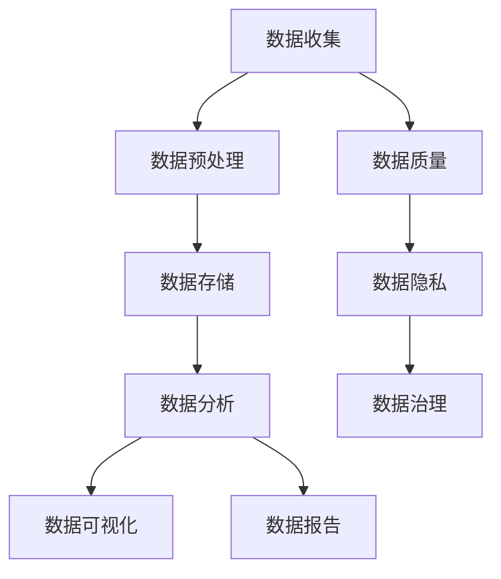
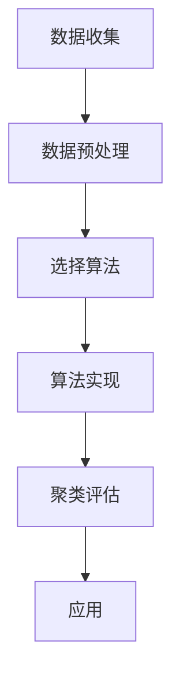

                 

### 背景介绍

在当今商业环境中，数据已成为一种新的核心资源。无论是初创企业还是成熟公司，都越来越意识到数据分析在制定战略和做出决策中的重要性。通过数据驱动的决策，企业可以更准确地识别市场趋势、理解客户需求，并优化业务流程。然而，要成功实现这一目标，企业需要掌握一系列核心概念、算法和技术工具。

本文旨在探讨创业者在创业道路上如何运用数据分析来做出更明智的决策。我们将首先介绍数据分析的基础概念，包括数据收集、处理、分析和可视化等方面。接着，我们将深入探讨一些核心算法，如回归分析、聚类分析和时间序列分析等，以及它们在商业决策中的应用。然后，我们将通过一个实际案例，展示如何将数据分析应用于创业项目中。最后，我们将总结创业者在数据分析中可能遇到的挑战，并提供一些实用的建议和资源。

本文的主要目标是帮助创业者理解数据分析的基本原理，掌握关键工具和算法，并学会如何在实际业务场景中运用这些知识，从而做出数据驱动的决策。通过阅读本文，创业者将能够更好地利用数据，提高业务效率，降低风险，并在激烈的市场竞争中脱颖而出。

### 核心概念与联系

在数据分析的世界中，有一些核心概念和联系是理解其工作原理和应用的关键。以下是一个简化的Mermaid流程图，用于展示这些核心概念和它们之间的关系。



- **数据收集**（A）：这是数据分析的起点。数据可以来自各种来源，包括内部系统、第三方数据提供商或用户生成的内容。数据收集的质量直接影响后续分析的准确性和可靠性。

- **数据预处理**（B）：收集到的数据通常需要清洗和格式化，以确保其适合进一步分析。这一步骤包括去除重复数据、填补缺失值、处理异常值等。

- **数据存储**（C）：经过预处理的数据需要存储在适当的数据库或数据仓库中，以便于访问和管理。

- **数据分析**（D）：这是核心步骤，包括使用统计方法、机器学习算法等对数据进行处理，以提取有用的信息和洞察。

- **数据可视化**（E）：将分析结果以图表、图形或地图等形式展示出来，使数据变得更加直观和易于理解。

- **数据报告**（F）：将分析结果和可视化报告传达给决策者，以便他们做出基于数据的决策。

- **数据质量**（G）：确保数据在收集、处理和存储过程中保持准确、完整和一致。

- **数据隐私**（H）：在处理和存储数据时，必须遵守隐私法规和标准，保护用户隐私。

- **数据治理**（I）：建立一套数据管理和使用规则，确保数据的有效性和合规性。

这些核心概念和流程之间的相互作用和联系，构成了数据分析的基础架构。每个步骤都至关重要，共同作用，帮助企业从数据中提取有价值的信息，从而做出更明智的决策。

### 核心算法原理 & 具体操作步骤

在数据分析中，核心算法是提取有用信息和洞察的关键工具。以下我们将介绍几种常用的核心算法，并详细描述它们的原理和具体操作步骤。

#### 1. 回归分析

**原理**：回归分析是一种统计方法，用于识别和量化两个或多个变量之间的关系。最常用的回归方法是线性回归，它假设因变量（目标变量）与自变量（解释变量）之间存在线性关系。

**步骤**：
1. 数据收集：收集包含因变量和自变量的数据集。
2. 数据预处理：清洗数据，确保数据的准确性和一致性。
3. 选择模型：确定使用线性回归模型。
4. 模型训练：使用数据集对模型进行训练。
5. 模型评估：评估模型的性能，通常使用均方误差（MSE）等指标。
6. 预测：使用训练好的模型进行预测。

**示例**：假设我们想要预测一家公司的年度收入，使用过去的销售数据和历史财务数据。

```latex
$$
y = \beta_0 + \beta_1 \times x
$$`

其中，\( y \) 是年度收入，\( x \) 是销售数据，\( \beta_0 \) 和 \( \beta_1 \) 是模型参数。

#### 2. 聚类分析

**原理**：聚类分析是一种无监督学习方法，用于将数据集划分为若干个类别（簇），使得同一簇内的数据点相似，而不同簇的数据点之间差异较大。

**步骤**：
1. 数据收集：收集待分类的数据集。
2. 数据预处理：清洗数据，确保数据的准确性和一致性。
3. 选择算法：确定使用哪种聚类算法，如K-Means、层次聚类等。
4. 算法实现：实现选定的算法。
5. 聚类评估：评估聚类结果的质量，通常使用内聚度和分离度等指标。
6. 应用：将聚类结果应用于实际业务场景。

**示例**：假设我们要将客户数据分为高价值客户和低价值客户。



#### 3. 时间序列分析

**原理**：时间序列分析是一种用于处理时间相关数据的方法，主要用于预测未来的趋势和模式。

**步骤**：
1. 数据收集：收集时间序列数据。
2. 数据预处理：清洗数据，确保数据的准确性和一致性。
3. 模型选择：确定使用哪种时间序列模型，如ARIMA、LSTM等。
4. 模型训练：使用数据集对模型进行训练。
5. 模型评估：评估模型的性能，通常使用均方误差（MSE）等指标。
6. 预测：使用训练好的模型进行预测。

**示例**：假设我们要预测未来的销售额。

```latex
$$
y_t = \phi_0 + \phi_1 \times y_{t-1} + \epsilon_t
$$`

其中，\( y_t \) 是第 \( t \) 期的销售额，\( \phi_0 \) 和 \( \phi_1 \) 是模型参数，\( \epsilon_t \) 是误差项。

这些核心算法在数据分析中扮演着至关重要的角色，通过它们，企业可以更准确地理解数据、预测未来趋势，并做出更明智的决策。

### 数学模型和公式 & 详细讲解 & 举例说明

在数据分析中，数学模型和公式是理解和应用核心算法的基础。以下我们将详细介绍几种常用模型和公式，并提供实际应用中的具体示例。

#### 1. 线性回归模型

**公式**：

线性回归模型的基本公式为：

$$
y = \beta_0 + \beta_1 \times x + \epsilon
$$

其中：
- \( y \) 是因变量（预测的目标变量）；
- \( x \) 是自变量（解释变量）；
- \( \beta_0 \) 是截距，表示当 \( x = 0 \) 时的 \( y \) 值；
- \( \beta_1 \) 是斜率，表示 \( x \) 每增加一个单位时 \( y \) 的变化量；
- \( \epsilon \) 是误差项，表示模型无法解释的随机误差。

**示例**：假设我们有一个销售数据集，其中 \( x \) 代表广告支出（单位：千元），\( y \) 代表销售额（单位：千元）。通过线性回归模型，我们希望找出广告支出对销售额的影响。

给定数据：

| 广告支出 \( x \) | 销售额 \( y \) |
|:--------------:|:-------------:|
|       1000     |      5000     |
|       2000     |      6000     |
|       3000     |      7500     |
|       4000     |      9000     |

我们使用线性回归模型进行拟合：

$$
y = 2500 + 1.5 \times x
$$

通过这个模型，我们可以预测当广告支出为 3000 千元时的销售额：

$$
y = 2500 + 1.5 \times 3000 = 7000
$$

因此，预测的销售额为 7000 千元。

#### 2. 聚类分析

**公式**：

K-Means聚类算法的基本公式为：

$$
c_i = \frac{1}{N_i} \sum_{n=1}^{N_i} x_n
$$

其中：
- \( c_i \) 是第 \( i \) 个聚类中心的坐标；
- \( N_i \) 是第 \( i \) 个聚类中的数据点数量；
- \( x_n \) 是第 \( n \) 个数据点的坐标。

**示例**：假设我们有五个数据点，需要将它们分为两个簇。

给定数据：

| 数据点 | 坐标 \( (x, y) \) |
|:-----:|:---------------:|
|   1   |       (1, 1)    |
|   2   |       (2, 2)    |
|   3   |       (5, 5)    |
|   4   |       (6, 6)    |
|   5   |       (9, 9)    |

初始聚类中心为 \( c_1 = (0, 0) \) 和 \( c_2 = (10, 10) \)。

计算每个数据点与聚类中心的距离，并将其分配到最近的聚类中心：

- 数据点 1 和 2 被分配到 \( c_1 \)；
- 数据点 3、4 和 5 被分配到 \( c_2 \)。

然后重新计算新的聚类中心：

$$
c_1 = \frac{1}{2} \sum_{n=1}^{2} x_n = (1.5, 1.5) \\
c_2 = \frac{1}{3} \sum_{n=3}^{5} x_n = (6, 6)
$$

重复此过程，直到聚类中心不再发生变化。

#### 3. 时间序列分析

**公式**：

ARIMA（自回归积分滑动平均模型）的基本公式为：

$$
y_t = \phi_0 + \phi_1 y_{t-1} + \phi_2 y_{t-2} + \epsilon_t
$$

其中：
- \( y_t \) 是第 \( t \) 期的观测值；
- \( \phi_0 \), \( \phi_1 \), 和 \( \phi_2 \) 是模型参数；
- \( \epsilon_t \) 是误差项。

**示例**：假设我们有一个销售数据集，需要使用ARIMA模型进行预测。

给定数据：

| 期数 \( t \) | 销售额 \( y \) |
|:---------:|:------------:|
|     1     |      1000    |
|     2     |      1100    |
|     3     |      1200    |
|     4     |      1300    |
|     5     |      1400    |

我们首先对数据进行差分，消除趋势和季节性：

$$
y_{t-diff} = y_t - y_{t-1}
$$

然后使用AIC（赤池信息准则）选择合适的模型参数 \( \phi_0 \), \( \phi_1 \), 和 \( \phi_2 \)。

通过迭代求解，我们得到以下ARIMA模型：

$$
y_t = 1000 + 0.8 y_{t-1} + 0.2 y_{t-2} + \epsilon_t
$$

使用这个模型，我们可以预测下一期的销售额：

$$
y_{6} = 1000 + 0.8 \times 1400 + 0.2 \times 1300 = 1480
$$

因此，预测的下一期销售额为 1480。

通过这些数学模型和公式，我们可以更好地理解和应用数据分析的核心算法，从而在实际业务场景中做出更准确的预测和决策。

### 项目实战：代码实际案例和详细解释说明

为了更好地理解数据分析在实际业务中的应用，我们将通过一个实际案例来展示如何使用Python进行数据分析，包括环境搭建、代码实现和代码解读。

#### 1. 开发环境搭建

首先，我们需要搭建Python数据分析的开发环境。以下是在Windows操作系统上安装Python和相关数据分析库的步骤：

1. **安装Python**：

   访问Python官方网站（[python.org](https://www.python.org/)）下载Python安装程序，选择适合的版本并安装。安装过程中确保选择“Add Python to PATH”选项。

2. **安装数据分析库**：

   打开命令行窗口，执行以下命令安装必要的库：

   ```bash
   pip install numpy pandas matplotlib scikit-learn
   ```

   这些库包括：
   - **numpy**：用于高性能数学运算；
   - **pandas**：用于数据操作和分析；
   - **matplotlib**：用于数据可视化；
   - **scikit-learn**：用于机器学习算法。

#### 2. 源代码详细实现和代码解读

以下是一个简单的Python数据分析项目，用于预测股票价格。代码分为三个部分：数据收集、数据处理和模型训练。

```python
# 导入必要的库
import numpy as np
import pandas as pd
import matplotlib.pyplot as plt
from sklearn.model_selection import train_test_split
from sklearn.linear_model import LinearRegression
from sklearn.metrics import mean_squared_error

# 2.1 数据收集
# 加载股票价格数据
data = pd.read_csv('stock_price.csv')
data.head()

# 2.2 数据处理
# 数据预处理：将日期列转换为序列号
data['Date'] = pd.to_datetime(data['Date'])
data['Day'] = (data['Date'] - data['Date'].min()) / np.timedelta64(1,'D')

# 划分特征和目标变量
X = data[['Day']]
y = data['Price']

# 数据集划分：训练集和测试集
X_train, X_test, y_train, y_test = train_test_split(X, y, test_size=0.2, random_state=42)

# 2.3 模型训练
# 实例化线性回归模型
model = LinearRegression()
model.fit(X_train, y_train)

# 预测测试集结果
y_pred = model.predict(X_test)

# 模型评估
mse = mean_squared_error(y_test, y_pred)
print(f'Mean Squared Error: {mse}')

# 可视化结果
plt.scatter(X_test, y_test, color='blue', label='Actual')
plt.plot(X_test, y_pred, color='red', label='Predicted')
plt.xlabel('Day')
plt.ylabel('Price')
plt.legend()
plt.show()
```

**代码解读**：

1. **数据收集**：

   使用pandas库加载股票价格数据。数据集通常包含日期和价格信息，例如：

   ```python
   data = pd.read_csv('stock_price.csv')
   data.head()
   ```

   这里假设数据文件名为`stock_price.csv`，实际使用时请替换为实际的数据文件名。

2. **数据处理**：

   - 将日期列转换为序列号，便于线性回归模型处理。
     ```python
     data['Date'] = pd.to_datetime(data['Date'])
     data['Day'] = (data['Date'] - data['Date'].min()) / np.timedelta64(1,'D')
     ```

   - 划分特征和目标变量。
     ```python
     X = data[['Day']]
     y = data['Price']
     ```

   - 数据集划分：将数据集划分为训练集和测试集，通常使用80%的数据作为训练集，20%的数据作为测试集。
     ```python
     X_train, X_test, y_train, y_test = train_test_split(X, y, test_size=0.2, random_state=42)
     ```

3. **模型训练**：

   - 实例化线性回归模型。
     ```python
     model = LinearRegression()
     ```

   - 使用训练集数据进行模型训练。
     ```python
     model.fit(X_train, y_train)
     ```

   - 预测测试集结果。
     ```python
     y_pred = model.predict(X_test)
     ```

   - 模型评估：使用均方误差（MSE）评估模型性能。
     ```python
     mse = mean_squared_error(y_test, y_pred)
     print(f'Mean Squared Error: {mse}')
     ```

   - 可视化结果：将实际价格和预测价格进行可视化比较。
     ```python
     plt.scatter(X_test, y_test, color='blue', label='Actual')
     plt.plot(X_test, y_pred, color='red', label='Predicted')
     plt.xlabel('Day')
     plt.ylabel('Price')
     plt.legend()
     plt.show()
     ```

通过这个实际案例，我们展示了如何使用Python进行股票价格预测。尽管这个案例相对简单，但它提供了数据分析的基本流程，包括数据收集、预处理、模型训练和评估。在实际应用中，创业者可以根据自己的业务需求，扩展和优化这些流程，以实现更复杂的分析和预测。

#### 3. 代码解读与分析

在上一个部分中，我们实现了一个简单的股票价格预测项目。在这一部分，我们将深入分析代码的各个部分，详细解释其功能和工作原理。

**3.1 数据收集**

代码的第一部分是数据收集，这一步非常关键，因为它决定了后续分析的质量。我们使用pandas库的`read_csv`函数加载股票价格数据。这个函数接受一个文件路径参数，并读取CSV文件中的数据。

```python
data = pd.read_csv('stock_price.csv')
data.head()
```

这里，`stock_price.csv`是我们存储数据的CSV文件。`head()`函数用于显示数据的前几行，以便我们初步了解数据内容。

**3.2 数据处理**

数据处理是数据分析的核心步骤，它确保数据能够被有效地分析和预测。以下是数据处理的关键部分：

- **日期转换为序列号**：在数据分析中，日期通常不适合直接用于模型训练。我们将日期转换为序列号，这样可以方便地进行数值计算。

```python
data['Date'] = pd.to_datetime(data['Date'])
data['Day'] = (data['Date'] - data['Date'].min()) / np.timedelta64(1,'D')
```

这里，`pd.to_datetime`函数将日期列转换为Python的datetime对象。然后，我们计算每个日期与数据集开始日期之间的天数差，并将其存储在新的`Day`列中。

- **特征和目标变量的划分**：在回归分析中，特征变量（自变量）用于预测目标变量（因变量）。在这里，我们将`Day`列作为特征变量，`Price`列作为目标变量。

```python
X = data[['Day']]
y = data['Price']
```

**3.3 模型训练**

模型训练是将数据输入到模型中，并通过调整模型参数来优化预测效果。以下是模型训练的关键步骤：

- **数据集划分**：我们将数据集划分为训练集和测试集，以评估模型的泛化能力。`train_test_split`函数用于这一目的。

```python
X_train, X_test, y_train, y_test = train_test_split(X, y, test_size=0.2, random_state=42)
```

这里，`X`和`y`是我们的特征变量和目标变量。`test_size=0.2`表示测试集占总数据集的20%，`random_state=42`确保每次分割结果一致。

- **线性回归模型实例化**：我们选择线性回归模型，这是最简单且常用的回归模型。

```python
model = LinearRegression()
```

- **模型训练**：使用训练集数据对模型进行训练。

```python
model.fit(X_train, y_train)
```

- **模型预测**：使用训练好的模型对测试集进行预测。

```python
y_pred = model.predict(X_test)
```

- **模型评估**：使用均方误差（MSE）评估模型性能。

```python
mse = mean_squared_error(y_test, y_pred)
print(f'Mean Squared Error: {mse}')
```

MSE是评估回归模型性能的一个常见指标，它表示预测值与实际值之间的平均平方误差。

**3.4 可视化结果**

最后，我们使用matplotlib库将实际价格和预测价格进行可视化，以直观地展示模型效果。

```python
plt.scatter(X_test, y_test, color='blue', label='Actual')
plt.plot(X_test, y_pred, color='red', label='Predicted')
plt.xlabel('Day')
plt.ylabel('Price')
plt.legend()
plt.show()
```

这个步骤非常直观，蓝色点表示实际价格，红色线表示预测价格。通过这个图表，我们可以清楚地看到模型的预测效果。

**3.5 代码优化与改进**

虽然这个案例展示了基本的数据分析和模型训练过程，但在实际应用中，我们通常需要对代码进行优化和改进，以提高模型的性能和预测能力。以下是一些可能的改进方向：

- **数据预处理**：根据实际情况，可能需要更复杂的预处理步骤，如特征工程、缺失值填补、异常值处理等。
- **模型选择**：根据数据的特点和业务需求，选择更合适的模型，如岭回归、LASSO回归或更复杂的机器学习模型。
- **超参数调优**：通过交叉验证和网格搜索等技术，调整模型的超参数，以获得更好的模型性能。
- **模型集成**：使用模型集成技术，如随机森林、梯度提升树等，提高预测准确性。

通过这些改进，我们可以使模型更适应实际业务需求，从而实现更准确的预测和决策。

### 实际应用场景

数据分析在商业决策中的重要性不言而喻，它不仅帮助创业者理解市场趋势，还能提高业务效率，降低运营成本。以下是一些典型的实际应用场景，展示了数据分析如何帮助创业者在不同业务领域中做出数据驱动的决策。

#### 1. 市场营销

市场营销是创业者面临的核心挑战之一。通过数据分析，创业者可以更好地理解客户行为和市场趋势，从而制定更有效的营销策略。

- **客户细分**：利用聚类分析，将客户分为不同的细分市场，以便为每个细分市场制定个性化的营销策略。
- **客户留存**：通过回归分析，识别影响客户留存的关键因素，如产品满意度、客户服务体验等，并采取相应措施提高客户留存率。
- **广告效果分析**：使用归因模型，分析不同广告渠道的投资回报率（ROI），优化广告预算分配，提高广告效果。

#### 2. 产品开发

在产品开发过程中，数据分析可以帮助创业者识别市场需求，优化产品设计，提高产品质量。

- **需求分析**：通过调查问卷、用户反馈等收集用户需求，使用统计分析方法识别主要需求和优先级。
- **用户体验优化**：利用A/B测试和实验设计，对比不同产品版本的用户体验，优化产品功能和界面设计。
- **产品生命周期分析**：使用时间序列分析，预测产品的生命周期，制定相应的产品更新和迭代策略。

#### 3. 销售和渠道管理

销售和渠道管理是创业者实现业务增长的关键环节。数据分析可以帮助创业者优化销售策略，提高销售额。

- **销售预测**：利用时间序列分析和回归分析，预测未来销售额，制定销售计划和库存管理策略。
- **渠道优化**：通过聚类分析，识别不同渠道的市场表现，优化渠道布局和资源配置。
- **客户关系管理**：使用客户细分和回归分析，制定个性化的客户关系管理策略，提高客户满意度和忠诚度。

#### 4. 财务管理

在财务管理中，数据分析可以帮助创业者优化财务决策，降低运营成本，提高企业盈利能力。

- **成本分析**：通过回归分析和数据挖掘，识别成本驱动因素，优化成本结构和控制成本。
- **现金流管理**：使用时间序列分析，预测未来的现金流，确保企业财务健康。
- **投资分析**：通过数据分析，评估不同投资项目的风险和回报，制定最优的投资策略。

#### 5. 供应链管理

供应链管理是影响企业运营效率和成本的重要因素。通过数据分析，创业者可以优化供应链流程，提高供应链效率。

- **库存管理**：利用时间序列分析和预测模型，优化库存水平，减少库存成本和库存积压。
- **物流优化**：通过聚类分析和路径规划算法，优化物流配送路线，降低物流成本。
- **供应商管理**：使用数据分析，评估供应商的表现和风险，制定供应商选择和评价策略。

通过以上实际应用场景，我们可以看到数据分析在商业决策中的重要性。创业者可以利用数据分析的工具和方法，从海量数据中提取有价值的信息，制定更明智的决策，提高业务效率和竞争力。

### 工具和资源推荐

为了更好地进行数据分析，掌握合适的工具和资源至关重要。以下是一些建议，涵盖书籍、博客、网站和开发工具框架等，以帮助创业者深入学习数据分析，提高数据分析能力。

#### 1. 学习资源推荐

**书籍**：
- 《Python数据分析》（Michael Galarnyk）：这是一本适合初学者的Python数据分析入门书籍，详细介绍了pandas、numpy等数据分析库的使用。
- 《数据科学入门》（Joel Grus）：这本书以Python为例，讲解了数据清洗、数据可视化、机器学习等数据分析的核心概念和技术。
- 《数据之美》（David McCandless）：这本书通过案例展示了数据可视化的艺术，帮助读者理解如何将数据转化为直观且有力的信息。

**博客**：
- [Medium上的Data Science博客](https://medium.com/data-science-blog)：这是一个汇聚了众多数据分析文章的博客平台，涵盖从基础概念到高级应用的各个方面。
- [Towards Data Science博客](https://towardsdatascience.com/)：这是一个内容丰富的博客，提供了许多关于数据分析、机器学习和数据可视化的文章和教程。
- [CSDN博客](https://blog.csdn.net/)：这是一个中文技术博客平台，许多数据分析专家在这里分享他们的经验和心得。

**网站**：
- [Kaggle](https://www.kaggle.com/)：这是一个数据科学竞赛平台，提供了大量的数据集和比赛，是学习和实践数据分析的绝佳资源。
- [DataCamp](https://www.datacamp.com/)：这是一个在线学习平台，提供了丰富的数据分析教程和互动练习，适合初学者和进阶者。
- [DataQuest](https://www.dataquest.io/)：这是一个在线学习平台，专注于数据科学和数据分析，提供了系统化的课程和项目实践。

#### 2. 开发工具框架推荐

**数据分析库**：
- **Pandas**：Python的数据操作和分析库，非常适合进行数据清洗、数据预处理和数据分析。
- **NumPy**：Python的数值计算库，提供了强大的数学运算功能，是数据分析的基础工具。
- **Matplotlib**：Python的数据可视化库，用于创建各种类型的图表和图形，帮助数据分析师将数据可视化。
- **Scikit-learn**：Python的机器学习库，提供了多种常用的机器学习算法和工具，适用于数据挖掘和预测分析。

**数据存储和处理工具**：
- **Hadoop**：一个分布式数据存储和处理框架，适用于大规模数据集的存储和处理。
- **Spark**：一个快速且通用的数据处理引擎，特别适合大数据场景，提供了丰富的数据分析库。
- **SQL数据库**：如MySQL、PostgreSQL等，用于存储和管理结构化数据，适合中小规模的数据分析项目。

**数据可视化工具**：
- **Tableau**：一款功能强大的数据可视化工具，支持多种数据源和丰富的可视化图表。
- **Power BI**：微软推出的数据可视化工具，提供了直观的可视化界面和强大的分析功能。
- **D3.js**：一个基于JavaScript的库，用于创建高度交互式的数据可视化，特别适合前端开发人员。

通过这些工具和资源，创业者可以更好地掌握数据分析的方法和技能，从而在实际业务中做出更明智的决策。

### 总结：未来发展趋势与挑战

随着技术的不断进步，数据分析在创业领域正面临着前所未有的机遇和挑战。未来，数据分析将继续在以下方面发挥关键作用：

1. **人工智能与机器学习的融合**：人工智能和机器学习算法将在数据分析中扮演更加重要的角色，通过自动化和智能化，提高数据分析的效率和准确性。

2. **实时数据分析**：随着大数据和云计算技术的发展，实时数据分析将成为可能，企业可以更快地响应市场变化，优化业务流程。

3. **个性化与定制化**：通过深入的数据分析和机器学习算法，创业者可以提供更个性化的产品和服务，满足不同客户的需求。

然而，面对这些机遇，创业者也必须应对以下挑战：

1. **数据隐私与安全**：随着数据量的增加，保护数据隐私和安全成为重要课题。创业者需要遵守相关法律法规，采取有效措施保护用户数据。

2. **数据质量与完整性**：高质量的数据是进行分析的基础。创业者需要确保数据收集、处理和存储过程中的准确性和一致性。

3. **技术更新与适应**：数据分析技术和工具不断发展，创业者需要不断学习和适应新技术，保持竞争力。

总的来说，数据分析在创业领域具有广阔的应用前景，但也伴随着诸多挑战。创业者需要充分利用数据分析的优势，同时积极应对潜在的风险，以实现可持续发展。

### 附录：常见问题与解答

在数据分析的实际应用中，创业者可能会遇到各种问题。以下是一些常见问题及其解答，以帮助创业者更好地理解和应用数据分析。

#### 1. 如何确保数据分析的质量？

确保数据分析质量的关键在于数据收集、处理和存储过程中的准确性、一致性和完整性。以下是一些建议：

- **数据清洗**：在数据分析前，对数据进行清洗，去除重复数据、填补缺失值、处理异常值。
- **数据标准化**：确保数据格式和单位一致，便于分析。
- **数据验证**：使用数据验证工具和方法，检查数据的准确性和一致性。
- **数据治理**：建立数据管理和使用规则，确保数据的合规性和安全性。

#### 2. 如何选择适合的数据分析方法？

选择数据分析方法取决于业务需求和数据特性。以下是一些常见的分析方法及其适用场景：

- **回归分析**：用于预测和分析变量之间的关系，适用于销售预测、风险评估等。
- **聚类分析**：用于将数据分为不同的类别，适用于客户细分、市场细分等。
- **时间序列分析**：用于分析随时间变化的数据，适用于股票预测、销售额预测等。
- **机器学习**：用于复杂的数据模式和关系识别，适用于图像识别、推荐系统等。

#### 3. 如何处理大量数据？

对于大量数据，以下方法可以帮助提高数据处理和分析的效率：

- **分布式计算**：使用分布式计算框架（如Hadoop、Spark）处理大规模数据集。
- **数据抽样**：对大量数据进行抽样分析，以减少计算量。
- **数据压缩**：使用数据压缩技术，减少存储和传输的开销。
- **优化算法**：选择高效的数据分析算法和模型，降低计算复杂度。

#### 4. 如何避免数据隐私泄露？

保护数据隐私是数据分析的重要挑战。以下措施可以帮助避免数据隐私泄露：

- **加密**：对敏感数据进行加密存储和传输。
- **访问控制**：实施严格的访问控制策略，确保只有授权用户可以访问敏感数据。
- **数据脱敏**：对敏感数据进行脱敏处理，如替换、掩码等。
- **合规性检查**：遵守相关法律法规和标准，确保数据处理和使用合法。

#### 5. 如何进行数据可视化？

数据可视化是将数据分析结果以图表、图形等形式展示出来的过程。以下是一些常用的数据可视化工具和方法：

- **Matplotlib**：Python的图形绘制库，适合创建各种类型的图表。
- **Tableau**：功能强大的数据可视化工具，支持丰富的图表和交互功能。
- **Power BI**：微软推出的数据可视化工具，易于使用和定制。
- **D3.js**：基于JavaScript的库，适合创建高度交互式的数据可视化。

通过以上常见问题的解答，创业者可以更好地理解和应用数据分析，从而在创业道路上做出更明智的决策。

### 扩展阅读 & 参考资料

为了帮助创业者更深入地了解数据分析，以下是一些建议的扩展阅读和参考资料，涵盖了从基础概念到高级应用的各个方面。

#### 基础书籍

1. **《Python数据分析》**（Michael Galarnyk）
   - 简介：适合初学者的Python数据分析入门书籍，详细介绍了pandas、numpy等数据分析库的使用。
   - 阅读推荐：适合那些希望快速上手数据分析的创业者。

2. **《数据科学入门》**（Joel Grus）
   - 简介：通过Python示例讲解了数据清洗、数据可视化、机器学习等数据分析核心概念。
   - 阅读推荐：适合初学者到进阶者，对数据科学有全面了解的需求。

3. **《数据之美》**（David McCandless）
   - 简介：通过案例展示了数据可视化的艺术，帮助读者理解如何将数据转化为直观且有力的信息。
   - 阅读推荐：适合对数据可视化感兴趣的创业者。

#### 高级书籍

1. **《深度学习》**（Ian Goodfellow, Yoshua Bengio, Aaron Courville）
   - 简介：深度学习领域的经典教材，涵盖了从基础理论到实际应用的各种深度学习模型和技术。
   - 阅读推荐：适合对机器学习和深度学习有深入研究的创业者。

2. **《大数据之路：阿里巴巴大数据实践》**（涂子沛）
   - 简介：分享了阿里巴巴在大数据领域的发展历程和实践经验，包括数据收集、处理、分析和应用等方面。
   - 阅读推荐：适合希望了解大数据应用和商业价值的创业者。

#### 在线课程与教程

1. **Coursera上的《数据科学专项课程》**
   - 简介：由约翰·霍普金斯大学提供的一系列数据科学课程，涵盖数据清洗、数据可视化、机器学习等。
   - 阅读推荐：适合有系统学习数据科学需求的创业者。

2. **edX上的《深度学习专项课程》**
   - 简介：由哈佛大学提供的一系列深度学习课程，包括深度神经网络、卷积神经网络等。
   - 阅读推荐：适合对深度学习有浓厚兴趣的创业者。

3. **Udacity的《数据分析师纳米学位》**
   - 简介：提供了一系列关于数据分析的实际应用课程，包括数据可视化、机器学习等。
   - 阅读推荐：适合那些希望将数据分析技能应用于实际业务的创业者。

#### 在线资源

1. **Kaggle**
   - 简介：一个数据科学竞赛平台，提供了大量的数据集和比赛，是学习和实践数据分析的绝佳资源。
   - 阅读推荐：适合希望通过实际项目提升数据分析技能的创业者。

2. **DataCamp**
   - 简介：一个在线学习平台，提供了丰富的数据分析教程和互动练习，适合初学者和进阶者。
   - 阅读推荐：适合系统学习和练习数据分析技能的创业者。

3. **Towards Data Science**
   - 简介：一个内容丰富的博客平台，提供了许多关于数据分析、机器学习和数据可视化的文章和教程。
   - 阅读推荐：适合想要了解数据分析最新动态和技巧的创业者。

通过阅读这些书籍和参考资料，创业者可以系统地学习数据分析的理论和实战技巧，从而更好地将数据分析应用于创业实践。

