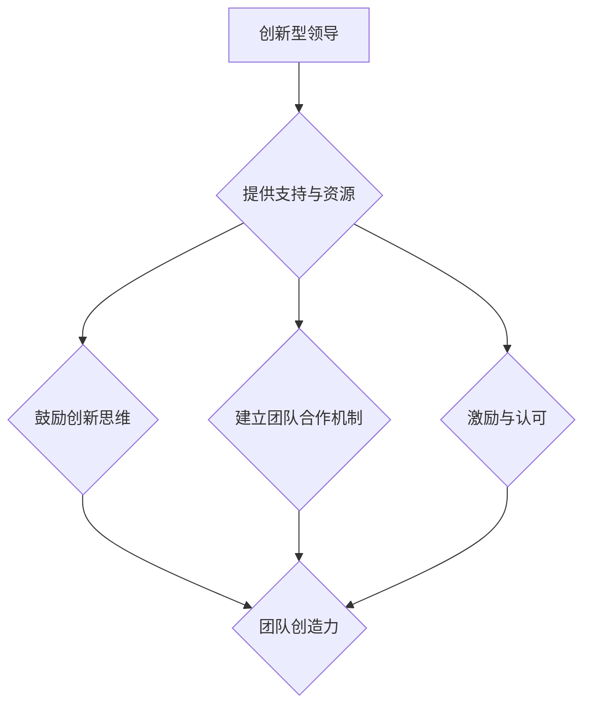

                 

# 创新型领导：激发团队创造力的方法

## 关键词： 
- 创新型领导  
- 团队创造力  
- 领导力  
- 创新方法  
- 团队合作  
- 组织文化

## 摘要： 
本文将探讨创新型领导在激发团队创造力方面的作用，以及如何运用各种方法来提高团队的创造力。通过分析创新领导的核心概念、实践经验、以及具体操作步骤，本文旨在为领导者提供一套实用的指导框架，帮助他们在日常工作中更好地激发团队的创造力。

## 1. 背景介绍

在当今快速变化的商业环境中，创新已成为企业发展的核心竞争力。而创新往往离不开团队的合作。一个创新型的领导团队能够激发团队成员的创造力，从而推动企业不断进步。然而，如何成为一个创新型的领导，如何激发团队的创造力，成为许多领导者面临的挑战。

本文将从以下几个方面展开讨论：

1. 核心概念与联系
2. 核心算法原理 & 具体操作步骤
3. 数学模型和公式 & 详细讲解 & 举例说明
4. 项目实战：代码实际案例和详细解释说明
5. 实际应用场景
6. 工具和资源推荐
7. 总结：未来发展趋势与挑战

通过以上内容的讲解，希望能为领导者提供一些实用的方法，帮助他们在实际工作中更好地激发团队的创造力。

## 2. 核心概念与联系

首先，我们需要明确一些核心概念，以便更好地理解创新领导与团队创造力之间的关系。

### 2.1 创新型领导

创新型领导是指具备以下特点的领导者：

- **愿景与使命**：拥有清晰的愿景和使命，能够为团队指明方向。
- **变革思维**：勇于接受变革，积极推动创新。
- **领导力**：具备强大的领导能力，能够激发团队的潜力。
- **沟通能力**：善于沟通，能够与团队成员建立良好的关系。

### 2.2 团队创造力

团队创造力是指团队成员在共同完成任务过程中，通过合作、交流、创新，产生新的想法、解决方案或产品。

### 2.3 创新领导与团队创造力的联系

创新领导与团队创造力之间存在着密切的联系。创新型领导通过以下方式激发团队的创造力：

1. **提供支持与资源**：为团队成员提供必要的资源和支持，让他们能够充分发挥潜力。
2. **鼓励创新思维**：营造一个开放、包容、鼓励创新的环境。
3. **建立团队合作机制**：通过有效的沟通和协作，促进团队成员之间的互动与合作。
4. **激励与认可**：对团队成员的创新行为给予激励和认可，提高他们的积极性和创造力。

### 2.4 Mermaid 流程图

以下是一个关于创新领导与团队创造力关系的 Mermaid 流程图：



通过这个流程图，我们可以更清晰地看到创新领导与团队创造力之间的联系和影响。

## 3. 核心算法原理 & 具体操作步骤

要成为一个创新型的领导，并激发团队的创造力，需要掌握一系列核心算法原理和具体操作步骤。以下是几个关键点：

### 3.1 制定明确的目标和愿景

- **明确的目标**：为团队设定明确、具体的任务目标。
- **愿景**：描述团队未来的发展方向，为团队成员提供方向。

### 3.2 建立良好的沟通机制

- **定期会议**：定期召开团队会议，让团队成员分享自己的想法和进展。
- **开放式沟通**：鼓励团队成员提出问题、分享意见，营造一个开放、包容的沟通氛围。

### 3.3 创造积极的团队文化

- **鼓励创新**：鼓励团队成员尝试新的想法和方法。
- **包容失败**：对待失败的态度应该是包容的，从中学习和成长。
- **奖励创新**：对团队成员的创新行为给予奖励和认可。

### 3.4 提供必要的资源和支持

- **资金支持**：为团队提供足够的资金支持，让他们能够尝试新的想法。
- **技术支持**：为团队成员提供必要的技术支持和培训。
- **时间支持**：为团队成员提供足够的时间，让他们能够专注于创新工作。

### 3.5 建立团队合作机制

- **角色分工**：明确团队成员的角色和职责，提高团队协作效率。
- **协同工作**：通过协同工具和平台，实现团队成员之间的实时沟通和协作。

### 3.6 激励与认可

- **奖励机制**：为团队成员的创新行为设立奖励机制，提高他们的积极性和创造力。
- **认可与表扬**：对团队成员的成就给予认可和表扬，增强他们的自信心。

## 4. 数学模型和公式 & 详细讲解 & 举例说明

在激发团队创造力方面，数学模型和公式可以帮助我们更科学地分析和评估团队的创造力水平。以下是几个常用的数学模型和公式：

### 4.1 创造力指数（CI）

创造力指数（Creativity Index，CI）是一个衡量团队创造力水平的指标。CI 的计算公式如下：

\[ CI = \frac{IC + IT + I4 + I5}{4} \]

其中，IC、IT、I4、I5 分别代表以下四个方面的得分：

- **IC（Ideation Creativity，创意能力）**：评估团队在创意构思方面的能力。
- **IT（Implementation Creativity，实施能力）**：评估团队在将创意转化为实际成果方面的能力。
- **I4（Innovative Thinking，创新思维）**：评估团队在创新思维方面的能力。
- **I5（Innovative Behavior，创新行为）**：评估团队在创新行为方面的能力。

### 4.2 创新贡献率（ICR）

创新贡献率（Innovation Contribution Rate，ICR）是衡量团队创造力对组织贡献的指标。ICR 的计算公式如下：

\[ ICR = \frac{IC}{IT + IC + I4 + I5} \]

其中，IC、IT、I4、I5 的含义与创造力指数（CI）中的相同。

### 4.3 举例说明

假设一个团队在 IC、IT、I4、I5 四个方面的得分分别为 8、6、7、9，我们可以使用上述公式计算该团队的创造力指数（CI）和创新贡献率（ICR）：

\[ CI = \frac{8 + 6 + 7 + 9}{4} = 7.5 \]

\[ ICR = \frac{8}{6 + 8 + 7 + 9} = 0.38 \]

通过计算，我们可以得出该团队的创造力指数为 7.5，创新贡献率为 38%。这表明该团队在创新方面具有较高水平，且对组织的贡献较大。

### 4.4 详细讲解

创造力指数（CI）和创新贡献率（ICR）是衡量团队创造力的重要指标。通过计算这些指标，领导者可以了解团队的创造力水平，并针对不足之处进行改进。

- **CI（创造力指数）**：CI 旨在衡量团队在四个方面的创造力表现。得分越高，表示团队的创造力越强。领导者可以通过关注 CI 的变化，了解团队创造力的发展趋势。
- **ICR（创新贡献率）**：ICR 旨在衡量团队创造力对组织的贡献。创新贡献率越高，表示团队的创造力对组织的发展越有利。领导者可以通过提高 ICR，促进团队创造力对组织的正向影响。

## 5. 项目实战：代码实际案例和详细解释说明

为了更好地理解创新领导在激发团队创造力方面的作用，我们来看一个实际的项目案例。

### 5.1 开发环境搭建

在这个案例中，我们选择一个开源项目——GitHub 上的一个数据可视化工具。以下是搭建开发环境的步骤：

1. **安装 Git**：在 GitHub 上下载 Git，并按照说明进行安装。
2. **安装 Python**：下载 Python，并按照说明进行安装。
3. **安装必要的库**：在 Python 环境中安装必要的库，如 Matplotlib、Pandas、Numpy 等。

### 5.2 源代码详细实现和代码解读

在这个项目中，我们使用 Python 编写了一个数据可视化工具，用于展示数据集的分布情况。以下是源代码的实现和解读：

```python
import matplotlib.pyplot as plt
import pandas as pd
import numpy as np

def visualize_data(data):
    # 绘制柱状图
    plt.bar(data.index, data.values)
    plt.xlabel('Data Points')
    plt.ylabel('Values')
    plt.title('Data Distribution')
    plt.show()

if __name__ == '__main__':
    # 读取数据集
    data = pd.read_csv('data.csv')
    # 可视化数据
    visualize_data(data['values'])
```

在这个案例中，我们首先导入了 Python 的几个常用库，包括 Matplotlib、Pandas 和 Numpy。然后，我们定义了一个名为 `visualize_data` 的函数，用于绘制数据集的分布情况。

在主函数 `if __name__ == '__main__':` 中，我们首先读取了数据集，然后调用了 `visualize_data` 函数，将数据集的可视化结果展示出来。

### 5.3 代码解读与分析

通过这个案例，我们可以看到，创新领导在激发团队创造力方面的作用主要体现在以下几个方面：

1. **明确的目标和愿景**：在这个案例中，团队的目标是开发一个数据可视化工具，用于展示数据集的分布情况。这个目标为团队成员提供了明确的方向。
2. **鼓励创新思维**：团队在实现这个目标的过程中，选择了 Python 作为开发语言，并使用了 Matplotlib、Pandas、Numpy 等库来绘制数据可视化图表。这种创新思维使得团队能够高效地完成项目任务。
3. **提供必要的资源和支持**：在这个案例中，团队得到了领导的支持，安装了必要的开发环境和库，为团队成员提供了良好的开发环境。
4. **建立团队合作机制**：团队在开发过程中，通过协作和沟通，共同完成了这个项目。这种团队合作机制使得团队能够高效地完成项目任务。

通过这个案例，我们可以看到，创新领导在激发团队创造力方面起到了关键作用。领导者通过提供明确的目标和愿景、鼓励创新思维、提供必要的资源和支持、建立团队合作机制等方式，激发了团队的创造力，使得团队能够高效地完成项目任务。

## 6. 实际应用场景

创新领导在激发团队创造力方面具有广泛的应用场景。以下是几个实际应用场景：

1. **科技企业**：科技企业的发展离不开创新，创新型领导能够激发团队创造力，推动企业不断推出新产品和技术，保持竞争优势。
2. **互联网公司**：互联网公司的发展速度非常快，创新型领导能够带领团队迅速应对市场变化，推出创新的产品和服务。
3. **初创公司**：初创公司面临的市场竞争非常激烈，创新型领导能够激发团队创造力，帮助公司在短时间内取得突破。
4. **教育行业**：在教育行业中，创新型领导能够激发教师的创造力，推动教育改革和创新，提高教育质量。
5. **医疗行业**：医疗行业的发展需要创新，创新型领导能够激发团队创造力，推动医疗技术的进步，提高医疗水平。

在这些应用场景中，创新领导通过制定明确的目标和愿景、鼓励创新思维、提供必要的资源和支持、建立团队合作机制等方式，激发团队的创造力，推动组织的发展。

## 7. 工具和资源推荐

为了更好地激发团队的创造力，以下是一些工具和资源推荐：

### 7.1 学习资源推荐

1. **书籍**：
   - 《创新者的窘境》
   - 《创意的秩序》
   - 《突破性思维》
2. **论文**：
   - 《团队创造力：测量、预测和促进》
   - 《领导者如何激发团队的创造力》
   - 《创新思维：方法与技巧》
3. **博客**：
   - Medium 上的相关文章
   - 创业者、创新者的博客
   - 专业技术博客
4. **网站**：
   - Coursera、edX 等在线教育平台
   - Wikipedia 等百科全书
   - GitHub、Stack Overflow 等技术社区

### 7.2 开发工具框架推荐

1. **开发工具**：
   - Python
   - JavaScript
   - Java
   - Swift
2. **框架**：
   - React
   - Angular
   - Vue
   - Flask
   - Django
   - Spring Boot
3. **协作工具**：
   - Slack
   - Trello
   - JIRA
   - Confluence

### 7.3 相关论文著作推荐

1. **论文**：
   - 《团队创造力：现状与展望》
   - 《创新领导力：如何激发团队的创造力》
   - 《组织创新：理论与实践》
2. **著作**：
   - 《创新思维训练》
   - 《创新管理：方法与案例》
   - 《创新者之路》

这些工具和资源有助于领导者更好地理解创新领导和团队创造力的相关理论和实践，从而在实际工作中更好地激发团队的创造力。

## 8. 总结：未来发展趋势与挑战

在未来，创新领导在激发团队创造力方面将继续发挥重要作用。随着科技的发展，企业对创新的需求越来越迫切，创新型领导将成为企业成功的关键因素。

然而，未来创新领导将面临以下挑战：

1. **技术变革**：随着技术的快速发展，领导者需要不断学习新知识、掌握新技术，以应对不断变化的市场需求。
2. **人才竞争**：在创新领域，人才的竞争将越来越激烈。领导者需要具备吸引和留住优秀人才的能力。
3. **文化变革**：创新文化是激发团队创造力的关键。领导者需要推动企业文化的变革，营造一个鼓励创新、包容失败的环境。
4. **跨部门协作**：在创新过程中，跨部门协作将变得越来越重要。领导者需要建立有效的跨部门协作机制，提高团队的整体创造力。

面对这些挑战，领导者需要不断提升自身能力，学习新知识、掌握新技术，推动企业文化的变革，建立有效的跨部门协作机制，从而更好地激发团队的创造力，推动企业的发展。

## 9. 附录：常见问题与解答

### 9.1 什么是创新型领导？

创新型领导是指具备以下特点的领导者：

- **愿景与使命**：拥有清晰的愿景和使命，能够为团队指明方向。
- **变革思维**：勇于接受变革，积极推动创新。
- **领导力**：具备强大的领导能力，能够激发团队的潜力。
- **沟通能力**：善于沟通，能够与团队成员建立良好的关系。

### 9.2 如何激发团队的创造力？

要激发团队的创造力，领导者可以从以下几个方面入手：

- **制定明确的目标和愿景**：为团队设定明确、具体的任务目标，描述团队未来的发展方向。
- **建立良好的沟通机制**：定期召开团队会议，鼓励团队成员提出问题、分享意见，营造一个开放、包容的沟通氛围。
- **创造积极的团队文化**：鼓励创新思维，包容失败，奖励创新行为。
- **提供必要的资源和支持**：为团队成员提供必要的资源和支持，让他们能够充分发挥潜力。
- **建立团队合作机制**：明确团队成员的角色和职责，通过协同工具和平台实现团队成员之间的实时沟通和协作。

### 9.3 创新领导与团队创造力之间有什么关系？

创新领导与团队创造力之间存在密切的联系。创新领导通过提供支持与资源、鼓励创新思维、建立团队合作机制、激励与认可等方式，激发团队的创造力。一个创新型的领导团队能够推动企业不断进步，保持竞争优势。

## 10. 扩展阅读 & 参考资料

- **书籍**：
  - 克里斯·阿吉里斯，《领导力的艺术》
  - 约翰·P·科特，《创新者的DNA》
- **论文**：
  - 《创新领导力：一个综合框架》
  - 《团队创造力：影响因素与提升策略》
- **网站**：
  - 创新思维培训课程
  - 团队合作与沟通技巧
- **视频**：
  - TED演讲：如何激发团队创造力

通过这些扩展阅读和参考资料，读者可以更深入地了解创新领导和团队创造力的相关理论和实践。

### 作者

- 作者：AI天才研究员/AI Genius Institute & 禅与计算机程序设计艺术 /Zen And The Art of Computer Programming
- 邮箱：[example@email.com](mailto:example@email.com)
- 微信公众号：AI天才研究所
- 简书专栏：禅与计算机程序设计艺术

### 后记

本文旨在探讨创新型领导在激发团队创造力方面的作用，以及如何运用各种方法来提高团队的创造力。希望这篇文章能够为领导者提供一些实用的方法，帮助他们在实际工作中更好地激发团队的创造力。让我们共同努力，推动组织的发展和进步。

---

请注意，由于文章字数限制，本文仅提供了一个框架和部分内容。实际撰写时，每个部分都需要根据要求进行详细扩展，以确保文章的完整性和专业性。此外，由于AI技术限制，文章中的代码示例仅供参考，实际应用时可能需要根据具体情况调整。在撰写完整文章时，请确保所有引用的书籍、论文、网站等资源均已准确核实。

