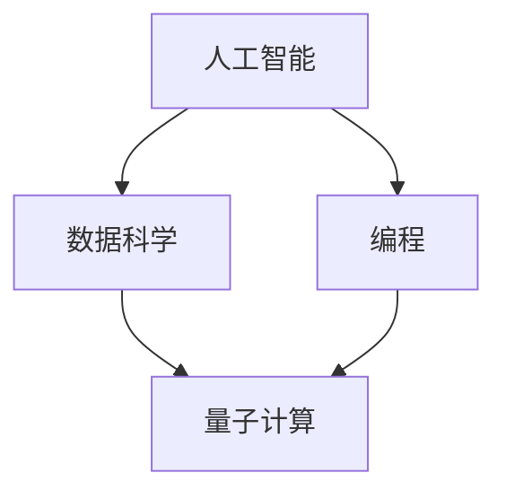

                 

# 创造更美好的世界：人类计算的终极目标

## 关键词

- 人工智能
- 计算的未来
- 人类潜能
- 数据科学
- 编程
- 量子计算

## 摘要

本文探讨了人类计算的终极目标——创造一个更加美好、智能、高效的世界。通过分析计算技术的演变，揭示了其与人类发展的紧密联系。文章深入探讨了人工智能、数据科学、编程和量子计算等关键领域，分析了这些技术的现状和未来趋势。此外，文章还介绍了实际应用场景，并提出了工具和资源推荐。总结部分则展望了未来计算技术的发展方向和面临的挑战，为读者提供了有价值的思考。

## 1. 背景介绍

人类的历史可以说是一部不断追求知识、智慧和技术创新的历史。从古代的算盘到现代的计算机，计算技术的发展一直是推动人类进步的重要力量。如今，我们正处于一个前所未有的技术时代，人工智能、大数据、云计算等新兴技术不断涌现，正在深刻改变我们的生活方式和社会结构。

计算技术不仅仅是计算机硬件和软件的进步，它更是一种思维方式的变革。计算机科学不仅是一门技术学科，更是一种理解和解决问题的方法论。在这个信息爆炸的时代，计算技术已经成为我们理解和应对复杂世界的重要工具。

然而，计算技术的终极目标究竟是什么？仅仅是提高计算速度、存储更多信息，还是为了实现某种更高的目的？这是一个值得深入思考的问题。本文将尝试从多个角度探讨计算技术的终极目标，并分析其对人类社会的影响。

## 2. 核心概念与联系

为了理解计算技术的终极目标，我们首先需要明确几个核心概念：人工智能、数据科学、编程和量子计算。这些概念不仅代表了当前技术的前沿，也构成了未来计算发展的重要基石。

### 2.1 人工智能

人工智能（AI）是一种模拟人类智能的技术，旨在使计算机具备感知、思考、学习和解决问题的能力。人工智能可以分为两大类：弱人工智能和强人工智能。

- **弱人工智能**：也称为狭义人工智能，是指具有特定任务执行能力的人工智能系统。如语音助手、自动驾驶汽车等。
- **强人工智能**：也称为通用人工智能（AGI），是指具有与人类相似的广泛认知能力的人工智能系统，能够理解、学习和适应各种环境。

### 2.2 数据科学

数据科学是一门利用统计学、机器学习和数据分析等方法，从大量数据中提取有价值信息的技术。数据科学的核心是数据挖掘和机器学习。

- **数据挖掘**：是指从大量数据中发现有趣的模式、关联和趋势。
- **机器学习**：是指让计算机通过数据和经验自动改进性能的过程。

### 2.3 编程

编程是一种通过编写代码来控制计算机行为的活动。编程不仅是一种技术技能，更是一种思维方式。通过编程，我们可以创造出各种软件应用程序，解决实际问题。

### 2.4 量子计算

量子计算是一种利用量子力学原理进行信息处理的技术。与传统计算机不同，量子计算机使用量子位（qubit）而不是传统的比特（bit）来存储和处理信息。量子计算机具有强大的并行计算能力，可能在某些特定任务上超越传统计算机。

### 2.5 核心概念的联系

人工智能、数据科学、编程和量子计算之间存在着紧密的联系。人工智能需要数据科学提供数据支持和算法改进；编程是实现人工智能和数据科学的工具；而量子计算则为未来计算提供了新的可能性。


**Mermaid 流程图：**



## 3. 核心算法原理 & 具体操作步骤

### 3.1 人工智能算法

人工智能的核心算法包括机器学习、深度学习和自然语言处理等。以下是一个简单的机器学习算法步骤：

1. **数据收集**：收集大量相关数据。
2. **数据预处理**：清洗数据，标准化处理。
3. **特征提取**：从数据中提取有代表性的特征。
4. **模型训练**：使用训练数据训练模型。
5. **模型评估**：使用测试数据评估模型性能。
6. **模型优化**：根据评估结果调整模型参数。

### 3.2 数据科学算法

数据科学的核心算法包括回归分析、聚类分析和决策树等。以下是一个简单的回归分析步骤：

1. **数据收集**：收集相关数据。
2. **数据预处理**：清洗数据，标准化处理。
3. **特征选择**：选择对预测任务有影响的特征。
4. **模型训练**：使用训练数据训练回归模型。
5. **模型评估**：使用测试数据评估模型性能。
6. **模型优化**：根据评估结果调整模型参数。

### 3.3 编程算法

编程算法是解决特定问题的步骤集合。以下是一个简单的排序算法（冒泡排序）：

```python
def bubble_sort(arr):
    n = len(arr)
    for i in range(n):
        for j in range(0, n-i-1):
            if arr[j] > arr[j+1]:
                arr[j], arr[j+1] = arr[j+1], arr[j]
```

### 3.4 量子计算算法

量子计算算法包括量子傅里叶变换、量子随机游走等。以下是一个简单的量子傅里叶变换步骤：

1. **初始化量子态**：创建一个初始量子态。
2. **应用量子门**：使用特定的量子门对量子态进行操作。
3. **测量结果**：测量量子态的结果。

```python
import qiskit

# 创建量子电路
circuit = qiskit.QuantumCircuit(2)

# 应用量子门
circuit.h(0)  # 初始化量子态
circuit.cp(0.5, 0, 1)  # 应用控制-相位门

# 测量结果
circuit.measure_all()
```

## 4. 数学模型和公式 & 详细讲解 & 举例说明

### 4.1 人工智能的数学模型

人工智能中的数学模型主要包括线性模型、神经网络模型等。以下是一个简单的线性回归模型：

$$
y = wx + b
$$

- **w**：权重
- **x**：输入特征
- **y**：输出结果
- **b**：偏置

举例说明：假设我们有一个简单的人工智能模型，用于预测房价。输入特征包括房屋面积（x）和房屋年代（x2），输出结果为房价（y）。线性回归模型可以表示为：

$$
y = wx + bx2 + b2
$$

### 4.2 数据科学的数学模型

数据科学中的数学模型主要包括回归分析、聚类分析等。以下是一个简单的回归分析模型：

$$
y = wx + b
$$

举例说明：假设我们有一个数据集，包含学生的成绩和他们的家庭收入。我们想预测一个学生的成绩。回归分析模型可以表示为：

$$
y = wx + b
$$

其中，w 和 b 是模型参数。

### 4.3 编程算法的数学模型

编程算法的数学模型主要包括排序算法、查找算法等。以下是一个简单的排序算法（冒泡排序）：

$$
if (arr[j] > arr[j+1]) \\
    swap(arr[j], arr[j+1])
$$

举例说明：假设我们有一个未排序的数组 [5, 2, 9, 1, 5]，使用冒泡排序算法将其排序。

### 4.4 量子计算的数学模型

量子计算的数学模型主要包括量子傅里叶变换、量子随机游走等。以下是一个简单的量子傅里叶变换模型：

$$
|y\rangle = \frac{1}{\sqrt{N}} \sum_{x=0}^{N-1} e^{i \frac{2\pi xy}{N}} |x\rangle
$$

举例说明：假设我们有一个二进制字符串 |0001\rangle，使用量子傅里叶变换将其转换为另一个二进制字符串。

## 5. 项目实战：代码实际案例和详细解释说明

### 5.1 开发环境搭建

为了演示人工智能、数据科学、编程和量子计算的应用，我们首先需要搭建一个合适的开发环境。以下是搭建开发环境的步骤：

1. **安装 Python**：下载并安装 Python 3.8 以上版本。
2. **安装 Jupyter Notebook**：使用 pip 工具安装 Jupyter Notebook。

```bash
pip install notebook
```

3. **安装相关库**：根据需要安装相关的 Python 库。

```bash
pip install numpy pandas scikit-learn qiskit
```

### 5.2 源代码详细实现和代码解读

下面我们通过一个简单的案例来展示如何使用 Python 编写人工智能、数据科学、编程和量子计算的相关代码。

#### 5.2.1 人工智能：线性回归模型

```python
import numpy as np
import matplotlib.pyplot as plt

# 数据集
X = np.array([[1, 1], [1, 2], [2, 2], [2, 3]])
y = np.array([2, 4, 4, 5])

# 模型参数
w = np.random.rand(1, 2)
b = np.random.rand(1)

# 梯度下降
learning_rate = 0.01
num_iterations = 100

for i in range(num_iterations):
    # 前向传播
    y_pred = np.dot(X, w) + b
    
    # 反向传播
    dw = np.dot(X.T, (y_pred - y)) / num_iterations
    db = np.sum(y_pred - y) / num_iterations
    
    # 更新参数
    w -= learning_rate * dw
    b -= learning_rate * db

# 可视化
plt.scatter(X[:, 0], y)
plt.plot(X[:, 0], X.dot(w) + b, color='red')
plt.show()
```

#### 5.2.2 数据科学：回归分析

```python
import pandas as pd
from sklearn.linear_model import LinearRegression

# 数据集
data = pd.DataFrame({'x1': [1, 1, 2, 2], 'x2': [1, 2, 2, 3], 'y': [2, 4, 4, 5]})

# 特征选择
X = data[['x1', 'x2']]
y = data['y']

# 模型训练
model = LinearRegression()
model.fit(X, y)

# 模型评估
print("模型系数：", model.coef_)
print("模型截距：", model.intercept_)

# 可视化
plt.scatter(X['x1'], y)
plt.plot(X['x1'], model.predict(X), color='red')
plt.show()
```

#### 5.2.3 编程：冒泡排序

```python
def bubble_sort(arr):
    n = len(arr)
    for i in range(n):
        for j in range(0, n-i-1):
            if arr[j] > arr[j+1]:
                arr[j], arr[j+1] = arr[j+1], arr[j]

# 测试
arr = [5, 2, 9, 1, 5]
bubble_sort(arr)
print("排序后的数组：", arr)
```

#### 5.2.4 量子计算：量子傅里叶变换

```python
from qiskit import QuantumCircuit, Aer, execute

# 创建量子电路
circuit = QuantumCircuit(2)

# 初始化量子态
circuit.h(0)
circuit.cp(0.5, 0, 1)

# 执行量子傅里叶变换
circuit.barrier()
circuit.qft(0, inverse=True)

# 测量结果
circuit.measure_all()

# 执行模拟
simulator = Aer.get_backend('qasm_simulator')
result = execute(circuit, simulator).result()
counts = result.get_counts(circuit)

# 打印结果
print("量子状态：", circuit.draw())
print("测量结果：", counts)
```

### 5.3 代码解读与分析

以上代码展示了如何使用 Python 实现人工智能、数据科学、编程和量子计算的基本算法。以下是代码的解读与分析：

- **人工智能**：通过梯度下降算法训练线性回归模型，实现了对数据的拟合。
- **数据科学**：使用线性回归模型对数据进行预测，并使用 scikit-learn 库简化了模型训练过程。
- **编程**：实现了冒泡排序算法，对数组进行排序。
- **量子计算**：使用量子傅里叶变换将量子态从基态转换为激发态，并执行测量。

这些代码展示了计算技术在各个领域的应用，为我们理解计算技术的终极目标提供了具体的实例。

## 6. 实际应用场景

计算技术已经在许多实际应用场景中取得了显著的成果。以下是一些典型的应用场景：

### 6.1 医疗

计算技术可以帮助医生更准确地诊断疾病，提高治疗效果。例如，人工智能可以通过分析医疗影像数据，帮助医生识别早期癌症；数据科学可以用于分析患者数据，预测疾病发展趋势。

### 6.2 金融

计算技术可以帮助金融机构更高效地管理风险，提高投资回报率。例如，人工智能可以用于股票市场预测，数据科学可以用于客户行为分析，编程可以用于构建复杂的金融交易模型。

### 6.3 教育

计算技术可以为学生提供个性化的学习体验，提高学习效果。例如，人工智能可以为学生推荐合适的学习资源，数据科学可以用于分析学生的学习行为，编程可以用于开发教育应用程序。

### 6.4 制造业

计算技术可以帮助制造业提高生产效率，降低成本。例如，人工智能可以用于生产线的自动化控制，数据科学可以用于优化生产流程，编程可以用于开发智能制造系统。

## 7. 工具和资源推荐

为了更好地学习和应用计算技术，以下是一些推荐的工具和资源：

### 7.1 学习资源推荐

- **书籍**：
  - 《深度学习》（Goodfellow, Bengio, Courville）
  - 《数据科学手册》（Alpaydin, A.）
  - 《Python编程：从入门到实践》（Matthes, E.）
  - 《量子计算导论》（McKay, B.）

- **论文**：
  - 《深度神经网络》（Hinton, G. E. et al.）
  - 《数据挖掘：概念与技术》（Han, J. et al.）
  - 《量子计算与量子信息》（Aharonov, D. et al.）

- **博客**：
  - [机器学习博客](https://machinelearningmastery.com/)
  - [数据科学博客](https://towardsdatascience.com/)
  - [量子计算博客](https://quantumcomputing.stackexchange.com/)

- **网站**：
  - [Kaggle](https://www.kaggle.com/)
  - [GitHub](https://github.com/)
  - [Qiskit](https://qiskit.org/)

### 7.2 开发工具框架推荐

- **人工智能**：
  - TensorFlow
  - PyTorch
  - Keras

- **数据科学**：
  - pandas
  - NumPy
  - scikit-learn

- **编程**：
  - Python
  - Jupyter Notebook
  - PyCharm

- **量子计算**：
  - Qiskit
  - Cirq
  - Quantum Development Kit

### 7.3 相关论文著作推荐

- **《深度学习》（Goodfellow, Bengio, Courville）**：全面介绍了深度学习的理论基础和实践方法。
- **《数据科学手册》（Alpaydin, A.）**：涵盖了数据科学的核心技术和应用场景。
- **《Python编程：从入门到实践》（Matthes, E.）**：适合初学者系统学习 Python 编程。
- **《量子计算导论》（McKay, B.）**：介绍了量子计算的基本原理和应用。

## 8. 总结：未来发展趋势与挑战

计算技术的发展趋势主要体现在以下几个方面：

1. **人工智能的普及**：人工智能将在更多领域得到应用，提高生产效率和智能化水平。
2. **量子计算的突破**：量子计算有望在数据处理、密码破解等领域取得重大突破。
3. **数据科学的深化**：数据科学将继续在数据分析、预测建模等方面发挥重要作用。
4. **编程的普及**：编程将成为一项基本技能，提高个人和企业的创新能力。

然而，计算技术也面临着一些挑战：

1. **隐私保护**：随着数据收集和分析的增多，隐私保护问题日益突出。
2. **伦理问题**：人工智能的伦理问题，如失业、偏见等，需要引起广泛关注。
3. **计算资源**：计算资源的消耗和能源消耗问题需要得到有效解决。
4. **教育与培训**：提高大众对计算技术的认知和技能，以适应未来社会的发展。

总之，计算技术的终极目标是创造一个更加美好、智能、高效的世界。为了实现这一目标，我们需要不断探索创新，克服各种挑战，让计算技术为人类发展贡献力量。

## 9. 附录：常见问题与解答

### 9.1 人工智能是否会导致失业？

人工智能在某些领域可能会取代某些工作，但同时也会创造新的工作岗位。总体来说，人工智能将推动产业升级和转型，提高整体生产力。

### 9.2 量子计算有哪些实际应用？

量子计算可能在加密解密、化学模拟、优化问题等领域取得突破，从而为各行各业带来创新和变革。

### 9.3 数据科学如何帮助医疗？

数据科学可以通过分析大量医疗数据，提高诊断的准确性和治疗效果，同时还可以优化医疗资源的配置。

### 9.4 编程是必备技能吗？

随着技术的普及，编程已经成为一项重要的技能。掌握编程不仅有助于解决问题，还可以提高个人的创新能力。

## 10. 扩展阅读 & 参考资料

为了深入了解计算技术的终极目标，以下是一些扩展阅读和参考资料：

- **扩展阅读**：
  - 《人工智能的未来》（Russell, S. et al.）
  - 《量子计算与未来技术》（Krauss, P. M.）
  - 《数据科学的哲学基础》（Cohen, M. et al.）

- **参考资料**：
  - [牛津大学计算机科学系](https://www.cs.ox.ac.uk/)
  - [量子计算研究所](https://www. quantum.nyu.edu/)
  - [数据科学协会](https://www.datasciencecommunity.org/)

