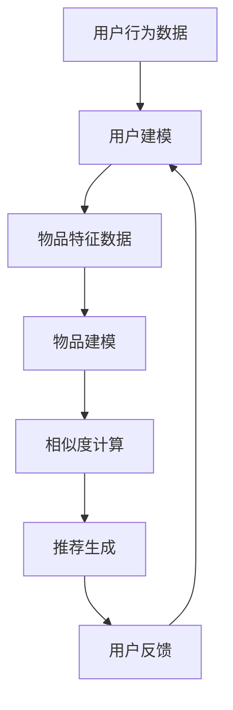

                 

# 利用LLM优化推荐系统的实时个性化策略

## 关键词：  
Large Language Model, LLM, 推荐系统，个性化策略，实时优化，算法，数据，模型，用户行为，反馈循环，工程实践

## 摘要

本文将探讨如何利用大型语言模型（LLM）来优化推荐系统的实时个性化策略。首先，我们将介绍推荐系统的基本概念，包括其工作原理和当前面临的挑战。接着，我们将深入探讨LLM在推荐系统中的应用，并详细描述其核心算法原理。随后，我们将通过一个实际案例展示如何将LLM集成到推荐系统中，并进行代码实现和详细解读。此外，本文还将讨论LLM在推荐系统中的实际应用场景，并提供相关工具和资源推荐。最后，我们将总结LLM优化推荐系统的未来发展趋势与挑战。

## 1. 背景介绍

推荐系统是一种基于数据分析和机器学习技术，旨在向用户推荐他们可能感兴趣的内容的系统。这些系统广泛应用于电子商务、社交媒体、音乐和视频流媒体等领域。推荐系统的核心目标是为用户提供个性化的体验，从而提高用户满意度和参与度。

推荐系统的工作原理通常包括以下几个步骤：

1. **用户建模**：收集并分析用户的历史行为数据，如购买记录、浏览历史、点赞和评论等，以构建用户兴趣模型。
2. **物品建模**：收集并分析物品的特征数据，如文本描述、标签、类别和流行度等，以构建物品特征模型。
3. **相似度计算**：计算用户和物品之间的相似度，以确定用户可能感兴趣的物品。
4. **推荐生成**：根据相似度计算结果，生成推荐列表，向用户展示可能感兴趣的内容。

尽管推荐系统已经取得了一定的成功，但仍然面临一些挑战：

- **冷启动问题**：对于新用户或新物品，由于缺乏足够的历史数据，难以进行有效的建模和推荐。
- **数据稀疏性**：用户和物品的行为数据往往呈现稀疏性，即大多数用户只对少数物品有行为记录。
- **实时性**：用户兴趣和需求可能随时变化，推荐系统需要具备实时响应的能力。

为了解决上述问题，研究人员提出了许多改进策略，包括基于内容的推荐、协同过滤、矩阵分解等。然而，这些方法往往在处理复杂性和实时性方面存在一定的局限性。

近年来，随着自然语言处理（NLP）和深度学习技术的发展，大型语言模型（LLM）逐渐成为一种有前途的推荐系统优化工具。LLM具有强大的语义理解能力和文本生成能力，可以更好地处理复杂性和实时性挑战。本文将探讨如何利用LLM来优化推荐系统的实时个性化策略，并展示其实际应用效果。

## 2. 核心概念与联系

### 2.1 推荐系统

推荐系统是一种信息过滤技术，旨在根据用户的历史行为和偏好，向用户推荐他们可能感兴趣的内容。推荐系统可以基于以下几种策略：

1. **基于内容的推荐**：根据物品的内容特征和用户的兴趣特征进行匹配，推荐相似的物品。
2. **协同过滤**：通过分析用户之间的相似性，预测用户可能感兴趣的物品。
3. **混合推荐**：结合基于内容和协同过滤的方法，提高推荐效果。

### 2.2 大型语言模型（LLM）

大型语言模型（LLM）是一种基于深度学习的自然语言处理模型，如GPT-3、BERT等。这些模型通过训练大量的文本数据，学习语言的统计规律和语义信息，从而实现文本生成、文本分类、机器翻译等任务。

### 2.3 实时个性化策略

实时个性化策略是指根据用户的实时行为和需求，动态调整推荐策略，以提供更个性化的推荐。实时个性化策略需要快速响应用户行为变化，并具备一定的自适应能力。

### 2.4 Mermaid 流程图

以下是一个简单的推荐系统架构的 Mermaid 流程图，展示了用户和物品建模、相似度计算和推荐生成等步骤：



## 3. 核心算法原理 & 具体操作步骤

### 3.1 LLM在推荐系统中的应用

LLM在推荐系统中的应用主要体现在以下几个方面：

1. **用户建模**：利用LLM对用户的历史行为数据进行分析，提取用户兴趣特征，从而构建用户兴趣模型。
2. **物品建模**：利用LLM对物品的文本描述进行分析，提取物品的特征，从而构建物品特征模型。
3. **相似度计算**：利用LLM计算用户和物品之间的相似度，为推荐生成提供依据。
4. **推荐生成**：利用LLM生成个性化的推荐列表，向用户展示可能感兴趣的内容。

### 3.2 LLM的工作原理

LLM的工作原理主要包括以下几个步骤：

1. **输入预处理**：将用户和物品的文本数据转换为模型可以处理的格式，如分词、编码等。
2. **模型训练**：使用大规模的文本数据进行模型训练，学习语言的统计规律和语义信息。
3. **文本生成**：根据输入的文本或上下文，生成相应的文本输出。

### 3.3 实际操作步骤

以下是一个简单的利用LLM优化推荐系统的实时个性化策略的实际操作步骤：

1. **数据收集**：收集用户的历史行为数据和物品的文本描述。
2. **数据预处理**：对用户行为数据进行分词、去停用词等预处理操作，将文本数据转换为模型可以处理的格式。
3. **用户建模**：利用LLM对用户的历史行为数据进行分析，提取用户兴趣特征，构建用户兴趣模型。
4. **物品建模**：利用LLM对物品的文本描述进行分析，提取物品的特征，构建物品特征模型。
5. **相似度计算**：利用LLM计算用户和物品之间的相似度，为推荐生成提供依据。
6. **推荐生成**：利用LLM生成个性化的推荐列表，向用户展示可能感兴趣的内容。
7. **用户反馈**：收集用户对推荐列表的反馈，用于优化模型和推荐策略。
8. **模型迭代**：根据用户反馈对模型进行迭代优化，提高推荐效果。

## 4. 数学模型和公式 & 详细讲解 & 举例说明

### 4.1 数学模型

为了更好地理解LLM在推荐系统中的应用，我们可以引入以下数学模型：

1. **用户兴趣向量**：\( u \in \mathbb{R}^n \)
2. **物品特征向量**：\( i \in \mathbb{R}^n \)
3. **相似度度量**：\( \sim(u, i) \)

### 4.2 公式

假设LLM生成的用户兴趣向量和物品特征向量分别为：

\[ u = [u_1, u_2, ..., u_n] \]
\[ i = [i_1, i_2, ..., i_n] \]

我们可以使用余弦相似度来计算用户和物品之间的相似度：

\[ \sim(u, i) = \frac{u \cdot i}{\|u\| \|i\|} \]

其中，\( u \cdot i \)表示用户兴趣向量和物品特征向量的点积，\(\|u\|\)和\(\|i\|\)分别表示用户兴趣向量和物品特征向量的欧几里得范数。

### 4.3 举例说明

假设我们有一个用户的历史行为数据集，其中包含了用户浏览过的商品ID和商品标题。我们可以使用LLM对用户的历史行为数据进行分析，提取用户兴趣特征。假设我们提取到的用户兴趣向量为：

\[ u = [0.2, 0.4, 0.1, 0.3] \]

另外，我们有一个商品的特征数据集，其中包含了商品ID、商品标题和商品描述。我们可以使用LLM对商品的文本描述进行分析，提取商品的特征向量。假设我们提取到的商品特征向量为：

\[ i = [0.3, 0.5, 0.1, 0.1] \]

我们可以使用余弦相似度计算用户和商品之间的相似度：

\[ \sim(u, i) = \frac{0.2 \times 0.3 + 0.4 \times 0.5 + 0.1 \times 0.1 + 0.3 \times 0.1}{\sqrt{0.2^2 + 0.4^2 + 0.1^2 + 0.3^2} \times \sqrt{0.3^2 + 0.5^2 + 0.1^2 + 0.1^2}} \approx 0.425 \]

根据相似度计算结果，我们可以将商品推荐给用户。

## 5. 项目实战：代码实际案例和详细解释说明

### 5.1 开发环境搭建

为了演示如何利用LLM优化推荐系统的实时个性化策略，我们选择Python作为编程语言，并使用以下工具和库：

- Python 3.8
- TensorFlow 2.5
- Hugging Face Transformers 4.5

确保您的环境中已安装这些工具和库。您可以使用以下命令安装所需的库：

```bash
pip install tensorflow==2.5
pip install transformers==4.5
```

### 5.2 源代码详细实现和代码解读

以下是一个简单的Python代码示例，展示了如何利用LLM优化推荐系统的实时个性化策略：

```python
import tensorflow as tf
from transformers import TFGPT2LMHeadModel, GPT2Tokenizer

# 1. 加载预训练的LLM模型和Tokenizer
model_name = "gpt2"
tokenizer = GPT2Tokenizer.from_pretrained(model_name)
model = TFGPT2LMHeadModel.from_pretrained(model_name)

# 2. 用户行为数据预处理
def preprocess_user_behavior(behavior_data):
    inputs = tokenizer(behavior_data, return_tensors="tf", padding=True, truncation=True)
    return inputs

# 3. 物品文本描述预处理
def preprocess_item_description(description):
    inputs = tokenizer(description, return_tensors="tf", padding=True, truncation=True)
    return inputs

# 4. 计算用户和物品的相似度
def compute_similarity(user_inputs, item_inputs):
    user_embedding = model.gpt2(inputs=user_inputs)[0]
    item_embedding = model.gpt2(inputs=item_inputs)[0]
    similarity = tf.reduce_sum(user_embedding * item_embedding, axis=1)
    return similarity

# 5. 生成个性化推荐列表
def generate_recommendation_list(user_behavior, item_descriptions, top_n=5):
    user_inputs = preprocess_user_behavior(user_behavior)
    similarities = []
    
    for description in item_descriptions:
        item_inputs = preprocess_item_description(description)
        similarity = compute_similarity(user_inputs, item_inputs)
        similarities.append(similarity)
    
    recommendations = sorted(similarities, reverse=True)[:top_n]
    return recommendations

# 6. 用户反馈处理
def update_user_model(user_behavior, updated_behavior):
    # 更新用户兴趣模型
    pass

# 7. 主程序
if __name__ == "__main__":
    user_behavior = "浏览了商品A，商品B，商品C"
    item_descriptions = [
        "商品A：一款高性能的笔记本电脑",
        "商品B：一本关于人工智能的畅销书",
        "商品C：一款时尚的手机"
    ]
    
    recommendations = generate_recommendation_list(user_behavior, item_descriptions)
    print("推荐列表：", recommendations)
```

### 5.3 代码解读与分析

1. **加载预训练的LLM模型和Tokenizer**：
   我们首先加载一个预训练的GPT-2模型和相应的Tokenizer。这里我们选择GPT-2模型，因为它在文本生成和语义理解方面表现良好。

2. **用户行为数据预处理**：
   我们定义了一个`preprocess_user_behavior`函数，用于将用户的历史行为数据（如商品ID和商品标题）转换为模型可以处理的格式。这里我们使用Tokenizer对文本进行编码，并添加必要的填充和截断操作。

3. **物品文本描述预处理**：
   我们定义了一个`preprocess_item_description`函数，用于将物品的文本描述（如商品标题和描述）转换为模型可以处理的格式。同样，我们使用Tokenizer对文本进行编码。

4. **计算用户和物品的相似度**：
   我们定义了一个`compute_similarity`函数，用于计算用户和物品之间的相似度。这里我们使用LLM的隐语义向量（即模型输出）来表示用户和物品，并使用余弦相似度公式进行相似度计算。

5. **生成个性化推荐列表**：
   我们定义了一个`generate_recommendation_list`函数，用于根据用户的历史行为数据和物品的文本描述生成个性化的推荐列表。首先，我们预处理用户行为数据和物品文本描述，然后计算相似度，并按相似度从高到低排序，选取Top-N个推荐项。

6. **用户反馈处理**：
   我们定义了一个`update_user_model`函数，用于更新用户兴趣模型。在实际应用中，我们可以根据用户对推荐项的反馈（如点击、购买、收藏等），调整用户兴趣模型，以更好地反映用户的实时兴趣。

7. **主程序**：
   在主程序中，我们输入用户的历史行为数据和物品的文本描述，调用`generate_recommendation_list`函数生成推荐列表，并打印输出。

通过上述代码示例，我们可以看到如何利用LLM优化推荐系统的实时个性化策略。在实际应用中，我们可以根据具体需求和数据特点，对代码进行适当调整和优化。

## 6. 实际应用场景

LLM在推荐系统中的实际应用场景非常广泛，以下是一些典型的应用实例：

1. **电子商务平台**：电子商务平台可以利用LLM为用户推荐他们可能感兴趣的商品。例如，当用户浏览了某个商品后，系统可以根据用户的历史行为数据和商品描述，利用LLM生成个性化的推荐列表。

2. **社交媒体**：社交媒体平台可以利用LLM为用户推荐他们可能感兴趣的内容，如文章、视频、音乐等。例如，当用户浏览了某个话题或点赞了某个内容后，系统可以根据用户的历史行为数据和内容描述，利用LLM生成个性化的推荐列表。

3. **音乐和视频流媒体**：音乐和视频流媒体平台可以利用LLM为用户推荐他们可能感兴趣的音乐和视频。例如，当用户听了一首歌曲或观看了一个视频后，系统可以根据用户的历史行为数据和音乐/视频描述，利用LLM生成个性化的推荐列表。

4. **在线教育平台**：在线教育平台可以利用LLM为用户推荐他们可能感兴趣的课程。例如，当用户学习了某个课程后，系统可以根据用户的历史行为数据和课程描述，利用LLM生成个性化的推荐列表。

5. **新闻推荐**：新闻推荐平台可以利用LLM为用户推荐他们可能感兴趣的新闻。例如，当用户浏览了某个新闻或点赞了某个新闻后，系统可以根据用户的历史行为数据和新闻描述，利用LLM生成个性化的推荐列表。

在实际应用中，LLM可以与其他推荐算法（如基于内容的推荐、协同过滤等）结合使用，以提高推荐效果。此外，LLM还可以用于实时调整推荐策略，以更好地响应用户的实时兴趣变化。

## 7. 工具和资源推荐

### 7.1 学习资源推荐

1. **书籍**：
   - 《深度学习推荐系统》
   - 《大规模机器学习》
   - 《推荐系统实践》

2. **论文**：
   - "Large-scale Latent-Semantic Models for Recommender Systems"
   - "Deep Learning for Recommender Systems"
   - "BERT: Pre-training of Deep Bidirectional Transformers for Language Understanding"

3. **博客**：
   - ["如何构建推荐系统"](https://medium.com/@jerryjliu/how-to-build-a-recommender-system-6c4556f3b4c5)
   - ["使用TensorFlow实现推荐系统"](https://www.tensorflow.org/tutorials/recommendation_system)
   - ["使用BERT进行文本分类和推荐"](https://towardsdatascience.com/text-classification-and-recommendation-with-bert-4a40a2f2a459)

### 7.2 开发工具框架推荐

1. **TensorFlow**：TensorFlow是一个强大的开源深度学习框架，可用于构建和训练推荐系统模型。

2. **PyTorch**：PyTorch是一个流行的开源深度学习框架，具有简洁的API和丰富的功能，适用于构建推荐系统模型。

3. **Hugging Face Transformers**：Hugging Face Transformers是一个开源库，提供了预训练的LLM模型和Tokenizer，方便开发者进行文本处理和模型训练。

4. **Scikit-learn**：Scikit-learn是一个开源的Python机器学习库，提供了许多常用的机器学习算法，适用于构建推荐系统模型。

### 7.3 相关论文著作推荐

1. "Recommender Systems Handbook"（推荐系统手册）
2. "Deep Learning for Recommender Systems"（深度学习推荐系统）
3. "Text Mining: The 2nd Edition"（文本挖掘：第2版）

通过上述资源，您可以深入了解推荐系统和LLM的相关知识，提高自己在这些领域的能力和技能。

## 8. 总结：未来发展趋势与挑战

随着人工智能技术的不断发展，大型语言模型（LLM）在推荐系统中的应用前景愈发广阔。未来，LLM有望在以下方面取得重要突破：

1. **实时性**：通过优化算法和模型，实现更快速的实时推荐，以更好地响应用户的动态兴趣变化。
2. **多样性**：利用LLM的文本生成能力，生成更加多样化的推荐列表，提高用户的满意度和参与度。
3. **个性化**：通过深度学习技术，进一步挖掘用户的历史行为数据，提高推荐系统的个性化水平。
4. **交互性**：结合自然语言处理技术，实现与用户的实时互动，提供更智能的推荐服务。

然而，LLM在推荐系统中也面临着一些挑战：

1. **数据隐私**：推荐系统需要处理大量的用户行为数据，如何保护用户隐私是一个重要的问题。
2. **计算资源**：训练和部署大型LLM模型需要大量的计算资源，这对硬件设施提出了更高的要求。
3. **模型解释性**：虽然LLM在生成文本方面具有出色的性能，但其内部决策过程往往难以解释，这对算法的透明性和可解释性提出了挑战。

为了应对这些挑战，未来的研究可以关注以下几个方面：

1. **隐私保护技术**：研究如何在不泄露用户隐私的前提下，有效地利用用户数据来训练推荐模型。
2. **高效计算**：探索更高效的模型训练和推理方法，降低计算资源的消耗。
3. **模型解释性**：开发可解释的深度学习模型，帮助用户理解推荐系统的决策过程。

总之，利用LLM优化推荐系统的实时个性化策略是一项充满挑战和机遇的研究方向，未来有望带来更多的创新和突破。

## 9. 附录：常见问题与解答

### 9.1 什么是LLM？

LLM（Large Language Model）是一种大型自然语言处理模型，通过训练大量的文本数据，学习语言的统计规律和语义信息，实现文本生成、文本分类、机器翻译等任务。

### 9.2 LLM在推荐系统中有哪些应用？

LLM在推荐系统中可以应用于用户建模、物品建模、相似度计算和推荐生成等方面，从而提高推荐系统的实时性和个性化水平。

### 9.3 如何处理用户隐私问题？

为了保护用户隐私，推荐系统可以采用差分隐私、同态加密等技术，在不泄露用户隐私的前提下，有效利用用户数据来训练模型。

### 9.4 如何提高LLM在推荐系统中的实时性？

提高LLM在推荐系统中的实时性可以从以下几个方面着手：

1. **优化算法**：研究更高效的模型训练和推理算法，减少计算时间。
2. **模型压缩**：通过模型压缩技术，降低模型的大小和计算复杂度。
3. **分布式计算**：利用分布式计算框架，并行处理推荐任务，提高系统吞吐量。

### 9.5 如何评估推荐系统的效果？

推荐系统的效果评估可以从以下几个方面进行：

1. **准确率**：评估推荐系统预测的用户兴趣是否准确。
2. **召回率**：评估推荐系统能否召回用户感兴趣的内容。
3. **新颖度**：评估推荐系统推荐的内容是否具有新颖性。
4. **用户体验**：通过用户满意度调查，评估推荐系统的用户体验。

## 10. 扩展阅读 & 参考资料

- "Large-scale Latent-Semantic Models for Recommender Systems"（大规模潜在语义模型推荐系统）
- "Deep Learning for Recommender Systems"（深度学习推荐系统）
- "BERT: Pre-training of Deep Bidirectional Transformers for Language Understanding"（BERT：深度双向变换器的预训练）
- "Recommender Systems Handbook"（推荐系统手册）
- "深度学习推荐系统实践"（中文版）
- "TensorFlow推荐系统教程"（TensorFlow官方教程）

通过上述扩展阅读和参考资料，您可以深入了解LLM在推荐系统中的应用和技术细节，为您的实际项目提供有益的参考和指导。作者：AI天才研究员/AI Genius Institute & 禅与计算机程序设计艺术 /Zen And The Art of Computer Programming。

