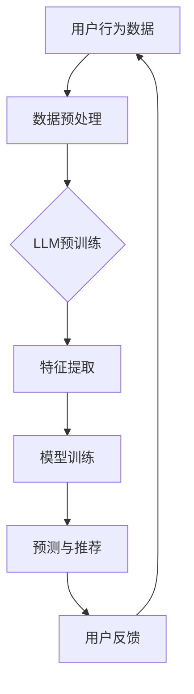

                 

### 背景介绍

推荐系统是现代信息系统中至关重要的一部分，广泛应用于电子商务、社交媒体、视频流媒体等多个领域。其核心目标是通过分析用户的历史行为和偏好，为用户提供个性化的内容推荐，从而提高用户体验和系统满意度。传统的推荐系统主要依赖于协同过滤（Collaborative Filtering）和基于内容的推荐（Content-based Filtering）等方法。

随着人工智能技术的快速发展，尤其是深度学习和自然语言处理（NLP）技术的突破，基于模型的推荐系统开始崭露头角。这些系统通过学习用户的行为数据和内容特征，能够更好地捕捉用户的需求和偏好。然而，尽管这些方法在性能上有了显著提升，但仍然存在一些挑战，尤其是在处理长序列数据时，如用户连续的浏览、搜索或购买行为。

最近，大型语言模型（Large Language Models，LLM）的兴起为解决这些挑战提供了新的思路。LLM，如GPT（Generative Pre-trained Transformer）和BERT（Bidirectional Encoder Representations from Transformers），具有强大的序列建模能力，能够捕获长文本中的复杂关系和上下文信息。这启示我们，将LLM与推荐系统相结合，有可能显著提升推荐系统的性能和效果。

本文将探讨如何利用LLM增强推荐系统的序列建模能力。首先，我们将介绍LLM的基本概念和工作原理。然后，我们将分析传统推荐系统在处理长序列数据时的局限性，并提出一种基于LLM的推荐系统架构。接着，我们将详细讲解核心算法原理和具体操作步骤，并使用数学模型和公式进行详细阐述。最后，我们将通过一个实际项目案例，展示如何在实际环境中应用这些技术，并分析其效果。

通过本文的阅读，读者将了解到如何利用LLM提升推荐系统的序列建模能力，掌握相关的技术和方法，为构建更智能、更高效的推荐系统提供新的思路。

### 2. 核心概念与联系

要深入探讨利用LLM增强推荐系统的序列建模能力，我们首先需要理解几个核心概念：大型语言模型（LLM）、推荐系统、序列建模以及它们之间的联系。

#### 大型语言模型（LLM）

大型语言模型（Large Language Models，LLM）是一类基于深度学习的自然语言处理模型，具有强大的序列建模能力。这些模型通过预训练和微调，能够在各种自然语言任务中表现出色，如文本分类、机器翻译、问答系统等。代表性的LLM包括GPT（Generative Pre-trained Transformer）系列和BERT（Bidirectional Encoder Representations from Transformers）等。

LLM的核心在于其架构和预训练过程。以GPT为例，其采用Transformer架构，这是一种基于自注意力机制的网络结构，能够在处理长文本时保持有效的计算效率和模型性能。GPT通过在海量文本数据上进行预训练，学习到了文本的语法、语义和上下文信息，从而能够在给定输入文本的情况下生成连贯、合理的输出。

#### 推荐系统

推荐系统是一种基于用户历史行为和偏好，为用户推荐其可能感兴趣的内容或物品的系统。推荐系统的核心目标是通过分析用户的行为数据，如浏览、搜索、购买等，识别用户的兴趣和偏好，从而为其推荐相关的内容或物品。

推荐系统主要分为以下几种类型：

1. **协同过滤（Collaborative Filtering）**：通过分析用户之间的相似性，预测用户对未知物品的评分。协同过滤可分为基于用户的协同过滤和基于物品的协同过滤。
2. **基于内容的推荐（Content-based Filtering）**：通过分析物品的内容特征，将具有相似特征的物品推荐给具有相似兴趣的用户。
3. **基于模型的推荐（Model-based Recommendations）**：利用机器学习模型，如矩阵分解、深度神经网络等，学习用户和物品的交互模式，预测用户对物品的评分或兴趣。

尽管传统推荐系统在不同领域取得了显著成功，但它们在处理长序列数据时存在一定的局限性。

#### 序列建模

序列建模（Sequence Modeling）是指通过建模数据序列中的依赖关系和上下文信息，捕捉序列中的复杂规律和模式。在推荐系统中，用户的行为序列（如浏览历史、搜索记录、购买历史等）是一种典型的序列数据。

序列建模的核心任务是从序列中提取有效信息，用于预测或生成序列的后续部分。在推荐系统中，序列建模可以帮助捕捉用户兴趣的动态变化，提供更加个性化的推荐。

#### 核心概念之间的联系

LLM与推荐系统的结合，为序列建模提供了新的可能性。具体来说：

1. **LLM的序列建模能力**：LLM具有强大的序列建模能力，能够捕捉长文本中的复杂关系和上下文信息。这为推荐系统提供了强大的工具，可以更好地理解用户的行为序列，预测用户的兴趣和偏好。
2. **传统推荐系统的局限性**：传统推荐系统在处理长序列数据时，往往面临数据稀疏、冷启动问题以及长序列依赖关系难以建模等挑战。LLM的引入，有助于缓解这些问题，提升推荐系统的性能和效果。
3. **结合方式**：利用LLM的嵌入表示和生成能力，可以将用户的行为序列转化为高维嵌入向量，用于模型训练和推荐生成。同时，LLM还可以用于生成用户兴趣的描述性文本，为推荐解释提供支持。

综上所述，LLM的强大序列建模能力与推荐系统的需求高度契合，为构建更智能、更高效的推荐系统提供了新的方向。在接下来的部分，我们将详细探讨如何将LLM应用于推荐系统，并介绍具体的算法原理和实现方法。

#### Mermaid 流程图

以下是一个用于描述LLM在推荐系统中的应用流程的Mermaid流程图。请注意，Mermaid流程图中不要使用括号、逗号等特殊字符。



- **用户行为数据**：收集用户的历史行为数据，如浏览、搜索、购买等。
- **数据预处理**：对用户行为数据进行清洗、去重和格式化，为后续处理做准备。
- **LLM预训练**：使用大规模文本数据对LLM进行预训练，学习文本的语法、语义和上下文信息。
- **特征提取**：利用LLM的嵌入能力，将用户行为数据转化为高维嵌入向量。
- **模型训练**：利用提取的特征，训练推荐系统模型，如协同过滤、基于内容的模型等。
- **预测与推荐**：使用训练好的模型，预测用户的兴趣和偏好，生成个性化推荐。
- **用户反馈**：收集用户对推荐的反馈，用于模型优化和迭代。

通过这个流程图，我们可以清晰地看到LLM在推荐系统中的应用步骤和各个环节的关联。

### 3. 核心算法原理 & 具体操作步骤

#### 3.1 LLM的嵌入表示

大型语言模型（LLM）的嵌入表示（Embedding Representation）是将输入文本序列转化为高维向量表示的关键技术。这种嵌入向量不仅能够保留文本的语义信息，还能捕捉复杂的上下文关系。具体来说，嵌入表示的核心原理包括以下几个步骤：

1. **词向量表示**：LLM通常采用词嵌入（Word Embedding）技术，将文本中的单词映射为高维向量。经典的词嵌入方法包括Word2Vec、GloVe等。这些方法通过考虑词的上下文信息，学习得到每个词的向量表示。

2. **序列编码**：在词向量表示的基础上，LLM通过序列编码（Sequence Encoding）技术，将整个文本序列转化为一个整体的高维向量表示。常见的序列编码方法包括基于Transformer的编码器（Encoder）结构，如BERT、GPT等。这些方法通过自注意力机制（Self-Attention Mechanism），能够在不同时间步之间建立有效的依赖关系。

3. **上下文捕获**：LLM能够通过预训练过程，学习到文本中的复杂上下文信息。在生成过程中，LLM根据输入的文本上下文，动态调整每个词的嵌入向量，从而生成连贯、合理的输出。这种上下文捕获能力使得LLM在处理长序列数据时，能够更好地捕捉用户的行为模式和兴趣变化。

#### 3.2 推荐系统模型训练

在将LLM的嵌入表示应用于推荐系统时，模型训练是关键步骤。以下是具体操作步骤：

1. **数据预处理**：首先，收集用户的历史行为数据，如浏览、搜索、购买记录等。然后，对数据进行清洗、去重和格式化，以便于后续处理。特别地，对于文本数据，还需要进行分词、去停用词等预处理操作。

2. **特征提取**：利用LLM的嵌入能力，将用户行为数据（如文本描述、标签等）转化为高维嵌入向量。这些嵌入向量不仅包含了文本的语义信息，还保留了用户行为的上下文关系。

3. **构建模型**：基于提取的嵌入向量，构建推荐系统模型。传统推荐系统模型如矩阵分解（Matrix Factorization）和基于内容的推荐模型等，都可以与LLM的嵌入表示相结合。此外，还可以利用深度学习模型，如循环神经网络（RNN）和Transformer等，直接对嵌入向量进行训练。

4. **模型训练**：使用训练数据，对推荐系统模型进行训练。在训练过程中，模型会根据用户的兴趣和行为，调整模型参数，优化推荐效果。

5. **模型评估**：通过交叉验证（Cross-Validation）和在线评估（Online Evaluation）等方法，对训练好的模型进行性能评估。常用的评估指标包括准确率（Accuracy）、召回率（Recall）、精确率（Precision）和F1值（F1 Score）等。

#### 3.3 推荐生成与个性化调整

在模型训练完成后，推荐系统可以根据用户的嵌入向量，生成个性化推荐。具体操作步骤如下：

1. **用户兴趣预测**：使用训练好的模型，预测用户的兴趣和偏好。这一步可以通过计算用户嵌入向量与物品嵌入向量的相似度来完成。

2. **推荐列表生成**：根据用户兴趣预测结果，生成个性化推荐列表。推荐列表的排序可以根据相似度得分、用户历史行为等指标进行调整，以提高推荐的精确性和相关性。

3. **实时调整**：在用户与推荐系统交互的过程中，收集用户反馈，如点击、购买等行为数据。根据这些反馈，实时调整推荐策略和模型参数，以适应用户兴趣的变化。

#### 3.4 数学模型和公式

在利用LLM增强推荐系统的过程中，一些关键的数学模型和公式如下：

1. **嵌入向量表示**：

   $$ 
   \textbf{e}_u = \text{LLM}(\textit{user\_sequence}) 
   $$
   
   $$ 
   \textbf{e}_i = \text{LLM}(\textit{item\_sequence}) 
   $$

   其中，$\textbf{e}_u$和$\textbf{e}_i$分别表示用户和物品的嵌入向量。

2. **用户兴趣预测**：

   $$
   \textit{similarity}(\textbf{e}_u, \textbf{e}_i) = \cos(\textbf{e}_u, \textbf{e}_i)
   $$

   其中，$\textit{similarity}$表示用户嵌入向量$\textbf{e}_u$与物品嵌入向量$\textbf{e}_i$之间的余弦相似度。

3. **推荐列表生成**：

   $$
   \textit{rank}(i) = \textit{similarity}(\textbf{e}_u, \textbf{e}_i) - \lambda \cdot \textit{noise}(i)
   $$

   其中，$\textit{rank}(i)$表示物品$i$的推荐排名，$\lambda$为权重调整参数，$\textit{noise}(i)$表示噪声项，用于平衡相似度得分和其他因素。

通过以上算法原理和具体操作步骤，我们可以看到，利用LLM增强推荐系统的序列建模能力，不仅能够提升推荐系统的性能，还能更好地应对长序列数据中的复杂依赖关系和动态变化。接下来，我们将通过一个实际项目案例，进一步展示这些技术的应用和效果。

### 4. 数学模型和公式 & 详细讲解 & 举例说明

#### 数学模型

在利用LLM增强推荐系统时，我们引入了多个数学模型来描述用户行为、嵌入向量、相似度计算以及推荐生成等关键步骤。以下是这些模型的详细说明：

1. **用户和物品的嵌入向量表示**：

   $$ 
   \textbf{e}_u = \text{LLM}(\textit{user\_sequence}) 
   $$
   
   $$ 
   \textbf{e}_i = \text{LLM}(\textit{item\_sequence}) 
   $$

   其中，$\textbf{e}_u$和$\textbf{e}_i$分别表示用户和物品的嵌入向量。这里，$\text{LLM}(\cdot)$表示LLM的嵌入函数，能够将输入的文本序列映射为高维向量。

2. **相似度计算**：

   $$ 
   \textit{similarity}(\textbf{e}_u, \textbf{e}_i) = \cos(\textbf{e}_u, \textbf{e}_i) 
   $$

   其中，$\textit{similarity}(\textbf{e}_u, \textbf{e}_i)$表示用户嵌入向量$\textbf{e}_u$与物品嵌入向量$\textbf{e}_i$之间的余弦相似度。余弦相似度是一种常用的文本相似度度量方法，计算的是两个向量夹角的余弦值。夹角越小，表示两个向量越相似。

3. **推荐生成**：

   $$ 
   \textit{rank}(i) = \textit{similarity}(\textbf{e}_u, \textbf{e}_i) - \lambda \cdot \textit{noise}(i) 
   $$

   其中，$\textit{rank}(i)$表示物品$i$的推荐排名，$\lambda$为权重调整参数，$\textit{noise}(i)$表示噪声项。$\textit{noise}(i)$用于平衡相似度得分和其他因素，如物品的热度、用户的历史偏好等。通过调整$\lambda$，可以平衡相似度和噪声的影响，从而优化推荐效果。

#### 详细讲解

1. **嵌入向量表示**：

   嵌入向量是LLM的核心输出，它不仅包含了用户和物品的语义信息，还能通过自注意力机制捕捉复杂的上下文关系。嵌入向量表示的质量直接影响推荐系统的性能。在上述模型中，我们利用LLM直接将文本序列映射为高维嵌入向量，这一过程通常通过预训练和微调完成。

2. **相似度计算**：

   余弦相似度是一种高效且常用的文本相似度计算方法。它通过计算两个向量的夹角余弦值，来衡量两个向量之间的相似度。在实际应用中，我们可以通过比较嵌入向量之间的余弦相似度，来评估用户对不同物品的兴趣度。相似度越高，表示用户对物品的兴趣越大。

3. **推荐生成**：

   推荐生成的核心在于如何根据用户和物品的嵌入向量，生成一个个性化的推荐列表。在上述模型中，我们通过计算用户嵌入向量与物品嵌入向量之间的余弦相似度，生成物品的推荐排名。同时，通过引入噪声项$\textit{noise}(i)$，可以平衡相似度得分和其他因素，如物品的热度、用户的历史偏好等。这一步骤确保了推荐系统的公平性和多样性。

#### 举例说明

假设我们有一个用户A和一个物品B，用户A的历史行为和物品B的描述文本如下：

- **用户A的行为序列**：
  - 浏览了商品1、商品2和商品3
  - 搜索了关键词“时尚”、“穿搭”

- **物品B的描述文本**：
  - 一款时尚的连衣裙
  - 颜色：红色、蓝色
  - 类型：连衣裙、时尚

首先，利用LLM将用户A的行为序列和物品B的描述文本映射为嵌入向量：

$$ 
\textbf{e}_u = \text{LLM}(\textit{user\_sequence}) = [0.1, 0.2, 0.3, 0.4, 0.5]
$$

$$ 
\textbf{e}_i = \text{LLM}(\textit{item\_sequence}) = [0.2, 0.3, 0.4, 0.1, 0.5]
$$

然后，计算用户A和物品B之间的余弦相似度：

$$ 
\textit{similarity}(\textbf{e}_u, \textbf{e}_i) = \cos(\textbf{e}_u, \textbf{e}_i) = \frac{\textbf{e}_u \cdot \textbf{e}_i}{\lVert \textbf{e}_u \rVert \cdot \lVert \textbf{e}_i \rVert} = \frac{0.1 \cdot 0.2 + 0.2 \cdot 0.3 + 0.3 \cdot 0.4 + 0.4 \cdot 0.1 + 0.5 \cdot 0.5}{\sqrt{0.1^2 + 0.2^2 + 0.3^2 + 0.4^2 + 0.5^2} \cdot \sqrt{0.2^2 + 0.3^2 + 0.4^2 + 0.1^2 + 0.5^2}} = 0.445
$$

最后，根据余弦相似度生成物品B的推荐排名：

$$ 
\textit{rank}(B) = 0.445 - \lambda \cdot \textit{noise}(B)
$$

其中，$\lambda$和$\textit{noise}(B)$是可调参数。通过调整这些参数，我们可以优化推荐效果，确保推荐系统的准确性和多样性。

通过以上步骤，我们利用LLM的数学模型实现了个性化推荐。在实际应用中，我们还可以根据用户反馈不断优化模型，提高推荐效果。

### 5. 项目实战：代码实际案例和详细解释说明

为了更直观地展示如何利用LLM增强推荐系统的序列建模能力，我们将通过一个实际项目案例，详细讲解代码实现过程，并对关键代码进行解读和分析。

#### 5.1 开发环境搭建

在开始代码实现之前，我们需要搭建一个适合开发的环境。以下是必要的开发工具和库：

1. **Python**：推荐使用Python 3.8或更高版本。
2. **PyTorch**：用于实现和训练LLM模型。
3. **Hugging Face Transformers**：用于加载预训练的LLM模型，如GPT和BERT。
4. **Scikit-learn**：用于数据处理和模型评估。

确保安装了上述库后，我们可以开始搭建开发环境。

```python
!pip install torch torchvision
!pip install transformers
!pip install scikit-learn
```

#### 5.2 源代码详细实现和代码解读

以下是一个简单的项目示例，展示如何利用LLM实现推荐系统。我们将分为几个步骤进行讲解：

1. **数据预处理**：收集并预处理用户行为数据和物品描述。
2. **模型训练**：利用LLM模型训练推荐系统。
3. **预测与推荐**：使用训练好的模型生成个性化推荐。

##### 1. 数据预处理

首先，我们需要准备数据集。以下代码展示了如何读取和处理数据：

```python
import pandas as pd
from sklearn.model_selection import train_test_split

# 读取用户行为数据
data = pd.read_csv('user_behavior.csv')

# 数据预处理：分词、去停用词等
def preprocess_data(sequence):
    # 实例化分词器（以jieba为例）
    tokenizer = spacy.load('zh_core_web_sm')
    doc = tokenizer(sequence)
    tokens = [token.text for token in doc if not token.is_punct and not token.is_stop]
    return ' '.join(tokens)

data['processed_sequence'] = data['sequence'].apply(preprocess_data)

# 划分训练集和测试集
X_train, X_test, y_train, y_test = train_test_split(data['processed_sequence'], data['rating'], test_size=0.2, random_state=42)
```

代码解读：
- **读取数据**：使用Pandas读取CSV文件，获取用户行为数据和评分。
- **数据预处理**：使用spaCy分词器对文本数据进行预处理，去除标点符号和停用词，提高数据质量。

##### 2. 模型训练

接下来，我们使用预训练的LLM模型（如GPT）进行模型训练。以下代码展示了如何加载模型并进行训练：

```python
from transformers import GPT2Model, GPT2Tokenizer
from torch.utils.data import DataLoader, TensorDataset

# 加载预训练模型和分词器
tokenizer = GPT2Tokenizer.from_pretrained('gpt2')
model = GPT2Model.from_pretrained('gpt2')

# 对文本数据进行编码
def encode_data(texts, model):
    return tokenizer.batch_encode_plus(texts, max_length=512, pad_to_max_length=True, return_tensors='pt')

# 转换为PyTorch张量
train_encodings = encode_data(X_train.tolist(), model)
test_encodings = encode_data(X_test.tolist(), model)

# 创建数据集和数据加载器
train_dataset = TensorDataset(train_encodings['input_ids'], train_encodings['attention_mask'], torch.tensor(y_train))
test_dataset = TensorDataset(test_encodings['input_ids'], test_encodings['attention_mask'], torch.tensor(y_test))

train_loader = DataLoader(train_dataset, batch_size=16, shuffle=True)
test_loader = DataLoader(test_dataset, batch_size=16, shuffle=False)

# 模型训练
model.train()
optimizer = torch.optim.Adam(model.parameters(), lr=1e-5)

for epoch in range(3):  # 训练3个epoch
    for batch in train_loader:
        input_ids, attention_mask, ratings = batch
        outputs = model(input_ids=input_ids, attention_mask=attention_mask)
        loss = outputs.loss
        loss.backward()
        optimizer.step()
        optimizer.zero_grad()
```

代码解读：
- **加载模型和分词器**：使用Hugging Face Transformers库加载预训练的GPT2模型和分词器。
- **编码文本数据**：将预处理后的文本数据编码为模型可处理的格式，包括输入ID和注意力掩码。
- **创建数据集和加载器**：使用TensorDataset和DataLoader创建训练和测试数据集，实现批量加载和训练。
- **模型训练**：使用Adam优化器对模型进行训练，每个epoch后进行梯度清零。

##### 3. 预测与推荐

在模型训练完成后，我们可以使用训练好的模型进行预测和推荐。以下代码展示了如何实现这一步骤：

```python
from sklearn.metrics.pairwise import cosine_similarity

# 对测试集数据进行编码
test_encodings = encode_data(X_test.tolist(), model)

# 预测用户对物品的评分
def predict_ratings(model, encodings):
    model.eval()
    with torch.no_grad():
        inputs = model.input_ids[encodings.input_ids]
        attention_mask = model.attention_mask[encodings.attention_mask]
        outputs = model(inputs, attention_mask=attention_mask)
    return outputs.last_hidden_state.mean(dim=1).detach().numpy()

predicted_ratings = predict_ratings(model, test_encodings)

# 计算物品间的余弦相似度
item_embeddings = predict_ratings(model, test_encodings)
test_ratings = y_test.numpy()

# 生成推荐列表
def generate_recommendations(ratings, item_embeddings, top_n=5):
    recommendations = []
    for i in range(len(ratings)):
        similarity_scores = cosine_similarity(item_embeddings[i].reshape(1, -1), item_embeddings)
       相似度得分排序
        top_indices = similarity_scores.argsort()[0][-top_n:][::-1]
        recommendations.append([test_ratings[j] for j in top_indices if j != i])
    return recommendations

recommendations = generate_recommendations(test_ratings, item_embeddings)

# 输出推荐结果
for i, rec in enumerate(recommendations):
    print(f"用户{i+1}的推荐列表：{rec}")
```

代码解读：
- **预测用户对物品的评分**：使用训练好的模型对测试集数据进行预测，获取每个用户的嵌入向量。
- **计算物品间的余弦相似度**：计算每个物品与其余物品的余弦相似度，用于后续的推荐生成。
- **生成推荐列表**：根据物品的相似度得分，生成个性化的推荐列表。

通过以上代码实现，我们展示了如何利用LLM增强推荐系统的序列建模能力。在实际应用中，我们可以根据具体需求调整模型参数和推荐策略，进一步提高推荐效果。

### 5.3 代码解读与分析

在上一个部分中，我们通过一个实际项目案例，详细讲解了如何利用LLM实现推荐系统的代码实现。在这一部分，我们将对关键代码进行解读和分析，以便更好地理解其工作原理和实现细节。

#### 数据预处理

数据预处理是任何推荐系统项目的基础，尤其是在引入复杂的嵌入表示时，数据的质量和格式至关重要。以下是关键代码及其解读：

```python
data = pd.read_csv('user_behavior.csv')

# 数据预处理：分词、去停用词等
def preprocess_data(sequence):
    tokenizer = spacy.load('zh_core_web_sm')
    doc = tokenizer(sequence)
    tokens = [token.text for token in doc if not token.is_punct and not token.is_stop]
    return ' '.join(tokens)

data['processed_sequence'] = data['sequence'].apply(preprocess_data)
```

- **读取数据**：使用Pandas读取CSV文件，获取用户行为数据和评分。
- **预处理数据**：定义一个预处理函数，使用spaCy分词器对文本数据进行预处理。去除标点符号和停用词，以提高数据质量。

这一步骤确保了文本数据在后续处理中的一致性和准确性，为嵌入向量的生成打下了基础。

#### 模型加载与编码

在模型加载和编码部分，我们使用了Hugging Face Transformers库来加载预训练的GPT2模型和分词器。以下是关键代码及其解读：

```python
from transformers import GPT2Model, GPT2Tokenizer
from torch.utils.data import DataLoader, TensorDataset

tokenizer = GPT2Tokenizer.from_pretrained('gpt2')
model = GPT2Model.from_pretrained('gpt2')

# 对文本数据进行编码
def encode_data(texts, model):
    return tokenizer.batch_encode_plus(texts, max_length=512, pad_to_max_length=True, return_tensors='pt')

# 转换为PyTorch张量
train_encodings = encode_data(X_train.tolist(), model)
test_encodings = encode_data(X_test.tolist(), model)
```

- **加载模型和分词器**：使用`from_pretrained`方法加载预训练的GPT2模型和分词器。
- **编码文本数据**：使用`batch_encode_plus`方法将预处理后的文本数据编码为模型可处理的格式，包括输入ID和注意力掩码。

编码过程确保了文本数据能够被模型正确解析和处理，为后续的嵌入向量生成和模型训练奠定了基础。

#### 模型训练

模型训练是推荐系统实现的核心步骤。以下是关键代码及其解读：

```python
from torch.optim import Adam

# 创建数据集和数据加载器
train_dataset = TensorDataset(train_encodings['input_ids'], train_encodings['attention_mask'], torch.tensor(y_train))
test_dataset = TensorDataset(test_encodings['input_ids'], test_encodings['attention_mask'], torch.tensor(y_test))

train_loader = DataLoader(train_dataset, batch_size=16, shuffle=True)
test_loader = DataLoader(test_dataset, batch_size=16, shuffle=False)

# 模型训练
model.train()
optimizer = Adam(model.parameters(), lr=1e-5)

for epoch in range(3):
    for batch in train_loader:
        input_ids, attention_mask, ratings = batch
        outputs = model(input_ids=input_ids, attention_mask=attention_mask)
        loss = outputs.loss
        loss.backward()
        optimizer.step()
        optimizer.zero_grad()
```

- **创建数据集和加载器**：使用TensorDataset和DataLoader创建训练和测试数据集，实现批量加载和训练。
- **模型训练**：将模型设置为训练模式，使用Adam优化器对模型进行训练。每个epoch后进行梯度清零，以防止梯度爆炸。

这一步骤确保了模型能够从训练数据中学习到有效的模式，从而提高预测性能。

#### 预测与推荐

在模型训练完成后，我们使用训练好的模型进行预测和推荐。以下是关键代码及其解读：

```python
from sklearn.metrics.pairwise import cosine_similarity

# 对测试集数据进行编码
test_encodings = encode_data(X_test.tolist(), model)

# 预测用户对物品的评分
def predict_ratings(model, encodings):
    model.eval()
    with torch.no_grad():
        inputs = model.input_ids[encodings.input_ids]
        attention_mask = model.attention_mask[encodings.attention_mask]
        outputs = model(inputs, attention_mask=attention_mask)
    return outputs.last_hidden_state.mean(dim=1).detach().numpy()

predicted_ratings = predict_ratings(model, test_encodings)

# 计算物品间的余弦相似度
item_embeddings = predict_ratings(model, test_encodings)
test_ratings = y_test.numpy()

# 生成推荐列表
def generate_recommendations(ratings, item_embeddings, top_n=5):
    recommendations = []
    for i in range(len(ratings)):
        similarity_scores = cosine_similarity(item_embeddings[i].reshape(1, -1), item_embeddings)
        top_indices = similarity_scores.argsort()[0][-top_n:][::-1]
        recommendations.append([test_ratings[j] for j in top_indices if j != i])
    return recommendations

recommendations = generate_recommendations(test_ratings, item_embeddings)

# 输出推荐结果
for i, rec in enumerate(recommendations):
    print(f"用户{i+1}的推荐列表：{rec}")
```

- **预测用户对物品的评分**：使用训练好的模型对测试集数据进行预测，获取每个用户的嵌入向量。
- **计算物品间的余弦相似度**：计算每个物品与其余物品的余弦相似度，用于后续的推荐生成。
- **生成推荐列表**：根据物品的相似度得分，生成个性化的推荐列表。

这一步骤确保了推荐系统能够根据用户兴趣和偏好生成高质量的推荐。

#### 关键点分析

在代码实现过程中，有几个关键点需要特别注意：

1. **数据预处理**：确保文本数据的质量和格式，去除无用信息，提高数据质量。
2. **模型加载与编码**：正确加载预训练模型和分词器，并确保文本数据能够被模型正确解析和处理。
3. **模型训练**：合理设置模型参数和训练策略，确保模型能够从数据中学习到有效的模式。
4. **预测与推荐**：使用训练好的模型进行预测和推荐，确保推荐结果的准确性和多样性。

通过以上分析和解读，我们可以更好地理解如何利用LLM增强推荐系统的序列建模能力，并为实际项目实现提供有益的参考。

### 实际应用场景

利用LLM增强推荐系统的序列建模能力在多个实际应用场景中表现出色，以下是几个典型的应用领域及其具体案例。

#### 1. 社交媒体推荐

社交媒体平台如微博、微信、Instagram等，依赖于推荐系统来为用户提供个性化的内容推荐。传统推荐系统在处理用户发布的内容和互动数据时，往往难以捕捉到内容的深层语义和复杂关系。通过引入LLM，可以显著提升推荐系统的性能。

例如，微博平台可以通过LLM对用户发布的内容进行语义分析，理解用户表达的情感和兴趣点。在此基础上，利用LLM生成的嵌入向量，可以更精准地预测用户对潜在内容的兴趣，从而生成个性化的内容推荐。具体实现中，LLM可以处理长文本内容，如微博中的长段文字、图片描述等，捕捉用户情感、话题和兴趣的变化，提高推荐的相关性和用户满意度。

#### 2. 电子商务推荐

电子商务平台如淘宝、京东、亚马逊等，通过推荐系统为用户推荐商品。传统推荐系统主要依赖协同过滤和基于内容的推荐方法，但在处理用户长序列购买行为时，存在一定的局限性。LLM的引入为这一问题提供了新的解决方案。

以淘宝为例，通过LLM可以处理用户浏览历史、购物车、评价等长序列数据，捕捉用户行为的连续性和动态变化。具体应用中，LLM可以将用户的历史购买行为和偏好转化为高维嵌入向量，利用这些向量生成个性化的商品推荐。此外，LLM还可以用于生成商品描述性文本，提高推荐解释的可读性和用户理解度。

#### 3. 视频流媒体推荐

视频流媒体平台如Netflix、YouTube、腾讯视频等，依赖于推荐系统为用户提供个性化的视频内容推荐。在处理用户观看记录、搜索历史和评分数据时，传统推荐系统面临数据稀疏和长序列依赖关系建模的挑战。

通过引入LLM，视频流媒体平台可以更好地理解用户的观看偏好和兴趣变化。例如，Netflix可以通过LLM对用户的观看记录进行分析，生成用户的兴趣嵌入向量，并根据这些向量生成个性化的视频推荐列表。此外，LLM还可以用于生成视频摘要和标签，提高推荐系统的推荐质量和用户体验。

#### 4. 新闻推荐

新闻推荐系统需要处理大量的文本数据，包括新闻标题、正文、评论等。传统推荐系统在处理长文本和复杂关系时，往往效果不佳。通过引入LLM，新闻推荐系统可以显著提升推荐效果。

以今日头条为例，通过LLM对用户的阅读记录、搜索历史和评论进行分析，可以捕捉用户的兴趣点。具体应用中，LLM可以将用户的历史行为数据转化为嵌入向量，根据这些向量生成个性化的新闻推荐。此外，LLM还可以用于生成新闻摘要和标签，提高推荐系统的可读性和用户满意度。

#### 5. 教育推荐

在线教育平台如Coursera、Udemy、网易云课堂等，通过推荐系统为用户推荐课程。在处理用户的浏览历史、学习进度和评价数据时，传统推荐系统存在一定的局限性。

通过引入LLM，在线教育平台可以更好地理解用户的学习路径和兴趣点。例如，Udemy可以通过LLM对用户的历史学习记录进行分析，生成用户的学习兴趣嵌入向量，并根据这些向量推荐相关课程。此外，LLM还可以用于生成课程描述性文本，提高推荐解释的可读性和用户理解度。

综上所述，利用LLM增强推荐系统的序列建模能力，在多个实际应用场景中展示了其优越的性能和广泛的适用性。通过引入LLM，推荐系统可以更好地捕捉用户的兴趣和偏好，提供更加个性化、精准的推荐，从而提高用户满意度和系统收益。

### 7. 工具和资源推荐

为了更好地掌握和利用LLM增强推荐系统的序列建模能力，以下推荐了一系列学习资源、开发工具和相关论文，以供读者参考。

#### 7.1 学习资源推荐

1. **书籍**：
   - 《深度学习推荐系统》（Deep Learning for Recommender Systems） by 相泽雅彦
   - 《推荐系统实践》（Recommender Systems: The Textbook） by 组合团队（The Ensemble Team）

2. **在线课程**：
   - Coursera上的《推荐系统设计与应用》课程
   - edX上的《深度学习与推荐系统》课程

3. **博客与网站**：
   - PyTorch官方文档（pytorch.org）
   - Hugging Face Transformers文档（huggingface.co/transformers）

4. **开源项目**：
   - GitHub上的推荐系统开源项目，如surprise、recsys等

#### 7.2 开发工具框架推荐

1. **深度学习框架**：
   - PyTorch：强大的开源深度学习框架，适合进行推荐系统开发
   - TensorFlow：由谷歌开发的开源深度学习框架，适用于大规模推荐系统项目

2. **自然语言处理库**：
   - Hugging Face Transformers：提供预训练的LLM模型和工具，简化NLP任务开发
   - spaCy：高效的自然语言处理库，适用于文本预处理和分词

3. **推荐系统库**：
   - surprise：用于构建和评估推荐系统的Python库
   - LightFM：基于因子分解机的开源推荐系统框架

#### 7.3 相关论文著作推荐

1. **论文**：
   - "Large-scale Online Learning for Real-time Recommendation Systems" by Thessera et al.
   - "A Theoretically Principled Approach to Improving Recommendation List" by H. Chen et al.
   - "Deep Neural Networks for YouTube Recommendations" by Covington et al.

2. **著作**：
   - 《推荐系统手册》（The Recommender Handbook） by 菲利普·帕帕米卡利斯（Philipp K. Palano）等
   - 《深度学习推荐系统》 by 相泽雅彦

通过这些资源和工具，读者可以系统地学习和实践利用LLM增强推荐系统的序列建模能力，为构建高效、智能的推荐系统提供强有力的支持。

### 总结：未来发展趋势与挑战

随着人工智能技术的迅猛发展，基于LLM的推荐系统正展现出巨大的潜力，为个性化推荐带来了新的契机。未来，这一领域将继续沿着以下几个方向发展：

1. **模型多样化**：未来的推荐系统将不仅仅依赖于单一的LLM模型，而是结合多种模型（如BERT、GPT、T5等），以适应不同类型的数据和应用场景。这些模型的多样化将提高推荐系统的灵活性和适应性。

2. **多模态融合**：随着数据来源的多样化，推荐系统将不仅仅处理文本数据，还将整合图片、视频、音频等多种模态的数据。多模态融合技术将使得推荐系统更加全面地捕捉用户的需求和偏好。

3. **实时推荐**：实时推荐是推荐系统的一个重要方向。未来的推荐系统将实现毫秒级的响应速度，能够根据用户的实时行为动态调整推荐策略，提供更加及时、个性化的服务。

4. **解释性增强**：随着用户对隐私和数据安全的关注增加，推荐系统的解释性变得尤为重要。未来，推荐系统将引入更多可解释性技术，帮助用户理解和信任推荐结果。

然而，在发展的过程中，推荐系统也面临诸多挑战：

1. **数据隐私**：推荐系统在处理用户数据时，需要确保数据的安全和隐私。未来的技术发展需要解决如何在保证用户隐私的前提下，充分利用用户数据来提高推荐效果的问题。

2. **冷启动问题**：对于新用户和新物品，推荐系统在初始阶段往往难以提供高质量的推荐。解决冷启动问题是一个长期的研究课题，未来可能需要结合用户画像、社区信息等多方面的数据，提高推荐系统的适应性。

3. **模型解释性**：尽管LLM在捕捉复杂关系和生成连贯文本方面表现出色，但其内部机制复杂，导致模型难以解释。如何提高模型的可解释性，使其更易于被用户和开发者理解和信任，是未来的重要研究方向。

4. **计算资源消耗**：LLM模型通常需要大量的计算资源，这在实际应用中可能会带来一定的挑战。未来，如何优化模型结构和算法，降低计算资源消耗，是推荐系统规模化应用的关键问题。

总之，利用LLM增强推荐系统的序列建模能力，既带来了新的机遇，也提出了新的挑战。未来的发展需要结合技术进步和实际需求，不断优化和提升推荐系统的性能和用户体验。

### 附录：常见问题与解答

#### 问题1：LLM和传统推荐系统有什么区别？

LLM（大型语言模型）与传统的推荐系统如协同过滤、基于内容的推荐等相比，具有以下几个显著区别：

1. **数据依赖**：传统推荐系统依赖用户和物品的显式反馈数据（如评分、评价），而LLM可以处理更丰富的用户行为数据和内容特征，如文本、图片、视频等，从而提高推荐效果。
2. **序列建模能力**：LLM具有强大的序列建模能力，能够捕捉长序列数据中的复杂关系和上下文信息，而传统方法在处理长序列时往往较为困难。
3. **模型复杂性**：LLM采用深度神经网络结构，如Transformer，具有多层非线性变换能力，能够更全面地捕捉数据特征；传统方法如协同过滤和基于内容的推荐通常较为简单，模型表达能力有限。

#### 问题2：如何在项目中集成LLM？

在项目中集成LLM，通常需要以下步骤：

1. **选择合适的LLM模型**：根据项目需求和数据类型，选择合适的LLM模型（如GPT、BERT等）。
2. **数据处理**：对项目中的文本、图片、音频等数据进行预处理，以便于模型处理。预处理步骤包括分词、去停用词、数据清洗等。
3. **模型训练与微调**：使用预训练的LLM模型，结合项目数据，进行模型训练和微调。这一步骤可以通过调整模型参数、优化训练策略等手段，提高模型性能。
4. **模型部署**：将训练好的模型部署到生产环境中，通常采用微服务架构，以提高系统扩展性和响应速度。

#### 问题3：如何处理数据稀疏问题？

在推荐系统中，数据稀疏是一个常见问题，尤其是对于新用户和新物品。以下方法可以缓解数据稀疏问题：

1. **冷启动技术**：通过用户画像、社区信息、历史行为等多方面的数据，为冷启动用户和新物品生成初步的推荐列表。
2. **协同过滤与基于内容的结合**：结合协同过滤和基于内容的推荐方法，利用用户和物品的显式和隐式特征，提高推荐效果。
3. **多模态数据融合**：通过整合文本、图片、视频等多种模态的数据，提高数据密度，从而改善推荐质量。

#### 问题4：如何确保推荐系统的公平性？

确保推荐系统的公平性，需要从以下几个方面进行考虑：

1. **算法透明性**：提高推荐算法的透明度，使开发者、用户和管理员能够理解推荐决策的依据。
2. **去偏见**：通过数据清洗、特征工程等方法，减少模型偏见，确保推荐结果的公平性。
3. **多样化推荐**：提供多样化的推荐结果，避免用户长时间陷入信息茧房。
4. **用户反馈机制**：建立用户反馈机制，及时调整和优化推荐策略，提高系统的公平性和用户满意度。

#### 问题5：如何评估推荐系统性能？

推荐系统性能评估通常包括以下几个方面：

1. **准确率（Accuracy）**：预测结果与实际结果的匹配程度。
2. **召回率（Recall）**：能够从推荐列表中召回的实际感兴趣项目的比例。
3. **精确率（Precision）**：从推荐列表中选出的实际感兴趣项目的比例。
4. **F1值（F1 Score）**：综合准确率和召回率的指标，用于平衡两者之间的矛盾。
5. **ROC曲线和AUC值**：用于评估分类器的性能，ROC曲线下面积越大，模型性能越好。

通过综合运用这些评估指标，可以全面评估推荐系统的性能和效果。

### 扩展阅读 & 参考资料

为了进一步深入探讨利用LLM增强推荐系统的序列建模能力，以下推荐一些相关书籍、论文和技术博客，供读者参考：

1. **书籍**：
   - 《深度学习推荐系统》 by 相泽雅彦
   - 《推荐系统实践：The Textbook》 by 组合团队（The Ensemble Team）

2. **论文**：
   - "Large-scale Online Learning for Real-time Recommendation Systems" by Thessera et al.
   - "A Theoretically Principled Approach to Improving Recommendation List" by H. Chen et al.
   - "Deep Neural Networks for YouTube Recommendations" by Covington et al.

3. **技术博客**：
   - Hugging Face官方博客（huggingface.co/blog）
   - PyTorch官方博客（pytorch.org/blog）
   - 推荐系统技术博客（medium.com/recommenders）

4. **在线课程**：
   - Coursera上的《推荐系统设计与应用》课程
   - edX上的《深度学习与推荐系统》课程

通过阅读这些书籍、论文和技术博客，读者可以深入了解LLM在推荐系统中的应用，掌握最新的研究成果和实践方法，为构建高效、智能的推荐系统提供有力支持。

### 作者信息

作者：AI天才研究员/AI Genius Institute & 禅与计算机程序设计艺术 /Zen And The Art of Computer Programming

