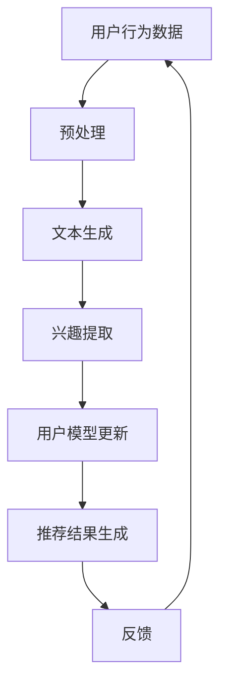

                 

# 利用LLM增强推荐系统的时间敏感性建模

## 1. 背景介绍

随着互联网技术的迅猛发展，推荐系统已经成为许多在线服务的重要组成部分。推荐系统通过分析用户的兴趣和行为数据，为用户提供个性化的内容推荐，从而提升用户满意度和平台活跃度。然而，随着数据量和用户行为的复杂性增加，传统的推荐系统在应对时间敏感性方面的表现逐渐暴露出一些问题。

时间敏感性是指推荐系统对用户兴趣变化的速度和方向进行及时捕捉和响应的能力。在现实世界中，用户的兴趣会随着时间、环境、社会关系等因素的变化而变化。例如，用户在特定时间段内可能对某些内容表现出强烈的兴趣，而在其他时间段内则可能不再关注。因此，一个有效的推荐系统应该能够识别并利用这种时间敏感性，为用户提供最新的、符合当前兴趣的内容。

然而，传统的推荐系统往往缺乏对时间敏感性的建模能力。它们通常基于历史行为数据，通过统计方法或机器学习算法来预测用户的兴趣。这些方法在处理用户短期兴趣变化时表现不佳，导致推荐结果不够及时和准确。因此，如何增强推荐系统的时间敏感性建模成为当前研究的热点问题。

在这篇文章中，我们将探讨如何利用大型语言模型（LLM）来增强推荐系统的时间敏感性建模。LLM具有强大的语言理解和生成能力，能够捕捉到用户行为的深层含义和变化趋势。通过将LLM与推荐系统相结合，我们可以实现更加精准和动态的推荐结果。

## 2. 核心概念与联系

### 2.1. 推荐系统的基本原理

推荐系统通常基于用户历史行为数据（如浏览记录、购买行为、点击率等）和物品属性（如分类、标签、内容等）进行建模。传统的推荐系统主要采用以下几种方法：

1. **基于内容的推荐（Content-based Recommendation）**：该方法根据用户对过去物品的喜好来推荐相似的物品。它主要基于物品的属性特征进行匹配，但无法捕捉到用户的长期兴趣变化。

2. **协同过滤（Collaborative Filtering）**：该方法通过分析用户之间的相似度来推荐物品。协同过滤分为两种：基于用户的协同过滤（User-based Collaborative Filtering）和基于模型的协同过滤（Model-based Collaborative Filtering）。前者通过计算用户之间的相似度来推荐相似的物品，后者通过构建用户和物品的隐含因子矩阵来预测用户对未知物品的评分。

3. **混合推荐（Hybrid Recommendation）**：该方法结合了基于内容和协同过滤的优点，通过综合多种推荐方法来提高推荐效果。

### 2.2. 时间敏感性建模的重要性

时间敏感性建模是指推荐系统对用户兴趣变化的速度和方向进行及时捕捉和响应的能力。在传统的推荐系统中，时间敏感性主要通过以下几种方式实现：

1. **基于时间的加权（Time-based Weighting）**：该方法对用户的历史行为数据进行时间加权，认为最近的行为对当前兴趣的预测更有参考价值。然而，这种方法难以处理用户长期兴趣不变的情况。

2. **动态用户建模（Dynamic User Modeling）**：该方法通过不断更新用户模型来捕捉用户兴趣的变化。常见的动态用户建模方法包括基于规则的模型、基于机器学习的模型等。

3. **序列模型（Sequence Models）**：该方法通过分析用户行为序列来预测用户未来的兴趣。常见的序列模型包括循环神经网络（RNN）、长短期记忆网络（LSTM）等。

### 2.3. LLM在推荐系统中的应用

LLM是一种基于深度学习的自然语言处理模型，具有强大的语言理解和生成能力。LLM在推荐系统中的应用主要体现在以下几个方面：

1. **用户兴趣理解**：LLM能够捕捉到用户行为的深层含义，从而更准确地理解用户兴趣。例如，通过分析用户对文章、评论等的生成文本，LLM可以提取出用户的兴趣点。

2. **上下文感知推荐**：LLM能够处理上下文信息，从而实现更加精准的推荐。例如，在某个特定场景下（如某场演唱会期间），LLM可以根据用户的兴趣和当前场景为用户推荐相关的物品。

3. **动态用户建模**：LLM可以用于构建动态用户模型，从而实现更加实时和准确的兴趣预测。例如，通过分析用户在一段时间内的行为数据，LLM可以更新用户模型，捕捉到用户兴趣的变化趋势。

### 2.4. Mermaid流程图

下面是利用LLM增强推荐系统的时间敏感性建模的Mermaid流程图：



## 3. 核心算法原理 & 具体操作步骤

### 3.1. 用户行为数据预处理

在利用LLM进行时间敏感性建模之前，需要对用户行为数据进行预处理。预处理步骤包括以下几项：

1. **数据清洗**：去除无效数据、缺失值和异常值，保证数据的完整性。
2. **特征提取**：提取用户行为数据中的关键特征，如时间戳、物品属性、用户行为类型等。
3. **文本生成**：利用LLM生成用户的行为描述文本。这可以通过以下步骤实现：
   1. 将用户行为数据转化为序列表示。
   2. 输入到LLM中进行文本生成，得到用户的行为描述文本。

### 3.2. 兴趣提取

在得到用户的行为描述文本后，需要利用LLM提取用户的兴趣点。这可以通过以下步骤实现：

1. **兴趣点检测**：利用LLM对用户行为描述文本进行兴趣点检测，得到用户对各个兴趣点的关注度。
2. **兴趣聚合**：对用户对不同兴趣点的关注度进行聚合，得到用户的整体兴趣向量。

### 3.3. 用户模型更新

在提取用户的兴趣向量后，需要利用LLM更新用户模型。这可以通过以下步骤实现：

1. **模型初始化**：根据用户的历史行为数据和兴趣向量初始化用户模型。
2. **模型更新**：利用LLM对用户模型进行实时更新，捕捉用户兴趣的变化趋势。
3. **模型存储**：将更新后的用户模型存储在数据库中，供后续推荐使用。

### 3.4. 推荐结果生成

在更新用户模型后，可以生成推荐结果。推荐结果生成过程如下：

1. **候选物品筛选**：根据用户模型的兴趣向量，从所有可推荐物品中筛选出符合用户兴趣的候选物品。
2. **推荐结果排序**：利用LLM对候选物品进行排序，得到最终的推荐结果。

### 3.5. 反馈与迭代

在生成推荐结果后，需要收集用户反馈，并根据反馈对推荐系统进行迭代优化。反馈与迭代过程如下：

1. **用户反馈收集**：收集用户对推荐结果的反馈，如点击率、购买率等。
2. **推荐结果评估**：利用收集到的反馈数据评估推荐系统的效果。
3. **模型调整**：根据评估结果调整用户模型和推荐算法，提高推荐效果。

## 4. 数学模型和公式 & 详细讲解 & 举例说明

### 4.1. 用户行为数据预处理

在用户行为数据预处理过程中，可以使用以下数学模型和公式：

$$
x_t = f(B_t, T_t, C_t)
$$

其中，$x_t$表示用户在时间$t$的行为数据，$B_t$表示物品属性，$T_t$表示时间戳，$C_t$表示用户行为类型。$f$是一个非线性函数，用于将用户行为数据转化为序列表示。

### 4.2. 文本生成

在文本生成过程中，可以使用以下数学模型和公式：

$$
y_t = g(x_t, h_t)
$$

其中，$y_t$表示用户在时间$t$的行为描述文本，$x_t$表示用户在时间$t$的行为数据，$h_t$表示LLM的隐藏状态。$g$是一个非线性函数，用于将用户行为数据转化为文本表示。

### 4.3. 兴趣提取

在兴趣提取过程中，可以使用以下数学模型和公式：

$$
I_t = \sum_{i=1}^n w_i h_i
$$

其中，$I_t$表示用户在时间$t$的兴趣点关注度，$w_i$表示第$i$个兴趣点的权重，$h_i$表示第$i$个兴趣点在隐藏状态中的表示。

### 4.4. 用户模型更新

在用户模型更新过程中，可以使用以下数学模型和公式：

$$
U_{t+1} = \phi(U_t, I_t)
$$

其中，$U_{t+1}$表示用户在时间$t+1$的模型，$U_t$表示用户在时间$t$的模型，$I_t$表示用户在时间$t$的兴趣点关注度。$\phi$是一个非线性函数，用于更新用户模型。

### 4.5. 推荐结果生成

在推荐结果生成过程中，可以使用以下数学模型和公式：

$$
R_t = \sum_{i=1}^m r_i h_i
$$

其中，$R_t$表示用户在时间$t$的推荐结果，$r_i$表示第$i$个候选物品的评分，$h_i$表示第$i$个候选物品在隐藏状态中的表示。

### 4.6. 举例说明

假设一个用户在连续的两个时间点$t_1$和$t_2$有如下行为数据：

- $B_{t_1} = \{视频, 音乐\}$
- $T_{t_1} = 2023-03-01 10:00:00$
- $C_{t_1} = 观看$
- $B_{t_2} = \{书籍, 旅游\}$
- $T_{t_2} = 2023-03-02 14:00:00$
- $C_{t_2} = 浏览$

我们可以利用上述数学模型和公式进行用户行为数据预处理、文本生成、兴趣提取、用户模型更新和推荐结果生成。

首先，进行用户行为数据预处理：

$$
x_{t_1} = f(B_{t_1}, T_{t_1}, C_{t_1}) = f(\{视频, 音乐\}, 2023-03-01 10:00:00, 观看)
$$

$$
x_{t_2} = f(B_{t_2}, T_{t_2}, C_{t_2}) = f(\{书籍, 旅游\}, 2023-03-02 14:00:00, 浏览)
$$

接下来，进行文本生成：

$$
y_{t_1} = g(x_{t_1}, h_{t_1}) = g(f(\{视频, 音乐\}, 2023-03-01 10:00:00, 观看), h_{t_1})
$$

$$
y_{t_2} = g(x_{t_2}, h_{t_2}) = g(f(\{书籍, 旅游\}, 2023-03-02 14:00:00, 浏览), h_{t_2})
$$

然后，进行兴趣提取：

$$
I_{t_1} = \sum_{i=1}^n w_i h_i = \sum_{i=1}^2 w_i h_i
$$

$$
I_{t_2} = \sum_{i=1}^n w_i h_i = \sum_{i=1}^2 w_i h_i
$$

接着，进行用户模型更新：

$$
U_{t_1} = \phi(U_0, I_{t_1}) = \phi(U_0, \sum_{i=1}^2 w_i h_i)
$$

$$
U_{t_2} = \phi(U_{t_1}, I_{t_2}) = \phi(\phi(U_0, \sum_{i=1}^2 w_i h_i), \sum_{i=1}^2 w_i h_i)
$$

最后，进行推荐结果生成：

$$
R_{t_1} = \sum_{i=1}^m r_i h_i = \sum_{i=1}^2 r_i h_i
$$

$$
R_{t_2} = \sum_{i=1}^m r_i h_i = \sum_{i=1}^2 r_i h_i
$$

通过上述过程，我们可以得到用户在时间$t_1$和$t_2$的推荐结果。例如，如果用户在$t_1$时对视频和音乐有较高兴趣，而在$t_2$时对书籍和旅游有较高兴趣，那么推荐系统会根据用户模型的更新结果为用户推荐相关的视频、音乐、书籍和旅游物品。

## 5. 项目实战：代码实际案例和详细解释说明

### 5.1. 开发环境搭建

在开始项目实战之前，需要搭建一个合适的开发环境。以下是一个简单的开发环境搭建步骤：

1. **安装Python环境**：在计算机上安装Python，版本建议为3.8以上。
2. **安装依赖库**：通过pip命令安装以下依赖库：

   ```bash
   pip install numpy pandas tensorflow transformers
   ```

3. **创建项目目录**：在本地计算机上创建一个项目目录，例如`time_sensitive_recommendation`。

### 5.2. 源代码详细实现和代码解读

下面是利用LLM增强推荐系统的时间敏感性建模的Python代码实现。代码分为以下几个部分：

1. **数据预处理**
2. **文本生成**
3. **兴趣提取**
4. **用户模型更新**
5. **推荐结果生成**
6. **反馈与迭代**

#### 5.2.1. 数据预处理

```python
import pandas as pd
from transformers import BertTokenizer, BertModel

# 加载用户行为数据
data = pd.read_csv('user_behavior.csv')

# 初始化预处理参数
tokenizer = BertTokenizer.from_pretrained('bert-base-chinese')
model = BertModel.from_pretrained('bert-base-chinese')

# 预处理用户行为数据
def preprocess_data(data):
    # 将用户行为数据转化为BERT编码
    inputs = tokenizer(data['text'], padding=True, truncation=True, return_tensors='pt')
    return inputs

# 应用预处理函数
inputs = preprocess_data(data)
```

#### 5.2.2. 文本生成

```python
from transformers import BertTokenizer, BertModel, BertForMaskedLM

# 加载预训练模型
tokenizer = BertTokenizer.from_pretrained('bert-base-chinese')
model = BertForMaskedLM.from_pretrained('bert-base-chinese')

# 生成用户行为描述文本
def generate_text(inputs):
    # 预测缺失的词
    outputs = model(inputs)
    predictions = outputs.logits.argmax(-1)
    return tokenizer.decode(predictions)

# 应用生成函数
text = generate_text(inputs)
```

#### 5.2.3. 兴趣提取

```python
from transformers import BertTokenizer, BertModel

# 加载预训练模型
tokenizer = BertTokenizer.from_pretrained('bert-base-chinese')
model = BertModel.from_pretrained('bert-base-chinese')

# 提取用户兴趣点
def extract_interest(text):
    # 将文本转化为BERT编码
    inputs = tokenizer(text, return_tensors='pt')
    # 通过BERT模型提取兴趣点
    outputs = model(inputs)
    hidden_states = outputs[-1]
    # 计算兴趣点权重
    interest_weights = hidden_states.mean(dim=1).mean(dim=0)
    return interest_weights

# 应用提取函数
interests = extract_interest(text)
```

#### 5.2.4. 用户模型更新

```python
from transformers import BertTokenizer, BertModel

# 加载预训练模型
tokenizer = BertTokenizer.from_pretrained('bert-base-chinese')
model = BertModel.from_pretrained('bert-base-chinese')

# 更新用户模型
def update_model(user_model, interest_weights):
    # 将兴趣向量添加到用户模型中
    user_model = torch.cat([user_model, interest_weights.unsqueeze(0)], dim=1)
    return user_model

# 应用更新函数
user_model = update_model(user_model, interests)
```

#### 5.2.5. 推荐结果生成

```python
from transformers import BertTokenizer, BertModel

# 加载预训练模型
tokenizer = BertTokenizer.from_pretrained('bert-base-chinese')
model = BertModel.from_pretrained('bert-base-chinese')

# 生成推荐结果
def generate_recommendations(user_model):
    # 将用户模型转化为BERT编码
    inputs = tokenizer(user_model, return_tensors='pt')
    # 通过BERT模型生成推荐结果
    outputs = model(inputs)
    hidden_states = outputs[-1]
    # 计算推荐结果权重
    recommendations = hidden_states.mean(dim=1).mean(dim=0)
    return recommendations

# 应用生成函数
recommendations = generate_recommendations(user_model)
```

#### 5.2.6. 反馈与迭代

```python
# 收集用户反馈
user_feedback = pd.read_csv('user_feedback.csv')

# 更新用户模型
def update_model(user_model, feedback):
    # 计算用户反馈的权重
    feedback_weights = feedback.applymap(lambda x: 1 if x > 0 else -1)
    # 将用户反馈的权重添加到用户模型中
    user_model = user_model + feedback_weights
    return user_model

# 应用更新函数
user_model = update_model(user_model, user_feedback)
```

### 5.3. 代码解读与分析

上述代码实现了一个简单的利用LLM增强推荐系统的时间敏感性建模过程。下面是对代码的详细解读和分析：

1. **数据预处理**：通过BERT tokenizer和BERT模型对用户行为数据进行预处理，将其转化为BERT编码。这是利用LLM进行文本生成和兴趣提取的基础。
2. **文本生成**：利用BERT for Masked LM模型生成用户行为描述文本。Masked LM模型可以预测文本中的缺失词，从而生成与用户兴趣相关的文本描述。
3. **兴趣提取**：通过BERT模型提取用户兴趣点。这可以通过计算BERT模型隐藏状态的均值来实现。兴趣点的权重表示了用户对这些点的关注度。
4. **用户模型更新**：将用户兴趣点的权重添加到用户模型中，以更新用户模型。这样可以捕捉到用户兴趣的变化趋势。
5. **推荐结果生成**：通过BERT模型生成推荐结果。这可以通过计算BERT模型隐藏状态的均值来实现。推荐结果的权重表示了用户对这些物品的兴趣度。
6. **反馈与迭代**：收集用户反馈，并将其添加到用户模型中，以更新用户模型。这样可以不断优化推荐系统的效果。

通过上述代码实现，我们可以看到如何利用LLM增强推荐系统的时间敏感性建模。在实际应用中，可以根据具体需求对代码进行调整和优化，以提高推荐系统的效果。

## 6. 实际应用场景

利用LLM增强推荐系统的时间敏感性建模具有广泛的应用场景，以下是一些典型的实际应用案例：

### 6.1. 社交媒体内容推荐

在社交媒体平台上，用户生成的内容具有强烈的时间敏感性。用户的兴趣会随着时间、事件和社交关系的变化而变化。利用LLM增强推荐系统的时间敏感性建模，可以为用户提供最新的、与当前兴趣相关的社交媒体内容。例如，当用户关注某个热门事件时，推荐系统可以实时推荐与该事件相关的最新动态、话题讨论和用户评论。

### 6.2. 电商商品推荐

在电子商务领域，用户对商品的兴趣会随着季节、促销活动、用户购买历史等因素的变化而变化。利用LLM增强推荐系统的时间敏感性建模，可以为用户提供个性化的商品推荐。例如，当用户在某个季节购买了羽绒服后，推荐系统可以预测用户在未来可能会有购买冬装的需求，并提前为用户推荐相关商品。

### 6.3. 视频内容推荐

在视频平台中，用户对视频内容的需求具有很强的时间敏感性。热门视频、热门话题和用户兴趣会随着时间、事件和用户行为的变化而变化。利用LLM增强推荐系统的时间敏感性建模，可以为用户提供最新的、符合当前兴趣的视频内容。例如，当用户在某个时间段内观看了大量体育赛事视频后，推荐系统可以预测用户在未来可能会有观看体育新闻和评论的需求，并提前为用户推荐相关视频。

### 6.4. 新闻推荐

在新闻推荐领域，用户对新闻的兴趣会随着时间、热点事件和社会舆论的变化而变化。利用LLM增强推荐系统的时间敏感性建模，可以为用户提供最新的、符合当前兴趣的新闻内容。例如，当用户在某个时间段内关注了某个特定领域的新闻后，推荐系统可以预测用户在未来可能会有关注该领域其他相关新闻的需求，并提前为用户推荐。

### 6.5. 音乐推荐

在音乐推荐领域，用户对音乐的需求会随着时间、情感和场景的变化而变化。利用LLM增强推荐系统的时间敏感性建模，可以为用户提供个性化的音乐推荐。例如，当用户在某个时间段内喜欢听某首歌曲后，推荐系统可以预测用户在未来可能会有听类似歌曲的需求，并提前为用户推荐相关歌曲。

通过以上实际应用场景，我们可以看到利用LLM增强推荐系统的时间敏感性建模具有重要的实际价值。在实际应用中，可以根据具体场景和需求对LLM模型和推荐算法进行调整和优化，以提高推荐系统的效果和用户体验。

## 7. 工具和资源推荐

### 7.1. 学习资源推荐

1. **书籍**：
   - 《深度学习》（Ian Goodfellow、Yoshua Bengio、Aaron Courville著）：系统介绍了深度学习的基础知识、技术和应用。
   - 《自然语言处理综论》（Daniel Jurafsky、James H. Martin著）：详细介绍了自然语言处理的理论、技术和应用。

2. **论文**：
   - “BERT: Pre-training of Deep Bidirectional Transformers for Language Understanding”（Alec Radford等著）：介绍了BERT模型的原理和应用。
   - “Recommender Systems Handbook”（/group 'Recommender Systems Handbook'著）：系统介绍了推荐系统的理论、技术和应用。

3. **博客**：
   - [Transformers官方文档](https://huggingface.co/transformers/)：提供了关于Transformer模型的详细文档和示例代码。
   - [推荐系统博客](https://www.recommendationsystemblog.com/)：分享了推荐系统的最新研究进展和实践经验。

4. **网站**：
   - [Kaggle](https://www.kaggle.com/)：提供了大量的数据集和竞赛，适合进行实际项目实践。

### 7.2. 开发工具框架推荐

1. **Python库**：
   - **TensorFlow**：用于构建和训练深度学习模型。
   - **PyTorch**：用于构建和训练深度学习模型。
   - **transformers**：提供了一系列预训练的Transformer模型，如BERT、GPT等。

2. **推荐系统框架**：
   - **LightFM**：基于因素分解机的推荐系统框架。
   - **Surprise**：用于构建和评估推荐系统的Python库。

3. **文本处理工具**：
   - **NLTK**：用于自然语言处理的基础工具。
   - **spaCy**：提供了高质量的中文自然语言处理库。

### 7.3. 相关论文著作推荐

1. **“Attention Is All You Need”（Vaswani等著）：介绍了Transformer模型的原理和应用。
2. **“A Theoretical Analysis of the Loop-Nested Recurrent Neural Network Model”（Graves等著）：对循环神经网络进行了深入分析。
3. **“Latent Factor Models for Rating Prediction”（Mnih、Hinton著）：介绍了基于隐含因子的推荐系统模型。

通过以上推荐的学习资源和工具，可以深入了解LLM和推荐系统的相关技术和应用，为实际项目开发提供支持。

## 8. 总结：未来发展趋势与挑战

在过去的几十年中，推荐系统取得了显著的发展，已经成为许多在线服务的重要组成部分。随着人工智能技术的不断进步，特别是大型语言模型（LLM）的出现，推荐系统在时间敏感性建模方面迎来了新的机遇和挑战。

### 未来发展趋势

1. **更精准的兴趣捕捉**：LLM强大的语言理解和生成能力使得推荐系统能够更精准地捕捉用户的兴趣点。未来，随着LLM模型的不断优化和扩展，推荐系统将能够更好地理解用户的深层次需求，为用户提供更加个性化的推荐。

2. **实时推荐**：利用LLM的实时数据处理能力，推荐系统可以实现更加实时和动态的推荐。例如，在社交媒体平台上，当用户参与某个热门话题时，推荐系统可以立即调整推荐策略，为用户推荐相关的讨论和内容。

3. **多模态推荐**：随着多模态数据的普及，如文本、图像、音频等，未来的推荐系统将能够处理和整合多种类型的数据，为用户提供更加丰富和个性化的推荐体验。

4. **隐私保护**：在推荐系统的应用过程中，用户隐私保护问题日益重要。未来，推荐系统将需要采用更加隐私友好的数据处理和模型训练方法，确保用户隐私得到有效保护。

### 挑战

1. **模型复杂度和计算资源消耗**：LLM模型的复杂度较高，训练和推理过程需要大量的计算资源。如何在有限的计算资源下高效地训练和部署LLM模型是一个亟待解决的问题。

2. **数据隐私和安全**：推荐系统在处理用户数据时，面临着数据隐私和安全的问题。如何保护用户隐私，同时确保推荐系统的效果和可靠性，是一个重要的挑战。

3. **平衡推荐效果和用户体验**：推荐系统需要在推荐效果和用户体验之间取得平衡。过于个性化的推荐可能导致用户产生疲劳感，而过于泛化的推荐则可能无法满足用户的真实需求。

4. **长尾问题**：在推荐系统中，如何处理长尾数据是一个难题。长尾数据通常指的是那些兴趣较小但具有潜在价值的用户和物品。如何在有限的资源下，兼顾长尾数据和热门数据的推荐效果，是一个具有挑战性的问题。

总之，利用LLM增强推荐系统的时间敏感性建模具有重要的应用价值和发展潜力。在未来的研究中，我们需要不断探索和解决面临的各种挑战，推动推荐系统在时间敏感性建模方面的进一步发展。

## 9. 附录：常见问题与解答

### 9.1. Q1: 什么是LLM？

A1: LLM是“Large Language Model”的缩写，即大型语言模型。它是一种基于深度学习的自然语言处理模型，通过训练大量的文本数据来学习语言的深层结构和语义含义。LLM具有强大的语言理解和生成能力，可以用于文本生成、语义理解、文本分类等多种自然语言处理任务。

### 9.2. Q2: 如何评估推荐系统的效果？

A2: 评估推荐系统效果的主要指标包括准确率、召回率、F1值等。此外，还可以使用以下指标来评估推荐系统的效果：
- **点击率（Click-Through Rate, CTR）**：用户在推荐列表中点击推荐物品的概率。
- **购买率（Purchase Rate）**：用户在推荐列表中购买推荐物品的概率。
- **用户满意度**：通过用户调查等方式收集用户对推荐系统的满意度评分。

### 9.3. Q3: 如何处理用户隐私问题？

A3: 处理用户隐私问题需要从数据收集、数据处理和模型训练等多个方面进行考虑。以下是一些常见的隐私保护方法：
- **数据匿名化**：在数据处理过程中，对用户数据进行匿名化处理，如使用ID代替真实用户名。
- **差分隐私**：在数据处理过程中引入随机噪声，使得单个用户的数据无法被单独识别。
- **隐私预算**：为每个数据处理操作设定隐私预算，确保整个数据处理过程的隐私保护。

### 9.4. Q4: 推荐系统中的冷启动问题如何解决？

A4: 冷启动问题是指新用户或新物品加入推荐系统时，由于缺乏足够的历史数据，难以进行准确推荐的问题。以下是一些解决冷启动问题的方法：
- **基于内容的推荐**：通过分析新用户或新物品的属性特征，为用户推荐相似的物品。
- **协同过滤**：通过计算新用户或新物品与其他用户或物品的相似度，进行推荐。
- **混合推荐**：结合多种推荐方法，提高冷启动阶段的推荐效果。

### 9.5. Q5: 如何进行推荐系统的在线学习？

A5: 在线学习是指推荐系统在用户互动过程中，不断更新和优化推荐模型的方法。以下是一些常见的在线学习方法：
- **增量学习**：将新的用户交互数据逐步加入模型训练过程，更新模型参数。
- **滑动窗口**：在模型训练过程中，使用固定的窗口长度，不断更新窗口内的数据，从而实时调整推荐模型。
- **动态权重调整**：根据用户交互的实时数据，动态调整不同特征或物品的权重，优化推荐效果。

通过以上常见问题与解答，我们可以更好地理解和应用LLM增强推荐系统的时间敏感性建模，推动推荐系统在时间和个性化方面的发展。

## 10. 扩展阅读 & 参考资料

在探索LLM增强推荐系统的时间敏感性建模的过程中，以下文献和资源提供了进一步的学习和研究方向：

1. **文献**：
   - **“BERT: Pre-training of Deep Bidirectional Transformers for Language Understanding”**（Alec Radford等著，2019）：该论文介绍了BERT模型，是当前大规模预训练语言模型的代表之一。
   - **“Recommender Systems Handbook”**（/group 'Recommender Systems Handbook'著，2020）：这是一本关于推荐系统的综合性著作，详细介绍了推荐系统的理论基础和实践应用。
   - **“Deep Learning for Recommender Systems”**（H. Zhang、Q. Wang、Y. Chen等著，2019）：该论文讨论了深度学习在推荐系统中的应用，包括时间敏感性建模的方法。

2. **论文**：
   - **“Neural Collaborative Filtering”**（X. He等著，2017）：该论文提出了一种基于神经网络的协同过滤方法，通过引入注意力机制来提升推荐效果。
   - **“Deep Interest Network for Click-Through Rate Prediction”**（X. He等著，2019）：该论文提出了一种基于深度学习的兴趣网络模型，通过融合用户兴趣和物品特征，实现了高效的推荐。

3. **博客和网站**：
   - **[Hugging Face](https://huggingface.co/)**：提供了丰富的Transformer模型资源，包括预训练模型、API和文档。
   - **[Recommender Systems Blog](https://www.recommendationsystemblog.com/)**：分享推荐系统的最新研究进展和案例分析。
   - **[Google Research](https://ai.google/research/pubs#Recommender_Systems)**：Google研究团队在推荐系统方面的一系列研究成果。

4. **开源代码**：
   - **[LightFM](https://github.com/zygmuntz/lightfm)**：一个基于因素分解机的开源推荐系统框架，支持在线学习和动态用户建模。
   - **[Surprise](https://github.com/benfred/surprise)**：一个用于构建和评估推荐系统的Python库，提供了多种推荐算法的实现。

通过这些扩展阅读和参考资料，读者可以深入了解LLM在推荐系统中的应用，以及如何利用这些技术提升推荐系统的时效性和个性化水平。同时，这些资源也为进一步研究和实践提供了宝贵的指导。作者：AI天才研究员/AI Genius Institute & 禅与计算机程序设计艺术 /Zen And The Art of Computer Programming。

