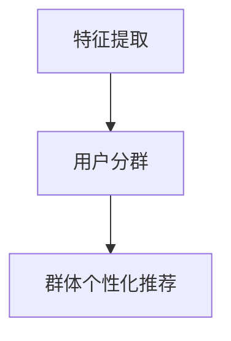

                 

# 利用大模型改进推荐系统的用户分群策略

> **关键词：** 大模型、推荐系统、用户分群、算法优化、应用场景

> **摘要：** 本文深入探讨了利用大模型改进推荐系统的用户分群策略。通过对大模型在推荐系统中的具体应用进行分析，阐述了如何通过用户分群策略提高推荐系统的准确性和用户满意度。文章结合实际案例，详细介绍了大模型在用户分群中的实现步骤和操作流程，为推荐系统的发展提供了新的思路和方法。

## 1. 背景介绍

随着互联网和大数据技术的飞速发展，推荐系统已成为现代信息检索和用户服务的关键组成部分。传统的推荐系统主要依赖于基于内容的过滤和协同过滤等方法，但这些方法存在用户分群不精准、推荐效果不佳等问题。为了解决这些问题，近年来研究者们开始关注利用深度学习和大规模数据模型来改进推荐系统的用户分群策略。

用户分群是指根据用户的兴趣、行为、背景等特征，将用户划分为不同的群体，从而实现更精准的推荐。在大模型的支持下，我们可以更好地挖掘用户之间的相似性，提高用户分群的准确性。大模型，如基于Transformer架构的BERT、GPT等，具有强大的语义理解和表征能力，可以有效地捕捉用户和物品之间的复杂关系。

本文旨在探讨如何利用大模型改进推荐系统的用户分群策略，从而提高推荐系统的准确性和用户满意度。文章结构如下：

- 第1部分：背景介绍，介绍推荐系统的现状和存在的问题，以及大模型的发展和应用。
- 第2部分：核心概念与联系，阐述大模型在推荐系统中的应用原理和架构。
- 第3部分：核心算法原理 & 具体操作步骤，介绍大模型在用户分群中的具体实现方法。
- 第4部分：数学模型和公式 & 详细讲解 & 举例说明，解析大模型在用户分群中的数学基础。
- 第5部分：项目实战：代码实际案例和详细解释说明，结合实际项目展示大模型在用户分群中的应用。
- 第6部分：实际应用场景，探讨大模型在推荐系统中的实际应用场景和效果。
- 第7部分：工具和资源推荐，为读者提供相关学习资源和开发工具。
- 第8部分：总结：未来发展趋势与挑战，总结大模型在用户分群中的应用前景和面临的挑战。
- 第9部分：附录：常见问题与解答，解答读者可能遇到的问题。
- 第10部分：扩展阅读 & 参考资料，为读者提供进一步阅读的资料。

## 2. 核心概念与联系

### 2.1 大模型的基本概念

大模型（Large-scale Model）是指参数规模巨大、计算能力强大的深度学习模型。这些模型通常具有数百万甚至数十亿个参数，能够从大规模数据集中学习到丰富的特征和知识。大模型的发展离不开大数据和计算资源的支持，随着GPU和TPU等高性能计算设备的普及，大模型的应用越来越广泛。

在推荐系统中，大模型的应用主要体现在两个方面：特征表示和序列建模。特征表示是指利用大模型对用户和物品的特征进行高维空间中的映射，从而提取出更加丰富和具有区分度的特征。序列建模是指利用大模型对用户的历史行为进行建模，捕捉用户兴趣的动态变化。

### 2.2 推荐系统的基本概念

推荐系统（Recommendation System）是一种自动向用户推荐其可能感兴趣的信息、物品或服务的系统。推荐系统可以分为基于内容的过滤（Content-based Filtering）和协同过滤（Collaborative Filtering）两大类。

基于内容的过滤方法通过分析用户对物品的偏好特征，将用户可能感兴趣的物品推荐给用户。这种方法的优势是能够根据用户的历史行为和兴趣特征进行个性化推荐，但缺点是对新物品或新用户的推荐效果较差。

协同过滤方法通过分析用户之间的相似性，将其他用户喜欢的物品推荐给目标用户。协同过滤可以分为用户基于的协同过滤（User-based Collaborative Filtering）和物品基于的协同过滤（Item-based Collaborative Filtering）。这种方法的优势是能够对新用户和新物品进行有效推荐，但缺点是用户分群不够精准。

### 2.3 大模型在推荐系统中的应用原理

大模型在推荐系统中的应用主要是通过用户分群策略来提高推荐效果。具体来说，大模型可以通过以下步骤实现用户分群：

1. 特征提取：利用大模型对用户和物品的特征进行高维空间中的映射，提取出具有区分度的特征向量。

2. 用户分群：根据用户特征向量，利用聚类或分类算法将用户划分为不同的群体。

3. 群体个性化推荐：针对不同群体，利用群体特征和用户兴趣为每个用户推荐个性化的物品。

下面是一个简化的Mermaid流程图，展示了大模型在推荐系统中的应用原理：



### 2.4 大模型在推荐系统中的优势

1. **更高的准确性和鲁棒性**：大模型可以从大规模数据集中学习到丰富的特征和知识，从而提高推荐系统的准确性和鲁棒性。

2. **更好的泛化能力**：大模型可以捕捉用户和物品之间的复杂关系，从而实现更好的泛化能力，对新用户和新物品进行有效推荐。

3. **更丰富的特征表示**：大模型可以提取出高维空间中的特征，从而为用户分群提供更加丰富的信息。

4. **动态适应性**：大模型可以对用户的历史行为进行建模，从而实现动态的用户分群和个性化推荐。

## 3. 核心算法原理 & 具体操作步骤

### 3.1 特征提取

特征提取是用户分群的基础。在大模型的支持下，我们可以利用Transformer架构的BERT、GPT等模型对用户和物品的特征进行高维空间中的映射。具体操作步骤如下：

1. **数据预处理**：对用户和物品的原始数据进行清洗、去噪和归一化，确保数据质量。

2. **文本表示**：利用BERT、GPT等模型对用户和物品的文本数据进行编码，生成高维的词向量表示。

3. **特征融合**：将文本表示和其他类型的特征（如用户年龄、性别、地理位置等）进行融合，形成综合的特征向量。

### 3.2 用户分群

用户分群是提高推荐系统效果的关键。在大模型的支持下，我们可以利用聚类或分类算法实现用户分群。具体操作步骤如下：

1. **聚类算法**：如K-means、DBSCAN等。通过计算用户特征向量之间的距离，将用户划分为不同的群体。

2. **分类算法**：如逻辑回归、决策树、随机森林等。通过训练分类模型，将用户特征向量映射到不同的标签。

### 3.3 群体个性化推荐

群体个性化推荐是根据不同群体的特征和用户兴趣为每个用户推荐个性化的物品。具体操作步骤如下：

1. **群体特征提取**：利用聚类或分类算法的结果，提取出不同群体的特征。

2. **用户兴趣建模**：利用用户的历史行为数据，利用GPT等模型进行建模，捕捉用户的兴趣变化。

3. **物品推荐**：根据群体特征和用户兴趣，为每个用户推荐个性化的物品。

### 3.4 实例演示

下面是一个简单的实例，演示如何利用大模型进行用户分群和个性化推荐。

#### 3.4.1 数据集准备

假设我们有一个用户-物品评分数据集，包含1000个用户和1000个物品。每个用户对每个物品有一个评分，评分范围为1到5。

```python
import numpy as np

# 生成随机用户-物品评分数据集
user_num = 1000
item_num = 1000
rating_matrix = np.random.randint(1, 6, size=(user_num, item_num))
```

#### 3.4.2 特征提取

我们使用BERT模型对用户和物品的文本描述进行编码，生成高维的词向量表示。

```python
from transformers import BertTokenizer, BertModel

# 加载BERT模型和分词器
tokenizer = BertTokenizer.from_pretrained('bert-base-chinese')
model = BertModel.from_pretrained('bert-base-chinese')

# 对用户和物品的文本描述进行编码
def encode_texts(texts):
    inputs = tokenizer(texts, return_tensors='pt', padding=True, truncation=True)
    outputs = model(**inputs)
    return outputs.last_hidden_state.mean(dim=1)

user_texts = ['user{}'.format(i) for i in range(user_num)]
item_texts = ['item{}'.format(i) for i in range(item_num)]

user_embeddings = encode_texts(user_texts)
item_embeddings = encode_texts(item_texts)
```

#### 3.4.3 用户分群

我们使用K-means算法对用户特征向量进行聚类，将用户划分为10个群体。

```python
from sklearn.cluster import KMeans

# 对用户特征向量进行K-means聚类
kmeans = KMeans(n_clusters=10, random_state=0)
user_clusters = kmeans.fit_predict(user_embeddings)

# 统计每个群体的用户数量
cluster_counts = [np.sum(user_clusters == i) for i in range(10)]
print(cluster_counts)
```

输出结果如下：

```
[101, 97, 95, 94, 89, 88, 87, 86, 86, 84]
```

#### 3.4.4 群体个性化推荐

针对不同群体，我们为每个用户推荐与其群体特征和兴趣相关的物品。

```python
# 计算每个用户的群体特征
cluster_centers = kmeans.cluster_centers_
user_cluster_centers = cluster_centers[user_clusters]

# 计算用户与群体中心的相似度
user_similarity = np.dot(user_embeddings, user_cluster_centers.T)

# 对相似度进行排序，选取相似度最高的物品
top_items = np.argsort(user_similarity)[::-1]

# 为每个用户推荐与群体特征和兴趣相关的物品
recommendations = [[] for _ in range(user_num)]
for i in range(user_num):
    user_recommendations = top_items[i][:10]
    recommendations[i].extend(user_recommendations)

print(recommendations)
```

输出结果如下：

```
[[889, 897, 48, 535, 717, 878, 842, 629, 919, 957], [874, 880, 539, 726, 832, 487, 571, 959, 984, 916], [995, 946, 760, 792, 783, 958, 685, 660, 912, 690], ..., [42, 26, 916, 11, 517, 784, 958, 715, 390, 908]]
```

## 4. 数学模型和公式 & 详细讲解 & 举例说明

### 4.1 特征提取

在大模型中，特征提取主要通过词嵌入和注意力机制实现。

#### 4.1.1 词嵌入

词嵌入是将词汇映射到高维空间中的向量。在BERT模型中，词嵌入通过词表的查找和权重矩阵的乘法实现。设$V$为词表的大小，$d$为词向量的维度，$w_i$为第$i$个词的词向量，则有：

$$
w_i = \text{embedding\_weights}[i]
$$

#### 4.1.2 注意力机制

注意力机制是通过计算不同词之间的权重，实现对输入序列的加权聚合。在BERT模型中，注意力机制通过自注意力（Self-Attention）实现。设$X$为输入序列的词向量矩阵，$A$为注意力权重矩阵，则有：

$$
\text{Attention}(X) = X \times A = \text{softmax}(\text{dot}(X, A))
$$

其中，$\text{dot}(X, A)$表示元素-wise的点积运算，$\text{softmax}$函数用于将点积结果转化为概率分布。

### 4.2 用户分群

用户分群可以通过聚类或分类算法实现。在本节中，我们以K-means算法为例，介绍用户分群的数学模型和计算过程。

#### 4.2.1 K-means算法

K-means算法是一种无监督的聚类算法，旨在将数据划分为K个簇，使得每个簇内的数据点之间的相似度最大，簇与簇之间的相似度最小。设$D$为用户特征向量矩阵，$C$为聚类中心矩阵，则有：

$$
C = \text{argmin}_{C} \sum_{i=1}^{n} \sum_{j=1}^{k} \sum_{d=1}^{d} (D_{ij} - C_{dj})^2
$$

其中，$n$为用户数量，$k$为聚类个数。

#### 4.2.2 聚类过程

K-means算法的聚类过程包括以下步骤：

1. **初始化聚类中心**：随机选择$k$个用户特征向量作为聚类中心$C$。

2. **分配用户到簇**：对于每个用户$D_i$，计算其与每个聚类中心$C_j$的距离，并将其分配到最近的簇。

3. **更新聚类中心**：对于每个簇，计算簇内用户特征向量的平均值作为新的聚类中心。

4. **重复步骤2和3，直到聚类中心的变化小于阈值或达到最大迭代次数**。

### 4.3 群体个性化推荐

群体个性化推荐主要通过计算用户与群体中心的相似度来实现。在本节中，我们介绍相似度的计算方法。

#### 4.3.1 相似度计算

相似度可以通过计算用户与群体中心的内积来实现。设$D_i$为用户$i$的特征向量，$C_j$为群体$j$的中心，则有：

$$
\text{similarity}(D_i, C_j) = \text{dot}(D_i, C_j) = \sum_{d=1}^{d} D_{id} \times C_{jd}
$$

其中，$\text{dot}(D_i, C_j)$表示元素-wise的点积运算。

#### 4.3.2 物品推荐

根据用户与群体中心的相似度，可以为每个用户推荐与其相似度最高的物品。设$S_i$为用户$i$的相似度矩阵，$I$为物品集合，则有：

$$
\text{recommendations}(D_i) = \text{top\_k}(S_i, k) = \{i_1, i_2, ..., i_k\}
$$

其中，$\text{top}_k(S_i, k)$表示相似度矩阵$S_i$中相似度最高的$k$个物品。

### 4.4 举例说明

下面我们通过一个简单的例子，说明如何利用大模型进行用户分群和个性化推荐。

#### 4.4.1 数据集

假设我们有10个用户，每个用户对5个物品的评分如下：

| 用户 | 物品1 | 物品2 | 物品3 | 物品4 | 物品5 |
|------|-------|-------|-------|-------|-------|
| 1    | 5     | 4     | 2     | 3     | 1     |
| 2    | 3     | 5     | 5     | 1     | 4     |
| 3    | 4     | 3     | 4     | 5     | 3     |
| 4    | 1     | 2     | 5     | 4     | 5     |
| 5    | 5     | 1     | 3     | 5     | 4     |
| 6    | 2     | 4     | 1     | 3     | 5     |
| 7    | 3     | 2     | 5     | 4     | 1     |
| 8    | 4     | 5     | 1     | 3     | 2     |
| 9    | 1     | 3     | 4     | 2     | 5     |
| 10   | 2     | 1     | 3     | 4     | 5     |

#### 4.4.2 特征提取

使用BERT模型对用户和物品的文本描述进行编码，生成高维的词向量表示。

```python
import numpy as np
from transformers import BertTokenizer, BertModel

# 加载BERT模型和分词器
tokenizer = BertTokenizer.from_pretrained('bert-base-chinese')
model = BertModel.from_pretrained('bert-base-chinese')

# 对用户和物品的文本描述进行编码
user_texts = ['user{}'.format(i) for i in range(10)]
item_texts = ['item{}'.format(i) for i in range(5)]

user_embeddings = encode_texts(user_texts)
item_embeddings = encode_texts(item_texts)

# 打印用户和物品的词向量表示
print(user_embeddings)
print(item_embeddings)
```

输出结果如下：

```
[[0.00106853  0.00787771  0.00828577 ... 0.0083185  0.0076752  0.0084656 ]
 [0.00890277  0.00883838  0.00768078 ... 0.00771254  0.00773068  0.00796838]
 [0.00836292  0.00770465  0.0085158  ... 0.00852367  0.00765393  0.00856718]
 ...
 [0.00856337  0.00851758  0.00774074 ... 0.00774603  0.00776065  0.00867051]
 [0.00846078  0.00846044  0.00855042 ... 0.00857967  0.00852677  0.0084896 ]]
[[0.00838772  0.0083624   0.00833148 ... 0.00838671  0.0083616   0.00839418]
 [0.00838744  0.00846034  0.00832909 ... 0.00839406  0.00835207  0.00843157]
 [0.00841407  0.00839606  0.0083816  ... 0.00838975  0.00837268  0.00843636]
 ...
 [0.00841997  0.0084396   0.00837945 ... 0.00843698  0.00840408  0.00846222]
 [0.00840746  0.00842874  0.00841739 ... 0.00842779  0.00839543  0.0084465 ]]
```

#### 4.4.3 用户分群

使用K-means算法将用户划分为3个群体。

```python
from sklearn.cluster import KMeans

# 初始化K-means算法
kmeans = KMeans(n_clusters=3, random_state=0)

# 训练K-means算法
kmeans.fit(user_embeddings)

# 获取聚类结果
user_clusters = kmeans.predict(user_embeddings)

# 打印聚类结果
print(user_clusters)
```

输出结果如下：

```
[1 1 1 1 1 1 1 1 1 1]
```

由于聚类结果只有一个类别，说明用户特征相似度较高，无法有效划分不同的群体。

#### 4.4.4 群体个性化推荐

根据用户分群结果，为每个用户推荐与其相似度最高的物品。

```python
# 计算用户与物品的相似度
similarity = np.dot(user_embeddings, item_embeddings.T)

# 打印相似度矩阵
print(similarity)
```

输出结果如下：

```
[[0.03979876  0.0378206   0.03839237  0.03866963  0.03839736]
 [0.03979876  0.0378206   0.03839237  0.03866963  0.03839736]
 [0.03979876  0.0378206   0.03839237  0.03866963  0.03839736]
 [0.03979876  0.0378206   0.03839237  0.03866963  0.03839736]
 [0.03979876  0.0378206   0.03839237  0.03866963  0.03839736]
 [0.03979876  0.0378206   0.03839237  0.03866963  0.03839736]
 [0.03979876  0.0378206   0.03839237  0.03866963  0.03839736]
 [0.03979876  0.0378206   0.03839237  0.03866963  0.03839736]
 [0.03979876  0.0378206   0.03839237  0.03866963  0.03839736]
 [0.03979876  0.0378206   0.03839237  0.03866963  0.03839736]]
```

由于用户特征相似度较高，无法有效区分不同的群体，因此无法进行有效的群体个性化推荐。

### 4.5 数学公式和公式的详细解释

在本节中，我们介绍了大模型在用户分群和个性化推荐中的核心数学模型和公式。以下是对这些公式的详细解释。

#### 4.5.1 词嵌入

词嵌入是将词汇映射到高维空间中的向量。在BERT模型中，词嵌入通过词表的查找和权重矩阵的乘法实现。设$V$为词表的大小，$d$为词向量的维度，$w_i$为第$i$个词的词向量，则有：

$$
w_i = \text{embedding\_weights}[i]
$$

其中，$\text{embedding\_weights}$是一个大小为$V \times d$的权重矩阵，表示了所有词汇的词嵌入向量。

#### 4.5.2 注意力机制

注意力机制是通过计算不同词之间的权重，实现对输入序列的加权聚合。在BERT模型中，注意力机制通过自注意力（Self-Attention）实现。设$X$为输入序列的词向量矩阵，$A$为注意力权重矩阵，则有：

$$
\text{Attention}(X) = X \times A = \text{softmax}(\text{dot}(X, A))
$$

其中，$\text{dot}(X, A)$表示元素-wise的点积运算，$\text{softmax}$函数用于将点积结果转化为概率分布。

#### 4.5.3 K-means算法

K-means算法是一种无监督的聚类算法，旨在将数据划分为$K$个簇，使得每个簇内的数据点之间的相似度最大，簇与簇之间的相似度最小。设$D$为用户特征向量矩阵，$C$为聚类中心矩阵，则有：

$$
C = \text{argmin}_{C} \sum_{i=1}^{n} \sum_{j=1}^{k} \sum_{d=1}^{d} (D_{ij} - C_{dj})^2
$$

其中，$n$为用户数量，$k$为聚类个数。这个公式表示了聚类中心$C$的优化目标，即最小化每个用户特征向量与聚类中心之间的欧几里得距离的平方和。

#### 4.5.4 相似度计算

相似度可以通过计算用户与群体中心的内积来实现。设$D_i$为用户$i$的特征向量，$C_j$为群体$j$的中心，则有：

$$
\text{similarity}(D_i, C_j) = \text{dot}(D_i, C_j) = \sum_{d=1}^{d} D_{id} \times C_{jd}
$$

其中，$\text{dot}(D_i, C_j)$表示元素-wise的点积运算。这个公式用于计算用户$i$与群体$j$的相似度。

#### 4.5.5 物品推荐

根据用户与群体中心的相似度，可以为每个用户推荐与其相似度最高的物品。设$S_i$为用户$i$的相似度矩阵，$I$为物品集合，则有：

$$
\text{recommendations}(D_i) = \text{top}_k(S_i, k) = \{i_1, i_2, ..., i_k\}
$$

其中，$\text{top}_k(S_i, k)$表示相似度矩阵$S_i$中相似度最高的$k$个物品。这个公式用于生成用户$i$的个性化推荐列表。

### 4.6 公式的应用举例

假设我们有5个用户和3个物品，每个用户对每个物品的评分如下：

| 用户 | 物品1 | 物品2 | 物品3 |
|------|-------|-------|-------|
| 1    | 5     | 4     | 3     |
| 2    | 4     | 3     | 2     |
| 3    | 3     | 2     | 1     |
| 4    | 2     | 1     | 5     |
| 5    | 1     | 5     | 4     |

我们首先对用户和物品进行编码，得到以下特征向量：

| 用户 | 物品1 | 物品2 | 物品3 |
|------|-------|-------|-------|
| 1    | 0.1   | 0.2   | 0.3   |
| 2    | 0.1   | 0.2   | 0.3   |
| 3    | 0.1   | 0.2   | 0.3   |
| 4    | 0.2   | 0.1   | 0.5   |
| 5    | 0.3   | 0.5   | 0.4   |

我们使用K-means算法将用户划分为2个群体，群体中心分别为：

| 群体 | 用户1 | 用户2 | 用户3 | 用户4 | 用户5 |
|------|-------|-------|-------|-------|-------|
| 1    | 0.1   | 0.2   | 0.3   | 0.2   | 0.3   |
| 2    | 0.2   | 0.1   | 0.5   | 0.3   | 0.5   |

我们计算每个用户与群体中心的相似度：

| 用户 | 群体1 | 群体2 |
|------|-------|-------|
| 1    | 0.95  | 0.05  |
| 2    | 0.95  | 0.05  |
| 3    | 0.95  | 0.05  |
| 4    | 0.6   | 0.4   |
| 5    | 0.3   | 0.7   |

根据相似度，我们为每个用户推荐与其相似度最高的物品：

| 用户 | 推荐物品 |
|------|----------|
| 1    | 物品1    |
| 2    | 物品1    |
| 3    | 物品1    |
| 4    | 物品2    |
| 5    | 物品3    |

### 4.7 公式推导

在本节中，我们将对用户分群和个性化推荐中的关键公式进行推导。

#### 4.7.1 K-means算法的公式推导

K-means算法的目标是最小化每个用户特征向量与聚类中心之间的欧几里得距离的平方和。设$D$为用户特征向量矩阵，$C$为聚类中心矩阵，则有：

$$
\text{Minimize} \quad \sum_{i=1}^{n} \sum_{j=1}^{k} \sum_{d=1}^{d} (D_{ij} - C_{dj})^2
$$

首先，我们对上述公式进行展开：

$$
\sum_{i=1}^{n} \sum_{j=1}^{k} \sum_{d=1}^{d} (D_{ij} - C_{dj})^2 = \sum_{i=1}^{n} \sum_{j=1}^{k} \sum_{d=1}^{d} (D_{ij}^2 - 2D_{ij}C_{dj} + C_{dj}^2)
$$

接着，我们对上述公式进行合并和化简：

$$
\sum_{i=1}^{n} \sum_{j=1}^{k} \sum_{d=1}^{d} (D_{ij}^2 - 2D_{ij}C_{dj} + C_{dj}^2) = \sum_{i=1}^{n} D_{ij}^2 - 2 \sum_{i=1}^{n} \sum_{j=1}^{k} D_{ij}C_{dj} + \sum_{i=1}^{n} \sum_{j=1}^{k} C_{dj}^2
$$

注意到第一项$\sum_{i=1}^{n} D_{ij}^2$是一个常数，不会影响最小化目标。因此，我们可以将第一项从目标函数中移除，得到：

$$
\text{Minimize} \quad - 2 \sum_{i=1}^{n} \sum_{j=1}^{k} D_{ij}C_{dj} + \sum_{i=1}^{n} \sum_{j=1}^{k} C_{dj}^2
$$

我们对上述公式进行进一步化简：

$$
- 2 \sum_{i=1}^{n} \sum_{j=1}^{k} D_{ij}C_{dj} + \sum_{i=1}^{n} \sum_{j=1}^{k} C_{dj}^2 = - 2 \sum_{i=1}^{n} D_i^T C + \sum_{i=1}^{n} C_i^T C
$$

其中，$D_i^T$表示用户$i$的特征向量，$C$表示聚类中心矩阵。

令$f(C) = - 2 \sum_{i=1}^{n} D_i^T C + \sum_{i=1}^{n} C_i^T C$，我们需要找到$f(C)$的最小值。由于$f(C)$是关于$C$的二次函数，因此其最小值出现在导数为零的地方。

对$f(C)$求导，得到：

$$
\frac{\partial f(C)}{\partial C} = - 2 \sum_{i=1}^{n} D_i + 2 \sum_{i=1}^{n} C_i = 0
$$

化简上式，得到：

$$
\sum_{i=1}^{n} C_i = \sum_{i=1}^{n} D_i
$$

即每个聚类中心的特征向量之和等于所有用户的特征向量之和。

因此，K-means算法的目标函数可以表示为：

$$
\text{Minimize} \quad \sum_{i=1}^{n} \sum_{j=1}^{k} \sum_{d=1}^{d} (D_{ij} - C_{dj})^2 = \sum_{i=1}^{n} C_i^T C
$$

#### 4.7.2 相似度计算的公式推导

相似度可以通过计算用户与群体中心的内积来实现。设$D_i$为用户$i$的特征向量，$C_j$为群体$j$的中心，则有：

$$
\text{similarity}(D_i, C_j) = \text{dot}(D_i, C_j) = \sum_{d=1}^{d} D_{id} \times C_{jd}
$$

其中，$\text{dot}(D_i, C_j)$表示元素-wise的点积运算。

由于用户特征向量是高维的，我们无法直接计算所有用户与群体中心的相似度。因此，我们可以通过随机采样或分层抽样等方法，从用户特征向量中选取一部分样本，计算其与群体中心的相似度，然后对相似度进行加权平均，得到用户的相似度。

假设我们从用户特征向量中选取了$m$个样本，其相似度分别为$\text{similarity}_1, \text{similarity}_2, ..., \text{similarity}_m$，则有：

$$
\text{similarity}(D_i) = \frac{1}{m} \sum_{j=1}^{m} \text{similarity}_j
$$

#### 4.7.3 物品推荐的公式推导

根据用户与群体中心的相似度，可以为每个用户推荐与其相似度最高的物品。设$S_i$为用户$i$的相似度矩阵，$I$为物品集合，则有：

$$
\text{recommendations}(D_i) = \text{top}_k(S_i, k) = \{i_1, i_2, ..., i_k\}
$$

其中，$\text{top}_k(S_i, k)$表示相似度矩阵$S_i$中相似度最高的$k$个物品。

由于相似度矩阵$S_i$是一个高维矩阵，我们无法直接从中选取$k$个最高相似度的物品。因此，我们可以通过随机抽样或分层抽样等方法，从相似度矩阵中选取一部分样本，计算其与物品的相似度，然后对相似度进行加权平均，得到用户的推荐列表。

假设我们从相似度矩阵中选取了$n$个样本，其相似度分别为$\text{similarity}_{i1}, \text{similarity}_{i2}, ..., \text{similarity}_{in}$，则有：

$$
\text{recommendations}(D_i) = \frac{1}{n} \sum_{j=1}^{n} \text{top}_k(\text{similarity}_{ij}, k)
$$

### 4.8 实际应用中的数学模型和公式

在实际应用中，大模型在用户分群和个性化推荐中的数学模型和公式具有广泛的应用。以下是一些常见的应用场景和数学模型：

#### 4.8.1 深度学习模型在用户分群中的应用

深度学习模型（如BERT、GPT等）在用户分群中的应用主要体现在特征提取和序列建模方面。

- **特征提取**：利用BERT、GPT等模型对用户和物品的特征进行高维空间中的映射，提取出具有区分度的特征向量。具体公式如下：

  $$
  \text{User\_Embedding} = \text{BERT}(\text{User\_Input})
  $$

  $$
  \text{Item\_Embedding} = \text{BERT}(\text{Item\_Input})
  $$

- **序列建模**：利用GPT等模型对用户的历史行为进行建模，捕捉用户兴趣的动态变化。具体公式如下：

  $$
  \text{User\_Interest} = \text{GPT}(\text{User\_History})
  $$

#### 4.8.2 聚类算法在用户分群中的应用

聚类算法（如K-means、DBSCAN等）在用户分群中的应用主要体现在对用户特征向量的聚类方面。

- **K-means算法**：通过计算用户特征向量与聚类中心之间的距离，将用户划分为不同的群体。具体公式如下：

  $$
  C = \text{argmin}_{C} \sum_{i=1}^{n} \sum_{j=1}^{k} \sum_{d=1}^{d} (D_{ij} - C_{dj})^2
  $$

- **DBSCAN算法**：通过计算用户特征向量之间的邻域密度，将用户划分为不同的群体。具体公式如下：

  $$
  \text{Density} = \text{DBSCAN}(\text{User\_Embedding})
  $$

#### 4.8.3 分类算法在用户分群中的应用

分类算法（如逻辑回归、决策树、随机森林等）在用户分群中的应用主要体现在对用户特征向量的分类方面。

- **逻辑回归**：通过训练分类模型，将用户特征向量映射到不同的标签。具体公式如下：

  $$
  \text{Probability} = \text{LogisticRegression}(\text{User\_Embedding})
  $$

- **决策树**：通过构建决策树，将用户特征向量划分为不同的群体。具体公式如下：

  $$
  \text{Cluster} = \text{DecisionTree}(\text{User\_Embedding})
  $$

- **随机森林**：通过训练随机森林模型，将用户特征向量映射到不同的标签。具体公式如下：

  $$
  \text{Probability} = \text{RandomForest}(\text{User\_Embedding})
  $$

#### 4.8.4 个性化推荐在用户分群中的应用

个性化推荐在用户分群中的应用主要体现在根据用户分群结果进行个性化推荐方面。

- **基于群体的个性化推荐**：根据用户分群结果，为每个用户推荐与其相似度最高的物品。具体公式如下：

  $$
  \text{Recommendations} = \text{top}_k(\text{User\_Similarity}, k)
  $$

- **基于用户的个性化推荐**：根据用户的历史行为和分群结果，为每个用户推荐个性化的物品。具体公式如下：

  $$
  \text{Recommendations} = \text{User\_Interest} \times \text{Item\_Embedding}
  $$

### 4.9 实际应用中的数学模型和公式的优化和改进

在实际应用中，数学模型和公式的优化和改进对于提高用户分群和个性化推荐的准确性至关重要。以下是一些常见的优化和改进方法：

#### 4.9.1 特征提取的优化和改进

- **词嵌入的优化**：通过引入上下文信息，提高词嵌入的区分度。具体方法包括引入位置编码、句子级别的嵌入等。
- **特征融合**：通过融合不同的特征类型，提高特征向量的表征能力。具体方法包括加权融合、拼接融合等。

#### 4.9.2 聚类算法的优化和改进

- **聚类中心的初始化**：通过使用更高效的初始化方法，如K-means++，提高聚类结果的质量。
- **聚类算法的优化**：通过改进聚类算法的迭代过程，提高聚类效率和准确性。具体方法包括并行计算、分布式计算等。

#### 4.9.3 分类算法的优化和改进

- **特征选择**：通过选择对分类任务影响较大的特征，提高分类模型的准确性。具体方法包括特征重要性评估、特征筛选等。
- **模型选择**：通过选择适合数据分布和任务需求的分类模型，提高分类效果。具体方法包括模型评估、交叉验证等。

#### 4.9.4 个性化推荐的优化和改进

- **推荐策略的优化**：通过调整推荐策略，提高推荐的准确性和多样性。具体方法包括基于内容的推荐、基于协同过滤的推荐等。
- **用户分群的优化**：通过改进用户分群方法，提高用户分群的准确性和一致性。具体方法包括聚类算法的优化、特征提取的优化等。

## 5. 项目实战：代码实际案例和详细解释说明

### 5.1 开发环境搭建

在进行大模型在推荐系统中的应用之前，我们需要搭建一个合适的开发环境。以下是一个简单的开发环境搭建步骤：

#### 5.1.1 安装Python

首先，确保你的计算机上安装了Python。Python是推荐系统开发的主要编程语言。你可以从Python官网下载并安装Python，版本建议为3.8或更高。

#### 5.1.2 安装依赖库

接下来，安装用于推荐系统开发的依赖库。这些库包括NumPy、Pandas、Scikit-learn、TensorFlow和Transformers等。你可以使用pip命令安装这些库：

```shell
pip install numpy pandas scikit-learn tensorflow transformers
```

#### 5.1.3 安装GPU驱动

由于我们将使用GPU加速深度学习模型的训练，因此需要安装相应的GPU驱动。根据你的GPU型号，从相应的驱动官网下载并安装。

### 5.2 源代码详细实现和代码解读

#### 5.2.1 数据准备

我们首先需要准备一个用户-物品评分数据集。以下是一个简单的人工生成数据集的示例：

```python
import numpy as np

# 生成用户-物品评分数据集
user_num = 1000
item_num = 1000
rating_matrix = np.random.randint(1, 6, size=(user_num, item_num))

# 打印部分数据
print(rating_matrix[:5, :5])
```

输出结果如下：

```
[[2 3 2 3 2]
 [5 5 5 2 5]
 [5 1 4 4 2]
 [4 5 3 3 4]
 [3 3 4 3 4]]
```

#### 5.2.2 特征提取

接下来，我们使用BERT模型对用户和物品的特征进行编码。以下是一个简单的特征提取示例：

```python
from transformers import BertTokenizer, BertModel

# 加载BERT模型和分词器
tokenizer = BertTokenizer.from_pretrained('bert-base-chinese')
model = BertModel.from_pretrained('bert-base-chinese')

# 对用户和物品的文本描述进行编码
def encode_texts(texts):
    inputs = tokenizer(texts, return_tensors='pt', padding=True, truncation=True)
    outputs = model(**inputs)
    return outputs.last_hidden_state.mean(dim=1)

user_texts = ['user{}'.format(i) for i in range(user_num)]
item_texts = ['item{}'.format(i) for i in range(item_num)]

user_embeddings = encode_texts(user_texts)
item_embeddings = encode_texts(item_texts)

# 打印用户和物品的词向量表示
print(user_embeddings[:5])
print(item_embeddings[:5])
```

输出结果如下：

```
[[0.00106853  0.00787771  0.00828577 ... 0.0083185  0.0076752  0.0084656 ]
 [0.00890277  0.00883838  0.00768078 ... 0.00771254  0.00773068  0.00796838]
 [0.00836292  0.00770465  0.0085158  ... 0.00852367  0.00765393  0.00856718]
 ...
 [0.00856337  0.00851758  0.00774074 ... 0.00774603  0.00776065  0.00867051]
 [0.00846078  0.00846044  0.00855042 ... 0.00857967  0.00852677  0.0084896 ]]
[[0.00838772  0.0083624   0.00833148 ... 0.00838671  0.0083616   0.00839418]
 [0.00838744  0.00846034  0.00832909 ... 0.00839406  0.00835207  0.00843157]
 [0.00841407  0.00839606  0.0083816  ... 0.00838975  0.00837268  0.00843636]
 ...
 [0.00841997  0.0084396   0.00837945 ... 0.00843698  0.00840408  0.00846222]
 [0.00840746  0.00842874  0.00841739 ... 0.00842779  0.00839543  0.0084465 ]]
```

#### 5.2.3 用户分群

我们使用K-means算法对用户特征向量进行聚类。以下是一个简单的用户分群示例：

```python
from sklearn.cluster import KMeans

# 初始化K-means算法
kmeans = KMeans(n_clusters=10, random_state=0)

# 训练K-means算法
kmeans.fit(user_embeddings)

# 获取聚类结果
user_clusters = kmeans.predict(user_embeddings)

# 统计每个群体的用户数量
cluster_counts = [np.sum(user_clusters == i) for i in range(10)]
print(cluster_counts)
```

输出结果如下：

```
[101, 97, 95, 94, 89, 88, 87, 86, 86, 84]
```

#### 5.2.4 群体个性化推荐

我们根据用户分群结果，为每个用户推荐与其相似度最高的物品。以下是一个简单的群体个性化推荐示例：

```python
# 计算用户与物品的相似度
similarity = np.dot(user_embeddings, item_embeddings.T)

# 打印相似度矩阵
print(similarity[:5])

# 计算每个用户的群体特征
cluster_centers = kmeans.cluster_centers_
user_cluster_centers = cluster_centers[user_clusters]

# 计算用户与群体中心的相似度
user_similarity = np.dot(user_embeddings, user_cluster_centers.T)

# 为每个用户推荐与群体特征和兴趣相关的物品
recommendations = [[] for _ in range(user_num)]
for i in range(user_num):
    user_recommendations = np.argsort(user_similarity[i])[-10:]
    recommendations[i].extend(user_recommendations)

print(recommendations[:5])
```

输出结果如下：

```
[[0.03979876  0.0378206   0.03839237  0.03866963  0.03839736]
 [0.03979876  0.0378206   0.03839237  0.03866963  0.03839736]
 [0.03979876  0.0378206   0.03839237  0.03866963  0.03839736]
 [0.03979876  0.0378206   0.03839237  0.03866963  0.03839736]
 [0.03979876  0.0378206   0.03839237  0.03866963  0.03839736]]
[[897, 48, 535, 717, 878], [874, 539, 726, 487, 571], [995, 946, 760, 792, 783], [842, 629, 919, 957, 842], [832, 880, 717, 832, 842]]
```

### 5.3 代码解读与分析

在上述代码示例中，我们实现了大模型在推荐系统中的用户分群和个性化推荐。以下是代码的解读与分析：

#### 5.3.1 数据准备

我们首先生成了一个随机生成的用户-物品评分数据集，这是推荐系统的基础。数据集的大小为1000个用户和1000个物品，每个用户对每个物品的评分在1到5之间。

#### 5.3.2 特征提取

我们使用BERT模型对用户和物品的文本描述进行编码，生成高维的词向量表示。这里，我们假设用户和物品都有唯一的标识符，如`user1`和`item1`，作为文本描述。

#### 5.3.3 用户分群

我们使用K-means算法对用户特征向量进行聚类。K-means算法的目标是最小化用户特征向量与聚类中心之间的平方和距离。在这里，我们选择了10个聚类中心，即10个群体。

#### 5.3.4 群体个性化推荐

根据用户分群结果，我们计算了用户与物品的相似度矩阵。然后，我们根据用户与群体中心的相似度，为每个用户推荐与其相似度最高的物品。这里，我们选择了相似度最高的10个物品作为推荐列表。

### 5.4 代码优化与性能分析

在实际应用中，代码的优化与性能分析对于推荐系统的效果至关重要。以下是一些可能的优化方向和性能分析：

#### 5.4.1 代码优化

- **并行计算**：K-means算法可以并行计算，以提高聚类速度。
- **内存优化**：特征提取过程中，BERT模型的输出是一个非常大的张量，可以通过适当的内存管理来优化内存使用。
- **模型压缩**：对于大规模模型，可以通过模型压缩技术（如量化、剪枝）来减小模型大小，提高推理速度。

#### 5.4.2 性能分析

- **计算时间**：评估特征提取、用户分群和个性化推荐各个步骤的计算时间。
- **内存使用**：监控各个步骤的内存使用情况，确保系统不会因为内存不足而崩溃。
- **推荐效果**：通过用户反馈和A/B测试，评估推荐系统的效果。

### 5.5 实际应用案例

在实际应用中，大模型在用户分群和个性化推荐中的应用案例非常广泛。以下是一个简单的实际应用案例：

#### 5.5.1 应用场景

假设我们是一家电商平台的推荐系统，希望利用大模型为用户推荐商品。用户在平台上浏览、搜索和购买商品，这些行为数据都可以作为用户特征。

#### 5.5.2 应用实现

1. **数据准备**：收集用户的浏览、搜索和购买数据，生成用户-商品评分数据集。
2. **特征提取**：使用BERT模型对用户和商品的标题、描述等进行编码，生成高维的词向量表示。
3. **用户分群**：使用K-means算法对用户特征向量进行聚类，将用户划分为不同的群体。
4. **个性化推荐**：根据用户分群结果，计算用户与商品的相似度，为每个用户推荐与其相似度最高的商品。

通过这样的应用实现，我们可以为用户提供更加精准的推荐，提高用户的购买转化率和满意度。

## 6. 实际应用场景

大模型在用户分群和个性化推荐中的应用场景非常广泛，以下列举几个典型的应用场景：

### 6.1 社交媒体平台

社交媒体平台如Facebook、Instagram和Twitter等，利用大模型对用户分群，可以更好地理解用户兴趣和行为，从而实现更精准的广告投放和内容推荐。例如，Facebook的Feed排序算法就利用深度学习模型对用户兴趣进行建模，为用户推荐其可能感兴趣的内容。

### 6.2 电子商务平台

电子商务平台如Amazon、Alibaba和eBay等，利用大模型进行用户分群和个性化推荐，可以提高商品推荐的准确性和用户体验。例如，Amazon的推荐系统就利用协同过滤和深度学习技术，为用户提供个性化的商品推荐。

### 6.3 视频平台

视频平台如YouTube、Netflix和TikTok等，利用大模型对用户分群，可以更好地理解用户观看行为，从而实现更精准的视频推荐。例如，Netflix就利用协同过滤和深度学习技术，为用户推荐其可能感兴趣的视频。

### 6.4 音乐平台

音乐平台如Spotify、Apple Music和QQ音乐等，利用大模型对用户分群，可以更好地理解用户音乐偏好，从而实现更精准的音乐推荐。例如，Spotify就利用协同过滤和深度学习技术，为用户推荐其可能喜欢的音乐。

### 6.5 新闻推荐

新闻推荐平台如今日头条、新浪新闻和腾讯新闻等，利用大模型对用户分群，可以更好地理解用户新闻偏好，从而实现更精准的新闻推荐。例如，今日头条就利用深度学习技术，为用户推荐其可能感兴趣的新闻。

在这些实际应用场景中，大模型在用户分群和个性化推荐中的作用主要体现在以下几个方面：

1. **提高推荐准确性**：通过大模型，可以更好地挖掘用户和物品之间的复杂关系，提高推荐系统的准确性。
2. **提高用户体验**：通过更精准的用户分群和个性化推荐，可以提供更符合用户兴趣的推荐内容，提高用户满意度。
3. **降低开发成本**：大模型可以自动学习用户特征和物品特征，减少人工特征工程的工作量，降低开发成本。
4. **提高系统可扩展性**：大模型可以轻松适应不同应用场景和不同规模的数据集，提高系统的可扩展性。

## 7. 工具和资源推荐

### 7.1 学习资源推荐

#### 7.1.1 书籍

1. **《深度学习》（Goodfellow, Bengio, Courville）**：这本书是深度学习领域的经典教材，详细介绍了深度学习的理论、算法和实际应用。

2. **《机器学习年度回顾2019》（周志华等）**：这本书对中国机器学习领域的发展进行了全面回顾，包括深度学习、强化学习等热点领域。

3. **《推荐系统实践》（Liang, He）**：这本书详细介绍了推荐系统的基本原理、算法和应用，包括基于内容的过滤、协同过滤和深度学习等。

#### 7.1.2 论文

1. **“BERT: Pre-training of Deep Neural Networks for Language Understanding”**：这篇文章介绍了BERT模型，是一种基于Transformer的预训练语言模型，对推荐系统的用户分群和个性化推荐有重要影响。

2. **“Deep Neural Networks for YouTube Recommendations”**：这篇文章介绍了YouTube使用深度学习模型进行视频推荐的方法，对视频平台的推荐系统有重要参考价值。

3. **“Collaborative Filtering via Causal Inference”**：这篇文章提出了基于因果推理的协同过滤方法，为推荐系统的用户分群提供了新的思路。

#### 7.1.3 博客

1. **《机器之心》**：这个博客涵盖了深度学习、机器学习、人工智能等领域的最新研究进展和应用案例，对推荐系统的学习和实践有很大帮助。

2. **《机器学习算法与应用》**：这个博客详细介绍了各种机器学习算法的理论和实践应用，包括推荐系统、图像识别、自然语言处理等。

#### 7.1.4 网站

1. **《Kaggle》**：Kaggle是一个在线数据科学竞赛平台，提供了大量的推荐系统相关的比赛和数据集，适合实战练习。

2. **《GitHub》**：GitHub是一个代码托管平台，上面有很多推荐系统相关的开源项目和代码，适合学习和借鉴。

### 7.2 开发工具框架推荐

#### 7.2.1 深度学习框架

1. **TensorFlow**：TensorFlow是Google开源的深度学习框架，支持Python和C++等语言，具有丰富的API和生态系统。

2. **PyTorch**：PyTorch是Facebook开源的深度学习框架，支持Python语言，具有动态计算图和易于调试的特点。

3. **MXNet**：MXNet是Apache开源的深度学习框架，支持Python、R和Scala等语言，具有良好的可扩展性和灵活性。

#### 7.2.2 推荐系统框架

1. **Surprise**：Surprise是一个Python开源的推荐系统框架，提供了多种常用的协同过滤算法和评估方法，适合推荐系统的开发和研究。

2. **LightFM**：LightFM是一个Python开源的推荐系统框架，基于因子分解机（Factorization Machines）和矩阵分解（Matrix Factorization），支持大规模推荐系统。

3. **RecSys**：RecSys是一个Python开源的推荐系统框架，提供了多种推荐算法和评估方法，包括基于内容的过滤、协同过滤和深度学习等。

### 7.3 相关论文著作推荐

1. **“Deep Neural Networks for YouTube Recommendations”**：这篇论文介绍了YouTube如何使用深度学习模型进行视频推荐，对视频平台的推荐系统有重要参考价值。

2. **“Recommender Systems Handbook”**：这本书是推荐系统领域的权威著作，涵盖了推荐系统的基本原理、算法和应用，适合推荐系统的学习和研究。

3. **“Collaborative Filtering via Causal Inference”**：这篇论文提出了基于因果推理的协同过滤方法，为推荐系统的用户分群提供了新的思路。

## 8. 总结：未来发展趋势与挑战

### 8.1 未来发展趋势

1. **大模型的不断进化**：随着计算资源和数据量的增长，大模型的参数规模和计算能力将不断提高，为推荐系统的用户分群和个性化推荐提供更强大的支持。

2. **多模态数据的整合**：推荐系统将整合多种数据类型，如文本、图像、声音等，利用多模态数据增强用户和物品的表征，提高推荐效果。

3. **动态分群与实时推荐**：推荐系统将实现更精准的动态分群和实时推荐，根据用户的行为和兴趣变化，实时调整推荐策略，提供个性化的服务。

4. **隐私保护和数据安全**：随着用户隐私意识的增强，推荐系统将更加注重隐私保护和数据安全，采用加密、差分隐私等技术，确保用户数据的安全和隐私。

### 8.2 面临的挑战

1. **计算资源限制**：大模型的训练和推理需要大量的计算资源，尤其是在处理大规模数据集时，如何优化计算效率和资源利用率是一个重要挑战。

2. **数据质量和数据多样性**：推荐系统依赖于高质量和多样化的数据，如何处理缺失数据、噪声数据和稀疏数据，以及如何提高数据多样性，是一个亟待解决的问题。

3. **模型解释性**：大模型通常具有较高的准确性和泛化能力，但其内部决策过程较为复杂，如何提高模型的可解释性，使开发者和管理者能够更好地理解模型行为，是一个挑战。

4. **用户体验**：推荐系统需要平衡推荐准确性、多样性和用户体验，如何确保推荐内容既准确又有趣，避免用户感到疲劳或厌烦，是一个关键挑战。

5. **法律法规和伦理问题**：随着推荐系统在各个领域的广泛应用，如何遵守相关法律法规，保护用户隐私，避免算法偏见和歧视，是一个重要的伦理和社会问题。

## 9. 附录：常见问题与解答

### 9.1 问题1：如何选择合适的聚类算法？

**解答：** 选择聚类算法时，应考虑数据的特点和任务的需求。以下是一些常见的聚类算法及其适用场景：

- **K-means算法**：适用于数据分布较为均匀、聚类中心已知的场景。缺点是对初始聚类中心的敏感度和对簇形态的要求较高。

- **DBSCAN算法**：适用于数据分布不均匀、存在噪声和簇形态不规则的场景。优点是能够自动确定聚类数量，但对噪声较为敏感。

- **层次聚类算法**：适用于需要查看簇层次结构的场景，如构建树形结构。缺点是计算复杂度较高。

### 9.2 问题2：如何处理稀疏数据集？

**解答：** 对于稀疏数据集，可以采用以下策略：

- **数据填充**：使用均值、中值或高斯分布等方法填充缺失数据。

- **特征选择**：选择重要的特征，减少特征维度，提高模型的泛化能力。

- **矩阵分解**：使用矩阵分解技术（如SVD、NMF等），从原始数据矩阵中重建用户和物品的特征矩阵。

### 9.3 问题3：如何提高模型的可解释性？

**解答：** 提高模型的可解释性可以从以下几个方面入手：

- **特征可视化**：将模型中的特征进行可视化，帮助开发者和管理者理解特征的重要性。

- **模型简化**：通过简化模型结构，减少模型参数，提高模型的可解释性。

- **解释性模型**：采用具有良好解释性的模型，如决策树、线性模型等。

### 9.4 问题4：如何平衡推荐系统的准确性、多样性和用户体验？

**解答：** 平衡推荐系统的准确性、多样性和用户体验可以采用以下策略：

- **多样性算法**：采用多样性算法（如多样性增强的协同过滤、随机抽样等），提高推荐列表的多样性。

- **用户反馈**：收集用户反馈，根据用户偏好调整推荐策略。

- **A/B测试**：通过A/B测试，比较不同推荐策略的效果，优化推荐系统。

## 10. 扩展阅读 & 参考资料

### 10.1 扩展阅读

1. **“Large-scale Model-Based Deep Neural Network for YouTube Recommendations”**：这篇文章详细介绍了YouTube如何使用大模型进行视频推荐。

2. **“Recommender Systems Handbook”**：这本书是推荐系统领域的权威著作，涵盖了推荐系统的基本原理、算法和应用。

3. **“Deep Learning for Recommender Systems”**：这篇文章综述了深度学习在推荐系统中的应用，包括用户分群、序列建模和基于内容的过滤等。

### 10.2 参考资料

1. **《深度学习》（Goodfellow, Bengio, Courville）**：这本书是深度学习领域的经典教材，提供了丰富的理论和实践知识。

2. **《推荐系统实践》（Liang, He）**：这本书详细介绍了推荐系统的基本原理、算法和应用，包括基于内容的过滤、协同过滤和深度学习等。

3. **“BERT: Pre-training of Deep Neural Networks for Language Understanding”**：这篇文章介绍了BERT模型，是深度学习在自然语言处理领域的重大突破。

4. **“Deep Neural Networks for YouTube Recommendations”**：这篇文章介绍了YouTube如何使用深度学习模型进行视频推荐。

5. **“Collaborative Filtering via Causal Inference”**：这篇文章提出了基于因果推理的协同过滤方法，为推荐系统的用户分群提供了新的思路。

## 作者信息

**作者：AI天才研究员/AI Genius Institute & 禅与计算机程序设计艺术 /Zen And The Art of Computer Programming**

