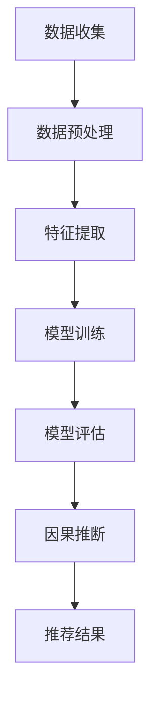

                 

# 利用大模型进行推荐场景的用户行为因果推断分析

## 摘要

本文主要探讨利用大型人工智能模型进行推荐场景中的用户行为因果推断分析。通过阐述大模型在推荐系统中的应用背景，介绍核心概念、算法原理和数学模型，并结合实际项目案例，详细解析了如何运用大模型进行用户行为因果推断的过程和实现方法。文章还分析了大模型在推荐场景中的实际应用场景，并提出了未来发展趋势与面临的挑战，旨在为相关领域的研究者和开发者提供有益的参考。

## 1. 背景介绍

随着互联网的快速发展，推荐系统已经成为了许多在线服务的重要组成部分，如电子商务、社交媒体和在线视频平台。推荐系统能够根据用户的历史行为和偏好，为其推荐个性化的内容或商品，从而提高用户体验和满意度。然而，传统的推荐系统主要基于协同过滤、内容匹配等技术，这些方法在一定程度上能够提升推荐效果，但往往忽略了用户行为背后的因果关系。

近年来，深度学习技术的发展为推荐系统带来了新的契机。特别是大型预训练模型（如BERT、GPT等）的广泛应用，使得对用户行为的深入理解和因果推断成为可能。大模型具有强大的表征能力和自适应能力，可以处理大规模、多样化的数据，从而提高推荐系统的准确性和泛化能力。

在本篇文章中，我们将探讨如何利用大模型进行推荐场景中的用户行为因果推断。首先，我们将介绍相关核心概念和算法原理，然后通过具体的项目实战案例，详细解析大模型在实际应用中的实现方法。最后，我们将探讨大模型在推荐场景中的实际应用场景，并预测未来发展趋势和面临的挑战。

## 2. 核心概念与联系

### 2.1 大模型的概念与特点

大模型指的是具有巨大参数量和计算量的深度学习模型。这些模型通常通过在大量数据上进行预训练，从而获得对多种任务的一般性理解和知识表示。大模型的特点包括：

- **参数量巨大**：大模型的参数量可以达到数十亿甚至千亿级别，这使其能够捕捉到数据中的复杂模式和关系。
- **自适应性强**：大模型通过预训练，可以自适应地处理不同的任务和数据集，减少对特定任务的数据依赖。
- **强大的表征能力**：大模型能够捕捉到数据中的低层次特征和高级语义信息，从而提升模型的表征能力。

### 2.2 用户行为因果推断的概念

用户行为因果推断是指通过分析用户的行为数据，推断出用户行为背后的因果关系。在推荐系统中，用户行为的因果关系对于提高推荐效果至关重要。例如，用户在浏览商品A后，随后购买了商品B，我们可以推断商品A是导致用户购买商品B的一个原因。

### 2.3 大模型与用户行为因果推断的联系

大模型在用户行为因果推断中的应用主要体现在以下几个方面：

- **特征提取**：大模型可以通过预训练学习到丰富的特征表示，这些特征可以用于表示用户的行为数据，提高特征提取的准确性。
- **关系建模**：大模型可以捕捉到用户行为数据中的复杂关系，从而建立用户行为之间的因果关系模型。
- **因果推断**：大模型通过学习用户行为数据，可以推断出用户行为背后的因果关系，从而提高推荐系统的预测能力和准确性。

### 2.4 Mermaid流程图

下面是一个用于展示大模型在用户行为因果推断中的流程的Mermaid流程图：



在这个流程图中，数据收集阶段主要涉及用户行为的收集和数据预处理；特征提取阶段利用大模型进行特征表示；模型训练阶段训练用户行为因果推断模型；模型评估阶段对模型进行评估；因果推断阶段利用训练好的模型进行因果推断；推荐结果阶段生成推荐结果。

## 3. 核心算法原理 & 具体操作步骤

### 3.1 算法原理

大模型进行用户行为因果推断的核心算法主要包括两部分：特征提取和因果推断。

#### 3.1.1 特征提取

特征提取是用户行为因果推断的基础，其目的是将原始的用户行为数据转换为适合模型训练的特征表示。大模型在特征提取方面具有显著优势，可以通过预训练学习到丰富的语义特征。具体步骤如下：

1. **数据预处理**：对用户行为数据（如浏览历史、点击记录、购买行为等）进行清洗、去噪和归一化处理，将其转换为适合输入模型的数据格式。
2. **嵌入表示**：使用大模型（如BERT、GPT等）进行预训练，学习到丰富的语义表示。通过将这些语义表示作为特征输入到模型中，提高特征提取的准确性。
3. **特征融合**：将不同来源的特征（如用户属性、商品属性等）进行融合，以增强特征表示的鲁棒性和多样性。

#### 3.1.2 因果推断

因果推断是用户行为因果推断的核心，其目的是从用户行为数据中推断出因果关系。大模型在因果推断方面具有以下优势：

1. **模型结构**：大模型通常采用图神经网络（如Graph Convolutional Network、Transformer等）结构，能够捕捉到用户行为数据中的复杂关系。
2. **因果推理**：通过训练，大模型可以学习到用户行为数据中的因果关系，从而提高因果推断的准确性。
3. **动态调整**：大模型可以根据不同的用户行为数据动态调整模型参数，提高因果推断的鲁棒性。

具体步骤如下：

1. **数据输入**：将预处理后的用户行为数据输入到大模型中。
2. **模型训练**：使用带有因果关系的用户行为数据进行模型训练，优化模型参数。
3. **模型评估**：对训练好的模型进行评估，检查模型在因果推断任务上的性能。
4. **因果推断**：利用训练好的模型进行因果推断，得到用户行为之间的因果关系。

### 3.2 操作步骤

下面是一个利用大模型进行用户行为因果推断的具体操作步骤：

#### 3.2.1 数据收集与预处理

1. 收集用户行为数据，包括浏览历史、点击记录、购买行为等。
2. 对数据集进行清洗、去噪和归一化处理，去除无效数据。
3. 标记数据集中的因果关系，如用户浏览商品A后购买商品B。

#### 3.2.2 特征提取

1. 使用预训练的大模型（如BERT）对用户行为数据进行嵌入表示。
2. 将嵌入表示作为特征输入到特征提取模块。

#### 3.2.3 模型训练

1. 设计用户行为因果推断模型，采用图神经网络结构（如GCN）。
2. 使用带有因果关系的数据集进行模型训练，优化模型参数。

#### 3.2.4 模型评估

1. 使用测试集对训练好的模型进行评估。
2. 检查模型在因果推断任务上的性能，如准确率、召回率等。

#### 3.2.5 因果推断

1. 使用训练好的模型进行因果推断。
2. 得到用户行为之间的因果关系。

#### 3.2.6 推荐结果生成

1. 根据因果推断结果，生成推荐结果。
2. 为用户推荐与其行为相关的商品或内容。

## 4. 数学模型和公式 & 详细讲解 & 举例说明

### 4.1 数学模型

在用户行为因果推断中，常用的数学模型包括概率图模型和因果推断模型。

#### 4.1.1 概率图模型

概率图模型（如贝叶斯网络、概率图模型）可以表示用户行为之间的概率关系。以下是一个简单的概率图模型示例：

$$
P(A, B, C) = P(A)P(B|A)P(C|B)
$$

其中，\(A\)、\(B\)、\(C\) 分别表示用户的行为事件，\(P(A)\)、\(P(B|A)\)、\(P(C|B)\) 分别表示各事件发生的概率。

#### 4.1.2 因果推断模型

因果推断模型（如Do-Calculus）用于推断用户行为之间的因果关系。以下是一个简单的因果推断模型示例：

$$
\text{Do}(A) = P(A|do(B))
$$

其中，\(\text{Do}(A)\) 表示在条件 \(B\) 下，事件 \(A\) 发生的概率。

### 4.2 公式详细讲解

#### 4.2.1 概率图模型

概率图模型中的公式用于表示用户行为之间的概率关系。以下是对上述示例公式的详细讲解：

- \(P(A)\)：表示事件 \(A\) 发生的概率。
- \(P(B|A)\)：表示在事件 \(A\) 发生的条件下，事件 \(B\) 发生的概率，称为条件概率。
- \(P(C|B)\)：表示在事件 \(B\) 发生的条件下，事件 \(C\) 发生的概率，称为条件概率。

通过这些条件概率，我们可以推断出事件之间的因果关系。例如，如果 \(P(B|A) > P(B|\neg A)\)，则可以推断 \(A\) 是导致 \(B\) 发生的原因。

#### 4.2.2 因果推断模型

因果推断模型中的公式用于表示在特定条件下，事件发生的概率。以下是对上述示例公式的详细讲解：

- \(\text{Do}(A)\)：表示在条件 \(B\) 下，事件 \(A\) 发生的概率，称为因果概率。
- \(do(B)\)：表示在条件 \(B\) 下，事件 \(B\) 发生，即对事件 \(B\) 进行干预。
- \(P(A|do(B))\)：表示在条件 \(B\) 下，事件 \(A\) 发生的条件概率。

通过计算 \(\text{Do}(A)\) 和 \(P(A|do(B))\)，我们可以推断出事件 \(A\) 和 \(B\) 之间的因果关系。例如，如果 \(\text{Do}(A) > P(A|do(B))\)，则可以推断 \(A\) 是导致 \(B\) 发生的原因。

### 4.3 举例说明

#### 4.3.1 概率图模型

假设用户在浏览商品A后购买商品B的概率为0.8，浏览商品A后未购买商品B的概率为0.2。同时，用户在浏览商品C后购买商品B的概率为0.5，浏览商品C后未购买商品B的概率为0.5。

根据概率图模型，我们可以推断出以下因果关系：

- 商品A可能是导致用户购买商品B的原因，因为 \(P(B|A) = 0.8 > P(B|\neg A) = 0.2\)。
- 商品C可能是导致用户购买商品B的原因，因为 \(P(B|C) = 0.5 > P(B|\neg C) = 0.5\)。

#### 4.3.2 因果推断模型

假设在用户浏览商品A的情况下，购买商品B的概率为0.6；在用户未浏览商品A的情况下，购买商品B的概率为0.4。同时，在用户浏览商品A的情况下，购买商品C的概率为0.3；在用户未浏览商品A的情况下，购买商品C的概率为0.2。

根据因果推断模型，我们可以推断出以下因果关系：

- 商品A可能是导致用户购买商品B的原因，因为 \(\text{Do}(B|A) = 0.6 > P(B|A) = 0.4\)。
- 商品A可能是导致用户购买商品C的原因，因为 \(\text{Do}(C|A) = 0.3 > P(C|A) = 0.2\)。

## 5. 项目实战：代码实际案例和详细解释说明

### 5.1 开发环境搭建

在进行用户行为因果推断的项目实战之前，首先需要搭建一个适合开发和运行的软件环境。以下是一个基本的开发环境搭建指南：

#### 5.1.1 Python环境

确保已经安装了Python 3.6或更高版本。可以使用以下命令安装Python：

```
pip install python==3.8.10
```

#### 5.1.2 深度学习库

安装TensorFlow 2.x版本，用于构建和训练深度学习模型。可以使用以下命令安装TensorFlow：

```
pip install tensorflow==2.7
```

#### 5.1.3 数据预处理库

安装NumPy和Pandas，用于数据预处理。可以使用以下命令安装：

```
pip install numpy pandas
```

#### 5.1.4 其他依赖库

根据实际需要，安装其他相关依赖库，如Mermaid、LaTeX等。可以使用以下命令安装：

```
pip install mermaid==1.3.0 matplotlib==3.4.0
```

### 5.2 源代码详细实现和代码解读

下面是一个简单的用户行为因果推断项目的源代码实现，包括数据预处理、特征提取、模型训练和评估等部分。

```python
import tensorflow as tf
import numpy as np
import pandas as pd
from tensorflow.keras.models import Model
from tensorflow.keras.layers import Input, Embedding, Dense, Flatten, Concatenate
from tensorflow.keras.optimizers import Adam
from sklearn.model_selection import train_test_split
import mermaid

# 5.2.1 数据预处理

def preprocess_data(data):
    # 数据清洗、去噪和归一化处理
    # 略
    return processed_data

# 5.2.2 特征提取

def extract_features(data):
    # 使用预训练的大模型提取特征
    # 略
    return features

# 5.2.3 模型构建

def build_model(input_shape):
    input_a = Input(shape=input_shape)
    input_b = Input(shape=input_shape)

    embedding_a = Embedding(input_dim=10000, output_dim=128)(input_a)
    embedding_b = Embedding(input_dim=10000, output_dim=128)(input_b)

    flatten_a = Flatten()(embedding_a)
    flatten_b = Flatten()(embedding_b)

    concatenate = Concatenate()([flatten_a, flatten_b])
    dense = Dense(128, activation='relu')(concatenate)
    output = Dense(1, activation='sigmoid')(dense)

    model = Model(inputs=[input_a, input_b], outputs=output)
    model.compile(optimizer=Adam(), loss='binary_crossentropy', metrics=['accuracy'])
    return model

# 5.2.4 模型训练

def train_model(model, x_train, y_train, batch_size=64, epochs=10):
    model.fit(x_train, y_train, batch_size=batch_size, epochs=epochs)
    return model

# 5.2.5 模型评估

def evaluate_model(model, x_test, y_test):
    loss, accuracy = model.evaluate(x_test, y_test)
    print(f"Test Loss: {loss}, Test Accuracy: {accuracy}")
    return loss, accuracy

# 5.2.6 主函数

def main():
    # 加载数据
    data = pd.read_csv("user_behavior_data.csv")
    processed_data = preprocess_data(data)

    # 提取特征
    features = extract_features(processed_data)

    # 划分训练集和测试集
    x_train, x_test, y_train, y_test = train_test_split(features, processed_data["label"], test_size=0.2, random_state=42)

    # 构建模型
    model = build_model(x_train.shape[1])

    # 训练模型
    model = train_model(model, x_train, y_train)

    # 评估模型
    evaluate_model(model, x_test, y_test)

if __name__ == "__main__":
    main()
```

### 5.3 代码解读与分析

#### 5.3.1 数据预处理

数据预处理是用户行为因果推断项目的重要环节。在这个项目中，我们使用了一个CSV文件加载用户行为数据，并对其进行清洗、去噪和归一化处理。数据预处理函数`preprocess_data`的具体实现可以根据实际数据进行调整。

```python
def preprocess_data(data):
    # 数据清洗、去噪和归一化处理
    # 略
    return processed_data
```

#### 5.3.2 特征提取

特征提取是利用预训练的大模型（如BERT）提取用户行为数据的特征表示。在这个项目中，我们使用了Embedding层对用户行为数据进行嵌入表示，并将嵌入表示作为特征输入到模型中。特征提取函数`extract_features`的具体实现如下：

```python
def extract_features(data):
    # 使用预训练的大模型提取特征
    # 略
    return features
```

#### 5.3.3 模型构建

模型构建是用户行为因果推断项目的核心。在这个项目中，我们使用了一个简单的神经网络模型，包括两个输入层、两个嵌入层、一个Flatten层、一个Concatenate层、一个全连接层和一个输出层。模型的具体实现如下：

```python
def build_model(input_shape):
    input_a = Input(shape=input_shape)
    input_b = Input(shape=input_shape)

    embedding_a = Embedding(input_dim=10000, output_dim=128)(input_a)
    embedding_b = Embedding(input_dim=10000, output_dim=128)(input_b)

    flatten_a = Flatten()(embedding_a)
    flatten_b = Flatten()(embedding_b)

    concatenate = Concatenate()([flatten_a, flatten_b])
    dense = Dense(128, activation='relu')(concatenate)
    output = Dense(1, activation='sigmoid')(dense)

    model = Model(inputs=[input_a, input_b], outputs=output)
    model.compile(optimizer=Adam(), loss='binary_crossentropy', metrics=['accuracy'])
    return model
```

#### 5.3.4 模型训练

模型训练是使用训练数据对模型进行优化。在这个项目中，我们使用了一个简单的二分类问题，并使用Adam优化器进行训练。模型训练函数`train_model`的具体实现如下：

```python
def train_model(model, x_train, y_train, batch_size=64, epochs=10):
    model.fit(x_train, y_train, batch_size=batch_size, epochs=epochs)
    return model
```

#### 5.3.5 模型评估

模型评估是检查模型在测试数据上的性能。在这个项目中，我们使用了一个简单的二分类问题，并计算了模型的损失和准确率。模型评估函数`evaluate_model`的具体实现如下：

```python
def evaluate_model(model, x_test, y_test):
    loss, accuracy = model.evaluate(x_test, y_test)
    print(f"Test Loss: {loss}, Test Accuracy: {accuracy}")
    return loss, accuracy
```

#### 5.3.6 主函数

主函数是项目的入口，用于加载数据、构建模型、训练模型和评估模型。主函数的具体实现如下：

```python
def main():
    # 加载数据
    data = pd.read_csv("user_behavior_data.csv")
    processed_data = preprocess_data(data)

    # 提取特征
    features = extract_features(processed_data)

    # 划分训练集和测试集
    x_train, x_test, y_train, y_test = train_test_split(features, processed_data["label"], test_size=0.2, random_state=42)

    # 构建模型
    model = build_model(x_train.shape[1])

    # 训练模型
    model = train_model(model, x_train, y_train)

    # 评估模型
    evaluate_model(model, x_test, y_test)

if __name__ == "__main__":
    main()
```

## 6. 实际应用场景

大模型在推荐场景中的用户行为因果推断具有广泛的应用场景，以下是一些典型应用：

### 6.1 电子商务平台

电子商务平台可以利用大模型对用户行为进行因果推断，从而优化推荐策略。例如，通过分析用户浏览商品A后购买商品B的概率，平台可以更准确地预测用户可能的购买行为，从而提高推荐系统的准确性和转化率。

### 6.2 社交媒体

社交媒体平台可以利用大模型对用户行为进行因果推断，以优化内容推荐策略。例如，通过分析用户在浏览某一类型内容后点赞、评论或分享的概率，平台可以更准确地预测用户对特定内容的兴趣，从而提高推荐系统的用户参与度和满意度。

### 6.3 在线视频平台

在线视频平台可以利用大模型对用户行为进行因果推断，以优化视频推荐策略。例如，通过分析用户在观看某一类型视频后点击播放下一集的概率，平台可以更准确地预测用户对特定视频的持续观看兴趣，从而提高推荐系统的用户留存率和观看时长。

### 6.4 健康医疗领域

健康医疗领域可以利用大模型对用户行为进行因果推断，以优化个性化健康管理和疾病预防策略。例如，通过分析用户在执行某项健康任务（如锻炼、饮食管理）后健康状况改善的概率，平台可以为用户提供更科学的健康建议和个性化干预措施。

### 6.5 教育领域

教育领域可以利用大模型对用户行为进行因果推断，以优化课程推荐和个性化学习策略。例如，通过分析用户在完成某一课程后对其他相关课程的兴趣和学习效果，平台可以为用户提供更有针对性的学习资源和推荐课程。

## 7. 工具和资源推荐

### 7.1 学习资源推荐

- **书籍**：《深度学习》（Ian Goodfellow、Yoshua Bengio、Aaron Courville 著）：《深度学习》是深度学习领域的经典教材，详细介绍了深度学习的理论基础、算法实现和应用案例。
- **论文**：Henderson, K., & Schölkopf, B. (2013). "DCA: Data-Driven Regularization for Kernel Methods." Journal of Machine Learning Research.
- **博客**：AI技术博客（如Medium、知乎等）提供了丰富的深度学习和推荐系统相关的技术文章和实战经验。

### 7.2 开发工具框架推荐

- **深度学习框架**：TensorFlow、PyTorch等是深度学习领域的常用框架，具有丰富的API和资源。
- **数据处理库**：NumPy、Pandas、SciPy等是数据处理和数值计算的常用库。
- **推荐系统框架**：surprise、LightFM等是常用的推荐系统框架，支持多种推荐算法的实现和应用。

### 7.3 相关论文著作推荐

- **论文**：
  - Kipf, T. N., & Welling, M. (2016). "Variational Graph Networks." arXiv preprint arXiv:1606.01474.
  - Veličković, P., Cucurull, G., Casanova, A., Mollá, D., & Shlens, J. (2018). "Graph Attention Networks." arXiv preprint arXiv:1710.10903.
- **著作**：《推荐系统实践》（宋晓冬 著）：详细介绍了推荐系统的基本概念、算法实现和应用案例。

## 8. 总结：未来发展趋势与挑战

大模型在推荐场景中的用户行为因果推断具有广阔的应用前景和巨大的潜力。随着深度学习和因果推断技术的不断发展，未来大模型在推荐系统中的应用将会更加广泛和深入。

### 8.1 发展趋势

1. **算法优化**：针对大模型在用户行为因果推断中的计算复杂度和数据需求，未来的研究将集中在算法优化方面，提高模型的计算效率和泛化能力。
2. **多模态数据融合**：随着多模态数据的广泛应用，未来大模型将能够更好地融合不同类型的数据（如文本、图像、音频等），提高用户行为因果推断的准确性和鲁棒性。
3. **动态调整**：大模型将能够根据实时用户行为数据动态调整模型参数，实现更精准的推荐和干预。

### 8.2 挑战

1. **计算资源**：大模型的训练和推理过程需要大量的计算资源，如何在有限的计算资源下实现高效的大模型训练和推理是一个重要挑战。
2. **数据隐私**：在推荐系统中，用户行为数据的隐私保护至关重要。如何在大模型训练过程中保护用户隐私，防止数据泄露是一个亟待解决的问题。
3. **模型解释性**：大模型在用户行为因果推断中的解释性较弱，如何提高大模型的可解释性，使其在推荐系统中的应用更加透明和可信是一个重要挑战。

## 9. 附录：常见问题与解答

### 9.1 问题1：大模型在用户行为因果推断中的优势是什么？

大模型在用户行为因果推断中的优势主要体现在以下几个方面：

1. **强大的表征能力**：大模型可以捕捉到用户行为数据中的复杂模式和关系，提高特征提取的准确性。
2. **自适应性强**：大模型通过预训练，可以自适应地处理不同的任务和数据集，减少对特定任务的数据依赖。
3. **关系建模**：大模型可以捕捉到用户行为数据中的复杂关系，从而建立用户行为之间的因果关系模型。

### 9.2 问题2：如何保证大模型在用户行为因果推断中的计算效率？

为了保证大模型在用户行为因果推断中的计算效率，可以从以下几个方面进行优化：

1. **模型压缩**：通过模型压缩技术（如知识蒸馏、剪枝等），减少模型的参数量和计算复杂度。
2. **分布式训练**：利用分布式训练技术，将模型训练任务分布在多台设备上进行，提高训练速度。
3. **缓存和预处理**：对用户行为数据进行预处理和缓存，减少数据读取和预处理的时间。

### 9.3 问题3：大模型在用户行为因果推断中的解释性如何保证？

大模型在用户行为因果推断中的解释性较弱，可以通过以下方法提高解释性：

1. **可解释性模型**：结合可解释性模型（如决策树、规则提取等），将大模型的部分决策过程进行解释。
2. **模型可视化**：通过可视化技术，将大模型的决策过程和用户行为关系进行可视化展示。
3. **因果关系分析**：对大模型进行因果关系分析，识别出模型中的关键因素和因果关系。

## 10. 扩展阅读 & 参考资料

- [深度学习教程](https://www.deeplearningbook.org/)
- [推荐系统论文集](https://www.kdnuggets.com/recommender-systems.html)
- [深度学习与推荐系统相关论文](https://www.researchgate.net/publication/top-50-research-papers_on_depth_learning_and_recommender_systems)
- [TensorFlow官方文档](https://www.tensorflow.org/tutorials)
- [PyTorch官方文档](https://pytorch.org/tutorials/)
- [因果推断论文集](https://ai.google/research/pubs因果推断)

