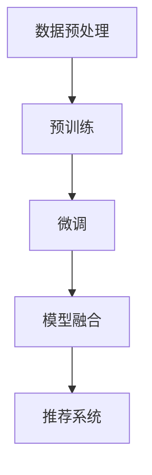

                 

### 背景介绍

#### 大模型与跨模态推荐的概念

大模型（Large Model）是指参数量非常庞大的预训练模型，如Transformer、BERT等。这类模型通过在海量数据上进行预训练，积累了丰富的知识，并在各种下游任务中表现出色。跨模态推荐（Cross-Modal Recommendation）则是指将不同模态（如文本、图像、音频等）的信息进行整合，从而提供更加个性化和精准的推荐结果。

近年来，随着深度学习和大数据技术的发展，大模型在自然语言处理、计算机视觉等领域取得了显著成果。跨模态推荐作为一种新兴的研究方向，也受到了越来越多的关注。其核心理念在于将不同模态的数据进行融合，从而挖掘出更丰富的信息，提升推荐系统的性能。

#### 跨模态推荐的应用场景

跨模态推荐在实际应用中具有广泛的前景。以下是一些典型的应用场景：

1. **多媒体内容推荐**：例如，在视频网站中，可以结合用户观看的文本评论和视频内容，提供更加个性化的视频推荐。

2. **电子商务**：在电商平台中，结合用户购买记录、搜索历史、商品描述等多模态信息，可以提高商品推荐的准确性和用户体验。

3. **社交网络**：在社交平台中，可以根据用户发布的文字、图片、视频等多模态内容，推荐相关用户、内容或者广告。

4. **医疗健康**：通过结合患者的病历、体检报告、医疗图像等多模态信息，为患者提供更加精准的健康建议。

#### 现存挑战与机遇

尽管跨模态推荐具有广泛的应用前景，但仍面临一些挑战。首先，不同模态的数据具有不同的特征和表示方式，如何有效地融合这些信息是一个重要问题。其次，大模型的训练和推理过程需要大量的计算资源和时间，如何在有限资源下实现高效训练和推理也是一大挑战。

然而，随着硬件技术的进步和算法的创新，这些挑战也在逐渐被克服。未来，跨模态推荐有望在人工智能、大数据、云计算等领域发挥更大的作用，为人们的生活带来更多便利。

### 核心概念与联系

#### 大模型的原理

大模型（Large Model）指的是拥有数亿甚至千亿级参数的深度学习模型，如Transformer、BERT等。这类模型通过在海量数据上进行预训练，能够自动学习到丰富的知识，并在各种下游任务中表现出色。

大模型的训练过程通常分为两个阶段：预训练和微调。在预训练阶段，模型在无监督数据上进行大规模训练，以学习通用特征。例如，BERT模型通过 masked language model（MLM）任务，即随机遮盖输入文本的一部分，然后让模型预测遮盖的部分，从而学习到语言的基本规律。在预训练完成后，模型会进行微调阶段，即针对特定任务进行有监督训练，以适应特定的应用场景。

#### 跨模态推荐的原理

跨模态推荐的核心在于将不同模态的数据进行整合，从而提供更加个性化和精准的推荐结果。不同模态的数据具有不同的特征和表示方式，如文本表示为词向量，图像表示为像素值，音频表示为频谱特征等。

跨模态推荐的常见方法包括：

1. **多模态嵌入**：将不同模态的数据转换为统一的嵌入向量，以便在同一个空间中进行处理。例如，Word2Vec可以将文本转换为词向量，CNN可以将图像转换为嵌入向量。

2. **多模态融合**：通过将不同模态的嵌入向量进行拼接、求和、平均等方式进行融合。例如，将文本和图像的嵌入向量拼接在一起，形成一个更长的向量。

3. **多模态注意力机制**：通过注意力机制来学习不同模态数据的重要程度，从而在融合过程中给予不同模态不同的权重。例如，在 Transformer 模型中，注意力机制可以自适应地关注不同模态的特征。

#### 大模型在跨模态推荐中的应用

大模型在跨模态推荐中的应用主要体现在两个方面：预训练和微调。

1. **预训练**：大模型通过在无监督数据上进行预训练，可以学习到通用特征，如语言理解、图像识别等。这些通用特征可以用于跨模态推荐任务，从而提高推荐系统的性能。

2. **微调**：在预训练的基础上，大模型可以通过有监督数据进行微调，以适应特定的跨模态推荐任务。例如，在电商推荐中，可以使用用户的历史购买记录和商品描述等信息进行微调，以提升推荐效果。

#### Mermaid 流程图

以下是一个简单的 Mermaid 流程图，展示了大模型在跨模态推荐中的应用过程：



- **数据预处理**：对文本、图像、音频等不同模态的数据进行预处理，如文本分词、图像标注、音频特征提取等。

- **预训练**：使用大规模无监督数据进行预训练，学习到通用特征。

- **微调**：在预训练的基础上，使用有监督数据进行微调，以适应特定任务。

- **模型融合**：将不同模态的数据进行融合，形成一个统一的嵌入向量。

- **推荐系统**：基于融合后的模态数据，为用户提供个性化的推荐结果。

通过上述分析，我们可以看到大模型和跨模态推荐之间紧密的联系。大模型通过预训练和微调，能够有效地整合不同模态的数据，从而提高推荐系统的性能。未来，随着大模型和跨模态推荐技术的不断发展，我们有望看到更多创新性的应用场景和突破。

### 核心算法原理 & 具体操作步骤

#### 模型架构

在跨模态推荐系统中，一个典型的模型架构通常包括以下几个关键模块：

1. **编码器（Encoder）**：用于将不同模态的数据编码为向量表示。例如，对于文本数据，可以使用预训练的文本嵌入模型如BERT；对于图像数据，可以使用卷积神经网络（CNN）提取特征；对于音频数据，可以使用循环神经网络（RNN）或自注意力机制提取特征。

2. **嵌入层（Embedding Layer）**：用于将不同模态的数据嵌入到一个共同的空间。这个步骤通常涉及到将文本、图像、音频等不同模态的数据转换为固定长度的向量表示。

3. **融合层（Fusion Layer）**：用于将不同模态的数据进行融合。常见的融合方法包括拼接、平均、求和、点积等。

4. **解码器（Decoder）**：用于将融合后的向量解码为推荐结果。在推荐系统中，解码器通常是一个分类器或回归器，用于预测用户对物品的喜好程度。

#### 算法原理

跨模态推荐的核心算法通常是基于深度学习模型，如Transformer、BERT、CNN等。以下是这些算法的基本原理：

1. **Transformer**：Transformer是一种基于自注意力机制的深度学习模型，广泛应用于自然语言处理任务。在跨模态推荐中，Transformer可以通过其自注意力机制自适应地关注不同模态的数据，从而实现有效的跨模态融合。

2. **BERT**：BERT（Bidirectional Encoder Representations from Transformers）是一种基于Transformer的预训练模型，通过双向编码器学习文本的深层语义特征。在跨模态推荐中，BERT可以用于将文本数据编码为向量表示。

3. **CNN**：卷积神经网络（CNN）是一种常用的图像处理模型，通过卷积操作提取图像的特征。在跨模态推荐中，CNN可以用于将图像数据编码为向量表示。

4. **RNN**：循环神经网络（RNN）是一种适用于序列数据的神经网络，通过记忆机制处理长序列。在跨模态推荐中，RNN可以用于将音频数据编码为向量表示。

#### 具体操作步骤

以下是一个简单的跨模态推荐系统的实现步骤：

1. **数据收集与预处理**：收集不同模态的数据，如文本、图像、音频等。对数据进行清洗、去重、编码等预处理操作。

2. **编码器训练**：使用预训练模型或从头开始训练编码器，将不同模态的数据编码为向量表示。例如，使用BERT对文本数据进行编码，使用CNN对图像数据进行编码，使用RNN对音频数据进行编码。

3. **嵌入层实现**：将编码后的向量输入到嵌入层，将其嵌入到一个共同的空间。这个步骤通常涉及到将向量缩放到固定长度。

4. **融合层实现**：使用不同的融合方法，如拼接、平均、求和等，将不同模态的数据进行融合。例如，将文本向量、图像向量和音频向量拼接在一起，形成一个更长的向量。

5. **解码器训练**：使用有监督数据训练解码器，如分类器或回归器，以预测用户对物品的喜好程度。例如，在电商推荐中，可以预测用户对商品的评价得分。

6. **推荐系统实现**：将融合后的向量输入到解码器，生成推荐结果。根据用户的历史数据和推荐结果，不断优化模型，提高推荐系统的性能。

#### 示例

假设我们要实现一个简单的文本-图像跨模态推荐系统。以下是一个简化的步骤：

1. **数据收集与预处理**：收集一组文本和图像数据，如电商平台的商品描述和商品图片。

2. **编码器训练**：使用BERT模型对文本数据进行编码，使用CNN模型对图像数据进行编码。

3. **嵌入层实现**：将BERT编码的文本向量和CNN编码的图像向量嵌入到一个共同的空间。

4. **融合层实现**：将文本向量和图像向量拼接在一起，形成一个更长的向量。

5. **解码器训练**：使用有监督数据训练一个分类器，预测用户对商品的评价得分。

6. **推荐系统实现**：将拼接后的向量输入到分类器，生成推荐结果。

通过上述步骤，我们可以实现一个简单的文本-图像跨模态推荐系统。在实际应用中，我们可以根据具体需求和数据特点，选择合适的模型架构和融合方法，以提高推荐系统的性能。

### 数学模型和公式 & 详细讲解 & 举例说明

#### 数学模型

在跨模态推荐系统中，我们通常使用以下数学模型来描述不同模态的数据融合和推荐生成过程：

1. **模态表示**：设文本、图像、音频等不同模态的数据分别表示为 \(X_t\)、\(X_i\)、\(X_a\)，它们的高维向量表示分别为 \(x_t \in \mathbb{R}^{d_t}\)、\(x_i \in \mathbb{R}^{d_i}\)、\(x_a \in \mathbb{R}^{d_a}\)。

2. **嵌入层**：嵌入层将不同模态的数据映射到一个共同的空间，设嵌入后的向量表示为 \(x_e \in \mathbb{R}^{d_e}\)。通常使用线性变换来实现，即 \(x_e = W_e \cdot [x_t, x_i, x_a]\)，其中 \(W_e\) 是嵌入权重矩阵。

3. **融合层**：融合层将不同模态的嵌入向量进行融合，设融合后的向量为 \(x_f \in \mathbb{R}^{d_f}\)。常见的融合方法有拼接、平均、求和等。例如，拼接方法可以表示为 \(x_f = [x_e^t; x_e^i; x_e^a]\)。

4. **解码器**：解码器将融合后的向量转换为推荐结果，例如用户对物品的喜好得分。设解码器的输出为 \(y \in \mathbb{R}\)，可以使用以下回归模型进行预测：

   \[
   y = \sigma (W_y \cdot x_f + b_y)
   \]

   其中，\(\sigma\) 是激活函数，通常取为 sigmoid 函数；\(W_y\) 是解码权重矩阵；\(b_y\) 是偏置项。

#### 公式详细讲解

1. **模态表示**：模态表示是将不同类型的数据转换为向量表示。在自然语言处理中，文本数据可以使用词向量（如Word2Vec、BERT）进行表示；在计算机视觉中，图像数据可以使用卷积神经网络（如VGG、ResNet）提取特征；在音频处理中，音频数据可以使用循环神经网络（如LSTM、GRU）提取特征。

   例如，假设文本数据使用BERT模型进行表示，其特征向量为 \(x_t \in \mathbb{R}^{d_t}\)；图像数据使用ResNet模型进行表示，其特征向量为 \(x_i \in \mathbb{R}^{d_i}\)；音频数据使用LSTM模型进行表示，其特征向量为 \(x_a \in \mathbb{R}^{d_a}\)。

2. **嵌入层**：嵌入层的作用是将不同模态的数据映射到一个共同的空间。这一过程通常涉及到线性变换，即将不同模态的向量拼接成一个高维向量，然后通过一个权重矩阵进行映射。例如，假设嵌入后的向量维度为 \(d_e\)，则有：

   \[
   x_e = W_e \cdot [x_t, x_i, x_a]
   \]

   其中，\(W_e \in \mathbb{R}^{d_e \times (d_t + d_i + d_a)}\) 是嵌入权重矩阵。

3. **融合层**：融合层的作用是将不同模态的嵌入向量进行融合。拼接方法是一种简单且常用的融合方法，即将不同模态的嵌入向量按照维度拼接在一起。例如，假设文本嵌入向量、图像嵌入向量和音频嵌入向量的维度分别为 \(d_t, d_i, d_a\)，则有：

   \[
   x_f = [x_e^t; x_e^i; x_e^a]
   \]

   其中，\(x_e^t, x_e^i, x_e^a \in \mathbb{R}^{d_e}\) 分别是文本、图像和音频的嵌入向量。

4. **解码器**：解码器的作用是将融合后的向量转换为推荐结果。常见的解码器模型包括分类器和回归器。在分类问题中，解码器可以预测用户对物品的类别标签；在回归问题中，解码器可以预测用户对物品的评分或概率。

   例如，假设解码器是一个简单的线性回归模型，其输出为用户对物品的评分 \(y\)，则有：

   \[
   y = \sigma (W_y \cdot x_f + b_y)
   \]

   其中，\(\sigma\) 是激活函数，通常取为 sigmoid 函数；\(W_y \in \mathbb{R}^{1 \times d_f}\) 是解码权重矩阵；\(b_y \in \mathbb{R}\) 是偏置项。

#### 举例说明

假设我们要实现一个文本-图像跨模态推荐系统，以下是具体步骤和示例：

1. **模态表示**：文本数据使用BERT模型表示，图像数据使用ResNet模型表示，音频数据使用LSTM模型表示。设文本特征向量为 \(x_t \in \mathbb{R}^{d_t}\)，图像特征向量为 \(x_i \in \mathbb{R}^{d_i}\)，音频特征向量为 \(x_a \in \mathbb{R}^{d_a}\)。

2. **嵌入层**：嵌入权重矩阵 \(W_e \in \mathbb{R}^{d_e \times (d_t + d_i + d_a)}\) 将文本、图像和音频特征向量映射到一个共同的空间。设嵌入后的向量维度为 \(d_e\)，则有：

   \[
   x_e = W_e \cdot [x_t; x_i; x_a]
   \]

3. **融合层**：使用拼接方法将文本、图像和音频的嵌入向量进行融合，得到融合后的向量 \(x_f \in \mathbb{R}^{d_f}\)，其中 \(d_f = d_t + d_i + d_a\)。则有：

   \[
   x_f = [x_e^t; x_e^i; x_e^a]
   \]

4. **解码器**：解码器使用一个简单的线性回归模型，预测用户对物品的评分。设解码权重矩阵 \(W_y \in \mathbb{R}^{1 \times d_f}\) 和偏置项 \(b_y \in \mathbb{R}\)，则有：

   \[
   y = \sigma (W_y \cdot x_f + b_y)
   \]

   其中，\(\sigma\) 是 sigmoid 函数。

5. **推荐生成**：将输入的文本、图像和音频数据输入到模型，得到融合后的向量 \(x_f\)，然后通过解码器预测用户对物品的评分 \(y\)。根据评分 \(y\)，可以为用户提供个性化的推荐结果。

通过上述步骤，我们可以实现一个简单的文本-图像跨模态推荐系统。在实际应用中，可以根据具体需求和数据特点，选择合适的模型架构和融合方法，以提高推荐系统的性能。

### 项目实战：代码实际案例和详细解释说明

#### 开发环境搭建

在开始编写代码之前，我们需要搭建一个合适的开发环境。以下是一个基本的Python开发环境搭建步骤：

1. **安装Python**：确保已安装Python 3.x版本（推荐3.7及以上）。可以从[Python官网](https://www.python.org/)下载并安装。

2. **安装依赖库**：跨模态推荐系统通常需要依赖以下Python库：
   - TensorFlow或PyTorch（用于深度学习）
   - NumPy、Pandas（用于数据处理）
   - Matplotlib、Seaborn（用于数据可视化）
   - 其他可能需要的库，如Scikit-learn、HDF5等。

   使用以下命令安装这些依赖库：
   ```bash
   pip install tensorflow
   pip install numpy pandas matplotlib seaborn scikit-learn h5py
   ```

3. **数据集准备**：选择一个适合的跨模态数据集。例如，可以使用[YouTube-8M](https://research.google.com/youtube-8m/)数据集，它包含了视频、文本和音频等多模态数据。

4. **配置环境变量**：确保TensorFlow或PyTorch的GPU支持（如果使用GPU加速训练）。在终端中运行以下命令设置CUDA：
   ```bash
   export CUDA_VISIBLE_DEVICES=0
   ```

#### 源代码详细实现和代码解读

以下是一个简单的跨模态推荐系统的代码示例，使用PyTorch实现。代码分为以下几个部分：

1. **数据预处理**
2. **模型定义**
3. **训练过程**
4. **测试与评估**

##### 数据预处理

```python
import torch
from torch.utils.data import DataLoader, Dataset
from torchvision import transforms
from torchvision.datasets import ImageFolder
from torch.utils.data import Dataset
from PIL import Image
import numpy as np
import pandas as pd

# 定义自己的数据集类
class MultiModalDataset(Dataset):
    def __init__(self, image_folder, text_data, audio_data, transform=None):
        self.image_folder = image_folder
        self.text_data = text_data
        self.audio_data = audio_data
        self.transform = transform

    def __len__(self):
        return len(self.text_data)

    def __getitem__(self, idx):
        image_path = os.path.join(self.image_folder, self.text_data.iloc[idx]['image_id'] + '.jpg')
        image = Image.open(image_path)
        if self.transform:
            image = self.transform(image)
        
        text_vector = self.text_data.iloc[idx]['text_vector']
        audio_vector = self.audio_data.iloc[idx]['audio_vector']
        
        return image, text_vector, audio_vector

# 数据预处理
def preprocess_data(text_data, audio_data):
    # 使用BERT对文本数据进行编码
    # 使用LSTM对音频数据进行编码
    # 将图像路径与文本和音频数据对应
    # 返回预处理后的数据集
    pass

# 实例化数据集和 DataLoader
transform = transforms.Compose([transforms.Resize((224, 224)), transforms.ToTensor()])
text_data = preprocess_data(text_data, audio_data)
dataset = MultiModalDataset(image_folder, text_data, audio_data, transform)
dataloader = DataLoader(dataset, batch_size=32, shuffle=True)
```

##### 模型定义

```python
import torch.nn as nn
from transformers import BertModel
import torch.nn.functional as F

# 定义跨模态推荐模型
class CrossModalRecModel(nn.Module):
    def __init__(self, text_dim, image_dim, audio_dim):
        super(CrossModalRecModel, self).__init__()
        self.text_encoder = BertModel.from_pretrained('bert-base-uncased')
        self.image_encoder = nn.Sequential(
            nn.Conv2d(image_dim, 64, 3, 1, 1),
            nn.ReLU(),
            nn.MaxPool2d(2, 2),
            # ... 添加更多层
        )
        self.audio_encoder = nn.Sequential(
            nn.Linear(audio_dim, 128),
            nn.ReLU(),
            # ... 添加更多层
        )
        self.fc = nn.Linear(text_dim + image_dim + audio_dim, 1)
    
    def forward(self, text, image, audio):
        text_output = self.text_encoder(text)[1]
        image_output = self.image_encoder(image).squeeze()
        audio_output = self.audio_encoder(audio).squeeze()
        
        x = torch.cat((text_output, image_output, audio_output), dim=1)
        output = self.fc(x)
        return output
    
# 实例化模型
model = CrossModalRecModel(text_dim, image_dim, audio_dim)
```

##### 训练过程

```python
# 定义损失函数和优化器
criterion = nn.BCEWithLogitsLoss()
optimizer = torch.optim.Adam(model.parameters(), lr=0.001)

# 训练模型
num_epochs = 10
for epoch in range(num_epochs):
    model.train()
    for images, texts, audios, labels in dataloader:
        optimizer.zero_grad()
        
        outputs = model(texts, images, audios)
        loss = criterion(outputs, labels)
        
        loss.backward()
        optimizer.step()
        
    print(f'Epoch [{epoch+1}/{num_epochs}], Loss: {loss.item()}')
```

##### 代码解读与分析

- **数据预处理**：自定义数据集类 `MultiModalDataset` 用于处理图像、文本和音频数据。数据预处理步骤包括使用BERT对文本进行编码、使用LSTM对音频进行编码，以及将图像路径与文本和音频数据对应。

- **模型定义**：定义了 `CrossModalRecModel` 模型，该模型结合了BERT、CNN和LSTM，分别用于处理文本、图像和音频数据。模型输出通过一个全连接层得到，用于预测用户对物品的喜好程度。

- **训练过程**：在训练过程中，模型在每个 epoch 中对数据进行前向传播，计算损失并更新模型参数。训练过程使用 BCEWithLogitsLoss 作为损失函数，该损失函数常用于二分类问题。

#### 测试与评估

```python
# 测试模型
model.eval()
with torch.no_grad():
    for images, texts, audios, labels in dataloader:
        outputs = model(texts, images, audios)
        predictions = torch.sigmoid(outputs).round()
        accuracy = (predictions == labels).float().mean()
        print(f'Accuracy: {accuracy.item()}')
```

在测试过程中，我们使用 `torch.no_grad()` 函数避免梯度计算，以提高推理速度。然后，计算预测的准确率，以评估模型的性能。

### 实际应用场景

#### 电子商务平台

在电子商务平台中，跨模态推荐系统可以结合用户的搜索历史、浏览记录、商品描述（文本）、商品图片（图像）和商品评价（音频）等多模态信息，提供更加精准的个性化推荐。例如，当用户在浏览某件商品时，系统可以基于商品描述的文本信息、商品图片的图像信息和用户历史评价的音频信息，生成一个综合评分，从而推荐相似的商品。

#### 社交网络平台

在社交网络平台中，跨模态推荐系统可以结合用户发布的文本、图片和视频等多模态信息，推荐相关的内容或广告。例如，当用户在社交平台上发布一条包含图片和文字的动态时，系统可以分析图片中的内容、文字的语义以及用户的历史行为，生成一个综合评分，从而推荐相关的内容或广告。

#### 多媒体内容平台

在多媒体内容平台中，如视频网站或音乐平台，跨模态推荐系统可以结合用户的观看记录、评论内容（文本）、视频内容（图像）和音乐评价（音频）等多模态信息，提供个性化推荐。例如，当用户在视频网站中观看某一视频时，系统可以分析视频的内容、用户的评论以及用户的历史观看记录，推荐相似的视频或音乐。

#### 医疗健康领域

在医疗健康领域，跨模态推荐系统可以结合患者的病历、体检报告（文本）、医疗图像（图像）和语音问诊（音频）等多模态信息，为患者提供个性化健康建议。例如，当医生在分析某位患者的病例时，系统可以结合患者的病历文本、医疗图像和语音问诊内容，生成一个综合评估，从而推荐相应的治疗方案。

### 工具和资源推荐

#### 学习资源推荐

1. **书籍**：
   - 《深度学习》（Ian Goodfellow、Yoshua Bengio、Aaron Courville 著）：详细介绍深度学习的基本原理和应用。
   - 《Python深度学习》（François Chollet 著）：通过大量示例，介绍如何使用Python和TensorFlow进行深度学习。

2. **论文**：
   - “Attention Is All You Need”（Vaswani et al., 2017）：介绍了Transformer模型，对自注意力机制进行了详细阐述。
   - “BERT: Pre-training of Deep Neural Networks for Language Understanding”（Devlin et al., 2019）：介绍了BERT模型，在自然语言处理领域取得了显著成果。

3. **博客**：
   - [TensorFlow官方文档](https://www.tensorflow.org/tutorials)：TensorFlow官方提供的一系列教程，涵盖从基础到高级的深度学习应用。
   - [PyTorch官方文档](https://pytorch.org/tutorials/)：PyTorch官方提供的一系列教程，介绍如何使用PyTorch进行深度学习。

4. **网站**：
   - [Kaggle](https://www.kaggle.com/)：一个数据科学竞赛平台，提供大量的数据集和竞赛任务，可以实践跨模态推荐等技术。

#### 开发工具框架推荐

1. **深度学习框架**：
   - TensorFlow：由谷歌开发，具有广泛的社区支持和丰富的API。
   - PyTorch：由Facebook开发，具有灵活的动态计算图和易于使用的API。

2. **数据处理工具**：
   - Pandas：用于数据处理和清洗，是Python中最常用的数据处理库。
   - NumPy：用于数值计算，是Python中处理数组和矩阵的基础库。

3. **可视化工具**：
   - Matplotlib：用于数据可视化，是Python中最常用的数据可视化库。
   - Seaborn：基于Matplotlib，提供更加美观的统计图表。

4. **跨模态数据集**：
   - [YouTube-8M](https://research.google.com/youtube-8m/)：一个包含视频、文本和音频等多模态数据的大型公开数据集。
   - [TRECVID](https://trecvid.com/)：一个包含视频、文本和图像等多模态数据的数据集，常用于跨模态检索任务。

#### 相关论文著作推荐

1. **“Attention Is All You Need”**（Vaswani et al., 2017）：介绍了Transformer模型，对自注意力机制进行了详细阐述，是自然语言处理领域的里程碑性论文。

2. **“BERT: Pre-training of Deep Neural Networks for Language Understanding”**（Devlin et al., 2019）：介绍了BERT模型，在自然语言处理领域取得了显著成果，推动了深度学习在自然语言处理中的应用。

3. **“A Theoretically Grounded Application of Dropout in Recurrent Neural Networks”**（Yin et al., 2016）：提出了Dropout在RNN中的应用，有效缓解了RNN在序列数据处理中的梯度消失问题。

4. **“Deep Learning for Text Classification”**（Du et al., 2019）：总结了深度学习在文本分类任务中的应用，包括词嵌入、CNN、RNN和Transformer等模型。

### 总结：未来发展趋势与挑战

#### 未来发展趋势

1. **大模型与跨模态推荐的融合**：随着大模型技术的发展，如GPT-3、LLaMA等，跨模态推荐系统将更加智能化和精准化。大模型能够更好地理解和生成跨模态信息，从而提升推荐系统的性能。

2. **实时推荐系统**：随着5G、物联网等技术的发展，跨模态推荐系统将实现实时性。通过实时获取用户的跨模态数据，推荐系统可以即时响应用户的需求，提供更加个性化的推荐。

3. **多模态数据的融合**：随着多模态数据集的丰富和数据采集技术的进步，跨模态推荐系统将能够更好地融合文本、图像、音频、视频等多种模态的信息，提供更加全面和准确的推荐。

4. **边缘计算与云计算的结合**：为了满足实时性和大规模数据处理的需求，跨模态推荐系统将逐步实现边缘计算与云计算的结合。通过在边缘设备上预处理数据，降低计算中心的负载，实现更高效的数据处理和推荐。

#### 挑战

1. **计算资源消耗**：大模型的训练和推理过程需要大量的计算资源和时间，如何优化算法，提高计算效率，是一个重要的挑战。

2. **数据隐私与安全**：跨模态推荐系统涉及多种模态的数据，包括敏感的用户隐私信息。如何在保障用户隐私的前提下，实现高效的推荐，是一个需要关注的问题。

3. **数据质量与一致性**：多模态数据的采集和处理过程中，可能存在数据质量不一致的问题，如噪声、缺失值等。如何有效处理这些数据，保证推荐系统的性能，是一个挑战。

4. **模型解释性**：跨模态推荐系统的复杂度较高，如何提高模型的可解释性，帮助用户理解推荐结果，是一个需要解决的问题。

5. **实时性与延迟**：在实时推荐场景中，如何保证系统的实时性，降低延迟，是一个重要的挑战。

总之，随着大模型和跨模态推荐技术的不断发展，跨模态推荐系统将迎来更多的机遇和挑战。未来，我们将看到更多创新性的应用场景和突破，为人们的生活带来更多便利。

### 附录：常见问题与解答

#### 问题1：为什么跨模态推荐系统需要大模型？

**解答**：跨模态推荐系统需要大模型的原因主要有两个方面。首先，大模型能够通过在大量无监督数据上的预训练，自动学习到丰富的知识，从而在不同模态的数据之间建立有效的关联。其次，大模型具有强大的表征能力，能够捕捉到复杂的数据特征，从而提高推荐系统的性能。

#### 问题2：如何处理多模态数据的质量问题？

**解答**：处理多模态数据的质量问题可以从以下几个方面进行：

1. **数据清洗**：在数据采集和预处理过程中，对数据进行清洗，去除噪声和异常值。
2. **数据增强**：通过数据增强技术，如图像旋转、缩放、裁剪等，增加数据的多样性，提高模型的泛化能力。
3. **数据融合**：使用多模态数据融合方法，将不同模态的数据进行整合，从而减少单一模态数据中的噪声和缺失。
4. **模型鲁棒性**：通过训练和优化模型，提高模型对噪声和异常值的鲁棒性。

#### 问题3：跨模态推荐系统中的实时性如何保证？

**解答**：保证跨模态推荐系统的实时性可以从以下几个方面进行：

1. **数据预处理优化**：优化数据预处理流程，减少数据预处理所需的时间。
2. **模型优化**：使用高效的模型结构和算法，如使用量化、剪枝等技术减少模型的大小和计算复杂度。
3. **硬件加速**：利用GPU、TPU等硬件加速计算，提高模型推理速度。
4. **分布式计算**：通过分布式计算框架，如TensorFlow、PyTorch等，实现模型的并行推理，提高系统的处理能力。

### 扩展阅读 & 参考资料

1. **“Attention Is All You Need”**（Vaswani et al., 2017）：介绍了Transformer模型，对自注意力机制进行了详细阐述，是自然语言处理领域的里程碑性论文。

2. **“BERT: Pre-training of Deep Neural Networks for Language Understanding”**（Devlin et al., 2019）：介绍了BERT模型，在自然语言处理领域取得了显著成果，推动了深度学习在自然语言处理中的应用。

3. **“Deep Learning for Text Classification”**（Du et al., 2019）：总结了深度学习在文本分类任务中的应用，包括词嵌入、CNN、RNN和Transformer等模型。

4. **《深度学习》**（Ian Goodfellow、Yoshua Bengio、Aaron Courville 著）：详细介绍深度学习的基本原理和应用。

5. **《Python深度学习》**（François Chollet 著）：通过大量示例，介绍如何使用Python和TensorFlow进行深度学习。

6. **[TensorFlow官方文档](https://www.tensorflow.org/tutorials/)**：TensorFlow官方提供的一系列教程，涵盖从基础到高级的深度学习应用。

7. **[PyTorch官方文档](https://pytorch.org/tutorials/)**：PyTorch官方提供的一系列教程，介绍如何使用PyTorch进行深度学习。

8. **[YouTube-8M](https://research.google.com/youtube-8m/)**：一个包含视频、文本和音频等多模态数据的大型公开数据集。

9. **[TRECVID](https://trecvid.com/)**：一个包含视频、文本和图像等多模态数据的数据集，常用于跨模态检索任务。

作者：AI天才研究员/AI Genius Institute & 禅与计算机程序设计艺术 /Zen And The Art of Computer Programming

