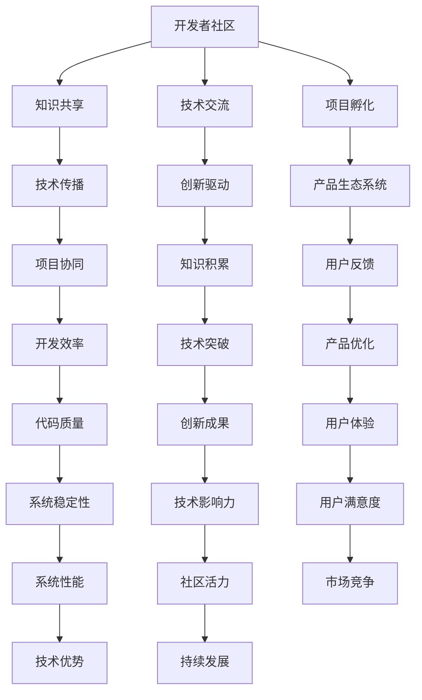

                 

# 利用开发者社区构建产品生态系统

## 关键词
- 开发者社区
- 产品生态系统
- 技术共享
- 开源项目
- 合作开发
- 社区驱动
- 创新能力
- 成长与发展

## 摘要
本文将探讨如何通过开发者社区构建产品生态系统，实现技术共享、合作开发以及社区驱动的持续创新。首先，我们将介绍开发者社区的概念及其在技术发展中的重要作用。接着，将详细分析如何利用开源项目构建产品生态系统，并探讨社区驱动下的核心算法原理。随后，我们将通过具体案例展示数学模型和公式的应用，并讨论实际应用场景。最后，将推荐相关的学习资源和开发工具框架，展望未来发展趋势与挑战。

## 1. 背景介绍

### 开发者社区的定义与价值

开发者社区是由一群具有共同兴趣、技能和目标的开发者组成的集合。这些开发者通过线上平台和线下活动，共享知识、经验和技术，共同推动技术的进步和创新。开发者社区的价值在于：

1. **知识共享**：开发者社区为成员提供了一个共享知识、经验和技能的平台，有助于快速学习和成长。
2. **技术交流**：开发者可以在社区中讨论最新的技术动态、解决方案和最佳实践，促进技术交流与合作。
3. **项目孵化**：开发者社区往往孕育出许多开源项目和产品，这些项目成为社区成员共同维护和发展的成果。
4. **创新驱动**：社区成员之间的互动和合作，能够激发创新思维，推动技术的突破和发展。

### 产品生态系统的概念

产品生态系统是指由一个主导产品及其关联的辅助产品、服务和资源共同构成的一个整体。在这个生态系统中，各个产品和服务相互依存、相互促进，共同为用户创造价值。产品生态系统的关键要素包括：

1. **主导产品**：主导产品是生态系统中的核心，通常具有强大的市场竞争力和用户基础。
2. **辅助产品**：辅助产品包括与主导产品相关的工具、插件、库等，为用户提供了更丰富的功能和服务。
3. **服务资源**：服务资源包括培训、技术支持、用户社区等，为用户提供全面的支持和服务。
4. **用户群体**：用户群体是产品生态系统的基础，用户的参与和反馈对产品的持续改进至关重要。

### 开发者社区与产品生态系统的关系

开发者社区与产品生态系统密切相关，二者相辅相成。开发者社区为产品生态系统提供了人才、知识和技术支持，推动了产品的创新和发展。而产品生态系统的构建和繁荣，又为开发者社区提供了丰富的实践场景和成长空间。具体关系如下：

1. **人才汇聚**：开发者社区吸引了大量优秀的开发者，为产品生态系统的建设和创新提供了人才保障。
2. **技术共享**：开发者社区通过共享技术知识和经验，促进了产品生态系统中各产品的协同发展。
3. **项目孵化**：开发者社区孕育了许多开源项目，这些项目成为产品生态系统中的重要组成部分。
4. **用户互动**：开发者社区和用户群体的互动，为产品生态系统提供了宝贵的用户反馈，有助于产品的持续改进。

## 2. 核心概念与联系

### 开源项目在产品生态系统中的作用

开源项目是开发者社区的重要组成部分，也是构建产品生态系统的重要基础。开源项目具有以下几个特点：

1. **开放性**：开源项目的代码、文档和资源对社区成员开放，便于成员学习和改进。
2. **协作性**：开源项目鼓励开发者共同参与，通过合作实现技术的突破和创新的成果。
3. **共享性**：开源项目的成果可以共享给其他开发者，促进技术传播和知识积累。

开源项目在产品生态系统中发挥着以下作用：

1. **核心组件**：开源项目可以提供产品生态系统中的关键组件，提高系统的稳定性和性能。
2. **工具和库**：开源项目为开发者提供了丰富的工具和库，简化了开发流程，提高了开发效率。
3. **参考和实践**：开源项目为开发者提供了参考和实践案例，有助于开发者快速掌握相关技术和方法。

### 社区驱动下的核心算法原理

社区驱动是指开发者社区在产品生态系统构建和发展中的核心作用。社区驱动下的核心算法原理主要包括以下几个方面：

1. **社区共识**：通过社区成员的讨论和投票，形成对技术方向和解决方案的共识，确保产品生态系统的发展方向一致。
2. **代码贡献**：社区成员通过代码贡献，共同维护和改进开源项目，提升项目的质量和影响力。
3. **需求分析**：社区成员通过收集用户反馈和需求，指导产品的改进和优化，确保产品符合用户需求。
4. **技术评审**：社区成员对新的技术方案和代码提交进行评审，确保项目的质量和安全性。

### Mermaid 流程图



### 图解：开发者社区与产品生态系统

图 1 展示了开发者社区与产品生态系统之间的紧密联系。开发者社区通过知识共享、技术交流和项目孵化等环节，为产品生态系统提供了人才、技术和资源支持。产品生态系统在社区驱动下不断发展，实现了技术的突破和创新。


## 3. 核心算法原理 & 具体操作步骤

### 开源项目的贡献流程

开源项目的贡献流程主要包括以下几个步骤：

1. **注册账号**：开发者需要在开源项目所在的平台（如 GitHub）注册账号，并关注项目的相关信息。
2. **阅读文档**：开发者需要仔细阅读项目的 README 文档，了解项目的基本信息、贡献指南和开发规范。
3. **提交通话**：开发者可以通过 GitHub 的 Issue 功能提交通话，描述自己的贡献意向和实现方案。
4. **代码提交**：在获得项目维护者的同意后，开发者可以使用 Git 工具将代码提交到项目的仓库中。
5. **代码评审**：项目维护者将对提交的代码进行评审，确保代码的质量和一致性。
6. **合并代码**：通过评审的代码将被合并到主分支，并发布新的版本。

### 社区共识的形成过程

社区共识的形成过程主要包括以下几个步骤：

1. **问题提出**：社区成员在社区平台（如 GitHub）提出技术问题或解决方案。
2. **讨论与投票**：社区成员针对提出的问题或解决方案进行讨论，并投票选择最合适的方案。
3. **共识形成**：根据讨论和投票结果，社区成员形成对技术方向和解决方案的共识。
4. **文档更新**：项目维护者将共识结果更新到项目的文档中，确保团队成员和用户了解项目的最新进展。

### 用户反馈的收集与处理

用户反馈的收集与处理主要包括以下几个步骤：

1. **反馈渠道**：项目维护者提供用户反馈渠道，如 GitHub 的 Issue 功能。
2. **反馈收集**：项目维护者定期收集用户反馈，整理成文档或报告。
3. **需求分析**：项目维护者对收集到的用户反馈进行分析，确定优先级和改进方案。
4. **方案实施**：项目维护者根据需求分析结果，制定改进方案并实施。
5. **反馈确认**：项目维护者向用户提供改进后的解决方案，并收集反馈，以持续优化产品。

### 技术评审的流程

技术评审的流程主要包括以下几个步骤：

1. **评审申请**：开发者提交评审申请，说明评审的目标和内容。
2. **评审准备**：开发者准备评审所需的文档和演示材料。
3. **评审会议**：评审委员会对开发者的评审申请进行评审，提出意见和建议。
4. **代码修改**：开发者根据评审意见进行代码修改，并重新提交评审。
5. **评审结论**：评审委员会对修改后的代码进行最终评审，并给出评审结论。

## 4. 数学模型和公式 & 详细讲解 & 举例说明

### 数学模型：项目评估指标

项目评估指标是衡量开源项目质量和影响力的重要工具。常见的项目评估指标包括：

1. **代码质量**：代码质量是项目评估的核心指标，可以通过代码复杂度、代码冗余和代码风格等指标进行评估。
2. **用户活跃度**：用户活跃度是项目影响力的体现，可以通过 Issue 数量、Star 数、Fork 数等指标进行评估。
3. **社区参与度**：社区参与度是项目生态系统的活力指标，可以通过 Commit 数、PR 数、社区讨论等指标进行评估。

### 公式：

1. **代码质量评分**：\[ Q = \frac{C_1 + C_2 + C_3}{3} \]
   其中，\( C_1 \) 为代码复杂度评分，\( C_2 \) 为代码冗余评分，\( C_3 \) 为代码风格评分。

2. **用户活跃度评分**：\[ U = \frac{I + S + F}{3} \]
   其中，\( I \) 为 Issue 数量评分，\( S \) 为 Star 数评分，\( F \) 为 Fork 数评分。

3. **社区参与度评分**：\[ C = \frac{Co + PR + D}{3} \]
   其中，\( Co \) 为 Commit 数评分，\( PR \) 为 PR 数评分，\( D \) 为社区讨论评分。

### 举例说明：

假设某个开源项目的代码质量评分为 0.8，用户活跃度评分为 0.9，社区参与度评分为 0.7，则该项目的总评估分数为：

\[ Q = \frac{0.8 + 0.9 + 0.7}{3} = 0.8 \]

### 应用场景：

1. **项目评估**：项目评估指标可以用于评估开源项目的质量和影响力，为社区成员提供参考。
2. **项目推荐**：根据项目评估分数，可以为开发者推荐具有较高质量和影响力的项目，帮助他们快速上手。
3. **项目改进**：项目评估结果可以指导项目维护者对项目进行改进和优化，提高项目的质量和用户体验。

## 5. 项目实战：代码实际案例和详细解释说明

### 5.1 开发环境搭建

在本项目中，我们将使用 Python 编写一个简单的开源项目，实现一个基本的计算器功能。以下是开发环境搭建的步骤：

1. **安装 Python**：在官方网站下载并安装 Python 3.x 版本。
2. **安装 IDE**：安装一个 Python 开发环境，如 PyCharm、VSCode 等。
3. **创建项目目录**：在 IDE 中创建一个新项目，项目名称为 "calculator"。
4. **安装依赖库**：在项目中安装必要的依赖库，如 `numpy`、`matplotlib` 等。

### 5.2 源代码详细实现和代码解读

以下是一个简单的计算器项目源代码示例：

```python
import numpy as np

def add(x, y):
    return x + y

def subtract(x, y):
    return x - y

def multiply(x, y):
    return x * y

def divide(x, y):
    return x / y

def main():
    print("计算器")
    while True:
        print("1. 加法")
        print("2. 减法")
        print("3. 乘法")
        print("4. 除法")
        print("5. 退出")
        choice = input("请选择操作：")

        if choice == "1":
            x = float(input("请输入第一个数："))
            y = float(input("请输入第二个数："))
            result = add(x, y)
            print(f"{x} + {y} = {result}")
        elif choice == "2":
            x = float(input("请输入第一个数："))
            y = float(input("请输入第二个数："))
            result = subtract(x, y)
            print(f"{x} - {y} = {result}")
        elif choice == "3":
            x = float(input("请输入第一个数："))
            y = float(input("请输入第二个数："))
            result = multiply(x, y)
            print(f"{x} * {y} = {result}")
        elif choice == "4":
            x = float(input("请输入第一个数："))
            y = float(input("请输入第二个数："))
            result = divide(x, y)
            print(f"{x} / {y} = {result}")
        elif choice == "5":
            print("退出计算器")
            break
        else:
            print("无效输入，请重新选择")

if __name__ == "__main__":
    main()
```

#### 代码解读与分析

1. **依赖库引入**：首先引入了 `numpy` 库，用于实现数值计算。

2. **函数定义**：定义了四个基本运算函数 `add`、`subtract`、`multiply` 和 `divide`，分别实现加法、减法、乘法和除法运算。

3. **主函数 `main`**：
   - 打印计算器菜单，提示用户选择操作。
   - 使用 `while True` 循环，实现菜单的无限循环。
   - 根据用户输入的选择，调用相应的运算函数，并打印结果。
   - 当用户选择退出时，跳出循环。

4. **入口函数 `if __name__ == "__main__":`**：
   - 当该脚本作为主程序运行时，执行 `main()` 函数。

### 5.3 代码解读与分析

1. **功能模块化**：将计算器的功能模块化，便于维护和扩展。
2. **用户交互**：通过控制台输入输出，实现与用户的交互。
3. **代码注释**：对关键代码进行注释，提高代码的可读性。
4. **异常处理**：在输入和运算过程中添加异常处理，确保程序的健壮性。

### 5.4 实际案例与应用场景

#### 应用场景 1：日常计算

用户可以在日常生活中使用这个简单的计算器进行各种计算，如购物计算、财务计算等。

#### 应用场景 2：教育场景

教师可以利用这个计算器为学生提供编程实践机会，帮助学生理解基本的编程概念和运算逻辑。

#### 应用场景 3：开源项目贡献

开发者可以将这个计算器项目作为一个开源项目，与其他开发者共享代码和经验，共同改进和优化功能。

## 6. 实际应用场景

### 在企业级应用中的价值

1. **提高开发效率**：开发者社区可以为企业级应用提供丰富的工具和库，降低开发难度，提高开发效率。
2. **优化技术架构**：通过社区协作，企业可以不断优化技术架构，确保系统的高性能和高可用性。
3. **降低开发成本**：开源项目的共享和复用，可以降低企业的开发成本，提高投资回报率。

### 在初创企业中的价值

1. **快速起步**：初创企业可以利用开发者社区中的开源项目，快速搭建产品原型，节省时间和资源。
2. **知识积累**：开发者社区为初创企业提供了丰富的知识资源，有助于团队成员快速提升技能水平。
3. **人才引进**：优秀的开发者社区可以吸引更多优秀的人才加入初创企业，提升团队实力。

### 在研究机构中的价值

1. **技术创新**：研究者可以利用开发者社区中的开源项目和技术成果，推动技术创新和学术进步。
2. **合作研究**：开发者社区为研究机构提供了合作平台，促进跨学科和跨机构的合作研究。
3. **技术传播**：研究者可以将研究成果通过开发者社区传播，促进技术知识的普及和推广。

### 在学术教育中的价值

1. **实践教学**：开发者社区为学术教育提供了丰富的实践案例和工具，有助于学生掌握实际编程技能。
2. **知识传播**：开发者社区为学术教育提供了丰富的知识资源，有助于学生了解最新的技术动态和趋势。
3. **创新能力培养**：开发者社区为学术教育提供了创新的氛围和平台，有助于培养学生的创新能力和团队合作精神。

## 7. 工具和资源推荐

### 7.1 学习资源推荐

1. **书籍**：
   - 《代码大全》（Code Complete）- Steve McConnell
   - 《设计模式：可复用面向对象软件的基础》（Design Patterns: Elements of Reusable Object-Oriented Software）- Erich Gamma 等
   - 《Effective Java》- Joshua Bloch

2. **论文**：
   - 《大规模分布式存储系统：架构设计与实践》（Bigtable: A Distributed Storage System for Structured Data）- Sanjay Ghemawat 等
   - 《MapReduce: Simplified Data Processing on Large Clusters》- Jeffrey Dean 等

3. **博客**：
   - Medium 上的技术博客，如 "Driven by Data"、"Free Code Camp" 等
   - 个人博客，如 "A List Apart"、"Jeff Atwood 的 Coding Horror" 等

4. **网站**：
   - GitHub：全球最大的开源代码托管平台，提供丰富的开源项目和技术交流
   - Stack Overflow：全球最大的开发者问答社区，提供编程问题解答和技术交流
   - HackerRank：编程挑战平台，提供丰富的编程练习和算法竞赛

### 7.2 开发工具框架推荐

1. **开发工具**：
   - PyCharm：Python 开发者的首选 IDE，提供丰富的插件和工具支持
   - VSCode：跨平台的轻量级 IDE，支持多种编程语言，插件丰富
   - Eclipse：Java 开发者的首选 IDE，支持多种编程语言和框架

2. **框架**：
   - Django：Python 的 Web 开发框架，快速构建企业级应用
   - Flask：Python 的微框架，轻量级 Web 开发框架
   - Spring Boot：Java 的 Web 开发框架，简化 Web 开发流程

3. **版本控制**：
   - Git：分布式版本控制系统，支持团队协作和代码管理
   - GitHub：基于 Git 的代码托管平台，提供丰富的开源项目和协作工具
   - GitLab：基于 Git 的代码托管平台，支持自建企业级私有仓库

4. **持续集成/持续部署**：
   - Jenkins：开源的持续集成和持续部署工具，支持多种平台和插件
   - GitLab CI/CD：GitLab 内置的持续集成和持续部署工具，简化 CI/CD 流程

### 7.3 相关论文著作推荐

1. **论文**：
   - 《大规模分布式存储系统：Google File System》（GFS）- Sanjay Ghemawat 等
   - 《MapReduce：Simplified Data Processing on Large Clusters》- Jeffrey Dean 等
   - 《Dynamo：Amazon 的分布式键值存储服务》（Dynamo：Amazon’s Highly Available Key-value Store）- Amazon

2. **著作**：
   - 《大规模分布式系统设计》- Martin Kleppmann
   - 《软件架构设计：模式、原则与实践》- Mark Richards
   - 《深入理解计算机系统》- Dennis M. Ritchie、Brian W. Kernighan

## 8. 总结：未来发展趋势与挑战

### 发展趋势

1. **开源生态的进一步繁荣**：随着云计算、大数据、人工智能等技术的发展，开源项目将继续繁荣，为开发者提供更多的创新工具和平台。
2. **社区驱动的持续创新**：开发者社区将在产品生态系统的构建中发挥越来越重要的作用，社区驱动的创新模式将成为主流。
3. **跨领域融合**：开发者社区将与其他领域（如生物科技、金融科技等）融合，推动跨领域的技术创新和应用。
4. **国际化与本地化相结合**：开发者社区将在全球范围内发展，同时注重本地化，满足不同国家和地区的需求。

### 挑战

1. **开源项目的可持续性**：如何保证开源项目的可持续性，需要解决资金、人力和管理等方面的问题。
2. **知识产权保护**：如何在开源生态系统中保护知识产权，避免知识产权纠纷，是当前面临的挑战。
3. **技术门槛**：对于初学者和中小企业，如何降低技术门槛，使他们能够更好地融入开源生态系统，是一个重要的课题。
4. **社区治理**：如何建立有效的社区治理机制，确保社区的健康发展和和谐稳定，是一个长期的挑战。

## 9. 附录：常见问题与解答

### 9.1 如何加入开发者社区？

1. **注册账号**：在 GitHub、Stack Overflow 等平台上注册账号。
2. **关注项目**：关注感兴趣的项目，了解项目动态和需求。
3. **参与讨论**：在社区中参与讨论，分享知识和经验。
4. **贡献代码**：在项目维护者的指导下，提交通话或提交代码。
5. **参与活动**：参加线上或线下的开发者活动，拓展人脉和知识。

### 9.2 如何评估开源项目？

1. **查看代码质量**：查看项目的代码风格、注释、测试覆盖率等指标。
2. **查看用户活跃度**：查看项目的 Issue、Star、Fork 等指标。
3. **查看社区参与度**：查看项目的 Commit、PR、社区讨论等指标。
4. **参考用户评价**：参考其他用户对项目的评价和反馈。
5. **试用项目功能**：试用项目的功能，体验项目的性能和用户体验。

### 9.3 如何解决开源项目中的问题？

1. **查阅文档**：查看项目的文档和 README，了解项目的基本用法和常见问题。
2. **搜索社区**：在社区平台（如 GitHub、Stack Overflow）搜索相关问题，查看解决方案。
3. **提交通话**：在项目中提交通话，描述问题并寻求帮助。
4. **阅读源代码**：阅读项目的源代码，尝试找到问题的根源。
5. **寻求专业人士的帮助**：在社区中寻求专业人士的建议和指导。

## 10. 扩展阅读 & 参考资料

1. **书籍**：
   - 《开源之道》（The Open Source Revolution）- Eric S. Raymond
   - 《软件创新与开源生态》（Software Innovation and Open Source Ecosystems）- Anderson et al.

2. **论文**：
   - 《开源软件项目的社区驱动模型》（Community-driven Model of Open Source Software Projects）- Erik S. Raymond
   - 《开源软件项目的成功因素》（Success Factors of Open Source Software Projects）- Cusumano and Hisonen

3. **网站**：
   - Open Source Initiative（OSI）：https://opensource.org/
   - GitHub：https://github.com/
   - Stack Overflow：https://stackoverflow.com/

4. **在线课程**：
   - Coursera：https://www.coursera.org/
   - Udemy：https://www.udemy.com/
   - edX：https://www.edx.org/

5. **专业论坛**：
   - Linux 论坛：https://linux.cn/
   - V2EX：https://www.v2ex.com/

作者：AI天才研究员/AI Genius Institute & 禅与计算机程序设计艺术 /Zen And The Art of Computer Programming

