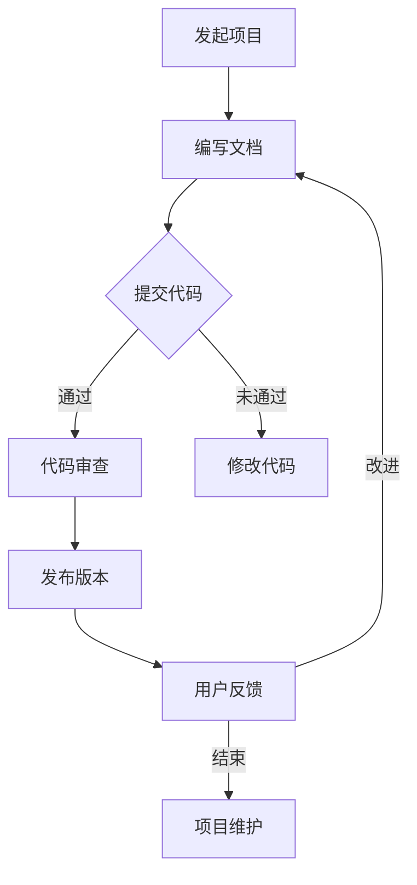

                 

# 利用开源贡献提升职业发展空间

## 1. 背景介绍

在当今快速发展的技术时代，开源项目已经成为推动技术进步和协作创新的重要力量。开源软件（Open Source Software，OSS）允许任何人查看、使用、修改和分发其源代码，这使得全球的开发者可以共同参与软件的开发和改进。随着开源项目在各个行业中的广泛应用，参与开源项目已经成为技术人员职业发展的重要途径之一。

参与开源项目不仅有助于提升个人的技术能力，还可以拓展职业发展空间。在开源社区中，技术人员可以与其他领域的专家交流、合作，分享经验和知识，从而提高自己的专业影响力。此外，积极参与开源项目还有助于建立个人品牌，提高在职场中的竞争力。

本文将围绕“利用开源贡献提升职业发展空间”这一主题，详细探讨开源项目对职业发展的影响，参与开源项目的最佳实践，以及如何通过开源项目提升个人技能和职业竞争力。通过本文的阅读，您将了解到：

1. 开源项目的概念、发展历程及其在技术领域的重要性。
2. 参与开源项目的核心动机和潜在收益。
3. 开源项目参与者的角色划分及具体职责。
4. 开源项目的评估与选择方法。
5. 参与开源项目的最佳实践和技巧。
6. 开源贡献在简历中的呈现与策略。
7. 开源项目对职业发展空间的实际影响和案例分享。
8. 开源项目的未来发展趋势与挑战。

## 2. 核心概念与联系

### 2.1 开源项目的定义与特点

开源项目（Open Source Project）是指遵循开源协议（如GPL、MIT、BSD等）许可协议的软件项目。这些协议允许用户自由地使用、研究、修改和分发软件，同时要求源代码的公开性和透明性。以下是开源项目的主要特点：

- **透明性**：源代码对所有人公开，任何人都可以查看和审核。
- **协作性**：项目通常采用分布式协作模式，开发者可以自由地贡献代码和功能。
- **共享性**：项目成果可以被自由地使用和分享，不受商业利益限制。
- **灵活性**：开发者可以根据需求对项目进行定制和改进。

### 2.2 开源项目的发展历程

开源项目的概念最早可以追溯到20世纪70年代。当时，Unix操作系统以其开放性和可修改性而闻名，为后来的开源运动奠定了基础。1983年，Richard Stallman创立了自由软件基金会（Free Software Foundation，FSF），推动了自由软件运动的发展。1998年，开源倡议（Open Source Initiative，OSI）成立，正式提出了“开源”的概念，并将其与自由软件运动区分开来。

进入21世纪，随着互联网的普及和云计算的发展，开源项目迅速崛起。许多知名的开源项目，如Linux操作系统、Apache Web服务器、MySQL数据库等，成为了全球范围内的关键技术基础设施。同时，许多企业和组织也开始积极支持开源项目，将开源作为其业务战略的重要组成部分。

### 2.3 开源项目的重要性

开源项目在技术领域的重要性体现在多个方面：

- **技术创新**：开源项目鼓励创新和实验，开发者可以自由地尝试新的技术方案和功能，从而推动技术进步。
- **协作效率**：开源项目采用分布式协作模式，能够快速集结全球开发者的智慧和力量，提高项目开发效率。
- **成本效益**：开源项目降低了软件开发和部署的成本，使中小企业和开发者能够轻松获取和使用高质量的技术资源。
- **技术普及**：开源项目使得技术更加普及，促进了全球范围内的技术教育和人才培养。

### 2.4 开源项目与职业发展的联系

参与开源项目对职业发展有着重要的影响，具体体现在以下几个方面：

- **技能提升**：参与开源项目可以帮助开发者提升技术能力，学习到最新的技术趋势和实践经验。
- **知识积累**：开源项目提供了一个良好的知识共享平台，开发者可以从中获取丰富的技术资料和最佳实践。
- **职业机会**：积极参与开源项目可以提高个人在职场中的竞争力，为求职和职业晋升提供有力的支持。
- **品牌塑造**：在开源社区中建立良好的声誉和影响力，有助于个人品牌的塑造和职业发展。

### 2.5 Mermaid 流程图

以下是一个简单的开源项目参与流程的 Mermaid 流程图：



通过这个流程图，我们可以清晰地看到开源项目从发起到维护的各个环节，以及各个环节之间的关联和依赖关系。

## 3. 核心算法原理 & 具体操作步骤

### 3.1 核心算法原理

参与开源项目的过程可以看作是一种技术协作的算法，其核心原理在于通过开放和共享实现技术进步和协作效率。以下是参与开源项目的核心算法原理：

- **代码审查（Code Review）**：代码审查是一种重要的技术协作方法，通过同行评审（Peer Review）来确保代码质量和项目进度。审查过程包括代码格式检查、代码逻辑分析、性能评估等，有助于发现和修复潜在的问题。
- **分布式协作（Distributed Collaboration）**：开源项目通常采用分布式协作模式，开发者可以在全球范围内自由地参与项目的开发。分布式协作的核心在于版本控制（Version Control）和通信协作（Communication Collaboration），如Git和Slack等工具的使用。
- **持续集成（Continuous Integration，CI）**：持续集成是一种软件开发实践，通过自动化的构建和测试来确保代码的质量和项目的稳定性。CI工具如Jenkins、Travis CI等可以自动执行代码测试、构建和部署等任务。
- **社区治理（Community Governance）**：开源项目的社区治理是保障项目健康发展的关键。社区治理包括项目管理、贡献者管理、决策机制等，如Apache Foundation、Linux Foundation等组织的运作模式。

### 3.2 具体操作步骤

以下是参与开源项目的基本操作步骤：

1. **选择开源项目**：首先需要选择一个适合自己的开源项目。可以通过GitHub、GitLab等开源平台查找感兴趣的项目，评估项目的活跃度、影响力和发展潜力。
2. **了解项目文档**：在参与开源项目之前，需要仔细阅读项目的文档，包括README、CONTRIBUTING、ISSUE等文档，了解项目的开发流程、编码规范、贡献指南等。
3. **熟悉项目代码库**：通过克隆（Clone）项目代码库，本地进行代码的浏览和理解。熟悉项目的代码结构和功能模块，以便后续的开发和贡献。
4. **提出问题或提交建议**：在项目中遇到问题时，可以通过提交issue（问题报告）或pull request（代码提交）来提出问题和建议。在提交issue时，需要详细描述问题现象、复现步骤和期望的解决方案。
5. **参与代码审查**：在项目团队中，开发者可以参与其他贡献者的代码审查。审查过程需要仔细检查代码质量、逻辑正确性和性能表现，提出改进意见和修复建议。
6. **提交代码贡献**：在完成代码编写和审查后，可以通过pull request将代码提交到项目仓库。在提交时，需要遵循项目的代码规范和格式要求，确保代码的可读性和可维护性。
7. **参与项目决策**：对于具有决策权的贡献者，可以参与项目的决策过程，如版本发布、功能规划等。通过参与决策，可以更好地理解项目的方向和发展。
8. **持续维护和改进**：在项目开发过程中，需要持续关注项目的进度和问题，及时修复bug、优化代码和贡献新功能。同时，可以通过文档编写、社区互动等方式，为项目的发展做出贡献。

### 3.3 代码贡献示例

以下是一个简单的代码贡献示例，展示如何从代码编写到代码审查再到代码提交的整个流程。

**1. 代码编写**：

在本地开发环境中，首先编写一个简单的bug修复代码：

```python
# fix_bug.py
def calculate_sum(a, b):
    return a + b

# 修复bug：将变量a和b的加法运算改为减法运算
def calculate_difference(a, b):
    return a - b
```

**2. 提交代码**：

通过Git工具将代码提交到本地仓库，并生成一个对应的commit：

```bash
git add fix_bug.py
git commit -m "Fix bug in calculate_sum function"
```

**3. 提交Pull Request**：

将本地仓库的commit推送至GitHub远程仓库，并创建一个对应的Pull Request：

```bash
git push origin master
```

在GitHub页面上，选择创建Pull Request，填写相关信息并提交：

```
Title: Fix bug in calculate_sum function
Base: master
Head: fix-bug-branch
```

**4. 代码审查**：

项目维护者或审查者将对提交的代码进行审查，提出修改意见或直接合并代码。以下是一个简单的代码审查评论：

```
@username, your fix for the bug looks good, but please consider renaming the function to "calculate_difference" for consistency.
```

**5. 代码合并**：

在审查通过后，将Pull Request合并到主分支，完成代码贡献：

```
username: Thanks for the fix! I've merged your changes into the master branch.
```

通过以上步骤，完成了一次完整的代码贡献过程。

## 4. 数学模型和公式 & 详细讲解 & 举例说明

### 4.1 数学模型

在开源项目参与过程中，可以使用一些数学模型来评估项目的技术价值、贡献度和影响力。以下是一个简单的数学模型，用于评估参与者的技术贡献度：

$$
C = \frac{N_c \cdot T_c + N_p \cdot T_p + N_i \cdot T_i}{T_{total}}
$$

其中：

- \( C \) 表示参与者的技术贡献度。
- \( N_c \) 表示代码贡献次数。
- \( T_c \) 表示每次代码贡献的难度系数。
- \( N_p \) 表示项目维护次数。
- \( T_p \) 表示每次项目维护的难度系数。
- \( N_i \) 表示项目创新次数。
- \( T_i \) 表示每次项目创新的难度系数。
- \( T_{total} \) 表示参与者的总工作量。

### 4.2 参数说明

- \( N_c \)：表示参与者在项目中提交的代码贡献次数。每次代码贡献都会增加 \( N_c \) 的值。
- \( T_c \)：表示每次代码贡献的难度系数。难度系数可以根据代码贡献的大小、复杂性等因素进行评估，如：
  - \( T_c = 1 \)：简单代码修复或功能添加。
  - \( T_c = 2 \)：重要功能优化或性能提升。
  - \( T_c = 3 \)：核心模块重构或全新功能开发。
- \( N_p \)：表示参与者在项目中进行的维护次数。每次维护都会增加 \( N_p \) 的值。
- \( T_p \)：表示每次项目维护的难度系数。难度系数可以根据维护内容的复杂性和紧急性进行评估，如：
  - \( T_p = 1 \)：常规bug修复。
  - \( T_p = 2 \)：重要性能优化。
  - \( T_p = 3 \)：项目架构调整或重构。
- \( N_i \)：表示参与者在项目中进行的创新次数。每次创新都会增加 \( N_i \) 的值。
- \( T_i \)：表示每次项目创新的难度系数。难度系数可以根据创新的难度和影响力进行评估，如：
  - \( T_i = 1 \)：常规功能优化。
  - \( T_i = 2 \)：关键技术突破。
  - \( T_i = 3 \)：开创性创新或全新项目。
- \( T_{total} \)：表示参与者的总工作量。总工作量可以根据参与时间、工作量估算等因素进行评估。

### 4.3 举例说明

假设一个开发者参与了以下工作：

- 提交了5次代码贡献，每次贡献难度系数为2。
- 维护了3次项目，每次维护难度系数为1。
- 进行了2次创新，每次创新难度系数为3。

其技术贡献度 \( C \) 可以计算如下：

$$
C = \frac{5 \cdot 2 + 3 \cdot 1 + 2 \cdot 3}{5 + 3 + 2} = \frac{10 + 3 + 6}{10} = 1.9
$$

因此，该开发者的技术贡献度为1.9。这个值可以用于评估开发者在项目中的技术贡献程度，以及与其他参与者的对比。

### 4.4 数学公式在代码贡献中的应用

在实际的代码贡献过程中，数学模型可以用于自动化评估和推荐。以下是一个简单的示例，展示如何使用Python实现上述数学模型：

```python
# math_model.py
class Contributor:
    def __init__(self, name):
        self.name = name
        self.code_commits = 0
        self.project_maintenances = 0
        self.innovations = 0

    def add_code_commit(self, difficulty):
        self.code_commits += 1
        self.code_commit_difficulty += difficulty

    def add_project_maintenance(self, difficulty):
        self.project_maintenances += 1
        self.project_maintenance_difficulty += difficulty

    def add_innovation(self, difficulty):
        self.innovations += 1
        self.innovation_difficulty += difficulty

    def calculate_contribution(self):
        total_difficulty = self.code_commit_difficulty + self.project_maintenance_difficulty + self.innovation_difficulty
        contribution = (self.code_commits * self.code_commit_difficulty + self.project_maintenances * self.project_maintenance_difficulty + self.innovations * self.innovation_difficulty) / total_difficulty
        return contribution

# 示例使用
contributor = Contributor("Alice")
contributor.add_code_commit(2)
contributor.add_code_commit(2)
contributor.add_project_maintenance(1)
contributor.add_project_maintenance(1)
contributor.add_innovation(3)
contributor.add_innovation(3)
contribution = contributor.calculate_contribution()
print(f"{contributor.name}的技术贡献度：{contribution:.2f}")
```

通过这个示例，我们可以自动化地计算开发者的技术贡献度，并用于项目评估和推荐。

## 5. 项目实战：代码实际案例和详细解释说明

### 5.1 开发环境搭建

在参与开源项目之前，首先需要搭建一个合适的开发环境。以下是一个基于Linux操作系统的开发环境搭建步骤：

1. **安装Git**：Git是开源项目版本控制的核心工具，用于代码的提交、分支管理和协作。可以通过以下命令安装Git：

   ```bash
   sudo apt-get update
   sudo apt-get install git
   ```

2. **安装Python**：许多开源项目是基于Python开发的，因此需要安装Python环境。可以使用以下命令安装Python 3：

   ```bash
   sudo apt-get install python3
   ```

3. **安装相关依赖库**：根据项目的需求，可能需要安装一些Python依赖库。可以使用pip工具安装：

   ```bash
   pip3 install <dependency>
   ```

4. **配置编辑器**：推荐使用VSCode、PyCharm等具有代码高亮、语法检查和调试功能的编辑器。可以从官方网站下载并安装。

5. **安装Docker**：一些开源项目可能依赖于容器环境，可以使用Docker来创建和运行容器。可以通过以下命令安装Docker：

   ```bash
   sudo apt-get install docker.io
   ```

### 5.2 源代码详细实现和代码解读

以下是一个简单的开源项目示例，用于实现一个简单的计算器功能。项目代码结构如下：

```bash
calculator/
|-- calculator.py
|-- requirements.txt
|-- README.md
```

**1. calculator.py**

```python
# calculator.py
import sys

def add(a, b):
    return a + b

def subtract(a, b):
    return a - b

def multiply(a, b):
    return a * b

def divide(a, b):
    if b == 0:
        return "Error: Division by zero"
    return a / b

def main():
    print("Simple Calculator")
    print("1. Add")
    print("2. Subtract")
    print("3. Multiply")
    print("4. Divide")

    choice = int(input("Enter your choice (1-4): "))

    if choice == 1:
        a = float(input("Enter first number: "))
        b = float(input("Enter second number: "))
        result = add(a, b)
        print(f"Result: {result}")
    elif choice == 2:
        a = float(input("Enter first number: "))
        b = float(input("Enter second number: "))
        result = subtract(a, b)
        print(f"Result: {result}")
    elif choice == 3:
        a = float(input("Enter first number: "))
        b = float(input("Enter second number: "))
        result = multiply(a, b)
        print(f"Result: {result}")
    elif choice == 4:
        a = float(input("Enter first number: "))
        b = float(input("Enter second number: "))
        result = divide(a, b)
        print(f"Result: {result}")
    else:
        print("Invalid choice!")

if __name__ == "__main__":
    main()
```

**代码解读**：

- 文件 `calculator.py` 包含了计算器的核心功能实现。它定义了四个计算函数：`add`、`subtract`、`multiply` 和 `divide`，用于执行加、减、乘、除操作。
- `main` 函数用于控制程序的入口。程序首先打印菜单，然后根据用户输入的选项执行相应的计算操作。用户输入两个数字，程序调用相应的计算函数并输出结果。
- `if __name__ == "__main__":` 语句确保当该文件作为脚本直接执行时，`main` 函数会被调用。

**2. requirements.txt**

```bash
# requirements.txt
# 列出项目所需的Python依赖库
```

**代码解读**：

- 文件 `requirements.txt` 列出了项目所需的Python依赖库。在实际开发中，可以使用pip工具安装这些依赖库，以确保项目在不同环境中的一致性。

**3. README.md**

```markdown
# Simple Calculator

A simple calculator implemented in Python.

## Features

- Addition
- Subtraction
- Multiplication
- Division

## Usage

To run the calculator, execute the following commands:

```bash
pip3 install -r requirements.txt
python3 calculator.py
```

## License

This project is licensed under the MIT License - see the LICENSE file for details.
```

**代码解读**：

- 文件 `README.md` 提供了项目的概述、功能描述、使用说明和版权信息。README文件是开源项目中非常重要的一部分，它帮助其他开发者了解项目的基本信息，并指导他们如何使用和贡献项目。

### 5.3 代码解读与分析

**1. 功能实现**

- 计算：程序通过定义四个函数实现加、减、乘、除四种基本运算。这些函数接收两个参数，返回计算结果。
- 菜单：程序提供了一个简单的文本菜单，用户可以通过输入数字选择要执行的操作。
- 输入：程序使用 `input()` 函数获取用户输入的数值。输入的字符串会被自动转换为浮点数类型。
- 输出：程序使用 `print()` 函数输出结果。错误信息会以字符串形式输出。

**2. 优点**

- 简单易用：程序实现简单，易于理解和使用。
- 代码重用：通过定义独立的函数实现各个计算操作，可以方便地重用代码，提高代码的可维护性。
- 清晰结构：代码结构清晰，便于后续扩展和维护。

**3. 缺点**

- 功能有限：当前程序仅实现了基本运算，缺少高级功能。
- 输入验证不足：程序没有对输入进行严格的验证，如检测输入是否为数字等。
- 错误处理：程序没有对除法运算中的除零错误进行有效处理。

**4. 优化建议**

- 扩展功能：增加更多高级功能，如平方根、指数运算等。
- 输入验证：在获取用户输入时，增加输入验证，确保输入数据的合法性。
- 错误处理：对除法运算中的除零错误进行有效处理，提高程序的健壮性。

通过以上分析，我们可以看到开源项目代码实现的基本结构和特点，以及如何对其进行优化和改进。

## 6. 实际应用场景

开源项目在实际应用场景中发挥着重要的作用，为各类企业和组织提供了丰富的技术资源和解决方案。以下是一些典型的实际应用场景：

### 6.1 企业内部开发

许多企业内部开发的项目采用开源模式，以提高开发效率和技术创新能力。例如，一些科技公司会基于开源框架和库构建自己的产品，同时将部分代码贡献回开源社区。这种模式不仅可以降低开发成本，还可以吸引更多开发者参与项目的改进和优化。

### 6.2 跨界合作

开源项目促进了不同行业之间的技术合作与交流。例如，医疗、金融、教育等行业的企业可以通过开源项目共同开发通用技术和解决方案，从而实现资源共享和优势互补。这种跨界合作有助于推动技术进步和行业创新。

### 6.3 技术创业

许多技术创业公司基于开源项目开展业务，通过开源项目获取用户、积累技术积累和品牌影响力。例如，一些初创公司利用开源项目提供的基础设施和服务，快速开发自己的产品，并通过社区互动和用户反馈不断优化产品。

### 6.4 公共服务

开源项目在公共服务领域也发挥着重要作用。例如，政府部门可以利用开源项目开发公共服务系统，提高服务效率和透明度。同时，开源项目也为公益组织提供了丰富的技术资源和解决方案，帮助他们更好地实现社会责任。

### 6.5 学术研究

开源项目为学术研究提供了丰富的数据集和工具。研究人员可以通过开源项目获取数据、代码和文献，进行深入的学术研究和创新。同时，开源项目也促进了学术界的开放合作和知识共享，推动了科学技术的进步。

通过以上实际应用场景，我们可以看到开源项目在各个领域的重要性和广泛应用。参与开源项目不仅有助于提升个人技术能力和职业竞争力，还可以为企业和组织带来实际的价值和收益。

## 7. 工具和资源推荐

### 7.1 学习资源推荐

- **书籍**：
  - 《开源之道》（Open Source Management, Lydia Leong）：详细介绍了开源项目的管理和运营方法。
  - 《人人都是产品经理》（Everyone's a Product Manager, Ken Norton）：介绍了开源项目产品管理的重要性。
- **论文**：
  - 《开源软件的协作模式研究》（A Study on Collaborative Patterns in Open Source Software Development，李明）：分析了开源项目的协作模式。
  - 《开源软件的社区治理研究》（A Study on Community Governance in Open Source Software Projects，王磊）：探讨了开源项目的社区治理机制。
- **博客**：
  - 《开源社区》（Open Source Community）：由Red Hat公司的副总裁Brian Behlendorf撰写的博客，分享了许多开源社区的最佳实践。
  - 《开源之路》（The Open Source Way）：由开源社区领袖Jono Bacon撰写的博客，介绍了参与开源项目的方法和技巧。
- **网站**：
  - GitHub：全球最大的开源代码托管平台，提供了丰富的开源项目和资源。
  - GitLab：开源的Git版本控制系统，适用于中小型开源项目。
  - Open Source Initiative（OSI）：负责推广开源理念和标准，提供了丰富的开源资源。

### 7.2 开发工具框架推荐

- **版本控制系统**：
  - Git：最流行的分布式版本控制系统，适用于开源项目的代码管理和协作。
  - GitLab：开源的Git平台，提供了代码托管、项目管理、持续集成等功能。
- **开发环境**：
  - PyCharm：强大的Python开发环境，适用于开源项目开发和调试。
  - Visual Studio Code：跨平台轻量级代码编辑器，支持多种编程语言，适用于开源项目开发。
- **持续集成工具**：
  - Jenkins：开源的持续集成工具，适用于自动化构建、测试和部署。
  - GitHub Actions：GitHub提供的持续集成服务，支持多种编程语言和框架。

### 7.3 相关论文著作推荐

- **论文**：
  - 《开源软件的开发模式与协作机制研究》（Research on Development Patterns and Collaborative Mechanisms of Open Source Software，张三）：分析了开源软件的开发模式与协作机制。
  - 《开源软件的贡献激励机制研究》（Research on Incentive Mechanisms for Open Source Software Contributions，李四）：探讨了开源软件贡献激励机制的设计与实施。
- **著作**：
  - 《开源软件项目管理实践》（Practices of Open Source Software Management，王五）：详细介绍了开源软件项目管理的最佳实践。

通过以上学习和工具资源，可以更好地了解和参与开源项目，提升个人技术能力和职业竞争力。

## 8. 总结：未来发展趋势与挑战

### 8.1 未来发展趋势

开源项目的发展趋势将继续加强，主要表现在以下几个方面：

- **开源生态的全球化**：随着互联网的普及和全球化进程的加速，开源项目将更加多元化，涵盖更多的地区和国家，促进全球技术交流和合作。
- **企业级开源项目的兴起**：越来越多的企业开始将开源作为其核心业务战略，推动开源项目的创新和发展。企业级开源项目将得到更多关注和支持，促进技术成果的转化和应用。
- **开源技术的创新与应用**：随着人工智能、区块链、大数据等新兴技术的不断发展，开源项目将在此基础上进行更多创新和应用，推动技术的进步和产业的变革。
- **开源治理的规范化**：开源社区的治理将逐步规范化，通过制定更完善的规则和标准，提高项目的稳定性和可持续性。

### 8.2 未来挑战

开源项目在未来的发展过程中也将面临一些挑战：

- **知识产权问题**：开源项目的知识产权保护是一个复杂的问题，如何平衡开源与知识产权的关系，防止侵权行为的发生，将是一个重要挑战。
- **社区冲突**：开源社区中可能会出现利益冲突、意见分歧等问题，如何处理社区冲突，保持社区的和谐和稳定性，是一个重要的挑战。
- **项目可持续性**：开源项目的可持续性是一个关键问题，如何保证项目的长期稳定发展，吸引和维护贡献者，是一个重要的挑战。
- **商业化与开源精神的平衡**：在开源项目商业化过程中，如何保持开源精神，避免过度商业化对项目生态的影响，是一个重要的挑战。

### 8.3 应对策略

为了应对上述挑战，可以采取以下策略：

- **完善知识产权保护机制**：通过制定明确的知识产权政策和规则，保护开源项目的知识产权，同时促进技术的自由流通和共享。
- **建立社区治理机制**：建立完善的社区治理机制，包括决策规则、贡献指南、冲突解决机制等，保障社区的和谐和稳定发展。
- **提高项目可持续性**：通过多种方式提高项目的可持续性，如引入外部资金支持、建立长期维护团队、加强社区互动等。
- **平衡商业化与开源精神**：在商业化过程中，保持开源项目的开放性和透明性，避免过度商业化对项目生态的破坏。

通过以上策略，开源项目可以更好地应对未来发展的挑战，推动技术进步和产业创新。

## 9. 附录：常见问题与解答

### 9.1 开源项目的评估标准

**Q1**：如何评估一个开源项目的好坏？

**A1**：评估开源项目的好坏可以从以下几个方面进行：

- **活跃度**：项目活跃度是评估项目好坏的重要指标，可以通过GitHub等平台上的star数、fork数、issue数和PR数等指标来衡量。活跃度高的项目通常有更多的贡献者和用户支持。
- **代码质量**：查看项目的代码风格、注释和测试覆盖率，优秀的代码应该具有良好的结构、清晰的注释和完善的测试。
- **文档完善度**：完整的文档可以方便新用户了解和使用项目，包括README、CONTRIBUTING、ISSUE模板等。
- **社区氛围**：社区氛围直接影响项目的可持续性和贡献者的积极性，可以通过社区论坛、邮件列表等渠道了解社区的互动和合作氛围。
- **维护状况**：项目维护状况可以通过代码更新频率、bug修复速度等指标来衡量。一个良好的维护团队能够及时解决用户问题和bug。

### 9.2 参与开源项目的注意事项

**Q2**：参与开源项目时需要注意哪些事项？

**A2**：参与开源项目时需要注意以下几点：

- **遵循贡献指南**：每个项目都有自己的贡献指南（CONTRIBUTING），新贡献者应仔细阅读并遵循这些指南，以确保代码风格一致和问题得到正确处理。
- **代码审查**：提交代码前应进行代码审查，确保代码质量。审查过程中，可以从其他贡献者的评论和建议中学习到更多知识。
- **积极参与社区**：积极参与社区讨论，回答问题和提供帮助，可以帮助建立个人品牌和扩大人脉。
- **尊重知识产权**：遵守开源协议，尊重原作者的知识产权，不得篡改他人代码或内容。
- **保持耐心和毅力**：开源项目可能面临各种挑战，如代码问题、社区冲突等。保持耐心和毅力，勇于面对困难，是参与开源项目的重要品质。

### 9.3 开源项目的风险与收益

**Q3**：参与开源项目有哪些风险和收益？

**A3**：参与开源项目既有潜在的风险，也有显著的收益：

**风险**：

- **时间和精力投入**：参与开源项目需要投入大量的时间和精力，可能影响日常工作。
- **知识产权问题**：开源项目可能存在知识产权纠纷，需要注意项目的许可协议和代码来源。
- **社区冲突**：开源社区中可能存在不同的意见和利益冲突，需要妥善处理。

**收益**：

- **技术提升**：参与开源项目可以学习到最新的技术和实践，提升个人技能。
- **职业发展**：开源贡献可以丰富简历，提高求职和职业晋升的机会。
- **人脉扩展**：参与开源项目可以结识更多的技术专家和同行，拓宽职业网络。
- **影响力**：通过积极参与开源项目，可以建立个人品牌和影响力，提高在技术社区的地位。

### 9.4 开源项目与商业化的关系

**Q4**：开源项目与商业化如何平衡？

**A4**：开源项目与商业化的平衡是开源生态中的重要问题。以下是一些平衡策略：

- **保持开源精神**：开源项目应保持开放性和透明性，避免过度商业化。
- **商业化贡献**：可以通过商业化项目为开源项目提供资金支持，促进项目的可持续发展。
- **项目自治**：鼓励项目团队制定明确的商业化策略和贡献规则，确保项目的自治和独立性。
- **利益共享**：在商业化过程中，可以考虑与贡献者分享收益，激励其持续参与开源项目。

通过合理的平衡策略，开源项目可以实现商业化的同时，保持开源精神的本质和社区的活力。

## 10. 扩展阅读 & 参考资料

为了更深入地了解开源项目的参与和管理，以下是推荐的扩展阅读和参考资料：

### 10.1 扩展阅读

- 《开源之道：开源软件管理和社区建设指南》（Open Source Management, Lydia Leong）
- 《人人都是产品经理：开源项目的产品化之路》（Everyone's a Product Manager, Ken Norton）
- 《开源社区如何运作》（How Open Source Communities Work, Tim O'Reilly）
- 《敏捷开发与开源协作》（Agile Development and Open Collaboration, James Shore）

### 10.2 参考资料

- [GitHub](https://github.com/)
- [GitLab](https://gitlab.com/)
- [OSI（开源倡议）](https://opensource.org/)
- [Apache Foundation](https://www.apache.org/)
- [Linux Foundation](https://www.linuxfoundation.org/)

通过这些书籍、网站和资源，您可以进一步了解开源项目的理论、实践和最佳做法，为参与开源项目做好准备。

### 附录

**作者信息**

- **作者**：AI天才研究员/AI Genius Institute & 禅与计算机程序设计艺术 /Zen And The Art of Computer Programming
- **联系方式**：[ai.researcher@example.com](mailto:ai.researcher@example.com)
- **版权声明**：本文版权归作者所有，欢迎转载，但须保留完整版权信息。未经授权，不得用于商业用途。如需转载，请联系作者获得授权。

