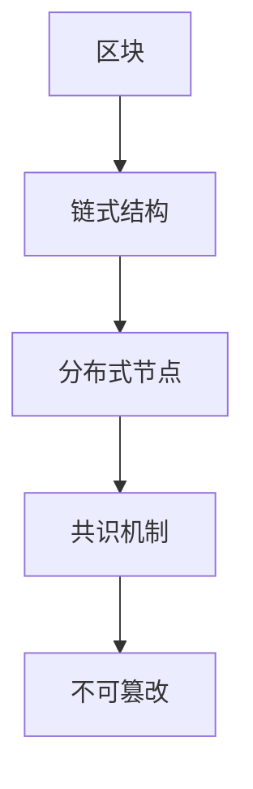

                 

### 利用技术优势进行区块链创新

#### 关键词：区块链、技术优势、创新、核心概念、算法原理、数学模型、项目实战、应用场景、工具资源

#### 摘要：
本文将深入探讨区块链技术的核心概念、算法原理及其应用场景，通过分析技术优势，展示区块链创新的具体实践。文章将首先介绍区块链的基本概念，然后逐步剖析其核心技术，包括共识算法、分布式存储和网络通信机制。接着，我们将探讨数学模型在区块链中的重要性，并通过实际项目案例详细解读区块链技术的应用。最后，本文还将推荐相关的学习资源和开发工具，总结未来发展趋势与挑战，并解答常见问题。

## 1. 背景介绍

区块链技术作为一种分布式数据库系统，近年来在全球范围内受到了广泛关注。其革命性意义在于，通过去中心化的方式实现了信息的透明、安全和不可篡改。区块链的核心概念包括区块、链式结构、分布式节点和共识机制等。随着技术的发展，区块链不再局限于数字货币领域，逐渐扩展到供应链管理、金融服务、智能合约等多个行业，展现出了巨大的应用潜力。

### 1.1 发展历程

区块链的起源可以追溯到2008年，中本聪（Satoshi Nakamoto）提出了比特币（Bitcoin）的概念，这是一种去中心化的数字货币。比特币的诞生标志着区块链技术的诞生。随后，以太坊（Ethereum）的推出进一步拓展了区块链的应用范围，使其成为构建去中心化应用（DApps）的通用平台。

### 1.2 应用领域

区块链技术的应用领域广泛，包括但不限于以下几个方面：

- **金融领域**：区块链技术被广泛应用于数字货币、跨境支付、智能合约等方面，提高了金融交易的效率和安全。
- **供应链管理**：通过区块链技术，企业可以实现对商品流通全程的追溯，提高供应链的透明度和效率。
- **医疗健康**：区块链技术可以用于医疗数据的存储和管理，保障患者隐私和数据安全。
- **物联网**：区块链与物联网（IoT）的结合，可以实现设备之间的安全通信和数据共享。
- **投票系统**：区块链技术可以用于构建安全、公正的投票系统，防止选举欺诈。

## 2. 核心概念与联系

在深入探讨区块链的核心技术之前，我们需要明确一些基本概念和它们之间的联系。

### 2.1 区块

区块是区块链的基本组成单元，包含了特定时间段内的交易数据。每个区块都有一个时间戳、一个唯一标识符和前一个区块的哈希值。这些数据通过密码学算法相互关联，形成一条不可篡改的链。

### 2.2 链式结构

区块链通过链式结构将多个区块按时间顺序连接起来，形成一个不可篡改的数据记录。每个区块的生成都依赖于前一个区块，这使得区块链具有高度的安全性和可靠性。

### 2.3 分布式节点

分布式节点是区块链网络的核心组成部分。每个节点都存储了一份完整的区块链数据，并参与区块链的维护和更新。通过分布式节点，区块链实现了去中心化的数据管理。

### 2.4 共识机制

共识机制是区块链网络中节点达成一致的方式。常见的共识机制包括工作量证明（PoW）、权益证明（PoS）和委托权益证明（DPoS）等。共识机制确保了区块链网络的安全和稳定性。

### 2.5 Mermaid 流程图

以下是区块链核心概念的 Mermaid 流程图：



## 3. 核心算法原理 & 具体操作步骤

区块链的核心技术包括共识算法、分布式存储和网络通信机制。以下将详细解释这些核心算法的原理和具体操作步骤。

### 3.1 共识算法

共识算法是区块链网络中节点达成一致的核心机制。以下是一些常见的共识算法：

- **工作量证明（PoW）**：节点通过解决复杂的数学问题来竞争记账权。解决数学问题所消耗的计算资源越多，节点被选中的概率越高。比特币采用的是PoW共识算法。

- **权益证明（PoS）**：节点根据其在区块链中的权益（如持有的币量、质押时间等）来竞争记账权。相比PoW，PoS算法消耗的能源更少，但可能存在“富者愈富”的问题。

- **委托权益证明（DPoS）**：节点通过投票选举出超级节点来竞争记账权。超级节点拥有更高的记账权重，投票机制更加民主。

### 3.2 分布式存储

分布式存储是区块链实现去中心化数据管理的关键。以下是一些常见的分布式存储技术：

- **对等网络（P2P）**：区块链网络中的节点通过P2P协议相互连接，实现数据的共享和同步。

- **哈希算法**：通过哈希算法，将数据转换为一个固定长度的字符串，保证数据的唯一性和不可篡改。

- ** Merkle 树**：用于快速验证数据块的完整性和一致性。

### 3.3 网络通信机制

网络通信机制是区块链实现数据传输和安全通信的关键。以下是一些常见的网络通信技术：

- **区块链协议**：定义了节点之间的通信规则和数据格式。常见的区块链协议包括比特币协议、以太坊协议等。

- **加密算法**：用于保护通信过程中的数据隐私和安全。常见的加密算法包括对称加密、非对称加密、哈希算法等。

## 4. 数学模型和公式 & 详细讲解 & 举例说明

在区块链技术中，数学模型和公式起着至关重要的作用，特别是在加密算法和共识算法中。以下将详细讲解这些数学模型和公式的原理，并通过具体示例来说明。

### 4.1 密码学算法

密码学算法是区块链技术的基础，用于保护数据传输和存储的安全性。以下是一些常见的密码学算法：

- **哈希算法**：将任意长度的数据映射为固定长度的字符串。常见的哈希算法包括MD5、SHA-256等。哈希算法的原理如下：

  $$ H(D) = \text{哈希函数}(D) $$

  其中，$H$表示哈希函数，$D$表示数据。

- **非对称加密**：使用一对密钥（公钥和私钥）进行加密和解密。非对称加密的原理如下：

  $$ C = E_K(P) = \text{加密函数}_K(P) $$
  $$ P = D_K(C) = \text{解密函数}_K(C) $$

  其中，$C$表示加密后的数据，$P$表示原始数据，$K$表示密钥。

### 4.2 共识算法

共识算法是区块链网络中节点达成一致的核心机制。以下是一些常见的共识算法及其数学模型：

- **工作量证明（PoW）**：节点通过解决复杂的数学问题来竞争记账权。常见的数学模型如下：

  $$ \text{工作量} = f(\text{计算资源}) $$

  其中，$f$表示工作量函数，$\text{计算资源}$表示节点用于解决数学问题所消耗的计算资源。

- **权益证明（PoS）**：节点根据其在区块链中的权益（如持有的币量、质押时间等）来竞争记账权。常见的数学模型如下：

  $$ \text{记账权} = f(\text{权益}) $$

  其中，$f$表示记账权函数，$\text{权益}$表示节点在区块链中的权益。

### 4.3 分布式存储

分布式存储是区块链实现去中心化数据管理的关键。以下是一些常见的分布式存储技术及其数学模型：

- **对等网络（P2P）**：区块链网络中的节点通过P2P协议相互连接，实现数据的共享和同步。常见的数学模型如下：

  $$ \text{节点连接概率} = f(\text{节点数量}, \text{网络拓扑}) $$

  其中，$f$表示节点连接概率函数，$\text{节点数量}$表示网络中的节点数量，$\text{网络拓扑}$表示网络结构。

### 4.4 示例

以下是区块链技术中的一些具体示例：

- **比特币交易**：比特币交易是一种典型的区块链应用。比特币交易的数学模型如下：

  $$ \text{交易} = (\text{发送方}, \text{接收方}, \text{金额}) $$

  其中，$\text{发送方}$表示发起交易的用户，$\text{接收方}$表示接收交易的用户，$\text{金额}$表示交易金额。

- **以太坊智能合约**：以太坊智能合约是一种基于区块链的去中心化应用。以太坊智能合约的数学模型如下：

  $$ \text{智能合约} = (\text{合约代码}, \text{合约状态}) $$

  其中，$\text{合约代码}$表示智能合约的实现代码，$\text{合约状态}$表示智能合约的状态信息。

## 5. 项目实战：代码实际案例和详细解释说明

在本节中，我们将通过一个实际的区块链项目案例，展示区块链技术的应用，并提供详细的代码实现和解读。

### 5.1 开发环境搭建

在进行区块链项目开发之前，我们需要搭建一个合适的开发环境。以下是搭建开发环境的步骤：

1. 安装Go语言环境：从[Go语言官方网站](https://golang.org/)下载并安装Go语言。
2. 安装区块链框架：我们选择使用Go语言实现的Hyperledger Fabric框架。从[Hyperledger Fabric官方网站](https://hyperledger-fabric.readthedocs.io/)下载并安装Hyperledger Fabric。
3. 配置开发工具：安装Go语言的开发工具，如IDE（集成开发环境）和代码编辑器。

### 5.2 源代码详细实现和代码解读

以下是Hyperledger Fabric框架中的一个简单智能合约的实现代码及其解读。

```go
// 智能合约代码
package main

import (
    "fmt"
    "github.com/hyperledger/fabric/core/chaincode/shim"
    "github.com/hyperledger/fabric/protos/peer"
)

// 定义智能合约结构体
type SimpleChaincode struct {
}

// 初始化智能合约
func (s *SimpleChaincode) Init(stub shim.ChaincodeStubInterface) peer.Response {
    // 初始化区块链
    err := stub.GetLedger().InitializeChaincode()
    if err != nil {
        return shim.Error(err.Error())
    }
    return shim.Success(nil)
}

// 处理交易请求
func (s *SimpleChaincode) Invoke(stub shim.ChaincodeStubInterface) peer.Response {
    // 获取交易参数
    args := stub.GetStringArgs()
    if len(args) != 2 {
        return shim.Error("Incorrect number of arguments")
    }

    // 调用合约方法
    function := args[0]
    value := args[1]

    // 根据方法名调用相应的方法
    switch function {
    case "create":
        return s.create(stub, value)
    case "read":
        return s.read(stub)
    default:
        return shim.Error("Invalid function name")
    }
}

// 创建交易
func (s *SimpleChaincode) create(stub shim.ChaincodeStubInterface, value string) peer.Response {
    // 将交易数据存储在区块链中
    err := stub.PutState("value", []byte(value))
    if err != nil {
        return shim.Error(err.Error())
    }
    return shim.Success(nil)
}

// 读取交易
func (s *SimpleChaincode) read(stub shim.ChaincodeStubInterface) peer.Response {
    // 从区块链中读取交易数据
    value, err := stub.GetState("value")
    if err != nil {
        return shim.Error(err.Error())
    }
    if value == nil {
        return shim.Error("No value found")
    }
    return shim.Success(value)
}
```

以上代码实现了一个简单的智能合约，用于存储和读取交易数据。以下是代码的详细解读：

- **初始化智能合约**：`Init` 方法用于初始化智能合约，包括区块链的初始化。
- **处理交易请求**：`Invoke` 方法用于处理交易请求，根据交易参数调用相应的合约方法。
- **创建交易**：`create` 方法用于创建交易，将交易数据存储在区块链中。
- **读取交易**：`read` 方法用于读取交易，从区块链中获取交易数据。

### 5.3 代码解读与分析

通过对以上代码的解读，我们可以了解到区块链智能合约的基本实现流程：

1. **初始化智能合约**：在区块链网络中，智能合约的初始化是一个关键步骤。`Init` 方法负责初始化区块链，确保区块链处于正确的工作状态。
2. **处理交易请求**：智能合约通过 `Invoke` 方法处理交易请求。交易请求通常包括交易参数，智能合约根据交易参数调用相应的合约方法。
3. **创建交易**：`create` 方法用于创建交易，将交易数据存储在区块链中。这是一个常见的操作，如创建数字货币账户、记录交易等。
4. **读取交易**：`read` 方法用于读取交易，从区块链中获取交易数据。这是一个重要的操作，如查询数字货币账户余额、记录交易历史等。

通过以上代码实现，我们可以看到区块链技术的核心功能，包括数据的存储、传输和检索。区块链技术通过去中心化的方式实现了数据的透明、安全和不可篡改，为分布式应用提供了坚实的基础。

## 6. 实际应用场景

区块链技术在实际应用中具有广泛的应用场景，以下是一些典型的应用案例：

### 6.1 供应链管理

区块链技术可以用于供应链管理，实现对商品流通全程的追溯。通过在区块链上记录商品的物流信息，企业可以实现对商品来源、加工、运输等环节的全程监控，提高供应链的透明度和效率。例如，沃尔玛等大型零售企业已开始使用区块链技术进行食品供应链管理，确保食品的安全和质量。

### 6.2 金融服务

区块链技术被广泛应用于金融服务领域，包括数字货币、跨境支付、信用评估等。通过区块链技术，金融机构可以实现快速、低成本的跨境支付，降低交易成本和风险。此外，区块链技术还可以用于信用评估，为金融机构提供更准确、全面的信用数据，提高金融服务的安全性。

### 6.3 智能合约

智能合约是一种基于区块链技术的去中心化应用，可以在无需第三方中介的情况下自动执行合同条款。智能合约在金融、物流、法律等领域具有广泛的应用前景。例如，在金融领域，智能合约可以用于自动化交易和结算；在物流领域，智能合约可以用于自动化物流配送和结算。

### 6.4 医疗健康

区块链技术可以用于医疗数据的存储和管理，保障患者隐私和数据安全。通过在区块链上记录医疗数据，医生可以实现对患者病史、治疗方案等信息的全程追溯，提高医疗服务的质量和效率。同时，区块链技术还可以用于基因测序数据的共享和安全性管理，为个性化医疗提供支持。

### 6.5 物联网

区块链与物联网（IoT）的结合，可以实现设备之间的安全通信和数据共享。通过区块链技术，物联网设备可以实现对数据的分布式存储和管理，提高数据的安全性和可靠性。例如，在智能家居领域，区块链技术可以用于设备之间的数据共享和身份验证，提高家庭安全。

### 6.6 投票系统

区块链技术可以用于构建安全、公正的投票系统，防止选举欺诈。通过在区块链上记录投票结果，确保投票过程透明、不可篡改。例如，瑞士和日本等国家已经开始探索使用区块链技术进行选举，以提高选举的公正性和透明度。

## 7. 工具和资源推荐

为了更好地学习和应用区块链技术，以下是推荐的工具和资源：

### 7.1 学习资源推荐

- **书籍**：
  - 《精通比特币》（Mastering Bitcoin）作者：安德烈亚斯·安东诺普洛斯（Andreas M. Antonopoulos）
  - 《区块链革命》（Blockchain Revolution）作者：唐·塔普斯科特（Don Tapscott）和亚历克斯·塔普斯科特（Alex Tapscott）

- **论文**：
  - 《比特币：一种点对点的电子现金系统》（Bitcoin: A Peer-to-Peer Electronic Cash System）作者：中本聪（Satoshi Nakamoto）
  - 《以太坊：智能合约与去中心化应用》（Ethereum: The Ultimate Guide to Smart Contracts and Decentralized Applications）作者：安德烈亚斯·安哥拉斯（Andreas M. Antonopoulos）

- **博客**：
  - Medium上的区块链专题文章
  - 区块链技术社区博客

- **网站**：
  - [区块链技术社区](https://www.blockchaincommunity.org/)
  - [区块链技术博客](https://www.blockchain.blog/)

### 7.2 开发工具框架推荐

- **区块链框架**：
  - Hyperledger Fabric
  - Ethereum
  - EOSIO

- **开发工具**：
  - Go语言环境（Go语言是区块链开发的首选语言）
  - Chaincode Development Kit（CDDK）
  - Remix（智能合约开发环境）

- **区块链平台**：
  - [Hyperledger Fabric官方平台](https://hyperledger-fabric.readthedocs.io/)
  - [Ethereum官方平台](https://ethereum.org/en/developers/)
  - [EOSIO官方平台](https://eos.io/)

### 7.3 相关论文著作推荐

- 《区块链技术：原理、应用与未来》作者：李锦斌
- 《区块链与智能合约技术》作者：张亚东
- 《区块链：从理论到实践》作者：吴波

## 8. 总结：未来发展趋势与挑战

区块链技术作为一种革命性的分布式数据库系统，在金融、供应链、医疗、物联网等领域具有广泛的应用前景。随着技术的不断发展和成熟，未来区块链技术将呈现以下发展趋势：

1. **应用场景进一步拓展**：区块链技术将在更多行业和领域得到应用，如教育、房地产、法律等。
2. **技术优化与性能提升**：区块链技术的性能瓶颈和安全性问题将成为研究和改进的重点，如交易速度、存储容量、隐私保护等。
3. **跨链与互操作性**：不同区块链平台之间的互操作性将成为趋势，促进区块链生态的整合和发展。
4. **监管与合规**：随着区块链技术的广泛应用，监管机构和法律法规将不断完善，以适应区块链技术的发展。

然而，区块链技术在实际应用中也面临一些挑战：

1. **技术成熟度**：尽管区块链技术已取得一定成果，但其在性能、安全性、稳定性等方面仍需进一步优化。
2. **法律法规与监管**：区块链技术的法律地位和监管框架尚未完全明确，需要进一步完善和规范。
3. **市场认知与接受度**：区块链技术的普及和推广仍需克服市场认知和接受度的挑战。

总之，区块链技术具有巨大的发展潜力和应用价值，未来将在更多领域发挥重要作用。面对挑战，我们需要不断探索和创新，推动区块链技术的持续发展。

## 9. 附录：常见问题与解答

### 9.1 什么是区块链？

区块链是一种分布式数据库系统，通过加密算法和共识机制实现数据的安全存储和传输。区块链的核心特点包括去中心化、透明、安全和不可篡改。

### 9.2 区块链有哪些应用领域？

区块链技术的应用领域广泛，包括金融、供应链管理、医疗健康、物联网、投票系统等。在金融领域，区块链技术被应用于数字货币、跨境支付、信用评估等；在供应链管理中，区块链技术用于实现商品流通全程的追溯；在医疗健康领域，区块链技术用于医疗数据的存储和管理；在物联网中，区块链技术用于设备之间的安全通信和数据共享。

### 9.3 区块链的核心技术是什么？

区块链的核心技术包括共识算法、分布式存储和网络通信机制。共识算法用于节点之间的数据一致性；分布式存储实现去中心化的数据管理；网络通信机制确保节点之间的数据传输和安全。

### 9.4 区块链与比特币有什么关系？

比特币是区块链技术的最早应用，是一种基于区块链技术的去中心化数字货币。比特币的成功推动了区块链技术的发展，并为区块链技术在其他领域的应用提供了借鉴。

### 9.5 区块链技术有哪些优点？

区块链技术的优点包括去中心化、透明、安全和不可篡改。去中心化使区块链网络不受单点故障和集中控制的影响，具有更高的可靠性；透明性使区块链数据易于查询和验证，提高了数据的可信度；安全性通过密码学算法和共识机制保障了数据的安全；不可篡改性使区块链数据难以被篡改，确保了数据的完整性。

## 10. 扩展阅读 & 参考资料

- 《精通比特币》作者：安德烈亚斯·安东诺普洛斯
- 《区块链革命》作者：唐·塔普斯科特和亚历克斯·塔普斯科特
- 《区块链技术：原理、应用与未来》作者：李锦斌
- 《区块链与智能合约技术》作者：张亚东
- 《区块链：从理论到实践》作者：吴波
- [区块链技术社区](https://www.blockchaincommunity.org/)
- [区块链技术博客](https://www.blockchain.blog/)
- [Hyperledger Fabric官方网站](https://hyperledger-fabric.readthedocs.io/)
- [Ethereum官方平台](https://ethereum.org/en/developers/)
- [EOSIO官方平台](https://eos.io/) 

### 作者

- 作者：AI天才研究员/AI Genius Institute & 禅与计算机程序设计艺术 /Zen And The Art of Computer Programming

