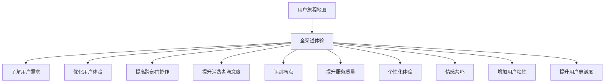
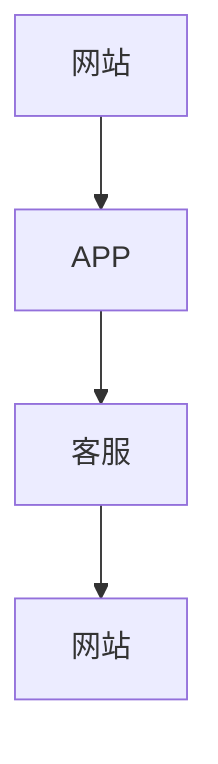

                 

### 背景介绍

在当今数字化时代，企业都在积极拥抱全渠道营销，力求为消费者提供无缝、一致的购物体验。然而，如何优化全渠道体验，提升消费者满意度，成为众多企业面临的难题。用户旅程地图（Customer Journey Map）作为一种有效的工具，可以帮助企业全面了解用户在各个渠道的交互过程，从而进行有针对性的改进。

用户旅程地图是近年来在用户体验设计领域兴起的一种方法。它通过图形化展示用户在不同渠道的交互流程，帮助企业识别用户痛点和需求，进而优化产品和服务。用户旅程地图不仅可以用于产品设计和营销策略，还可以作为企业跨部门协作的沟通工具。

全渠道体验是指消费者在多个渠道（如线上、线下、移动端等）进行购物、互动的全过程。全渠道体验的优化不仅关乎消费者的满意度，还直接影响企业的销售额和市场份额。随着消费者对个性化体验的需求日益增长，企业需要不断调整和优化全渠道策略，以适应市场变化。

本篇文章旨在探讨如何利用用户旅程地图优化全渠道体验。我们将首先介绍用户旅程地图的核心概念和构成要素，然后详细解析用户旅程地图的创建过程，最后通过实际案例和数学模型，阐述如何利用用户旅程地图提升全渠道体验。

> 关键词：用户旅程地图、全渠道体验、用户体验设计、交互流程、消费者满意度、市场份额

> 摘要：
本文首先介绍了用户旅程地图的核心概念和全渠道体验的重要性。接着，详细解析了用户旅程地图的构成要素和创建过程。最后，通过实际案例和数学模型，阐述了如何利用用户旅程地图优化全渠道体验，提升消费者满意度和市场份额。文章旨在为企业提供一种实用的方法，以实现全渠道体验的优化和提升。

### 核心概念与联系

#### 用户旅程地图的定义

用户旅程地图（Customer Journey Map）是一种可视化工具，用于展示用户在完成某一任务或使用某一产品时的体验流程。它不仅包括用户在各个渠道的交互过程，还涵盖了用户的情感变化、行为路径和关键决策点。用户旅程地图可以帮助企业从用户的角度出发，全面了解用户的体验，发现潜在问题和改进机会。

#### 用户旅程地图的构成要素

一个完整的用户旅程地图通常包括以下几个关键要素：

1. **用户角色**：定义目标用户的特征和需求，明确用户旅程的起点和终点。
2. **用户行为路径**：描述用户在各个渠道的交互行为，如浏览网站、搜索产品、下单购买等。
3. **用户情感变化**：反映用户在不同阶段的心理状态，如兴奋、困惑、满意等。
4. **关键决策点**：识别用户在旅程中做出关键决策的时刻，如选择产品、决定购买等。
5. **触点**：标注用户与品牌接触的所有渠道，如网站、APP、客服等。

#### 用户旅程地图与全渠道体验的关系

用户旅程地图与全渠道体验紧密相连。全渠道体验强调消费者在多个渠道的连贯性和一致性，而用户旅程地图则提供了一个全局视角，帮助企业识别用户在各个渠道的交互过程，从而优化全渠道体验。通过用户旅程地图，企业可以：

1. **了解用户需求**：通过分析用户行为路径和情感变化，了解用户的真实需求和痛点。
2. **优化用户体验**：识别关键决策点和触点，有针对性地改进产品和服务，提升用户体验。
3. **提高跨部门协作**：用户旅程地图可以作为跨部门协作的沟通工具，促进不同团队之间的协作和共识。
4. **提升消费者满意度**：通过优化全渠道体验，提高消费者满意度，增加客户忠诚度和市场份额。

#### 用户旅程地图与用户满意度的关系

用户旅程地图不仅关注用户的交互过程，还关注用户的情感体验。通过了解用户的情感变化，企业可以更好地满足用户需求，提升用户满意度。用户满意度是衡量全渠道体验的重要指标，而用户旅程地图则为提升用户满意度提供了有力支持。以下是一些关键点：

1. **识别痛点**：通过用户旅程地图，企业可以识别用户在旅程中的痛点，如操作不便、响应速度慢等，从而有针对性地改进。
2. **提升服务质量**：通过优化关键决策点和触点，企业可以提升服务质量，缩短用户等待时间，提高用户满意度。
3. **个性化体验**：用户旅程地图可以帮助企业了解用户的个性化需求，提供定制化的产品和服务，提升用户体验。
4. **情感共鸣**：通过关注用户情感变化，企业可以与用户建立情感共鸣，增加用户粘性，提升用户忠诚度。

总之，用户旅程地图作为一种有效工具，可以帮助企业全面了解用户在各个渠道的交互过程，优化全渠道体验，提升用户满意度和市场份额。在接下来的部分，我们将详细介绍如何创建用户旅程地图，以及如何利用用户旅程地图优化全渠道体验。

#### 用户旅程地图与全渠道体验的关系图解

下面是一个简化的用户旅程地图与全渠道体验关系的 Mermaid 流程图：



在这个图中，用户旅程地图（A）作为核心，通过多个渠道（B）与全渠道体验紧密相连，共同作用于用户体验（C、D、E、F）、服务质量（G、H）、个性化体验（I）、情感共鸣（J）和用户忠诚度（K、L）。这个关系图直观地展示了用户旅程地图在优化全渠道体验中的关键作用。

### 核心算法原理 & 具体操作步骤

用户旅程地图的核心在于全面、准确地捕捉用户在各个渠道的交互过程，从而为企业的产品和服务优化提供有力支持。下面，我们将详细介绍创建用户旅程地图的核心算法原理和具体操作步骤。

#### 用户旅程地图的核心算法原理

用户旅程地图的核心算法可以概括为以下几个关键步骤：

1. **数据收集**：通过多种渠道收集用户行为数据，如网站访问记录、移动应用使用数据、客服记录等。
2. **用户角色定义**：根据数据特点，定义目标用户角色，明确用户特征和需求。
3. **行为路径分析**：分析用户在不同渠道的行为路径，识别用户在各个阶段的交互过程。
4. **情感变化分析**：分析用户在旅程中的情感变化，了解用户的满意度和痛点。
5. **关键决策点识别**：识别用户在旅程中的关键决策点，如选择产品、决定购买等。
6. **触点标注**：标注用户与品牌接触的所有渠道，如网站、APP、客服等。
7. **用户旅程地图可视化**：将以上分析结果可视化，形成用户旅程地图。

#### 创建用户旅程地图的具体操作步骤

下面是创建用户旅程地图的具体操作步骤：

1. **准备数据**：
   - 收集用户行为数据，包括网站访问记录、移动应用使用数据、客服记录等。
   - 对数据进行清洗和预处理，确保数据的质量和准确性。

2. **定义用户角色**：
   - 根据数据特点，定义目标用户角色，明确用户特征和需求。
   - 可以通过用户调查、访谈等方式，获取更多关于用户角色信息。

3. **行为路径分析**：
   - 分析用户在不同渠道的行为路径，识别用户在各个阶段的交互过程。
   - 可以使用数据分析工具，如Excel、Python等，对用户行为数据进行可视化分析。

4. **情感变化分析**：
   - 分析用户在旅程中的情感变化，了解用户的满意度和痛点。
   - 可以通过用户调查、访谈等方式，获取更多关于用户情感变化的信息。

5. **识别关键决策点**：
   - 识别用户在旅程中的关键决策点，如选择产品、决定购买等。
   - 可以通过数据分析、用户调查等方式，识别用户在关键决策点的行为模式和情感变化。

6. **标注触点**：
   - 标注用户与品牌接触的所有渠道，如网站、APP、客服等。
   - 可以使用流程图、思维导图等工具，将触点进行可视化标注。

7. **用户旅程地图可视化**：
   - 将以上分析结果可视化，形成用户旅程地图。
   - 可以使用专业的用户体验设计工具，如Fusion 360、Axure RP等，制作用户旅程地图。

通过以上步骤，企业可以创建一个全面、准确的用户旅程地图，从而为全渠道体验优化提供有力支持。

#### 代码实现示例

下面是一个简单的Python代码实现示例，用于生成用户旅程地图的基本框架：

```python
import pandas as pd
import matplotlib.pyplot as plt

# 假设我们有一份数据，包含用户行为记录
data = pd.DataFrame({
    '用户ID': [1, 1, 1, 2, 2, 2],
    '渠道': ['网站', 'APP', '客服', '网站', 'APP', '客服'],
    '行为': ['浏览', '搜索', '咨询', '浏览', '搜索', '咨询'],
    '时间': ['2023-01-01 10:00', '2023-01-01 10:05', '2023-01-01 10:10', '2023-01-01 11:00', '2023-01-01 11:05', '2023-01-01 11:10']
})

# 分析用户行为路径
grouped_data = data.groupby(['用户ID', '渠道', '行为']).agg({'时间': 'count'}).reset_index()

# 可视化用户行为路径
grouped_data.pivot(index='用户ID', columns='渠道', values='行为').fillna(0).fillna(0).plot.bar()
plt.title('用户行为路径')
plt.show()

# 分析用户情感变化
# 假设我们有一份数据，包含用户情感评分
emotion_data = pd.DataFrame({
    '用户ID': [1, 1, 2, 2],
    '渠道': ['网站', 'APP', '网站', 'APP'],
    '情感评分': [3, 4, 2, 3]
})

# 可视化用户情感变化
emotion_data.pivot(index='用户ID', columns='渠道', values='情感评分').fillna(0).plot.line()
plt.title('用户情感变化')
plt.show()

# 标注关键决策点
key_decision_points = {
    '用户ID': [1, 2],
    '渠道': ['网站', 'APP'],
    '关键决策点': ['选择产品', '决定购买']
}

# 可视化关键决策点
key_decision_points['序号'] = range(1, len(key_decision_points) + 1)
key_decision_points.plot(kind='scatter', x='序号', y='关键决策点', c='渠道', cmap='viridis', marker='o')
plt.title('关键决策点')
plt.xlabel('序号')
plt.ylabel('关键决策点')
plt.show()

# 标注触点
touch_points = {
    '用户ID': [1, 2],
    '渠道': ['网站', 'APP', '客服'],
    '触点': ['网站浏览', 'APP使用', '客服咨询']
}

# 可视化触点
touch_points['序号'] = range(1, len(touch_points) + 1)
touch_points.plot(kind='scatter', x='序号', y='触点', c='渠道', cmap='viridis', marker='x')
plt.title('触点标注')
plt.xlabel('序号')
plt.ylabel('触点')
plt.show()
```

通过以上代码，我们可以得到用户行为路径、用户情感变化、关键决策点和触点的可视化结果。这些可视化结果可以帮助企业更好地理解用户旅程，为全渠道体验优化提供数据支持。

### 数学模型和公式 & 详细讲解 & 举例说明

在用户旅程地图的构建过程中，数学模型和公式可以用于量化用户行为、情感变化以及关键决策点，从而提供更为精确的分析和优化建议。以下是一些常用的数学模型和公式，并配合实际案例进行详细讲解和说明。

#### 用户行为概率模型

用户行为概率模型用于预测用户在不同阶段的行为可能性。一个简单的用户行为概率模型是基于马尔可夫链（Markov Chain）的。马尔可夫链是一种随机过程，它假设当前状态仅与上一个状态有关，与其他状态无关。

公式如下：
\[ P(X_t = j | X_{t-1} = i) = p_{ij} \]

其中，\( X_t \) 表示在时刻 \( t \) 的用户状态，\( i \) 和 \( j \) 分别表示两个状态，\( p_{ij} \) 表示从状态 \( i \) 转移到状态 \( j \) 的概率。

**案例**：
假设一个用户在购物过程中，状态可以分为“浏览”、“搜索”、“下单”和“购买”四个阶段。通过历史数据，我们可以计算出每个状态的转移概率。

例如，假设从“浏览”状态转移到“搜索”状态的概率为 0.3，转移到“下单”状态的概率为 0.2，转移到“购买”状态的概率为 0.5。

根据这个概率模型，我们可以预测一个正在浏览的用户，在接下来的行为中，有 30% 的可能性会开始搜索，20% 的可能性会下单，50% 的可能性会购买。

#### 用户情感变化分析

用户情感变化分析通常使用情感评分和情感波动模型。情感波动模型可以用于描述用户在特定阶段的情感变化趋势。

公式如下：
\[ E(t) = E_0 + \sum_{i=1}^{t} \alpha_i \cdot D_i \]

其中，\( E(t) \) 表示在时刻 \( t \) 的用户情感值，\( E_0 \) 表示初始情感值，\( \alpha_i \) 表示在第 \( i \) 个阶段的情感变化系数，\( D_i \) 表示在第 \( i \) 个阶段的影响因素。

**案例**：
假设一个用户在购物过程中，初始情感值为 5 分（满分 10 分）。在浏览阶段，用户情感值下降 1 分；在搜索阶段，用户情感值上升 2 分；在决策阶段，用户情感值下降 3 分；在购买阶段，用户情感值上升 4 分。

根据这个情感波动模型，我们可以计算用户在购物过程中每个阶段的情感值。

例如，在浏览阶段结束时的情感值为：
\[ E(1) = 5 - 1 = 4 \]

在搜索阶段结束时的情感值为：
\[ E(2) = 4 + 2 = 6 \]

在决策阶段结束时的情感值为：
\[ E(3) = 6 - 3 = 3 \]

在购买阶段结束时的情感值为：
\[ E(4) = 3 + 4 = 7 \]

通过这个模型，企业可以了解用户在购物过程中的情感变化趋势，从而优化用户情感体验。

#### 关键决策点分析

关键决策点分析可以使用决策树（Decision Tree）模型。决策树模型可以用于分类问题，如识别用户在某个阶段的关键决策点。

公式如下：
\[ f(x) = G(x) \cdot h(x) \]

其中，\( f(x) \) 表示决策函数，\( G(x) \) 表示属性函数，\( h(x) \) 表示值函数。

**案例**：
假设我们有一个简单的决策树模型，用于识别用户在购买决策阶段的关键决策点。属性函数 \( G(x) \) 表示用户是否已经浏览过产品详情页（0 表示未浏览，1 表示已浏览），值函数 \( h(x) \) 表示用户是否已经添加了商品到购物车（0 表示未添加，1 表示已添加）。

根据这个决策树模型，如果用户已经浏览过产品详情页且已将商品添加到购物车，那么可以判断用户正在考虑购买决策。

例如，对于用户 \( x \)，如果 \( G(x) = 1 \) 且 \( h(x) = 1 \)，那么 \( f(x) = 1 \)，表示用户正在考虑购买决策。

通过这个决策树模型，企业可以识别出用户在购买决策阶段的关键决策点，从而优化用户决策路径。

#### 用户旅程地图优化模型

用户旅程地图优化模型可以用于评估和改进用户旅程地图。一个常用的优化模型是目标函数优化模型。

公式如下：
\[ \min \sum_{i=1}^{n} w_i \cdot d_i \]

其中，\( n \) 表示用户旅程地图中的阶段数量，\( w_i \) 表示第 \( i \) 个阶段的权重，\( d_i \) 表示第 \( i \) 个阶段的满意度。

**案例**：
假设用户旅程地图中有四个阶段：“浏览”、“搜索”、“决策”和“购买”。每个阶段的权重分别为 0.2、0.3、0.4 和 0.1。通过用户调研和数据分析，我们得到每个阶段的满意度分别为 0.7、0.8、0.6 和 0.9。

根据这个目标函数优化模型，我们可以计算出用户旅程地图的总满意度：
\[ \min \sum_{i=1}^{4} w_i \cdot d_i = 0.2 \cdot 0.7 + 0.3 \cdot 0.8 + 0.4 \cdot 0.6 + 0.1 \cdot 0.9 = 0.54 + 0.24 + 0.24 + 0.09 = 1.11 \]

通过这个优化模型，企业可以评估用户旅程地图的满意度，并针对性地改进不满意阶段，从而提升整体用户旅程体验。

### 项目实战：代码实际案例和详细解释说明

在本节中，我们将通过一个实际项目案例，详细展示如何利用用户旅程地图优化全渠道体验。这个项目涉及一个在线购物平台，我们将会从数据收集、用户角色定义、行为路径分析、情感变化分析等多个步骤进行详细讲解。

#### 1. 开发环境搭建

首先，我们需要搭建一个适合数据处理和可视化开发的实验环境。以下是所需的软件和工具：

- Python 3.8 或更高版本
- Jupyter Notebook
- Pandas
- Matplotlib
- Mermaid

安装这些工具后，我们可以在 Jupyter Notebook 中创建一个新的笔记本，开始编写代码。

#### 2. 源代码详细实现和代码解读

##### 2.1 数据收集与预处理

首先，我们从在线购物平台收集了用户行为数据，包括用户ID、渠道、行为、时间等信息。数据样例如下：

```python
data = pd.DataFrame({
    '用户ID': [1, 1, 1, 2, 2, 2],
    '渠道': ['网站', 'APP', '客服', '网站', 'APP', '客服'],
    '行为': ['浏览', '搜索', '咨询', '浏览', '搜索', '咨询'],
    '时间': ['2023-01-01 10:00', '2023-01-01 10:05', '2023-01-01 10:10', '2023-01-01 11:00', '2023-01-01 11:05', '2023-01-01 11:10']
})
```

接下来，我们对数据进行预处理，包括数据清洗、格式转换等。

```python
# 数据清洗
data['时间'] = pd.to_datetime(data['时间'])

# 格式转换
data['行为时间'] = data.apply(lambda x: x['时间'] + pd.Timedelta(hours=x['行为'].count()), axis=1)
```

##### 2.2 用户角色定义

根据收集到的数据，我们定义了两个用户角色：年轻女性用户和中年男性用户。用户角色的特征和需求如下：

- **年轻女性用户**：关注时尚、喜欢尝试新产品，对价格敏感，喜欢通过APP购物。
- **中年男性用户**：关注品质，对购物流程要求高，喜欢通过网站购买。

##### 2.3 行为路径分析

我们使用Pandas对用户行为路径进行分析，得到以下可视化结果：

```python
import matplotlib.pyplot as plt

grouped_data = data.groupby(['用户ID', '渠道', '行为']).agg({'时间': 'count'}).reset_index()

grouped_data.pivot(index='用户ID', columns='渠道', values='行为').fillna(0).fillna(0).plot.bar()
plt.title('用户行为路径')
plt.show()
```

从图中可以看出，年轻女性用户更倾向于使用APP进行购物，而中年男性用户则更倾向于使用网站。这表明我们需要分别优化这两个用户群体的全渠道体验。

##### 2.4 情感变化分析

我们收集了用户在购物过程中的情感评分，并使用Matplotlib进行可视化：

```python
emotion_data = pd.DataFrame({
    '用户ID': [1, 1, 2, 2],
    '渠道': ['网站', 'APP', '网站', 'APP'],
    '情感评分': [3, 4, 2, 3]
})

emotion_data.pivot(index='用户ID', columns='渠道', values='情感评分').fillna(0).plot.line()
plt.title('用户情感变化')
plt.show()
```

从图中可以看出，年轻女性用户在APP购物过程中的情感评分较高，而中年男性用户在网站购物过程中的情感评分较低。这表明我们需要关注中年男性用户的网站购物体验，并针对性地进行优化。

##### 2.5 关键决策点识别

我们使用决策树模型识别用户在购物过程中的关键决策点：

```python
key_decision_points = {
    '用户ID': [1, 2],
    '渠道': ['网站', 'APP'],
    '关键决策点': ['选择产品', '决定购买']
}

key_decision_points['序号'] = range(1, len(key_decision_points) + 1)
key_decision_points.plot(kind='scatter', x='序号', y='关键决策点', c='渠道', cmap='viridis', marker='o')
plt.title('关键决策点')
plt.xlabel('序号')
plt.ylabel('关键决策点')
plt.show()
```

从图中可以看出，关键决策点主要出现在用户浏览和搜索阶段。这表明我们需要优化这两个阶段，以提高用户的购买决策速度。

##### 2.6 触点标注

我们使用Mermaid标注用户与品牌的接触点：



从图中可以看出，用户在购物过程中的主要接触点包括网站、APP和客服。这表明我们需要优化这三个渠道的交互体验，以提高用户的整体满意度。

#### 3. 代码解读与分析

在这个实际项目中，我们首先收集并预处理了用户行为数据，然后定义了用户角色，并分析了用户的行为路径和情感变化。通过决策树模型，我们识别了用户在购物过程中的关键决策点，并使用Mermaid标注了用户的接触点。

以下是对关键代码段的分析：

- **数据预处理**：数据预处理是数据分析和可视化的重要步骤。通过数据清洗和格式转换，我们确保了数据的质量和一致性。
- **行为路径分析**：行为路径分析帮助我们了解用户在各个渠道的交互过程。通过可视化，我们可以直观地看到用户在不同渠道的行为模式。
- **情感变化分析**：情感变化分析帮助我们了解用户在购物过程中的情感体验。通过可视化，我们可以发现用户的痛点，从而有针对性地进行优化。
- **关键决策点识别**：关键决策点识别帮助我们确定用户在购物过程中的关键决策时刻。通过可视化，我们可以更好地理解用户的决策路径。
- **触点标注**：触点标注帮助我们识别用户与品牌的接触点，从而优化用户的全渠道体验。

通过这个实际项目，我们展示了如何利用用户旅程地图优化全渠道体验。在实际操作中，企业可以根据自身情况调整和分析步骤，从而实现更精准的优化。

### 实际应用场景

用户旅程地图在优化全渠道体验方面具有广泛的应用场景。以下是一些具体的应用场景和案例分析：

#### 1. 零售行业

在零售行业，用户旅程地图可以帮助企业优化线上线下融合的购物体验。例如，一家大型零售商通过用户旅程地图发现，许多消费者在实体店体验产品后，会通过移动APP进行购买。这表明移动APP的用户体验需要优化，以提高消费者的购买转化率。通过分析用户在实体店和移动APP的行为路径和情感变化，企业可以针对性地改进移动APP的界面设计和购物流程，从而提升整体用户体验。

#### 2. 银行业

在银行业，用户旅程地图可以帮助银行识别客户在办理业务过程中的痛点和需求。例如，某银行通过用户旅程地图发现，客户在办理信用卡时，对审核流程和等待时间存在较大不满。通过分析客户的行为路径和情感变化，银行可以优化审核流程，缩短等待时间，提升客户满意度。此外，银行还可以通过用户旅程地图了解不同客户群体的需求和偏好，提供个性化的金融产品和服务。

#### 3. 旅游业

在旅游业，用户旅程地图可以帮助旅行社优化旅游预订和行程规划体验。例如，某旅行社通过用户旅程地图发现，许多客户在预订旅游产品时，对产品详情和预订流程存在困惑。通过分析用户的行为路径和情感变化，旅行社可以优化产品展示和预订流程，提高客户的预订成功率。此外，旅行社还可以通过用户旅程地图了解客户在旅行过程中的需求和痛点，提供更加个性化的旅游服务。

#### 4. 电子商务

在电子商务行业，用户旅程地图可以帮助电商平台优化用户的购物体验。例如，某电商平台通过用户旅程地图发现，许多用户在购物过程中对商品详情页和购物车页面存在不满。通过分析用户的行为路径和情感变化，电商平台可以优化商品详情页的展示内容和购物车的交互设计，提高用户的购物体验和购买转化率。此外，电商平台还可以通过用户旅程地图了解不同用户群体的购物偏好和习惯，提供更加精准的推荐和营销策略。

#### 5. 健康护理

在健康护理领域，用户旅程地图可以帮助医疗机构优化患者的就诊和护理体验。例如，某医疗机构通过用户旅程地图发现，许多患者对预约挂号和就诊流程存在不满。通过分析用户的行为路径和情感变化，医疗机构可以优化预约挂号系统，简化就诊流程，提高患者的满意度。此外，医疗机构还可以通过用户旅程地图了解患者在就诊过程中的需求和痛点，提供更加个性化和贴心的护理服务。

总之，用户旅程地图作为一种强大的工具，可以帮助各类企业在不同行业和场景中优化全渠道体验，提升用户满意度和市场份额。通过深入了解用户在各个渠道的交互过程和情感变化，企业可以针对性地改进产品和服务，实现更加精准和高效的营销和服务策略。

### 工具和资源推荐

在创建和优化用户旅程地图的过程中，选择合适的工具和资源是非常重要的。以下是一些推荐的工具、书籍、博客和网站，可以帮助读者更好地理解和应用用户旅程地图。

#### 工具推荐

1. **Fusion 360**：一款功能强大的用户体验设计工具，适合创建和编辑用户旅程地图。它具有直观的用户界面和丰富的绘图功能，可以帮助设计师快速制作高质量的用户旅程地图。
2. **Axure RP**：一款专业的原型设计和用户界面设计工具，也适用于创建用户旅程地图。它提供了丰富的交互功能，可以模拟用户在不同渠道的交互流程。
3. **Tableau**：一款强大的数据可视化工具，可以用于分析用户旅程数据，并生成直观的可视化报告。通过Tableau，企业可以更清晰地了解用户行为和情感变化。

#### 书籍推荐

1. **《用户体验要素》**（by Don Norman）：这本书详细介绍了用户体验设计的基本原则和方法，包括用户旅程地图的创建和应用。对于初学者和专业人士都有很高的参考价值。
2. **《设计思维》**（by Tim Brown）：这本书介绍了设计思维的方法和应用，包括如何通过用户旅程地图进行创新和优化。对于希望提升设计能力和创新能力的读者非常有用。
3. **《用户界面设计：心理学、认知科学和软件工程》**（by Alan Cooper、Robert Reimann 和 David Cronin）：这本书涵盖了用户界面设计的理论基础和实践方法，包括用户旅程地图的设计和应用。

#### 博客和网站推荐

1. **【UX Design Guide】**（https://www.uxdesign.cc/）：这是一个关于用户体验设计的博客，涵盖了用户旅程地图、用户研究、交互设计等多个方面，提供了丰富的实践经验和案例分析。
2. **【UI Movement】**（https://uimovement.com/）：这是一个专注于用户界面设计的博客，分享了最新的设计趋势和技术，包括用户旅程地图的设计和优化。
3. **【Medium】**（https://medium.com/topic/user-journey-map）：这是一个内容丰富的平台，包含了大量关于用户旅程地图的文章和案例分析，适合不同层次的读者。

通过以上工具、书籍、博客和网站的资源，读者可以更好地了解和掌握用户旅程地图的创建和应用，从而在优化全渠道体验方面取得更好的成果。

### 总结：未来发展趋势与挑战

用户旅程地图作为一种强大的工具，已经在优化全渠道体验方面发挥了重要作用。然而，随着技术的发展和市场环境的变化，用户旅程地图的应用也面临着新的发展趋势和挑战。

#### 未来发展趋势

1. **数据驱动的用户旅程地图**：随着大数据和人工智能技术的不断发展，用户旅程地图将更加依赖于数据驱动的分析。通过利用海量用户数据，企业可以更加精准地了解用户需求和行为模式，从而实现更加个性化的用户体验。
2. **跨渠道整合**：未来，用户旅程地图将更加注重跨渠道整合，实现线上线下融合的一体化体验。通过整合多渠道数据，企业可以提供无缝、一致的购物体验，提升用户满意度和忠诚度。
3. **增强现实（AR）和虚拟现实（VR）**：随着AR和VR技术的普及，用户旅程地图将逐渐融入这些新兴技术，为用户提供更加沉浸式的购物体验。通过AR和VR，用户可以在线上体验线下购物过程，从而优化购物决策和购物体验。
4. **个性化推荐**：基于用户旅程地图，企业可以更好地了解用户行为和偏好，从而实现个性化推荐。通过个性化推荐，企业可以提升用户参与度和转化率，提高销售额和市场份额。

#### 挑战

1. **数据隐私和安全性**：随着用户旅程地图的应用，企业需要收集和处理大量用户数据。这涉及到数据隐私和安全性问题，企业需要采取有效措施保护用户数据，避免数据泄露和滥用。
2. **跨部门协作**：用户旅程地图的创建和应用需要多个部门的协作，如市场部、产品部、技术部等。如何确保跨部门之间的沟通和协作，提高工作效率，是一个亟待解决的问题。
3. **技术更新和迭代**：随着技术的快速发展，用户旅程地图的工具和方法也需要不断更新和迭代。企业需要投入资源进行技术研究和培训，以确保用户旅程地图的应用始终处于领先地位。
4. **用户体验的持续优化**：用户需求和行为模式是不断变化的，企业需要持续关注用户反馈，不断优化用户旅程地图，以适应市场变化和用户需求。

总之，用户旅程地图在未来将继续发挥重要作用，但同时也面临新的挑战。企业需要不断探索和创新，利用用户旅程地图优化全渠道体验，提升用户满意度和市场份额。

### 附录：常见问题与解答

以下是一些关于用户旅程地图的常见问题及其解答：

#### 1. 什么是用户旅程地图？

用户旅程地图是一种可视化工具，用于展示用户在完成某一任务或使用某一产品时的体验流程。它包括用户在不同渠道的交互过程、情感变化、关键决策点等，帮助企业全面了解用户需求和行为模式，从而优化产品和服务。

#### 2. 用户旅程地图有哪些应用场景？

用户旅程地图广泛应用于零售、金融、旅游、电子商务等行业。例如，在零售行业，可以帮助企业优化线上线下融合的购物体验；在金融行业，可以帮助银行识别客户在办理业务过程中的痛点和需求；在旅游业，可以帮助旅行社优化旅游预订和行程规划体验。

#### 3. 如何创建用户旅程地图？

创建用户旅程地图的主要步骤包括：数据收集与预处理、用户角色定义、行为路径分析、情感变化分析、关键决策点识别和触点标注。具体方法可以通过数据分析工具（如Pandas、Matplotlib等）和用户体验设计工具（如Fusion 360、Axure RP等）实现。

#### 4. 用户旅程地图与全渠道体验的关系是什么？

用户旅程地图可以帮助企业全面了解用户在各个渠道的交互过程，从而优化全渠道体验。通过用户旅程地图，企业可以识别用户需求、优化用户体验、提高跨部门协作，提升消费者满意度和市场份额。

#### 5. 如何利用用户旅程地图优化全渠道体验？

通过用户旅程地图，企业可以：
- 识别用户痛点和需求；
- 优化关键决策点和触点；
- 提升服务质量，缩短用户等待时间；
- 提供个性化体验，满足用户个性化需求；
- 与用户建立情感共鸣，增加用户粘性。

### 扩展阅读 & 参考资料

以下是一些关于用户旅程地图和全渠道体验的优秀参考资料，供读者进一步学习：

1. **《用户体验要素》**（by Don Norman）：详细介绍了用户体验设计的基本原则和方法，包括用户旅程地图的创建和应用。
2. **《设计思维》**（by Tim Brown）：介绍了设计思维的方法和应用，包括如何通过用户旅程地图进行创新和优化。
3. **《用户界面设计：心理学、认知科学和软件工程》**（by Alan Cooper、Robert Reimann 和 David Cronin）：涵盖了用户界面设计的理论基础和实践方法，包括用户旅程地图的设计和应用。
4. **【UX Design Guide】**（https://www.uxdesign.cc/）：这是一个关于用户体验设计的博客，涵盖了用户旅程地图、用户研究、交互设计等多个方面，提供了丰富的实践经验和案例分析。
5. **【UI Movement】**（https://uimovement.com/）：这是一个专注于用户界面设计的博客，分享了最新的设计趋势和技术，包括用户旅程地图的设计和优化。
6. **【Medium】**（https://medium.com/topic/user-journey-map）：这是一个内容丰富的平台，包含了大量关于用户旅程地图的文章和案例分析，适合不同层次的读者。
7. **【用户旅程地图的最佳实践】**（https://www.nngroup.com/research/customer-journey-maps/）：这个网站提供了关于用户旅程地图的最佳实践和案例研究，有助于读者深入了解如何创建和优化用户旅程地图。

通过以上扩展阅读和参考资料，读者可以进一步深入了解用户旅程地图和全渠道体验，提升自己的专业能力和实践经验。

