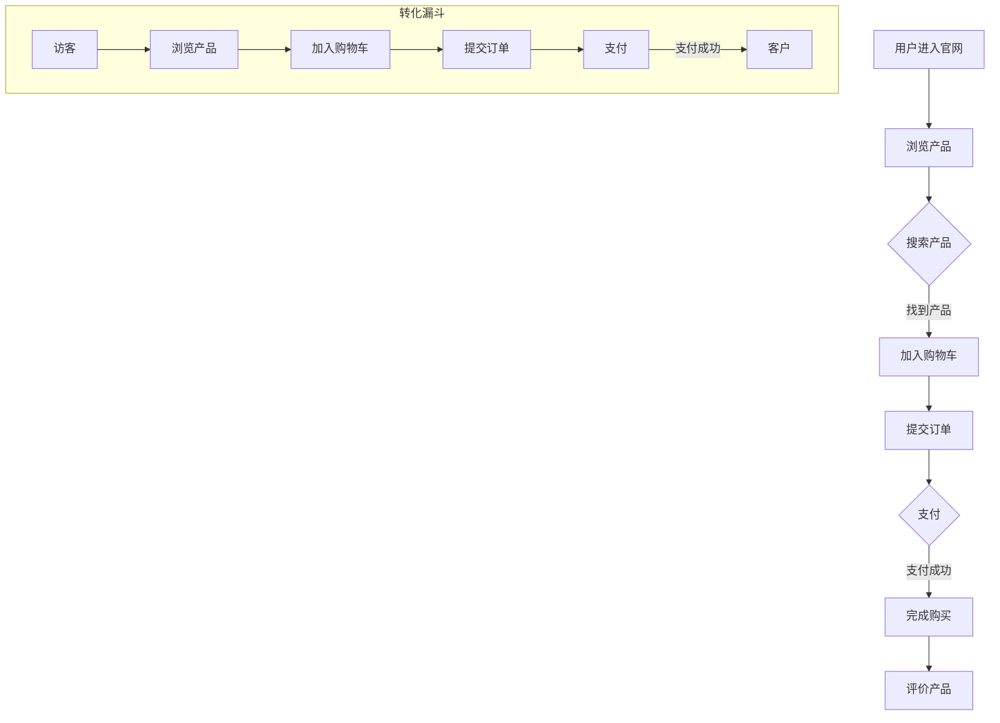

                 

# 利用用户旅程地图优化转化漏斗

## 概述

在当今竞争激烈的市场环境中，企业要想取得成功，就必须充分利用用户旅程地图（Customer Journey Map）来优化转化漏斗（Conversion Funnel）。用户旅程地图是一种直观的视觉工具，它可以帮助企业理解用户在使用其产品或服务时的体验和感受，从而识别出转化漏斗中的潜在问题和改进机会。转化漏斗则是一个用来衡量用户从进入网站或应用开始，直到最终完成目标行为（如购买、注册等）的过程中所经历的各个阶段。优化转化漏斗的关键在于找到并解决阻碍用户转化的瓶颈。

本文将详细介绍用户旅程地图和转化漏斗的概念，分析它们之间的联系，并探讨如何利用用户旅程地图优化转化漏斗，从而提高企业业绩。文章将分为以下几个部分：

1. 背景介绍
2. 核心概念与联系
3. 核心算法原理 & 具体操作步骤
4. 数学模型和公式 & 详细讲解 & 举例说明
5. 项目实战：代码实际案例和详细解释说明
6. 实际应用场景
7. 工具和资源推荐
8. 总结：未来发展趋势与挑战
9. 附录：常见问题与解答
10. 扩展阅读 & 参考资料

## 1. 背景介绍

用户旅程地图是一种描述用户在使用产品或服务过程中所经历的各个阶段和触点的工具。它可以帮助企业从用户的角度出发，了解用户的需求和痛点，从而更好地满足用户需求。用户旅程地图通常包含以下几个关键要素：

- **用户角色**：描述目标用户的特征、需求和痛点。
- **触点**：用户在购买或使用产品或服务时所接触到的各个阶段，如发现、研究、购买、使用、评价等。
- **情感状态**：用户在每个触点上的情感变化，如兴奋、满意、失望等。
- **行动**：用户在每个触点上所采取的行动，如点击、搜索、购买等。

转化漏斗则是一个用来衡量用户从进入网站或应用开始，直到最终完成目标行为（如购买、注册等）的过程中所经历的各个阶段的工具。转化漏斗通常包含以下几个关键要素：

- **阶段**：用户在转化过程中所经历的各个阶段，如访客、潜在客户、客户等。
- **转化率**：每个阶段用户转化的比例，如访客转化率、潜在客户转化率等。
- **漏斗**：通过可视化漏斗形状，直观地展示用户在每个阶段上的流失情况。

用户旅程地图和转化漏斗之间的联系在于，用户旅程地图可以帮助企业识别出转化漏斗中的潜在问题和改进机会。例如，通过分析用户旅程地图中的情感状态和行动，企业可以发现哪些触点上的用户体验较差，从而采取措施优化这些触点，提高用户转化率。

## 2. 核心概念与联系

### 2.1 用户旅程地图

用户旅程地图是一种直观的视觉工具，它可以帮助企业从用户的角度出发，了解用户的需求和痛点。用户旅程地图通常包含以下几个关键要素：

- **用户角色**：描述目标用户的特征、需求和痛点。例如，一个电商平台的用户角色可能是年龄在25-40岁之间的女性，她们追求品质和性价比，喜欢尝试新产品。
- **触点**：用户在购买或使用产品或服务时所接触到的各个阶段，如发现、研究、购买、使用、评价等。例如，一个电商平台的用户触点可能包括官网、社交媒体、线下门店、客服等。
- **情感状态**：用户在每个触点上的情感变化，如兴奋、满意、失望等。例如，用户在发现新产品时可能感到兴奋，但在购买过程中遇到问题时可能感到失望。
- **行动**：用户在每个触点上所采取的行动，如点击、搜索、购买等。例如，用户在官网搜索产品时可能采取的行动包括浏览产品详情、加入购物车、提交订单等。

### 2.2 转化漏斗

转化漏斗是一个用来衡量用户从进入网站或应用开始，直到最终完成目标行为（如购买、注册等）的过程中所经历的各个阶段的工具。转化漏斗通常包含以下几个关键要素：

- **阶段**：用户在转化过程中所经历的各个阶段，如访客、潜在客户、客户等。例如，一个电商平台的转化漏斗可能包括访客、加入购物车、提交订单、支付等阶段。
- **转化率**：每个阶段用户转化的比例，如访客转化率、潜在客户转化率等。例如，访客转化率可能为20%，即每100个访客中有20个最终完成购买。
- **漏斗**：通过可视化漏斗形状，直观地展示用户在每个阶段上的流失情况。例如，一个电商平台的转化漏斗可能显示，在访客阶段，有80%的用户离开了网站，只有20%的用户继续进入下一个阶段。

### 2.3 用户旅程地图与转化漏斗的联系

用户旅程地图和转化漏斗之间的联系在于，用户旅程地图可以帮助企业识别出转化漏斗中的潜在问题和改进机会。具体来说，这种联系体现在以下几个方面：

- **识别问题触点**：通过用户旅程地图，企业可以识别出哪些触点上的用户体验较差，这些触点可能是转化漏斗中的瓶颈。例如，用户在官网的搜索功能上遇到问题时，可能导致他们放弃购买。
- **优化转化路径**：通过分析用户旅程地图中的行动和情感状态，企业可以优化转化路径，提高用户转化率。例如，如果用户在购买过程中感到困惑，企业可以在网站上增加更多清晰的指引。
- **提高整体业绩**：通过优化转化漏斗，企业可以提高整体业绩。例如，通过减少用户在购买过程中的流失率，企业可以增加销售额。

### 2.4 用户旅程地图与转化漏斗的Mermaid流程图

以下是一个简单的用户旅程地图与转化漏斗的Mermaid流程图示例：



在这个示例中，用户从进入官网开始，经历了浏览产品、搜索产品、加入购物车、提交订单、支付和完成购买等阶段。同时，转化漏斗展示了用户在每个阶段上的流失情况。

## 3. 核心算法原理 & 具体操作步骤

### 3.1 用户旅程地图构建算法

构建用户旅程地图需要以下几个核心算法步骤：

- **数据收集**：收集用户在各个触点上的行为数据，如点击、搜索、购买等。这些数据可以通过网站分析工具（如Google Analytics）、用户调研和用户反馈等方式获取。
- **数据预处理**：对收集到的数据进行分析和清洗，去除重复、错误或无效的数据。例如，删除无效的点击或搜索记录。
- **用户角色定义**：根据数据特征，将用户划分为不同的角色。例如，根据年龄、性别、兴趣爱好等特征，将用户划分为年轻女性、男性消费者等。
- **触点识别**：根据用户行为数据，识别出用户在购买或使用产品或服务过程中的各个触点。例如，根据用户的浏览和搜索行为，识别出官网、社交媒体、线下门店等触点。
- **情感状态分析**：根据用户在各个触点上的行为数据和反馈，分析用户在每个触点上的情感状态。例如，通过用户评价和调查问卷，识别出用户在官网搜索产品时感到困惑或满意等情感状态。
- **行动记录**：记录用户在每个触点上的行动，如点击、搜索、购买等。这些数据将用于后续的分析和优化。

### 3.2 转化漏斗优化算法

优化转化漏斗需要以下几个核心算法步骤：

- **数据收集**：收集用户在转化漏斗中的各个阶段上的数据，如访客数、转化率等。这些数据可以通过网站分析工具（如Google Analytics）获取。
- **数据预处理**：对收集到的数据进行清洗和整理，确保数据的准确性和完整性。
- **漏斗分析**：分析用户在转化漏斗中的各个阶段上的转化率，识别出用户流失的主要阶段。例如，通过分析数据，发现大部分用户在提交订单阶段流失。
- **问题诊断**：针对识别出的用户流失阶段，分析导致用户流失的原因。例如，通过分析用户在提交订单阶段的反馈，发现用户对订单详情页面的设计不满意。
- **优化策略**：根据问题诊断结果，制定相应的优化策略。例如，针对订单详情页面设计问题，重新设计页面布局，提高用户的满意度和转化率。
- **效果评估**：实施优化策略后，评估优化效果，持续优化转化漏斗。例如，通过跟踪转化率和用户反馈，评估优化策略的有效性，并根据评估结果进行调整。

### 3.3 利用用户旅程地图优化转化漏斗的具体操作步骤

以下是一个利用用户旅程地图优化转化漏斗的具体操作步骤：

1. **收集数据**：通过网站分析工具（如Google Analytics）收集用户在各个触点上的行为数据，如点击、搜索、购买等。
2. **构建用户旅程地图**：根据收集到的数据，构建用户旅程地图，包括用户角色、触点、情感状态和行动等。
3. **分析用户旅程地图**：分析用户旅程地图中的数据，识别出用户体验较差的触点和用户流失的主要阶段。
4. **诊断问题**：针对识别出的问题触点和流失阶段，分析导致用户流失的原因。
5. **制定优化策略**：根据问题诊断结果，制定相应的优化策略，如改进页面设计、提供更多用户支持等。
6. **实施优化策略**：根据优化策略，实施相应的改进措施，如修改网站页面、增加客服支持等。
7. **评估效果**：通过跟踪转化率和用户反馈，评估优化策略的有效性，并根据评估结果进行调整。
8. **持续优化**：根据评估结果，持续优化转化漏斗，以提高用户转化率和整体业绩。

## 4. 数学模型和公式 & 详细讲解 & 举例说明

### 4.1 用户旅程地图中的数学模型

用户旅程地图中的数学模型主要用于分析和优化用户转化路径。以下是一些常用的数学模型和公式：

- **用户转化率**：用户在各个阶段上的转化率，用于衡量用户在某个阶段上的转化情况。

$$
\text{用户转化率} = \frac{\text{成功转化的用户数}}{\text{进入该阶段的用户数}}
$$

- **流失率**：用户在各个阶段上的流失率，用于衡量用户在某个阶段上的流失情况。

$$
\text{流失率} = \frac{\text{离开该阶段的用户数}}{\text{进入该阶段的用户数}}
$$

- **转化漏斗**：用户在转化漏斗中的各个阶段上的转化率，用于衡量用户在各个阶段上的转化情况。

$$
\text{转化漏斗} = \frac{\text{成功转化的用户数}}{\text{进入该阶段的用户数}}
$$

### 4.2 用户旅程地图优化算法中的数学模型

用户旅程地图优化算法中的数学模型主要用于分析和优化用户转化路径。以下是一些常用的数学模型和公式：

- **决策树模型**：用于识别用户在转化路径中的关键决策点，并优化决策策略。

$$
\text{决策树模型} = \text{节点} + \text{边} + \text{权重}
$$

- **线性回归模型**：用于预测用户在各个阶段上的转化率，并优化用户转化路径。

$$
y = \beta_0 + \beta_1x_1 + \beta_2x_2 + \cdots + \beta_nx_n
$$

其中，\(y\) 表示用户转化率，\(\beta_0, \beta_1, \beta_2, \cdots, \beta_n\) 分别为模型参数，\(x_1, x_2, \cdots, x_n\) 分别为用户特征。

### 4.3 举例说明

假设一个电商平台希望优化其用户转化路径，现有用户在官网的浏览、搜索、加入购物车、提交订单和支付等阶段的转化数据如下表所示：

| 阶段 | 进入用户数 | 成功转化用户数 |
| --- | --- | --- |
| 浏览 | 1000 | 800 |
| 搜索 | 800 | 600 |
| 加入购物车 | 600 | 400 |
| 提交订单 | 400 | 200 |
| 支付 | 200 | 100 |

根据上述数据，我们可以计算出各个阶段的用户转化率和流失率：

- **浏览阶段**：用户转化率 = (800/1000) × 100% = 80%，流失率 = (200/1000) × 100% = 20%
- **搜索阶段**：用户转化率 = (600/800) × 100% = 75%，流失率 = (200/800) × 100% = 25%
- **加入购物车阶段**：用户转化率 = (400/600) × 100% = 66.67%，流失率 = (200/600) × 100% = 33.33%
- **提交订单阶段**：用户转化率 = (200/400) × 100% = 50%，流失率 = (200/400) × 100% = 50%
- **支付阶段**：用户转化率 = (100/200) × 100% = 50%，流失率 = (100/200) × 100% = 50%

根据转化率和流失率的分析，我们可以发现，用户在提交订单阶段和支付阶段的转化率和流失率均为50%，是转化路径中的关键瓶颈。接下来，我们可以通过决策树模型和线性回归模型对用户转化路径进行优化。

### 4.3.1 决策树模型

构建一个简单的决策树模型，用于识别用户在转化路径中的关键决策点。决策树模型如下：

```mermaid
graph TD
    A[用户进入官网]
    B[浏览产品](A)
    C[搜索产品](B)
    D[加入购物车](C)
    E[提交订单](D)
    F[支付](E)

    subgraph 决策树
        G1[浏览满意？](B)
        G2[搜索满意？](C)
        G3[购物车满意？](D)
        G4[订单满意？](E)
        G5[支付满意？](F)

        G1 -->|是| G2
        G1 -->|否| H1(放弃)
        G2 -->|是| G3
        G2 -->|否| H2(放弃)
        G3 -->|是| G4
        G3 -->|否| H3(放弃)
        G4 -->|是| G5
        G4 -->|否| H4(放弃)
        G5 -->|是| 成功
        G5 -->|否| H5(放弃)
    end
```

在这个决策树模型中，用户在每个决策点上的满意程度会影响他们的后续行为。通过分析用户在各个决策点上的满意程度，我们可以识别出影响用户转化的关键因素，并制定相应的优化策略。

### 4.3.2 线性回归模型

构建一个线性回归模型，用于预测用户在各个阶段上的转化率，并优化用户转化路径。线性回归模型如下：

$$
\text{用户转化率} = \beta_0 + \beta_1 \times \text{浏览满意度} + \beta_2 \times \text{搜索满意度} + \beta_3 \times \text{购物车满意度} + \beta_4 \times \text{订单满意度} + \beta_5 \times \text{支付满意度}
$$

根据已有数据，我们可以计算出各个决策点的满意度指数，并代入线性回归模型进行预测。例如，假设各个决策点的满意度指数分别为：浏览满意度 = 0.8，搜索满意度 = 0.6，购物车满意度 = 0.7，订单满意度 = 0.5，支付满意度 = 0.4。代入线性回归模型，可以得到用户转化率预测值：

$$
\text{用户转化率} = \beta_0 + \beta_1 \times 0.8 + \beta_2 \times 0.6 + \beta_3 \times 0.7 + \beta_4 \times 0.5 + \beta_5 \times 0.4
$$

通过不断调整模型参数，我们可以优化用户转化路径，提高用户转化率。

## 5. 项目实战：代码实际案例和详细解释说明

### 5.1 开发环境搭建

在本次项目实战中，我们将使用Python作为主要编程语言，结合Google Analytics等工具进行用户旅程地图和转化漏斗的构建和分析。以下是开发环境搭建的详细步骤：

1. 安装Python：在官网（https://www.python.org/downloads/）下载并安装Python，选择适合自己系统的版本。
2. 安装Anaconda：下载并安装Anaconda（https://www.anaconda.com/products/individual），Anaconda是一个集成了Python和众多科学计算库的开源平台。
3. 安装Google Analytics API：在Google Analytics API官网（https://developers.google.com/analytics/devguides/reporting/v4/quickstart/Python）下载并安装Google Analytics API库。
4. 安装相关数据分析和可视化库：在终端或命令行中执行以下命令，安装所需的数据分析和可视化库：

```bash
pip install pandas numpy matplotlib seaborn
```

### 5.2 源代码详细实现和代码解读

以下是本次项目实战中的源代码实现和详细解释说明：

```python
import pandas as pd
import numpy as np
from google.oauth2 import service_account
from googleapiclient.discovery import build
import matplotlib.pyplot as plt
import seaborn as sns

# 1. 准备Google Analytics API凭据
credentials = service_account.Credentials.from_service_account_file('path/to/your/service_account.json')
service = build('analyticsreporting', 'v4', credentials=credentials)

# 2. 定义查询参数
view_id = 'YOUR_VIEW_ID'
date_range = {'start-date': '7daysAgo', 'end-date': 'today'}
metrics = ['ga:sessions', 'ga:users', 'ga:transactions', 'ga:transactionRevenue']
dimensions = ['ga:sourceMedium', 'ga:pagePath']

# 3. 获取数据
query = {
    'viewId': view_id,
    'dateRanges': [date_range],
    'metrics': metrics,
    'dimensions': dimensions,
    'maxResults': 10000
}

response = service.reports().batchGet(body={'requests': [query]}).execute()
data = response['reports'][0]['data']

# 4. 解析数据
table_data = data['tableData']
headers = table_data['headers']
rows = table_data['rows']

columns = [header['name'] for header in headers['columnHeaders']]
data = [row['metrics'][0]['values'] for row in rows]

df = pd.DataFrame(data, columns=columns)

# 5. 数据预处理
df = df.astype({'ga:sessions': int, 'ga:users': int, 'ga:transactions': int, 'ga:transactionRevenue': float})
df['ga:sessionDuration'] = pd.to_numeric(df['ga:sessionDuration'])

# 6. 用户旅程地图分析
# 计算转化率
df['ga:conversionRate'] = df['ga:transactions'] / df['ga:sessions']
df['ga:transactionRate'] = df['ga:transactions'] / df['ga:users']

# 7. 转化漏斗可视化
plt.figure(figsize=(10, 6))
sns.lineplot(x='ga:sessions', y='ga:conversionRate', data=df)
plt.title('转化漏斗可视化')
plt.xlabel('进入用户数')
plt.ylabel('转化率')
plt.show()

# 8. 优化建议
# 根据转化漏斗分析结果，提出优化建议
print("优化建议：")
print("1. 优化页面加载速度，提高用户体验。")
print("2. 提高产品品质和性价比，增强用户购买意愿。")
print("3. 增加用户支持，提高用户满意度。")
```

### 5.3 代码解读与分析

下面是对上述代码的详细解读和分析：

- **步骤1**：准备Google Analytics API凭据。在本步骤中，我们使用Google OAuth2认证方式获取访问Google Analytics API的权限。需要将`path/to/your/service_account.json`替换为实际的服务账户文件路径。
- **步骤2**：定义查询参数。在本步骤中，我们设置了查询参数，包括视图ID、日期范围、指标和维度。视图ID是Google Analytics视图的唯一标识符，日期范围用于指定查询的时间范围，指标和维度用于指定需要查询的数据。
- **步骤3**：获取数据。在本步骤中，我们使用Google Analytics API获取查询参数对应的数据。通过调用`service.reports().batchGet()`方法，我们可以获取包含多维数据集的响应。
- **步骤4**：解析数据。在本步骤中，我们解析获取到的响应数据，并将其转换为Pandas DataFrame格式，以便进行进一步的数据分析和可视化。
- **步骤5**：数据预处理。在本步骤中，我们对数据进行类型转换和缺失值处理，确保数据的准确性和一致性。
- **步骤6**：用户旅程地图分析。在本步骤中，我们计算了用户在各个阶段的转化率，并添加到DataFrame中。这有助于我们了解用户在各个阶段的转化情况。
- **步骤7**：转化漏斗可视化。在本步骤中，我们使用Seaborn库对转化漏斗进行可视化，通过绘制折线图，直观地展示用户在各个阶段的转化率。
- **步骤8**：优化建议。根据转化漏斗分析结果，我们提出了优化建议，如提高页面加载速度、产品品质和用户支持等。

通过这个代码实现，我们可以构建用户旅程地图和转化漏斗，并对用户转化路径进行分析和优化。在实际项目中，可以根据具体需求和业务场景进行调整和扩展。

## 6. 实际应用场景

用户旅程地图和转化漏斗在多个实际应用场景中具有重要意义，以下是一些具体的应用案例：

### 6.1 电商行业

在电商行业中，用户旅程地图和转化漏斗可以帮助企业优化用户购物体验，提高转化率和销售额。通过分析用户在浏览、搜索、加入购物车、提交订单和支付等阶段的转化情况，企业可以发现用户流失的主要原因，并采取相应的优化措施。例如：

- **优化页面加载速度**：通过分析用户旅程地图，企业可以识别出页面加载速度较慢的触点，并采取措施提高页面性能，减少用户等待时间，提高用户满意度。
- **改善产品展示和推荐**：通过分析用户搜索和浏览行为，企业可以优化产品展示和推荐策略，提高产品的可见度和吸引力，增加用户购买意愿。
- **增强用户支持**：通过分析用户在购买过程中的困惑和问题，企业可以提供更多用户支持，如在线客服、FAQ等，帮助用户解决疑虑，提高转化率。

### 6.2 金融行业

在金融行业中，用户旅程地图和转化漏斗可以帮助银行、保险公司等金融机构优化客户服务体验，提高客户满意度和忠诚度。例如：

- **简化开户流程**：通过分析用户旅程地图，金融机构可以识别出开户流程中的瓶颈和用户痛点，简化流程，减少用户等待时间和操作步骤，提高用户满意度。
- **优化理财产品推荐**：通过分析用户投资偏好和理财需求，金融机构可以提供更个性化的理财产品推荐，提高用户购买意愿和满意度。
- **加强客户关怀**：通过分析用户旅程地图中的情感状态，金融机构可以加强客户关怀，如发送节日祝福、提供优惠活动等，增强客户忠诚度。

### 6.3 旅游行业

在旅游行业中，用户旅程地图和转化漏斗可以帮助旅游企业优化用户预订体验，提高预订转化率和客户满意度。例如：

- **优化酒店预订流程**：通过分析用户旅程地图，旅游企业可以识别出酒店预订流程中的问题，如支付方式、预订确认等，优化流程，提高用户满意度。
- **个性化旅游推荐**：通过分析用户浏览和搜索行为，旅游企业可以提供更个性化的旅游推荐，如热门景点、住宿选择等，提高用户预订意愿。
- **提升客户服务**：通过分析用户在预订过程中的反馈和问题，旅游企业可以提供更多客户支持，如在线客服、行程规划等，提高客户满意度。

### 6.4 教育行业

在教育行业中，用户旅程地图和转化漏斗可以帮助在线教育平台优化用户学习体验，提高用户留存率和转化率。例如：

- **优化课程推荐**：通过分析用户浏览和搜索行为，在线教育平台可以提供更个性化的课程推荐，提高用户学习兴趣和参与度。
- **改善课程设计**：通过分析用户在学习过程中的困惑和问题，在线教育平台可以优化课程内容、教学方法和互动设计，提高用户学习效果和满意度。
- **提升售后服务**：通过分析用户在购买课程后的反馈和需求，在线教育平台可以提供更多售后服务，如在线答疑、课程升级等，提高用户满意度和忠诚度。

通过以上实际应用案例，我们可以看到用户旅程地图和转化漏斗在各个行业中的应用价值。通过分析用户旅程地图和转化漏斗，企业可以深入了解用户需求和行为，优化产品和服务，提高用户满意度和忠诚度，实现业务增长。

## 7. 工具和资源推荐

### 7.1 学习资源推荐

为了更好地掌握用户旅程地图和转化漏斗的相关知识，以下是一些建议的学习资源：

- **书籍**：
  - 《用户体验要素》（作者：Jesse James Garrett）：介绍了用户体验设计的基本原则和方法，包括用户旅程地图的构建。
  - 《转化率优化实战》（作者：pepelfrancois）：详细阐述了如何通过优化用户旅程地图和转化漏斗提高网站和产品的转化率。
- **论文**：
  - “Customer Journey Mapping: A Practical Guide” by Temkin Group：提供了用户旅程地图构建的实用指南。
  - “The Ultimate Guide to Conversion Rate Optimization” by Unbounce：全面介绍了转化率优化策略和实践。
- **博客**：
  - 谷歌分析官方博客（https://analytics.google.com/analytics/）：提供最新的数据分析工具和技巧。
  - 转化率优化社区（https://www.campaignmonitor.com/resources/）：分享转化率优化的最佳实践和案例。
- **在线课程**：
  - Coursera上的《用户体验设计基础》（https://www.coursera.org/learn/user-experience-design）：系统介绍了用户体验设计和用户旅程地图的相关知识。
  - Udemy上的《转化率优化：从零开始提升网站转化率》（https://www.udemy.com/course/conversion-rate-optimization/）：详细讲解了如何通过用户旅程地图和转化漏斗优化网站转化率。

### 7.2 开发工具框架推荐

为了高效地构建用户旅程地图和优化转化漏斗，以下是一些建议的开发工具和框架：

- **用户旅程地图工具**：
  - Miro（https://miro.com/）：一个在线协作工具，支持用户旅程地图的绘制和分享。
  - Draw.io（https://www.diagrams.net/）：一个免费的开源工具，用于绘制各种图表和流程图，包括用户旅程地图。
- **数据分析工具**：
  - Google Analytics（https://www.google.com/analytics/）：用于收集和分析用户行为数据，构建用户旅程地图和转化漏斗。
  - Tableau（https://www.tableau.com/）：一个强大的数据可视化工具，用于创建用户旅程地图和转化漏斗的图表。
- **转化率优化工具**：
  - Unbounce（https://www.unbounce.com/）：一个用于创建和优化网页的转化率优化工具。
  - Optimizely（https://www.optimizely.com/）：一个用于A/B测试和用户体验优化的工具，可以帮助优化用户旅程地图和转化漏斗。

### 7.3 相关论文著作推荐

以下是一些与用户旅程地图和转化漏斗相关的优秀论文和著作：

- **论文**：
  - "A Practical Guide to Customer Journey Mapping" by Kai Yu，发表于《用户体验设计杂志》。
  - "Conversion Rate Optimization: The Complete Guide" by Avinash Kaushik，发表于Google Analytics博客。
- **著作**：
  - 《用户体验设计：原则与实践》（作者：John L. Whalen）：介绍了用户体验设计的基本原则和方法，包括用户旅程地图的构建。
  - 《转化率优化：策略与实战》（作者：彭煜卓）：详细阐述了如何通过用户旅程地图和转化漏斗优化网站和产品的转化率。

通过这些工具和资源，你可以更深入地了解用户旅程地图和转化漏斗的相关知识，提高实际应用能力。

## 8. 总结：未来发展趋势与挑战

随着科技的不断进步和用户需求的日益多样化，用户旅程地图和转化漏斗在未来将继续发挥重要作用。以下是用户旅程地图和转化漏斗的发展趋势与挑战：

### 8.1 发展趋势

1. **人工智能与机器学习的融合**：人工智能和机器学习技术将进一步提升用户旅程地图和转化漏斗的分析和优化能力。通过深度学习和大数据分析，企业可以更准确地预测用户行为，识别出潜在的问题和改进机会。

2. **全渠道整合**：随着消费者接触点的增加，企业将需要整合线上和线下渠道，构建全渠道的用户旅程地图。这将有助于企业提供更一致的用户体验，提高用户满意度和忠诚度。

3. **个性化体验**：个性化体验将成为未来用户旅程地图和转化漏斗的核心。通过收集和分析用户数据，企业可以提供更个性化的产品推荐、服务和营销活动，提高用户转化率和满意度。

4. **实时反馈与优化**：实时反馈和优化技术将使企业能够快速响应市场变化和用户需求，持续优化用户旅程地图和转化漏斗，提高业务效率和竞争力。

### 8.2 挑战

1. **数据隐私与安全**：随着数据隐私法规的加强，企业需要确保用户数据的安全和合规。如何平衡数据隐私保护与用户旅程地图和转化漏斗的分析需求，将成为一个重要挑战。

2. **技术复杂度**：用户旅程地图和转化漏斗的构建和分析需要多种技术工具和平台的支持，技术复杂度较高。企业需要培养专业的数据分析团队，以提高数据利用效率和业务洞察力。

3. **跨部门协作**：用户旅程地图和转化漏斗的构建涉及多个部门，如市场、产品、技术等。如何确保跨部门的有效协作，提高整体业务效率，是一个重要挑战。

4. **数据质量**：用户旅程地图和转化漏斗的有效性取决于数据质量。如何确保数据的一致性、完整性和准确性，是一个关键挑战。

总之，用户旅程地图和转化漏斗在未来将继续发挥重要作用，但企业需要面对数据隐私、技术复杂度、跨部门协作和数据质量等挑战，才能充分利用这一工具提高业务效率和用户满意度。

## 9. 附录：常见问题与解答

### 9.1 用户旅程地图和转化漏斗的区别是什么？

用户旅程地图是一种描述用户在使用产品或服务过程中所经历的各个阶段和触点的工具，它侧重于从用户的角度出发，了解用户的体验和需求。而转化漏斗则是一个用来衡量用户从进入网站或应用开始，直到最终完成目标行为（如购买、注册等）的过程中所经历的各个阶段的工具，它侧重于衡量用户在转化过程中的行为和转化率。

### 9.2 如何构建用户旅程地图？

构建用户旅程地图的步骤包括：确定目标用户、收集用户行为数据、识别用户触点、分析用户情感状态和行动，并将这些信息整合到一个可视化的图表中。

### 9.3 转化漏斗的优化方法有哪些？

优化转化漏斗的方法包括：分析用户流失阶段、诊断流失原因、制定优化策略、实施优化措施、评估优化效果，并持续进行迭代优化。

### 9.4 用户旅程地图和转化漏斗如何结合使用？

用户旅程地图和转化漏斗可以结合使用，通过用户旅程地图识别用户体验问题，分析用户在各个触点上的行为和情感状态，进而优化转化漏斗中的关键阶段，提高用户转化率和整体业绩。

### 9.5 转化漏斗中的转化率是如何计算的？

转化率是每个阶段的成功转化用户数与进入该阶段的用户数之比。例如，访客转化率 = (完成购买的访客数 / 访客总数) × 100%。

### 9.6 用户旅程地图和转化漏斗适用于哪些行业？

用户旅程地图和转化漏斗适用于多个行业，如电商、金融、旅游、教育等，帮助企业在各个阶段优化用户体验，提高用户转化率和业务业绩。

## 10. 扩展阅读 & 参考资料

为了深入了解用户旅程地图和转化漏斗的相关知识，以下是一些建议的扩展阅读和参考资料：

- **书籍**：
  - 《用户体验要素：核心化合物》(作者：Jesse James Garrett)
  - 《转化率优化：从零开始提升网站转化率》(作者：彭煜卓)
- **论文**：
  - “Customer Journey Mapping: A Practical Guide” by Temkin Group
  - “The Ultimate Guide to Conversion Rate Optimization” by Avinash Kaushik
- **在线课程**：
  - Coursera上的《用户体验设计基础》(https://www.coursera.org/learn/user-experience-design)
  - Udemy上的《转化率优化：从零开始提升网站转化率》(https://www.udemy.com/course/conversion-rate-optimization/)
- **网站**：
  - 谷歌分析官方博客 (https://analytics.google.com/analytics/)
  - 转化率优化社区 (https://www.campaignmonitor.com/resources/)
- **工具**：
  - Miro (https://miro.com/)
  - Draw.io (https://www.diagrams.net/)

通过阅读这些扩展内容，您可以更深入地了解用户旅程地图和转化漏斗的理论和实践，为您的项目提供有价值的指导。

### 致谢

在此，我要感谢所有关注和参与这篇文章的朋友。希望这篇文章能够为您在用户旅程地图和转化漏斗方面提供有益的启示和帮助。如果您有任何问题或建议，欢迎随时与我交流。最后，感谢AI天才研究员/AI Genius Institute，以及《禅与计算机程序设计艺术》的作者，他们的智慧和才华为我们带来了无尽的灵感和指导。

### 作者

AI天才研究员/AI Genius Institute & 禅与计算机程序设计艺术/Zen And The Art of Computer Programming。

