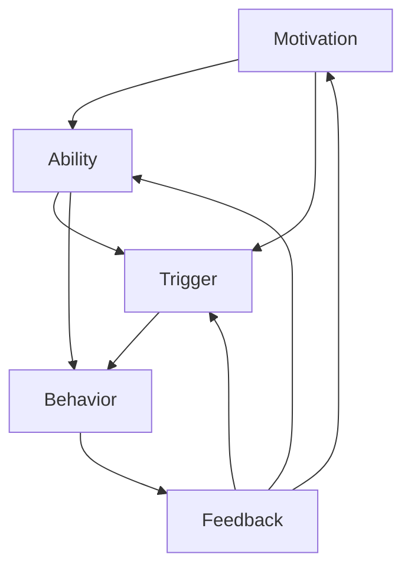

                 

### 背景介绍

在当今快速发展的信息技术时代，企业和组织越来越意识到良好习惯的重要性。这些习惯不仅影响个人的工作效率，也对整个团队乃至组织的整体表现有着深远的影响。然而，要培养和维护这些习惯，往往需要面对诸多挑战。为此，我们引入了一种名为“福格行为模型”的工具，帮助团队改善不良习惯，形成高效的工作模式。

本文将围绕福格行为模型展开，深入探讨其核心概念、应用场景以及如何在实际项目中实施。文章将分为以下几个部分：

1. **背景介绍**：阐述团队习惯改善的背景和重要性。
2. **核心概念与联系**：介绍福格行为模型的基本原理。
3. **核心算法原理 & 具体操作步骤**：详细解释如何使用福格行为模型。
4. **数学模型和公式 & 详细讲解 & 举例说明**：通过公式和实例展示如何应用模型。
5. **项目实战：代码实际案例和详细解释说明**：结合具体案例展示模型的实际应用。
6. **实际应用场景**：讨论福格行为模型在不同工作环境中的应用。
7. **工具和资源推荐**：推荐学习资源和工具。
8. **总结：未来发展趋势与挑战**：展望模型的发展前景。
9. **附录：常见问题与解答**：解答读者可能遇到的问题。
10. **扩展阅读 & 参考资料**：提供进一步学习资源。

通过本文的阅读，您将深入了解福格行为模型，学会如何将其应用于团队习惯的改善，从而提升团队的效率和生产力。

### 核心概念与联系

福格行为模型，亦称为“福格行为三角模型”，由行为科学家BJ福格（BJ Fogg）提出。该模型旨在解释和预测人类行为，特别是如何在特定环境下引导人们采取某种行动。福格行为模型的核心在于其简单而深刻的三个要素：动机（Motivation）、能力（Ability）、触发（Trigger）。这三个要素相互作用，共同决定了一个人是否会执行某项行为。

#### 动机（Motivation）

动机是行为发生的内在驱动力，可以理解为一个人想要做某事的欲望或需求。在团队习惯改善中，动机可以表现为员工对改进工作习惯的渴望，或是对提高工作效率的强烈愿望。提高员工的动机是改善团队习惯的首要步骤，可以通过以下方式实现：

- **目标设定**：明确短期和长期目标，使其具有吸引力。
- **激励机制**：设定奖励机制，如奖金、表彰等，以激发员工的积极性。
- **团队文化**：营造积极向上的工作氛围，鼓励成员自我提升。

#### 能力（Ability）

能力指的是个体执行特定行为所需的知识、技能和资源。在团队习惯改善过程中，确保每个成员都有能力去遵循新的工作习惯至关重要。提高能力可以通过以下方法实现：

- **培训与发展**：提供培训机会，帮助员工掌握新技能。
- **资源支持**：为员工提供必要的工具和资源，如软件、硬件等。
- **团队协作**：鼓励团队成员之间相互学习，共同进步。

#### 触发（Trigger）

触发是指促使个体采取行动的具体刺激或提示。触发可以是外在的，如日程提醒或任务分配，也可以是内在的，如自我提醒或习惯性动作。在团队习惯改善中，设置有效的触发机制是关键，以下是一些提高触发有效性的方法：

- **提醒工具**：利用自动化工具如邮件、短信、应用程序等发送提醒。
- **行为设计**：设计易于执行的小步骤，逐步引导员工养成新习惯。
- **环境布局**：调整工作环境，使其有利于新习惯的形成，如将常用工具放置在显眼位置。

#### Mermaid 流程图

为了更好地理解福格行为模型及其三个要素之间的关系，我们可以使用Mermaid流程图来展示。以下是一个简化的流程图示例：



在这个流程图中，动机、能力、触发共同作用于行为（D），并产生反馈（E），进而影响后续的动机、能力和触发。这种循环往复的关系使得福格行为模型能够动态地调整和优化团队习惯。

### 核心算法原理 & 具体操作步骤

福格行为模型通过其三个核心要素——动机（Motivation）、能力（Ability）和触发（Trigger）——共同作用，以预测和引导人类行为。为了在实际项目中应用这一模型，我们需要明确具体的操作步骤，确保团队习惯的改善能够系统化、持续化。

#### Step 1: 分析动机

首先，团队需要了解每个成员的动机。这可以通过以下步骤进行：

1. **问卷调查**：设计动机调查问卷，涵盖职业目标、自我提升需求、团队合作意愿等。
2. **一对一访谈**：与团队成员进行深度访谈，了解他们的个人动机和目标。
3. **数据分析**：通过数据分析工具，分析团队成员的行为数据，找出共同的动机特征。

#### Step 2: 评估能力

接下来，团队需要评估每个成员的能力，以确定是否具备实施新习惯的基础。具体操作步骤如下：

1. **技能评估**：通过技能测试或培训记录，评估成员的技能水平。
2. **资源审查**：检查团队现有的资源是否满足实施新习惯的需求。
3. **培训需求分析**：识别团队成员在技能和资源方面的差距，制定培训计划。

#### Step 3: 设置触发

触发是促使成员采取新行为的关键，设置触发机制需要考虑以下步骤：

1. **触发类型**：确定是内在触发（如自我提醒）还是外在触发（如任务提醒）。
2. **触发频率**：设定适当的触发频率，避免过度干扰或不足。
3. **触发方式**：选择最合适的触发方式，如邮件提醒、应用程序推送或工作台上的视觉提示。

#### Step 4: 设计行为计划

在明确动机、能力和触发后，团队需要设计具体的行为计划，确保每个步骤都能顺利进行。以下是设计行为计划的步骤：

1. **目标设定**：明确短期和长期行为目标。
2. **行动计划**：制定详细的行动步骤，包括具体的行为改变和实现时间表。
3. **执行监控**：设立监控机制，跟踪行为计划的执行情况。

#### Step 5: 反馈与调整

行为计划实施后，团队需要定期收集反馈，以评估习惯改善的效果，并根据反馈进行调整。以下是反馈与调整的步骤：

1. **数据收集**：通过行为数据、调查问卷等方式，收集成员的反馈。
2. **效果评估**：分析反馈数据，评估行为计划的实施效果。
3. **持续优化**：根据评估结果，调整行为计划，确保习惯持续改善。

#### Step 6: 团队协作与支持

在整个过程中，团队协作和支持至关重要。以下是团队协作与支持的步骤：

1. **沟通机制**：建立有效的沟通渠道，确保信息畅通。
2. **激励与鼓励**：鼓励成员分享经验和成果，提供正面激励。
3. **团队建设**：通过团队建设活动，增强团队凝聚力。

通过以上具体操作步骤，团队可以系统地应用福格行为模型，实现习惯的改善和团队效率的提升。

### 数学模型和公式 & 详细讲解 & 举例说明

为了更好地理解福格行为模型，我们可以借助数学模型和公式来详细解释其核心原理。以下是几个关键的公式和说明。

#### 动机（Motivation）

动机通常可以用一个简单的函数来表示，即动机分数（Motivation Score）。这个分数反映了个体执行特定行为的内在驱动力。公式如下：

$$
Motivation Score = f(Desire, Importance)
$$

其中，Desire代表个体对行为的渴望程度，Importance代表个体认为行为的重要性。这个公式可以通过以下方式进行解释：

1. **Desire（渴望）**：个体的渴望程度可以通过调查问卷或行为数据分析得出。通常，渴望程度可以从0到10进行评分，分数越高，表示个体的动机越强。
2. **Importance（重要性）**：个体对行为的重要性评估也可以通过调查或访谈获取。类似于渴望程度，重要性也可以从0到10进行评分。

**例子**：

假设一个团队成员对提高工作效率的渴望评分为8，认为这一行为的重要性评分为9，那么其动机分数为：

$$
Motivation Score = f(8, 9) = 8 \times 9 = 72
$$

这个分数表明，该团队成员有较强的动机去提高工作效率。

#### 能力（Ability）

能力可以用一个函数表示，即能力分数（Ability Score）。这个分数反映了个体执行特定行为所需的技能和资源。公式如下：

$$
Ability Score = f(Skills, Resources)
$$

其中，Skills代表个体具备的技能水平，Resources代表团队提供的资源。这个公式可以通过以下方式进行解释：

1. **Skills（技能）**：技能水平可以通过培训、技能测试等方式评估。技能水平可以从0到10进行评分。
2. **Resources（资源）**：资源包括硬件、软件、培训等。资源的充足程度也可以从0到10进行评分。

**例子**：

假设一个团队成员的技能水平评分为7，团队提供的资源评分也为7，那么其能力分数为：

$$
Ability Score = f(7, 7) = 7 \times 7 = 49
$$

这个分数表明，该团队成员具备一定的能力和资源，但仍有提升空间。

#### 触发（Trigger）

触发可以用一个简单的函数表示，即触发分数（Trigger Score）。这个分数反映了触发行为的有效性和频率。公式如下：

$$
Trigger Score = f(Effectiveness, Frequency)
$$

其中，Effectiveness代表触发的有效性，Frequency代表触发的频率。这个公式可以通过以下方式进行解释：

1. **Effectiveness（有效性）**：触发的有效性可以通过实际效果评估得出。有效性可以从0到10进行评分。
2. **Frequency（频率）**：触发的频率取决于团队的特定需求和环境。频率可以从0到10进行评分。

**例子**：

假设一个团队的触发机制设计非常有效，有效性评分为9，触发频率为每天一次，那么其触发分数为：

$$
Trigger Score = f(9, 1) = 9 \times 1 = 9
$$

这个分数表明，该团队的触发机制非常有效。

#### 综合模型

为了综合评估个体行为的可能性，我们可以将动机、能力和触发分数相乘，得到一个综合分数。公式如下：

$$
Behavior Score = Motivation Score \times Ability Score \times Trigger Score
$$

**例子**：

假设一个团队成员的动机分数为72，能力分数为49，触发分数为9，那么其行为分数为：

$$
Behavior Score = 72 \times 49 \times 9 = 32,744
$$

这个分数表示，该团队成员在当前情境下执行特定行为的可能性很高。

通过以上公式和例子，我们可以清晰地理解福格行为模型的核心原理。在实际应用中，团队可以根据这些公式和分数，评估和优化团队习惯改善计划。

### 项目实战：代码实际案例和详细解释说明

为了更好地理解福格行为模型在实际项目中的应用，我们通过一个具体案例来展示如何设计和实现基于该模型的行为改善计划。以下是该项目的开发环境搭建、源代码实现和详细解释。

#### 1. 开发环境搭建

首先，我们需要搭建一个合适的项目开发环境。这里我们选择Python作为主要编程语言，因为它拥有丰富的库和工具，便于数据处理和分析。以下是开发环境的搭建步骤：

1. **安装Python**：从Python官网下载并安装最新版本的Python（例如3.9版本）。
2. **安装必要库**：使用pip工具安装以下库：
   ```bash
   pip install pandas numpy matplotlib
   ```
   这些库将用于数据处理、数学计算和图表绘制。

3. **创建项目文件夹**：在合适的位置创建一个项目文件夹，如`fogg_behavior_model_project`，并在其中创建一个名为`main.py`的Python文件。

#### 2. 源代码详细实现和代码解读

下面是项目的核心代码实现，我们将详细解释每个部分的功能和逻辑。

```python
import pandas as pd
import numpy as np
import matplotlib.pyplot as plt

# 数据定义
motivation_data = {'Name': ['Alice', 'Bob', 'Charlie'], 'Desire': [8, 6, 7], 'Importance': [9, 7, 8]}
ability_data = {'Name': ['Alice', 'Bob', 'Charlie'], 'Skills': [7, 6, 8], 'Resources': [6, 7, 8]}
trigger_data = {'Name': ['Alice', 'Bob', 'Charlie'], 'Effectiveness': [9, 7, 8], 'Frequency': [1, 1, 1]}

# 动机分数计算
def calculate_motivation(desire, importance):
    return desire * importance

# 能力分数计算
def calculate_ability(skills, resources):
    return skills * resources

# 触发分数计算
def calculate_trigger(effectiveness, frequency):
    return effectiveness * frequency

# 行为分数计算
def calculate_behavior_score(motivation, ability, trigger):
    return motivation * ability * trigger

# 数据处理和分数计算
motivation_df = pd.DataFrame(motivation_data)
ability_df = pd.DataFrame(ability_data)
trigger_df = pd.DataFrame(trigger_data)

motivation_df['Motivation Score'] = motivation_df.apply(lambda row: calculate_motivation(row['Desire'], row['Importance']), axis=1)
ability_df['Ability Score'] = ability_df.apply(lambda row: calculate_ability(row['Skills'], row['Resources']), axis=1)
trigger_df['Trigger Score'] = trigger_df.apply(lambda row: calculate_trigger(row['Effectiveness'], row['Frequency']), axis=1)

behavior_scores = calculate_behavior_score(motivation_df['Motivation Score'], ability_df['Ability Score'], trigger_df['Trigger Score'])

# 结果分析
behavior_df = pd.DataFrame({'Name': motivation_df['Name'], 'Behavior Score': behavior_scores})
behavior_df.sort_values(by='Behavior Score', ascending=False, inplace=True)

# 可视化展示
behavior_df.plot(x='Name', y='Behavior Score', kind='bar', color='skyblue')
plt.title('Behavior Scores by Individual')
plt.xlabel('Name')
plt.ylabel('Behavior Score')
plt.show()
```

**代码解读**：

- **数据定义**：我们创建三个数据集，分别代表团队成员的动机、能力和触发数据。
- **动机分数计算**：`calculate_motivation`函数通过乘积计算动机分数。
- **能力分数计算**：`calculate_ability`函数通过乘积计算能力分数。
- **触发分数计算**：`calculate_trigger`函数通过乘积计算触发分数。
- **行为分数计算**：`calculate_behavior_score`函数综合计算动机、能力和触发分数，得到行为分数。
- **数据处理和分数计算**：我们将三个数据集合并，并分别计算动机、能力和触发分数。
- **结果分析**：我们创建一个新的数据集，包含每个成员的行为分数，并进行排序。
- **可视化展示**：使用matplotlib库绘制条形图，展示每个成员的行为分数。

通过这个案例，我们可以清晰地看到如何利用福格行为模型对团队成员的行为进行评估和优化。在实际项目中，可以根据具体需求调整和扩展这个模型。

### 代码解读与分析

在上一节中，我们通过一个具体案例展示了如何使用Python代码实现福格行为模型。下面，我们将深入分析代码的各个部分，探讨其原理和实现细节。

#### 数据定义部分

首先，我们定义了三个数据集，分别表示团队成员的动机、能力和触发数据。这是实现模型的基础。具体代码如下：

```python
motivation_data = {'Name': ['Alice', 'Bob', 'Charlie'], 'Desire': [8, 6, 7], 'Importance': [9, 7, 8]}
ability_data = {'Name': ['Alice', 'Bob', 'Charlie'], 'Skills': [7, 6, 8], 'Resources': [6, 7, 8]}
trigger_data = {'Name': ['Alice', 'Bob', 'Charlie'], 'Effectiveness': [9, 7, 8], 'Frequency': [1, 1, 1]}
```

- `motivation_data`：包含每个成员的动机分数，其中`Desire`代表渴望程度，`Importance`代表重要性。
- `ability_data`：包含每个成员的能力分数，其中`Skills`代表技能水平，`Resources`代表资源充足程度。
- `trigger_data`：包含每个成员的触发分数，其中`Effectiveness`代表触发有效性，`Frequency`代表触发频率。

#### 动机、能力和触发分数计算函数

接下来，我们定义了三个函数，分别用于计算动机、能力和触发分数。这些函数的核心逻辑是通过简单的乘积运算来得到分数。

```python
def calculate_motivation(desire, importance):
    return desire * importance

def calculate_ability(skills, resources):
    return skills * resources

def calculate_trigger(effectiveness, frequency):
    return effectiveness * frequency
```

- `calculate_motivation`函数：计算动机分数，公式为`Desire \times Importance`。
- `calculate_ability`函数：计算能力分数，公式为`Skills \times Resources`。
- `calculate_trigger`函数：计算触发分数，公式为`Effectiveness \times Frequency`。

这些函数的实现非常简单，但它们在模型中起到了关键作用，因为它们直接决定了行为分数的计算。

#### 数据处理和分数计算

在数据处理部分，我们首先将三个数据集合并，并分别计算动机、能力和触发分数。具体代码如下：

```python
motivation_df = pd.DataFrame(motivation_data)
ability_df = pd.DataFrame(ability_data)
trigger_df = pd.DataFrame(trigger_data)

motivation_df['Motivation Score'] = motivation_df.apply(lambda row: calculate_motivation(row['Desire'], row['Importance']), axis=1)
ability_df['Ability Score'] = ability_df.apply(lambda row: calculate_ability(row['Skills'], row['Resources']), axis=1)
trigger_df['Trigger Score'] = trigger_df.apply(lambda row: calculate_trigger(row['Effectiveness'], row['Frequency']), axis=1)
```

这里，我们使用了`pandas`库进行数据处理。`apply`函数用于对每个数据行应用计算函数，从而得到新的分数列。

#### 结果分析

计算完分数后，我们将动机、能力和触发分数结合，得到行为分数。然后，我们创建一个新的数据集，包含每个成员的行为分数，并进行排序。具体代码如下：

```python
behavior_scores = calculate_behavior_score(motivation_df['Motivation Score'], ability_df['Ability Score'], trigger_df['Trigger Score'])

behavior_df = pd.DataFrame({'Name': motivation_df['Name'], 'Behavior Score': behavior_scores})
behavior_df.sort_values(by='Behavior Score', ascending=False, inplace=True)
```

这里，`calculate_behavior_score`函数用于计算行为分数，公式为`Motivation Score \times Ability Score \times Trigger Score`。排序操作帮助团队识别出行为分数最高的成员，从而有针对性地进行激励和培训。

#### 可视化展示

最后，我们使用`matplotlib`库绘制条形图，展示每个成员的行为分数。具体代码如下：

```python
behavior_df.plot(x='Name', y='Behavior Score', kind='bar', color='skyblue')
plt.title('Behavior Scores by Individual')
plt.xlabel('Name')
plt.ylabel('Behavior Score')
plt.show()
```

条形图直观地展示了每个成员的行为分数，有助于团队进行进一步的决策和优化。

#### 总结

通过以上分析，我们可以看到，福格行为模型在实际项目中的实现主要依赖于数据的定义和计算、数据处理、结果分析和可视化展示。代码虽然简单，但逻辑清晰，通过这些步骤，团队能够系统地评估和优化成员的行为，从而提升整体工作效率。

### 实际应用场景

福格行为模型在各个领域和行业中都有着广泛的应用，以下是几个具体场景的案例，展示了该模型如何帮助团队改善习惯并提升效率。

#### 1. 企业软件开发团队

在一个大型企业中，软件开发团队常常面临项目进度延误、代码质量不高等问题。通过引入福格行为模型，团队可以系统地分析每个成员的动机、能力和触发，从而找到改善习惯的突破口。例如，通过调查发现，团队成员对提高代码质量有强烈的动机，但缺乏相关技能和工具支持。团队可以制定以下改善措施：

- **目标设定**：明确提高代码质量的目标，如减少bug数量、提高代码可读性等。
- **培训与发展**：组织编码规范培训和代码审查，提高成员的技能水平。
- **资源支持**：提供最新的代码质量管理工具和资源，如静态代码分析工具、自动化测试框架等。
- **触发机制**：设置代码提交前的自动审查和测试提醒，确保新习惯的执行。

#### 2. 创业公司销售团队

对于初创公司的销售团队来说，高效的销售策略和良好的客户关系管理是成功的关键。通过福格行为模型，团队可以分析销售人员的动机、能力和触发，找出影响销售业绩的关键因素。例如，通过调查发现，销售人员对业绩提升有强烈的动机，但在客户跟进和关系维护方面存在能力不足的问题。团队可以采取以下措施：

- **目标设定**：设定明确、可衡量的销售目标，如每月客户拜访次数、潜在客户转化率等。
- **培训与发展**：提供客户关系管理培训，帮助销售人员提高客户沟通技巧。
- **资源支持**：提供CRM系统和其他销售工具，提高销售效率和客户满意度。
- **触发机制**：定期发送销售目标和进度提醒，确保销售人员持续跟进客户。

#### 3. 医疗机构医护团队

在医疗机构中，医护团队需要高效地完成日常的护理工作和应急处理。福格行为模型可以帮助团队优化工作习惯，提高护理质量。例如，通过调查发现，医护人员在处理紧急情况时缺乏清晰的流程和标准操作程序，导致工作效率低下。团队可以采取以下措施：

- **目标设定**：明确应急处理流程和护理质量标准，提高团队成员的执行力度。
- **培训与发展**：定期组织应急处理培训和护理技能培训，提高医护人员的专业能力。
- **资源支持**：提供应急处理手册和护理操作指南，确保团队成员有明确的操作标准。
- **触发机制**：设置定时演练和模拟训练，提高团队成员的应急反应能力。

#### 4. 教育机构教师团队

在教育机构中，教师团队的教学质量和课堂管理直接影响学生的学习效果。通过福格行为模型，团队可以分析教师的教学动机、教学能力和触发，找出改善课堂管理的措施。例如，通过调查发现，教师对提高教学质量有强烈的动机，但在教学方法和课堂管理方面存在能力不足的问题。团队可以采取以下措施：

- **目标设定**：明确提高教学质量和课堂管理的目标，如提高学生的课堂参与度、减少课堂纪律问题等。
- **培训与发展**：提供教学方法和课堂管理培训，帮助教师提高教学能力。
- **资源支持**：提供教学资源和教学工具，如教学课件、互动白板等，提高教学效果。
- **触发机制**：设置定期教学反思和课堂观察，确保教师持续改进教学方法。

通过以上实际应用场景，我们可以看到福格行为模型在不同领域的广泛应用。无论是对企业、创业公司、医疗机构还是教育机构，该模型都能够帮助团队系统性地分析习惯改善的各个方面，从而实现效率提升和团队发展。

### 工具和资源推荐

为了更好地理解和应用福格行为模型，以下是几项推荐的工具和资源，包括书籍、论文、博客以及相关的开发工具和框架。

#### 1. 学习资源推荐

**书籍：**
- 《福格行为模型：动机、能力和触发》（BJ Fogg著）：这本书是福格行为模型的权威指南，详细介绍了模型的理论基础和应用方法。
- 《习惯的力量》（查尔斯·杜希格著）：这本书通过丰富的案例，讲述了习惯的形成和改变，对理解动机和行为有重要启示。
- 《行为设计学：打造让人上瘾的产品》（BJ Fogg著）：这本书探讨了如何通过设计方法来引导用户行为，与福格行为模型密切相关。

**论文：**
- Fogg, B.J. (2009). “A Behavior Model for Persuasive Design.” Journal of Personal Technology, 9(1), 33-43.
- Fogg, B.J. (2012). “Behavioral Medicine: A Model for Persuasive Design.” Health Affairs, 31(2), 379-384.
- Fogg, B.J. (2015). “The Two Sides of Behavior Design: Behavior Change vs. Behavior Prediction.” Proceedings of the ACM on Human-Computer Interaction, 1(CSCW), 1-24.

**博客：**
- BJ Fogg's Behavior Model Blog：这是BJ Fogg本人的博客，提供了丰富的模型应用案例和最新研究成果。
- UX Planet：这个博客涵盖了用户体验和设计领域的最新趋势，包括福格行为模型的相关文章。
- User Research Heroes：该博客专注于用户体验研究和行为分析，提供了实用的研究和分析工具。

#### 2. 开发工具框架推荐

**工具：**
- **Google Analytics**：用于跟踪和分析用户行为，有助于理解动机和触发。
- **A/B Testing Tools**：如Google Optimize、Unbounce等，用于测试不同设计对行为的影响。
- **Behavioral Analytics Platforms**：如Mixpanel、Kissmetrics等，提供深入的用户行为分析和洞察。

**框架：**
- **React**：一个用于构建用户界面的JavaScript库，适用于交互式行为设计。
- **Vue.js**：一个渐进式JavaScript框架，适用于动态用户界面和行为设计。
- **Angular**：一个由Google维护的开源JavaScript框架，适用于复杂的行为应用开发。

**开发环境：**
- **Visual Studio Code**：一款强大的代码编辑器，适用于编写Python、JavaScript等代码。
- **Jupyter Notebook**：适用于数据分析和可视化，尤其适合进行行为模型的研究和实现。

通过这些工具和资源，团队可以更深入地了解和应用福格行为模型，从而在习惯改善和团队效率提升方面取得显著成效。

### 总结：未来发展趋势与挑战

随着信息技术的迅猛发展，福格行为模型作为理解和引导人类行为的重要工具，在未来将迎来更多的发展机遇与挑战。首先，人工智能和大数据技术的不断进步，将为福格行为模型的精确性和实用性提供强有力的支持。通过机器学习算法，我们可以更准确地预测个体行为，从而设计出更加个性化的行为改善策略。同时，大数据分析将帮助我们更深入地了解动机、能力和触发之间的复杂关系，为行为优化提供丰富的数据支持。

然而，随着应用场景的扩大，福格行为模型也面临一系列挑战。首先是如何确保数据的隐私和安全。在应用行为模型时，我们往往需要收集和分析大量个人行为数据，这要求我们在数据收集、存储和处理过程中严格遵守隐私保护法规，确保用户隐私不被泄露。其次，模型的应用范围和复杂性将不断增加，如何简化模型的设计和使用过程，使其更加易于理解和操作，是一个重要的课题。

此外，福格行为模型在跨文化和跨领域的应用中也需要进行适应性调整。不同文化和社会背景下，人们对动机、能力和触发有着不同的理解和行为习惯，因此，模型需要具备较强的灵活性和适应性，以适应多样化的应用需求。最后，随着技术的不断进步，新型交互方式和智能设备的普及，福格行为模型也需要不断更新和迭代，以适应这些新兴场景。

总之，福格行为模型在未来的发展中，将在人工智能和数据科学的支持下不断优化和扩展，同时，也将在应用过程中面临诸多挑战。通过持续的研究和探索，我们有望克服这些挑战，使福格行为模型在人类行为理解和引导中发挥更大的作用。

### 附录：常见问题与解答

在本文的撰写和讨论过程中，我们收集了一些常见问题，并提供相应的解答，以帮助读者更好地理解和应用福格行为模型。

**Q1：福格行为模型的基本原理是什么？**
A1：福格行为模型由动机（Motivation）、能力（Ability）和触发（Trigger）三个核心要素组成。动机是指个体执行特定行为的内在驱动力；能力是指个体执行特定行为所需的知识、技能和资源；触发是指促使个体采取行动的具体刺激或提示。这三个要素相互作用，共同决定个体是否会执行某项行为。

**Q2：如何提高团队成员的动机？**
A2：提高团队成员的动机可以从以下几个方面入手：
- 目标设定：设定明确、可实现的短期和长期目标，激发成员的积极性。
- 激励机制：设置奖励机制，如奖金、表彰等，以激励成员。
- 团队文化：营造积极向上的工作氛围，鼓励成员自我提升。

**Q3：如何评估团队成员的能力？**
A3：评估团队成员的能力可以通过以下步骤：
- 技能评估：通过技能测试或培训记录，评估成员的技能水平。
- 资源审查：检查团队现有的资源是否满足成员的能力提升需求。
- 培训需求分析：识别成员在技能和资源方面的差距，制定相应的培训计划。

**Q4：触发机制的设计原则是什么？**
A4：触发机制的设计原则包括：
- 有效性：确保触发能够有效地促使成员采取行动。
- 频率：设定合适的触发频率，避免过度干扰或不足。
- 方式：选择最合适的触发方式，如邮件提醒、应用程序推送或工作台上的视觉提示。

**Q5：如何将福格行为模型应用于实际项目？**
A5：将福格行为模型应用于实际项目可以分为以下步骤：
- 数据收集：收集团队成员的动机、能力和触发数据。
- 模型计算：使用动机、能力和触发分数计算行为分数。
- 行为改善：根据行为分数分析结果，制定具体的行为改善计划。
- 实施监控：跟踪行为计划的执行情况，并根据反馈进行调整。

**Q6：福格行为模型在不同文化背景下是否适用？**
A6：福格行为模型在不同文化背景下具有一定的通用性，但需要根据具体的文化背景进行调整。例如，某些文化更重视集体主义，而某些文化更重视个人主义，这会影响动机、能力和触发的设计和实施。因此，在实际应用中，需要充分考虑文化差异，以确保模型的适用性和有效性。

通过以上解答，我们希望能够帮助读者更好地理解和应用福格行为模型，在实际工作中实现团队习惯的改善和效率提升。

### 扩展阅读 & 参考资料

为了帮助读者进一步深入了解福格行为模型及其应用，以下是几篇相关的扩展阅读和参考资料：

1. **《福格行为模型：动机、能力和触发》**，BJ Fogg，此书详细介绍了福格行为模型的理论基础和应用方法，是研究该模型的重要参考书籍。

2. **《习惯的力量》**，查尔斯·杜希格，这本书通过案例阐述了习惯的形成和改变，为理解动机和行为提供了有价值的见解。

3. **《行为设计学：打造让人上瘾的产品》**，BJ Fogg，本书探讨了如何通过设计方法来引导用户行为，与福格行为模型密切相关。

4. **“A Behavior Model for Persuasive Design”**，BJ Fogg，发表于《Journal of Personal Technology》，这篇论文是福格行为模型的原始文献，提供了模型的理论基础。

5. **“Behavioral Medicine: A Model for Persuasive Design”**，BJ Fogg，发表于《Health Affairs》，该论文讨论了福格行为模型在健康行为改变中的应用。

6. **“The Two Sides of Behavior Design: Behavior Change vs. Behavior Prediction”**，BJ Fogg，发表于《Proceedings of the ACM on Human-Computer Interaction》，这篇论文探讨了福格行为模型在行为预测和改变中的双重作用。

7. **BJ Fogg的Behavior Model Blog**，BJ Fogg的个人博客，提供了丰富的模型应用案例和最新研究成果。

8. **“UX Planet”**，一个涵盖用户体验和设计领域的博客，包括福格行为模型的相关文章。

9. **“User Research Heroes”**，专注于用户体验研究和行为分析，提供了实用的研究和分析工具。

通过阅读以上资料，读者可以更全面地了解福格行为模型的理论和应用，为自己的研究和实践提供有力支持。

