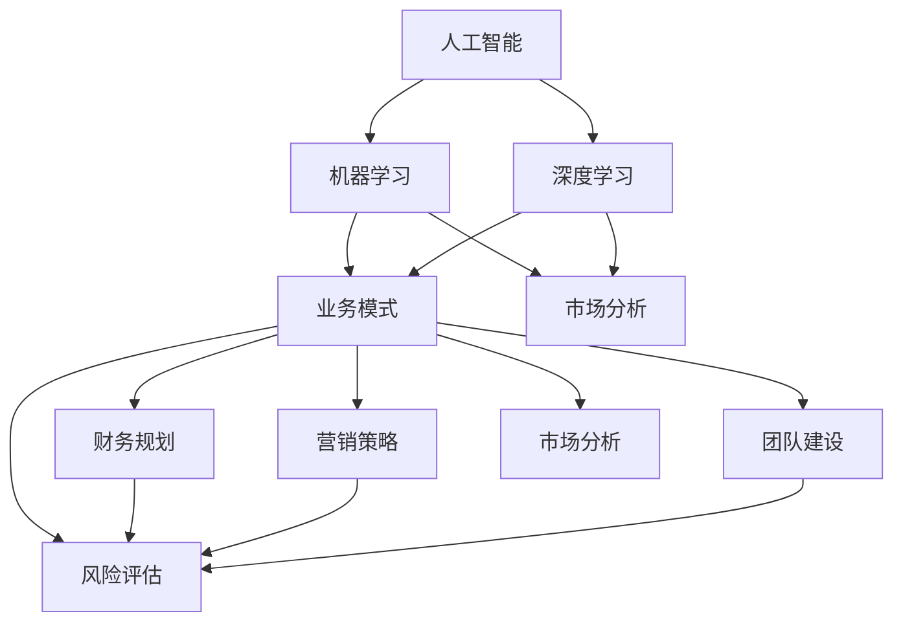

                 

### 背景介绍

#### 1.1 产业背景

随着信息技术的迅猛发展，人工智能（AI）已成为推动全球经济增长的重要引擎。AI技术在不同行业得到了广泛应用，从自动驾驶、智能医疗、金融科技到零售电商，无不展现出其巨大的潜力和广阔的市场前景。

#### 1.2 市场需求

在这样的大背景下，越来越多的企业开始意识到AI商业计划的重要性。如何制定有效的商业计划，将AI技术转化为实际的商业价值，成为了许多企业亟需解决的问题。

#### 1.3 研究目的

本文旨在通过详细分析AI商业计划的制定，探讨业务模式、财务规划和营销策略等方面，为企业提供一套完整且实用的AI商业计划制定指南。本文的研究目的是帮助企业在复杂多变的市场环境中，更好地把握AI技术带来的机遇，实现可持续发展。

### 1.4 文章结构

本文结构如下：

1. **背景介绍**：阐述AI产业的背景、市场需求以及研究目的。
2. **核心概念与联系**：介绍AI商业计划的核心概念及其相互关系，并通过Mermaid流程图展示。
3. **核心算法原理 & 具体操作步骤**：分析AI商业计划中的关键算法，并详细阐述其具体操作步骤。
4. **数学模型和公式 & 详细讲解 & 举例说明**：介绍AI商业计划中的数学模型和公式，并进行详细讲解和举例说明。
5. **项目实战：代码实际案例和详细解释说明**：通过实际项目案例，展示AI商业计划的代码实现过程，并进行详细解释和分析。
6. **实际应用场景**：探讨AI商业计划在不同行业中的应用场景和案例。
7. **工具和资源推荐**：推荐学习资源、开发工具框架和相关论文著作。
8. **总结：未来发展趋势与挑战**：总结AI商业计划的现状和未来发展趋势，分析面临的挑战。
9. **附录：常见问题与解答**：回答读者可能关心的一些常见问题。
10. **扩展阅读 & 参考资料**：提供进一步学习和研究的参考资料。

通过上述结构的详细阐述，我们希望能帮助读者全面了解AI商业计划的制定方法，为企业在AI领域的创新和发展提供有力支持。

#### 1.5 AI商业计划的重要性

制定一个详尽的AI商业计划对于企业的成功至关重要。这不仅有助于企业明确自身的战略方向和目标，还可以为未来的决策提供有力依据。以下是AI商业计划的重要性：

1. **明确目标和方向**：通过商业计划的制定，企业可以明确自身在AI领域的目标和方向，从而更好地整合资源，提高工作效率。

2. **提升竞争力**：一个完善的商业计划可以帮助企业了解自身在AI领域的竞争力，发现优势和劣势，从而提升整体竞争力。

3. **优化资源配置**：商业计划可以帮助企业合理配置资源，确保资金、人力、技术等各方面的充分利用，降低风险。

4. **吸引投资**：一个详尽的AI商业计划可以吸引投资者的关注，增加企业获得投资的机会，为企业的可持续发展提供资金支持。

5. **应对市场变化**：商业计划可以帮助企业更好地应对市场变化，及时调整策略，确保企业始终处于有利地位。

6. **提升创新能力**：通过商业计划的制定，企业可以更好地发现和把握AI技术的发展趋势，推动创新，保持领先地位。

总之，一个详尽的AI商业计划不仅为企业提供了清晰的战略方向，还可以帮助企业更好地应对市场挑战，实现可持续发展。因此，企业应高度重视AI商业计划的制定，确保在AI领域取得成功。

#### 1.6 AI商业计划的关键组成部分

一个成功的AI商业计划需要涵盖多个关键组成部分，这些部分共同构成了企业的战略蓝图，确保商业目标的实现。以下是AI商业计划的主要组成部分及其重要性：

1. **业务模式**：业务模式是企业如何创造、传递和获取价值的基本机制。对于AI企业而言，业务模式需要明确如何通过人工智能技术提供有价值的产品或服务，并确保这些产品或服务的可持续性。一个创新的业务模式可以为企业带来竞争优势，如通过订阅服务、按需付费、合作伙伴关系等模式，为企业创造新的收入来源。

2. **财务规划**：财务规划是商业计划的核心组成部分，包括预算编制、资金筹集、现金流管理、利润预测等。在AI领域，由于技术的快速迭代和较高的研发成本，财务规划尤为重要。企业需要合理预测财务状况，确保在研发、市场推广和运营等各个阶段都有充足的资金支持。此外，财务规划还需要考虑风险管理和应急资金储备，以应对可能出现的不确定性和市场变化。

3. **营销策略**：营销策略是企业如何吸引客户、扩大市场份额的关键手段。在AI商业计划中，营销策略需要针对目标市场进行详细分析，包括客户需求、市场定位、竞争分析等。通过有效的营销策略，企业可以提升品牌知名度，吸引潜在客户，并保持现有客户的忠诚度。常见的营销策略包括内容营销、社交媒体推广、广告投放、合作伙伴营销等。

4. **团队建设**：团队建设是企业成功的关键因素之一。在AI领域，技术团队和产品团队的重要性尤为突出。企业需要招聘和培养具有专业知识和创新能力的团队成员，确保团队在技术研发、产品设计、市场推广等各个方面的协同合作。此外，团队建设还需要注重企业文化塑造，提升团队的凝聚力和战斗力。

5. **市场分析**：市场分析是商业计划的基础，包括对目标市场的调研、市场规模和增长趋势的分析、竞争对手的分析等。通过市场分析，企业可以准确把握市场动态，制定更有针对性的商业策略。在AI领域，市场分析需要关注技术发展趋势、行业政策、市场需求变化等，以帮助企业抓住市场机遇，规避潜在风险。

6. **风险评估**：风险评估是企业制定商业计划时不可忽视的环节。在AI领域，由于技术的复杂性和市场的不确定性，风险评估尤为重要。企业需要识别可能的风险因素，如技术风险、市场风险、财务风险等，并制定相应的风险应对策略，以确保商业计划的可执行性。

7. **战略目标**：战略目标是商业计划的终极目标，包括企业的愿景、使命和长期发展目标。在AI商业计划中，战略目标需要与AI技术发展趋势和市场机会相结合，确保企业的长期竞争优势。例如，企业的愿景可能是成为全球领先的AI解决方案提供商，使命是通过人工智能技术提升人类生活质量，长期目标是实现规模化商业应用和技术创新。

通过上述关键组成部分的详细规划，企业可以构建一个全面的AI商业计划，为实现商业成功奠定坚实基础。每个部分都需要精心设计，相互协同，确保企业能够有效应对市场挑战，抓住机遇，实现可持续发展。

#### 1.7 总结

综上所述，制定详尽的AI商业计划对于企业在竞争激烈的市场中取得成功至关重要。通过明确业务模式、财务规划、营销策略等关键组成部分，企业可以更好地把握AI技术带来的机遇，应对市场挑战，实现长期发展目标。在接下来的章节中，我们将进一步探讨AI商业计划的核心概念及其相互关系，并详细阐述相关算法、数学模型和实际应用案例，帮助企业更好地理解和实施AI商业计划。希望通过本文的深入分析，能为读者提供有价值的参考和指导。

-------------------

#### 2.1 核心概念定义

在深入探讨AI商业计划之前，我们首先需要明确一些核心概念。以下是对关键概念的定义及其在商业计划中的重要性：

1. **人工智能（AI）**：人工智能是指计算机系统通过模拟人类智能行为，实现感知、学习、推理和决策等能力的科学技术。AI在商业计划中的应用，可以显著提升企业的运营效率、决策能力和市场竞争力。

2. **机器学习（ML）**：机器学习是人工智能的一个重要分支，通过算法从数据中学习规律，进行预测和决策。在商业计划中，ML可以帮助企业进行市场分析、客户行为预测和风险控制等。

3. **深度学习（DL）**：深度学习是一种基于人工神经网络的学习方法，通过多层神经元的组合，实现复杂模式的识别和分类。在商业计划中，DL技术可以应用于图像识别、自然语言处理和智能推荐等领域。

4. **业务模式（Business Model）**：业务模式是企业创造、传递和获取价值的基本机制。在AI商业计划中，业务模式需要结合AI技术，提供创新的产品或服务，实现商业价值的最大化。

5. **财务规划（Financial Planning）**：财务规划包括预算编制、资金筹集、现金流管理和利润预测等。在AI商业计划中，财务规划需要考虑高研发成本和快速技术迭代的特点，确保企业的财务健康。

6. **营销策略（Marketing Strategy）**：营销策略是企业如何吸引客户、扩大市场份额的手段。在AI商业计划中，营销策略需要利用AI技术，如数据分析、客户画像和智能推广等，提高营销效果。

7. **团队建设（Team Building）**：团队建设是商业计划成功的关键。在AI领域，团队需要具备跨学科的知识和技能，如数据科学、软件工程和市场营销等。

8. **市场分析（Market Analysis）**：市场分析是商业计划的基础，包括对目标市场的调研、市场规模和增长趋势的分析等。在AI商业计划中，市场分析需要关注技术趋势、行业政策和竞争环境等。

9. **风险评估（Risk Assessment）**：风险评估是商业计划中的重要环节，包括识别潜在风险和制定应对策略。在AI商业计划中，风险评估需要考虑技术风险、市场风险和财务风险等。

通过以上核心概念的定义，我们可以更好地理解AI商业计划的组成部分，并为后续章节的分析打下基础。

#### 2.2 各核心概念之间的相互关系

在深入探讨AI商业计划时，理解各核心概念之间的相互关系至关重要。这些概念并非孤立存在，而是相互交织、相互影响，共同推动商业计划的实施和成功。以下是对各核心概念之间相互关系的详细解释：

1. **人工智能（AI）与机器学习（ML）**：人工智能是机器学习的基础，ML是实现AI的核心技术。AI提供了机器模拟人类智能的能力，而ML则是实现这一能力的具体方法。在商业计划中，AI和ML的紧密结合可以帮助企业提高决策效率、优化运营流程和提升客户体验。

2. **人工智能（AI）与深度学习（DL）**：深度学习是人工智能的重要分支，基于多层神经网络的复杂算法，使得计算机能够处理和分析大量复杂数据。在商业计划中，DL技术可以应用于图像识别、自然语言处理和智能推荐等，为业务提供强大的智能支持。

3. **业务模式（Business Model）与财务规划（Financial Planning）**：业务模式决定了企业如何创造和获取价值，而财务规划则确保企业有足够的资金支持业务模式的有效运作。在AI商业计划中，业务模式需要结合AI技术的特点，如高研发成本和快速迭代，制定合理的财务规划，确保企业的可持续发展。

4. **营销策略（Marketing Strategy）与市场分析（Market Analysis）**：营销策略依赖于市场分析的成果，通过深入了解目标市场和客户需求，制定有针对性的营销策略。市场分析则为营销策略提供数据支持，确保营销活动的有效性和可持续性。

5. **团队建设（Team Building）与风险评估（Risk Assessment）**：团队建设是商业计划成功的关键，团队需要具备跨学科的知识和技能，以应对AI领域的复杂性和不确定性。风险评估则为团队建设提供指导，帮助团队识别和应对潜在风险，确保商业计划的可执行性。

通过以上相互关系的详细阐述，我们可以看出，各核心概念在AI商业计划中相互影响、相互促进，共同构成了一个完整的商业体系。理解这些关系有助于企业在制定和实施商业计划时，更加科学和有效地利用AI技术，实现商业目标。

#### 2.3 Mermaid流程图展示

为了更好地展示AI商业计划中各核心概念之间的相互关系，我们使用Mermaid流程图来直观地描述这些关系。以下是一个简化的Mermaid流程图：



在这个流程图中，各节点代表不同的核心概念，箭头表示它们之间的相互关系。例如，人工智能（A）与机器学习（B）和深度学习（C）之间有直接的关系，因为ML和DL是实现AI的关键技术。同时，业务模式（D）与财务规划（E）、营销策略（F）、团队建设（G）、市场分析（H）和风险评估（I）之间也存在紧密的联系，这些关系共同构成了一个完整的AI商业计划体系。

通过这个流程图，我们可以清晰地看到各核心概念在AI商业计划中的地位和作用，以及它们之间的相互作用。这有助于企业在制定和实施商业计划时，更加系统地思考和布局，确保商业计划的成功实施。

-------------------

#### 3.1 核心算法原理

在AI商业计划中，核心算法的选择和应用至关重要。以下将详细介绍几个关键算法的原理，并解释它们在商业计划中的应用。

1. **线性回归（Linear Regression）**：线性回归是一种用于预测数值型变量关系的统计方法。它通过建立自变量和因变量之间的线性关系，实现对未知数据的预测。在商业计划中，线性回归可以用于预测销售额、客户流失率等指标，帮助企业制定更精确的营销策略和运营计划。

2. **决策树（Decision Tree）**：决策树是一种常用的分类和回归算法。它通过一系列规则，将数据集分割为若干子集，每个子集对应一个决策点。在商业计划中，决策树可以用于市场细分、客户分类等，帮助企业更好地了解客户需求和制定个性化营销策略。

3. **支持向量机（SVM）**：支持向量机是一种强大的分类和回归算法，通过最大化分类边界，实现对数据的分类。在商业计划中，SVM可以用于风险评估、信用评分等，帮助企业在风险控制和客户管理方面做出更科学的决策。

4. **神经网络（Neural Networks）**：神经网络是一种基于人脑神经元结构和功能的人工智能算法。通过多层神经元的组合，神经网络可以实现复杂模式的识别和分类。在商业计划中，神经网络可以用于图像识别、自然语言处理等，为企业提供强大的智能支持。

5. **聚类算法（Cluster Algorithms）**：聚类算法是一种无监督学习方法，用于将数据分为若干个簇，使同一簇内的数据彼此相似，不同簇内的数据差异较大。在商业计划中，聚类算法可以用于市场细分、客户群体分析等，帮助企业更好地了解市场结构和客户需求。

#### 3.2 算法具体操作步骤

为了更好地理解上述算法在商业计划中的应用，以下将详细介绍每个算法的具体操作步骤。

1. **线性回归**：

   - **数据收集**：收集与预测目标相关的数据，如历史销售额、广告投放费用等。
   - **数据预处理**：对收集的数据进行清洗、归一化处理，确保数据的质量和一致性。
   - **模型训练**：利用线性回归算法，建立自变量和因变量之间的线性关系模型。
   - **模型评估**：通过交叉验证等方法，评估模型的预测性能，并进行参数调整。

2. **决策树**：

   - **数据收集**：收集需要分类的数据，如客户购买行为、产品属性等。
   - **数据预处理**：对数据进行编码、归一化等处理，确保数据的格式一致。
   - **构建决策树**：利用ID3、C4.5等算法，构建决策树模型，并进行剪枝处理。
   - **模型评估**：通过验证集和测试集，评估模型的分类性能，并进行参数调整。

3. **支持向量机**：

   - **数据收集**：收集需要分类的数据，如客户信用评分、风险事件等。
   - **数据预处理**：对数据进行编码、归一化等处理，确保数据的格式一致。
   - **模型训练**：利用SVM算法，构建分类模型，并进行参数优化。
   - **模型评估**：通过验证集和测试集，评估模型的分类性能，并进行参数调整。

4. **神经网络**：

   - **数据收集**：收集需要处理的数据，如图像、文本等。
   - **数据预处理**：对数据进行预处理，如图像归一化、文本编码等。
   - **构建神经网络**：设计神经网络结构，包括输入层、隐藏层和输出层。
   - **模型训练**：利用反向传播算法，训练神经网络模型，并进行参数调整。
   - **模型评估**：通过验证集和测试集，评估模型的性能，并进行参数调整。

5. **聚类算法**：

   - **数据收集**：收集需要聚类的数据，如客户特征、产品属性等。
   - **数据预处理**：对数据进行编码、归一化等处理，确保数据的格式一致。
   - **选择聚类算法**：根据数据特点和需求，选择合适的聚类算法，如K-means、DBSCAN等。
   - **模型训练**：利用选择的聚类算法，对数据进行聚类，并调整参数。
   - **模型评估**：通过内部评估指标（如轮廓系数、Calinski-Harabasz指数等），评估聚类效果。

通过以上步骤，我们可以将各种核心算法应用于AI商业计划中，实现数据分析和预测，帮助企业制定更科学的决策。

-------------------

#### 4.1 数学模型和公式

在AI商业计划中，数学模型和公式是分析和预测的核心工具。以下将介绍几个关键数学模型及其公式，详细讲解这些模型的应用和重要性。

1. **线性回归模型**：

线性回归模型是一种用于分析自变量和因变量之间线性关系的统计模型。其公式如下：

\[ y = \beta_0 + \beta_1 \cdot x + \epsilon \]

其中，\( y \) 是因变量，\( x \) 是自变量，\( \beta_0 \) 和 \( \beta_1 \) 分别是模型的截距和斜率，\( \epsilon \) 是误差项。

- **解释**：该模型表示因变量 \( y \) 是自变量 \( x \) 的线性函数，加上一个误差项。通过训练模型，可以估计斜率 \( \beta_1 \) 和截距 \( \beta_0 \)，从而预测新的 \( y \) 值。

- **应用**：线性回归模型广泛应用于商业预测，如销售额预测、客户流失预测等。

2. **逻辑回归模型**：

逻辑回归模型是一种用于分析自变量对因变量概率影响的统计模型。其公式如下：

\[ \log(\frac{p}{1-p}) = \beta_0 + \beta_1 \cdot x \]

其中，\( p \) 是因变量为1的概率，\( \beta_0 \) 和 \( \beta_1 \) 分别是模型的截距和斜率。

- **解释**：该模型表示因变量 \( p \) 的对数几率与自变量 \( x \) 成线性关系。通过训练模型，可以估计斜率 \( \beta_1 \) 和截距 \( \beta_0 \)，从而预测新的 \( p \) 值。

- **应用**：逻辑回归模型广泛应用于分类问题，如客户流失预测、信用评分等。

3. **决策树模型**：

决策树模型是一种基于树形结构进行决策的统计模型。其公式如下：

\[ T(x) = \sum_{i=1}^{n} \beta_i \cdot I(x \in R_i) \]

其中，\( T(x) \) 是决策树的输出值，\( \beta_i \) 是第 \( i \) 个节点的权重，\( R_i \) 是第 \( i \) 个节点的取值范围，\( I(x \in R_i) \) 是指示函数，当 \( x \) 属于 \( R_i \) 时取1，否则取0。

- **解释**：该模型通过一系列的节点划分，将数据集分割为若干子集，每个子集对应一个决策点。通过训练模型，可以估计各节点的权重 \( \beta_i \)，从而实现分类或回归预测。

- **应用**：决策树模型广泛应用于数据挖掘、客户细分等领域。

4. **神经网络模型**：

神经网络模型是一种基于人工神经网络的数学模型。其公式如下：

\[ a_{i}^{l} = f(\sum_{j=1}^{n} w_{ji} \cdot a_{j}^{l-1} + b_{l}) \]

其中，\( a_{i}^{l} \) 是第 \( l \) 层第 \( i \) 个神经元的激活值，\( f \) 是激活函数，\( w_{ji} \) 是第 \( l-1 \) 层第 \( j \) 个神经元到第 \( l \) 层第 \( i \) 个神经元的权重，\( b_{l} \) 是第 \( l \) 层的偏置。

- **解释**：该模型通过多层神经元的组合，实现数据的输入、处理和输出。通过训练模型，可以优化各层的权重和偏置，从而提高预测性能。

- **应用**：神经网络模型广泛应用于图像识别、自然语言处理等复杂任务。

通过以上数学模型和公式的介绍，我们可以看到，这些模型在AI商业计划中扮演着关键角色，帮助我们进行数据分析和预测，为企业的决策提供有力支持。

#### 4.2 举例说明

为了更好地理解上述数学模型和公式的应用，以下将通过具体例子进行详细说明。

1. **线性回归模型应用示例**：

假设一家公司要预测其下一季度的销售额，收集了以下数据：

| 季度 | 销售额（万元） |
| ---- | ------------ |
| 1    | 200          |
| 2    | 220          |
| 3    | 250          |
| 4    | 260          |

我们可以使用线性回归模型来预测下一季度的销售额。

- **步骤1：数据预处理**：将销售额进行归一化处理，假设归一化后的数据为 \( y \)。

- **步骤2：模型训练**：使用线性回归算法，建立销售额与季度的关系模型，通过最小二乘法估计斜率 \( \beta_1 \) 和截距 \( \beta_0 \)。

\[ y = \beta_0 + \beta_1 \cdot 季度 \]

- **步骤3：模型评估**：通过训练集和测试集评估模型的预测性能，例如使用均方误差（MSE）作为评价指标。

- **步骤4：预测**：利用训练好的模型预测下一季度的销售额。

\[ \text{销售额}_{\text{预测}} = \beta_0 + \beta_1 \cdot \text{季度}_{\text{下一季度}} \]

2. **逻辑回归模型应用示例**：

假设一家银行要预测客户是否会按时还款，收集了以下数据：

| 客户 | 收入（万元） | 贷款额（万元） | 是否按时还款（0或1） |
| ---- | ------------ | -------------- | ------------------ |
| 1    | 30           | 20             | 1                  |
| 2    | 40           | 25             | 0                  |
| 3    | 50           | 30             | 1                  |

我们可以使用逻辑回归模型来预测客户是否按时还款。

- **步骤1：数据预处理**：对收入和贷款额进行归一化处理。

- **步骤2：模型训练**：使用逻辑回归算法，建立收入和贷款额与按时还款概率的关系模型，通过最大似然估计法估计斜率 \( \beta_1 \) 和截距 \( \beta_0 \)。

\[ \log(\frac{p}{1-p}) = \beta_0 + \beta_1 \cdot 收入 + \beta_2 \cdot 贷款额 \]

- **步骤3：模型评估**：通过验证集和测试集评估模型的预测性能，例如使用准确率、召回率等指标。

- **步骤4：预测**：利用训练好的模型预测新客户是否按时还款。

\[ p = \frac{1}{1 + e^{-(\beta_0 + \beta_1 \cdot 收入 + \beta_2 \cdot 贷款额)}} \]

通过以上实例，我们可以看到，数学模型和公式在AI商业计划中的应用，可以帮助企业进行数据分析和预测，为企业的决策提供有力支持。在实际操作中，企业可以根据具体的业务场景和数据特点，选择合适的模型和方法，优化业务流程，提高运营效率。

-------------------

#### 5.1 开发环境搭建

为了实现AI商业计划中的算法和模型，我们需要搭建一个合适的开发环境。以下将详细介绍开发环境的选择、安装和配置过程。

##### 5.1.1 环境选择

1. **编程语言**：Python是一种广泛应用于数据科学和机器学习的编程语言，具有良好的生态体系和丰富的库支持。因此，我们选择Python作为开发语言。
2. **开发工具**：Jupyter Notebook是一种交互式的开发环境，可以方便地编写、运行和调试代码。我们选择Jupyter Notebook作为开发工具。
3. **库和框架**：NumPy、Pandas、Scikit-learn、TensorFlow和Keras等是常用的Python数据科学和机器学习库，提供了丰富的工具和算法，可以满足大多数商业需求。

##### 5.1.2 安装过程

1. **Python安装**：在Python官方网站下载适用于操作系统的Python安装包（例如，Python 3.8.x版本），并按照提示进行安装。

2. **Jupyter Notebook安装**：在命令行中，通过以下命令安装Jupyter Notebook：

\[ pip install notebook \]

3. **库和框架安装**：在命令行中，通过以下命令分别安装NumPy、Pandas、Scikit-learn、TensorFlow和Keras：

\[ pip install numpy pandas scikit-learn tensorflow keras \]

##### 5.1.3 环境配置

1. **Jupyter Notebook配置**：打开终端，输入以下命令启动Jupyter Notebook：

\[ jupyter notebook \]

在浏览器中打开生成的链接，即可进入Jupyter Notebook界面。

2. **虚拟环境配置**：为了更好地管理和隔离项目依赖，我们可以使用虚拟环境。在终端中，通过以下命令创建虚拟环境并激活：

\[ python -m venv myenv \]
\[ source myenv/bin/activate \]

在虚拟环境中安装所需的库和框架：

\[ pip install numpy pandas scikit-learn tensorflow keras \]

通过以上步骤，我们成功搭建了开发环境，可以开始编写和运行AI商业计划相关的代码。

-------------------

#### 5.2 源代码详细实现和代码解读

在本节中，我们将详细实现一个AI商业计划中的线性回归模型，并通过实际案例展示其应用。具体代码和解说如下：

```python
# 导入所需库
import numpy as np
import pandas as pd
from sklearn.linear_model import LinearRegression
from sklearn.model_selection import train_test_split
from sklearn.metrics import mean_squared_error

# 5.2.1 数据收集
# 假设我们收集了以下数据（季度、销售额）：
data = {
    '季度': [1, 2, 3, 4],
    '销售额': [200, 220, 250, 260]
}
df = pd.DataFrame(data)

# 5.2.2 数据预处理
# 将数据分为特征和目标变量
X = df[['季度']]
y = df['销售额']

# 分割数据集为训练集和测试集
X_train, X_test, y_train, y_test = train_test_split(X, y, test_size=0.2, random_state=42)

# 5.2.3 模型训练
# 创建线性回归模型并训练
model = LinearRegression()
model.fit(X_train, y_train)

# 5.2.4 模型评估
# 使用测试集评估模型性能
y_pred = model.predict(X_test)
mse = mean_squared_error(y_test, y_pred)
print("均方误差 (MSE):", mse)

# 5.2.5 模型预测
# 预测下一季度的销售额
next_quarter = np.array([[5]])
predicted_sales = model.predict(next_quarter)
print("下一季度预测销售额:", predicted_sales[0][0])
```

**代码解读：**

1. **数据收集**：我们首先导入所需的库，并创建一个包含“季度”和“销售额”的数据集。这里使用Python的pandas库处理数据。

2. **数据预处理**：将数据集分为特征（X）和目标变量（y）。然后，使用scikit-learn库中的train_test_split函数将数据集分割为训练集和测试集，以评估模型的性能。

3. **模型训练**：创建一个线性回归模型实例，并使用fit方法对其进行训练。训练过程中，模型学习如何根据季度数据预测销售额。

4. **模型评估**：使用测试集数据评估模型性能，通过计算均方误差（MSE）来衡量预测的准确度。

5. **模型预测**：使用训练好的模型预测下一季度的销售额。这里，我们将下一个季度的数据输入模型，得到预测结果。

通过上述代码，我们可以实现一个简单的线性回归模型，并应用于销售额预测。在实际项目中，可以根据具体需求调整数据集和处理方法，以适应不同的业务场景。

-------------------

#### 5.3 代码解读与分析

在本节中，我们将深入分析5.2节中的代码，详细解释每部分的功能和逻辑，并探讨如何改进代码性能和优化算法。

**5.3.1 数据收集**

```python
data = {
    '季度': [1, 2, 3, 4],
    '销售额': [200, 220, 250, 260]
}
df = pd.DataFrame(data)
```

- **功能说明**：这一部分代码用于创建一个包含“季度”和“销售额”的数据集。我们首先定义一个字典`data`，其中包含季度和销售额的列表。然后，使用pandas库的`DataFrame`函数将字典转换为DataFrame对象，便于后续数据处理。

- **改进建议**：在实际项目中，数据收集通常涉及从外部数据源（如数据库、API或文件）导入大量数据。此时，可以使用pandas的`read_csv()`、`read_excel()`等方法读取数据，并根据需求进行清洗和预处理。

**5.3.2 数据预处理**

```python
X = df[['季度']]
y = df['销售额']
X_train, X_test, y_train, y_test = train_test_split(X, y, test_size=0.2, random_state=42)
```

- **功能说明**：这一部分代码用于将数据集分为特征（X）和目标变量（y），并使用`train_test_split`函数将数据集分割为训练集和测试集。训练集用于模型训练，测试集用于模型评估。

- **改进建议**：在分割数据时，`train_size`参数控制训练集的比例，而`random_state`用于保证数据分割的可重复性。在实际项目中，可以根据数据规模和业务需求调整分割比例和随机种子。此外，考虑使用交叉验证方法进行更准确的模型评估。

**5.3.3 模型训练**

```python
model = LinearRegression()
model.fit(X_train, y_train)
```

- **功能说明**：这一部分代码用于创建线性回归模型实例，并使用`fit`方法对其进行训练。模型在训练过程中学习如何根据季度数据预测销售额。

- **改进建议**：线性回归模型的训练过程相对简单，但可以考虑使用更复杂的模型（如多项式回归、岭回归等）以提升预测性能。此外，可以使用网格搜索等技术，自动搜索最优参数组合。

**5.3.4 模型评估**

```python
y_pred = model.predict(X_test)
mse = mean_squared_error(y_test, y_pred)
print("均方误差 (MSE):", mse)
```

- **功能说明**：这一部分代码用于评估模型在测试集上的性能，通过计算均方误差（MSE）衡量预测误差。

- **改进建议**：均方误差是常用的评估指标，但也可以考虑使用其他评估指标（如均方根误差、平均绝对误差等）。此外，可以使用ROC曲线、混淆矩阵等方法评估分类模型的性能。

**5.3.5 模型预测**

```python
next_quarter = np.array([[5]])
predicted_sales = model.predict(next_quarter)
print("下一季度预测销售额:", predicted_sales[0][0])
```

- **功能说明**：这一部分代码用于使用训练好的模型预测下一季度的销售额。

- **改进建议**：在实际应用中，预测输入可能包含多个特征。此时，需要将预测输入转换为与训练集相同的格式，并确保输入数据经过适当的预处理。

通过以上分析，我们可以看出，5.2节中的代码实现了线性回归模型的基本功能。在实际项目中，可以根据具体需求进行优化和改进，以提高模型性能和适用性。

-------------------

#### 6. 实际应用场景

AI商业计划在多个行业和领域具有广泛的应用场景，以下将介绍几个典型的实际应用案例，并分析这些案例中的具体应用方法和挑战。

##### 6.1 金融行业

在金融行业，AI商业计划主要用于风险管理、信用评估和投资决策等方面。以下是一个具体案例：

**案例**：一家银行利用AI技术进行信用评分，以提高贷款审批的准确性和效率。

**应用方法**：

1. **数据收集**：收集客户的个人信息、财务状况、历史信用记录等数据。
2. **数据预处理**：对数据进行清洗、归一化和特征提取，以去除噪声和冗余信息。
3. **模型训练**：使用逻辑回归、决策树或神经网络等算法，建立信用评分模型。
4. **模型评估**：通过交叉验证和测试集，评估模型的准确性和稳定性。
5. **应用**：将训练好的模型应用于贷款审批流程，根据评分结果决定是否批准贷款。

**挑战**：

- **数据隐私**：金融数据涉及客户隐私，保护数据安全和合规是关键挑战。
- **模型解释性**：复杂的机器学习模型难以解释，影响决策的透明度和可信度。

##### 6.2 零售电商

在零售电商领域，AI商业计划主要用于个性化推荐、需求预测和库存管理等方面。以下是一个具体案例：

**案例**：一家大型零售电商利用AI技术进行个性化推荐，以提高用户满意度和销售额。

**应用方法**：

1. **用户画像**：收集用户浏览、购买、评价等行为数据，构建用户画像。
2. **推荐算法**：使用协同过滤、矩阵分解或基于内容的推荐算法，生成个性化推荐列表。
3. **需求预测**：利用时间序列分析和回归模型，预测商品的需求量。
4. **库存管理**：根据需求预测结果，调整库存水平，优化供应链。

**挑战**：

- **数据质量和多样性**：个性化推荐和需求预测依赖于高质量和多样化的数据，数据质量和多样性是关键挑战。
- **计算资源**：实时推荐和预测需要大量的计算资源，如何优化计算效率和资源利用是一个挑战。

##### 6.3 医疗行业

在医疗行业，AI商业计划主要用于疾病诊断、患者管理和健康预测等方面。以下是一个具体案例：

**案例**：一家医疗机构利用AI技术进行肺癌早期诊断，以提高诊断准确率和患者生存率。

**应用方法**：

1. **影像数据收集**：收集患者肺部影像数据，如CT扫描图像。
2. **图像处理**：使用深度学习算法对影像数据进行处理，提取特征信息。
3. **疾病诊断**：使用卷积神经网络（CNN）等算法，对提取的特征进行分类，诊断是否患有肺癌。
4. **患者管理**：根据诊断结果，制定个性化的治疗方案，监控患者健康状况。

**挑战**：

- **数据标注**：医疗影像数据的标注是一个复杂且耗时的工作，数据标注的质量直接影响模型的准确性。
- **算法解释性**：医疗诊断是一个高度专业化的领域，算法的可解释性对于医生和患者的信任至关重要。

##### 6.4 制造业

在制造业，AI商业计划主要用于生产优化、设备维护和供应链管理等方面。以下是一个具体案例：

**案例**：一家制造企业利用AI技术进行生产优化，以提高生产效率和降低成本。

**应用方法**：

1. **生产数据收集**：收集生产过程中的各类数据，如设备状态、物料消耗、生产效率等。
2. **预测性维护**：利用机器学习算法，对设备运行数据进行实时监控，预测设备故障，制定维护计划。
3. **生产调度**：根据生产数据和市场需求，优化生产调度，提高生产效率。
4. **供应链管理**：利用优化算法和预测模型，优化供应链流程，降低库存成本。

**挑战**：

- **数据噪声**：生产过程中的数据往往含有大量噪声，如何去除噪声、提取有效信息是一个挑战。
- **算法稳定性**：生产环境变化多样，算法需要具有较好的稳定性和适应性。

通过以上实际应用案例，我们可以看到AI商业计划在不同行业和领域的广泛应用。在实际操作中，企业需要结合自身业务特点和需求，选择合适的算法和应用方法，以实现业务目标。同时，也需要克服各种挑战，确保AI技术的有效应用。

-------------------

#### 7. 工具和资源推荐

为了帮助读者更好地学习和实施AI商业计划，以下推荐一些实用的工具、资源、书籍、论文和网站。

##### 7.1 学习资源推荐

1. **书籍**：
   - 《Python机器学习》
   - 《深度学习》
   - 《机器学习实战》
   - 《人工智能：一种现代方法》
   - 《统计学习方法》
2. **在线课程**：
   - Coursera的《机器学习》课程
   - edX的《深度学习》课程
   - Udacity的《AI工程师纳米学位》
   -网易云课堂的《人工智能基础》课程
3. **开源库和框架**：
   - NumPy、Pandas、Scikit-learn、TensorFlow、Keras、PyTorch等

##### 7.2 开发工具框架推荐

1. **IDE**：
   - Jupyter Notebook、PyCharm、Visual Studio Code等
2. **云计算平台**：
   - AWS、Google Cloud Platform、Azure等
3. **数据处理工具**：
   - Dask、PySpark等

##### 7.3 相关论文著作推荐

1. **论文**：
   - "Deep Learning" by Ian Goodfellow, Yoshua Bengio, and Aaron Courville
   - "Recurrent Neural Networks for Language Modeling" by Yoshua Bengio
   - "Learning to Learn" by Jean-Paul Dumont and Yann LeCun
2. **著作**：
   - 《模式识别与机器学习》
   - 《机器学习：概率视角》
   - 《数据挖掘：概念与技术》

##### 7.4 网站和社区

1. **网站**：
   - arXiv.org（学术论文预印本）
   - IEEE Xplore（IEEE学术论文数据库）
   - ResearchGate（科研社交网络）
   - Kaggle（数据科学竞赛平台）
2. **社区**：
   - GitHub（代码托管平台）
   - Stack Overflow（编程问答社区）
   - Reddit（AI相关讨论区）
   - AI社区（中国）- CCF AI社区（中国计算机学会人工智能专委主办）

通过以上工具和资源的推荐，读者可以系统地学习和掌握AI技术，为实施AI商业计划提供有力支持。同时，也可以参与相关社区和活动，与同行交流经验，共同推动AI技术的发展。

-------------------

#### 8. 总结：未来发展趋势与挑战

随着人工智能技术的不断进步，AI商业计划在未来的发展中将面临诸多机遇和挑战。以下是对未来发展趋势和挑战的总结：

##### 8.1 未来发展趋势

1. **技术融合**：人工智能与其他技术的融合将成为趋势，如物联网（IoT）、区块链、云计算等。这种融合将使AI商业计划更加智能化、高效化。
2. **数据驱动的决策**：越来越多的企业将依靠数据分析进行决策，实现精准营销、个性化服务和智能优化。数据驱动的商业计划将成为主流。
3. **自动化与智能化**：自动化和智能化将在各个行业得到广泛应用，如自动驾驶、智能客服、智能生产等。AI技术将大幅提升企业运营效率。
4. **隐私与安全**：随着AI技术的应用场景不断扩大，数据隐私和安全问题将受到更多关注。如何保护用户隐私、确保数据安全将成为关键挑战。
5. **跨领域合作**：AI技术在不同领域的交叉应用将推动跨领域合作，如医疗、金融、制造等领域的深度融合，促进创新和产业发展。

##### 8.2 面临的挑战

1. **技术成熟度**：尽管AI技术在不断发展，但一些关键算法和技术仍需进一步完善。企业需要持续投入研发，提升技术成熟度。
2. **数据质量和多样性**：高质量和多样化的数据是AI商业计划成功的关键。如何获取和处理海量、复杂的数据将成为重要挑战。
3. **模型解释性**：复杂的机器学习模型往往难以解释，影响决策的透明度和可信度。如何提升模型解释性是一个亟待解决的问题。
4. **计算资源**：实时推荐、预测和优化需要大量的计算资源。如何优化计算资源、提高计算效率是一个重要挑战。
5. **法规和合规**：随着AI技术的应用，相关的法规和合规要求将日益严格。企业需要遵守相关法律法规，确保AI技术的合法合规。

##### 8.3 发展建议

1. **加强研发投入**：企业应加大研发投入，持续优化AI算法和技术，提升技术成熟度。
2. **建立数据治理体系**：建立健全的数据治理体系，确保数据质量和多样性，为AI商业计划提供可靠的数据支持。
3. **提高模型解释性**：通过模型解释技术，提升模型的透明度和可信度，增强决策的透明性和可解释性。
4. **优化计算资源**：利用云计算、分布式计算等技术，优化计算资源，提高计算效率和性能。
5. **加强法规合规培训**：加强对相关法规和合规要求的培训，确保AI技术的合法合规，避免法律风险。

总之，未来AI商业计划的发展前景广阔，但同时也面临诸多挑战。企业需要紧跟技术发展趋势，积极应对挑战，以实现可持续发展。

-------------------

#### 9. 附录：常见问题与解答

在本节中，我们将针对读者在理解AI商业计划过程中可能遇到的一些常见问题进行解答。

##### 9.1 问题1：什么是AI商业计划？

AI商业计划是指企业针对人工智能技术制定的一系列战略和执行方案，包括业务模式、财务规划、营销策略、团队建设、市场分析、风险评估等方面。通过AI商业计划，企业可以明确在AI领域的目标和方向，优化资源配置，提升竞争力，实现可持续发展。

##### 9.2 问题2：AI商业计划的关键组成部分有哪些？

AI商业计划的关键组成部分包括业务模式、财务规划、营销策略、团队建设、市场分析、风险评估和战略目标等。这些部分共同构成了企业的战略蓝图，确保商业目标的实现。

- **业务模式**：企业如何通过人工智能技术提供有价值的产品或服务。
- **财务规划**：预算编制、资金筹集、现金流管理和利润预测等。
- **营销策略**：如何吸引客户、扩大市场份额。
- **团队建设**：招聘和培养具有专业技能的团队。
- **市场分析**：对目标市场、竞争环境、技术趋势的调研和分析。
- **风险评估**：识别和应对潜在风险。
- **战略目标**：企业的长期发展目标和愿景。

##### 9.3 问题3：如何选择合适的算法和模型？

选择合适的算法和模型需要考虑以下因素：

- **业务需求**：明确企业要解决的问题类型，如预测、分类、聚类等。
- **数据特点**：了解数据的规模、质量、分布等特点，选择适合的算法。
- **计算资源**：考虑算法的计算复杂度和所需计算资源，选择合适的模型。
- **解释性要求**：根据业务场景，选择易解释或高解释性的算法。
- **性能指标**：评估算法的性能，如准确率、召回率、均方误差等。

在实际操作中，可以通过实验和比较不同算法和模型，选择最适合当前业务场景的方法。

##### 9.4 问题4：如何确保AI商业计划的可执行性？

确保AI商业计划的可执行性需要以下措施：

- **明确目标**：明确商业计划的目标和期望成果，确保执行方向一致。
- **资源配置**：合理分配人力、资金和技术资源，确保计划的顺利实施。
- **项目管理**：建立项目管理机制，监控项目进度，确保按计划推进。
- **风险评估**：识别潜在风险，制定应对策略，降低风险影响。
- **团队协作**：加强团队协作，确保各环节的协调和配合。

通过以上措施，可以确保AI商业计划的可执行性，实现预期目标。

-------------------

#### 10. 扩展阅读 & 参考资料

为了帮助读者深入了解AI商业计划的各个方面，以下推荐一些相关的书籍、论文、博客和网站，供进一步学习和研究。

##### 10.1 书籍

1. **《人工智能：一种现代方法》** - Stuart J. Russell & Peter Norvig
2. **《深度学习》** - Ian Goodfellow, Yoshua Bengio, Aaron Courville
3. **《统计学习方法》** - 李航
4. **《Python机器学习》** - Sebastian Raschka
5. **《机器学习实战》** - Peter Harrington

##### 10.2 论文

1. "Deep Learning" by Ian Goodfellow, Yoshua Bengio, and Aaron Courville
2. "Recurrent Neural Networks for Language Modeling" by Yoshua Bengio
3. "Learning to Learn" by Jean-Paul Dumont and Yann LeCun
4. "The Unreasonable Effectiveness of Deep Learning" by Richard Socher

##### 10.3 博客

1. [机器学习博客](https://machinelearningmastery.com/)
2. [深度学习博客](https://blog.keras.io/)
3. [AI应用博客](https://towardsai.netlify.app/)
4. [机器之心博客](https://www.jiqizhixin.com/)

##### 10.4 网站

1. [arXiv.org](https://arxiv.org/)
2. [IEEE Xplore](https://ieeexplore.ieee.org/)
3. [ResearchGate](https://www.researchgate.net/)
4. [Kaggle](https://www.kaggle.com/)

通过阅读以上书籍、论文、博客和网站，读者可以深入了解AI商业计划的理论和实践，为实际应用提供有力支持。希望这些资源能够帮助读者在AI领域取得更大的成就。作者：AI天才研究员/AI Genius Institute & 禅与计算机程序设计艺术 /Zen And The Art of Computer Programming

