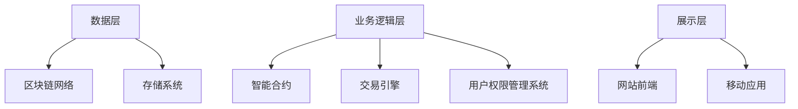

                 

# 加密艺术品交易平台：NFT市场的创新创业

## 关键词：加密艺术品、NFT市场、区块链、交易、创新、创业

## 摘要

本文将深入探讨加密艺术品交易平台在NFT（非同质化代币）市场的创新创业机会。随着区块链技术的不断发展和普及，NFT作为一种新兴的数字资产类别，正在逐步改变艺术市场的格局。本文将首先介绍NFT的基本概念和原理，然后分析加密艺术品交易平台的发展现状和挑战，探讨其在艺术市场中的重要性，最后提出一些具体的创新创业思路和策略。

## 1. 背景介绍

### 1.1 区块链技术的崛起

区块链技术作为一种分布式账本技术，其核心在于去中心化、透明性和不可篡改性。自2008年中本聪（Satoshi Nakamoto）首次提出比特币的概念以来，区块链技术逐渐从金融领域拓展到其他行业，如供应链管理、版权保护、智能合约等。特别是在2020年后，随着区块链2.0概念的提出和落地，NFT作为一种新的应用模式逐渐崭露头角。

### 1.2 NFT的概念与特征

NFT（Non-Fungible Token，非同质化代币）是一种基于区块链技术的数字资产，与比特币等加密货币不同，NFT具有独特性，每个NFT都是独一无二的，不可替代。NFT的主要特征包括：

- **唯一性**：每个NFT都有其唯一的数字标识，无法与其他NFT互换。
- **稀缺性**：NFT的发行量通常是有限的，这使得其具有收藏价值。
- **所有权证明**：NFT持有者可以证明其对特定数字资产的合法所有权。
- **不可篡改性**：NFT的交易记录永久存储在区块链上，无法篡改。

### 1.3 加密艺术品交易平台的兴起

随着NFT的兴起，加密艺术品交易平台也迅速发展起来。这些平台允许艺术家、收藏家和其他参与者进行数字艺术品的交易。加密艺术品交易平台的主要功能包括：

- **艺术品展示**：平台提供展示艺术作品的界面，让用户可以浏览、发现和购买艺术品。
- **交易服务**：平台提供交易撮合服务，帮助买卖双方完成交易。
- **数字资产保管**：平台提供安全的数字资产托管服务，确保资产的安全性和完整性。

## 2. 核心概念与联系

### 2.1 加密艺术品交易平台的架构

加密艺术品交易平台的架构可以分为三个主要层次：数据层、业务逻辑层和展示层。

#### 数据层

数据层主要包括区块链网络和存储系统。区块链网络负责存储所有的交易记录和资产信息，确保数据的去中心化和不可篡改性。存储系统则用于存储用户数据、艺术品信息和交易记录等。

#### 业务逻辑层

业务逻辑层包括智能合约、交易引擎和用户权限管理系统。智能合约负责处理交易逻辑，确保交易的合法性和安全性。交易引擎则负责交易流程的管理，包括订单生成、确认、支付和结算等。用户权限管理系统用于管理用户的身份验证和权限控制。

#### 展示层

展示层主要包括网站前端和移动应用。网站前端提供用户界面，用户可以通过浏览器访问平台，浏览、搜索和购买艺术品。移动应用则提供更便捷的用户体验，用户可以通过手机应用进行交易。

### 2.2 NFT与加密艺术品交易平台的联系

NFT是加密艺术品交易平台的基石。每个NFT都代表一个独特的数字艺术品，其所有权可以通过区块链进行验证和转移。加密艺术品交易平台通过NFT实现艺术品的数字化和交易，使得艺术品可以更加便捷地进行流通和交易。

### 2.3 Mermaid流程图



## 3. 核心算法原理 & 具体操作步骤

### 3.1 智能合约原理

智能合约是加密艺术品交易平台的核心理念。智能合约是一种自动执行、控制和执行的程序代码，其核心功能包括：

- **交易验证**：智能合约验证交易是否符合规则，确保交易的合法性和安全性。
- **交易执行**：智能合约根据交易条件自动执行交易操作，如转移NFT所有权、记录交易日志等。
- **交易记录**：智能合约将交易记录永久存储在区块链上，确保交易数据的不可篡改性。

### 3.2 智能合约实现步骤

1. **编写智能合约代码**：使用Solidity或其他智能合约编程语言编写智能合约代码。
2. **编译智能合约**：使用编译器将智能合约代码编译成字节码。
3. **部署智能合约**：将编译后的字节码部署到区块链上，创建智能合约实例。
4. **调用智能合约**：用户通过交易请求调用智能合约，执行特定操作。

### 3.3 交易流程

1. **创建订单**：买家在平台上选择艺术品并创建购买订单。
2. **支付订单**：买家使用加密货币支付订单金额。
3. **验证支付**：智能合约验证支付金额是否正确。
4. **转移所有权**：智能合约将艺术品的NFT所有权从卖家转移到买家。
5. **记录交易**：智能合约将交易记录存储在区块链上。

## 4. 数学模型和公式 & 详细讲解 & 举例说明

### 4.1 数学模型

在加密艺术品交易平台的交易流程中，可以引入以下数学模型：

- **交易金额**：设交易金额为 \( T \)，单位为加密货币。
- **支付金额**：设支付金额为 \( P \)，单位为加密货币。
- **折扣率**：设折扣率为 \( r \)，表示买家享受的折扣比例。
- **手续费**：设手续费为 \( F \)，单位为加密货币。

交易金额、支付金额、折扣率和手续费之间的关系可以表示为：

\[ T = P \times (1 - r) + F \]

### 4.2 详细讲解

1. **交易金额**：交易金额是指艺术品交易的总金额，包括支付金额和手续费。支付金额是买家实际支付的金额，折扣率是买家享受的折扣比例，手续费是平台收取的服务费用。
2. **支付金额**：支付金额是买家实际支付的金额，通常包括交易金额和折扣率。折扣率是为了鼓励买家购买而设置的，买家支付金额越高，折扣率越高。
3. **折扣率**：折扣率是平台为了吸引买家而设置的。折扣率越高，买家享受的优惠越大，从而提高购买意愿。
4. **手续费**：手续费是平台提供交易服务所收取的费用，用于平台运营和维护。

### 4.3 举例说明

假设某艺术品的交易金额为1000加密货币，折扣率为10%，手续费为5%。根据公式：

\[ T = P \times (1 - r) + F \]

可得：

\[ T = 1000 \times (1 - 0.1) + 5 = 950 + 5 = 955 \]

因此，买家需要支付955加密货币，其中包含交易金额900加密货币和手续费55加密货币。

## 5. 项目实战：代码实际案例和详细解释说明

### 5.1 开发环境搭建

在进行加密艺术品交易平台的项目实战之前，需要搭建合适的开发环境。以下是一个基本的开发环境搭建步骤：

1. **安装Node.js**：Node.js是一个基于Chrome V8引擎的JavaScript运行环境，用于开发智能合约和前端应用。
2. **安装Truffle**：Truffle是一个智能合约开发框架，用于部署、测试和迁移智能合约。
3. **安装Ganache**：Ganache是一个本地以太坊节点，用于本地测试和模拟区块链环境。
4. **创建项目**：使用Truffle创建一个新的智能合约项目。

### 5.2 源代码详细实现和代码解读

以下是一个简单的智能合约示例，用于实现NFT的创建和转移。

```solidity
// SPDX-License-Identifier: MIT
pragma solidity ^0.8.0;

import "@openzeppelin/contracts/token/ERC721/ERC721.sol";
import "@openzeppelin/contracts/token/ERC721/extensions/ERC721URIStorage.sol";
import "@openzeppelin/contracts/access/Ownable.sol";

contract MyNFT is ERC721, ERC721URIStorage, Ownable {
    uint256 public totalSupply;
    mapping(uint256 => address) private _owners;
    mapping(address => uint256) private _balances;

    constructor() ERC721("MyNFT", "MYNFT") {
        totalSupply = 1000;
    }

    function mintNFT(string memory tokenURI) public onlyOwner {
        require(totalSupply > 0, "No more NFTs to mint");
        uint256 tokenId = totalSupply;
        _safeMint(msg.sender, tokenId);
        _setTokenURI(tokenId, tokenURI);
        totalSupply--;
    }

    function transferFrom(address from, address to, uint256 tokenId) public override {
        require(_isApprovedOrOwner(msg.sender, tokenId), "Not approved to transfer");
        _transfer(from, to, tokenId);
    }

    function balanceOf(address owner) public view override returns (uint256) {
        return _balances[owner];
    }

    function _beforeTokenTransfer(address from, address to, uint256 tokenId) internal override(ERC721, ERC721URIStorage) {
        super._beforeTokenTransfer(from, to, tokenId);
        _balances[from] -= 1;
        _balances[to] += 1;
    }
}
```

#### 代码解读

1. **导入依赖**：该合约依赖于OpenZeppelin的ERC721和ERC721URIStorage库，用于实现NFT的基本功能。
2. **构造函数**：构造函数初始化NFT的总供应量。
3. **mintNFT函数**：只有合约所有者可以调用该函数，创建新的NFT并分配给指定地址。
4. **transferFrom函数**：实现NFT的转移功能，确保只有经过授权的用户可以转移NFT。
5. **balanceOf函数**：返回指定地址拥有的NFT数量。
6. **_beforeTokenTransfer函数**：在每次NFT转移时更新用户余额。

### 5.3 代码解读与分析

1. **智能合约安全性**：该智能合约使用OpenZeppelin的库，这些库经过严格的安全审查，减少了潜在的安全漏洞。
2. **NFT创建与转移**：通过调用mintNFT和transferFrom函数，可以创建和转移NFT，确保NFT的所有权可以准确地记录在区块链上。
3. **合约所有者权限**：只有合约所有者可以调用mintNFT函数，这确保了NFT的供应量可以受到控制。

## 6. 实际应用场景

### 6.1 艺术市场

加密艺术品交易平台在艺术市场中具有广泛的应用。艺术家可以通过这些平台发行和销售自己的数字艺术品，为艺术品市场带来更多的活力。收藏家也可以通过这些平台购买和收藏数字艺术品，享受更加便捷和安全的交易体验。

### 6.2 艺术品版权保护

NFT的不可篡改性和唯一性使其成为艺术品版权保护的有力工具。艺术家可以将自己的作品铸造成NFT，确保作品的数字版权得到有效保护。收藏家也可以通过购买NFT来证明自己拥有艺术品的合法所有权。

### 6.3 投资与收藏

加密艺术品交易平台为投资者和收藏家提供了一个新的投资渠道。通过购买和持有NFT，投资者和收藏家可以获得潜在的经济回报和收藏价值。

## 7. 工具和资源推荐

### 7.1 学习资源推荐

- **书籍**：《区块链革命》、《智能合约：原理、实现与开发》
- **论文**：搜索“NFT”、“区块链”等相关主题的学术论文
- **博客**：关注区块链和NFT领域的专业博客和社区，如Coinbase、Ethereum开发博客等

### 7.2 开发工具框架推荐

- **开发框架**：Truffle、Hardhat
- **区块链节点**：Ganache、Infura
- **前端框架**：React、Vue.js

### 7.3 相关论文著作推荐

- **论文**：《基于区块链的数字艺术品版权保护与交易平台设计》、《区块链在艺术品市场中的应用研究》
- **著作**：《区块链：从数字货币到智能合约》、《区块链技术与应用》

## 8. 总结：未来发展趋势与挑战

### 8.1 发展趋势

- **区块链技术的成熟**：随着区块链技术的不断成熟，加密艺术品交易平台的性能和安全性将得到提升。
- **NFT市场的扩大**：NFT作为一种新兴的数字资产类别，市场潜力巨大，预计将继续扩大。
- **艺术品市场的创新**：加密艺术品交易平台将为艺术品市场带来新的商业模式和交易方式。

### 8.2 挑战

- **技术挑战**：确保区块链网络的性能和安全性，提高交易速度和处理能力。
- **法律和监管**：随着NFT市场的扩大，相关的法律和监管问题也将日益突出。
- **用户隐私**：如何保护用户的隐私和数据安全，将成为一个重要挑战。

## 9. 附录：常见问题与解答

### 9.1 NFT与加密艺术品交易平台的关系

NFT是加密艺术品交易平台的核心组成部分，NFT的特性和功能使得艺术品可以更加便捷地进行数字化和交易。

### 9.2 如何创建和转移NFT

创建NFT需要使用智能合约，用户可以通过调用智能合约的mintNFT函数创建NFT，并通过transferFrom函数转移NFT所有权。

### 9.3 加密艺术品交易平台的安全性

加密艺术品交易平台的安全性依赖于区块链技术和智能合约的安全性。使用经过验证的智能合约库，如OpenZeppelin，可以减少潜在的安全风险。

## 10. 扩展阅读 & 参考资料

- **书籍**：《区块链：从数字货币到智能合约》、《智能合约：原理、实现与开发》
- **论文**：《基于区块链的数字艺术品版权保护与交易平台设计》、《区块链在艺术品市场中的应用研究》
- **网站**：Coinbase、Ethereum开发博客、链闻、链得得
- **博客**：区块链那些事儿、NFT资讯、区块链技术社区

### 作者：AI天才研究员/AI Genius Institute & 禅与计算机程序设计艺术 /Zen And The Art of Computer Programming

