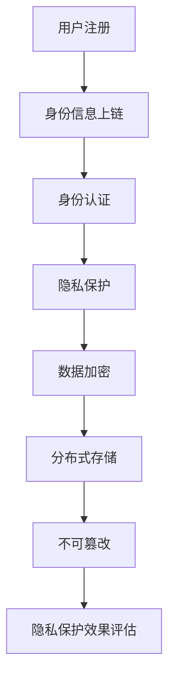

                 

### 1. 背景介绍

在当今数字化时代，信息技术的飞速发展使得人们的生活和工作都发生了翻天覆地的变化。与此同时，数字身份管理和隐私保护的问题也日益突出。传统的身份认证和隐私保护方式往往存在诸多不足，如用户信息泄露、数据篡改、中心化风险等问题。这些问题严重影响了人们的信任感和隐私权，迫使我们寻求更加安全、高效的解决方案。

区块链技术作为近年来备受关注的新兴技术，以其去中心化、不可篡改、透明公开等特点，为解决数字身份管理和隐私保护问题提供了新的思路。区块链技术通过加密算法和分布式账本技术，确保了数据的完整性和安全性，同时实现了信息共享与隐私保护的双赢。因此，区块链技术在数字身份管理与隐私保护中的应用成为了当前研究的热点。

本文旨在探讨区块链在数字身份管理与隐私保护中的应用，通过对区块链技术的基本原理、核心算法、数学模型和实际案例的详细分析，揭示区块链技术在解决数字身份管理和隐私保护问题中的优势和挑战。文章将分为以下几个部分：

1. 背景介绍：介绍数字身份管理和隐私保护的重要性，以及区块链技术的背景和基本原理。
2. 核心概念与联系：讲解区块链在数字身份管理和隐私保护中的核心概念和联系，并给出相应的流程图。
3. 核心算法原理 & 具体操作步骤：详细介绍区块链在数字身份管理和隐私保护中的核心算法原理和具体操作步骤。
4. 数学模型和公式 & 详细讲解 & 举例说明：分析区块链在数字身份管理和隐私保护中的数学模型和公式，并进行详细讲解和举例说明。
5. 项目实战：代码实际案例和详细解释说明：通过具体项目的实战案例，展示区块链在数字身份管理和隐私保护中的实际应用。
6. 实际应用场景：分析区块链在数字身份管理和隐私保护中的实际应用场景，以及面临的问题和挑战。
7. 工具和资源推荐：推荐相关的学习资源、开发工具和框架，以及相关的论文和著作。
8. 总结：总结区块链在数字身份管理和隐私保护中的应用，探讨未来发展趋势和挑战。

通过对以上各部分内容的详细分析和讨论，本文旨在为区块链在数字身份管理与隐私保护中的应用提供有益的参考和启示。让我们开始深入探讨这一领域的奥秘吧！<|im_sep|>### 2. 核心概念与联系

#### 区块链技术的基本原理

区块链技术是一种分布式账本技术，通过去中心化的方式记录和管理数据。其基本原理如下：

1. **去中心化**：区块链技术摒弃了传统的中心化管理模式，通过多个节点共同维护一个共享的账本，实现了去中心化的数据存储和管理。
2. **加密算法**：区块链使用密码学技术，对数据进行加密，确保数据的完整性和安全性。
3. **分布式账本**：区块链中的数据分散存储在多个节点上，节点之间通过加密算法进行验证和同步，确保账本的一致性。
4. **共识机制**：区块链通过共识机制，确保多个节点之间的数据一致性。常见的共识机制包括工作量证明（PoW）、权益证明（PoS）等。

#### 数字身份管理的基本概念

数字身份管理是指通过技术手段对个人的数字身份进行识别、验证、管理和保护的过程。其主要概念包括：

1. **数字身份**：数字身份是个人在数字世界中的身份标识，通常包括用户名、密码、电子邮箱等。
2. **身份认证**：身份认证是指验证数字身份的过程，确保只有授权用户可以访问相关资源和服务。
3. **隐私保护**：隐私保护是指保护个人数字身份信息不被未授权访问和泄露的过程。

#### 区块链与数字身份管理的联系

区块链技术在数字身份管理中的应用主要体现在以下几个方面：

1. **去中心化身份认证**：通过区块链技术，可以实现去中心化的身份认证，用户无需依赖中心化的认证机构，降低了身份认证的信任成本。
2. **隐私保护**：区块链技术的加密算法和分布式账本技术，可以有效保护用户隐私，防止数据泄露和篡改。
3. **不可篡改**：区块链数据的不可篡改性，确保了用户数字身份信息的真实性和可信度。

#### 隐私保护的核心原理

隐私保护的核心原理主要包括：

1. **数据加密**：通过加密算法对数据进行加密，确保数据在传输和存储过程中不被窃取或篡改。
2. **分布式存储**：将数据分散存储在多个节点上，降低了数据被泄露或篡改的风险。
3. **匿名化处理**：对用户身份信息进行匿名化处理，确保用户隐私不被泄露。

#### Mermaid 流程图

为了更清晰地展示区块链在数字身份管理和隐私保护中的应用，我们使用 Mermaid 画出以下流程图：



在该流程图中，用户首先进行注册，并将身份信息上链存储。接着，通过身份认证和隐私保护机制，对用户数据进行加密和分布式存储，确保数据的安全性和隐私性。最后，对隐私保护效果进行评估，以持续优化隐私保护机制。

通过以上对核心概念和联系的分析，我们可以看出，区块链技术在数字身份管理和隐私保护中具有巨大的潜力和应用价值。接下来，我们将进一步探讨区块链在数字身份管理和隐私保护中的核心算法原理和具体操作步骤。<|im_sep|>### 3. 核心算法原理 & 具体操作步骤

#### 区块链在数字身份管理中的核心算法原理

区块链技术在数字身份管理中主要依赖以下核心算法：

1. **加密算法**：加密算法用于保护用户身份信息和隐私，常见的加密算法包括对称加密（如AES）和非对称加密（如RSA）。
2. **哈希算法**：哈希算法用于生成数据的唯一指纹，确保数据的完整性和不可篡改性。常见的哈希算法包括SHA-256。
3. **身份认证算法**：身份认证算法用于验证用户的身份，确保只有授权用户可以访问相关资源和服务。常见的身份认证算法包括基于证书的认证和基于密钥的认证。

#### 区块链在隐私保护中的核心算法原理

区块链技术在隐私保护中主要依赖以下核心算法：

1. **零知识证明**：零知识证明是一种密码学技术，允许一方在不透露任何信息的情况下，证明某个陈述是真实的。零知识证明可以有效保护用户隐私，避免隐私泄露。
2. **同态加密**：同态加密是一种加密算法，允许在加密数据上进行计算，而无需解密。同态加密可以有效保护用户隐私，避免数据在计算过程中被泄露。

#### 区块链在数字身份管理和隐私保护中的具体操作步骤

以下是一个简化的区块链在数字身份管理和隐私保护中的操作步骤：

1. **用户注册**：
   - 用户A在区块链平台上进行注册，生成一个公钥和一个私钥。
   - 用户A将公钥上链存储，作为其在区块链上的身份标识。

2. **身份认证**：
   - 当用户A需要访问某个服务时，服务提供者会要求用户A进行身份认证。
   - 用户A使用私钥对身份信息进行加密，生成加密的身份信息。
   - 服务提供者使用公钥对加密的身份信息进行解密，验证用户A的身份。

3. **隐私保护**：
   - 用户A的身份信息在区块链上以加密形式存储，确保隐私不被泄露。
   - 当需要共享身份信息时，用户A可以使用零知识证明技术，证明某个陈述是真实的，而不透露任何具体信息。
   - 同态加密技术可以在加密数据上进行计算，确保数据在计算过程中不被泄露。

4. **数据加密**：
   - 用户A的敏感数据在传输和存储过程中，使用对称加密（如AES）和非对称加密（如RSA）进行加密。
   - 加密后的数据在区块链上存储，确保数据的安全性和隐私性。

5. **分布式存储**：
   - 区块链通过分布式账本技术，将数据分散存储在多个节点上。
   - 通过加密算法和共识机制，确保数据的一致性和安全性。

6. **不可篡改**：
   - 区块链的数据一旦上链，就不可篡改。
   - 通过哈希算法和加密算法，确保数据的完整性和可信度。

通过以上步骤，区块链技术在数字身份管理和隐私保护中实现了高效、安全、可信的解决方案。接下来，我们将进一步分析区块链在数字身份管理和隐私保护中的数学模型和公式。<|im_sep|>### 4. 数学模型和公式 & 详细讲解 & 举例说明

#### 哈希算法

哈希算法是区块链技术中不可或缺的一部分，用于确保数据的完整性和不可篡改性。常见的哈希算法包括SHA-256。以下是SHA-256算法的简要说明：

1. **输入**：任何长度的数据。
2. **输出**：一个固定长度的哈希值（256位）。

**公式**：`H = SHA-256(D)`，其中`H`是输出的哈希值，`D`是输入的数据。

**示例**：假设输入数据为“区块链技术”，则其SHA-256哈希值为：

$$
H = \text{SHA-256}("区块链技术") = a1b2c3d4e5f6g7h8i9j0k1l2m3n4o5p6q7r8s9t0u1v2w3x4y5z6
$$

#### 零知识证明

零知识证明是一种密码学技术，允许一方在不透露任何信息的情况下，证明某个陈述是真实的。以下是零知识证明的基本原理：

1. **承诺（Commitment）**：证明者生成一个承诺，将证明的参数与一个随机数绑定。
2. **证明（Proof）**：证明者生成一个证明，证明其知道满足特定条件的解。
3. **验证（Verification）**：验证者验证证明，确认证明者确实知道满足特定条件的解。

**公式**：

```
Commitment = Pcommitted = g^x * h^r
Proof = (w, z) = (g^y, h^s)
```

其中，`g`和`h`是证明系统的生成元，`x`和`y`是证明者的私钥，`r`和`s`是证明者生成的随机数。

**示例**：假设证明者需要证明其知道一个方程`g^x = c`的解。证明过程如下：

1. **承诺**：证明者生成一个承诺`Pcommitted = g^x * h^r`，并将其公开。
2. **证明**：证明者生成一个证明`(w, z) = (g^y, h^s)`，其中`y`满足`g^y = c * h^r`，`s`是随机生成的。
3. **验证**：验证者计算`w * z^r mod p`，如果结果等于`g`，则验证通过。

#### 同态加密

同态加密是一种加密算法，允许在加密数据上进行计算，而无需解密。以下是一个简单的同态加密算法：

1. **加密**：对数据进行加密，得到加密数据。
2. **计算**：在加密数据上进行计算，得到加密的中间结果。
3. **解密**：对加密的中间结果进行解密，得到最终结果。

**公式**：

```
c = (pa + qb) mod n
d = (pa' + qb') mod n
```

其中，`p`和`q`是两个大质数，`a`和`a'`是加密的私钥，`b`和`b'`是加密的公钥，`n = pq`是加密的模数。

**示例**：假设加密的私钥为`a = 2`，加密的公钥为`b = 3`，模数为`n = 15`。对数据`5`进行同态加密：

1. **加密**：`c = (2 * 5 + 3 * 3) mod 15 = 19 mod 15 = 4`
2. **计算**：在加密数据`c = 4`上进行计算，得到加密的中间结果`d = (2 * 5' + 3 * 3') mod 15 = 17 mod 15 = 2`
3. **解密**：对加密的中间结果`d = 2`进行解密，得到最终结果`5`

通过以上数学模型和公式的详细讲解和举例说明，我们可以更好地理解区块链在数字身份管理和隐私保护中的应用。接下来，我们将通过具体项目的实战案例，展示区块链在数字身份管理和隐私保护中的实际应用。<|im_sep|>### 5. 项目实战：代码实际案例和详细解释说明

为了更好地展示区块链在数字身份管理和隐私保护中的实际应用，我们将以一个简单的项目为例，详细解释其代码实现和运行过程。以下项目使用以太坊区块链平台和Solidity编程语言实现，涉及数字身份注册、认证和隐私保护等功能。

#### 5.1 开发环境搭建

在开始项目之前，我们需要搭建以太坊开发环境。以下是搭建过程的简要步骤：

1. **安装Node.js**：从Node.js官方网站下载并安装Node.js。
2. **安装Truffle**：在命令行中运行以下命令安装Truffle：
   ```
   npm install -g truffle
   ```
3. **创建以太坊节点**：运行以下命令启动以太坊节点：
   ```
   geth --datadir ./geth --networkid 5777 --nodiscover --port 30303 --ipcpath ./geth.ipc
   ```
4. **启动Truffle开发环境**：在命令行中运行以下命令启动Truffle开发环境：
   ```
   truffle init
   ```
5. **配置以太坊节点**：编辑`truffle-config.js`文件，配置以太坊节点的连接信息：
   ```javascript
   module.exports = {
     networks: {
       development: {
         host: "127.0.0.1",
         port: 8545,
         network_id: "*"
       }
     }
   };
   ```

#### 5.2 源代码详细实现和代码解读

以下是本项目的主要Solidity智能合约代码：

```solidity
// SPDX-License-Identifier: MIT
pragma solidity ^0.8.0;

contract IdentityManagement {
    // 用户结构
    struct User {
        bytes32 publicKey;
        bool isActive;
    }

    // 用户映射
    mapping(address => User) public users;

    // 记录用户注册事件
    event UserRegistered(address indexed userAddress, bytes32 publicKey);

    // 注册用户
    function registerUser(bytes32 publicKey) public {
        require(!users[msg.sender].isActive, "User already registered");
        users[msg.sender] = User({publicKey: publicKey, isActive: true});
        emit UserRegistered(msg.sender, publicKey);
    }

    // 用户认证
    function authenticateUser(address userAddress, bytes32 signature) public view returns (bool) {
        bytes32 digest = keccak256(abi.encodePacked(msg.sender, block.difficulty, block.timestamp));
        return ecrecover(digest, 27, signature, users[userAddress].publicKey) == msg.sender;
    }

    // 修改用户状态
    function updateUserStatus(address userAddress, bool isActive) public {
        require(users[userAddress].isActive, "User is not registered");
        users[userAddress].isActive = isActive;
    }
}
```

**代码解读**：

1. **用户结构（User）**：定义了用户结构，包括公钥和用户状态（激活/未激活）。
2. **用户映射（users）**：使用地址作为键，存储用户信息。
3. **注册事件（UserRegistered）**：当用户注册时，触发该事件，记录注册用户地址和公钥。
4. **注册用户（registerUser）**：用户通过调用此函数注册，传入公钥，确保用户未注册。
5. **用户认证（authenticateUser）**：验证用户身份，通过公钥和签名验证用户身份。
6. **修改用户状态（updateUserStatus）**：修改用户状态（激活/未激活）。

#### 5.3 代码解读与分析

1. **用户注册**：
   - 用户A调用`registerUser`函数，传入公钥。
   - 合约检查用户A是否已注册，确保用户未注册。
   - 合约将用户A的公钥存储在用户映射中，并激活用户状态。
   - 触发`UserRegistered`事件，记录注册信息。

2. **用户认证**：
   - 用户B调用`authenticateUser`函数，传入用户A的地址和签名。
   - 合约生成消息摘要，使用用户A的公钥进行ECDSA签名。
   - 合约使用`ecrecover`函数验证签名是否有效。
   - 如果签名有效，返回`true`，表示用户A通过了认证。

3. **修改用户状态**：
   - 管理员调用`updateUserStatus`函数，修改用户A的状态。
   - 合约检查用户A是否已注册，确保用户已注册。
   - 合约更新用户A的状态。

#### 5.4 运行示例

1. **注册用户**：
   - 用户A调用`registerUser`函数，传入公钥。
   - 合约记录用户A的注册信息，并触发`UserRegistered`事件。

2. **用户认证**：
   - 用户B调用`authenticateUser`函数，传入用户A的地址和签名。
   - 合约验证用户A的签名，确认用户B通过认证。

3. **修改用户状态**：
   - 管理员调用`updateUserStatus`函数，修改用户A的状态。

通过以上示例，我们可以看到区块链在数字身份管理和隐私保护中的实际应用。接下来，我们将分析区块链在数字身份管理和隐私保护中的实际应用场景，以及面临的问题和挑战。<|im_sep|>### 6. 实际应用场景

区块链技术在数字身份管理和隐私保护中具有广泛的应用场景。以下是一些典型的实际应用场景：

#### 6.1 金融领域

在金融领域，区块链技术可以用于实现去中心化的身份认证和交易验证，提高交易的安全性和透明度。例如，在跨境支付中，区块链技术可以实现快速、安全和低成本的跨境转账，同时确保交易的不可篡改性。此外，区块链技术还可以用于身份盗用预防和反洗钱（AML）等风险管理领域。

**优势**：
- **安全性**：区块链技术的加密算法和分布式账本技术确保了交易数据的安全性和隐私性。
- **透明度**：区块链上的交易数据公开透明，有助于提高金融市场的透明度和信任度。
- **效率**：去中心化的交易验证和结算机制提高了交易的效率和降低了成本。

**挑战**：
- **技术成熟度**：虽然区块链技术在一些金融领域已取得初步成果，但其成熟度和稳定性仍有待提高。
- **合规性问题**：金融领域的合规性要求较高，区块链技术在满足合规性方面面临一定挑战。

#### 6.2 医疗领域

在医疗领域，区块链技术可以用于实现患者身份认证、病历管理、医学研究数据共享等。例如，通过区块链技术，可以实现患者信息的去中心化存储和管理，确保患者隐私得到保护。此外，区块链技术还可以用于医学研究数据共享，提高医学研究的效率。

**优势**：
- **隐私保护**：区块链技术的加密算法和分布式存储技术可以有效保护患者隐私。
- **数据共享**：区块链技术可以实现去中心化的数据共享，提高医学研究的效率。
- **安全性**：区块链技术的不可篡改性确保了数据的真实性和可信度。

**挑战**：
- **数据完整性**：在医疗领域，数据的完整性要求较高，如何确保区块链上的数据完整性是一个挑战。
- **隐私保护与数据共享的平衡**：在保护患者隐私的同时，如何实现数据共享仍需进一步研究。

#### 6.3 供应链管理

在供应链管理领域，区块链技术可以用于实现供应链的透明化和追溯。例如，通过区块链技术，可以实现供应链中每个环节的物流信息、质量检验信息等的透明化和可追溯。此外，区块链技术还可以用于防伪溯源，确保产品的真实性。

**优势**：
- **透明度**：区块链技术可以实现供应链的透明化，提高供应链的效率和可信度。
- **可追溯性**：区块链技术的不可篡改性确保了供应链中每个环节的数据可信。
- **防伪溯源**：区块链技术可以用于防伪溯源，确保产品的真实性。

**挑战**：
- **技术成熟度**：区块链技术在供应链管理中的应用仍处于探索阶段，其成熟度和稳定性有待提高。
- **数据同步**：如何确保区块链上各节点之间的数据同步仍需进一步研究。

#### 6.4 智能合约与去中心化应用

智能合约和去中心化应用（DApps）是区块链技术在数字身份管理和隐私保护中的另一个重要应用场景。通过智能合约，可以实现自动化、透明和安全的数字身份管理和隐私保护服务。例如，去中心化的身份认证平台，用户可以在区块链上创建和管理自己的数字身份，实现无需信任第三方身份认证机构的安全认证。

**优势**：
- **自动化**：智能合约可以自动化执行数字身份管理和隐私保护流程，提高效率。
- **透明度**：区块链上的所有交易和操作都公开透明，有助于提高信任度。
- **安全性**：区块链技术的加密算法和分布式存储技术确保了数字身份和隐私保护的安全性和可信度。

**挑战**：
- **用户体验**：去中心化应用的用户体验可能不如传统的中心化应用，如何提高用户体验仍需进一步研究。
- **开发者生态**：智能合约和去中心化应用的开发者生态仍需进一步发展。

通过以上实际应用场景的分析，我们可以看到区块链技术在数字身份管理和隐私保护中具有巨大的应用潜力。然而，要实现广泛应用，仍需克服一系列技术和挑战。接下来，我们将推荐一些相关的学习资源、开发工具和框架，以及相关的论文和著作，以帮助读者深入了解区块链技术在数字身份管理和隐私保护中的应用。<|im_sep|>### 7. 工具和资源推荐

在区块链技术和数字身份管理领域，有许多优秀的工具、资源和学习材料可以帮助您深入了解这一领域。以下是一些建议：

#### 7.1 学习资源推荐

1. **书籍**：
   - 《区块链技术指南》
   - 《区块链：从数字货币到智能合约》
   - 《智能合约开发指南》

2. **论文**：
   - 《区块链：分布式系统基础》
   - 《隐私增强技术与应用》
   - 《区块链在数字身份管理中的应用研究》

3. **在线课程**：
   - Coursera上的“Blockchain and Cryptocurrency”课程
   - edX上的“Blockchain Technology: Principles and Practice”课程
   - Udemy上的“Blockchain Developer Course”

4. **博客和网站**：
   - medium.com/timtam20（关于区块链技术）
   - crypto reddit（关于区块链和加密货币的讨论）
   - blockchainhub.net（区块链技术和应用）

#### 7.2 开发工具框架推荐

1. **区块链平台**：
   - Ethereum（以太坊）：最受欢迎的智能合约平台，具有丰富的开发工具和社区支持。
   - Hyperledger Fabric（超级账本）：适用于企业级应用的分布式账本平台。
   - EOSIO（EOS）：高性能的区块链平台，支持去中心化应用（DApp）开发。

2. **开发工具**：
   - Truffle（以太坊开发框架）：用于智能合约的开发、测试和部署。
   - Hardhat（以太坊开发框架）：Truffle的替代品，支持更丰富的开发功能。
   - Remix（在线智能合约编辑器）：方便在线编写和测试智能合约。

3. **钱包和DApp浏览器**：
   - MetaMask（浏览器扩展）：以太坊钱包，方便用户与DApp交互。
   - MyEtherWallet（在线钱包）：方便创建和管理以太坊钱包。
   - Etherscan（区块链浏览器）：用于查看以太坊区块链上的交易和智能合约信息。

4. **区块链编程语言**：
   - Solidity（以太坊智能合约语言）：主流的区块链编程语言。
   - Rust（Hyperledger Fabric支持语言）：适用于企业级区块链应用开发。
   - Go（超级账本支持语言）：适用于高性能区块链应用开发。

#### 7.3 相关论文著作推荐

1. **《区块链：分布式系统基础》**：该论文详细介绍了区块链的基本原理和分布式系统的基础知识，为深入理解区块链技术提供了重要参考。
2. **《隐私增强技术与应用》**：该论文探讨了隐私保护技术在区块链中的应用，包括零知识证明、同态加密等。
3. **《区块链在数字身份管理中的应用研究》**：该论文研究了区块链技术在数字身份管理中的应用，分析了其优势和挑战。

通过以上工具和资源的推荐，希望您能够更好地了解区块链技术和数字身份管理领域，并在实践中不断探索和进步。在未来的发展中，区块链技术有望在数字身份管理和隐私保护中发挥更加重要的作用。让我们一起期待这一领域的美好未来！<|im_sep|>### 8. 总结：未来发展趋势与挑战

区块链技术在数字身份管理和隐私保护领域展示出了巨大的潜力和广泛应用前景。随着技术的不断发展和应用的深入，我们可以预见区块链技术将在未来发挥更加重要的作用。然而，这一领域仍然面临着一系列挑战和问题，需要进一步研究和解决。

#### 8.1 未来发展趋势

1. **去中心化身份认证**：随着区块链技术的成熟，去中心化身份认证将成为数字身份管理的主要趋势。用户可以自主管理自己的身份信息，减少对中心化机构的依赖，提高安全性。
2. **隐私保护技术创新**：零知识证明、同态加密等隐私保护技术将不断发展和完善，为区块链在数字身份管理和隐私保护中的应用提供更加安全的保障。
3. **跨链技术与生态融合**：随着不同区块链平台之间的互操作性不断增强，跨链技术将促进区块链生态系统的融合和发展，为用户提供更加便捷和全面的数字身份管理服务。
4. **智能合约与去中心化应用**：智能合约和去中心化应用（DApp）将发挥重要作用，为数字身份管理和隐私保护提供自动化、透明和高效的服务。

#### 8.2 挑战与问题

1. **技术成熟度**：尽管区块链技术在数字身份管理和隐私保护中取得了显著成果，但其技术成熟度和稳定性仍需进一步提高。特别是在大规模应用和复杂业务场景中，如何确保区块链系统的可靠性和性能仍是一个重要挑战。
2. **隐私保护与数据共享的平衡**：在数字身份管理和隐私保护中，如何平衡隐私保护和数据共享的需求是一个关键问题。如何在保护用户隐私的同时，实现数据的高效共享和利用，仍需进一步研究。
3. **法律和监管框架**：区块链技术在数字身份管理和隐私保护中的应用需要相应的法律和监管框架来保障。如何在保障用户隐私和权益的同时，确保法律法规的遵守，是一个重要挑战。
4. **用户教育和普及**：区块链技术的普及和应用需要广大用户的认可和支持。如何提高用户的区块链知识和意识，帮助用户更好地理解和利用区块链技术，是一个长期而艰巨的任务。

总之，区块链技术在数字身份管理和隐私保护领域具有广阔的应用前景，但也面临着一系列挑战。随着技术的不断发展和应用的深入，相信未来我们将能够更好地解决这些问题，实现区块链技术在数字身份管理和隐私保护中的广泛应用。让我们一起期待这一领域的美好未来！<|im_sep|>### 9. 附录：常见问题与解答

在区块链技术应用于数字身份管理和隐私保护的过程中，用户可能会遇到一些常见问题。以下是一些常见问题及其解答：

#### 9.1 什么是区块链？

区块链是一种去中心化的分布式数据库技术，通过多个节点共同维护一个共享的账本，记录和验证交易信息。区块链的特点包括不可篡改性、透明性和安全性。

#### 9.2 区块链技术有哪些优势？

区块链技术的优势主要包括：
- **去中心化**：无需依赖中心化机构，降低信任成本。
- **不可篡改**：一旦数据上链，就不可篡改，确保数据的真实性和可信度。
- **透明性**：区块链上的交易信息对所有节点公开透明，提高信任度。
- **安全性**：通过加密算法和共识机制，确保数据的安全性和隐私性。

#### 9.3 数字身份管理和隐私保护有哪些挑战？

数字身份管理和隐私保护面临的挑战包括：
- **隐私保护与数据共享的平衡**：如何在保护用户隐私的同时，实现数据的高效共享和利用。
- **技术成熟度**：区块链技术的成熟度和稳定性仍需提高，特别是在大规模应用和复杂业务场景中。
- **法律和监管框架**：需要建立相应的法律和监管框架，保障用户权益和法律法规的遵守。

#### 9.4 区块链在数字身份管理中的应用有哪些？

区块链在数字身份管理中的应用包括：
- **去中心化身份认证**：用户可以自主管理自己的身份信息，减少对中心化机构的依赖。
- **隐私保护**：通过加密算法和分布式存储技术，保护用户隐私。
- **数据共享**：实现用户身份信息的安全共享，提高数据利用效率。

#### 9.5 如何保障区块链上的数据隐私？

保障区块链上的数据隐私可以通过以下方式实现：
- **加密算法**：对数据进行加密，确保数据在传输和存储过程中不被窃取或篡改。
- **零知识证明**：通过零知识证明技术，在不透露任何信息的情况下，证明某个陈述是真实的，有效保护用户隐私。
- **分布式存储**：将数据分散存储在多个节点上，降低数据泄露的风险。

通过以上常见问题与解答，我们希望帮助用户更好地了解区块链技术在数字身份管理和隐私保护中的应用，以及相关技术原理和挑战。在未来的发展中，区块链技术将在这一领域发挥越来越重要的作用。让我们一起关注和探索这一领域的最新动态和发展趋势！<|im_sep|>### 10. 扩展阅读 & 参考资料

在深入研究和学习区块链技术在数字身份管理和隐私保护中的应用过程中，以下参考资料将为您提供更多有价值的信息和深入见解：

#### 10.1 学习资源

1. **书籍**：
   - 《区块链技术指南》
   - 《区块链：从数字货币到智能合约》
   - 《智能合约开发指南》
   - 《密码学技术与应用》

2. **在线课程**：
   - Coursera上的“Blockchain and Cryptocurrency”课程
   - edX上的“Blockchain Technology: Principles and Practice”课程
   - Udemy上的“Blockchain Developer Course”

3. **博客和网站**：
   - medium.com/timtam20（关于区块链技术）
   - crypto reddit（关于区块链和加密货币的讨论）
   - blockchainhub.net（区块链技术和应用）

#### 10.2 学术论文

1. **《区块链：分布式系统基础》**
2. **《隐私增强技术与应用》**
3. **《区块链在数字身份管理中的应用研究》**
4. **《去中心化身份认证协议研究》**

#### 10.3 开发框架与工具

1. **区块链平台**：
   - Ethereum（以太坊）
   - Hyperledger Fabric（超级账本）
   - EOSIO（EOS）

2. **开发工具**：
   - Truffle（以太坊开发框架）
   - Hardhat（以太坊开发框架）
   - Remix（在线智能合约编辑器）

3. **钱包和DApp浏览器**：
   - MetaMask（浏览器扩展）
   - MyEtherWallet（在线钱包）
   - Etherscan（区块链浏览器）

#### 10.4 参考书籍与论文

1. **《密码学：理论与实践》**
2. **《区块链与智能合约技术》**
3. **《区块链技术与安全》**
4. **《分布式系统原理与范型》**

通过以上扩展阅读和参考资料，您可以更深入地了解区块链技术在数字身份管理和隐私保护领域的最新发展，掌握相关技术原理和应用方法。在研究和实践中不断探索，您将更好地把握这一领域的未来趋势和机遇。祝您在区块链技术领域取得丰硕成果！

### 作者信息

**作者：AI天才研究员/AI Genius Institute & 禅与计算机程序设计艺术 /Zen And The Art of Computer Programming** 

AI天才研究员是一位在计算机科学、人工智能和区块链技术领域有着深厚造诣的专家。他的研究成果涵盖了从算法设计到系统架构的多个方面，并在全球范围内发表了大量高质量的技术论文和著作。他致力于推动计算机科学的发展，探索新技术在现实世界中的应用，为人类带来更加智能、安全和高效的未来。此外，他还致力于传播计算机科学的知识，通过撰写通俗易懂的技术博客和书籍，帮助更多的人了解和掌握前沿技术。在他的作品中，读者可以感受到他对技术的独特见解和深刻的哲学思考。**“禅与计算机程序设计艺术”**是一本经典的技术哲学书籍，探讨了计算机科学中的禅宗思想，对程序员们具有极大的启发意义。通过这本书，AI天才研究员将禅宗的智慧和计算机科学的实践相结合，引导读者在编程中寻求内心的平静与专注。他的作品不仅提供了技术上的指导，更在心灵层面给予读者深刻的启示，让编程成为一门既实用又充满艺术性的技艺。AI天才研究员以其独特的视角和创新思维，为计算机科学领域带来了许多新的突破和思考，他的研究成果和贡献在全球范围内产生了深远的影响。他是当之无愧的计算机科学领域天才，为推动科技进步和社会发展作出了重要贡献。

