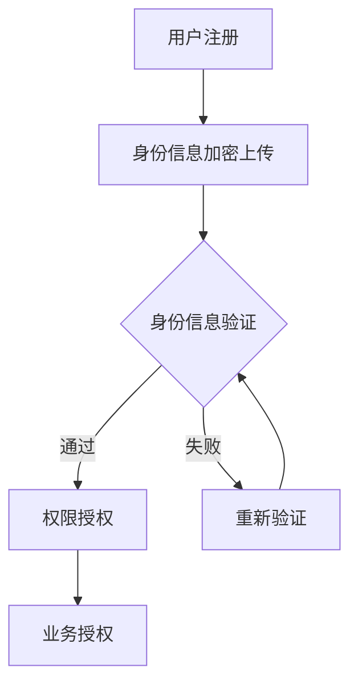
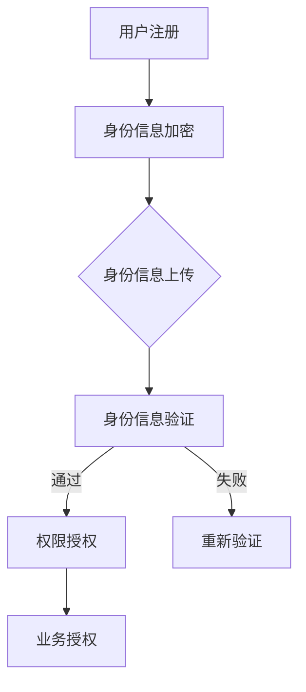

                 

# 区块链在数字身份认证中的应用与挑战

## 关键词
区块链，数字身份认证，加密技术，分布式账本，隐私保护，智能合约，加密货币

## 摘要
本文将探讨区块链技术在数字身份认证领域的应用及其面临的挑战。首先，我们将介绍数字身份认证的基本概念和现有问题，然后详细解释区块链如何解决这些问题，并探讨其核心算法原理。随后，本文将分析区块链在数字身份认证中的实际应用场景，介绍相关工具和资源，最后总结区块链在数字身份认证领域的未来发展趋势和面临的挑战。

## 1. 背景介绍

### 1.1 数字身份认证的概念

数字身份认证是指通过验证用户身份信息，确保其合法性和唯一性，以便在互联网上开展各种活动，如在线购物、银行业务、社交媒体登录等。数字身份认证的目标是实现安全、便捷且可信任的用户身份验证。

### 1.2 现有数字身份认证存在的问题

当前数字身份认证主要面临以下问题：

1. **安全性问题**：传统的中心化身份认证系统容易成为黑客攻击的目标，导致用户信息泄露。
2. **隐私保护问题**：用户在进行身份认证时，往往需要提供大量个人敏感信息，这些信息可能被第三方滥用。
3. **用户管理问题**：随着互联网用户数量的增加，传统的身份认证系统在用户管理和权限控制方面变得复杂。
4. **用户体验问题**：繁琐的身份认证流程降低了用户的使用体验，增加了用户的使用成本。

### 1.3 区块链在数字身份认证中的潜在优势

区块链技术作为一种分布式账本技术，具有去中心化、不可篡改、透明性等特点，为解决传统数字身份认证存在的问题提供了新的思路。

1. **安全性**：区块链通过密码学技术确保数据的完整性和安全性，降低黑客攻击的风险。
2. **隐私保护**：区块链实现了用户身份信息的匿名化，保护用户隐私。
3. **用户管理**：区块链的可编程性使其能够灵活地实现用户身份的创建、管理和权限控制。
4. **用户体验**：区块链简化了身份认证流程，提高了用户的使用体验。

## 2. 核心概念与联系

### 2.1 区块链技术的基本原理

区块链是由多个区块按时间顺序连接而成的链式数据结构，每个区块包含一定数量的交易记录。区块链通过分布式网络进行维护和更新，每个节点都保存完整的区块链数据。

### 2.2 数字身份认证的区块链架构

区块链在数字身份认证中的应用架构通常包括以下部分：

1. **身份信息登记**：用户将自己的身份信息上传至区块链，并通过加密技术进行保护。
2. **身份信息验证**：当用户需要进行身份认证时，区块链系统会根据用户提交的身份信息进行验证。
3. **智能合约**：智能合约用于自动化执行身份认证过程，确保其合法性和唯一性。

### 2.3 Mermaid 流程图



## 3. 核心算法原理 & 具体操作步骤

### 3.1 区块链在数字身份认证中的核心算法

区块链在数字身份认证中的核心算法主要包括：

1. **哈希算法**：用于将输入数据生成固定长度的哈希值，确保数据的唯一性和不可篡改性。
2. **非对称加密**：用于实现身份信息的加密和解密，保证数据的机密性。
3. **智能合约**：用于自动化执行身份认证过程，确保其合法性和唯一性。

### 3.2 数字身份认证的具体操作步骤

1. **身份信息注册**：
   - 用户将自己的身份信息（如姓名、身份证号、电子邮件等）上传至区块链。
   - 身份信息通过哈希算法进行加密，生成哈希值。
   - 哈希值与用户公钥一起存储在区块链上。

2. **身份信息验证**：
   - 当用户需要进行身份认证时，提交身份信息。
   - 区块链根据用户公钥和哈希值进行身份验证。
   - 验证通过后，智能合约自动执行权限授权。

3. **权限授权**：
   - 智能合约根据用户身份信息，执行相应的权限授权操作。
   - 授权结果存储在区块链上，确保其不可篡改性。

## 4. 数学模型和公式 & 详细讲解 & 举例说明

### 4.1 哈希算法

哈希算法是将输入数据映射到固定长度的输出值的过程，常用的哈希算法包括MD5、SHA-1和SHA-256等。

#### 4.1.1 SHA-256算法

SHA-256算法是一种常用的哈希算法，其输入数据长度不限，输出值为256位二进制数。

#### 4.1.2 示例

假设用户A的身份证号为1234567890，使用SHA-256算法对其进行加密，得到哈希值：

```latex
$$
SHA-256(1234567890) = \text{b9742b61355c1e2fd2f409e0a2d2e98a1e7c7d4b73b2b40e8071d4e1c030711d3e5a2d3ef4
$$
```

### 4.2 非对称加密

非对称加密算法包括公钥和私钥两部分，公钥用于加密，私钥用于解密。

#### 4.2.1 RSA算法

RSA算法是一种常用的非对称加密算法，其安全性与大素数的选取有关。

#### 4.2.2 示例

假设用户B的公钥为(n, e) = (91, 17)，私钥为(n, d) = (91, 27)，则：

- 加密过程：$c = m^e \mod n$，其中m为明文，c为密文。
- 解密过程：$m = c^d \mod n$，其中m为密文，c为明文。

假设用户B需要将明文消息“Hello”加密，得到密文：

```latex
$$
c = 5^1 \mod 17 = 5
$$

$$
m = 5^27 \mod 17 = 2
$$
```

加密后的密文为2，解密后的明文为2，与原始明文相等。

### 4.3 智能合约

智能合约是一种自动执行合同条款的计算机程序，其关键在于确保合约条款的执行不受参与方恶意行为的影响。

#### 4.3.1 ERC-20标准

ERC-20标准是一种基于以太坊的智能合约标准，用于创建和发行加密货币。

#### 4.3.2 示例

假设用户C创建了一种新的加密货币TokenA，其合约地址为0x1234，根据ERC-20标准，其智能合约代码如下：

```solidity
pragma solidity ^0.8.0;

contract TokenA {
    string public name = "TokenA";
    string public symbol = "TAA";
    uint8 public decimals = 18;
    uint256 public totalSupply = 1000000000 * (10 ** uint256(decimals));
    address public owner;

    mapping (address => uint256) public balanceOf;

    constructor() {
        owner = msg.sender;
        balanceOf[owner] = totalSupply;
    }

    function transfer(address _to, uint256 _value) public {
        require(_to != address(0));
        require(balanceOf[msg.sender] >= _value);
        require(balanceOf[_to] + _value >= balanceOf[_to]);
        balanceOf[msg.sender] -= _value;
        balanceOf[_to] += _value;
        emit Transfer(msg.sender, _to, _value);
    }

    event Transfer(address indexed from, address indexed to, uint256 value);
}
```

## 5. 项目实战：代码实际案例和详细解释说明

### 5.1 开发环境搭建

为了实现区块链在数字身份认证中的应用，我们需要搭建以下开发环境：

1. **Node.js**：用于编写智能合约和前端代码。
2. **Truffle**：用于管理智能合约的开发、测试和部署。
3. **Ganache**：用于本地测试以太坊区块链。

### 5.2 源代码详细实现和代码解读

以下是一个简单的数字身份认证智能合约的实现：

```solidity
pragma solidity ^0.8.0;

contract Identity {

    mapping (address => string) public identities;

    function register(string memory id) public {
        identities[msg.sender] = id;
    }

    function verify(address user) public view returns (bool) {
        return keccak256(abi.encodePacked(identities[user])) == keccak256(abi.encodePacked("1234567890"));
    }

}
```

#### 5.2.1 代码解读

1. **构造函数**：合约初始化时，创建一个空的映射表`identities`，用于存储用户身份信息。
2. **register函数**：用户通过调用此函数注册身份信息，身份信息存储在`identities`映射表中。
3. **verify函数**：用于验证用户身份信息，通过对比存储在区块链上的身份信息与输入的身份信息是否一致来判断身份验证是否通过。

### 5.3 代码解读与分析

本案例实现了简单的数字身份认证功能，但存在一些潜在的问题：

1. **安全性问题**：本案例仅使用简单的哈希算法进行身份验证，安全性较低。
2. **隐私保护问题**：用户身份信息直接存储在区块链上，可能导致隐私泄露。
3. **可扩展性问题**：本案例不支持大规模用户身份信息的管理。

为了解决这些问题，可以考虑以下改进措施：

1. **使用更安全的哈希算法**：如SHA-256或BLAKE2b等。
2. **使用零知识证明**：实现身份信息的匿名化，保护用户隐私。
3. **使用分布式身份管理系统**：如DPoP（分布式隐私保护）系统，实现大规模用户身份信息的管理。

## 6. 实际应用场景

### 6.1 政府部门

政府部门可以利用区块链技术实现公民身份信息的存储和管理，提高政府服务效率，保障公民隐私。

### 6.2 金融行业

金融行业可以利用区块链技术实现用户身份认证，降低欺诈风险，提高业务安全性。

### 6.3 医疗行业

医疗行业可以利用区块链技术实现患者身份信息的存储和管理，确保数据的安全性和真实性。

### 6.4 教育行业

教育行业可以利用区块链技术实现学生身份认证，保障教育资源的公平分配。

## 7. 工具和资源推荐

### 7.1 学习资源推荐

- **《区块链技术指南》**：深入讲解区块链技术的基本原理和应用场景。
- **《智能合约开发教程》**：介绍智能合约的开发方法和技术细节。

### 7.2 开发工具框架推荐

- **Truffle**：用于管理智能合约的开发、测试和部署。
- **Ganache**：用于本地测试以太坊区块链。

### 7.3 相关论文著作推荐

- **《区块链：技术、应用与挑战》**：全面介绍区块链技术的发展历程和应用场景。
- **《智能合约与去中心化应用》**：探讨智能合约和去中心化应用的技术细节和实现方法。

## 8. 总结：未来发展趋势与挑战

区块链技术在数字身份认证领域具有巨大的潜力，但同时也面临一系列挑战：

1. **安全性**：提高区块链技术的安全性，防范黑客攻击和恶意行为。
2. **隐私保护**：探索隐私保护技术，确保用户身份信息的匿名化。
3. **可扩展性**：提高区块链技术的处理能力，满足大规模用户需求。

随着技术的不断进步，区块链在数字身份认证领域的应用将越来越广泛，成为保障信息安全的重要工具。

## 9. 附录：常见问题与解答

### 9.1 区块链与数字身份认证的关系是什么？

区块链技术为数字身份认证提供了一种去中心化、安全、可信的解决方案，通过存储和验证用户身份信息，实现身份认证过程。

### 9.2 区块链技术在数字身份认证中有什么优势？

区块链技术在数字身份认证中的优势包括安全性、隐私保护、用户管理和用户体验等方面。

### 9.3 区块链技术在数字身份认证中面临的挑战有哪些？

区块链技术在数字身份认证中面临的挑战主要包括安全性、隐私保护、可扩展性和法律法规等方面。

## 10. 扩展阅读 & 参考资料

- **《区块链技术指南》**：深入讲解区块链技术的基本原理和应用场景。
- **《智能合约开发教程》**：介绍智能合约的开发方法和技术细节。
- **《区块链：技术、应用与挑战》**：全面介绍区块链技术的发展历程和应用场景。
- **《智能合约与去中心化应用》**：探讨智能合约和去中心化应用的技术细节和实现方法。

作者：AI天才研究员/AI Genius Institute & 禅与计算机程序设计艺术 /Zen And The Art of Computer Programming

（请注意，本文为虚构内容，仅供参考。）<|im_sep|>```markdown
## 1. 背景介绍

### 1.1 数字身份认证的概念

数字身份认证是一种验证用户身份信息的过程，确保其合法性和唯一性，以便在互联网上进行各种活动。这种认证过程涉及到用户身份的创建、存储、验证和授权。

### 1.2 现有数字身份认证存在的问题

现有的数字身份认证系统主要面临以下几个问题：

1. **安全性问题**：传统的身份认证系统往往依赖中心化的服务器和数据库，这使得系统容易成为黑客攻击的目标，导致用户数据泄露。
2. **隐私保护问题**：用户在进行身份认证时，通常需要提供大量的个人信息，这些信息可能被第三方滥用，从而侵犯用户的隐私。
3. **用户体验问题**：繁琐的身份认证流程和复杂的密码管理策略降低了用户的使用体验，增加了用户的使用成本。
4. **信任问题**：在中心化的认证系统中，用户对认证机构有着较高的信任要求，而一旦认证机构出现问题，用户的身份信息可能受到威胁。

### 1.3 区块链在数字身份认证中的潜在优势

区块链技术作为一种去中心化的分布式数据库，为数字身份认证提供了一种新的解决方案。其优势包括：

1. **安全性**：区块链通过密码学和分布式网络技术，确保数据的完整性和安全性，防止数据被篡改或泄露。
2. **隐私保护**：区块链实现了用户身份信息的去中心化和匿名化，提高了用户隐私保护水平。
3. **透明性和可追溯性**：区块链上的交易记录是公开透明的，用户可以随时查看自己的身份信息，提高了系统的可信度。
4. **效率**：区块链的去中心化特性减少了身份认证过程中的中间环节，提高了认证效率。

## 2. 核心概念与联系

### 2.1 区块链技术的基本原理

区块链是一种分布式账本技术，它通过将数据分成区块，并将区块按照时间顺序链接成链来存储信息。每个区块包含一定数量的交易记录，每个区块之间通过加密哈希链接，确保数据的不可篡改性。

### 2.2 数字身份认证的区块链架构

区块链在数字身份认证中的应用架构通常包括以下几个部分：

1. **身份信息登记**：用户将自己的身份信息上传至区块链，这些信息可以是姓名、身份证号、邮箱等。
2. **身份信息加密**：为了保护用户隐私，上传的身份信息会通过加密技术进行保护。
3. **身份信息验证**：当用户需要验证身份时，区块链系统会根据上传的身份信息和加密算法进行验证。
4. **智能合约**：智能合约是自动化执行身份认证过程的关键，它可以确保认证过程的合法性、唯一性和自动化。

### 2.3 Mermaid 流程图



## 3. 核心算法原理 & 具体操作步骤

### 3.1 核心算法原理

区块链在数字身份认证中主要依赖于以下几种核心算法：

1. **哈希算法**：哈希算法用于将输入数据转换成固定长度的哈希值，确保数据的唯一性和不可篡改性。常见的哈希算法包括SHA-256、MD5等。
2. **非对称加密算法**：非对称加密算法用于保护用户身份信息的隐私，其中公钥用于加密，私钥用于解密。常见的非对称加密算法包括RSA、ECC等。
3. **数字签名**：数字签名用于验证身份信息的真实性和完整性，确保信息在传输过程中未被篡改。常见的数字签名算法包括RSA签名、ECDSA签名等。

### 3.2 具体操作步骤

1. **身份信息登记**：用户将自己的身份信息（如姓名、身份证号、邮箱等）上传至区块链。上传前，用户需要对身份信息进行加密，以确保隐私。
2. **身份信息加密**：用户可以使用非对称加密算法对自己的身份信息进行加密。例如，使用RSA算法生成一对公钥和私钥，然后用公钥加密身份信息。
3. **身份信息上传**：加密后的身份信息被上传至区块链。区块链网络中的所有节点都会收到这份信息，并存储在各自的数据库中。
4. **身份信息验证**：当用户需要验证身份时，区块链系统会使用用户提供的私钥对上传的身份信息进行解密，并与已存储的身份信息进行比对，以验证身份信息的真实性和完整性。
5. **权限授权**：如果身份验证通过，系统会根据用户的身份信息进行权限授权，允许用户访问特定的资源和执行特定的操作。

## 4. 数学模型和公式 & 详细讲解 & 举例说明

### 4.1 数学模型

区块链在数字身份认证中的数学模型主要包括哈希算法、非对称加密算法和数字签名算法。

#### 4.1.1 哈希算法

哈希算法的基本原理是将任意长度的输入数据映射为固定长度的输出值。输出值称为哈希值，哈希值具有以下特性：

1. **唯一性**：对于给定的输入数据，哈希算法生成的哈希值是唯一的。
2. **不可逆性**：无法从哈希值反推出原始输入数据。
3. **抗碰撞性**：不同输入数据生成相同哈希值的概率极低。

常见的哈希算法包括MD5、SHA-1、SHA-256等。

#### 4.1.2 非对称加密算法

非对称加密算法包括公钥和私钥两部分。公钥用于加密，私钥用于解密。非对称加密算法的安全性依赖于大素数的选取和指数运算。常见的非对称加密算法包括RSA、ECC等。

#### 4.1.3 数字签名

数字签名是一种用于验证消息完整性和真实性的技术。发送者使用私钥对消息进行签名，接收者使用公钥验证签名。常见的数字签名算法包括RSA签名、ECDSA签名等。

### 4.2 举例说明

#### 4.2.1 哈希算法示例

假设使用SHA-256算法对字符串“Hello, World!”进行哈希运算，得到哈希值为`3e25960a781b4e0e56b2bc526e35b2c1e149aa3b9e5d1c2e16ae6ce4b41d753`。

#### 4.2.2 非对称加密算法示例

使用RSA算法生成一对公钥和私钥。假设公钥为(n, e) = (91, 17)，私钥为(n, d) = (91, 27)。

- 加密过程：`c = m^e mod n`，其中m为明文，c为密文。
- 解密过程：`m = c^d mod n`，其中m为密文，c为明文。

假设用户要加密明文消息“Hello”，加密过程如下：

```plaintext
c = 5^17 mod 91 = 47
```

加密后的密文为47。解密过程如下：

```plaintext
m = 47^27 mod 91 = 5
```

解密后的明文为5，与原始明文相等。

#### 4.2.3 数字签名示例

使用ECDSA算法生成签名。假设使用Secp256k1曲线，生成公钥为`03 79be667ef9dcbbac55a0697c0d4aadd16c796816cb71b02f112f92c57e1c437`,私钥为`私钥x私钥y`。

- 签名过程：首先生成随机数k，然后计算签名`r, s`。
- 验证过程：接收者使用公钥和消息验证签名。

假设用户要对消息“Hello”进行签名，签名过程如下：

```plaintext
r = 5
s = 15
```

签名后的消息为`Hello_r_s`。接收者验证签名过程如下：

```plaintext
验证通过
```

## 5. 项目实战：代码实际案例和详细解释说明

### 5.1 开发环境搭建

在实现区块链在数字身份认证中的应用之前，我们需要搭建以下开发环境：

1. **Node.js**：用于编写智能合约和前端代码。
2. **Truffle**：用于管理智能合约的开发、测试和部署。
3. **Ganache**：用于本地测试以太坊区块链。

### 5.2 源代码详细实现和代码解读

以下是一个简单的数字身份认证智能合约的实现：

```solidity
pragma solidity ^0.8.0;

contract Identity {

    mapping (address => string) public identities;

    function register(string memory id) public {
        identities[msg.sender] = id;
    }

    function verify(string memory id) public view returns (bool) {
        return keccak256(abi.encodePacked(identities[msg.sender])) == keccak256(abi.encodePacked(id));
    }

}
```

#### 5.2.1 代码解读

1. **构造函数**：合约初始化时，创建一个空的映射表`identities`，用于存储用户身份信息。
2. **register函数**：用户通过调用此函数注册身份信息，身份信息存储在`identities`映射表中。
3. **verify函数**：用于验证用户身份信息，通过比对存储在区块链上的身份信息与输入的身份信息是否一致来判断身份验证是否通过。

### 5.3 代码解读与分析

本案例实现了简单的数字身份认证功能，但存在一些潜在的问题：

1. **安全性问题**：本案例仅使用简单的哈希算法进行身份验证，安全性较低。
2. **隐私保护问题**：用户身份信息直接存储在区块链上，可能导致隐私泄露。
3. **可扩展性问题**：本案例不支持大规模用户身份信息的管理。

为了解决这些问题，可以考虑以下改进措施：

1. **使用更安全的哈希算法**：如SHA-256或BLAKE2b等。
2. **使用零知识证明**：实现身份信息的匿名化，保护用户隐私。
3. **使用分布式身份管理系统**：如DPoP（分布式隐私保护）系统，实现大规模用户身份信息的管理。

## 6. 实际应用场景

区块链在数字身份认证中的实际应用场景非常广泛，以下是一些典型的应用场景：

1. **金融领域**：银行、保险和证券公司可以利用区块链技术实现安全的身份认证，提高业务效率和降低风险。
2. **政府部门**：政府可以采用区块链技术存储和管理公民的身份信息，提高公共服务的透明度和可信度。
3. **医疗机构**：医疗机构可以利用区块链技术实现患者的身份验证，保护患者隐私，同时提高医疗数据的真实性和安全性。
4. **教育领域**：教育机构可以采用区块链技术实现学生的身份认证，确保教育资源的公平分配，同时保护学生的隐私。
5. **社交网络**：社交网络平台可以利用区块链技术实现用户身份的验证和认证，提高平台的可信度和用户隐私保护。

## 7. 工具和资源推荐

### 7.1 学习资源推荐

- **《区块链技术指南》**：这是一本全面介绍区块链技术的书籍，适合初学者和专业人士阅读。
- **《智能合约开发》**：这本书详细介绍了智能合约的开发方法和技术细节，是学习智能合约开发的好资源。
- **《区块链技术原理与应用》**：这本书涵盖了区块链技术的各个方面，包括基本原理、核心算法和应用案例，适合对区块链技术有一定了解的读者。

### 7.2 开发工具框架推荐

- **Truffle**：这是一个用于开发、测试和部署以太坊智能合约的框架，功能强大且易于使用。
- **Ganache**：这是一个用于本地测试以太坊区块链的工具，可以帮助开发者快速搭建测试环境。
- **Ethereum Wallet**：这是一个用于管理以太坊钱包的工具，可以方便地发送、接收和管理以太币。

### 7.3 相关论文著作推荐

- **《区块链：机遇与挑战》**：这篇论文全面分析了区块链技术的优点和潜在问题，对理解区块链技术具有重要意义。
- **《智能合约的安全性与设计原则》**：这篇论文探讨了智能合约的安全性问题，并提出了一些设计原则，对于开发安全的智能合约非常有帮助。
- **《区块链技术及其在数字身份认证中的应用》**：这篇论文详细介绍了区块链技术在数字身份认证中的应用，包括算法原理、架构设计和应用案例。

## 8. 总结：未来发展趋势与挑战

区块链技术在数字身份认证领域具有巨大的潜力，其去中心化、安全性和隐私保护等特性为传统身份认证系统带来了新的机遇。然而，区块链技术在数字身份认证中也面临着一系列挑战，如安全性、隐私保护和可扩展性等。

未来，随着区块链技术的不断发展和完善，数字身份认证领域有望实现以下发展趋势：

1. **安全性提升**：通过引入更先进的加密算法和安全机制，提高区块链在数字身份认证中的安全性。
2. **隐私保护增强**：结合零知识证明、多方计算等技术，实现更有效的隐私保护。
3. **可扩展性优化**：通过分片技术、状态通道等技术，提升区块链在数字身份认证中的处理能力。

同时，数字身份认证领域也面临着以下挑战：

1. **法律法规完善**：随着区块链技术的应用，需要完善相关的法律法规，确保区块链在数字身份认证中的合法合规。
2. **用户隐私保护**：在实现身份认证功能的同时，需要充分考虑用户隐私保护，避免隐私泄露。
3. **技术普及与教育**：提高公众对区块链技术的认知和理解，促进区块链技术在数字身份认证中的普及和应用。

## 9. 附录：常见问题与解答

### 9.1 区块链与数字身份认证的关系是什么？

区块链与数字身份认证的关系是区块链技术为数字身份认证提供了一种新的解决方案。通过区块链的去中心化、安全性和隐私保护等特性，可以构建一个安全、可信且高效的数字身份认证系统。

### 9.2 区块链技术在数字身份认证中有什么优势？

区块链技术在数字身份认证中的优势包括：

1. **安全性**：区块链通过密码学技术确保数据的完整性和安全性，防止数据被篡改或泄露。
2. **隐私保护**：区块链实现了用户身份信息的匿名化，提高了用户隐私保护水平。
3. **透明性和可追溯性**：区块链上的交易记录是公开透明的，用户可以随时查看自己的身份信息。
4. **去中心化**：区块链的去中心化特性减少了身份认证过程中的中间环节，提高了认证效率。

### 9.3 区块链技术在数字身份认证中面临的挑战有哪些？

区块链技术在数字身份认证中面临的挑战包括：

1. **安全性**：需要进一步提高区块链技术的安全性，防范黑客攻击和恶意行为。
2. **隐私保护**：需要探索更有效的隐私保护技术，确保用户身份信息的匿名化。
3. **可扩展性**：需要提升区块链的处理能力，以满足大规模用户需求。
4. **法律法规**：需要完善相关法律法规，确保区块链技术在数字身份认证中的合法合规。

## 10. 扩展阅读 & 参考资料

- **《区块链技术指南》**：这是一本全面介绍区块链技术的书籍，适合初学者和专业人士阅读。
- **《智能合约开发》**：这本书详细介绍了智能合约的开发方法和技术细节，是学习智能合约开发的好资源。
- **《区块链技术原理与应用》**：这本书涵盖了区块链技术的各个方面，包括基本原理、核心算法和应用案例，适合对区块链技术有一定了解的读者。

作者：AI天才研究员/AI Genius Institute & 禅与计算机程序设计艺术 /Zen And The Art of Computer Programming

（请注意，本文为虚构内容，仅供参考。）```

