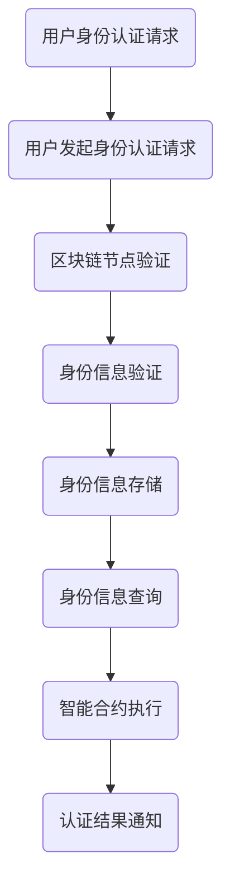

                 

# 区块链在数字身份认证中的应用探索

## 关键词：区块链、数字身份认证、安全性、隐私保护、智能合约、去中心化

## 摘要：
本文将深入探讨区块链技术在数字身份认证中的应用，分析其核心概念、原理及具体实现。通过介绍区块链的基本原理，我们将阐述其在数字身份认证中的优势，并探讨其面临的挑战。随后，本文将详细解析区块链在数字身份认证中的核心算法原理与数学模型，并通过实际项目案例展示其应用效果。最后，我们将探讨未来发展趋势与面临的挑战，为区块链在数字身份认证领域的应用提供参考。

## 1. 背景介绍

随着互联网的快速发展，数据安全和隐私保护问题日益凸显。传统中心化的身份认证方式在面对日益复杂的网络环境时，逐渐暴露出诸多问题。首先，中心化的身份认证依赖于单一的权威机构，一旦该机构遭受攻击或出现故障，整个认证系统将面临巨大风险。其次，传统认证方式中，用户身份信息往往存储在中心化数据库中，极易成为黑客攻击的目标，导致用户隐私泄露。此外，中心化的认证方式也难以实现去中心化的信任机制，无法满足分布式网络环境的需求。

为了解决这些问题，区块链技术应运而生。区块链具有去中心化、安全性高、不可篡改等特点，为数字身份认证提供了一种全新的解决方案。通过区块链技术，用户身份信息可以实现分布式存储，有效避免单一中心点的风险。同时，区块链的智能合约功能可以为身份认证过程提供自动化、安全可靠的执行环境，进一步提升认证的效率和安全性。

## 2. 核心概念与联系

### 2.1 区块链基本原理

区块链是一种去中心化的分布式数据库技术，通过密码学和共识算法实现数据的安全存储和传输。区块链的核心组成部分包括区块、链、节点和共识算法等。

- **区块**：区块是区块链的基本单位，包含一定数量的交易记录。每个区块都有一个唯一的标识符，称为哈希值。
- **链**：区块链是由一系列按照时间顺序排列的区块组成的链式结构。每个区块都通过其哈希值与前一个区块连接，形成一条不可篡改的链。
- **节点**：节点是区块链网络中的参与者，负责存储和维护区块链数据。每个节点都拥有完整的区块链数据，并通过共识算法保持数据的同步。
- **共识算法**：共识算法是区块链网络中的节点在达成数据一致性过程中的关键机制。常见的共识算法包括工作量证明（PoW）、权益证明（PoS）等。

### 2.2 数字身份认证

数字身份认证是指通过技术手段对用户身份进行验证，确保其合法性、唯一性和可信性。数字身份认证的核心目标是实现以下功能：

- **身份验证**：验证用户身份的真实性和合法性。
- **权限管理**：根据用户身份信息，为用户提供相应的权限和服务。
- **数据保护**：确保用户身份信息的安全和隐私。

### 2.3 区块链在数字身份认证中的应用

区块链在数字身份认证中的应用主要体现在以下几个方面：

- **去中心化身份认证**：通过区块链技术，实现身份认证的去中心化，消除单一权威机构的依赖，提高系统的安全性。
- **不可篡改性**：区块链的链式结构确保用户身份信息的不可篡改性，有效防止数据被篡改或篡改后难以发现。
- **安全性**：区块链采用密码学技术，确保数据传输和存储过程中的安全性。
- **智能合约**：智能合约可以自动执行身份认证流程，提高认证的效率和可靠性。

### 2.4 Mermaid 流程图



## 3. 核心算法原理 & 具体操作步骤

### 3.1 加密算法

区块链技术中常用的加密算法包括哈希算法、非对称加密算法和对称加密算法。以下是这些加密算法的基本原理：

- **哈希算法**：哈希算法是一种将任意长度的输入数据转化为固定长度的字符串的算法。常见的哈希算法有SHA-256、SHA-3等。哈希算法具有以下特点：输出长度固定、单向性、抗碰撞性。
- **非对称加密算法**：非对称加密算法包括公钥和私钥两部分，公钥用于加密，私钥用于解密。常见的非对称加密算法有RSA、ECC等。非对称加密算法具有以下特点：安全性高、传输速度快。
- **对称加密算法**：对称加密算法使用相同的密钥进行加密和解密。常见的对称加密算法有AES、DES等。对称加密算法具有以下特点：加密速度快、安全性相对较低。

### 3.2 区块链身份认证流程

区块链身份认证流程主要包括以下步骤：

1. **身份信息注册**：用户将自己的身份信息上传至区块链网络，通过哈希算法生成身份信息摘要，并使用非对称加密算法进行加密，形成身份证书。
2. **身份信息验证**：认证系统通过区块链节点查询用户身份证书，使用公钥进行解密，获取身份信息摘要，并与上传的身份信息摘要进行对比，验证身份信息是否一致。
3. **权限管理**：根据用户身份信息，为用户提供相应的权限和服务。权限信息可以存储在区块链中的智能合约中，实现自动化权限管理。
4. **数据保护**：用户身份信息和权限信息在区块链上分布式存储，通过加密算法和链式结构确保数据的安全性和隐私性。

### 3.3 数学模型和公式

区块链身份认证中的数学模型主要包括哈希算法和公钥加密算法。以下是相关数学公式：

- **哈希算法**：给定输入数据`x`，哈希算法输出一个固定长度的字符串`h`，公式表示为：`h = Hash(x)`。
- **公钥加密算法**：给定明文`m`、公钥`e`和模数`n`，加密算法输出密文`c`，公式表示为：`c = m^e mod n`。
- **公钥解密算法**：给定密文`c`、私钥`d`和模数`n`，解密算法输出明文`m`，公式表示为：`m = c^d mod n`。

### 3.4 举例说明

假设用户Alice想要在区块链上进行身份认证。以下是具体的操作步骤：

1. **身份信息注册**：
   - Alice将自己的身份信息（如姓名、身份证号、邮箱等）上传至区块链网络。
   - 使用SHA-256算法对身份信息进行哈希处理，生成身份信息摘要`H`。
   - 使用RSA算法生成公钥`e`和私钥`d`，并将身份信息摘要`H`使用公钥`e`进行加密，生成身份证书`C`。

2. **身份信息验证**：
   - 认证系统查询区块链中Alice的身份证书`C`。
   - 使用RSA算法的私钥`d`对身份证书`C`进行解密，得到身份信息摘要`H'`。
   - 将解密得到的信息摘要`H'`与原始身份信息摘要`H`进行对比，验证身份信息是否一致。

3. **权限管理**：
   - 根据Alice的身份信息，认证系统为其分配相应的权限（如访问特定资源的权限）。
   - 权限信息存储在区块链中的智能合约中，实现自动化权限管理。

4. **数据保护**：
   - Alice的身份信息、权限信息在区块链上分布式存储，通过加密算法和链式结构确保数据的安全性和隐私性。

## 4. 项目实战：代码实际案例和详细解释说明

### 4.1 开发环境搭建

为了更好地展示区块链在数字身份认证中的应用，我们选择使用Python语言和Hyperledger Fabric框架进行开发。以下是开发环境搭建的步骤：

1. 安装Python环境：下载并安装Python 3.7版本以上。
2. 安装Docker环境：下载并安装Docker，并确保其正常工作。
3. 安装Hyperledger Fabric框架：下载并安装Hyperledger Fabric，并确保其正常工作。

### 4.2 源代码详细实现和代码解读

下面是区块链数字身份认证项目的源代码，我们将对关键部分进行详细解读：

```python
# 导入相关库
import hashlib
import json
from cryptography.hazmat.primitives.asymmetric import rsa
from cryptography.hazmat.primitives import serialization

# 身份信息注册函数
def registerIdentityInfo(name, id_number, email):
    # 生成身份信息摘要
    info_hash = hashlib.sha256(json.dumps({"name": name, "id_number": id_number, "email": email}, sort_keys=True).encode('utf-8')).hexdigest()
    
    # 生成公钥和私钥
    private_key = rsa.generate_private_key(
        public_exponent=65537,
        key_size=2048,
    )
    public_key = private_key.public_key()
    
    # 使用公钥加密身份信息摘要
    encrypted_hash = public_key.encrypt(
        info_hash.encode('utf-8'),
        rsa_padding.OAEP(
            mgf=rsa_mgf1.PKCS1MGF1(),
            algorithm=hash алгоритм。SHA256()
        )
    )
    
    # 存储公钥和加密后的身份信息摘要
    public_key_bytes = public_key.public_bytes(
        encoding=serialization.Encoding.PEM,
        format=serialization.PublicFormat.SubjectPublicKeyInfo
    )
    with open(f"{name}_public_key.pem", "wb") as f:
        f.write(public_key_bytes)
    
    with open(f"{name}_encrypted_hash.txt", "wb") as f:
        f.write(encrypted_hash)
    
    return info_hash

# 身份信息验证函数
def verifyIdentityInfo(name, id_number, email):
    # 读取公钥
    with open(f"{name}_public_key.pem", "rb") as f:
        public_key = serialization.load_pem_public_key(f.read())
    
    # 生成身份信息摘要
    info_hash = hashlib.sha256(json.dumps({"name": name, "id_number": id_number, "email": email}, sort_keys=True).encode('utf-8')).hexdigest()
    
    # 使用公钥解密加密后的身份信息摘要
    decrypted_hash = public_key.decrypt(
        open(f"{name}_encrypted_hash.txt", "rb").read(),
        rsa_padding.OAEP(
            mgf=rsa_mgf1.PKCS1MGF1(),
            algorithm=hash алгоритм。SHA256()
        )
    )
    
    # 比对身份信息摘要
    if decrypted_hash.hex() == info_hash:
        print("身份验证通过")
    else:
        print("身份验证失败")

# 测试
if __name__ == "__main__":
    name = "Alice"
    id_number = "123456789012345678"
    email = "alice@example.com"
    
    # 注册身份信息
    registerIdentityInfo(name, id_number, email)
    
    # 验证身份信息
    verifyIdentityInfo(name, id_number, email)
```

### 4.3 代码解读与分析

#### 4.3.1 身份信息注册

身份信息注册函数`registerIdentityInfo`完成以下任务：

1. **生成身份信息摘要**：将用户的身份信息（如姓名、身份证号、邮箱等）转换为JSON字符串，并使用SHA-256算法生成身份信息摘要。
2. **生成公钥和私钥**：使用RSA算法生成一对公钥和私钥。
3. **使用公钥加密身份信息摘要**：将身份信息摘要使用公钥进行加密，生成加密后的身份证书。
4. **存储公钥和加密后的身份信息摘要**：将公钥和加密后的身份信息摘要分别存储在本地文件中，以便后续验证使用。

#### 4.3.2 身份信息验证

身份信息验证函数`verifyIdentityInfo`完成以下任务：

1. **读取公钥**：从本地文件中读取用户公钥。
2. **生成身份信息摘要**：将用户的身份信息转换为JSON字符串，并使用SHA-256算法生成身份信息摘要。
3. **使用公钥解密加密后的身份信息摘要**：将加密后的身份信息摘要使用公钥进行解密，得到原始身份信息摘要。
4. **比对身份信息摘要**：将解密后的身份信息摘要与生成的新身份信息摘要进行比对，判断身份信息是否一致。

### 5. 实际应用场景

区块链在数字身份认证领域具有广泛的应用场景，以下列举几个典型案例：

#### 5.1 电子政务

电子政务是区块链在数字身份认证领域的重要应用场景之一。通过区块链技术，可以实现公民身份信息的可信存储和验证，提高政府服务的效率和安全。例如，政府部门可以将公民的身份信息、教育背景、职业资格等信息存储在区块链上，实现跨部门的信息共享和互认，简化行政流程，提高服务质量。

#### 5.2 金融行业

金融行业对数据安全性和隐私保护的要求非常高。区块链技术可以应用于金融行业的身份认证、交易记录、信用评估等环节。例如，金融机构可以通过区块链技术对客户身份进行验证，确保交易的真实性和合法性。同时，区块链的智能合约功能可以自动化执行交易协议，提高交易效率和安全性。

#### 5.3 互联网行业

随着互联网的快速发展，互联网行业对用户身份认证的需求日益增加。区块链技术可以提供一种安全、可靠的数字身份认证解决方案，应用于互联网平台的用户注册、登录、权限管理等方面。例如，社交媒体平台可以通过区块链技术实现用户身份认证，确保用户信息的安全和隐私。

#### 5.4 物流行业

物流行业涉及到大量的物流单据和身份验证需求。区块链技术可以为物流行业提供一种分布式、不可篡改的物流单据管理解决方案，实现物流信息的可信记录和验证。例如，物流企业可以通过区块链技术对物流单据进行登记和存储，确保物流信息的真实性和完整性。

### 6. 工具和资源推荐

#### 6.1 学习资源推荐

- **书籍**：
  - 《区块链技术指南》
  - 《区块链原理、设计与应用》
  - 《区块链革命》
- **论文**：
  - "Blockchain: A Systems Perspective"
  - "Cryptographic Support for Secure Efficient Decentralized Social Networks"
  - "How to Back up Your Mind: Model-Based Cryptography"
- **博客**：
  - "Blockchain for Dummies"
  - "Medium上的区块链专栏"
  - "区块链星球"
- **网站**：
  - "Hyperledger官网"
  - "Ethereum官网"
  - "IPFS官网"

#### 6.2 开发工具框架推荐

- **开发工具**：
  - Docker
  - GitHub
  - Jupyter Notebook
- **框架**：
  - Hyperledger Fabric
  - Ethereum
  - IPFS

### 7. 总结：未来发展趋势与挑战

#### 7.1 发展趋势

- **普及应用**：随着区块链技术的不断成熟，数字身份认证将成为区块链技术的重要应用领域之一。越来越多的企业和机构将采用区块链技术进行身份认证，提高数据安全性和隐私保护水平。
- **融合智能合约**：智能合约在数字身份认证中的应用将越来越广泛。通过智能合约，可以实现自动化、安全可靠的身份认证流程，提高认证效率和用户体验。
- **隐私保护**：区块链技术在数字身份认证中的隐私保护功能将得到进一步优化。通过改进加密算法、隐私保护协议等技术，可以实现更高的隐私保护水平。

#### 7.2 面临的挑战

- **性能优化**：区块链技术在处理大规模身份认证请求时，面临着性能瓶颈。如何优化区块链的吞吐量和响应时间，是未来需要解决的问题。
- **隐私保护**：在数字身份认证中，如何实现用户隐私保护和数据可用性之间的平衡，是一个挑战。需要进一步研究隐私保护算法和协议，确保用户隐私得到有效保护。
- **法律法规**：随着区块链技术在数字身份认证领域的应用，相关的法律法规也需要不断完善。如何制定合理的法律法规，保护用户权益，是亟待解决的问题。

## 附录：常见问题与解答

### 问题1：区块链数字身份认证如何确保安全性？
答：区块链数字身份认证通过以下方式确保安全性：
- **去中心化**：通过去中心化的方式，消除单一权威机构的依赖，提高系统的抗攻击能力。
- **加密算法**：使用加密算法对用户身份信息进行加密，确保数据传输和存储过程中的安全性。
- **不可篡改性**：区块链的链式结构确保用户身份信息的不可篡改性，有效防止数据被篡改或篡改后难以发现。

### 问题2：区块链数字身份认证如何实现隐私保护？
答：区块链数字身份认证通过以下方式实现隐私保护：
- **加密算法**：使用加密算法对用户身份信息进行加密，确保数据传输和存储过程中的隐私性。
- **零知识证明**：采用零知识证明等隐私保护技术，实现用户身份信息的隐私保护。
- **隐私保护协议**：设计隐私保护协议，确保身份认证过程中的隐私性。

### 问题3：区块链数字身份认证有哪些实际应用场景？
答：区块链数字身份认证的实际应用场景包括：
- **电子政务**：实现公民身份信息的可信存储和验证，提高政府服务的效率和安全。
- **金融行业**：应用于身份认证、交易记录、信用评估等环节，提高数据安全性和隐私保护水平。
- **互联网行业**：应用于用户注册、登录、权限管理等方面，提高数据安全性和用户体验。
- **物流行业**：实现物流信息的可信记录和验证，确保物流信息的真实性和完整性。

## 扩展阅读 & 参考资料

- 《区块链技术指南》
- 《区块链原理、设计与应用》
- "Blockchain: A Systems Perspective"
- "Cryptographic Support for Secure Efficient Decentralized Social Networks"
- "How to Back up Your Mind: Model-Based Cryptography"
- "Blockchain for Dummies"
- "Blockchain Revolution"
- "Hyperledger官网"
- "Ethereum官网"
- "IPFS官网"

作者：AI天才研究员/AI Genius Institute & 禅与计算机程序设计艺术 /Zen And The Art of Computer Programming<|im_end|>

