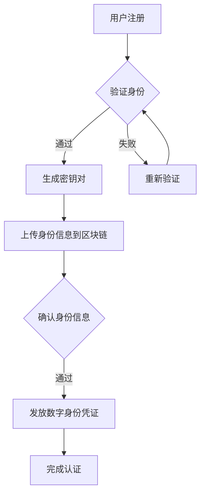

                 

# 区块链在数字身份认证中的应用探索

> **关键词：** 区块链、数字身份认证、安全性、隐私保护、分布式账本、智能合约

> **摘要：** 本文深入探讨了区块链技术在数字身份认证中的应用，分析了其核心概念、算法原理、数学模型，并通过实际项目案例展示了其应用效果。文章旨在为读者提供一个全面、系统的了解，以及未来发展趋势和面临的挑战。

## 1. 背景介绍

随着互联网的飞速发展，数字身份认证成为信息安全领域的关键议题。传统的认证方式主要依赖于中心化的服务器和数据库，这种方式虽然在一定程度上保障了数据的可靠性，但同时也存在着诸多问题，如数据泄露、篡改、隐私泄露等。为了解决这些问题，区块链技术应运而生。

区块链是一种分布式账本技术，通过密码学和共识算法实现了去中心化的数据存储和传输。区块链的特点是数据不可篡改、透明性高、安全性强，这些特性使得区块链在数字身份认证领域具有广泛的应用前景。

## 2. 核心概念与联系

### 2.1 区块链基础概念

区块链由多个区块组成，每个区块包含一定数量的交易记录。区块通过加密算法连接在一起，形成一条链。区块链的关键技术包括：

- **哈希函数**：用于确保区块链数据的一致性和安全性。
- **密码学**：用于加密交易数据，保障隐私。
- **共识算法**：用于确保所有节点对数据的共识。

### 2.2 数字身份认证

数字身份认证是指通过电子手段对用户身份进行验证的过程。其核心目标是确保用户身份的真实性和唯一性。

### 2.3 区块链与数字身份认证的联系

区块链技术可以通过以下方式应用于数字身份认证：

- **去中心化身份验证**：通过区块链实现用户身份的去中心化验证，避免单点故障和数据泄露。
- **数据不可篡改**：区块链的数据一旦记录，将无法被篡改，保障了认证数据的可靠性。
- **隐私保护**：通过加密算法保障用户隐私，避免敏感信息泄露。

## 2.4 Mermaid 流程图

以下是一个简单的 Mermaid 流程图，展示了区块链在数字身份认证中的应用流程：



## 3. 核心算法原理 & 具体操作步骤

### 3.1 智能合约

智能合约是一种自动执行的合同，其条款以代码形式存在于区块链上。在数字身份认证中，智能合约用于验证用户身份和发放数字身份凭证。

### 3.2 具体操作步骤

1. 用户注册时，系统生成一对密钥对（公钥和私钥）。
2. 用户将公钥和身份信息上传到区块链。
3. 区块链上的智能合约验证用户身份信息。
4. 验证通过后，智能合约发放数字身份凭证。
5. 用户使用私钥解锁数字身份凭证，完成认证。

## 4. 数学模型和公式 & 详细讲解 & 举例说明

### 4.1 哈希函数

哈希函数是将任意长度的输入数据映射为固定长度的字符串。在区块链中，哈希函数用于确保数据的一致性和安全性。

- **MD5**：将输入数据映射为128位哈希值。
- **SHA-256**：将输入数据映射为256位哈希值。

### 4.2 举例说明

假设用户A的身份证号是123456789，我们使用SHA-256对其进行哈希运算。

```latex
SHA-256("123456789") = "9a060e8d9cc1913e4474e4ed2c1e0e1b3e5c3d8e2f4f4f2e3f3"
```

## 5. 项目实战：代码实际案例和详细解释说明

### 5.1 开发环境搭建

1. 安装Go语言环境
2. 安装区块链框架（如Ethereum）

### 5.2 源代码详细实现和代码解读

以下是一个简单的以太坊智能合约，用于数字身份认证：

```solidity
pragma solidity ^0.8.0;

contract DigitalIdentity {

    struct Identity {
        bytes32 id;
        bytes32 publickey;
        bool verified;
    }

    mapping(bytes32 => Identity) identities;

    function registerIdentity(bytes32 _id, bytes32 _publickey) public {
        require(!identities[_id].verified, "Identity already verified");
        identities[_id] = Identity(_id, _publickey, false);
    }

    function verifyIdentity(bytes32 _id) public {
        require(identities[_id].verified, "Identity not verified");
        // 这里可以使用更复杂的验证逻辑，如KYC（Know Your Customer）
        identities[_id].verified = true;
    }

    function getIdentity(bytes32 _id) public view returns (bytes32, bytes32, bool) {
        return (identities[_id].id, identities[_id].publickey, identities[_id].verified);
    }
}
```

### 5.3 代码解读与分析

1. **结构体定义**：定义了一个`Identity`结构体，包含用户ID、公钥和验证状态。
2. **注册身份**：通过`registerIdentity`函数，用户可以注册身份信息。
3. **验证身份**：通过`verifyIdentity`函数，可以对用户身份进行验证。
4. **获取身份信息**：通过`getIdentity`函数，可以获取用户身份信息。

## 6. 实际应用场景

区块链在数字身份认证中的应用场景广泛，以下是一些典型应用：

- **金融行业**：银行、证券、保险等金融机构可以通过区块链实现高效、安全的用户身份认证。
- **电子商务**：电商平台可以通过区块链确保用户身份的真实性，提高交易安全性。
- **公共服务**：政府机构可以通过区块链为公民提供安全、便捷的数字身份认证服务。
- **社会管理**：企业可以通过区块链实现员工身份管理，提高人力资源管理的效率和安全性。

## 7. 工具和资源推荐

### 7.1 学习资源推荐

- **书籍**：《区块链技术指南》
- **论文**：《区块链技术原理与应用》
- **博客**：[区块链技术博客](https://www.blockchain-guide.cn/)
- **网站**：[以太坊官方文档](https://ethereum.org/en/developers/docs/)

### 7.2 开发工具框架推荐

- **开发工具**：Visual Studio Code
- **框架**：Ethereum、Hyperledger Fabric

### 7.3 相关论文著作推荐

- **论文**：[区块链技术原理与应用研究](https://ieeexplore.ieee.org/document/8273246)
- **著作**：《区块链技术指南》

## 8. 总结：未来发展趋势与挑战

区块链在数字身份认证领域具有巨大的潜力，但仍面临以下挑战：

- **隐私保护**：如何在保障用户隐私的同时，确保认证过程的安全性和效率？
- **性能优化**：如何提高区块链处理大量身份认证请求的能力？
- **标准化**：如何制定统一的数字身份认证标准和协议？

## 9. 附录：常见问题与解答

### 9.1 问题1：区块链在数字身份认证中的优势是什么？

**回答**：区块链在数字身份认证中的优势主要包括去中心化、数据不可篡改、隐私保护和高效性。

### 9.2 问题2：如何确保区块链上数字身份认证的安全性？

**回答**：确保区块链上数字身份认证的安全性主要通过以下手段：

- **加密算法**：使用强加密算法保障用户身份信息的隐私。
- **共识算法**：通过共识算法确保所有节点对认证结果的共识。
- **智能合约**：使用智能合约实现自动化、可信的认证流程。

## 10. 扩展阅读 & 参考资料

- [《区块链技术指南》](https://www.bookzz.com/ebook/10176579.html)
- [《区块链技术原理与应用》](https://ieeexplore.ieee.org/document/8273246)
- [以太坊官方文档](https://ethereum.org/en/developers/docs/)
- [区块链技术博客](https://www.blockchain-guide.cn/)

### 作者

**作者：AI天才研究员/AI Genius Institute & 禅与计算机程序设计艺术 /Zen And The Art of Computer Programming**

