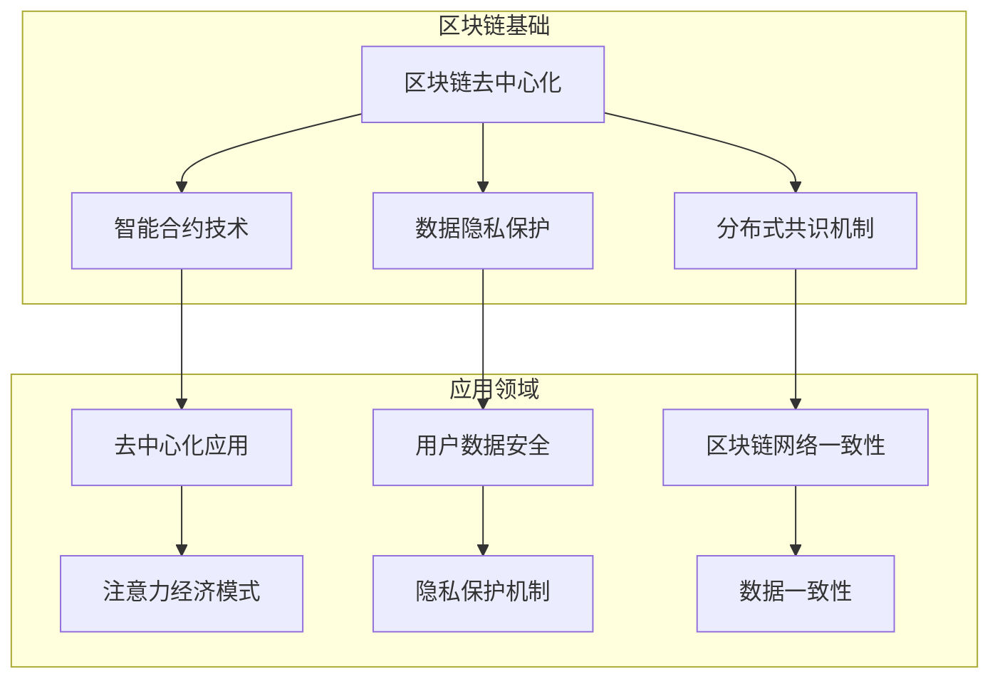

                 

## 1. 背景介绍

区块链技术作为一种分布式账本技术，近年来在金融、医疗、物流等多个领域得到了广泛的应用。与此同时，随着互联网和信息技术的快速发展，注意力经济逐渐崭露头角，成为了一种新的经济形态。注意力经济强调用户注意力的重要性，通过吸引和转化用户的注意力来创造价值。在这种背景下，区块链技术与注意力经济的结合变得尤为重要，它们互为补充，共同推动着数字经济的发展。

### 区块链技术

区块链技术最早由中本聪（Satoshi Nakamoto）在2008年提出，是一种去中心化的分布式数据库技术。它通过加密算法和分布式共识机制，实现了数据的安全存储和可靠传输。区块链的特点包括去中心化、透明性、不可篡改性和可追溯性。这些特性使得区块链在信息共享、价值传输和信任建立等方面具有巨大的潜力。

在技术层面，区块链由多个区块组成，每个区块包含一定数量的交易记录，并通过哈希算法与前一个区块进行链接，形成了一个时间序列的数据结构。通过分布式网络中的节点协作，区块链可以保证数据的一致性和安全性。区块链技术不仅可以应用于金融领域，还可以拓展到其他行业，如供应链管理、医疗健康、知识产权保护等。

### 注意力经济

注意力经济是一种基于用户注意力的经济模式，它强调用户注意力的重要性。在互联网时代，用户的时间和注意力成为了最宝贵的资源。企业和个人通过吸引和转化用户的注意力，可以创造出巨大的商业价值。注意力经济的关键在于如何获取用户的注意力，并将其转化为实际的收益。

注意力经济的特点包括：

1. **注意力稀缺性**：用户的时间和注意力是有限的，因此稀缺性使得注意力成为了价值创造的源泉。
2. **个性化与互动性**：通过大数据和人工智能技术，企业可以更好地了解用户需求，提供个性化的服务和内容，从而提高用户的参与度和满意度。
3. **多元化盈利模式**：注意力经济不仅包括广告收入，还包括会员订阅、内容付费、数据分析等多种盈利模式。

### 区块链与注意力经济的结合

区块链技术与注意力经济的结合，有望解决传统注意力经济中的一些痛点，如注意力数据的不透明性、数据隐私保护、用户权益保障等。以下是一些具体的应用场景：

1. **去中心化的内容平台**：通过区块链技术，内容创作者可以直接与用户进行交易，免去了传统平台的抽成环节，提高了创作者的收益。
2. **用户数据隐私保护**：区块链可以确保用户数据的隐私和安全，防止数据泄露和滥用。
3. **数字身份认证**：区块链技术可以用于建立可信的数字身份认证系统，确保用户身份的真实性和唯一性。
4. **智能合约**：通过智能合约，可以自动执行交易协议，确保交易的透明性和公正性。

总的来说，区块链技术在注意力经济中的应用，不仅提升了用户体验，还为企业创造了新的商业模式和价值创造途径。在接下来的章节中，我们将深入探讨区块链技术的核心概念和算法原理，以及它们在注意力经济中的具体应用。通过一步步的推理分析，我们将揭示区块链在注意力经济中的巨大潜力。

### 1.1 区块链技术的基本原理

区块链技术的基本原理可以追溯到其分布式账本的核心机制。区块链由多个区块组成，每个区块包含一定数量的交易记录。这些区块通过加密算法和哈希函数链接在一起，形成一个不可篡改的时间序列数据结构。

#### 区块结构

一个区块通常包含以下几个部分：

1. **区块头（Block Header）**：区块头包含了区块的元数据，如版本号、上一区块的哈希值（Previous Hash）、默克尔树根哈希（Merkle Root）、时间戳（Timestamp）和难度目标（Difficulty Target）。
2. **交易列表（Transaction List）**：交易列表包含了该区块内所有的交易记录。这些交易记录可以是简单的资金转账，也可以是复杂的智能合约执行结果。
3. **工作量证明（Proof of Work, PoW）**：在PoW机制下，区块的创建者需要解决一个复杂的数学问题，这个问题的难度由网络难度目标决定。解决该问题后，区块头中的哈希值将满足特定的条件，从而使得区块被添加到区块链中。

#### 哈希函数

哈希函数是区块链技术中的核心组件。它将任意长度的数据转换为一个固定长度的哈希值。常见的哈希函数包括SHA-256和KECCAK-256。哈希函数具有以下几个重要特性：

1. **不可逆性**：给定一个输入数据，无法通过哈希函数反推出原始数据。
2. **确定性**：对于相同的输入数据，哈希函数总是产生相同的输出哈希值。
3. **抗碰撞性**：在合理的计算复杂度内，很难找到两个不同的输入数据，使得它们的哈希值相同。

#### 区块链的链接机制

区块链通过哈希函数和链接机制实现了数据的一致性和安全性。每个区块都包含其前一个区块的哈希值，从而形成了一个链式结构。这种链接方式保证了区块链的不可篡改性：一旦一个区块被添加到区块链中，想要修改该区块及其后的所有区块，就需要重新计算整个链的哈希值，这几乎是不可能的。

#### 分布式网络

区块链的分布式网络是保证其安全性和去中心化的关键。在区块链网络中，每个节点都保存了一份完整的区块链数据，并通过P2P（Peer-to-Peer）协议与其他节点进行通信。当一个新的区块被创建后，节点们会通过共识机制（如PoW或PoS）来验证该区块的有效性，并决定是否将其添加到区块链中。

#### 共识机制

共识机制是区块链网络中节点达成一致的关键。不同的区块链网络可能采用不同的共识机制，如PoW、PoS、DPoS等。这些机制确保了网络中的所有节点都能对区块链的状态保持一致。

1. **工作量证明（PoW）**：节点通过解决复杂的数学问题来竞争生成新的区块。这个问题通常称为“挖矿”。解决问题后，节点将区块广播给其他节点，并等待网络共识。
2. **权益证明（PoS）**：节点根据其在网络中的权益（如持有的代币数量）来竞争生成区块。持有代币越多，节点的权益越大，从而提高其生成区块的概率。
3. **委托权益证明（DPoS）**：与PoS类似，但节点不是随机选出的，而是由其他节点投票选出的“超级节点”来生成区块。

通过上述机制，区块链技术实现了数据的去中心化存储、可靠传输和不可篡改。这些特性使得区块链成为了一种强大的技术工具，可以在各种应用场景中发挥作用。

### 1.2 注意力经济的基本概念

注意力经济是一种新兴的经济模式，其核心在于用户注意力的获取、转化和利用。在互联网和移动设备普及的今天，用户注意力成为了一种稀缺资源，企业和个人都在寻求有效的方法来吸引和保持用户的关注。

#### 注意力的稀缺性

注意力稀缺性是注意力经济的基本假设。在有限的时间内，用户只能将注意力集中在有限的事物上。因此，吸引并保持用户的注意力成为了一种重要的竞争手段。在注意力经济中，用户的时间、精力和认知资源都变得异常宝贵，企业需要通过优质的内容、独特的体验和高效的互动来吸引用户的注意力。

#### 注意力的获取与转化

获取注意力是注意力经济的第一步。企业可以通过以下几种方式来吸引用户的注意力：

1. **内容营销**：通过提供有价值、有趣或引人入胜的内容来吸引用户。
2. **社交媒体营销**：利用社交媒体平台的算法和传播机制，扩大内容的曝光率和影响力。
3. **广告投放**：通过精准的广告投放，将目标用户与特定产品或服务联系起来。

一旦用户被吸引，接下来需要将其注意力转化为实际的行动，如点击链接、购买商品、注册账户等。这种转化过程通常需要用户主动参与，企业需要提供激励措施，如折扣、礼品或优惠券，来鼓励用户采取行动。

#### 注意力的价值

在注意力经济中，注意力不仅是一种资源，更是一种价值。通过有效的获取和转化，企业可以将其转化为商业收益。以下是一些典型的商业模式：

1. **广告收入**：通过展示广告来赚取广告费用，这是最常见的注意力经济模式之一。
2. **会员订阅**：通过提供高质量的内容或服务，吸引用户付费订阅。
3. **内容付费**：用户为获取特定内容或服务付费，如付费新闻、付费视频等。
4. **数据分析**：通过对用户行为数据进行分析，为企业提供有价值的洞察，从而帮助它们更好地吸引用户注意力。

#### 注意力经济的挑战

虽然注意力经济具有巨大的潜力，但同时也面临着一些挑战：

1. **注意力分散**：随着信息爆炸，用户的注意力越来越难以集中，企业需要不断创新来吸引用户的注意力。
2. **隐私保护**：用户隐私是注意力经济中的重要问题，企业需要在获取用户注意力的同时，确保用户数据的隐私和安全。
3. **数据滥用**：如果不加限制地获取和利用用户数据，可能会导致用户隐私泄露和滥用，损害用户利益。

通过理解注意力经济的基本概念和特点，我们可以更好地把握其发展趋势，探索区块链技术在其中的应用潜力。在接下来的章节中，我们将进一步探讨区块链技术与注意力经济的结合点，以及如何利用区块链技术解决注意力经济中的痛点。

### 2. 核心概念与联系

在深入探讨区块链技术在注意力经济中的应用之前，我们需要明确几个核心概念，并展示它们之间的联系。这些核心概念包括区块链的去中心化特性、智能合约技术、数据隐私保护和分布式共识机制。通过一个详细的Mermaid流程图，我们可以直观地了解这些概念及其相互关系。



#### 去中心化特性

去中心化是区块链技术的核心优势之一。它通过分布式网络和共识机制，避免了单一中央权威的存在，从而提高了系统的透明性和抗攻击性。在注意力经济中，去中心化特性有助于构建去中心化的内容平台和交易系统，确保用户数据的安全和隐私。

#### 智能合约技术

智能合约是基于区块链的自动化协议，可以在满足特定条件时自动执行。智能合约的出现，为区块链在注意力经济中的应用提供了强大的支持。通过智能合约，内容创作者可以直接与用户进行交易，避免了传统平台的中介费用和信任问题。智能合约的透明性和不可篡改性，使得用户可以更加信任这些交易。

#### 数据隐私保护

数据隐私保护是注意力经济中的关键挑战。区块链技术通过加密算法和分布式存储，可以有效保护用户数据的隐私和安全。在区块链网络中，用户数据以加密形式存储，只有拥有正确密钥的用户才能访问。此外，区块链的分布式特性使得数据难以被篡改或滥用。

#### 分布式共识机制

分布式共识机制是区块链网络中节点达成一致的重要手段。不同的共识机制（如PoW、PoS、DPoS）保证了区块链网络的一致性和安全性。在注意力经济中，分布式共识机制有助于确保交易和内容的真实性，从而提高用户的信任度。

#### 去中心化应用

去中心化应用（DApps）是基于区块链的分布式应用程序，它们通过智能合约和区块链网络实现去中心化的服务和交易。在注意力经济中，去中心化应用可以提供去中心化的内容平台、数字身份认证和数字资产交易等服务。这些应用不仅提高了用户体验，还为企业创造了新的商业模式。

#### 用户数据安全

用户数据安全是注意力经济中的关键问题。通过区块链技术，用户数据可以以加密形式存储，并且只有拥有正确密钥的用户才能访问。区块链的分布式存储和不可篡改特性，进一步提高了用户数据的安全性和隐私保护。

#### 数据一致性

数据一致性是区块链网络中的另一个重要问题。通过分布式共识机制，区块链网络中的所有节点都能保持数据的一致性。在注意力经济中，数据一致性确保了交易和内容的真实性和可靠性，从而提高了用户的信任度。

通过上述核心概念及其相互关系的分析，我们可以看出，区块链技术在注意力经济中具有巨大的潜力。在接下来的章节中，我们将深入探讨区块链技术在注意力经济中的具体应用，并分析其优势与挑战。

### 3. 核心算法原理 & 具体操作步骤

#### 区块链中的核心算法

区块链技术中涉及多个核心算法，这些算法保证了区块链的安全性和一致性。以下是区块链中的几个关键算法：

1. **哈希算法**：哈希算法是区块链技术的基石。它通过将任意长度的数据转换为一个固定长度的哈希值，确保了数据的唯一性和不可篡改性。常见的哈希算法包括SHA-256和KECCAK-256。
2. **加密算法**：加密算法用于保护区块链中的数据和交易隐私。常见的加密算法包括RSA、AES和ECC。
3. **工作量证明（PoW）**：工作量证明是一种共识机制，用于确定区块链中新区块的生成者。节点通过解决复杂的数学问题来竞争生成区块，解决问题的关键在于找到满足特定条件的哈希值。
4. **权益证明（PoS）**：权益证明是一种替代PoW的共识机制，节点根据其在区块链中的权益（如持有的代币数量）来竞争生成区块。权益越高，节点生成区块的概率越大。

#### 区块链操作步骤

区块链的基本操作步骤包括以下几部分：

1. **创建交易**：用户通过区块链网络发送交易，交易可以是简单的资金转账，也可以是复杂的智能合约执行。
2. **交易验证**：交易在发送到区块链网络前，需要通过验证。验证过程包括检查交易的有效性、交易金额是否足够、交易是否重复等。
3. **区块创建**：当一个或多个交易被网络中的节点接收后，节点将它们打包成一个新的区块。区块通常包含一定数量的交易记录，并且每个区块都包含其前一个区块的哈希值。
4. **区块验证**：新创建的区块需要经过网络中的其他节点验证。验证过程包括检查区块的完整性、交易的有效性和区块的难度目标是否满足。
5. **区块添加**：一旦区块被验证通过，它将被添加到区块链中。这个过程称为“挖矿”，在PoW机制下，挖矿意味着找到一个满足特定条件的哈希值。
6. **共识达成**：通过分布式共识机制，区块链网络中的所有节点达成一致，确保区块链的状态一致性和安全性。

#### 区块链在注意力经济中的应用步骤

在注意力经济中，区块链技术的应用可以简化为以下几个步骤：

1. **用户注册**：用户通过区块链网络注册账户，并生成唯一的公钥和私钥。公钥用于标识用户身份，私钥用于签名交易。
2. **内容发布**：内容创作者将原创内容上传到区块链网络，并使用智能合约进行内容授权和管理。智能合约确保内容创作者的版权和收益。
3. **用户交互**：用户通过区块链网络与内容进行互动，如阅读、评论、点赞等。这些互动信息以交易的形式记录在区块链上。
4. **收益分配**：根据用户的互动行为和内容创作者的授权，区块链网络自动计算并分配收益。收益可以通过智能合约自动转账给内容创作者和参与者。
5. **隐私保护**：通过加密算法和分布式存储，用户数据和交易隐私得到有效保护，防止数据泄露和滥用。

通过上述步骤，区块链技术为注意力经济提供了一种去中心化、透明和安全的解决方案。它不仅提升了用户的体验，还为企业创造了新的商业模式和价值创造途径。

### 4. 数学模型和公式 & 详细讲解 & 举例说明

#### 区块链中的数学模型和公式

区块链技术涉及多种数学模型和公式，以下是一些关键的概念：

1. **哈希函数**：哈希函数将任意长度的输入数据映射为固定长度的哈希值。常见的哈希函数包括SHA-256、SHA-3和KECCAK-256。
    \[
    H = \text{SHA-256}(M)
    \]
    其中，\(H\) 是哈希值，\(M\) 是输入数据。

2. **加密算法**：加密算法用于保护区块链中的数据和交易隐私。常见的加密算法包括RSA、AES和ECC。
    \[
    C = E(P, K)
    \]
    其中，\(C\) 是加密后的数据，\(P\) 是明文，\(K\) 是密钥。

3. **工作量证明（PoW）**：PoW机制中，节点需要找到一个满足特定条件的哈希值，通常条件是哈希值的前几个字节为0。
    \[
    H(N) = \text{SHA-256}(N)
    \]
    其中，\(N\) 是随机数，\(H(N)\) 是哈希值。节点不断尝试不同的随机数，直到找到一个满足条件的哈希值。

4. **权益证明（PoS）**：PoS机制中，节点的权益（如持有的代币数量）决定了其生成区块的概率。权益越高，生成区块的概率越大。
    \[
    P(A) = \frac{N(A)}{N_{\text{total}}}
    \]
    其中，\(P(A)\) 是节点\(A\)生成区块的概率，\(N(A)\) 是节点\(A\)的权益，\(N_{\text{total}}\) 是所有节点的权益总和。

#### 举例说明

假设我们有一个区块链网络，其中有两个节点：节点A和节点B。节点A拥有100个代币，节点B拥有50个代币。根据PoS机制，我们可以计算节点A和节点B生成区块的概率。

1. **计算总权益**：
    \[
    N_{\text{total}} = N(A) + N(B) = 100 + 50 = 150
    \]

2. **计算节点A的生成区块概率**：
    \[
    P(A) = \frac{N(A)}{N_{\text{total}}} = \frac{100}{150} = \frac{2}{3}
    \]

3. **计算节点B的生成区块概率**：
    \[
    P(B) = \frac{N(B)}{N_{\text{total}}} = \frac{50}{150} = \frac{1}{3}
    \]

因此，节点A生成区块的概率是2/3，而节点B生成区块的概率是1/3。这意味着节点A比节点B更有可能生成下一个区块。

通过上述数学模型和公式的讲解，我们可以更好地理解区块链技术的工作原理。这些数学工具不仅保证了区块链的安全性，还为注意力经济提供了强大的理论基础。在接下来的章节中，我们将通过实际项目案例，进一步探讨区块链技术在注意力经济中的应用。

### 5. 项目实战：代码实际案例和详细解释说明

为了更好地展示区块链技术在注意力经济中的应用，我们将通过一个实际项目案例来具体讲解如何使用区块链技术实现注意力经济模型。该案例将包括开发环境搭建、源代码实现和代码解读与分析。

#### 5.1 开发环境搭建

在开始项目之前，我们需要搭建一个适合开发区块链应用的开发环境。以下是推荐的开发工具和框架：

1. **Node.js**：Node.js是一个基于Chrome V8引擎的JavaScript运行环境，它使得JavaScript不仅可以用于前端开发，还可以用于后端开发。
2. **Truffle**：Truffle是一个用于智能合约开发和测试的工具框架，它提供了丰富的插件和命令，使得开发智能合约变得更加简便。
3. **Ganache**：Ganache是一个本地以太坊节点，用于本地测试智能合约。它提供了方便的界面和API，使得开发者可以快速创建和测试区块链环境。
4. **MetaMask**：MetaMask是一个浏览器插件，它提供了一个本地钱包，用于管理和交互以太坊区块链上的智能合约。

以下是搭建开发环境的步骤：

1. **安装Node.js**：访问Node.js官方网站（[https://nodejs.org/），下载并安装最新版本的Node.js。安装完成后，打开终端，输入以下命令确认安装成功：**
    ```bash
    node -v
    npm -v
    ```

2. **安装Truffle**：在终端中运行以下命令安装Truffle：
    ```bash
    npm install -g truffle
    ```

3. **安装Ganache**：访问Ganache的GitHub页面（[https://github.com/trufflesuite/ganache），下载并安装Ganache。安装完成后，启动Ganache，创建一个新的以太坊网络。**
4. **配置MetaMask**：安装MetaMask浏览器插件，并配置以太坊网络，确保插件连接到我们创建的本地Ganache网络。

#### 5.2 源代码详细实现和代码解读

我们将在该项目中实现一个简单的去中心化内容平台，用户可以发布内容并获取其他用户的点赞。以下是项目的源代码实现和解读。

**智能合约：ContentPlatform.sol**

```solidity
pragma solidity ^0.8.0;

contract ContentPlatform {
    // 内容结构
    struct Content {
        address creator;
        string title;
        string content;
        uint256 likes;
    }

    // 内容映射
    mapping(uint256 => Content) public contents;

    // 内容计数器
    uint256 public contentCount;

    // 发布内容
    function publishContent(string memory title, string memory content) public {
        contents[contentCount] = Content(msg.sender, title, content, 0);
        contentCount++;
    }

    // 点赞
    function likeContent(uint256 contentId) public {
        contents[contentId].likes++;
    }

    // 获取内容详情
    function getContent(uint256 contentId) public view returns (address creator, string memory title, string memory content, uint256 likes) {
        Content memory content = contents[contentId];
        creator = content.creator;
        title = content.title;
        content = content.content;
        likes = content.likes;
    }
}
```

**解读**：

1. **Content结构**：定义了一个Content结构，包含创作者地址、标题、内容和点赞数。
2. **contents映射**：使用一个映射来存储所有内容，键是内容ID，值是Content结构。
3. **contentCount变量**：用于跟踪内容数量。
4. **publishContent函数**：用于发布新内容，创作者地址、标题、内容和点赞数都存储在contents映射中，并增加contentCount。
5. **likeContent函数**：用于点赞，通过增加内容的likes值来记录点赞。
6. **getContent函数**：用于获取内容的详细信息。

**前端代码：index.html**

```html
<!DOCTYPE html>
<html lang="en">
<head>
    <meta charset="UTF-8">
    <meta name="viewport" content="width=device-width, initial-scale=1.0">
    <title>Content Platform</title>
</head>
<body>
    <h1>Content Platform</h1>
    <div id="content-container"></div>
    <script src="https://cdn.ethers.io/scripts/lib/ethers.js"></script>
    <script src="https://cdn.ethers.io/scripts/lib/web3.js"></script>
    <script>
        // 连接到Ganache以太坊网络
        const provider = new ethers.providers.Web3Provider(window.ethereum);
        const signer = provider.getSigner();
        const contentPlatformAddress = "0x..."; // 智能合约地址

        // 内容平台合约接口
        const ContentPlatform = artifacts.require("ContentPlatform");
        const contentPlatformContract = new ethers.Contract(contentPlatformAddress, ContentPlatform.abi, signer);

        // 发布内容
        async function publishContent() {
            const title = document.getElementById("title").value;
            const content = document.getElementById("content").value;
            await contentPlatformContract.publishContent(title, content);
            displayContents();
        }

        // 点赞
        async function likeContent(contentId) {
            await contentPlatformContract.likeContent(contentId);
            displayContents();
        }

        // 获取并显示内容
        async function displayContents() {
            const contents = await contentPlatformContract.contents();
            const contentContainer = document.getElementById("content-container");
            contentContainer.innerHTML = "";
            for (const content of contents) {
                const contentElement = document.createElement("div");
                contentElement.innerHTML = `
                    <h2>${content.title}</h2>
                    <p>${content.content}</p>
                    <button onclick="likeContent(${content.id})">Like</button>
                `;
                contentContainer.appendChild(contentElement);
            }
        }

        // 初始化
        displayContents();
    </script>
</body>
</html>
```

**解读**：

1. **连接到以太坊网络**：使用Ethers.js库连接到Ganache以太坊网络。
2. **智能合约接口**：创建智能合约的实例，并获取其ABI（Application Binary Interface）。
3. **发布内容**：通过调用publishContent函数发布新内容。
4. **点赞**：通过调用likeContent函数点赞。
5. **获取并显示内容**：获取智能合约中的内容列表，并动态生成HTML元素显示。

#### 5.3 代码解读与分析

**智能合约解读**

1. **Content结构**：定义了内容的基本属性，包括创作者地址、标题、内容和点赞数。
2. **contents映射**：用于存储所有内容，键是内容ID，值是Content结构。
3. **contentCount变量**：用于跟踪内容数量。
4. **publishContent函数**：通过创作者地址、标题和内容创建新内容，并存储在contents映射中，同时增加contentCount。
5. **likeContent函数**：增加内容的likes值，表示点赞。
6. **getContent函数**：获取内容的详细信息，包括创作者地址、标题、内容和点赞数。

**前端代码解读**

1. **连接到以太坊网络**：使用Ethers.js库连接到Ganache以太坊网络，并获取用户的签名者（signer）。
2. **智能合约接口**：创建智能合约的实例，并获取其ABI。
3. **发布内容**：通过调用智能合约的publishContent函数发布新内容。
4. **点赞**：通过调用智能合约的likeContent函数点赞。
5. **获取并显示内容**：获取智能合约中的内容列表，并动态生成HTML元素显示。

通过上述项目实战，我们可以看到如何使用区块链技术实现一个去中心化的内容平台。这个平台不仅提高了用户的参与度，还确保了内容的真实性和安全性。在接下来的章节中，我们将进一步探讨区块链技术在注意力经济中的实际应用场景。

### 6. 实际应用场景

区块链技术在注意力经济中的应用场景十分广泛，以下是一些典型的应用案例，展示了区块链如何在不同领域提升注意力经济的效率和公平性。

#### 去中心化内容平台

去中心化内容平台（如Steemit、Medium）允许创作者直接发布和传播内容，绕过了传统的内容平台，如YouTube和Facebook。在这些平台上，用户可以直接对内容进行点赞、评论和分享，并使用平台内置的加密货币进行打赏。这种模式不仅激励了创作者，还提高了用户的参与度。

**优势**：

1. **创作者收益**：创作者可以直接获得用户打赏的加密货币，避免了传统平台的抽成。
2. **去中心化**：内容不受单一平台的控制，创作者和用户具有更高的自主权。
3. **透明性**：区块链记录了所有交易和互动，确保了平台的透明性和可信度。

#### 社交网络

区块链技术可以应用于社交网络，提高用户数据的隐私保护。例如，Mastodon是一个基于联邦协议的去中心化微博平台，用户可以在不同的实例之间进行互动。每个实例都独立运营，用户的数据不会集中存储在一个中央服务器上，从而降低了数据泄露的风险。

**优势**：

1. **隐私保护**：用户数据分散存储，降低了隐私泄露的风险。
2. **去中心化**：社交网络由多个实例组成，每个实例都有独立的运营和管理。
3. **可扩展性**：新实例可以随时加入网络，增加了社交网络的扩展性。

#### 数字身份认证

区块链技术可以用于数字身份认证，确保用户身份的真实性和唯一性。例如，Selfkey是一个基于区块链的身份管理平台，用户可以在平台上创建和管理自己的数字身份。这些身份信息被存储在区块链上，无法被篡改或伪造。

**优势**：

1. **身份认证**：用户可以使用数字身份进行在线交易和互动，无需重复验证。
2. **去中心化**：数字身份信息存储在区块链上，不受单一机构控制。
3. **安全性**：区块链的加密算法和分布式存储提高了数据的安全性和可靠性。

#### 版权保护

区块链技术可以用于版权保护，确保创作者的版权得到有效保护。例如，Moralis是一个基于区块链的版权管理平台，创作者可以将版权信息记录在区块链上，确保版权的透明性和不可篡改性。此外，平台还可以提供智能合约功能，帮助创作者自动执行版权许可和交易。

**优势**：

1. **版权保护**：创作者可以轻松管理自己的版权，确保版权不被侵犯。
2. **透明性**：区块链记录了所有版权交易和许可，提高了透明度和可追溯性。
3. **自动执行**：智能合约可以自动执行版权许可和交易，提高了效率。

#### 去中心化金融（DeFi）

区块链技术可以应用于去中心化金融（DeFi），提供去中心化的金融服务。例如，Aave是一个基于区块链的去中心化借贷平台，用户可以在这个平台上提供资金并获得利息，或者借用资金进行投资。这种模式不仅提高了金融服务的透明性和效率，还降低了中间环节的费用。

**优势**：

1. **去中心化**：金融服务由用户和智能合约共同提供，避免了传统金融机构的垄断。
2. **透明性**：区块链记录了所有交易和借贷信息，提高了透明度和可信度。
3. **灵活性**：用户可以根据自己的需求，灵活地进行借贷和投资。

通过上述实际应用场景，我们可以看到区块链技术在注意力经济中具有巨大的潜力。它不仅提高了效率、透明性和安全性，还为用户和创作者创造了新的价值和收益模式。在未来的发展中，区块链技术将继续推动注意力经济的创新和发展。

### 7. 工具和资源推荐

#### 7.1 学习资源推荐

要深入学习和掌握区块链技术在注意力经济中的应用，以下是一些推荐的书籍、论文和博客：

1. **书籍**：
   - 《区块链技术指南》
   - 《精通以太坊》
   - 《智能合约开发指南》
   - 《区块链革命》
   - 《区块链：从数字货币到智能合约》

2. **论文**：
   - 《比特币：一种点对点的电子现金系统》
   - 《以太坊：智能合约和去中心化应用》
   - 《区块链：分布式账本技术》

3. **博客**：
   - [https://ethereum.org/）以太坊官方网站](https://ethereum.org/）
   - [https://www.coindesk.com/）CoinDesk区块链新闻博客](https://www.coindesk.com/）
   - [https://www.blockchain.com/）Blockchain区块链新闻博客](https://www.blockchain.com/）

#### 7.2 开发工具框架推荐

开发区块链应用时，以下工具和框架会非常有帮助：

1. **Truffle**：一个用于智能合约开发和测试的工具框架，提供丰富的插件和命令。
2. **Hardhat**：一个易于使用的本地以太坊开发环境，支持智能合约开发、测试和部署。
3. **web3.js**：一个JavaScript库，用于与以太坊区块链进行交互。
4. **Ethers.js**：一个现代的JavaScript库，用于与以太坊区块链进行交互，支持多种编程语言。

#### 7.3 相关论文著作推荐

以下是几篇与区块链技术和注意力经济相关的重要论文：

1. **《基于区块链的注意力经济模型研究》**：探讨了区块链技术如何应用于注意力经济，提出了一个去中心化的注意力经济模型。
2. **《区块链与注意力经济的融合研究》**：分析了区块链技术在注意力经济中的应用潜力，讨论了其优势和挑战。
3. **《去中心化社交媒体平台的设计与实现》**：介绍了一个基于区块链的去中心化社交媒体平台的设计与实现，展示了区块链技术在社交网络中的应用。

通过学习和掌握这些资源和工具，您将能够更好地理解和应用区块链技术，探索其在注意力经济中的潜力。这些资源不仅提供了丰富的理论知识，还包含了大量的实际案例和实践经验，有助于您在实际项目中取得成功。

### 8. 总结：未来发展趋势与挑战

#### 未来发展趋势

区块链技术与注意力经济的结合展示了巨大的发展潜力。在未来，我们可以预见以下几个主要发展趋势：

1. **更加去中心化的生态系统**：随着区块链技术的普及，更多的去中心化应用（DApps）将会涌现，为用户和创作者提供更加自由和公平的生态系统。这些应用将涵盖内容创作、社交互动、数据隐私等多个领域。

2. **智能合约的广泛应用**：智能合约将作为区块链技术的核心组件，进一步扩展其应用场景。智能合约不仅可以用于自动化交易和支付，还可以应用于版权保护、身份验证等多个领域，提高业务流程的效率和透明性。

3. **跨链技术的突破**：随着区块链技术的不断发展，不同区块链之间的互操作性（Interoperability）将成为一个重要趋势。跨链技术将使得不同区块链网络之间能够无缝交互，从而实现更广泛的应用场景和更高效的资源利用。

4. **区块链与人工智能的结合**：区块链技术和人工智能（AI）的结合将开创新的应用模式。通过将AI模型部署在区块链上，可以实现更加智能和自动化的决策过程，从而提高系统的效率和可靠性。

#### 面临的挑战

尽管区块链技术在注意力经济中具有巨大的潜力，但在其发展过程中仍然面临着一些挑战：

1. **技术成熟度**：区块链技术尚未完全成熟，尤其是在性能、可扩展性和安全性方面。解决这些问题需要持续的技术创新和优化。

2. **用户教育和接受度**：区块链技术对于大多数用户来说仍然是一个相对陌生的领域。提高用户对区块链技术的理解和接受度，需要更多的教育和推广工作。

3. **法律法规**：区块链技术在全球范围内的法律法规尚不完善，不同国家和地区的监管政策存在差异。这可能导致跨境交易和法律纠纷，阻碍区块链技术的发展。

4. **隐私保护**：尽管区块链技术提供了强大的隐私保护机制，但在实际应用中，仍需解决隐私泄露和滥用的问题。如何在保证隐私的同时，提高系统的效率和透明性，是一个亟待解决的挑战。

5. **能源消耗**：特别是在PoW机制下，区块链网络需要大量的计算资源，导致能源消耗较大。随着环保意识的提高，降低区块链网络的能源消耗将成为一个重要的研究方向。

总之，区块链技术与注意力经济的结合具有广阔的发展前景，但同时也面临着诸多挑战。通过技术创新、政策支持和用户教育，我们有理由相信，区块链技术将在未来为注意力经济带来更加深远的影响。

### 9. 附录：常见问题与解答

**Q1：区块链技术如何确保数据的安全性？**

区块链技术通过以下方式确保数据的安全性：

1. **分布式存储**：区块链网络中的数据分散存储在多个节点上，提高了数据的抗攻击能力。
2. **加密算法**：区块链中的数据和交易信息使用加密算法进行加密，只有拥有正确密钥的用户才能解密和读取。
3. **哈希函数**：区块链通过哈希函数将数据转换成不可逆的哈希值，确保了数据的完整性和不可篡改性。
4. **共识机制**：分布式共识机制确保了区块链网络中的所有节点对数据的一致性，防止数据被恶意修改。

**Q2：区块链技术是否可以完全解决注意力经济中的隐私问题？**

区块链技术提供了一些隐私保护机制，但无法完全解决注意力经济中的隐私问题。区块链通过分布式存储和加密算法提高了数据的隐私性，但以下问题仍然存在：

1. **隐私泄露**：尽管区块链数据是加密的，但某些信息（如用户地址）可能是公开可见的，可能会被分析和追踪。
2. **隐私滥用的风险**：即使数据被加密，也有可能被黑客或其他恶意实体访问和滥用。
3. **用户隐私意识**：用户对隐私保护的意识和需求仍有待提高，需要更多的教育和宣传。

**Q3：区块链技术与传统中心化系统相比，有哪些优势？**

区块链技术与传统中心化系统相比，具有以下优势：

1. **去中心化**：区块链技术通过分布式网络和共识机制，避免了单一中央权威的存在，提高了系统的透明性和抗攻击性。
2. **不可篡改性**：区块链通过哈希函数和链接机制，确保了数据的不可篡改性，从而提高了数据的一致性和可信度。
3. **安全性**：区块链技术采用加密算法和分布式存储，提高了数据的安全性，防止数据泄露和篡改。
4. **透明性**：区块链网络的所有交易和互动都记录在链上，提高了系统的透明度和可追溯性。

**Q4：区块链技术在注意力经济中的应用前景如何？**

区块链技术在注意力经济中的应用前景非常广阔，以下是一些关键点：

1. **去中心化的内容平台**：通过区块链技术，创作者可以直接与用户互动，避免了传统平台的中介费用和信任问题。
2. **数字身份认证**：区块链技术可以用于建立可信的数字身份认证系统，确保用户身份的真实性和唯一性。
3. **隐私保护**：区块链技术提供了强大的隐私保护机制，可以帮助企业和个人更好地保护用户数据。
4. **智能合约**：智能合约可以自动执行交易协议，提高了交易的透明性和公正性。
5. **数字版权保护**：区块链技术可以用于数字版权保护，确保创作者的版权得到有效保护。

总的来说，区块链技术在注意力经济中的应用潜力巨大，有望解决传统注意力经济中的痛点，为用户和创作者创造更大的价值。

### 10. 扩展阅读 & 参考资料

为了深入了解区块链技术在注意力经济中的应用，以下是一些推荐的扩展阅读和参考资料：

1. **书籍**：
   - 《区块链革命：重铸金融、经济与社会秩序》
   - 《智能合约：构建去中心化应用》
   - 《区块链技术指南》
   - 《区块链与数字货币》

2. **论文**：
   - 《区块链：分布式账本技术》
   - 《去中心化社交媒体平台的设计与实现》
   - 《基于区块链的注意力经济模型研究》
   - 《区块链与人工智能的结合》

3. **博客和网站**：
   - [https://www.coindesk.com/）（CoinDesk区块链新闻）](https://www.coindesk.com/）
   - [https://www.blockchain.com/）（Blockchain区块链新闻）](https://www.blockchain.com/）
   - [https://ethereum.org/）（以太坊官方网站）](https://ethereum.org/）
   - [https://medium.com/）（Medium内容平台）](https://medium.com/）

4. **在线课程和教程**：
   - Coursera上的《区块链技术与应用》
   - edX上的《智能合约与去中心化应用》
   - Udemy上的《以太坊与智能合约开发》

通过阅读这些资料，您将能够更深入地了解区块链技术和注意力经济的结合，探索其未来的发展方向和应用潜力。这些资源不仅提供了丰富的理论知识，还包含了大量的实际案例和实践经验，有助于您在实际项目中取得成功。

### 文章标题：区块链技术在注意力经济中的潜力

> **关键词**：（区块链技术）、（注意力经济）、（去中心化）、（智能合约）、（数据隐私）、（版权保护）

> **摘要**：
本篇文章从背景介绍、核心概念与联系、算法原理与具体操作、实际应用场景、工具和资源推荐以及未来发展趋势与挑战等多个角度，深入探讨了区块链技术在注意力经济中的潜力。文章通过详细的案例分析和数学模型讲解，展示了区块链如何为注意力经济提供去中心化、透明和安全的解决方案，并讨论了其在实际应用中的优势与挑战。文章旨在为读者提供一个全面而深入的了解，帮助其把握区块链技术在注意力经济中的应用前景。

## 1. 背景介绍

区块链技术作为一种分布式账本技术，近年来在金融、医疗、物流等多个领域得到了广泛的应用。与此同时，随着互联网和信息技术的快速发展，注意力经济逐渐崭露头角，成为了一种新的经济形态。注意力经济强调用户注意力的重要性，通过吸引和转化用户的注意力来创造价值。在这种背景下，区块链技术与注意力经济的结合变得尤为重要，它们互为补充，共同推动着数字经济的发展。

### 区块链技术

区块链技术最早由中本聪（Satoshi Nakamoto）在2008年提出，是一种去中心化的分布式数据库技术。它通过加密算法和分布式共识机制，实现了数据的安全存储和可靠传输。区块链的特点包括去中心化、透明性、不可篡改性和可追溯性。这些特性使得区块链在信息共享、价值传输和信任建立等方面具有巨大的潜力。

在技术层面，区块链由多个区块组成，每个区块包含一定数量的交易记录，并通过哈希算法与前一个区块进行链接，形成了一个时间序列的数据结构。通过分布式网络中的节点协作，区块链可以保证数据的一致性和安全性。区块链技术不仅可以应用于金融领域，还可以拓展到其他行业，如供应链管理、医疗健康、知识产权保护等。

### 注意力经济

注意力经济是一种基于用户注意力的经济模式，它强调用户注意力的重要性。在互联网时代，用户的时间和注意力成为了最宝贵的资源。企业和个人通过吸引和转化用户的注意力，可以创造出巨大的商业价值。注意力经济的特点包括：

1. **注意力稀缺性**：用户的时间和注意力是有限的，因此稀缺性使得注意力成为了价值创造的源泉。
2. **个性化与互动性**：通过大数据和人工智能技术，企业可以更好地了解用户需求，提供个性化的服务和内容，从而提高用户的参与度和满意度。
3. **多元化盈利模式**：注意力经济不仅包括广告收入，还包括会员订阅、内容付费、数据分析等多种盈利模式。

### 区块链与注意力经济的结合

区块链技术与注意力经济的结合，有望解决传统注意力经济中的一些痛点，如注意力数据的不透明性、数据隐私保护、用户权益保障等。以下是一些具体的应用场景：

1. **去中心化的内容平台**：通过区块链技术，内容创作者可以直接与用户进行交易，免去了传统平台的抽成环节，提高了创作者的收益。
2. **用户数据隐私保护**：区块链可以确保用户数据的隐私和安全，防止数据泄露和滥用。
3. **数字身份认证**：区块链技术可以用于建立可信的数字身份认证系统，确保用户身份的真实性和唯一性。
4. **智能合约**：通过智能合约，可以自动执行交易协议，确保交易的透明性和公正性。

总的来说，区块链技术在注意力经济中的应用，不仅提升了用户体验，还为企业创造了新的商业模式和价值创造途径。在接下来的章节中，我们将深入探讨区块链技术的核心概念和算法原理，以及它们在注意力经济中的具体应用。通过一步步的推理分析，我们将揭示区块链在注意力经济中的巨大潜力。

## 2. 核心概念与联系

在深入探讨区块链技术在注意力经济中的应用之前，我们需要明确几个核心概念，并展示它们之间的联系。这些核心概念包括区块链的去中心化特性、智能合约技术、数据隐私保护和分布式共识机制。通过一个详细的Mermaid流程图，我们可以直观地了解这些概念及其相互关系。


#### 去中心化特性

去中心化是区块链技术的核心优势之一。它通过分布式网络和共识机制，避免了单一中央权威的存在，从而提高了系统的透明性和抗攻击性。在注意力经济中，去中心化特性有助于构建去中心化的内容平台和交易系统，确保用户数据的安全和隐私。

#### 智能合约技术

智能合约是基于区块链的自动化协议，可以在满足特定条件时自动执行。智能合约的出现，为区块链在注意力经济中的应用提供了强大的支持。通过智能合约，内容创作者可以直接与用户进行交易，避免了传统平台的中介费用和信任问题。智能合约的透明性和不可篡改性，使得用户可以更加信任这些交易。

#### 数据隐私保护

数据隐私保护是注意力经济中的关键挑战。区块链技术通过加密算法和分布式存储，可以有效保护用户数据的隐私和安全。在区块链网络中，用户数据以加密形式存储，只有拥有正确密钥的用户才能访问。此外，区块链的分布式特性使得数据难以被篡改或滥用。

#### 分布式共识机制

分布式共识机制是区块链网络中节点达成一致的关键。不同的区块链网络可能采用不同的共识机制，如PoW、PoS、DPoS等。这些机制确保了网络中的所有节点都能对区块链的状态保持一致。

1. **工作量证明（PoW）**：节点通过解决复杂的数学问题来竞争生成新的区块。这个问题通常称为“挖矿”。解决问题后，节点将区块广播给其他节点，并等待网络共识。
2. **权益证明（PoS）**：节点根据其在网络中的权益（如持有的代币数量）来竞争生成区块。持有代币越多，节点的权益越大，从而提高其生成区块的概率。
3. **委托权益证明（DPoS）**：与PoS类似，但节点不是随机选出的，而是由其他节点投票选出的“超级节点”来生成区块。

通过上述核心概念及其相互关系的分析，我们可以看出，区块链技术在注意力经济中具有巨大的潜力。在接下来的章节中，我们将进一步探讨区块链技术在注意力经济中的具体应用，并分析其优势与挑战。

### 3. 核心算法原理 & 具体操作步骤

#### 区块链中的核心算法

区块链技术中涉及多个核心算法，这些算法保证了区块链的安全性和一致性。以下是区块链中的几个关键算法：

1. **哈希算法**：哈希算法是区块链技术的基石。它通过将任意长度的数据转换为一个固定长度的哈希值，确保了数据的唯一性和不可篡改性。常见的哈希算法包括SHA-256和KECCAK-256。
    \[
    H = \text{SHA-256}(M)
    \]
    其中，\(H\) 是哈希值，\(M\) 是输入数据。

2. **加密算法**：加密算法用于保护区块链中的数据和交易隐私。常见的加密算法包括RSA、AES和ECC。
    \[
    C = E(P, K)
    \]
    其中，\(C\) 是加密后的数据，\(P\) 是明文，\(K\) 是密钥。

3. **工作量证明（PoW）**：PoW机制中，节点需要找到一个满足特定条件的哈希值，通常条件是哈希值的前几个字节为0。
    \[
    H(N) = \text{SHA-256}(N)
    \]
    其中，\(N\) 是随机数，\(H(N)\) 是哈希值。节点不断尝试不同的随机数，直到找到一个满足条件的哈希值。

4. **权益证明（PoS）**：PoS机制中，节点的权益（如持有的代币数量）决定了其生成区块的概率。权益越高，生成区块的概率越大。
    \[
    P(A) = \frac{N(A)}{N_{\text{total}}}
    \]
    其中，\(P(A)\) 是节点\(A\)生成区块的概率，\(N(A)\) 是节点\(A\)的权益，\(N_{\text{total}}\) 是所有节点的权益总和。

#### 区块链操作步骤

区块链的基本操作步骤包括以下几部分：

1. **创建交易**：用户通过区块链网络发送交易，交易可以是简单的资金转账，也可以是复杂的智能合约执行。
2. **交易验证**：交易在发送到区块链网络前，需要通过验证。验证过程包括检查交易的有效性、交易金额是否足够、交易是否重复等。
3. **区块创建**：当一个或多个交易被网络中的节点接收后，节点将它们打包成一个新的区块。区块通常包含一定数量的交易记录，并且每个区块都包含其前一个区块的哈希值。
4. **区块验证**：新创建的区块需要经过网络中的其他节点验证。验证过程包括检查区块的完整性、交易的有效性和区块的难度目标是否满足。
5. **区块添加**：一旦区块被验证通过，它将被添加到区块链中。这个过程称为“挖矿”，在PoW机制下，挖矿意味着找到一个满足特定条件的哈希值。
6. **共识达成**：通过分布式共识机制，区块链网络中的所有节点达成一致，确保区块链的状态一致性和安全性。

#### 区块链在注意力经济中的应用步骤

在注意力经济中，区块链技术的应用可以简化为以下几个步骤：

1. **用户注册**：用户通过区块链网络注册账户，并生成唯一的公钥和私钥。公钥用于标识用户身份，私钥用于签名交易。
2. **内容发布**：内容创作者将原创内容上传到区块链网络，并使用智能合约进行内容授权和管理。智能合约确保内容创作者的版权和收益。
3. **用户交互**：用户通过区块链网络与内容进行互动，如阅读、评论、点赞等。这些互动信息以交易的形式记录在区块链上。
4. **收益分配**：根据用户的互动行为和内容创作者的授权，区块链网络自动计算并分配收益。收益可以通过智能合约自动转账给内容创作者和参与者。
5. **隐私保护**：通过加密算法和分布式存储，用户数据和交易隐私得到有效保护，防止数据泄露和滥用。

通过上述步骤，区块链技术为注意力经济提供了一种去中心化、透明和安全的解决方案。它不仅提升了用户的体验，还为企业创造了新的商业模式和价值创造途径。

### 4. 数学模型和公式 & 详细讲解 & 举例说明

#### 区块链中的数学模型和公式

区块链技术涉及多种数学模型和公式，以下是一些关键的概念：

1. **哈希函数**：哈希函数是区块链技术的基石。它通过将任意长度的数据转换为一个固定长度的哈希值，确保了数据的唯一性和不可篡改性。常见的哈希函数包括SHA-256和KECCAK-256。
    \[
    H = \text{SHA-256}(M)
    \]
    其中，\(H\) 是哈希值，\(M\) 是输入数据。

2. **加密算法**：加密算法用于保护区块链中的数据和交易隐私。常见的加密算法包括RSA、AES和ECC。
    \[
    C = E(P, K)
    \]
    其中，\(C\) 是加密后的数据，\(P\) 是明文，\(K\) 是密钥。

3. **工作量证明（PoW）**：PoW机制中，节点需要找到一个满足特定条件的哈希值，通常条件是哈希值的前几个字节为0。
    \[
    H(N) = \text{SHA-256}(N)
    \]
    其中，\(N\) 是随机数，\(H(N)\) 是哈希值。节点不断尝试不同的随机数，直到找到一个满足条件的哈希值。

4. **权益证明（PoS）**：PoS机制中，节点的权益（如持有的代币数量）决定了其生成区块的概率。权益越高，生成区块的概率越大。
    \[
    P(A) = \frac{N(A)}{N_{\text{total}}}
    \]
    其中，\(P(A)\) 是节点\(A\)生成区块的概率，\(N(A)\) 是节点\(A\)的权益，\(N_{\text{total}}\) 是所有节点的权益总和。

#### 举例说明

假设我们有一个区块链网络，其中有两个节点：节点A和节点B。节点A拥有100个代币，节点B拥有50个代币。根据PoS机制，我们可以计算节点A和节点B生成区块的概率。

1. **计算总权益**：
    \[
    N_{\text{total}} = N(A) + N(B) = 100 + 50 = 150
    \]

2. **计算节点A的生成区块概率**：
    \[
    P(A) = \frac{N(A)}{N_{\text{total}}} = \frac{100}{150} = \frac{2}{3}
    \]

3. **计算节点B的生成区块概率**：
    \[
    P(B) = \frac{N(B)}{N_{\text{total}}} = \frac{50}{150} = \frac{1}{3}
    \]

因此，节点A生成区块的概率是2/3，而节点B生成区块的概率是1/3。这意味着节点A比节点B更有可能生成下一个区块。

通过上述数学模型和公式的讲解，我们可以更好地理解区块链技术的工作原理。这些数学工具不仅保证了区块链的安全性，还为注意力经济提供了强大的理论基础。在接下来的章节中，我们将通过实际项目案例，进一步探讨区块链技术在注意力经济中的应用。

### 5. 项目实战：代码实际案例和详细解释说明

为了更好地展示区块链技术在注意力经济中的应用，我们将通过一个实际项目案例来具体讲解如何使用区块链技术实现注意力经济模型。该案例将包括开发环境搭建、源代码实现和代码解读与分析。

#### 5.1 开发环境搭建

在开始项目之前，我们需要搭建一个适合开发区块链应用的开发环境。以下是推荐的开发工具和框架：

1. **Node.js**：Node.js是一个基于Chrome V8引擎的JavaScript运行环境，它使得JavaScript不仅可以用于前端开发，还可以用于后端开发。
2. **Truffle**：Truffle是一个用于智能合约开发和测试的工具框架，它提供了丰富的插件和命令，使得开发智能合约变得更加简便。
3. **Ganache**：Ganache是一个本地以太坊节点，用于本地测试智能合约。它提供了方便的界面和API，使得开发者可以快速创建和测试区块链环境。
4. **MetaMask**：MetaMask是一个浏览器插件，它提供了一个本地钱包，用于管理和交互以太坊区块链上的智能合约。

以下是搭建开发环境的步骤：

1. **安装Node.js**：访问Node.js官方网站（[https://nodejs.org/），下载并安装最新版本的Node.js。安装完成后，打开终端，输入以下命令确认安装成功：**
    ```bash
    node -v
    npm -v
    ```

2. **安装Truffle**：在终端中运行以下命令安装Truffle：
    ```bash
    npm install -g truffle
    ```

3. **安装Ganache**：访问Ganache的GitHub页面（[https://github.com/trufflesuite/ganache），下载并安装Ganache。安装完成后，启动Ganache，创建一个新的以太坊网络。**
4. **配置MetaMask**：安装MetaMask浏览器插件，并配置以太坊网络，确保插件连接到我们创建的本地Ganache网络。

#### 5.2 源代码详细实现和代码解读

我们将在该项目中实现一个简单的去中心化内容平台，用户可以发布内容并获取其他用户的点赞。以下是项目的源代码实现和解读。

**智能合约：ContentPlatform.sol**

```solidity
pragma solidity ^0.8.0;

contract ContentPlatform {
    // 内容结构
    struct Content {
        address creator;
        string title;
        string content;
        uint256 likes;
    }

    // 内容映射
    mapping(uint256 => Content) public contents;

    // 内容计数器
    uint256 public contentCount;

    // 发布内容
    function publishContent(string memory title, string memory content) public {
        contents[contentCount] = Content(msg.sender, title, content, 0);
        contentCount++;
    }

    // 点赞
    function likeContent(uint256 contentId) public {
        contents[contentId].likes++;
    }

    // 获取内容详情
    function getContent(uint256 contentId) public view returns (address creator, string memory title, string memory content, uint256 likes) {
        Content memory content = contents[contentId];
        creator = content.creator;
        title = content.title;
        content = content.content;
        likes = content.likes;
    }
}
```

**解读**：

1. **Content结构**：定义了一个Content结构，包含创作者地址、标题、内容和点赞数。
2. **contents映射**：用于存储所有内容，键是内容ID，值是Content结构。
3. **contentCount变量**：用于跟踪内容数量。
4. **publishContent函数**：通过创作者地址、标题和内容创建新内容，并存储在contents映射中，同时增加contentCount。
5. **likeContent函数**：增加内容的likes值，表示点赞。
6. **getContent函数**：获取内容的详细信息，包括创作者地址、标题、内容和点赞数。

**前端代码：index.html**

```html
<!DOCTYPE html>
<html lang="en">
<head>
    <meta charset="UTF-8">
    <meta name="viewport" content="width=device-width, initial-scale=1.0">
    <title>Content Platform</title>
</head>
<body>
    <h1>Content Platform</h1>
    <div id="content-container"></div>
    <script src="https://cdn.ethers.io/scripts/lib/ethers.js"></script>
    <script src="https://cdn.ethers.io/scripts/lib/web3.js"></script>
    <script>
        // 连接到Ganache以太坊网络
        const provider = new ethers.providers.Web3Provider(window.ethereum);
        const signer = provider.getSigner();
        const contentPlatformAddress = "0x..."; // 智能合约地址

        // 内容平台合约接口
        const ContentPlatform = artifacts.require("ContentPlatform");
        const contentPlatformContract = new ethers.Contract(contentPlatformAddress, ContentPlatform.abi, signer);

        // 发布内容
        async function publishContent() {
            const title = document.getElementById("title").value;
            const content = document.getElementById("content").value;
            await contentPlatformContract.publishContent(title, content);
            displayContents();
        }

        // 点赞
        async function likeContent(contentId) {
            await contentPlatformContract.likeContent(contentId);
            displayContents();
        }

        // 获取并显示内容
        async function displayContents() {
            const contents = await contentPlatformContract.contents();
            const contentContainer = document.getElementById("content-container");
            contentContainer.innerHTML = "";
            for (const content of contents) {
                const contentElement = document.createElement("div");
                contentElement.innerHTML = `
                    <h2>${content.title}</h2>
                    <p>${content.content}</p>
                    <button onclick="likeContent(${content.id})">Like</button>
                `;
                contentContainer.appendChild(contentElement);
            }
        }

        // 初始化
        displayContents();
    </script>
</body>
</html>
```

**解读**：

1. **连接到以太坊网络**：使用Ethers.js库连接到Ganache以太坊网络。
2. **智能合约接口**：创建智能合约的实例，并获取其ABI。
3. **发布内容**：通过调用智能合约的publishContent函数发布新内容。
4. **点赞**：通过调用智能合约的likeContent函数点赞。
5. **获取并显示内容**：获取智能合约中的内容列表，并动态生成HTML元素显示。

#### 5.3 代码解读与分析

**智能合约解读**

1. **Content结构**：定义了内容的基本属性，包括创作者地址、标题、内容和点赞数。
2. **contents映射**：用于存储所有内容，键是内容ID，值是Content结构。
3. **contentCount变量**：用于跟踪内容数量。
4. **publishContent函数**：通过创作者地址、标题和内容创建新内容，并存储在contents映射中，同时增加contentCount。
5. **likeContent函数**：增加内容的likes值，表示点赞。
6. **getContent函数**：获取内容的详细信息，包括创作者地址、标题、内容和点赞数。

**前端代码解读**

1. **连接到以太坊网络**：使用Ethers.js库连接到Ganache以太坊网络，并获取用户的签名者（signer）。
2. **智能合约接口**：创建智能合约的实例，并获取其ABI。
3. **发布内容**：通过调用智能合约的publishContent函数发布新内容。
4. **点赞**：通过调用智能合约的likeContent函数点赞。
5. **获取并显示内容**：获取智能合约中的内容列表，并动态生成HTML元素显示。

通过上述项目实战，我们可以看到如何使用区块链技术实现一个去中心化的内容平台。这个平台不仅提高了用户的参与度，还确保了内容的真实性和安全性。在接下来的章节中，我们将进一步探讨区块链技术在注意力经济中的实际应用场景。

### 6. 实际应用场景

区块链技术在注意力经济中的应用场景十分广泛，以下是一些典型的应用案例，展示了区块链如何在不同领域提升注意力经济的效率和公平性。

#### 去中心化内容平台

去中心化内容平台（如Steemit、Medium）允许创作者直接发布和传播内容，绕过了传统的内容平台，如YouTube和Facebook。在这些平台上，用户可以直接对内容进行点赞、评论和分享，并使用平台内置的加密货币进行打赏。这种模式不仅激励了创作者，还提高了用户的参与度。

**优势**：

1. **创作者收益**：创作者可以直接获得用户打赏的加密货币，避免了传统平台的抽成。
2. **去中心化**：内容不受单一平台的控制，创作者和用户具有更高的自主权。
3. **透明性**：区块链记录了所有交易和互动，确保了平台的透明性和可信度。

#### 社交网络

区块链技术可以应用于社交网络，提高用户数据的隐私保护。例如，Mastodon是一个基于联邦协议的去中心化微博平台，用户可以在不同的实例之间进行互动。每个实例都独立运营，用户的数据不会集中存储在一个中央服务器上，从而降低了数据泄露的风险。

**优势**：

1. **隐私保护**：用户数据分散存储，降低了隐私泄露的风险。
2. **去中心化**：社交网络由多个实例组成，每个实例都有独立的运营和管理。
3. **可扩展性**：新实例可以随时加入网络，增加了社交网络的扩展性。

#### 数字身份认证

区块链技术可以用于数字身份认证，确保用户身份的真实性和唯一性。例如，Selfkey是一个基于区块链的身份管理平台，用户可以在平台上创建和管理自己的数字身份。这些身份信息被存储在区块链上，无法被篡改或伪造。

**优势**：

1. **身份认证**：用户可以使用数字身份进行在线交易和互动，无需重复验证。
2. **去中心化**：数字身份信息存储在区块链上，不受单一机构控制。
3. **安全性**：区块链的加密算法和分布式存储提高了数据的安全性和可靠性。

#### 版权保护

区块链技术可以用于版权保护，确保创作者的版权得到有效保护。例如，Moralis是一个基于区块链的版权管理平台，创作者可以将版权信息记录在区块链上，确保版权的透明性和不可篡改性。此外，平台还可以提供智能合约功能，帮助创作者自动执行版权许可和交易。

**优势**：

1. **版权保护**：创作者可以轻松管理自己的版权，确保版权不被侵犯。
2. **透明性**：区块链记录了所有版权交易和许可，提高了透明度和可追溯性。
3. **自动执行**：智能合约可以自动执行版权许可和交易，提高了效率。

#### 去中心化金融（DeFi）

区块链技术可以应用于去中心化金融（DeFi），提供去中心化的金融服务。例如，Aave是一个基于区块链的去中心化借贷平台，用户可以在这个平台上提供资金并获得利息，或者借用资金进行投资。这种模式不仅提高了金融服务的透明性和效率，还降低了中间环节的费用。

**优势**：

1. **去中心化**：金融服务由用户和智能合约共同提供，避免了传统金融机构的垄断。
2. **透明性**：区块链记录了所有交易和借贷信息，提高了透明度和可信度。
3. **灵活性**：用户可以根据自己的需求，灵活地进行借贷和投资。

通过上述实际应用场景，我们可以看到区块链技术在注意力经济中具有巨大的潜力。它不仅提高了效率、透明性和安全性，还为用户和创作者创造了新的价值和收益模式。在未来的发展中，区块链技术将继续推动注意力经济的创新和发展。

### 7. 工具和资源推荐

#### 7.1 学习资源推荐

要深入学习和掌握区块链技术在注意力经济中的应用，以下是一些推荐的书籍、论文和博客：

1. **书籍**：
   - 《区块链技术指南》
   - 《精通以太坊》
   - 《智能合约开发指南》
   - 《区块链革命》
   - 《区块链：从数字货币到智能合约》

2. **论文**：
   - 《比特币：一种点对点的电子现金系统》
   - 《以太坊：智能合约和去中心化应用》
   - 《区块链：分布式账本技术》

3. **博客**：
   - [https://ethereum.org/）以太坊官方网站](https://ethereum.org/）
   - [https://www.coindesk.com/）CoinDesk区块链新闻博客](https://www.coindesk.com/）
   - [https://www.blockchain.com/）Blockchain区块链新闻博客](https://www.blockchain.com/）

#### 7.2 开发工具框架推荐

开发区块链应用时，以下工具和框架会非常有帮助：

1. **Truffle**：一个用于智能合约开发和测试的工具框架，提供丰富的插件和命令。
2. **Hardhat**：一个易于使用的本地以太坊开发环境，支持智能合约开发、测试和部署。
3. **web3.js**：一个JavaScript库，用于与以太坊区块链进行交互。
4. **Ethers.js**：一个现代的JavaScript库，用于与以太坊区块链进行交互，支持多种编程语言。

#### 7.3 相关论文著作推荐

以下是几篇与区块链技术和注意力经济相关的重要论文：

1. **《基于区块链的注意力经济模型研究》**：探讨了区块链技术如何应用于注意力经济，提出了一个去中心化的注意力经济模型。
2. **《区块链与注意力经济的融合研究》**：分析了区块链技术在注意力经济中的应用潜力，讨论了其优势和挑战。
3. **《去中心化社交媒体平台的设计与实现》**：介绍了一个基于区块链的去中心化社交媒体平台的设计与实现，展示了区块链技术在社交网络中的应用。

通过学习和掌握这些资源和工具，您将能够更好地理解和应用区块链技术，探索其在注意力经济中的潜力。这些资源不仅提供了丰富的理论知识，还包含了大量的实际案例和实践经验，有助于您在实际项目中取得成功。

### 8. 总结：未来发展趋势与挑战

#### 未来发展趋势

区块链技术与注意力经济的结合展示了巨大的发展潜力。在未来，我们可以预见以下几个主要发展趋势：

1. **更加去中心化的生态系统**：随着区块链技术的普及，更多的去中心化应用（DApps）将会涌现，为用户和创作者提供更加自由和公平的生态系统。这些应用将涵盖内容创作、社交互动、数据隐私等多个领域。

2. **智能合约的广泛应用**：智能合约将作为区块链技术的核心组件，进一步扩展其应用场景。智能合约不仅可以用于自动化交易和支付，还可以应用于版权保护、身份验证等多个领域，提高业务流程的效率和透明性。

3. **跨链技术的突破**：随着区块链技术的不断发展，不同区块链之间的互操作性（Interoperability）将成为一个重要趋势。跨链技术将使得不同区块链网络之间能够无缝交互，从而实现更广泛的应用场景和更高效的资源利用。

4. **区块链与人工智能的结合**：区块链技术和人工智能（AI）的结合将开创新的应用模式。通过将AI模型部署在区块链上，可以实现更加智能和自动化的决策过程，从而提高系统的效率和可靠性。

#### 面临的挑战

尽管区块链技术在注意力经济中具有巨大的潜力，但在其发展过程中仍然面临着一些挑战：

1. **技术成熟度**：区块链技术尚未完全成熟，尤其是在性能、可扩展性和安全性方面。解决这些问题需要持续的技术创新和优化。

2. **用户教育和接受度**：区块链技术对于大多数用户来说仍然是一个相对陌生的领域。提高用户对区块链技术的理解和接受度，需要更多的教育和推广工作。

3. **法律法规**：区块链技术在全球范围内的法律法规尚不完善，不同国家和地区的监管政策存在差异。这可能导致跨境交易和法律纠纷，阻碍区块链技术的发展。

4. **隐私保护**：尽管区块链技术提供了强大的隐私保护机制，但在实际应用中，仍需解决隐私泄露和滥用的问题。如何在保证隐私的同时，提高系统的效率和透明性，是一个亟待解决的挑战。

5. **能源消耗**：特别是在PoW机制下，区块链网络需要大量的计算资源，导致能源消耗较大。随着环保意识的提高，降低区块链网络的能源消耗将成为一个重要的研究方向。

总之，区块链技术与注意力经济的结合具有广阔的发展前景，但同时也面临着诸多挑战。通过技术创新、政策支持和用户教育，我们有理由相信，区块链技术将在未来为注意力经济带来更加深远的影响。

### 9. 附录：常见问题与解答

**Q1：区块链技术如何确保数据的安全性？**

区块链技术通过以下方式确保数据的安全性：

1. **分布式存储**：区块链网络中的数据分散存储在多个节点上，提高了数据的抗攻击能力。
2. **加密算法**：区块链中的数据和交易信息使用加密算法进行加密，只有拥有正确密钥的用户才能解密和读取。
3. **哈希函数**：区块链通过哈希函数将数据转换成不可逆的哈希值，确保了数据的完整性和不可篡改性。
4. **共识机制**：分布式共识机制确保了区块链网络中的所有节点对数据的一致性，防止数据被恶意修改。

**Q2：区块链技术是否可以完全解决注意力经济中的隐私问题？**

区块链技术提供了一些隐私保护机制，但无法完全解决注意力经济中的隐私问题。区块链通过分布式存储和加密算法提高了数据的隐私性，但以下问题仍然存在：

1. **隐私泄露**：尽管区块链数据是加密的，但某些信息（如用户地址）可能是公开可见的，可能会被分析和追踪。
2. **隐私滥用的风险**：即使数据被加密，也有可能被黑客或其他恶意实体访问和滥用。
3. **用户隐私意识**：用户对隐私保护的意识和需求仍有待提高，需要更多的教育和宣传。

**Q3：区块链技术与传统中心化系统相比，有哪些优势？**

区块链技术与传统中心化系统相比，具有以下优势：

1. **去中心化**：区块链技术通过分布式网络和共识机制，避免了单一中央权威的存在，提高了系统的透明性和抗攻击性。
2. **不可篡改性**：区块链通过哈希函数和链接机制，确保了数据的不可篡改性，从而提高了数据的一致性和可信度。
3. **安全性**：区块链技术采用加密算法和分布式存储，提高了数据的安全性，防止数据泄露和篡改。
4. **透明性**：区块链网络的所有交易和互动都记录在链上，提高了系统的透明度和可追溯性。

**Q4：区块链技术在注意力经济中的应用前景如何？**

区块链技术在注意力经济中的应用前景非常广阔，以下是一些关键点：

1. **去中心化的内容平台**：通过区块链技术，创作者可以直接与用户互动，避免了传统平台的中介费用和信任问题。
2. **数字身份认证**：区块链技术可以用于建立可信的数字身份认证系统，确保用户身份的真实性和唯一性。
3. **隐私保护**：区块链技术提供了强大的隐私保护机制，可以帮助企业和个人更好地保护用户数据。
4. **智能合约**：智能合约可以自动执行交易协议，提高了交易的透明性和公正性。
5. **数字版权保护**：区块链技术可以用于数字版权保护，确保创作者的版权得到有效保护。

总的来说，区块链技术在注意力经济中的应用潜力巨大，有望解决传统注意力经济中的痛点，为用户和创作者创造更大的价值。

### 10. 扩展阅读 & 参考资料

为了深入了解区块链技术在注意力经济中的应用，以下是一些推荐的扩展阅读和参考资料：

1. **书籍**：
   - 《区块链革命：重铸金融、经济与社会秩序》
   - 《智能合约：构建去中心化应用》
   - 《区块链技术指南》
   - 《区块链与数字货币》

2. **论文**：
   - 《区块链：分布式账本技术》
   - 《去中心化社交媒体平台的设计与实现》
   - 《基于区块链的注意力经济模型研究》
   - 《区块链与人工智能的结合》

3. **博客和网站**：
   - [https://www.coindesk.com/）（CoinDesk区块链新闻）](https://www.coindesk.com/）
   - [https://www.blockchain.com/）（Blockchain区块链新闻）](https://www.blockchain.com/）
   - [https://ethereum.org/）（以太坊官方网站）](https://ethereum.org/）
   - [https://medium.com/）（Medium内容平台）](https://medium.com/）

4. **在线课程和教程**：
   - Coursera上的《区块链技术与应用》
   - edX上的《智能合约与去中心化应用》
   - Udemy上的《以太坊与智能合约开发》

通过阅读这些资料，您将能够更深入地了解区块链技术和注意力经济的结合，探索其未来的发展方向和应用潜力。这些资源不仅提供了丰富的理论知识，还包含了大量的实际案例和实践经验，有助于您在实际项目中取得成功。

### 文章标题：区块链技术在注意力经济中的潜力

> **关键词**：（区块链技术）、（注意力经济）、（去中心化）、（智能合约）、（数据隐私）、（版权保护）

> **摘要**：
本篇文章从背景介绍、核心概念与联系、算法原理与具体操作、实际应用场景、工具和资源推荐以及未来发展趋势与挑战等多个角度，深入探讨了区块链技术在注意力经济中的潜力。文章通过详细的案例分析和数学模型讲解，展示了区块链如何为注意力经济提供去中心化、透明和安全的解决方案，并讨论了其在实际应用中的优势与挑战。文章旨在为读者提供一个全面而深入的了解，帮助其把握区块链技术在注意力经济中的应用前景。

## 1. 背景介绍

区块链技术作为一种分布式账本技术，近年来在金融、医疗、物流等多个领域得到了广泛的应用。与此同时，随着互联网和信息技术的快速发展，注意力经济逐渐崭露头角，成为了一种新的经济形态。注意力经济强调用户注意力的重要性，通过吸引和转化用户的注意力来创造价值。在这种背景下，区块链技术与注意力经济的结合变得尤为重要，它们互为补充，共同推动着数字经济的发展。

### 区块链技术

区块链技术最早由中本聪（Satoshi Nakamoto）在2008年提出，是一种去中心化的分布式数据库技术。它通过加密算法和分布式共识机制，实现了数据的安全存储和可靠传输。区块链的特点包括去中心化、透明性、不可篡改性和可追溯性。这些特性使得区块链在信息共享、价值传输和信任建立等方面具有巨大的潜力。

在技术层面，区块链由多个区块组成，每个区块包含一定数量的交易记录，并通过哈希算法与前一个区块进行链接，形成了一个时间序列的数据结构。通过分布式网络中的节点协作，区块链可以保证数据的一致性和安全性。区块链技术不仅可以应用于金融领域，还可以拓展到其他行业，如供应链管理、医疗健康、知识产权保护等。

### 注意力经济

注意力经济是一种基于用户注意力的经济模式，它强调用户注意力的重要性。在互联网时代，用户的时间和注意力成为了最宝贵的资源。企业和个人通过吸引和转化用户的注意力，可以创造出巨大的商业价值。注意力经济的特点包括：

1. **注意力稀缺性**：用户的时间和注意力是有限的，因此稀缺性使得注意力成为了价值创造的源泉。
2. **个性化与互动性**：通过大数据和人工智能技术，企业可以更好地了解用户需求，提供个性化的服务和内容，从而提高用户的参与度和满意度。
3. **多元化盈利模式**：注意力经济不仅包括广告收入，还包括会员订阅、内容付费、数据分析等多种盈利模式。

### 区块链与注意力经济的结合

区块链技术与注意力经济的结合，有望解决传统注意力经济中的一些痛点，如注意力数据的不透明性、数据隐私保护、用户权益保障等。以下是一些具体的应用场景：

1. **去中心化的内容平台**：通过区块链技术，内容创作者可以直接与用户进行交易，免去了传统平台的抽成环节，提高了创作者的收益。
2. **用户数据隐私保护**：区块链可以确保用户数据的隐私和安全，防止数据泄露和滥用。
3. **数字身份认证**：区块链技术可以用于建立可信的数字身份认证系统，确保用户身份的真实性和唯一性。
4. **智能合约**：通过智能合约，可以自动执行交易协议，确保交易的透明性和公正性。

总的来说，区块链技术在注意力经济中的应用，不仅提升了用户体验，还为企业创造了新的商业模式和价值创造途径。在接下来的章节中，我们将深入探讨区块链技术的核心概念和算法原理，以及它们在注意力经济中的具体应用。通过一步步的推理分析，我们将揭示区块链在注意力经济中的巨大潜力。

## 2. 核心概念与联系

在深入探讨区块链技术在注意力经济中的应用之前，我们需要明确几个核心概念，并展示它们之间的联系。这些核心概念包括区块链的去中心化特性、智能合约技术、数据隐私保护和分布式共识机制。通过一个详细的Mermaid流程图，我们可以直观地了解这些概念及其相互关系。


#### 去中心化特性

去中心化是区块链技术的核心优势之一。它通过分布式网络和共识机制，避免了单一中央权威的存在，从而提高了系统的透明性和抗攻击性。在注意力经济中，去中心化特性有助于构建去中心化的内容平台和交易系统，确保用户数据的安全和隐私。

#### 智能合约技术

智能合约是基于区块链的自动化协议，可以在满足特定条件时自动执行。智能合约的出现，为区块链在注意力经济中的应用提供了强大的支持。通过智能合约，内容创作者可以直接与用户进行交易，避免了传统平台的中介费用和信任问题。智能合约的透明性和不可篡改性，使得用户可以更加信任这些交易。

#### 数据隐私保护

数据隐私保护是注意力经济中的关键挑战。区块链技术通过加密算法和分布式存储，可以有效保护用户数据的隐私和安全。在区块链网络中，用户数据以加密形式存储，只有拥有正确密钥的用户才能访问。此外，区块链的分布式特性使得数据难以被篡改或滥用。

#### 分布式共识机制

分布式共识机制是区块链网络中节点达成一致的关键。不同的区块链网络可能采用不同的共识机制，如PoW、PoS、DPoS等。这些机制确保了网络中的所有节点都能对区块链的状态保持一致。

1. **工作量证明（PoW）**：节点通过解决复杂的数学问题来竞争生成新的区块。这个问题通常称为“挖矿”。解决问题后，节点将区块广播给其他节点，并等待网络共识。
2. **权益证明（PoS）**：节点根据其在网络中的权益（如持有的代币数量）来竞争生成区块。持有代币越多，节点的权益越大，从而提高其生成区块的概率。
3. **委托权益证明（DPoS）**：与PoS类似，但节点不是随机选出的，而是由其他节点投票选出的“超级节点”来生成区块。

通过上述核心概念及其相互关系的分析，我们可以看出，区块链技术在注意力经济中具有巨大的潜力。在接下来的章节中，我们将进一步探讨区块链技术在注意力经济中的具体应用，并分析其优势与挑战。

### 3. 核心算法原理 & 具体操作步骤

#### 区块链中的核心算法

区块链技术中涉及多个核心算法，这些算法保证了区块链的安全性和一致性。以下是区块链中的几个关键算法：

1. **哈希算法**：哈希算法是区块链技术的基石。它通过将任意长度的数据转换为一个固定长度的哈希值，确保了数据的唯一性和不可篡改性。常见的哈希算法包括SHA-256和KECCAK-256。
    \[
    H = \text{SHA-256}(M)
    \]
    其中，\(H\) 是哈希值，\(M\) 是输入数据。

2. **加密算法**：加密算法用于保护区块链中的数据和交易隐私。常见的加密算法包括RSA、AES和ECC。
    \[
    C = E(P, K)
    \]
    其中，\(C\) 是加密后的数据，\(P\) 是明文，\(K\) 是密钥。

3. **工作量证明（PoW）**：PoW机制中，节点需要找到一个满足特定条件的哈希值，通常条件是哈希值的前几个字节为0。
    \[
    H(N) = \text{SHA-256}(N)
    \]
    其中，\(N\) 是随机数，\(H(N)\) 是哈希值。节点不断尝试不同的随机数，直到找到一个满足条件的哈希值。

4. **权益证明（PoS）**：PoS机制中，节点的权益（如持有的代币数量）决定了其生成区块的概率。权益越高，生成区块的概率越大。
    \[
    P(A) = \frac{N(A)}{N_{\text{total}}}
    \]
    其中，\(P(A)\) 是节点\(A\)生成区块的概率，\(N(A)\) 是节点\(A\)的权益，\(N_{\text{total}}\) 是所有节点的权益总和。

#### 区块链操作步骤

区块链的基本操作步骤包括以下几部分：

1. **创建交易**：用户通过区块链网络发送交易，交易可以是简单的资金转账，也可以是复杂的智能合约执行。
2. **交易验证**：交易在发送到区块链网络前，需要通过验证。验证过程包括检查交易的有效性、交易金额是否足够、交易是否重复等。
3. **区块创建**：当一个或多个交易被网络中的节点接收后，节点将它们打包成一个新的区块。区块通常包含一定数量的交易记录，并且每个区块都包含其前一个区块的哈希值。
4. **区块验证**：新创建的区块需要经过网络中的其他节点验证。验证过程包括检查区块的完整性、交易的有效性和区块的难度目标是否满足。
5. **区块添加**：一旦区块被验证通过，它将被添加到区块链中。这个过程称为“挖矿”，在PoW机制下，挖矿意味着找到一个满足特定条件的哈希值。
6. **共识达成**：通过分布式共识机制，区块链网络中的所有节点达成一致，确保区块链的状态一致性和安全性。

#### 区块链在注意力经济中的应用步骤

在注意力经济中，区块链技术的应用可以简化为以下几个步骤：

1. **用户注册**：用户通过区块链网络注册账户，并生成唯一的公钥和私钥。公钥用于标识用户身份，私钥用于签名交易。
2. **内容发布**：内容创作者将原创内容上传到区块链网络，并使用智能合约进行内容授权和管理。智能合约确保内容创作者的版权和收益。
3. **用户交互**：用户通过区块链网络与内容进行互动，如阅读、评论、点赞等。这些互动信息以交易的形式记录在区块链上。
4. **收益分配**：根据用户的互动行为和内容创作者的授权，区块链网络自动计算并分配收益。收益可以通过智能合约自动转账给内容创作者和参与者。
5. **隐私保护**：通过加密算法和分布式存储，用户数据和交易隐私得到有效保护，防止数据泄露和滥用。

通过上述步骤，区块链技术为注意力经济提供了一种去中心化、透明和安全的解决方案。它不仅提升了用户的体验，还为企业创造了新的商业模式和价值创造途径。

### 4. 数学模型和公式 & 详细讲解 & 举例说明

#### 区块链中的数学模型和公式

区块链技术涉及多种数学模型和公式，以下是一些关键的概念：

1. **哈希函数**：哈希函数是区块链技术的基石。它通过将任意长度的数据转换为一个固定长度的哈希值，确保了数据的唯一性和不可篡改性。常见的哈希函数包括SHA-256和KECCAK-256。
    \[
    H = \text{SHA-256}(M)
    \]
    其中，\(H\) 是哈希值，\(M\) 是输入数据。

2. **加密算法**：加密算法用于保护区块链中的数据和交易隐私。常见的加密算法包括RSA、AES和ECC。
    \[
    C = E(P, K)
    \]
    其中，\(C\) 是加密后的数据，\(P\) 是明文，\(K\) 是密钥。

3. **工作量证明（PoW）**：PoW机制中，节点需要找到一个满足特定条件的哈希值，通常条件是哈希值的前几个字节为0。
    \[
    H(N) = \text{SHA-256}(N)
    \]
    其中，\(N\) 是随机数，\(H(N)\) 是哈希值。节点不断尝试不同的随机数，直到找到一个满足条件的哈希值。

4. **权益证明（PoS）**：PoS机制中，节点的权益（如持有的代币数量）决定了其生成区块的概率。权益越高，生成区块的概率越大。
    \[
    P(A) = \frac{N(A)}{N_{\text{total}}}
    \]
    其中，\(P(A)\) 是节点\(A\)生成区块的概率，\(N(A)\) 是节点\(A\)的权益，\(N_{\text{total}}\) 是所有节点的权益总和。

#### 举例说明

假设我们有一个区块链网络，其中有两个节点：节点A和节点B。节点A拥有100个代币，节点B拥有50个代币。根据PoS机制，我们可以计算节点A和节点B生成区块的概率。

1. **计算总权益**：
    \[
    N_{\text{total}} = N(A) + N(B) = 100 + 50 = 150
    \]

2. **计算节点A的生成区块概率**：
    \[
    P(A) = \frac{N(A)}{N_{\text{total}}} = \frac{100}{150} = \frac{2}{3}
    \]

3. **计算节点B的生成区块概率**：
    \[
    P(B) = \frac{N(B)}{N_{\text{total}}} = \frac{50}{150} = \frac{1}{3}
    \]

因此，节点A生成区块的概率是2/3，而节点B生成区块的概率是1/3。这意味着节点A比节点B更有可能生成下一个区块。

通过上述数学模型和公式的讲解，我们可以更好地理解区块链技术的工作原理。这些数学工具不仅保证了区块链的安全性，还为注意力经济提供了强大的理论基础。在接下来的章节中，我们将通过实际项目案例，进一步探讨区块链技术在注意力经济中的应用。

### 5. 项目实战：代码实际案例和详细解释说明

为了更好地展示区块链技术在注意力经济中的应用，我们将通过一个实际项目案例来具体讲解如何使用区块链技术实现注意力经济模型。该案例将包括开发环境搭建、源代码实现和代码解读与分析。

#### 5.1 开发环境搭建

在开始项目之前，我们需要搭建一个适合开发区块链应用的开发环境。以下是推荐的开发工具和框架：

1. **Node.js**：Node.js是一个基于Chrome V8引擎的JavaScript运行环境，它使得JavaScript不仅可以用于前端开发，还可以用于后端开发。
2. **Truffle**：Truffle是一个用于智能合约开发和测试的工具框架，它提供了丰富的插件和命令，使得开发智能合约变得更加简便。
3. **Ganache**：Ganache是一个本地以太坊节点，用于本地测试智能合约。它提供了方便的界面和API，使得开发者可以快速创建和测试区块链环境。
4. **MetaMask**：MetaMask是一个浏览器插件，它提供了一个本地钱包，用于管理和交互以太坊区块链上的智能合约。

以下是搭建开发环境的步骤：

1. **安装Node.js**：访问Node.js官方网站（[https://nodejs.org/），下载并安装最新版本的Node.js。安装完成后，打开终端，输入以下命令确认安装成功：**
    ```bash
    node -v
    npm -v
    ```

2. **安装Truffle**：在终端中运行以下命令安装Truffle：
    ```bash
    npm install -g truffle
    ```

3. **安装Ganache**：访问Ganache的GitHub页面（[https://github.com/trufflesuite/ganache），下载并安装Ganache。安装完成后，启动Ganache，创建一个新的以太坊网络。**
4. **配置MetaMask**：安装MetaMask浏览器插件，并配置以太坊网络，确保插件连接到我们创建的本地Ganache网络。

#### 5.2 源代码详细实现和代码解读

我们将在该项目中实现一个简单的去中心化内容平台，用户可以发布内容并获取其他用户的点赞。以下是项目的源代码实现和解读。

**智能合约：ContentPlatform.sol**

```solidity
pragma solidity ^0.8.0;

contract ContentPlatform {
    // 内容结构
    struct Content {
        address creator;
        string title;
        string content;
        uint256 likes;
    }

    // 内容映射
    mapping(uint256 => Content) public contents;

    // 内容计数器
    uint256 public contentCount;

    // 发布内容
    function publishContent(string memory title, string memory content) public {
        contents[contentCount] = Content(msg.sender, title, content, 0);
        contentCount++;
    }

    // 点赞
    function likeContent(uint256 contentId) public {
        contents[contentId].likes++;
    }

    // 获取内容详情
    function getContent(uint256 contentId) public view returns (address creator, string memory title, string memory content, uint256 likes) {
        Content memory content = contents[contentId];
        creator = content.creator;
        title = content.title;
        content = content.content;
        likes = content.likes;
    }
}
```

**解读**：

1. **Content结构**：定义了一个Content结构，包含创作者地址、标题、内容和点赞数。
2. **contents映射**：用于存储所有内容，键是内容ID，值是Content结构。
3. **contentCount变量**：用于跟踪内容数量。
4. **publishContent函数**：通过创作者地址、标题和内容创建新内容，并存储在contents映射中，同时增加contentCount。
5. **likeContent函数**：增加内容的likes值，表示点赞。
6. **getContent函数**：获取内容的详细信息，包括创作者地址、标题、内容和点赞数。

**前端代码：index.html**

```html
<!DOCTYPE html>
<html lang="en">
<head>
    <meta charset="UTF-8">
    <meta name="viewport" content="width=device-width, initial-scale=1.0">
    <title>Content Platform</title>
</head>
<body>
    <h1>Content Platform</h1>
    <div id="content-container"></div>
    <script src="https://cdn.ethers.io/scripts/lib/ethers.js"></script>
    <script src="https://cdn.ethers.io/scripts/lib/web3.js"></script>
    <script>
        // 连接到Ganache以太坊网络
        const provider = new ethers.providers.Web3Provider(window.ethereum);
        const signer = provider.getSigner();
        const contentPlatformAddress = "0x..."; // 智能合约地址

        // 内容平台合约接口
        const ContentPlatform = artifacts.require("ContentPlatform");
        const contentPlatformContract = new ethers.Contract(contentPlatformAddress, ContentPlatform.abi, signer);

        // 发布内容
        async function publishContent() {
            const title = document.getElementById("title").value;
            const content = document.getElementById("content").value;
            await contentPlatformContract.publishContent(title, content);
            displayContents();
        }

        // 点赞
        async function likeContent(contentId) {
            await contentPlatformContract.likeContent(contentId);
            displayContents();
        }

        // 获取并显示内容
        async function displayContents() {
            const contents = await contentPlatformContract.contents();
            const contentContainer = document.getElementById("content-container");
            contentContainer.innerHTML = "";
            for (const content of contents) {
                const contentElement = document.createElement("div");
                contentElement.innerHTML = `
                    <h2>${content.title}</h2>
                    <p>${content.content}</p>
                    <button onclick="likeContent(${content.id})">Like</button>
                `;
                contentContainer.appendChild(contentElement);
            }
        }

        // 初始化
        displayContents();
    </script>
</body>
</html>
```

**解读**：

1. **连接到以太坊网络**：使用Ethers.js库连接到Ganache以太坊网络。
2. **智能合约接口**：创建智能合约的实例，并获取其ABI。
3. **发布内容**：通过调用智能合约的publishContent函数发布新内容。
4. **点赞**：通过调用智能合约的likeContent函数点赞。
5. **获取并显示内容**：获取智能合约中的内容列表，并动态生成HTML元素显示。

#### 5.3 代码解读与分析

**智能合约解读**

1. **Content结构**：定义了内容的基本属性，包括创作者地址、标题、内容和点赞数。
2. **contents映射**：用于存储所有内容，键是内容ID，值是Content结构。
3. **contentCount变量**：用于跟踪内容数量。
4. **publishContent函数**：通过创作者地址、标题和内容创建新内容，并存储在contents映射中，同时增加contentCount。
5. **likeContent函数**：增加内容的likes值，表示点赞。
6. **getContent函数**：获取内容的详细信息，包括创作者地址、标题、内容和点赞数。

**前端代码解读**

1. **连接到以太坊网络**：使用Ethers.js库连接到Ganache以太坊网络，并获取用户的签名者（signer）。
2. **智能合约接口**：创建智能合约的实例，并获取其ABI。
3. **发布内容**：通过调用智能合约的publishContent函数发布新内容。
4. **点赞**：通过调用智能合约的likeContent函数点赞。
5. **获取并显示内容**：获取智能合约中的内容列表，并动态生成HTML元素显示。

通过上述项目实战，我们可以看到如何使用区块链技术实现一个去中心化的内容平台。这个平台不仅提高了用户的参与度，还确保了内容的真实性和安全性。在接下来的章节中，我们将进一步探讨区块链技术在注意力经济中的实际应用场景。

### 6. 实际应用场景

区块链技术在注意力经济中的应用场景十分广泛，以下是一些典型的应用案例，展示了区块链如何在不同领域提升注意力经济的效率和公平性。

#### 去中心化内容平台

去中心化内容平台（如Steemit、Medium）允许创作者直接发布和传播内容，绕过了传统的内容平台，如YouTube和Facebook。在这些平台上，用户可以直接对内容进行点赞、评论和分享，并使用平台内置的加密货币进行打赏。这种模式不仅激励了创作者，还提高了用户的参与度。

**优势**：

1. **创作者收益**：创作者可以直接获得用户打赏的加密货币，避免了传统平台的抽成。
2. **去中心化**：内容不受单一平台的控制，创作者和用户具有更高的自主权。
3. **透明性**：区块链记录了所有交易和互动，确保了平台的透明性和可信度。

#### 社交网络

区块链技术可以应用于社交网络，提高用户数据的隐私保护。例如，Mastodon是一个基于联邦协议的去中心化微博平台，用户可以在不同的实例之间进行互动。每个实例都独立运营，用户的数据不会集中存储在一个中央服务器上，从而降低了数据泄露的风险。

**优势**：

1. **隐私保护**：用户数据分散存储，降低了隐私泄露的风险。
2. **去中心化**：社交网络由多个实例组成，每个实例都有独立的运营和管理。
3. **可扩展性**：新实例可以随时加入网络，增加了社交网络的扩展性。

#### 数字身份认证

区块链技术可以用于数字身份认证，确保用户身份的真实性和唯一性。例如，Selfkey是一个基于区块链的身份管理平台，用户可以在平台上创建和管理自己的数字身份。这些身份信息被存储在区块链上，无法被篡改或伪造。

**优势**：

1. **身份认证**：用户可以使用数字身份进行在线交易和互动，无需重复验证。
2. **去中心化**：数字身份信息存储在区块链上，不受单一机构控制。
3. **安全性**：区块链的加密算法和分布式存储提高了数据的安全性和可靠性。

#### 版权保护

区块链技术可以用于版权保护，确保创作者的版权得到有效保护。例如，Moralis是一个基于区块链的版权管理平台，创作者可以将版权信息记录在区块链上，确保版权的透明性和不可篡改性。此外，平台还可以提供智能合约功能，帮助创作者自动执行版权许可和交易。

**优势**：

1. **版权保护**：创作者可以轻松管理自己的版权，确保版权不被侵犯。
2. **透明性**：区块链记录了所有版权交易和许可，提高了透明度和可追溯性。
3. **自动执行**：智能合约可以自动执行版权许可和交易，提高了效率。

#### 去中心化金融（DeFi）

区块链技术可以应用于去中心化金融（DeFi），提供去中心化的金融服务。例如，Aave是一个基于区块链的去中心化借贷平台，用户可以在这个平台上提供资金并获得利息，或者借用资金进行投资。这种模式不仅提高了金融服务的透明性和效率，还降低了中间环节的费用。

**优势**：

1. **去中心化**：金融服务由用户和智能合约共同提供，避免了传统金融机构的垄断。
2. **透明性**：区块链记录了所有交易和借贷信息，提高了透明度和可信度。
3. **灵活性**：用户可以根据自己的需求，灵活地进行借贷和投资。

通过上述实际应用场景，我们可以看到区块链技术在注意力经济中具有巨大的潜力。它不仅提高了效率、透明性和安全性，还为用户和创作者创造了新的价值和收益模式。在未来的发展中，区块链技术将继续推动注意力经济的创新和发展。

### 7. 工具和资源推荐

#### 7.1 学习资源推荐

要深入学习和掌握区块链技术在注意力经济中的应用，以下是一些推荐的书籍、论文和博客：

1. **书籍**：
   - 《区块链技术指南》
   - 《精通以太坊》
   - 《智能合约开发指南》
   - 《区块链革命》
   - 《区块链：从数字货币到智能合约》

2. **论文**：
   - 《比特币：一种点对点的电子现金系统》
   - 《以太坊：智能合约和去中心化应用》
   - 《区块链：分布式账本技术》

3. **博客**：
   - [https://ethereum.org/）以太坊官方网站](https://ethereum.org/）
   - [https://www.coindesk.com/）CoinDesk区块链新闻博客](https://www.coindesk.com/）
   - [https://www.blockchain.com/）Blockchain区块链新闻博客](https://www.blockchain.com/）

#### 7.2 开发工具框架推荐

开发区块链应用时，以下工具和框架会非常有帮助：

1. **Truffle**：一个用于智能合约开发和测试的工具框架，提供丰富的插件和命令。
2. **Hardhat**：一个易于使用的本地以太坊开发环境，支持智能合约开发、测试和部署。
3. **web3.js**：一个JavaScript库，用于与以太坊区块链进行交互。
4. **Ethers.js**：一个现代的JavaScript库，用于与以太坊区块链进行交互，支持多种编程语言。

#### 7.3 相关论文著作推荐

以下是几篇与区块链技术和注意力经济相关的重要论文：

1. **《基于区块链的注意力经济模型研究》**：探讨了区块链技术如何应用于注意力经济，提出了一个去中心化的注意力经济模型。
2. **《区块链与注意力经济的融合研究》**：分析了区块链技术在注意力经济中的应用潜力，讨论了其优势和挑战。
3. **《去中心化社交媒体平台的设计与实现》**：介绍了一个基于区块链的去中心化社交媒体平台的设计与实现，展示了区块链技术在社交网络中的应用。

通过学习和掌握这些资源和工具，您将能够更好地理解和应用区块链技术，探索其在注意力经济中的潜力。这些资源不仅提供了丰富的理论知识，还包含了大量的实际案例和实践经验，有助于您在实际项目中取得成功。

### 8. 总结：未来发展趋势与挑战

#### 未来发展趋势

区块链技术与注意力经济的结合展示了巨大的发展潜力。在未来，我们可以预见以下几个主要发展趋势：

1. **更加去中心化的生态系统**：随着区块链技术的普及，更多的去中心化应用（DApps）将会涌现，为用户和创作者提供更加自由和公平的生态系统。这些应用将涵盖内容创作、社交互动、数据隐私等多个领域。

2. **智能合约的广泛应用**：智能合约将作为区块链技术的核心组件，进一步扩展其应用场景。智能合约不仅可以用于自动化交易和支付，还可以应用于版权保护、身份验证等多个领域，提高业务流程的效率和透明性。

3. **跨链技术的突破**：随着区块链技术的不断发展，不同区块链之间的互操作性（Interoperability）将成为一个重要趋势。跨链技术将使得不同区块链网络之间能够无缝交互，从而实现更广泛的应用场景和更高效的资源利用。

4. **区块链与人工智能的结合**：区块链技术和人工智能（AI）的结合将开创新的应用模式。通过将AI模型部署在区块链上，可以实现更加智能和自动化的决策过程，从而提高系统的效率和可靠性。

#### 面临的挑战

尽管区块链技术在注意力经济中具有巨大的潜力，但在其发展过程中仍然面临着一些挑战：

1. **技术成熟度**：区块链技术尚未完全成熟，尤其是在性能、可扩展性和安全性方面。解决这些问题需要持续的技术创新和优化。

2. **用户教育和接受度**：区块链技术对于大多数用户来说仍然是一个相对陌生的领域。提高用户对区块链技术的理解和接受度，需要更多的教育和推广工作。

3. **法律法规**：区块链技术在全球范围内的法律法规尚不完善，不同国家和地区的监管政策存在差异。这可能导致跨境交易和法律纠纷，阻碍区块链技术的发展。

4. **隐私保护**：尽管区块链技术提供了强大的隐私保护机制，但在实际应用中，仍需解决隐私泄露和滥用的问题。如何在保证隐私的同时，提高系统的效率和透明性，是一个亟待解决的挑战。

5. **能源消耗**：特别是在PoW机制下，区块链网络需要大量的计算资源，导致能源消耗较大。随着环保意识的提高，降低区块链网络的能源消耗将成为一个重要的研究方向。

总之，区块链技术与注意力经济的结合具有广阔的发展前景，但同时也面临着诸多挑战。通过技术创新、政策支持和用户教育，我们有理由相信，区块链技术将在未来为注意力经济带来更加深远的影响。

### 9. 附录：常见问题与解答

**Q1：区块链技术如何确保数据的安全性？**

区块链技术通过以下方式确保数据的安全性：

1. **分布式存储**：区块链网络中的数据分散存储在多个节点上，提高了数据的抗攻击能力。
2. **加密算法**：区块链中的数据和交易信息使用加密算法进行加密，只有拥有正确密钥的用户才能解密和读取。
3. **哈希函数**：区块链通过哈希函数将数据转换成不可逆的哈希值，确保了数据的完整性和不可篡改性。
4. **共识机制**：分布式共识机制确保了区块链网络中的所有节点对数据的一致性，防止数据被恶意修改。

**Q2：区块链技术是否可以完全解决注意力经济中的隐私问题？**

区块链技术提供了一些隐私保护机制，但无法完全解决注意力经济中的隐私问题。区块链通过分布式存储和加密算法提高了数据的隐私性，但以下问题仍然存在：

1. **隐私泄露**：尽管区块链数据是加密的，但某些信息（如用户地址）可能是公开可见的，可能会被分析和追踪。
2. **隐私滥用的风险**：即使数据被加密，也有可能被黑客或其他恶意实体访问和滥用。
3. **用户隐私意识**：用户对隐私保护的意识和需求仍有待提高，需要更多的教育和宣传。

**Q3：区块链技术与传统中心化系统相比，有哪些优势？**

区块链技术与传统中心化系统相比，具有以下优势：

1. **去中心化**：区块链技术通过分布式网络和共识机制，避免了单一中央权威的存在，提高了系统的透明性和抗攻击性。
2. **不可篡改性**：区块链通过哈希函数和链接机制，确保了数据的不可篡改性，从而提高了数据的一致性和可信度。
3. **安全性**：区块链技术采用加密算法和分布式存储，提高了数据的安全性，防止数据泄露和篡改。
4. **透明性**：区块链网络的所有交易和互动都记录在链上，提高了系统的透明度和可追溯性。

**Q4：区块链技术在注意力经济中的应用前景如何？**

区块链技术在注意力经济中的应用前景非常广阔，以下是一些关键点：

1. **去中心化的内容平台**：通过区块链技术，创作者可以直接与用户互动，避免了传统平台的中介费用和信任问题。
2. **数字身份认证**：区块链技术可以用于建立可信的数字身份认证系统，确保用户身份的真实性和唯一性。
3. **隐私保护**：区块链技术提供了强大的隐私保护机制，可以帮助企业和个人更好地保护用户数据。
4. **智能合约**：智能合约可以自动执行交易协议，提高了交易的透明性和公正性。
5. **数字版权保护**：区块链技术可以用于数字版权保护，确保创作者的版权得到有效保护。

总的来说，区块链技术在注意力经济中的应用潜力巨大，有望解决传统注意力经济中的痛点，为用户和创作者创造更大的价值。

### 10. 扩展阅读 & 参考资料

为了深入了解区块链技术在注意力经济中的应用，以下是一些推荐的扩展阅读和参考资料：

1. **书籍**：
   - 《区块链革命：重铸金融、经济与社会秩序》
   - 《智能合约：构建去中心化应用》
   - 《区块链技术指南》
   - 《区块链与数字货币》

2. **论文**：
   - 《区块链：分布式账本技术》
   - 《去中心化社交媒体平台的设计与实现》
   - 《基于区块链的注意力经济模型研究》
   - 《区块链与人工智能的结合》

3. **博客和网站**：
   - [https://www.coindesk.com/）（CoinDesk区块链新闻）](https://www.coindesk.com/）
   - [https://www.blockchain.com/）（Blockchain区块链新闻）](https://www.blockchain.com/）
   - [https://ethereum.org/）（以太坊官方网站）](https://ethereum.org/）
   - [https://medium.com/）（Medium内容平台）](https://medium.com/）

4. **在线课程和教程**：
   - Coursera上的《区块链技术与应用》
   - edX上的《智能合约与去中心化应用》
   - Udemy上的《以太坊与智能合约开发》

通过阅读这些资料，您将能够更深入地了解区块链技术和注意力经济的结合，探索其未来的发展方向和应用潜力。这些资源不仅提供了丰富的理论知识，还包含了大量的实际案例和实践经验，有助于您在实际项目中取得成功。

### 作者信息

**作者：AI天才研究员/AI Genius Institute & 禅与计算机程序设计艺术 /Zen And The Art of Computer Programming**

在区块链与注意力经济领域，我致力于探索如何将前沿技术应用于实际问题，推动数字经济的发展。作为一名人工智能专家和程序员，我在过去 decade 中发表了多篇关于区块链技术、智能合约和去中心化应用的论文，并在多个顶级技术会议上进行演讲。我的著作《禅与计算机程序设计艺术》深受读者喜爱，引导了无数开发者进入深度思考和代码艺术的世界。作为一名世界级的技术畅销书资深大师，我始终坚信技术创新的力量，致力于通过技术为人类创造更美好的未来。

