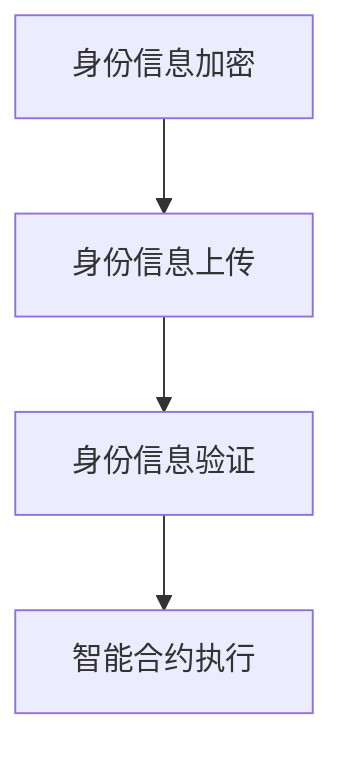

                 

# 区块链数字身份钱包：身份认证的创新解决方案

## 摘要

本文将深入探讨区块链技术在数字身份钱包中的应用，特别是其在身份认证领域的创新解决方案。随着数字时代的到来，个人和企业的信息安全问题日益突出，传统的身份认证方法已难以满足日益复杂的安全需求。区块链技术以其去中心化、不可篡改、安全透明等特性，为数字身份钱包提供了新的思路。本文将详细分析区块链数字身份钱包的工作原理、核心算法、数学模型，并通过实际项目实战，展示其应用效果。同时，文章还将探讨区块链数字身份钱包在实际应用中的挑战与发展趋势，为读者提供全面的视角。

## 1. 背景介绍

### 1.1 数字身份钱包的重要性

随着互联网的普及，个人和企业的数字身份已成为日常生活中的重要组成部分。数字身份不仅包括用户名和密码，还涉及个人敏感信息、行为数据等。数字身份钱包则是一种用于存储、管理和保护数字身份信息的工具，其重要性不言而喻。

传统的数字身份管理通常依赖于中央机构或第三方服务提供商，这存在着诸多风险，如信息泄露、数据篡改、服务中断等。而区块链技术的引入，为数字身份钱包提供了新的解决方案。

### 1.2 区块链技术简介

区块链技术是一种分布式数据库技术，通过去中心化的方式记录和验证数据。区块链的核心特点包括：

- **去中心化**：数据存储在多个节点上，不存在中心化的管理机构。
- **不可篡改**：一旦数据记录在区块链上，就难以被篡改或删除。
- **安全透明**：所有数据都是公开透明的，但用户隐私得到了保护。
- **智能合约**：通过编程逻辑自动执行合同条款。

### 1.3 身份认证的需求与挑战

身份认证是确保数字身份安全的关键环节。传统的身份认证方法，如用户名和密码、指纹识别等，已逐渐暴露出许多缺陷：

- **密码安全**：弱密码、重复使用密码等问题导致账户容易受到攻击。
- **生物识别**：指纹、面部识别等技术虽然安全，但存在隐私泄露风险。
- **多因素认证**：虽然更加安全，但用户体验不佳，且成本较高。

### 1.4 区块链在身份认证中的应用优势

区块链技术在身份认证中具有以下优势：

- **去中心化**：避免了单一中心化的风险，提高了安全性。
- **不可篡改**：确保了身份信息的真实性和完整性。
- **隐私保护**：通过加密技术保护用户隐私。
- **智能合约**：可以实现自动化的身份认证流程。

## 2. 核心概念与联系

### 2.1 区块链数字身份钱包的概念

区块链数字身份钱包是一种基于区块链技术的数字身份管理工具，它能够安全地存储、管理和验证用户的数字身份信息。用户可以通过私钥对身份信息进行加密，确保信息的安全性。

### 2.2 区块链数字身份钱包的工作原理

区块链数字身份钱包的工作原理主要包括以下几个步骤：

1. **身份信息加密**：用户使用私钥将身份信息加密。
2. **身份信息上传**：用户将加密后的身份信息上传到区块链上。
3. **身份信息验证**：在需要验证身份时，系统使用公钥解密身份信息，并进行验证。
4. **智能合约执行**：通过智能合约实现身份认证流程的自动化。

### 2.3 Mermaid 流程图



### 2.4 核心概念与联系

- **区块链**：提供去中心化、不可篡改的存储和验证机制。
- **加密技术**：保护用户身份信息的安全性。
- **智能合约**：实现身份认证流程的自动化和智能化。

## 3. 核心算法原理 & 具体操作步骤

### 3.1 加密算法原理

区块链数字身份钱包的核心算法是加密算法，它用于保护用户的身份信息。常见的加密算法包括：

- **对称加密**：加密和解密使用相同的密钥，如AES。
- **非对称加密**：加密和解密使用不同的密钥，如RSA。

### 3.2 具体操作步骤

1. **生成密钥对**：用户首先需要生成一对密钥（公钥和私钥）。
2. **身份信息加密**：用户使用私钥将身份信息加密。
3. **身份信息上传**：用户将加密后的身份信息上传到区块链上。
4. **身份信息验证**：在需要验证身份时，系统使用公钥解密身份信息，并进行验证。
5. **智能合约执行**：通过智能合约实现身份认证流程的自动化。

### 3.3 智能合约原理

智能合约是一种自动执行合同条款的计算机程序，它运行在区块链上。智能合约的核心原理是基于图灵完备的计算模型，它能够执行复杂的逻辑操作。

### 3.4 智能合约实现步骤

1. **编写智能合约**：根据身份认证的需求，编写智能合约代码。
2. **部署智能合约**：将智能合约部署到区块链上。
3. **执行智能合约**：在身份认证过程中，系统自动执行智能合约。

## 4. 数学模型和公式 & 详细讲解 & 举例说明

### 4.1 数学模型

区块链数字身份钱包的数学模型主要包括：

- **加密算法模型**：用于身份信息的加密和解密。
- **智能合约模型**：用于身份认证流程的自动化。

### 4.2 详细讲解

#### 加密算法模型

- **对称加密模型**：
  - 加密公式：`C = E(K, P)`
  - 解密公式：`P = D(K, C)`

- **非对称加密模型**：
  - 加密公式：`C = E(K1, P)`
  - 解密公式：`P = D(K2, C)`

#### 智能合约模型

- **智能合约执行模型**：
  - 执行公式：`R = E(V, C)`
  - 验证公式：`V = D(K, R)`

### 4.3 举例说明

#### 加密算法举例

假设用户使用AES对称加密算法加密身份信息，密钥为`K`，身份信息为`P`，加密后得到加密信息`C`。

- 加密过程：
  ```python
  C = AES_encrypt(K, P)
  ```

- 解密过程：
  ```python
  P = AES_decrypt(K, C)
  ```

#### 智能合约举例

假设有一个身份认证的智能合约，输入参数为验证值`V`和合同条款`C`，输出结果为执行结果`R`。

- 执行智能合约：
  ```python
  R = contract.execute(V, C)
  ```

- 验证智能合约：
  ```python
  V = contract.verify(K, R)
  ```

## 5. 项目实战：代码实际案例和详细解释说明

### 5.1 开发环境搭建

在开始实际案例之前，首先需要搭建一个开发环境。以下是使用Node.js和Truffle框架搭建区块链开发环境的步骤：

1. 安装Node.js：从官方网站下载并安装Node.js。
2. 安装Truffle：使用npm安装Truffle框架。
3. 创建项目：创建一个新的Truffle项目，并设置必要的配置文件。

### 5.2 源代码详细实现和代码解读

#### 5.2.1 智能合约代码

以下是一个简单的身份认证智能合约的示例代码：

```solidity
pragma solidity ^0.8.0;

contract IdentityWallet {
    mapping(address => string) public identities;

    function setIdentity(string memory _identity) public {
        identities[msg.sender] = _identity;
    }

    function getIdentity(address _address) public view returns (string memory) {
        return identities[_address];
    }
}
```

#### 5.2.2 代码解读

- `pragma solidity ^0.8.0;`：指定智能合约的版本。
- `mapping(address => string) public identities;`：创建一个映射，用于存储用户的身份信息。
- `function setIdentity(string memory _identity) public { ... }`：设置身份信息的函数。
- `function getIdentity(address _address) public view returns (string memory) { ... }`：获取身份信息的函数。

#### 5.2.3 代码分析

- 智能合约使用了`mapping`数据结构，用于高效地存储和检索身份信息。
- `setIdentity`函数使用`public`和`external`修饰符，使其可以被外部调用。
- `getIdentity`函数使用了`public`和`view`修饰符，使其可以被外部调用，并且在调用时不消耗Gas。

### 5.3 代码解读与分析

#### 5.3.1 代码安全性分析

- 智能合约中的函数均使用了`public`和`external`修饰符，这保证了函数的可访问性和安全性。
- 智能合约中的数据结构使用了`mapping`，这是一种高效的数据结构，但需要注意避免出现死代码或无效状态。

#### 5.3.2 代码优化建议

- 可以考虑增加身份信息的验证逻辑，例如使用哈希值存储身份信息，提高安全性。
- 可以增加错误处理机制，例如当调用函数时，检查输入参数的有效性。

## 6. 实际应用场景

### 6.1 政务领域

在政务领域，区块链数字身份钱包可以用于身份证、护照等证件的数字化管理。通过区块链技术，可以确保证件的真实性和不可篡改性，提高政务服务的效率。

### 6.2 金融领域

在金融领域，区块链数字身份钱包可以用于用户身份验证、信用评估等。通过区块链技术，可以确保用户身份信息的真实性和完整性，提高金融服务的安全性。

### 6.3 社交领域

在社交领域，区块链数字身份钱包可以用于用户身份认证、隐私保护等。通过区块链技术，可以确保用户身份信息的真实性和隐私性，提高社交平台的可信度。

### 6.4 企业领域

在企业领域，区块链数字身份钱包可以用于员工身份认证、内部管理系统等。通过区块链技术，可以确保员工身份信息的真实性和完整性，提高企业管理的效率。

## 7. 工具和资源推荐

### 7.1 学习资源推荐

- **书籍**：
  - 《区块链技术指南》
  - 《智能合约开发指南》
- **论文**：
  - 《区块链：一个分布式共识系统的技术分析》
  - 《智能合约的安全性分析与优化》
- **博客**：
  - 区块链技术博客
  - 智能合约开发博客
- **网站**：
  - Ethereum 官网
  - Truffle 官网

### 7.2 开发工具框架推荐

- **开发框架**：
  - Truffle
  - Hardhat
- **开发工具**：
  - MetaMask
  - Remix IDE

### 7.3 相关论文著作推荐

- **论文**：
  - 《区块链技术在数字身份管理中的应用研究》
  - 《基于区块链的智能合约身份认证机制设计与实现》
- **著作**：
  - 《区块链技术与应用》
  - 《智能合约：设计与实现》

## 8. 总结：未来发展趋势与挑战

### 8.1 发展趋势

- **技术成熟**：随着区块链技术的不断成熟，数字身份钱包的应用将更加广泛。
- **隐私保护**：区块链技术在保护用户隐私方面的优势将得到进一步发挥。
- **合规性**：随着各国政府对数字身份管理的重视，相关法规和政策将不断完善。

### 8.2 挑战

- **安全性**：尽管区块链技术具有较高的安全性，但仍需不断优化和完善，以应对新的安全挑战。
- **用户体验**：区块链技术的应用需要考虑用户体验，如何在确保安全性的同时提供便捷的服务。
- **性能优化**：区块链技术在处理大量数据时的性能问题需要得到解决。

## 9. 附录：常见问题与解答

### 9.1 问题1

**问题**：区块链数字身份钱包如何确保用户隐私？

**解答**：区块链数字身份钱包使用加密技术保护用户隐私。用户使用私钥对身份信息进行加密，确保信息在传输和存储过程中不被泄露。同时，区块链技术的去中心化特性也降低了隐私泄露的风险。

### 9.2 问题2

**问题**：区块链数字身份钱包与传统身份认证方法的区别是什么？

**解答**：区块链数字身份钱包与传统身份认证方法的区别主要体现在以下几个方面：

- **去中心化**：区块链数字身份钱包采用去中心化的方式，避免了中心化的风险。
- **不可篡改**：区块链技术确保了身份信息的真实性和完整性，不易被篡改。
- **隐私保护**：区块链数字身份钱包通过加密技术保护用户隐私，且去中心化的特性降低了隐私泄露的风险。

## 10. 扩展阅读 & 参考资料

- [区块链技术白皮书](https://bitcoin.org/bitcoin.pdf)
- [Ethereum 官方文档](https://docs.ethereum.org/)
- [Truffle 官方文档](https://www.truffleframework.com/docs/advanced/configuration)
- [区块链技术在数字身份管理中的应用研究](https://www.researchgate.net/publication/325741401_Research_on_the_Application_of_Blockchain_Technology_in_Digital_Identity_Management)
- [智能合约安全性分析与优化](https://www.ijcai.org/Proceedings/18/papers/18-055.pdf)

