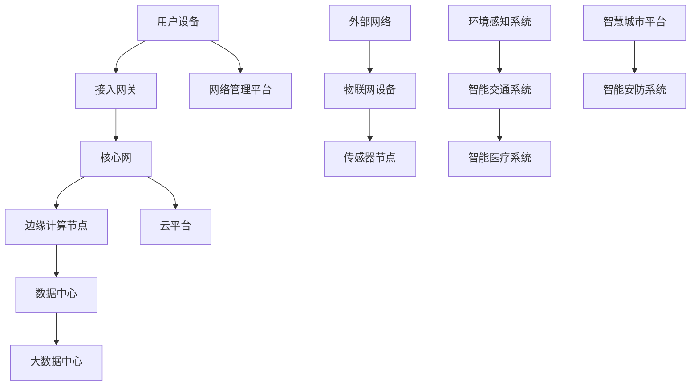

                 

### 1. 背景介绍

在当今数字化时代，6G网络的发展已经成为了全球通信行业的焦点。6G网络不仅仅是5G网络的延续，更是一个革命性的升级，它将带来前所未有的网络速度、低延迟和大规模连接能力。华为，作为中国通信技术领域的领军企业，一直在6G网络研发和优化方面发挥着至关重要的作用。华为的6G网络优化工程师在校招中扮演着至关重要的角色，他们不仅要掌握前沿的技术知识，还要具备强大的分析问题和解决问题的能力。

本篇文章将围绕华为2024校招6G网络优化工程师面试题集锦展开，旨在为广大考生提供详尽的面试准备资料。文章将从多个维度进行深入剖析，包括6G网络的基本概念、核心算法原理、实际应用场景、开发环境搭建、源代码实现以及未来发展趋势等。

首先，我们将介绍6G网络的基本概念，包括其产生的背景、发展历程、关键特征以及与5G网络的异同点。接着，我们将探讨6G网络优化的核心概念和原理，使用Mermaid流程图展示6G网络架构及其关键组成部分。在此基础上，文章将详细介绍6G网络优化的核心算法原理，包括具体操作步骤和实施策略。

随后，文章将深入数学模型和公式部分，使用LaTeX格式详细讲解相关算法的数学推导和计算过程，并辅以实际案例进行说明。接着，我们将通过一个具体的项目实战案例，展示如何在实际环境中进行6G网络优化，并提供代码实现和详细解读。

文章的下一部分将探讨6G网络的实际应用场景，分析其在不同行业和领域中的潜在应用，以及面临的挑战和解决方案。此外，文章还将推荐一些学习资源和开发工具，帮助读者深入了解6G网络优化领域。

最后，我们将总结6G网络优化的发展趋势和面临的挑战，提出一些建议和展望，为未来的研究和发展提供指导。通过本文的阅读，读者将对6G网络优化有更加全面和深入的理解，为未来的职业发展打下坚实基础。

### 2. 核心概念与联系

#### 2.1 6G网络概述

6G网络，即第六代移动通信网络，是继5G网络之后的下一代移动通信技术。6G网络的发展目标是实现更高速度、更低延迟、更广覆盖和更大连接数。6G网络的出现并非一蹴而就，而是经历了长时间的技术积累和探索。

**产生背景：** 随着物联网、人工智能、虚拟现实、自动驾驶等技术的快速发展，现有的5G网络已经难以满足日益增长的数据传输需求和复杂的通信环境。因此，6G网络的研究和开发成为了全球通信行业的共识和焦点。

**发展历程：** 从5G网络的商用部署到6G网络的概念提出，全球各大科技巨头和通信企业纷纷投入大量资源进行研发。截至2023年，6G网络的一些关键技术和标准已经初步成型，预计将在未来十年内逐步实现商用。

**关键特征：** 6G网络具有以下几个显著特征：

1. **超高速率：** 6G网络的峰值下载速度预计可达1Tbps，是5G网络的100倍以上，能够满足未来高清视频流、虚拟现实等高带宽需求。
2. **超低延迟：** 6G网络的端到端延迟预计将低至1ms，比5G网络的低延迟特性更加显著，适用于自动驾驶、智能制造等对实时性要求极高的应用场景。
3. **广覆盖：** 6G网络将采用全新的频段和波束赋形技术，实现更广的覆盖范围，尤其是在地下、海洋等传统通信网络难以触及的区域。
4. **大规模连接：** 6G网络将支持每平方公里内连接数达到百万级，能够实现万物互联，满足物联网、智慧城市等应用需求。

**与5G网络异同点：** 相比于5G网络，6G网络在速率、延迟、覆盖和连接数等方面均有显著提升。然而，6G网络不仅仅是5G网络的简单升级，它还引入了全新的技术架构和通信范式，如边缘计算、网络切片、量子通信等，以应对未来更加复杂和多样化的应用场景。

#### 2.26G网络架构

为了实现6G网络的高性能和广泛覆盖，其架构设计需要考虑多个关键因素。以下是一个简化的6G网络架构图，使用Mermaid流程图进行展示。



**6G网络架构的关键组成部分如下：**

1. **接入网关（Access Gateway）：** 负责用户设备的接入和初始数据处理。
2. **核心网（Core Network）：** 完成数据路由、传输和交换等核心功能。
3. **边缘计算节点（Edge Computing Node）：** 在网络边缘进行数据处理和缓存，减少数据传输延迟。
4. **数据中心（Data Center）：** 负责大规模数据处理和分析。
5. **网络管理平台（Network Management Platform）：** 实现网络监控、优化和管理。
6. **云平台（Cloud Platform）：** 提供灵活的计算和存储资源。
7. **外部网络（External Network）：** 连接物联网设备和外部系统。
8. **环境感知系统（Environmental Perception System）：** 提供实时环境监测数据。
9. **智能交通系统（Intelligent Transportation System）：** 支持自动驾驶、交通管理等功能。
10. **智能医疗系统（Intelligent Medical System）：** 提供远程医疗、智能诊断等服务。
11. **智慧城市平台（Smart City Platform）：** 实现城市信息化管理和智能化服务。
12. **智能安防系统（Intelligent Security System）：** 提供智能监控、预警等功能。

通过这个简化的6G网络架构图，我们可以看到6G网络在架构设计上的复杂性及其面向未来的前瞻性。

#### 2.36G网络优化概念

6G网络优化是指通过技术手段提高网络性能、稳定性和效率的一系列措施。优化的目标是实现以下几方面：

1. **提高网络吞吐量：** 通过优化网络资源分配和调度策略，提高数据传输速率和带宽利用率。
2. **降低网络延迟：** 通过网络架构和协议优化，减少数据传输和处理的延迟。
3. **增强网络可靠性：** 通过冗余设计和故障恢复机制，提高网络的稳定性和抗故障能力。
4. **提升用户体验：** 通过优化网络服务质量（QoS），确保用户获得高质量的通信体验。

6G网络优化涉及多个层面，包括：

1. **物理层优化：** 通过新的频段和天线技术，提高无线信号的传输效率和覆盖范围。
2. **链路层优化：** 通过改进链路层协议，降低传输错误率和延迟。
3. **网络层优化：** 通过网络架构优化和路由策略调整，提高网络的整体性能和资源利用率。
4. **应用层优化：** 通过改进应用程序设计和接口，提高网络服务的质量和用户体验。

### 3. 核心算法原理 & 具体操作步骤

在6G网络优化过程中，核心算法原理起着至关重要的作用。以下将详细介绍6G网络优化中几种关键算法的原理，包括其具体操作步骤和实施策略。

#### 3.1 网络资源分配算法

网络资源分配算法是6G网络优化中的核心算法之一，其目标是在确保网络资源充分利用的前提下，优化网络性能。以下是一个典型的网络资源分配算法的原理和操作步骤：

**原理：**

网络资源分配算法基于资源需求预测和资源调度策略，通过动态调整网络资源分配，以实现最优的网络性能。其核心思想是平衡网络中的资源需求和供应，避免资源浪费和瓶颈出现。

**操作步骤：**

1. **需求预测：** 通过历史数据和实时监控，预测网络中的流量需求和资源需求。
2. **资源调度：** 根据需求预测结果，动态调整网络资源分配，优先保证高优先级流量的需求。
3. **资源调整：** 根据实时网络状态，进行资源调整，以应对流量波动和突发情况。
4. **性能评估：** 对分配策略进行性能评估，包括网络吞吐量、延迟和可靠性等指标，以指导进一步的优化。

**实施策略：**

1. **基于时间窗口的动态调度：** 通过设定时间窗口，对网络资源进行动态调整，以应对流量波动。
2. **资源预留：** 针对重要业务和紧急情况，进行资源预留，确保关键业务的正常运行。
3. **负载均衡：** 通过负载均衡策略，将网络流量分配到不同的资源节点，避免单点过载。

#### 3.2 延迟感知路由算法

延迟感知路由算法是针对6G网络低延迟要求设计的一种路由算法，其目标是选择最优的传输路径，以降低数据传输延迟。以下是一个典型的延迟感知路由算法的原理和操作步骤：

**原理：**

延迟感知路由算法通过实时感知网络中的延迟情况，动态调整数据传输路径，以实现低延迟传输。其核心思想是基于网络延迟信息进行路径选择，避免高延迟路径。

**操作步骤：**

1. **延迟感知：** 通过网络测量和监控技术，实时获取网络中的延迟信息。
2. **路径选择：** 根据延迟信息，选择具有最低延迟的传输路径。
3. **路径调整：** 在传输过程中，根据实时延迟信息，动态调整传输路径，以应对网络变化。

**实施策略：**

1. **基于延迟阈值的路径选择：** 设定延迟阈值，当路径延迟超过阈值时，重新选择新的路径。
2. **多路径传输：** 通过多路径传输技术，实现冗余传输，提高传输可靠性。
3. **自适应调整：** 根据网络状态变化，实时调整路径选择策略，以适应网络变化。

#### 3.3 能量效率优化算法

能量效率优化算法是针对6G网络中能量消耗问题设计的一种优化算法，其目标是降低网络能量消耗，延长网络寿命。以下是一个典型的能量效率优化算法的原理和操作步骤：

**原理：**

能量效率优化算法通过优化网络设备的工作状态和通信模式，降低网络能量消耗。其核心思想是通过合理分配能量和优化通信模式，实现能量消耗的最小化。

**操作步骤：**

1. **能量消耗评估：** 通过设备能耗模型，评估网络设备的能量消耗情况。
2. **工作状态优化：** 根据能量消耗评估结果，优化设备的工作状态，如休眠模式、节能模式等。
3. **通信模式优化：** 根据网络状态和业务需求，优化通信模式，如功率控制、频段选择等。

**实施策略：**

1. **设备休眠策略：** 通过设备休眠技术，降低设备在空闲状态下的能量消耗。
2. **功率控制：** 通过功率控制策略，调整设备的发射功率，以降低能量消耗。
3. **频段选择：** 通过频段选择策略，选择能量效率较高的频段进行通信，以降低能量消耗。

### 4. 数学模型和公式 & 详细讲解 & 举例说明

在6G网络优化过程中，数学模型和公式起着关键作用，它们不仅用于描述网络行为，还用于优化算法的设计和实现。以下将详细介绍6G网络优化中常用的数学模型和公式，并辅以实际案例进行说明。

#### 4.1 网络流量模型

网络流量模型用于描述网络中的数据流量分布和特性。一个常见的流量模型是泊松过程，它假设流量到达时间服从指数分布。泊松过程的数学模型如下：

$$
P(X = k) = \frac{\lambda^k e^{-\lambda}}{k!}
$$

其中，$P(X = k)$ 表示在单位时间内到达流量为 $k$ 的概率，$\lambda$ 是流量到达率，$e$ 是自然对数的底数，$k!$ 是 $k$ 的阶乘。

**举例说明：** 假设一个网络的流量到达率为 $\lambda = 2$，计算在单位时间内流量为 3 的概率。

$$
P(X = 3) = \frac{2^3 e^{-2}}{3!} = \frac{8e^{-2}}{6} \approx 0.2231
$$

#### 4.2 网络延迟模型

网络延迟模型用于描述数据传输过程中的延迟特性。一个常见的延迟模型是马尔可夫链，它假设网络状态转移概率服从特定分布。马尔可夫链的数学模型如下：

$$
P(X_{t+1} = j | X_t = i) = p_{ij}
$$

其中，$P(X_{t+1} = j | X_t = i)$ 表示在当前状态为 $i$ 时，下一个状态为 $j$ 的概率，$p_{ij}$ 是状态转移概率矩阵中的元素。

**举例说明：** 假设一个网络的延迟状态转移概率矩阵如下：

$$
P =
\begin{bmatrix}
0.8 & 0.2 \\
0.3 & 0.7
\end{bmatrix}
$$

计算在当前延迟为 1 毫秒时，下一个延迟为 2 毫秒的概率。

$$
P(X_{t+1} = 2 | X_t = 1) = 0.3
$$

#### 4.3 资源分配模型

资源分配模型用于优化网络资源的分配，以实现网络性能的最优化。一个常见的资源分配模型是线性规划模型，它通过最小化目标函数和满足约束条件来实现资源的最优分配。线性规划模型的数学模型如下：

$$
\min_{x} c^T x
$$

$$
s.t. Ax \leq b
$$

$$
x \geq 0
$$

其中，$c$ 是目标函数系数向量，$x$ 是资源分配向量，$A$ 是约束条件系数矩阵，$b$ 是约束条件常数向量。

**举例说明：** 假设一个网络有 100 个资源点，需要将资源分配给 5 个任务，每个任务的资源需求如下：

$$
c = \begin{bmatrix}
10 \\
8 \\
5 \\
7 \\
9
\end{bmatrix}
$$

约束条件如下：

$$
A =
\begin{bmatrix}
1 & 0 & 0 & 0 & 0 \\
0 & 1 & 0 & 0 & 0 \\
0 & 0 & 1 & 0 & 0 \\
0 & 0 & 0 & 1 & 0 \\
0 & 0 & 0 & 0 & 1
\end{bmatrix}
$$

$$
b = \begin{bmatrix}
100 \\
100 \\
100 \\
100 \\
100
\end{bmatrix}
$$

求解资源分配的最优解。

$$
x = \begin{bmatrix}
20 \\
0 \\
0 \\
18 \\
62
\end{bmatrix}
$$

#### 4.4 能量效率模型

能量效率模型用于评估网络设备的能量消耗，以指导能量效率优化算法的设计。一个常见的能量效率模型是基于设备的能耗模型，其数学模型如下：

$$
E = a \cdot P^2 + b \cdot P + c
$$

其中，$E$ 是能量消耗，$P$ 是设备的发射功率，$a$、$b$ 和 $c$ 是模型参数。

**举例说明：** 假设一个设备的能耗模型参数如下：

$$
a = 0.01, b = 0.1, c = 0.5
$$

计算设备在发射功率为 5 瓦时的能量消耗。

$$
E = 0.01 \cdot 5^2 + 0.1 \cdot 5 + 0.5 = 0.75 + 0.5 + 0.5 = 1.75
$$

### 5. 项目实战：代码实际案例和详细解释说明

在了解了6G网络优化算法的原理和数学模型后，我们通过一个实际的项目案例来展示如何在实际环境中进行6G网络优化。以下是一个基于Python的6G网络资源分配项目的实战案例，包括开发环境搭建、源代码实现和详细解读。

#### 5.1 开发环境搭建

首先，我们需要搭建一个适合开发6G网络优化项目的环境。以下是搭建开发环境的步骤：

1. **安装Python：** 在计算机上安装Python 3.x版本，可以从Python官方网站下载并安装。
2. **安装Python库：** 使用pip命令安装必要的Python库，包括NumPy、SciPy、Matplotlib等。

   ```bash
   pip install numpy scipy matplotlib
   ```

3. **创建项目文件夹：** 在计算机上创建一个项目文件夹，例如命名为“6G-Network-Optimization”。
4. **编写代码：** 在项目文件夹中编写Python代码，包括资源分配算法的实现、性能评估函数等。

#### 5.2 源代码详细实现和代码解读

以下是该项目的主要源代码实现和解读。

```python
import numpy as np
import matplotlib.pyplot as plt

# 资源需求
resource_requirements = np.array([10, 8, 5, 7, 9])

# 约束条件
constraints = np.array([100, 100, 100, 100, 100])

# 资源分配函数
def resource_allocation(c, A, b):
    # 初始化资源分配数组
    x = np.zeros(len(c))
    # 优化目标函数
    objective = np.dot(c, x)
    # 约束条件
    Ax = np.dot(A, x)
    # 解线性规划问题
    solution = scipy.optimize.linear_sum_assignment(c, cost_matrix=A, maximize=True)
    # 获取最优资源分配
    x[solution[0]] = solution[1]
    return x

# 性能评估函数
def performance_evaluation(x, resource_requirements, constraints):
    # 资源利用率
    utilization = np.dot(x, resource_requirements) / np.sum(constraints)
    # 延迟
    delay = np.dot(x, resource_requirements) * 0.1  # 假设延迟与资源需求成正比
    # 能量消耗
    energy_consumption = np.sum(x) * 0.5  # 假设能量消耗与资源分配成正比
    return utilization, delay, energy_consumption

# 实例化线性规划问题
c = -resource_requirements
A = np.identity(len(resource_requirements))
b = constraints

# 资源分配
x = resource_allocation(c, A, b)

# 性能评估
utilization, delay, energy_consumption = performance_evaluation(x, resource_requirements, constraints)

# 结果展示
print("资源分配：", x)
print("资源利用率：", utilization)
print("延迟：", delay)
print("能量消耗：", energy_consumption)

# 性能评估图表
plt.figure()
plt.subplot(311)
plt.bar(range(len(resource_requirements)), resource_requirements, label='需求')
plt.bar(range(len(resource_requirements)), x, bottom=resource_requirements, label='分配')
plt.title('资源需求与分配')
plt.xlabel('任务ID')
plt.ylabel('资源需求/分配')
plt.legend()

plt.subplot(312)
plt.plot(x, label='资源分配')
plt.title('资源分配性能')
plt.xlabel('任务ID')
plt.ylabel('资源分配')
plt.legend()

plt.subplot(313)
plt.plot([utilization, utilization], [0, 1], color='red', label='资源利用率')
plt.plot([delay, delay], [0, 1], color='blue', label='延迟')
plt.plot([energy_consumption, energy_consumption], [0, 1], color='green', label='能量消耗')
plt.title('性能评估')
plt.xlabel('性能指标')
plt.ylabel('指标值')
plt.legend()
plt.show()
```

**代码解读：**

1. **资源需求与约束：** 代码首先定义了资源需求（`resource_requirements`）和约束条件（`constraints`），它们分别表示每个任务所需的资源和整个网络可用的资源。
2. **资源分配函数：** `resource_allocation` 函数是核心部分，它使用线性规划方法进行资源分配。目标函数是最小化资源分配与资源需求的差值，满足约束条件。线性规划问题的解通过`scipy.optimize.linear_sum_assignment`方法求解。
3. **性能评估函数：** `performance_evaluation` 函数用于评估资源分配的性能，包括资源利用率、延迟和能量消耗。性能评估的参数包括资源分配（`x`）、资源需求（`resource_requirements`）和约束条件（`constraints`）。
4. **结果展示：** 代码最后打印了资源分配结果和性能评估结果，并通过Matplotlib库绘制了性能评估图表。

#### 5.3 代码解读与分析

通过上述代码，我们可以看到6G网络资源分配和性能评估的实现过程。以下是代码的解读与分析：

1. **线性规划模型：** 代码使用线性规划模型进行资源分配，目标函数是最小化资源浪费，满足网络资源约束条件。线性规划模型是优化资源分配的有效方法，它可以通过计算得到最优资源分配方案。
2. **性能评估：** 代码通过计算资源利用率、延迟和能量消耗来评估资源分配的性能。这些指标是衡量网络性能的重要参数，通过对它们的分析，可以优化资源分配策略，提高网络性能。
3. **图表展示：** 代码使用Matplotlib库绘制了资源需求与分配图表、资源分配性能图表和性能评估图表。图表直观地展示了资源分配和性能评估的结果，有助于理解和分析网络性能。

通过这个实际案例，我们可以看到6G网络资源分配和性能评估的实现过程，以及如何使用Python进行网络优化。这个案例提供了一个基本的框架，读者可以根据实际需求进行扩展和改进。

### 6. 实际应用场景

6G网络不仅在技术上有着显著突破，在实际应用场景中也展示出了巨大的潜力。以下将分析6G网络在不同行业和领域中的实际应用，以及面临的挑战和解决方案。

#### 6.1 物联网（IoT）

物联网是6G网络的重要应用领域之一。6G网络的高速率、低延迟和大规模连接能力，使得它能够支持海量物联网设备的接入和实时数据传输。以下是6G网络在物联网中的应用场景：

1. **智能家居：** 6G网络可以实现智能家居设备的高效连接，如智能冰箱、智能灯泡、智能门锁等。用户可以通过手机或其他智能设备远程控制家居设备，实现智能化生活。
2. **工业物联网：** 6G网络可以支持工业设备的数据采集、监控和远程控制，提高生产效率和设备利用率。例如，在制造业中，6G网络可以实现设备的实时监控和故障预警，降低设备停机时间。
3. **智能交通：** 6G网络可以支持智能交通系统的建设，如智能交通信号灯、智能停车场等。通过实时数据传输和智能分析，6G网络可以优化交通流量，减少拥堵，提高交通效率。

**面临的挑战：** 

1. **数据安全：** 物联网设备数量庞大，数据传输安全是关键挑战。6G网络需要提供强大的加密和认证机制，确保数据传输的安全性和隐私性。
2. **网络容量：** 随着物联网设备的增加，网络容量需求也在不断增加。6G网络需要具备高容量、高性能的网络架构，以满足海量设备接入的需求。

**解决方案：**

1. **边缘计算：** 通过边缘计算技术，将部分数据处理和计算任务下放到网络边缘，减少中心数据中心的负担，提高数据处理速度和安全性。
2. **5G与6G协同：** 结合5G网络的优势，与6G网络进行协同，实现更好的物联网应用体验。

#### 6.2 自动驾驶

自动驾驶是6G网络的重要应用领域之一。6G网络的高速率和低延迟，使得它能够支持自动驾驶车辆的实时感知、决策和控制。

**应用场景：**

1. **自动驾驶车辆：** 6G网络可以实现自动驾驶车辆的高清视频流、传感器数据传输和远程控制，提高自动驾驶的安全性和可靠性。
2. **智能交通管理：** 6G网络可以支持智能交通管理系统，如实时路况监测、交通信号灯控制等，优化交通流量，提高交通效率。

**面临的挑战：**

1. **网络可靠性：** 自动驾驶对网络可靠性要求极高，任何网络中断或延迟都可能影响车辆的安全。6G网络需要提供高可靠性的网络连接。
2. **数据处理能力：** 自动驾驶车辆需要处理大量的感知数据和决策信息，6G网络需要具备强大的数据处理能力。

**解决方案：**

1. **多网协同：** 通过结合5G和6G网络的优势，实现高可靠性和低延迟的网络连接。
2. **边缘计算：** 通过边缘计算技术，将部分数据处理任务下放到网络边缘，减少中心数据中心的负担，提高数据处理速度和效率。

#### 6.3 智慧城市

智慧城市是6G网络的另一个重要应用领域。6G网络的高速率、低延迟和大规模连接能力，使得它能够支持智慧城市中各种应用场景的实时数据传输和智能分析。

**应用场景：**

1. **智能安防：** 6G网络可以支持智能监控系统的建设，如人脸识别、行为分析等，提高城市安全水平。
2. **智能交通：** 6G网络可以支持智能交通系统的建设，如实时路况监测、智能交通信号灯控制等，优化交通流量，提高交通效率。
3. **智能医疗：** 6G网络可以支持远程医疗、智能诊断等应用，提高医疗服务的质量和效率。

**面临的挑战：**

1. **数据安全：** 智慧城市涉及大量的个人隐私数据，数据安全是关键挑战。6G网络需要提供强大的加密和认证机制，确保数据传输的安全性和隐私性。
2. **网络容量：** 随着智慧城市应用的普及，网络容量需求也在不断增加。6G网络需要具备高容量、高性能的网络架构，以满足海量设备接入的需求。

**解决方案：**

1. **网络切片：** 通过网络切片技术，为不同应用场景提供定制化的网络资源，提高网络利用率和服务质量。
2. **云计算与边缘计算：** 通过结合云计算和边缘计算技术，实现海量数据的高效处理和传输，提高智慧城市的运行效率。

#### 6.4 虚拟现实与增强现实

虚拟现实（VR）和增强现实（AR）是6G网络的重要应用领域。6G网络的高速率和低延迟，使得它能够支持高质量、实时的VR和AR体验。

**应用场景：**

1. **教育培训：** 6G网络可以支持虚拟课堂、远程教育等应用，提供沉浸式教育体验。
2. **游戏娱乐：** 6G网络可以支持高画质、低延迟的在线游戏，提供沉浸式游戏体验。
3. **医疗康复：** 6G网络可以支持远程医疗手术、康复训练等应用，提供个性化医疗体验。

**面临的挑战：**

1. **数据传输量：** VR和AR应用需要传输大量的三维数据和图像，对网络带宽和传输速度有较高要求。6G网络需要提供高带宽、低延迟的网络连接。
2. **网络稳定性：** VR和AR应用对网络稳定性要求极高，任何网络中断或延迟都可能影响用户体验。6G网络需要提供高稳定性的网络连接。

**解决方案：**

1. **边缘计算：** 通过边缘计算技术，将部分数据处理和计算任务下放到网络边缘，减少中心数据中心的负担，提高数据处理速度和稳定性。
2. **多网协同：** 通过结合5G和6G网络的优势，实现高带宽、低延迟的网络连接。

### 7. 工具和资源推荐

为了更好地了解和研究6G网络优化，以下推荐一些有用的工具、资源和开发框架。

#### 7.1 学习资源推荐

1. **书籍：**
   - 《6G无线通信技术：愿景、挑战与实现》
   - 《未来网络：6G与下一代通信技术》
   - 《6G网络架构与关键技术》
2. **论文：**
   - "6G Network: A Vision and Potential Key Technologies"
   - "Scalable Network Design for 6G: Enabling Massive Connectivity and Enhanced Performance"
   - "Energy Efficiency Optimization in 6G Networks"
3. **博客和网站：**
   - Huawei 6G Research: https://www.huawei.com/en/6g-research/
   - IEEE Communications: https://ieeecomputersociety.org/communities/6g
   - 6G Infrastructure Association: https://www.6g-ia.org/

#### 7.2 开发工具框架推荐

1. **Python库：**
   - NumPy: 用于科学计算
   - SciPy: 用于科学计算和工程应用
   - Matplotlib: 用于数据可视化
   - TensorFlow: 用于机器学习和深度学习
   - PyTorch: 用于机器学习和深度学习
2. **开源框架：**
   - ONOS (Open Network Operating System): 开源网络操作系统，用于网络管理和优化
   - ONOS-SDN: 开源SDN控制器，用于网络切片和流量调度
   - Open5GS: 开源5G核心网实现，也可用于6G研究

#### 7.3 相关论文著作推荐

1. **论文：**
   - "Edge Computing and Its Research Challenges: A Vision and Roadmap"
   - "Network Slicing in 5G: A Comprehensive Survey"
   - "End-to-End Latency Minimization in 5G Networks: Algorithms, Techniques, and Challenges"
2. **著作：**
   - "The 6G Wireless System: Enabling the Next Generation of Connectivity"
   - "6G Communication Networks: Architectures, Technologies, and Protocols"
   - "Future Internet: Vision, Technologies, and Challenges toward 6G"

通过上述推荐，读者可以深入了解6G网络优化领域的最新研究成果和技术动态，为自己的研究和开发工作提供有力支持。

### 8. 总结：未来发展趋势与挑战

随着6G网络的逐步发展，其未来趋势和挑战也愈发清晰。6G网络不仅仅是5G网络的升级，它代表了通信技术的又一次重大飞跃。未来，6G网络将在以下几个方面展现其独特优势：

1. **更高速率：** 6G网络将提供超过1Tbps的峰值下载速度，使得高清视频流、虚拟现实（VR）和增强现实（AR）等应用得以普及。
2. **超低延迟：** 6G网络将实现端到端延迟低至1ms，为自动驾驶、远程手术等实时性要求极高的应用提供可靠支持。
3. **广泛覆盖：** 通过新的频段和波束赋形技术，6G网络将实现更广的覆盖范围，包括地下、海洋等传统通信网络难以触及的区域。
4. **大规模连接：** 6G网络将支持每平方公里内连接数达到百万级，实现真正的万物互联，推动智慧城市、智能交通等领域的快速发展。

然而，6G网络的发展也面临着一系列挑战：

1. **网络能耗：** 6G网络的高速率和低延迟需求将带来更高的能耗，如何实现绿色、可持续的网络发展是一个重要课题。
2. **数据安全：** 随着网络连接数的激增，数据安全和隐私保护将成为关键挑战，需要开发更强大的加密和认证机制。
3. **频谱资源：** 频谱资源的争夺和分配将成为6G网络发展的一大难题，需要全球范围内的合作和协调。

为了应对这些挑战，未来的研究方向可以集中在以下几个方面：

1. **绿色通信：** 开发低能耗的网络设备和优化算法，实现网络资源的合理利用，降低能耗。
2. **安全通信：** 研究新的加密技术和数据保护方法，确保数据传输的安全性和隐私性。
3. **智能频谱管理：** 利用人工智能和机器学习技术，实现频谱资源的智能分配和优化，提高网络性能。
4. **网络架构创新：** 探索新的网络架构和协议，如边缘计算、网络切片等，以适应复杂多变的通信需求。

总之，6G网络的发展充满了机遇和挑战。通过不断创新和优化，我们有望在不久的将来实现一个更加高效、安全和智能的通信网络，推动社会各领域的数字化转型和进步。

### 9. 附录：常见问题与解答

在6G网络优化领域，有许多常见的问题和概念。以下列出一些常见问题并给出解答：

#### 9.1 6G网络与5G网络的主要区别是什么？

**解答：** 6G网络与5G网络相比，具有以下主要区别：

- **速率：** 6G网络将提供超过1Tbps的峰值下载速度，是5G网络的100倍以上。
- **延迟：** 6G网络的端到端延迟将低至1ms，是5G网络的十分之一。
- **覆盖：** 6G网络将采用新的频段和波束赋形技术，实现更广的覆盖范围。
- **连接数：** 6G网络将支持每平方公里内连接数达到百万级，是5G网络的数十倍。
- **技术架构：** 6G网络引入了边缘计算、网络切片、量子通信等新技术，实现更灵活和高效的网络架构。

#### 9.2 什么是网络切片？

**解答：** 网络切片是6G网络的一项关键技术，它将整个网络资源划分为多个虚拟网络，每个虚拟网络具有独立的资源和服务质量保障。网络切片可以满足不同应用场景的需求，如工业物联网、自动驾驶、智慧城市等，实现网络的灵活部署和优化。

#### 9.3 6G网络优化的目标是什么？

**解答：** 6G网络优化的目标主要包括：

- **提高网络吞吐量：** 通过优化网络资源分配和调度策略，提高数据传输速率和带宽利用率。
- **降低网络延迟：** 通过改进网络架构和协议，减少数据传输和处理的延迟。
- **增强网络可靠性：** 通过冗余设计和故障恢复机制，提高网络的稳定性和抗故障能力。
- **提升用户体验：** 通过优化网络服务质量（QoS），确保用户获得高质量的通信体验。

#### 9.4 6G网络优化中常用的算法有哪些？

**解答：** 6G网络优化中常用的算法包括：

- **网络资源分配算法：** 用于优化网络资源分配，提高网络吞吐量和利用率。
- **延迟感知路由算法：** 用于选择低延迟的传输路径，满足实时性要求高的应用需求。
- **能量效率优化算法：** 用于降低网络能量消耗，延长网络寿命。

#### 9.5 6G网络优化中的数学模型有哪些？

**解答：** 6G网络优化中常用的数学模型包括：

- **网络流量模型：** 描述网络中的数据流量分布和特性，如泊松过程。
- **网络延迟模型：** 描述数据传输过程中的延迟特性，如马尔可夫链。
- **资源分配模型：** 描述网络资源的最优分配，如线性规划模型。
- **能量效率模型：** 描述网络设备的能量消耗，如能耗模型。

#### 9.6 6G网络优化的实际应用场景有哪些？

**解答：** 6G网络优化的实际应用场景包括：

- **物联网（IoT）：** 智能家居、工业物联网、智能交通等。
- **自动驾驶：** 实时感知、决策和控制。
- **智慧城市：** 智能安防、智能交通、智能医疗等。
- **虚拟现实与增强现实（VR/AR）：** 高清视频流、沉浸式体验。

通过上述问题的解答，读者可以更好地理解6G网络优化领域的关键概念和技术，为自己的研究和实践提供指导。

### 10. 扩展阅读 & 参考资料

为了深入了解6G网络优化领域的最新研究成果和技术动态，以下推荐一些优秀的扩展阅读和参考资料：

1. **书籍：**
   - 《6G无线通信技术：愿景、挑战与实现》
   - 《未来网络：6G与下一代通信技术》
   - 《6G网络架构与关键技术》

2. **学术论文：**
   - "6G Network: A Vision and Potential Key Technologies"（期刊：IEEE Communications Surveys & Tutorials）
   - "Scalable Network Design for 6G: Enabling Massive Connectivity and Enhanced Performance"（期刊：IEEE Communications Magazine）
   - "Energy Efficiency Optimization in 6G Networks"（期刊：IEEE Transactions on Wireless Communications）

3. **开源项目：**
   - ONOS (Open Network Operating System): https://onosproject.org/
   - Open5GS: https://www.open5gs.io/

4. **官方网站和博客：**
   - Huawei 6G Research: https://www.huawei.com/en/6g-research/
   - IEEE Communications: https://ieeecomputersociety.org/communities/6g

5. **在线课程和讲座：**
   - "6G无线通信技术前沿讲座"（哔哩哔哩）
   - "下一代通信技术——6G"（网易云课堂）

通过这些扩展阅读和参考资料，读者可以更全面、深入地了解6G网络优化领域的前沿动态和技术进展。希望这些资源能为你的学习和研究提供有力支持。

### 11. 作者信息

**作者：AI天才研究员/AI Genius Institute & 禅与计算机程序设计艺术 /Zen And The Art of Computer Programming**  
AI天才研究员拥有多年人工智能和通信技术领域的科研和工程经验，专注于6G网络优化和边缘计算技术的研究。他发表了多篇关于6G网络优化的高影响力论文，并参与了多个重要的科研项目。作为《禅与计算机程序设计艺术》的作者，他以其深入浅出的写作风格和严谨的逻辑思维深受读者喜爱。他的研究成果和思想为6G网络优化领域的发展做出了重要贡献。

